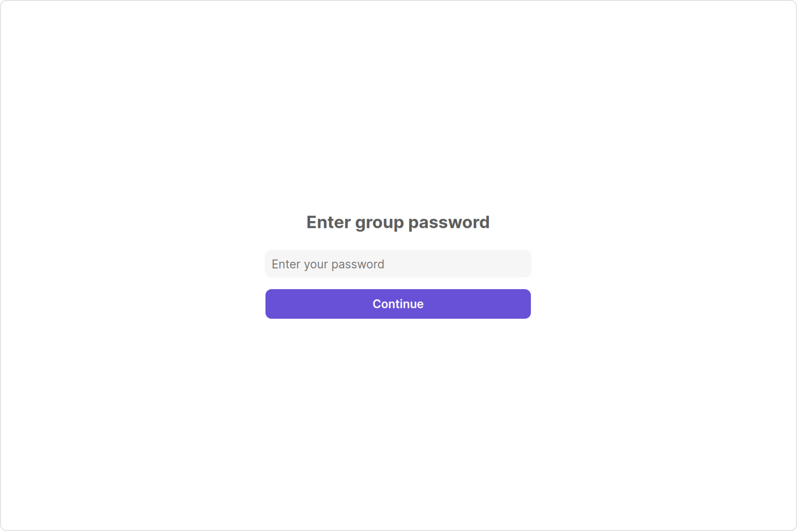
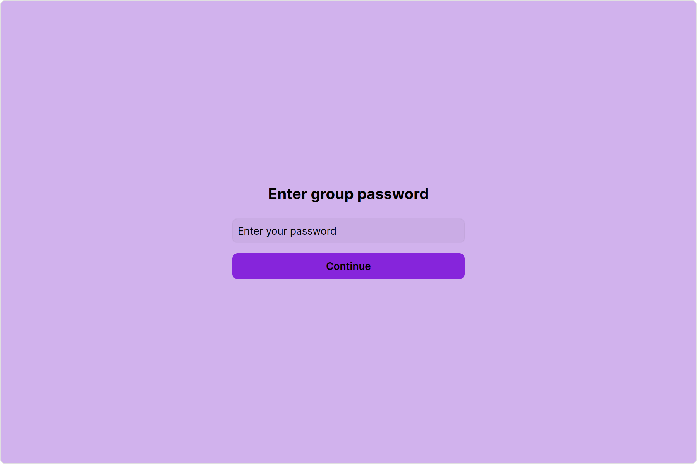
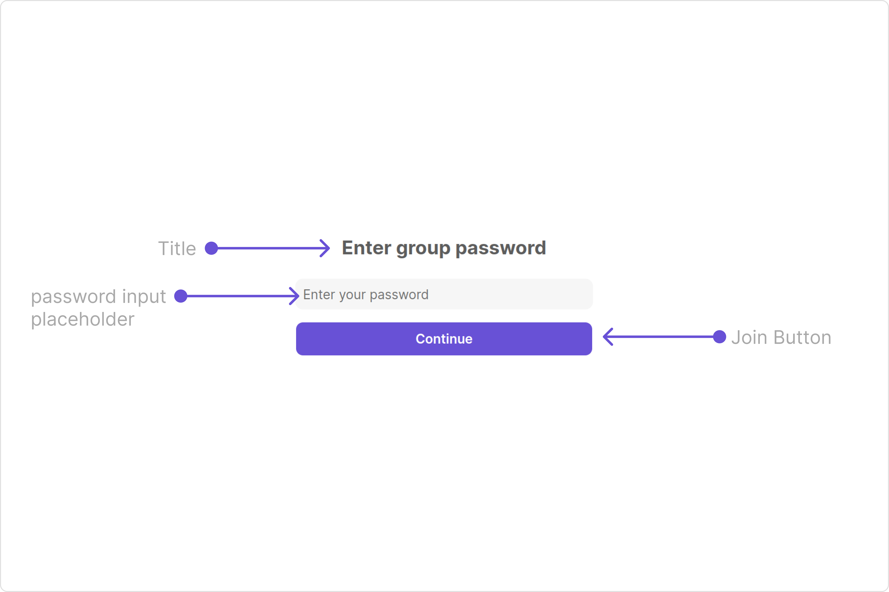
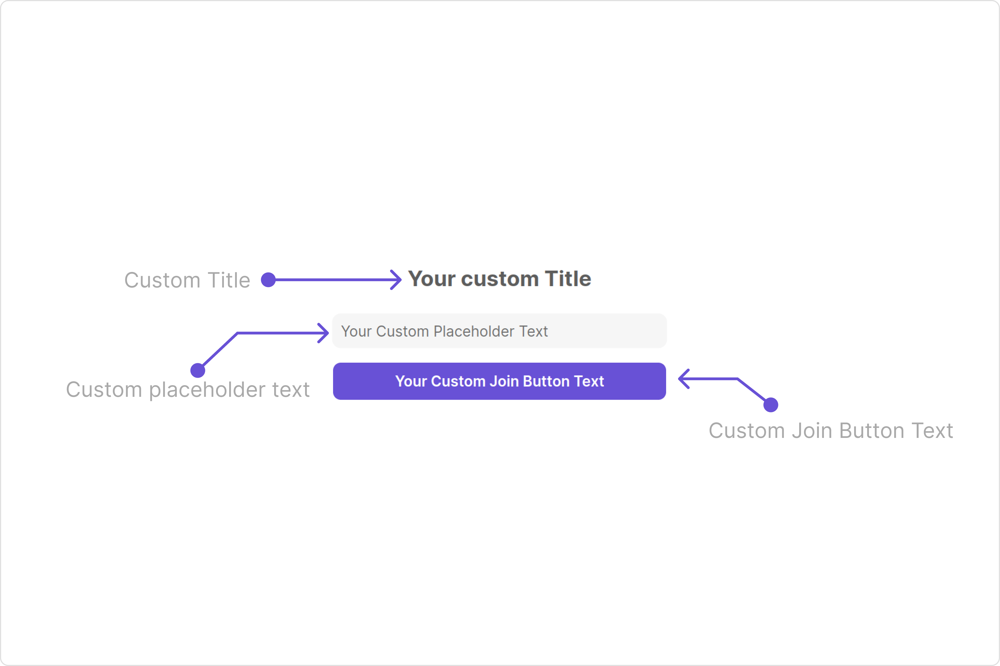

import Tabs from '@theme/Tabs';
import TabItem from '@theme/TabItem';

## Overview

`CometChatJoinGroup` is a [Component](/ui-kit/angular/components-overview#components) used to set up a screen that shows the functionality to join a password protected group, featuring the functionality to join a password-protected group, where users can join a single password-protected group at a time.



The Groups component is composed of the following BaseComponents:

| Components                 | Description                                                                                         |
| -------------------------- | --------------------------------------------------------------------------------------------------- |
| cometchat-button           | This component represents a button with optional icon and text.                                     |
| [cometchat-label](./label) | This component provides descriptive information about the associated UI element.                    |
| [cometchat-input](./input) | This component allows users to enter or provide data or information within a web form or interface. |

---

## Usage

### Integration

The following code snippet illustrates how you can directly incorporate the Join Group component into your Application.

<Tabs>
<TabItem value="js" label="app.module.ts">

```javascript
import { CUSTOM_ELEMENTS_SCHEMA, NgModule } from "@angular/core";
import { BrowserModule } from "@angular/platform-browser";
import { AppComponent } from "./app.component";

@NgModule({
  imports: [BrowserModule],
  declarations: [AppComponent],
  providers: [],
  bootstrap: [AppComponent],
  schemas: [CUSTOM_ELEMENTS_SCHEMA],
})
export class AppModule {}
```

</TabItem>
<TabItem value="app.component.ts" label="app.component.ts">

```javascript
import { CometChat } from '@cometchat/chat-sdk-javascript';
import { Component, OnInit } from '@angular/core';
import {  CometChatThemeService, CometChatUIKit } from '@cometchat/chat-uikit-angular';
import "@cometchat/uikit-elements";

@Component({
  selector: 'app-root',
  templateUrl: './app.component.html',
  styleUrls: ['./app.component.css']
})
export class AppComponent {

  public groupObject!: CometChat.Group;
  ngOnInit(): void {
    CometChat.getGroup("guid").then((group: CometChat.Group) => {
      this.groupObject = group;
    });
  }
  constructor(private themeService:CometChatThemeService) {
    themeService.theme.palette.setMode("light")
    themeService.theme.palette.setPrimary({ light: "#6851D6", dark: "#6851D6" })
  }

  onLogin(UID?: any) {
    CometChatUIKit.login({ uid: UID }).then(
      (user) => {
        setTimeout(() => {
          window.location.reload();
        }, 1000);
      },
      (error) => {
        console.log("Login failed with exception:", { error });
      }
    );
  }
}
```

</TabItem>
<TabItem value="ts" label="app.component.html">

```html
<div class="fullwidth">
  <cometchat-join-group [group]="groupObject"></cometchat-join-group>
</div>
```

</TabItem>
</Tabs>

---

### Actions

[Actions](/ui-kit/angular/components-overview#actions) dictate how a component functions. They are divided into two types: Predefined and User-defined. You can override either type, allowing you to tailor the behavior of the component to fit your specific needs.

##### 1. joinClick

The `joinClick` action is activated when you click the join Group button. This returns the join groups.

You can override this action using the following code snippet.

<Tabs>
<TabItem value="app.component.ts" label="app.component.ts">

```javascript
import { CometChat } from '@cometchat/chat-sdk-javascript';
import { Component, OnInit } from '@angular/core';
import {  CometChatThemeService, CometChatUIKit } from '@cometchat/chat-uikit-angular';
import "@cometchat/uikit-elements";

@Component({
  selector: 'app-root',
  templateUrl: './app.component.html',
  styleUrls: ['./app.component.css']
})
export class AppComponent {

  public groupObject!: CometChat.Group;
  public handleJoinClick = (group: CometChat.Group, password: string) => {
    console.log("your custom join click action", group);
  };
  ngOnInit(): void {
    CometChat.getGroup("guid").then((group: CometChat.Group) => {
      this.groupObject = group;
    });
  }
  constructor(private themeService:CometChatThemeService) {
    themeService.theme.palette.setMode("light")
    themeService.theme.palette.setPrimary({ light: "#6851D6", dark: "#6851D6" })
  }

  onLogin(UID?: any) {
    CometChatUIKit.login({ uid: UID }).then(
      (user) => {
        setTimeout(() => {
          window.location.reload();
        }, 1000);
      },
      (error) => {
        console.log("Login failed with exception:", { error });
      }
    );
  }
}
```

</TabItem>
<TabItem value="ts" label="app.component.html">

```html
<div class="fullwidth">
  <cometchat-create-group
    [group]="groupObject"
    [joinClick]="handleJoinClick"
  ></cometchat-create-group>
</div>
```

</TabItem>
</Tabs>

##### 2. errorCallback

This action doesn't change the behavior of the component but rather listens for any errors that occur in the Groups component.

<Tabs>
<TabItem value="app.component.ts" label="app.component.ts">

```javascript
import { CometChat } from '@cometchat/chat-sdk-javascript';
import { Component, OnInit } from '@angular/core';
import {  CometChatThemeService, CometChatUIKit } from '@cometchat/chat-uikit-angular';
import "@cometchat/uikit-elements";

@Component({
  selector: 'app-root',
  templateUrl: './app.component.html',
  styleUrls: ['./app.component.css']
})
export class AppComponent {

  public groupObject!: CometChat.Group;
  public handleErrorCallback = () => {
    console.log("yoour custom error callback");
  };
  ngOnInit(): void {
    CometChat.getGroup("guid").then((group: CometChat.Group) => {
      this.groupObject = group;
    });
  }
  constructor(private themeService:CometChatThemeService) {
    themeService.theme.palette.setMode("light")
    themeService.theme.palette.setPrimary({ light: "#6851D6", dark: "#6851D6" })
  }

  onLogin(UID?: any) {
    CometChatUIKit.login({ uid: UID }).then(
      (user) => {
        setTimeout(() => {
          window.location.reload();
        }, 1000);
      },
      (error) => {
        console.log("Login failed with exception:", { error });
      }
    );
  }
}
```

</TabItem>
<TabItem value="ts" label="app.component.html">

```html
<div class="fullwidth">
  <cometchat-create-group
    [group]="groupObject"
    [errorCallback]="handleErrorCallback"
  ></cometchat-create-group>
</div>
```

</TabItem>
</Tabs>

---

### Filters

**Filters** allow you to customize the data displayed in a list within a `Component`. You can filter the list based on your specific criteria, allowing for a more customized. Filters can be applied using `RequestBuilders` of Chat SDK.

The `Join Group` component does not have any exposed filters.

### Events

[Events](/ui-kit/angular/components-overview#events) are emitted by a `Component`. By using event you can extend existing functionality. Being global events, they can be applied in Multiple Locations and are capable of being Added or Removed.

Events emitted by the Join Group component is as follows.

| Event                   | Description                                                  |
| ----------------------- | ------------------------------------------------------------ |
| **ccGroupMemberJoined** | Triggers when the user joined a protected group successfully |

<Tabs>
<TabItem value="TypeScript" label="TypeScript">

```TypeScript
import {CometChatGroupEvents} from "@cometchat/chat-uikit-angular";

this.ccGroupMemberJoined = CometChatGroupEvents.ccGroupMemberJoined.subscribe(
  (item: IGroupMemberJoined) => {
        // Your Code
  }
);
```

</TabItem>
</Tabs>

---

Removing `CometChatGroupEvents` Listener's

<Tabs>
<TabItem value="TypeScript" label="TypeScript">

```TypeScript
this.ccGroupMemberJoined.unsubscribe();
```

</TabItem>
</Tabs>

---

## Customization

To fit your app's design requirements, you can customize the appearance of the Join Groups component. We provide exposed methods that allow you to modify the experience and behavior according to your specific needs.

### Style

Using **Style** you can **customize** the look and feel of the component in your app, These parameters typically control elements such as the **color**, **size**, **shape**, and **fonts** used within the component.

##### 1. JoinGroup Style

You can set the `JoinGroupStyle` to the `Join Group` Component to customize the styling.



<Tabs>
<TabItem value="app.component.ts" label="app.component.ts">

```javascript
import { CometChat } from '@cometchat/chat-sdk-javascript';
import { Component, OnInit } from '@angular/core';
import {  CometChatThemeService, CometChatUIKit, JoinGroupStyle } from '@cometchat/chat-uikit-angular';
import "@cometchat/uikit-elements";

@Component({
  selector: 'app-root',
  templateUrl: './app.component.html',
  styleUrls: ['./app.component.css']
})
export class AppComponent {

  public groupObject!: CometChat.Group;
  joinGroupStyle = new JoinGroupStyle({
    background: "#d1b2ed",
    joinButtonBackground: "#8625db",
    joinButtonTextColor: "#000000",
    passwordInputTextColor: "#000000",
    titleTextColor: "#000000",
    passwordInputPlaceholderTextColor: "#000000",
  });
  ngOnInit(): void {
    CometChat.getGroup("guid").then((group: CometChat.Group) => {
      this.groupObject = group;
    });
  }
  constructor(private themeService:CometChatThemeService) {
    themeService.theme.palette.setMode("light")
    themeService.theme.palette.setPrimary({ light: "#6851D6", dark: "#6851D6" })
  }

  onLogin(UID?: any) {
    CometChatUIKit.login({ uid: UID }).then(
      (user) => {
        setTimeout(() => {
          window.location.reload();
        }, 1000);
      },
      (error) => {
        console.log("Login failed with exception:", { error });
      }
    );
  }
}
```

</TabItem>
<TabItem value="ts" label="app.component.html">

```html
<div class="fullwidth">
  <cometchat-create-group
    [group]="groupObject"
    [joinGroupStyle]="joinGroupStyle"
  ></cometchat-create-group>
</div>
```

</TabItem>
</Tabs>

List of properties exposed by JoinGroupsStyle

| Property                              | Description                                             | Code                                          |
| ------------------------------------- | ------------------------------------------------------- | --------------------------------------------- |
| **border**                            | Used to set border                                      | `border?: string,`                            |
| **borderRadius**                      | Used to set border radius                               | `borderRadius?: string;`                      |
| **background**                        | Used to set background colour                           | `background?: string;`                        |
| **height**                            | Used to set height                                      | `height?: string;`                            |
| **width**                             | Used to set width                                       | `width?: string;`                             |
| **boxShadow**                         | Sets shadow effects around the element                  | `boxShadow?: string;`                         |
| **titleTextFont**                     | Sets the font style for the title text                  | `titleTextFont?: string;`                     |
| **titleTextColor**                    | Sets the color for the title text                       | `titleTextColor?: string;`                    |
| **errorTextFont**                     | Sets the font style for error messages                  | `errorTextFont?: string;`                     |
| **errorTextColor**                    | Sets the color for error messages                       | `errorTextColor?: string;`                    |
| **passwordInputTextFont**             | Sets the font style for password input                  | `passwordInputTextFont?: string;`             |
| **passwordInputTextColor**            | Sets the color for password input text                  | `passwordInputTextColor?: string;`            |
| **passwordInputPlaceholderTextFont**  | Sets the font style for password input placeholder text | `passwordInputPlaceholderTextFont?: string;`  |
| **passwordInputPlaceholderTextColor** | Sets the color for password input placeholder text      | `passwordInputPlaceholderTextColor?: string;` |
| **passwordInputBackground**           | Sets the background color for password input field      | `passwordInputBackground?: string;`           |
| **passwordInputBorder**               | Sets the border style for password input field          | `passwordInputBorder?: string;`               |
| **passwordInputBorderRadius**         | Sets the border radius for password input field         | `passwordInputBorderRadius?: string;`         |
| **passwordInputBoxShadow**            | Sets shadow effects around the password input field     | `passwordInputBoxShadow?: string;`            |
| **joinButtonTextFont**                | Sets the font style for the join button                 | `joinButtonTextFont?: string;`                |
| **joinButtonTextColor**               | Sets the color for the join button text                 | `joinButtonTextColor?: string;`               |
| **joinButtonBackground**              | Sets the background color for the join button           | `joinButtonBackground?: string;`              |
| **joinButtonBorderRadius**            | Sets the border radius for the join button              | `joinButtonBorderRadius?: string;`            |
| **joinButtonBorder**                  | Sets the border style for the join button               | `joinButtonBorder?: string;`                  |

---

### Functionality

These are a set of small functional customizations that allow you to fine-tune the overall experience of the component. With these, you can change text, set custom icons, and toggle the visibility of UI elements.

<Tabs>
<TabItem value="app.component.ts" label="app.component.ts">

```javascript
import { CometChat } from '@cometchat/chat-sdk-javascript';
import { Component, OnInit } from '@angular/core';
import {  CometChatThemeService, CometChatUIKit } from '@cometchat/chat-uikit-angular';
import "@cometchat/uikit-elements";

@Component({
  selector: 'app-root',
  templateUrl: './app.component.html',
  styleUrls: ['./app.component.css']
})
export class AppComponent {

  ngOnInit(): void {
    CometChat.getGroup("guid").then((group: CometChat.Group) => {
      this.groupObject = group;
    });
  }
  constructor(private themeService:CometChatThemeService) {
    themeService.theme.palette.setMode("light")
    themeService.theme.palette.setPrimary({ light: "#6851D6", dark: "#6851D6" })
  }

  onLogin(UID?: any) {
    CometChatUIKit.login({ uid: UID }).then(
      (user) => {
        setTimeout(() => {
          window.location.reload();
        }, 1000);
      },
      (error) => {
        console.log("Login failed with exception:", { error });
      }
    );
  }
}
```

</TabItem>
<TabItem value="ts" label="app.component.html">

```html
<div class="fullwidth">
  <cometchat-create-group
    [group]="groupObject"
    [title]="'Your custom Title'"
    [passwordInputPlaceholderText]="'Your Custom Placeholder Text'"
    [joinButtonText]="'Your Custom Join Button Text'"
  ></cometchat-create-group>
</div>
```

</TabItem>
</Tabs>

Default:


Custom:


| Property                         | Description                                      | Code                                                                             |
| -------------------------------- | ------------------------------------------------ | -------------------------------------------------------------------------------- |
| **title**                        | Custom title for the component                   | `[title]="'Your Custom Title'"`                                                  |
| **joinButtonText**               | Custom text for the join group button            | `[joinButtonText]="'Your Custom Join Group Button Text'"`                        |
| **passwordInputPlaceholderText** | Custom placeholder text for password input field | `[passwordInputPlaceholderText]="'Your Custom Password Input Placeholder Text'"` |
| **errorText**                    | Custom error state text                          | `[errorText]="'Your Custom Error Text'"`                                         |
| **group**                        | used to set the group                            | `[group]="groupObject"`                                                          |

---

### Advance

For advanced-level customization, you can set custom views to the component. This lets you tailor each aspect of the component to fit your exact needs and application aesthetics. You can create and define your views, layouts, and UI elements and then incorporate those into the component.

the `Join Group` component does not offer any advanced functionalities beyond this level of customization.

---

import { Tooltip } from 'react-tooltip'
import 'react-tooltip/dist/react-tooltip.css'

<Tooltip
  id="my-tooltip-html-prop"
  html="Not available in JoinGroupConfiguration"
/>
