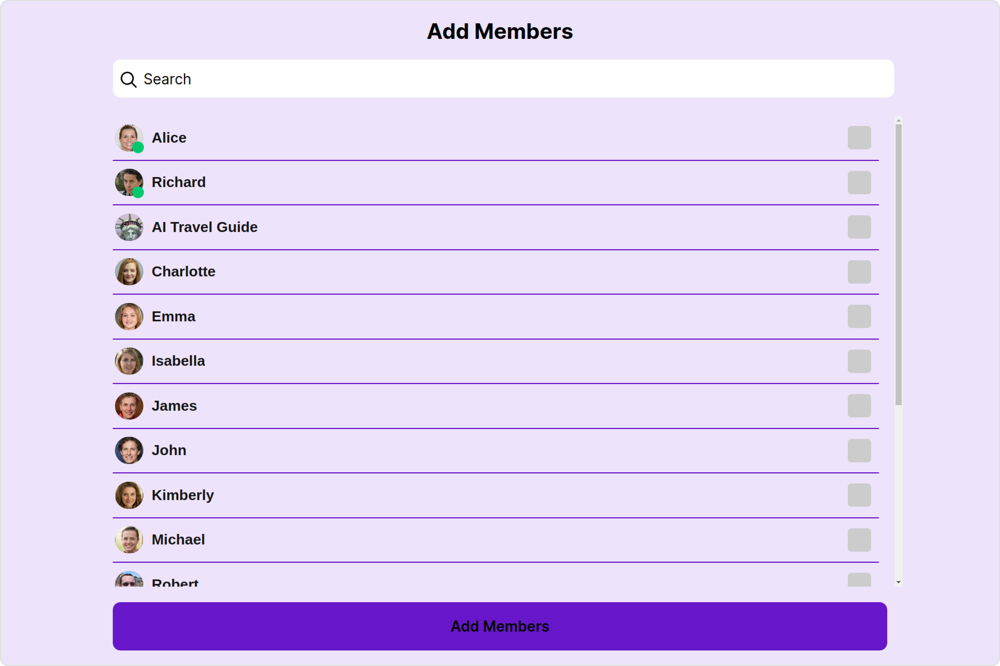
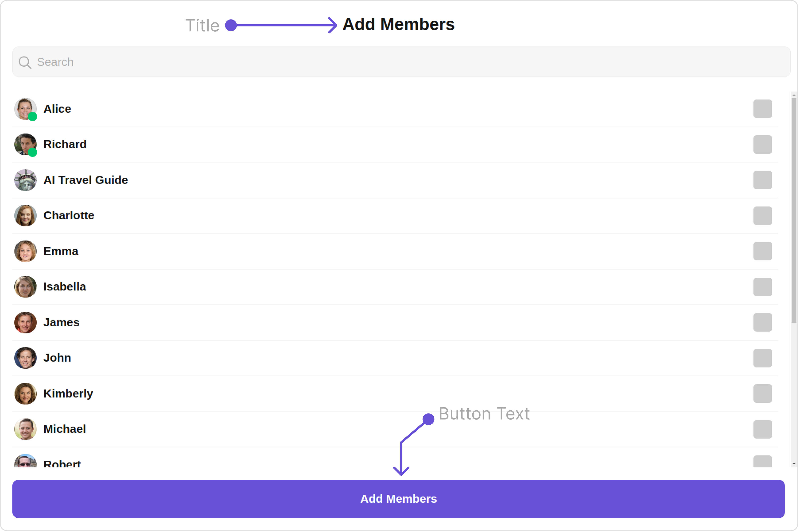
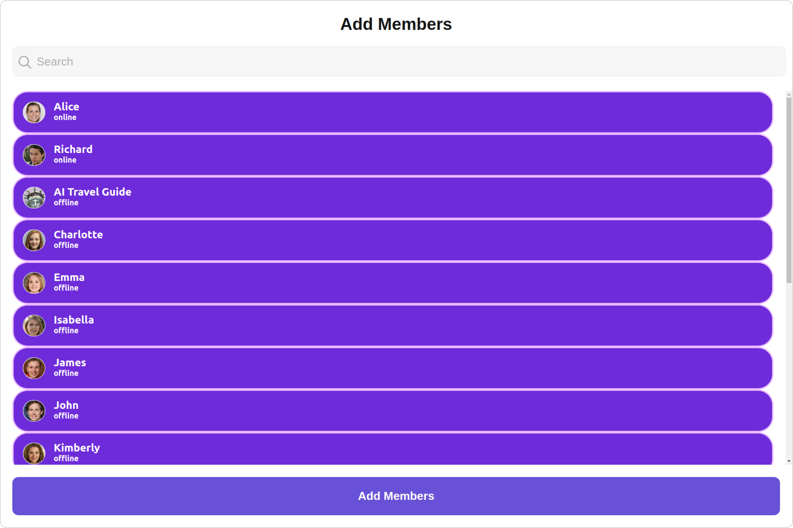
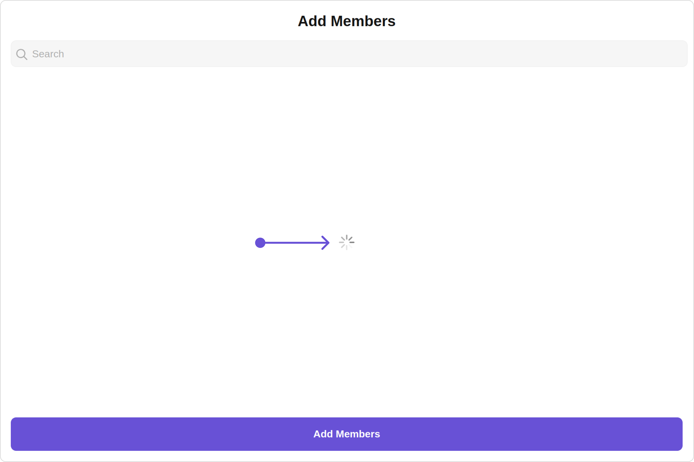
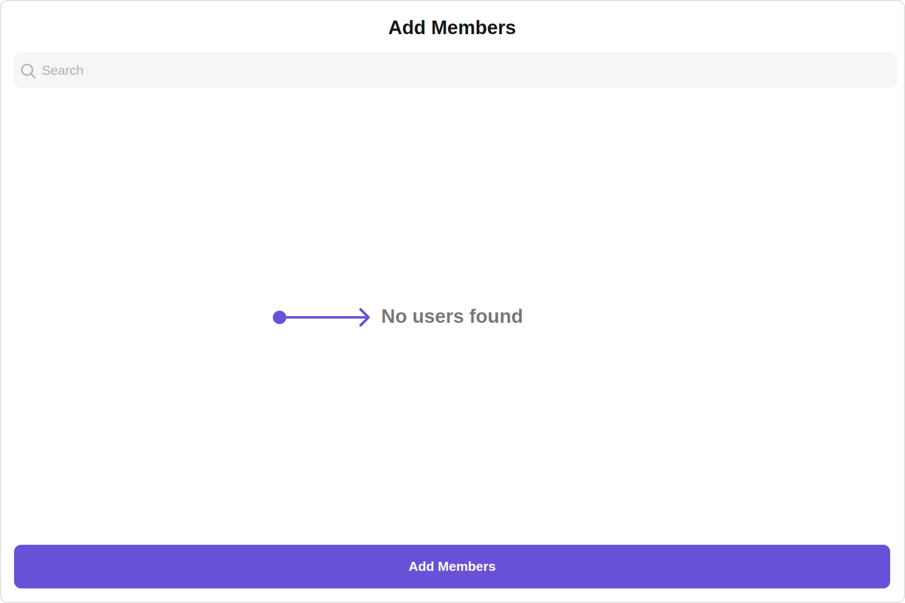
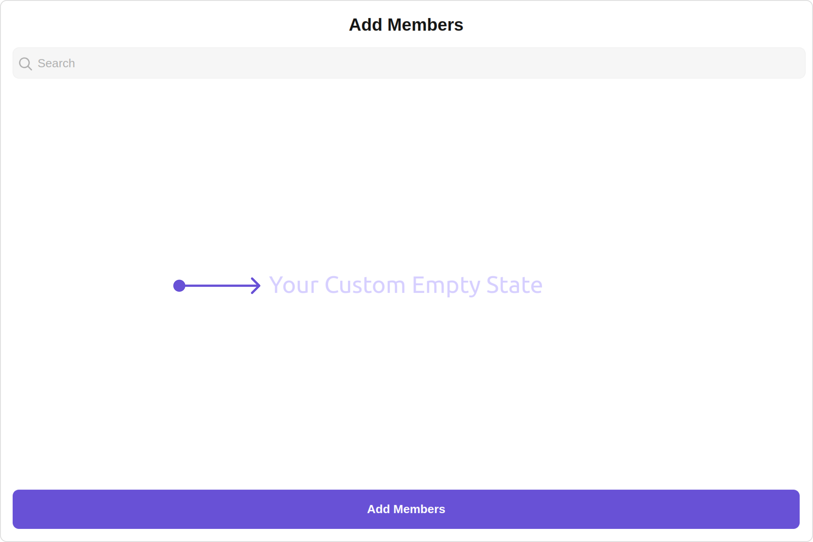
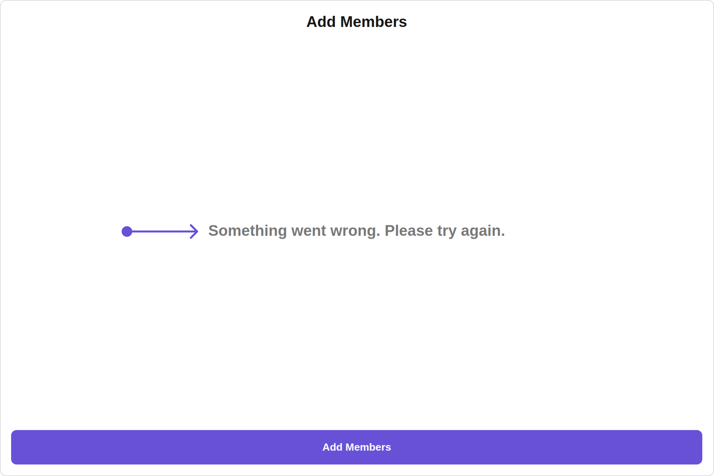
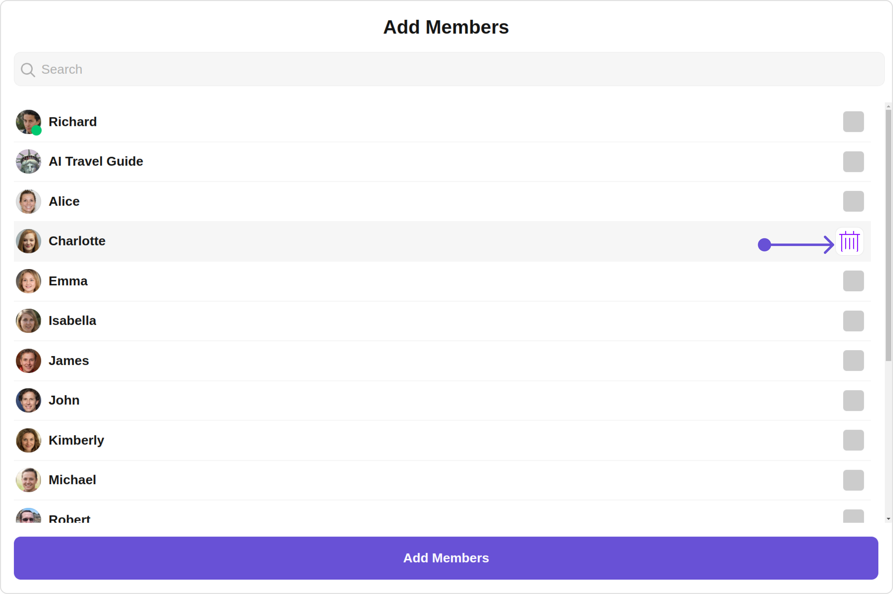

import Tabs from '@theme/Tabs';
import TabItem from '@theme/TabItem';

## Overview

`CometChatAddMembers` is a [Component](/ui-kit/angular/components-overview#components) that allows administrators or group owners to add new members to a specific group. It enables administrators or group owners to extend the membership of a group by adding new users to participate in the group's discussions and activities. By utilising this feature, administrators can manage group membership, and control access to group content.
The administrator can select the desired users to be added to the group. This can be done by searching for specific users, selecting from a list of available users. The selected users will receive notifications to join the group.


The Add Members component is composed of the following Components:

| Components                | Description                                                     |
| ------------------------- | --------------------------------------------------------------- |
| cometchat-button          | This component represents a button with optional icon and text. |
| [CometChatUsers](./users) | This component the list of users                                |

---

## Usage

### Integration

The following code snippet illustrates how you can directly incorporate the Add Members component into your Application.

<Tabs>
<TabItem value="js" label="app.module.ts">

```javascript
import { CUSTOM_ELEMENTS_SCHEMA, NgModule } from "@angular/core";
import { BrowserModule } from "@angular/platform-browser";
import { CometChatAddMembers } from "@cometchat/chat-uikit-angular";
import { AppComponent } from "./app.component";

@NgModule({
  imports: [BrowserModule, CometChatAddMembers],
  declarations: [AppComponent],
  providers: [],
  bootstrap: [AppComponent],
  schemas: [CUSTOM_ELEMENTS_SCHEMA],
})
export class AppModule {}
```

</TabItem>
<TabItem value="app.component.ts" label="app.component.ts">

```javascript
import { CometChat } from '@cometchat/chat-sdk-javascript';
import { Component, OnInit } from '@angular/core';
import {  CometChatThemeService, CometChatUIKit } from '@cometchat/chat-uikit-angular';
import "@cometchat/uikit-elements";

@Component({
  selector: 'app-root',
  templateUrl: './app.component.html',
  styleUrls: ['./app.component.css']
})
export class AppComponent {

  public groupObject!: CometChat.Group;
  ngOnInit(): void {
    CometChat.getGroup("guid").then((group: CometChat.Group) => {
      this.groupObject = group;
    });
  }
  constructor(private themeService:CometChatThemeService) {
    themeService.theme.palette.setMode("light")
    themeService.theme.palette.setPrimary({ light: "#6851D6", dark: "#6851D6" })
  }

  onLogin(UID?: any) {
    CometChatUIKit.login({ uid: UID }).then(
      (user) => {
        setTimeout(() => {
          window.location.reload();
        }, 1000);
      },
      (error) => {
        console.log("Login failed with exception:", { error });
      }
    );
  }
}
```

</TabItem>
<TabItem value="ts" label="app.component.html">

```html
<div class="fullwidth">
  <cometchat-add-members
    *ngIf="groupObject"
    [group]="groupObject"
  ></cometchat-add-members>
</div>
```

</TabItem>
</Tabs>

---

### Actions

[Actions](/ui-kit/angular/components-overview#actions) dictate how a component functions. They are divided into two types: Predefined and User-defined. You can override either type, allowing you to tailor the behavior of the component to fit your specific needs.

##### 1. onSelect

The `onSelect` action is activated when you select the done icon while in selection mode. This returns a list of all the users that you have selected.

This action does not come with any predefined behavior. However, you have the flexibility to override this event and tailor it to suit your needs using the following code snippet.

<Tabs>
<TabItem value="app.component.ts" label="app.component.ts">

```javascript
import { CometChat } from '@cometchat/chat-sdk-javascript';
import { Component, OnInit } from '@angular/core';
import {  CometChatThemeService, CometChatUIKit } from '@cometchat/chat-uikit-angular';
import "@cometchat/uikit-elements";

@Component({
  selector: 'app-root',
  templateUrl: './app.component.html',
  styleUrls: ['./app.component.css']
})
export class AppComponent {

  public groupObject!: CometChat.Group;
  ngOnInit(): void {
    CometChat.getGroup("guid").then((group: CometChat.Group) => {
      this.groupObject = group;
    });
  }
  public handleOnSelect = (user: CometChat.User, selected: boolean): void => {
    console.log("Custom on select action", user, selected);
  };
  constructor(private themeService:CometChatThemeService) {
    themeService.theme.palette.setMode("light")
    themeService.theme.palette.setPrimary({ light: "#6851D6", dark: "#6851D6" })
  }

  onLogin(UID?: any) {
    CometChatUIKit.login({ uid: UID }).then(
      (user) => {
        setTimeout(() => {
          window.location.reload();
        }, 1000);
      },
      (error) => {
        console.log("Login failed with exception:", { error });
      }
    );
  }
}
```

</TabItem>
<TabItem value="ts" label="app.component.html">

```html
<div class="fullwidth">
  <cometchat-add-members
    *ngIf="groupObject"
    [group]="groupObject"
    [onSelect]="handleOnSelect"
  ></cometchat-add-members>
</div>
```

</TabItem>
</Tabs>

##### 2. onAddMembersButtonClick

The `onAddMembersButtonClick` action is triggered when you click the add member button after choosing the users you wish to add in the group. By default, it returns the group GUID and an array of members to be added. However, you have the flexibility to override this event and tailor it to suit your needs using the following code snippet.

<Tabs>
<TabItem value="app.component.ts" label="app.component.ts">

```javascript
import { CometChat } from '@cometchat/chat-sdk-javascript';
import { Component, OnInit } from '@angular/core';
import {  CometChatThemeService, CometChatUIKit } from '@cometchat/chat-uikit-angular';
import "@cometchat/uikit-elements";

@Component({
  selector: 'app-root',
  templateUrl: './app.component.html',
  styleUrls: ['./app.component.css']
})
export class AppComponent {

  public groupObject!: CometChat.Group;
  ngOnInit(): void {
    CometChat.getGroup("guid").then((group: CometChat.Group) => {
      this.groupObject = group;
    });
  }
  public handleOnAddMembersButtonClick = (guid: string, members: CometChat.User[]) => {
    console.log("youc custom on add members button click actions");
  };
  constructor(private themeService:CometChatThemeService) {
    themeService.theme.palette.setMode("light")
    themeService.theme.palette.setPrimary({ light: "#6851D6", dark: "#6851D6" })
  }

  onLogin(UID?: any) {
    CometChatUIKit.login({ uid: UID }).then(
      (user) => {
        setTimeout(() => {
          window.location.reload();
        }, 1000);
      },
      (error) => {
        console.log("Login failed with exception:", { error });
      }
    );
  }
}
```

</TabItem>
<TabItem value="ts" label="app.component.html">

```html
<div class="fullwidth">
  <cometchat-add-members
    *ngIf="groupObject"
    [group]="groupObject"
    [onAddMembersButtonClick]="handleOnAddMembersButtonClick"
  ></cometchat-add-members>
</div>
```

</TabItem>
</Tabs>

##### 3. OnBack

`OnBack` is triggered when you click on the back button of the Add Members component. You can override this action using the following code snippet.

<Tabs>
<TabItem value="app.component.ts" label="app.component.ts">

```javascript
import { CometChat } from '@cometchat/chat-sdk-javascript';
import { Component, OnInit } from '@angular/core';
import {  CometChatThemeService, CometChatUIKit } from '@cometchat/chat-uikit-angular';
import "@cometchat/uikit-elements";

@Component({
  selector: 'app-root',
  templateUrl: './app.component.html',
  styleUrls: ['./app.component.css']
})
export class AppComponent {

  public groupObject!: CometChat.Group;
  ngOnInit(): void {
    CometChat.getGroup("guid").then((group: CometChat.Group) => {
      this.groupObject = group;
    });
  }
  public handleOnBack = () => {
    console.log("Your custom on back action");
  }
  constructor(private themeService:CometChatThemeService) {
    themeService.theme.palette.setMode("light")
    themeService.theme.palette.setPrimary({ light: "#6851D6", dark: "#6851D6" })
  }

  onLogin(UID?: any) {
    CometChatUIKit.login({ uid: UID }).then(
      (user) => {
        setTimeout(() => {
          window.location.reload();
        }, 1000);
      },
      (error) => {
        console.log("Login failed with exception:", { error });
      }
    );
  }
}
```

</TabItem>
<TabItem value="ts" label="app.component.html">

```html
<div class="fullwidth">
  <cometchat-add-members
    *ngIf="groupObject"
    [group]="groupObject"
    [onBack]="handleOnBack"
  ></cometchat-add-members>
</div>
```

</TabItem>
</Tabs>

##### 4. onClose

`onClose` is triggered when you click on the close button of the Add Members component. You can override this action using the following code snippet.

<Tabs>
<TabItem value="app.component.ts" label="app.component.ts">

```javascript
import { CometChat } from '@cometchat/chat-sdk-javascript';
import { Component, OnInit } from '@angular/core';
import {  CometChatThemeService, CometChatUIKit } from '@cometchat/chat-uikit-angular';
import "@cometchat/uikit-elements";

@Component({
  selector: 'app-root',
  templateUrl: './app.component.html',
  styleUrls: ['./app.component.css']
})
export class AppComponent {

  public groupObject!: CometChat.Group;
  ngOnInit(): void {
    CometChat.getGroup("guid").then((group: CometChat.Group) => {
      this.groupObject = group;
    });
  }
  public handleOnClose = () => {
    console.log("Your custom on close actions");
  }
  constructor(private themeService:CometChatThemeService) {
    themeService.theme.palette.setMode("light")
    themeService.theme.palette.setPrimary({ light: "#6851D6", dark: "#6851D6" })
  }

  onLogin(UID?: any) {
    CometChatUIKit.login({ uid: UID }).then(
      (user) => {
        setTimeout(() => {
          window.location.reload();
        }, 1000);
      },
      (error) => {
        console.log("Login failed with exception:", { error });
      }
    );
  }
}
```

</TabItem>
<TabItem value="ts" label="app.component.html">

```html
<div class="fullwidth">
  <cometchat-add-members
    *ngIf="groupObject"
    [group]="groupObject"
    [onClose]="handleOnClose"
  ></cometchat-add-members>
</div>
```

</TabItem>
</Tabs>

##### 5. onError

This action doesn't change the behavior of the component but rather listens for any errors that occur in the Add Members component.

<Tabs>
<TabItem value="app.component.ts" label="app.component.ts">

```javascript
import { CometChat } from '@cometchat/chat-sdk-javascript';
import { Component, OnInit } from '@angular/core';
import {  CometChatThemeService, CometChatUIKit } from '@cometchat/chat-uikit-angular';
import "@cometchat/uikit-elements";

@Component({
  selector: 'app-root',
  templateUrl: './app.component.html',
  styleUrls: ['./app.component.css']
})
export class AppComponent {

  public groupObject!: CometChat.Group;
  ngOnInit(): void {
    CometChat.getGroup("guid").then((group: CometChat.Group) => {
      this.groupObject = group;
    });
  }
  public handleOnError = (error: CometChat.CometChatException) => {
    console.log("your custom on error action", error);
  };
  constructor(private themeService:CometChatThemeService) {
    themeService.theme.palette.setMode("light")
    themeService.theme.palette.setPrimary({ light: "#6851D6", dark: "#6851D6" })
  }

  onLogin(UID?: any) {
    CometChatUIKit.login({ uid: UID }).then(
      (user) => {
        setTimeout(() => {
          window.location.reload();
        }, 1000);
      },
      (error) => {
        console.log("Login failed with exception:", { error });
      }
    );
  }
}
```

</TabItem>
<TabItem value="ts" label="app.component.html">

```html
<div class="fullwidth">
  <cometchat-add-members
    *ngIf="groupObject"
    [group]="groupObject"
    [onError]="handleOnError"
  ></cometchat-add-members>
</div>
```

</TabItem>
</Tabs>

---

### Filters

**Filters** allow you to customize the data displayed in a list within a Component. You can filter the list based on your specific criteria, allowing for a more customized. Filters can be applied using RequestBuilders of Chat SDK.

##### 1. UsersRequestBuilder

The [UsersRequestBuilder](/sdk/javascript/retrieve-users) enables you to filter and customize the users list based on available parameters in UsersRequestBuilder. This feature allows you to create more specific and targeted queries when fetching users. The following are the parameters available in [UsersRequestBuilder](/sdk/javascript/retrieve-users)

| Methods              | Type               | Description                                                                               |
| -------------------- | ------------------ | ----------------------------------------------------------------------------------------- |
| **setLimit**         | number             | sets the number of users that can be fetched in a single request, suitable for pagination |
| **setSearchKeyword** | String             | used for fetching users matching the passed string                                        |
| **hideBlockedUsers** | boolean            | used for fetching all those users who are not blocked by the logged in user               |
| **friendsOnly**      | boolean            | used for fetching only those users in which logged in user is a member                    |
| **setRoles**         | List&lt;String&gt; | used for fetching users containing the passed tags                                        |
| **setTags**          | List&lt;String&gt; | used for fetching users containing the passed tags                                        |
| **withTags**         | boolean            | used for fetching users containing tags                                                   |
| **setStatus**        | String             | used for fetching users by their status online or offline                                 |
| **setUIDs**          | List&lt;String&gt; | used for fetching users containing the passed users                                       |

**Example**

In the example below, we are applying a filter to the UserList by setting the limit to eight and sorting the lists by their name.

<Tabs>
<TabItem value="app.component.ts" label="app.component.ts">

```javascript
import { CometChat } from '@cometchat/chat-sdk-javascript';
import { Component, OnInit } from '@angular/core';
import {  CometChatThemeService, CometChatUIKit } from '@cometchat/chat-uikit-angular';
import "@cometchat/uikit-elements";

@Component({
  selector: 'app-root',
  templateUrl: './app.component.html',
  styleUrls: ['./app.component.css']
})
export class AppComponent {

  public groupObject!: CometChat.Group;
  ngOnInit(): void {
    CometChat.getGroup("guid").then((group: CometChat.Group) => {
      this.groupObject = group;
    });
  }
  usersRequestBuilder = new CometChat.UsersRequestBuilder().setLimit(8).sortBy("name");
  constructor(private themeService:CometChatThemeService) {
    themeService.theme.palette.setMode("light")
    themeService.theme.palette.setPrimary({ light: "#6851D6", dark: "#6851D6" })
  }

  onLogin(UID?: any) {
    CometChatUIKit.login({ uid: UID }).then(
      (user) => {
        setTimeout(() => {
          window.location.reload();
        }, 1000);
      },
      (error) => {
        console.log("Login failed with exception:", { error });
      }
    );
  }
}
```

</TabItem>
<TabItem value="ts" label="app.component.html">

```html
<div class="fullwidth">
  <cometchat-add-members
    *ngIf="groupObject"
    [group]="groupObject"
    [usersRequestBuilder]="usersRequestBuilder"
  ></cometchat-add-members>
</div>
```

</TabItem>
</Tabs>

##### 2. SearchRequestBuilder

The SearchRequestBuilder uses [UserRequestBuilder](/sdk/javascript/retrieve-users) enables you to filter and customize the search list based on available parameters in UserRequestBuilder.
This feature allows you to keep uniformity between the displayed UserList and searched UserList.

**Example**

<Tabs>
<TabItem value="app.component.ts" label="app.component.ts">

```javascript
import { CometChat } from '@cometchat/chat-sdk-javascript';
import { Component, OnInit } from '@angular/core';
import {  CometChatThemeService, CometChatUIKit } from '@cometchat/chat-uikit-angular';
import "@cometchat/uikit-elements";

@Component({
  selector: 'app-root',
  templateUrl: './app.component.html',
  styleUrls: ['./app.component.css']
})
export class AppComponent {

  public groupObject!: CometChat.Group;
  ngOnInit(): void {
    CometChat.getGroup("guid").then((group: CometChat.Group) => {
      this.groupObject = group;
    });
  }
  searchRequestBuilder = new CometChat.UsersRequestBuilder().setLimit(8).setSearchKeyword("**")
  constructor(private themeService:CometChatThemeService) {
    themeService.theme.palette.setMode("light")
    themeService.theme.palette.setPrimary({ light: "#6851D6", dark: "#6851D6" })
  }

  onLogin(UID?: any) {
    CometChatUIKit.login({ uid: UID }).then(
      (user) => {
        setTimeout(() => {
          window.location.reload();
        }, 1000);
      },
      (error) => {
        console.log("Login failed with exception:", { error });
      }
    );
  }
}
```

</TabItem>
<TabItem value="ts" label="app.component.html">

```html
<div class="fullwidth">
  <cometchat-add-members
    *ngIf="groupObject"
    [group]="groupObject"
    [searchRequestBuilder]="searchRequestBuilder"
  ></cometchat-add-members>
</div>
```

</TabItem>
</Tabs>

---

### Events

[Events](/ui-kit/angular/components-overview#events) are emitted by a `Component`. By using event you can extend existing functionality. Being global events, they can be applied in Multiple Locations and are capable of being Added or Removed.

Events emitted by the Add Members component is as follows.

| Event                  | Description                                        |
| ---------------------- | -------------------------------------------------- |
| **ccGroupMemberAdded** | Triggers when a user added to a group successfully |

<Tabs>
<TabItem value="TypeScript" label="TypeScript">

```TypeScript
import {CometChatGroupEvents} from "@cometchat/chat-uikit-angular";

this.ccGroupMemberAdded = CometChatGroupEvents.ccGroupMemberAdded.subscribe(
  (item: IGroupMemberAdded) => {
        // Your Code
  }
);
```

</TabItem>
</Tabs>

---

Removing `CometChatGroupEvents` Listener's

<Tabs>
<TabItem value="TypeScript" label="TypeScript">

```TypeScript
this.ccGroupMemberAdded.unsubscribe();
```

</TabItem>
</Tabs>

---

## Customization

To fit your app's design requirements, you can customize the appearance of the Add Members component. We provide exposed methods that allow you to modify the experience and behavior according to your specific needs.

### Style

Using **Style** you can **customize** the look and feel of the component in your app, These parameters typically control elements such as the **color**, **size**, **shape**, and **fonts** used within the component.

##### 1. AddMembers Style

You can set the `AddMembersStyle` to the Add Members Component to customize the styling.



<Tabs>
<TabItem value="app.component.ts" label="app.component.ts">

```javascript
import { CometChat } from '@cometchat/chat-sdk-javascript';
import { Component, OnInit } from '@angular/core';
import {  CometChatThemeService, CometChatUIKit } from '@cometchat/chat-uikit-angular';
import { AddMembersStyle } from '@cometchat/uikit-shared';
import "@cometchat/uikit-elements";

@Component({
  selector: 'app-root',
  templateUrl: './app.component.html',
  styleUrls: ['./app.component.css']
})
export class AppComponent {

  public groupObject!: CometChat.Group;
  ngOnInit(): void {
    CometChat.getGroup("guid").then((group: CometChat.Group) => {
      this.groupObject = group;
    });
  }
  addMembersStyle = new AddMembersStyle({
    addMembersButtonBackground: "#6716c9",
    addMembersButtonTextColor: "#ffffff",
    background: "#d6b9fa",
    searchBackground: "#6716c9",
    searchPlaceholderTextColor: "#ffffff",
    titleTextColor: "#ffffff",
    searchIconTint: "#ffffff",
    separatorColor: "#6716c9",
    sectionHeaderTextColor: "#ffffff",
  });
  constructor(private themeService:CometChatThemeService) {
    themeService.theme.palette.setMode("light")
    themeService.theme.palette.setPrimary({ light: "#6851D6", dark: "#6851D6" })
  }

  onLogin(UID?: any) {
    CometChatUIKit.login({ uid: UID }).then(
      (user) => {
        setTimeout(() => {
          window.location.reload();
        }, 1000);
      },
      (error) => {
        console.log("Login failed with exception:", { error });
      }
    );
  }
}
```

</TabItem>
<TabItem value="ts" label="app.component.html">

```html
<div class="fullwidth">
  <cometchat-add-members
    *ngIf="groupObject"
    [group]="groupObject"
    [addMembersStyle]="addMembersStyle"
  ></cometchat-add-members>
</div>
```

</TabItem>
</Tabs>

List of properties exposed by AddMembersStyle:

| Property                       | Description                                     | Code                                   |
| ------------------------------ | ----------------------------------------------- | -------------------------------------- |
| **border**                     | Used to set border                              | `border?: string,`                     |
| **borderRadius**               | Used to set border radius                       | `borderRadius?: string;`               |
| **background**                 | Used to set background colour                   | `background?: string;`                 |
| **height**                     | Used to set height                              | `height?: string;`                     |
| **width**                      | Used to set width                               | `width?: string;`                      |
| **titleTextFont**              | Used to set title text font                     | `titleTextFont?: string,`              |
| **titleTextColor**             | Used to set title text color                    | `titleTextColor?: string;`             |
| **searchPlaceholderTextFont**  | Used to set search placeholder font             | `searchPlaceholderTextFont?: string;`  |
| **searchPlaceholderTextColor** | Used to set search placeholder color            | `searchPlaceholderTextColor?: string;` |
| **searchTextFont**             | Used to set search text font                    | `searchTextFont?: string;`             |
| **searchTextColor**            | Used to set search text color                   | `searchTextColor?: string;`            |
| **emptyStateTextFont**         | Used to set empty state text font               | `emptyStateTextFont?: string;`         |
| **emptyStateTextColor**        | Used to set empty state text color              | `emptyStateTextColor?: string;`        |
| **errorStateTextFont**         | Used to set error state text font               | `errorStateTextFont?: string;`         |
| **errorStateTextColor**        | Used to set error state text color              | `errorStateTextColor?: string;`        |
| **loadingIconTint**            | Used to set loading icon tint                   | `loadingIconTint?: string;`            |
| **searchIconTint**             | Used to set search icon tint                    | `searchIconTint?: string;`             |
| **searchBorder**               | Used to set search border                       | `searchBorder?: string;`               |
| **searchBorderRadius**         | Used to set search border radius                | `searchBorderRadius?: string;`         |
| **searchBackground**           | Used to set search background color             | `searchBackground?: string;`           |
| **onlineStatusColor**          | Used to set online status color                 | `onlineStatusColor?: string;`          |
| **separatorColor**             | Used to set separator color                     | `separatorColor?: string;`             |
| **sectionHeaderTextFont**      | Used to set section header text font            | `sectionHeaderTextFont?: string;`      |
| **sectionHeaderTextColor**     | Used to set section header text color           | `sectionHeaderTextColor?: string;`     |
| **boxShadow**                  | Used to set box shadow                          | `boxShadow?: string;`                  |
| **backButtonIconTint**         | Used to set back button icon tint               | `backButtonIconTint?: string;`         |
| **closeButtonIconTint**        | Used to set close button icon tint              | `closeButtonIconTint?: string;`        |
| **addMembersButtonBackground** | Used to set add members button background color | `addMembersButtonBackground?: string;` |
| **addMembersButtonTextColor**  | Used to set add members button text color       | `addMembersButtonTextColor?: string;`  |
| **addMembersButtonTextFont**   | Used to set add members button text font        | `addMembersButtonTextFont?: string;`   |
| **padding**                    | Used to set padding                             | `padding?: string;`                    |

##### 2. Avatar Style

To apply customized styles to the `Avatar` component in the Add Members Component, you can use the following code snippet. For further insights on `Avatar` Styles [refer](/ui-kit/angular/avatar#avatar-style)

<Tabs>
<TabItem value="app.component.ts" label="app.component.ts">

```javascript
import { CometChat } from '@cometchat/chat-sdk-javascript';
import { Component, OnInit } from '@angular/core';
import {  CometChatThemeService, CometChatUIKit, AvatarStyle } from '@cometchat/chat-uikit-angular';
import "@cometchat/uikit-elements";

@Component({
  selector: 'app-root',
  templateUrl: './app.component.html',
  styleUrls: ['./app.component.css']
})
export class AppComponent {

  public groupObject!: CometChat.Group;
  ngOnInit(): void {
    CometChat.getGroup("guid").then((group: CometChat.Group) => {
      this.groupObject = group;
    });
  }
  avatarStyle = new AvatarStyle({
    backgroundColor: "#cdc2ff",
    border: "2px solid #6745ff",
    borderRadius: "10px",
    outerViewBorderColor: "#ca45ff",
    outerViewBorderRadius: "5px",
    nameTextColor: "#4554ff"
  });
  constructor(private themeService:CometChatThemeService) {
    themeService.theme.palette.setMode("light")
    themeService.theme.palette.setPrimary({ light: "#6851D6", dark: "#6851D6" })
  }

  onLogin(UID?: any) {
    CometChatUIKit.login({ uid: UID }).then(
      (user) => {
        setTimeout(() => {
          window.location.reload();
        }, 1000);
      },
      (error) => {
        console.log("Login failed with exception:", { error });
      }
    );
  }
}
```

</TabItem>
<TabItem value="ts" label="app.component.html">

```html
<div class="fullwidth">
  <cometchat-add-members
    *ngIf="groupObject"
    [group]="groupObject"
    [avatarStyle]="avatarStyle"
  ></cometchat-add-members>
</div>
```

</TabItem>
</Tabs>

---

##### 3. LisItem Style

To apply customized styles to the `List Item` component in the `Add Members` Component, you can use the following code snippet. For further insights on `List Item` Styles [refer](/ui-kit/angular/list-item)

<Tabs>
<TabItem value="app.component.ts" label="app.component.ts">

```javascript
import { CometChat } from '@cometchat/chat-sdk-javascript';
import { Component, OnInit } from '@angular/core';
import {  CometChatThemeService, CometChatUIKit, ListItemStyle } from '@cometchat/chat-uikit-angular';
import "@cometchat/uikit-elements";

@Component({
  selector: 'app-root',
  templateUrl: './app.component.html',
  styleUrls: ['./app.component.css']
})
export class AppComponent {

  public groupObject!: CometChat.Group;
  ngOnInit(): void {
    CometChat.getGroup("guid").then((group: CometChat.Group) => {
      this.groupObject = group;
    });
  }
  listItemStyle: ListItemStyle = new ListItemStyle({
    background: "transparent",
    padding: "5px",
    border: "1px solid #e9b8f5",
    titleColor: "#8830f2",
    borderRadius: "20px",
    width: "100% !important"
  });
  constructor(private themeService:CometChatThemeService) {
    themeService.theme.palette.setMode("light")
    themeService.theme.palette.setPrimary({ light: "#6851D6", dark: "#6851D6" })
  }

  onLogin(UID?: any) {
    CometChatUIKit.login({ uid: UID }).then(
      (user) => {
        setTimeout(() => {
          window.location.reload();
        }, 1000);
      },
      (error) => {
        console.log("Login failed with exception:", { error });
      }
    );
  }
}
```

</TabItem>
<TabItem value="ts" label="app.component.html">

```html
<div class="fullwidth">
  <cometchat-add-members
    *ngIf="groupObject"
    [group]="groupObject"
    [listItemStyle]="listItemStyle"
  ></cometchat-add-members>
</div>
```

</TabItem>
</Tabs>

##### 4. StatusIndicator Style

To apply customized styles to the Status Indicator component in the Add Members Component, You can use the following code snippet. For further insights on Status Indicator Styles [refer](/ui-kit/angular/status-indicator)

<Tabs>
<TabItem value="app.component.ts" label="app.component.ts">

```javascript
import { CometChat } from '@cometchat/chat-sdk-javascript';
import { Component, OnInit } from '@angular/core';
import {  CometChatThemeService, CometChatUIKit } from '@cometchat/chat-uikit-angular';
import "@cometchat/uikit-elements";

@Component({
  selector: 'app-root',
  templateUrl: './app.component.html',
  styleUrls: ['./app.component.css']
})
export class AppComponent {

  public groupObject!: CometChat.Group;
  ngOnInit(): void {
    CometChat.getGroup("guid").then((group: CometChat.Group) => {
      this.groupObject = group;
    });
  }
  statusIndicatorStyle: any = ({
    height: '20px',
    width: '20px',
    backgroundColor: 'red'
  });
  constructor(private themeService:CometChatThemeService) {
    themeService.theme.palette.setMode("light")
    themeService.theme.palette.setPrimary({ light: "#6851D6", dark: "#6851D6" })
  }

  onLogin(UID?: any) {
    CometChatUIKit.login({ uid: UID }).then(
      (user) => {
        setTimeout(() => {
          window.location.reload();
        }, 1000);
      },
      (error) => {
        console.log("Login failed with exception:", { error });
      }
    );
  }
}
```

</TabItem>
<TabItem value="ts" label="app.component.html">

```html
<div class="fullwidth">
  <cometchat-add-members
    *ngIf="groupObject"
    [group]="groupObject"
    [StatusIndicatorStyle]="statusIndicatorStyle"
  ></cometchat-add-members>
</div>
```

</TabItem>
</Tabs>

---

### Functionality

These are a set of small functional customizations that allow you to fine-tune the overall experience of the component. With these, you can change text, set custom icons, and toggle the visibility of UI elements.

<Tabs>
<TabItem value="app.component.ts" label="app.component.ts">

```javascript
import { CometChat } from '@cometchat/chat-sdk-javascript';
import { Component, OnInit } from '@angular/core';
import {  CometChatThemeService, CometChatUIKit } from '@cometchat/chat-uikit-angular';
import { TitleAlignment } from '@cometchat/uikit-resources';
import "@cometchat/uikit-elements";

@Component({
  selector: 'app-root',
  templateUrl: './app.component.html',
  styleUrls: ['./app.component.css']
})
export class AppComponent {

  public groupObject!: CometChat.Group;
  ngOnInit(): void {
    CometChat.getGroup("guid").then((group: CometChat.Group) => {
      this.groupObject = group;
    });
  }
  titleAlignment = TitleAlignment.left;
  constructor(private themeService:CometChatThemeService) {
    themeService.theme.palette.setMode("light")
    themeService.theme.palette.setPrimary({ light: "#6851D6", dark: "#6851D6" })
  }

  onLogin(UID?: any) {
    CometChatUIKit.login({ uid: UID }).then(
      (user) => {
        setTimeout(() => {
          window.location.reload();
        }, 1000);
      },
      (error) => {
        console.log("Login failed with exception:", { error });
      }
    );
  }
}
```

</TabItem>
<TabItem value="ts" label="app.component.html">

```html
<div class="fullwidth">
  <cometchat-add-members
    *ngIf="groupObject"
    [group]="groupObject"
    [title]="'Your Custom Title'"
    [buttonText]="'Your Custom Button Text'"
    [titleAlignment]="titleAlignment"
  ></cometchat-add-members>
</div>
```

</TabItem>
</Tabs>

Default:


Custom:


Below is a list of customizations along with corresponding code snippets

| Property                                                                                                             | Description                                                                                      | Code                                                |
| -------------------------------------------------------------------------------------------------------------------- | ------------------------------------------------------------------------------------------------ | --------------------------------------------------- |
| **title** <a data-tooltip-id="my-tooltip-html-prop"> <span class="material-icons red">report</span> </a>             | Used to set title in the app heading                                                             | `[title]="'Your Custom Title'"`                     |
| **buttonText** <a data-tooltip-id="my-tooltip-html-prop"> <span class="material-icons red">report</span> </a>        | Used to set a custom button text for the add members button                                      | `[buttonText]="'your custom button text'"`          |
| **errorStateText** <a data-tooltip-id="my-tooltip-html-prop"> <span class="material-icons red">report</span> </a>    | Used to set a custom text response when some error occurs on fetching the list of users          | `[errorStateText]="'your custom error state text'"` |
| **emptyStateText** <a data-tooltip-id="my-tooltip-html-prop"> <span class="material-icons red">report</span> </a>    | Used to set a custom text response when fetching the users has returned an empty list            | `[emptyStateText]="'your custom empty state text'"` |
| **searchPlaceholder** <a data-tooltip-id="my-tooltip-html-prop"> <span class="material-icons red">report</span> </a> | Used to set custom search placeholder text                                                       | `[searchPlaceholder]="'Custom Search PlaceHolder'"` |
| **searchIconURL**                                                                                                    | Used to set search Icon in the search field                                                      | `[searchIconURL]="searchIconURL"`                   |
| **loadingIconURL**                                                                                                   | Used to set loading Icon                                                                         | `[loadingIconURL]="loadingIconURL"`                 |
| **closeButtonIconURL**                                                                                               | Used to set close button Icon                                                                    | `[closeButtonIconURL]="closeButtonIconURL"`         |
| **backButtonIconURL**                                                                                                | Used to set the back button Icon                                                                 | `[backButtonIconURL]="backButtonIconURL"`           |
| **hideError**                                                                                                        | Used to hide error on fetching users                                                             | `[hideError]="true"`                                |
| **hideSearch**                                                                                                       | Used to toggle visibility for search box                                                         | `[hideSearch]="true"`                               |
| **hideSeparator**                                                                                                    | Used to hide the divider separating the user items                                               | `[hideSeparator]="true"`                            |
| **disableUsersPresence**                                                                                             | Used to toggle functionality to show user's presence                                             | `[disableUsersPresence]="true"`                     |
| **showBackButton**                                                                                                   | Hides / shows the back button as per the boolean value                                           | `[showBackButton]="true"`                           |
| **sectionHeaderField**                                                                                               | used to extract the section header character from the user object and show on the section header | `[sectionHeaderField]="sectionHeaderField"`         |
| **showSectionHeader**                                                                                                | Hides / shows the section header as per the boolean value                                        | `[showSectionHeader]="true"`                        |
| **selectionMode**                                                                                                    | set the number of users that can be selected, SelectionMode can be single, multiple or none.     | `[selectionMode]="selectionMode"`                   |
| **titleAlignment**                                                                                                   | Alignment of the heading text for the component                                                  | `[titleAlignment]="titleAlignment"`                 |
| **group** <a data-tooltip-id="my-tooltip-html-prop"> <span class="material-icons red">report</span> </a>             | Used to pass group object of which group members will be shown                                   | `[group]="groupObject"`                             |

---

### Advance

For advanced-level customization, you can set custom views to the component. This lets you tailor each aspect of the component to fit your exact needs and application aesthetics. You can create and define your views, layouts, and UI elements and then incorporate those into the component.

---

#### ListItemView

With this property, you can assign a custom ListItem to the Add Members Component.

**Example**

Default:


Custom:


<Tabs>
<TabItem value="app.component.ts" label="app.component.ts">

```javascript
import { CometChat } from '@cometchat/chat-sdk-javascript';
import { Component, OnInit } from '@angular/core';
import {  CometChatThemeService, CometChatUIKit } from '@cometchat/chat-uikit-angular';
import "@cometchat/uikit-elements";

@Component({
  selector: 'app-root',
  templateUrl: './app.component.html',
  styleUrls: ['./app.component.css']
})
export class AppComponent {

  public groupObject!: CometChat.Group;
  ngOnInit(): void {
    CometChat.getGroup("guid").then((group: CometChat.Group) => {
      this.groupObject = group;
    });
  }
  constructor(private themeService:CometChatThemeService) {
    themeService.theme.palette.setMode("light")
    themeService.theme.palette.setPrimary({ light: "#6851D6", dark: "#6851D6" })
  }

  onLogin(UID?: any) {
    CometChatUIKit.login({ uid: UID }).then(
      (user) => {
        setTimeout(() => {
          window.location.reload();
        }, 1000);
      },
      (error) => {
        console.log("Login failed with exception:", { error });
      }
    );
  }
}
```

</TabItem>
<TabItem value="ts" label="app.component.html">

```html
<div class="fullwidth">
  <cometchat-add-members
    *ngIf="groupObject"
    [group]="groupObject"
    [listItemView]="listItemViewTemplate"
  ></cometchat-add-members>
</div>
<ng-template #listItemViewTemplate let-user>
  <div
    [ngStyle]="{
      display: 'flex',
      alignItems: 'left',
      padding: '10px',
      border: '2px solid #e9baff',
      borderRadius: '20px',
      background: '#ffffff'
    }"
  >
    <cometchat-avatar
      [image]="user.getAvatar()"
      [name]="user.getName()"
    ></cometchat-avatar>
    <div [ngStyle]="{ display: 'flex', paddingLeft: '10px' }">
      <div
        [ngStyle]="{
          fontWeight: 'bold',
          color: '#937aff',
          fontSize: '14px',
          marginTop: '5px'
        }"
      >
        {{ user.getName() }}
        <div
          [ngStyle]="{
            color: '#cfc4ff',
            fontSize: '10px',
            textAlign: 'left'
          }"
        >
          {{ user.getStatus() }}
        </div>
      </div>
    </div>
  </div>
</ng-template>
```

</TabItem>
</Tabs>

---

#### SubtitleView

You can customize the subtitle view for each users to meet your requirements

Default:


Custom:


<Tabs>
<TabItem value="app.component.ts" label="app.component.ts">

```javascript
import { CometChat } from '@cometchat/chat-sdk-javascript';
import { Component, OnInit } from '@angular/core';
import {  CometChatThemeService, CometChatUIKit } from '@cometchat/chat-uikit-angular';
import "@cometchat/uikit-elements";

@Component({
  selector: 'app-root',
  templateUrl: './app.component.html',
  styleUrls: ['./app.component.css']
})
export class AppComponent {

  public groupObject!: CometChat.Group;
  ngOnInit(): void {
    CometChat.getGroup("guid").then((group: CometChat.Group) => {
      this.groupObject = group;
    });
  }
  constructor(private themeService:CometChatThemeService) {
    themeService.theme.palette.setMode("light")
    themeService.theme.palette.setPrimary({ light: "#6851D6", dark: "#6851D6" })
  }

  onLogin(UID?: any) {
    CometChatUIKit.login({ uid: UID }).then(
      (user) => {
        setTimeout(() => {
          window.location.reload();
        }, 1000);
      },
      (error) => {
        console.log("Login failed with exception:", { error });
      }
    );
  }
}
```

</TabItem>
<TabItem value="ts" label="app.component.html">

```html
<div class="fullwidth">
  <cometchat-add-members
    *ngIf="groupObject"
    [group]="groupObject"
    [subtitleView]="subtitleTemplate"
  ></cometchat-add-members>
</div>
<ng-template #subtitleTemplate>
  <div
    style="display: flex; align-items: left; padding: 10px; font-size: 10px;"
  >
    your custom subtitle view
  </div>
</ng-template>
```

</TabItem>
</Tabs>

#### LoadingStateView

You can set a custom loader view using `loadingStateView` to match the loading view of your app.

Default:


Custom:


<Tabs>
<TabItem value="app.component.ts" label="app.component.ts">

```javascript
import { CometChat } from '@cometchat/chat-sdk-javascript';
import { Component, OnInit } from '@angular/core';
import {  CometChatThemeService, CometChatUIKit, LoaderStyle } from '@cometchat/chat-uikit-angular';
import "@cometchat/uikit-elements";

@Component({
  selector: 'app-root',
  templateUrl: './app.component.html',
  styleUrls: ['./app.component.css']
})
export class AppComponent {

  public groupObject!: CometChat.Group;
  ngOnInit(): void {
    CometChat.getGroup("guid").then((group: CometChat.Group) => {
      this.groupObject = group;
    });
  }

  getLoaderStyle: LoaderStyle = new LoaderStyle({
    iconTint: "red",
    background: "transparent",
    height: "20px",
    width: "20px",
    border: "none",
    borderRadius: "0",
  });
  constructor(private themeService:CometChatThemeService) {
    themeService.theme.palette.setMode("light")
    themeService.theme.palette.setPrimary({ light: "#6851D6", dark: "#6851D6" })
  }

  onLogin(UID?: any) {
    CometChatUIKit.login({ uid: UID }).then(
      (user) => {
        setTimeout(() => {
          window.location.reload();
        }, 1000);
      },
      (error) => {
        console.log("Login failed with exception:", { error });
      }
    );
  }
}
```

</TabItem>
<TabItem value="ts" label="app.component.html">

```html
<div class="fullwidth">
  <cometchat-add-members
    *ngIf="groupObject"
    [group]="groupObject"
    [loadingStateView]="loadingStateView"
  ></cometchat-add-members>
</div>
<ng-template #loadingStateView>
  <cometchat-loader
    iconURL="icon"
    [loaderStyle]="getLoaderStyle"
  ></cometchat-loader>
</ng-template>
```

</TabItem>
</Tabs>

#### EmptyStateView

You can set a custom `EmptyStateView` using `emptyStateView` to match the empty view of your app.

Default:


Custom:


<Tabs>
<TabItem value="app.component.ts" label="app.component.ts">

```javascript
import { CometChat } from '@cometchat/chat-sdk-javascript';
import { Component, OnInit } from '@angular/core';
import {  CometChatThemeService, CometChatUIKit } from '@cometchat/chat-uikit-angular';
import "@cometchat/uikit-elements";

@Component({
  selector: 'app-root',
  templateUrl: './app.component.html',
  styleUrls: ['./app.component.css']
})
export class AppComponent {

  public groupObject!: CometChat.Group;
  ngOnInit(): void {
    CometChat.getGroup("guid").then((group: CometChat.Group) => {
      this.groupObject = group;
    });
  }


  constructor(private themeService:CometChatThemeService) {
    themeService.theme.palette.setMode("light")
    themeService.theme.palette.setPrimary({ light: "#6851D6", dark: "#6851D6" })
  }

  onLogin(UID?: any) {
    CometChatUIKit.login({ uid: UID }).then(
      (user) => {
        setTimeout(() => {
          window.location.reload();
        }, 1000);
      },
      (error) => {
        console.log("Login failed with exception:", { error });
      }
    );
  }
}
```

</TabItem>
<TabItem value="ts" label="app.component.html">

```html
<div class="fullwidth">
  <cometchat-add-members
    *ngIf="groupObject"
    [group]="groupObject"
    [emptyStateView]="emptyStateView"
  ></cometchat-add-members>
</div>
<ng-template #emptyStateView>
  <div>Your Custom Empty State</div>
</ng-template>
```

</TabItem>
</Tabs>

---

#### ErrorStateView

You can set a custom `ErrorStateView` using `errorStateView` to match the error view of your app.

Default:


Custom:


<Tabs>
<TabItem value="app.component.ts" label="app.component.ts">

```javascript
import { CometChat } from '@cometchat/chat-sdk-javascript';
import { Component, OnInit } from '@angular/core';
import {  CometChatThemeService, CometChatUIKit } from '@cometchat/chat-uikit-angular';
import "@cometchat/uikit-elements";

@Component({
  selector: 'app-root',
  templateUrl: './app.component.html',
  styleUrls: ['./app.component.css']
})
export class AppComponent {

  public groupObject!: CometChat.Group;
  ngOnInit(): void {
    CometChat.getGroup("guid").then((group: CometChat.Group) => {
      this.groupObject = group;
    });
  }

  constructor(private themeService:CometChatThemeService) {
    themeService.theme.palette.setMode("light")
    themeService.theme.palette.setPrimary({ light: "#6851D6", dark: "#6851D6" })
  }

  onLogin(UID?: any) {
    CometChatUIKit.login({ uid: UID }).then(
      (user) => {
        setTimeout(() => {
          window.location.reload();
        }, 1000);
      },
      (error) => {
        console.log("Login failed with exception:", { error });
      }
    );
  }
}
```

</TabItem>
<TabItem value="ts" label="app.component.html">

```html
<div class="fullwidth">
  <cometchat-add-members
    *ngIf="groupObject"
    [group]="groupObject"
    [errorStateView]="errorStateView"
  ></cometchat-add-members>
</div>
<ng-template #errorStateView>
  <div style="height: 100vh; width: 100vw">
    
  </div>
</ng-template>
```

</TabItem>
</Tabs>

---

#### Menus

You can set the Custom Menu view to add more options to the Add Members component.


<Tabs>
<TabItem value="app.component.ts" label="app.component.ts">

```javascript
import { CometChat } from '@cometchat/chat-sdk-javascript';
import { Component, OnInit } from '@angular/core';
import {  CometChatThemeService, CometChatUIKit } from '@cometchat/chat-uikit-angular';
import "@cometchat/uikit-elements";

@Component({
  selector: 'app-root',
  templateUrl: './app.component.html',
  styleUrls: ['./app.component.css']
})
export class AppComponent {

  public groupObject!: CometChat.Group;
  ngOnInit(): void {
    CometChat.getGroup("guid").then((group: CometChat.Group) => {
      this.groupObject = group;
    });
  }
  handleReload(): void {
    window.location.reload();
  }

  getButtonStyle() {
    return {
      height: '20px',
      width: '20px',
      border: 'none',
      borderRadius: '0',
      background: 'transparent'
    };
  }
  getButtonIconStyle() {
    return {
      color: '#7E57C2'
    };
  }
  constructor(private themeService:CometChatThemeService) {
    themeService.theme.palette.setMode("light")
    themeService.theme.palette.setPrimary({ light: "#6851D6", dark: "#6851D6" })
  }

  onLogin(UID?: any) {
    CometChatUIKit.login({ uid: UID }).then(
      (user) => {
        setTimeout(() => {
          window.location.reload();
        }, 1000);
      },
      (error) => {
        console.log("Login failed with exception:", { error });
      }
    );
  }
}
```

</TabItem>
<TabItem value="ts" label="app.component.html">

```html
<div class="fullwidth">
  <cometchat-add-members
    *ngIf="groupObject"
    [group]="groupObject"
    [menu]="menuTemplate"
  ></cometchat-add-members>
</div>
<ng-template #menuTemplate>
  <div style="margin-right: 20px;">
    <button [ngStyle]="getButtonStyle()" (click)="handleReload()">
      
    </button>
  </div>
</ng-template>
```

</TabItem>
</Tabs>

---

#### Options

You can set the Custom options to the Add Members component.



<Tabs>
<TabItem value="app.component.ts" label="app.component.ts">

```javascript
import { CometChat } from '@cometchat/chat-sdk-javascript';
import { Component, OnInit } from '@angular/core';
import {  CometChatThemeService, CometChatUIKit } from '@cometchat/chat-uikit-angular';
import { CometChatOption } from '@cometchat/uikit-resources';
import "@cometchat/uikit-elements";

@Component({
  selector: 'app-root',
  templateUrl: './app.component.html',
  styleUrls: ['./app.component.css']
})
export class AppComponent {

  public groupObject!: CometChat.Group;
  ngOnInit(): void {
    CometChat.getGroup("guid").then((group: CometChat.Group) => {
      this.groupObject = group;
    });
  }
  getOptions = (user: any) => {
    const customOptions = [
      new CometChatOption({
        id: "1",
        title: "Title",
        iconURL: icon,
        iconTint:'green',
        backgroundColor: "transparent",
        onClick: () => {
          console.log("Custom option clicked for user:", user);
        },
      }),
    ];
    return customOptions;
  };
  constructor(private themeService:CometChatThemeService) {
    themeService.theme.palette.setMode("light")
    themeService.theme.palette.setPrimary({ light: "#6851D6", dark: "#6851D6" })
  }

  onLogin(UID?: any) {
    CometChatUIKit.login({ uid: UID }).then(
      (user) => {
        setTimeout(() => {
          window.location.reload();
        }, 1000);
      },
      (error) => {
        console.log("Login failed with exception:", { error });
      }
    );
  }
}
```

</TabItem>
<TabItem value="ts" label="app.component.html">

```html
<div class="fullwidth">
  <cometchat-add-members
    *ngIf="groupObject"
    [group]="groupObject"
    [options]="getOptions"
  ></cometchat-add-members>
</div>
```

</TabItem>
</Tabs>

---

import { Tooltip } from 'react-tooltip'
import 'react-tooltip/dist/react-tooltip.css'

<Tooltip
  id="my-tooltip-html-prop"
  html="Not available in AddMembersConfiguration"
/>
