import Tabs from '@theme/Tabs';
import TabItem from '@theme/TabItem';

## Overview

`CometChatBannedMembers` is a [Component](/ui-kit/angular/components-overview#components) that displays all the users who have been restricted or prohibited from participating in specific groups or conversations. When the user is banned, they are no longer able to access or engage with the content and discussions within the banned group. Group administrators or owners have the authority to ban members from specific groups they manage. They can review user activity, monitor behavior, and take appropriate actions, including banning users when necessary.


---

## Usage

### Integration

The following code snippet illustrates how you can directly incorporate the Banned Members component into your Application.

<Tabs>
<TabItem value="js" label="app.module.ts">

```javascript
import { CUSTOM_ELEMENTS_SCHEMA, NgModule } from "@angular/core";
import { BrowserModule } from "@angular/platform-browser";
import { CometChatBannedMembers } from "@cometchat/chat-uikit-angular";
import { AppComponent } from "./app.component";

@NgModule({
  imports: [BrowserModule, CometChatBannedMembers],
  declarations: [AppComponent],
  providers: [],
  bootstrap: [AppComponent],
  schemas: [CUSTOM_ELEMENTS_SCHEMA],
})
export class AppModule {}
```

</TabItem>
<TabItem value="app.component.ts" label="app.component.ts">

```javascript
import { CometChat } from '@cometchat/chat-sdk-javascript';
import { Component, OnInit } from '@angular/core';
import {  CometChatThemeService, CometChatUIKit } from '@cometchat/chat-uikit-angular';
import "@cometchat/uikit-elements";

@Component({
  selector: 'app-root',
  templateUrl: './app.component.html',
  styleUrls: ['./app.component.css']
})
export class AppComponent {

  public groupObject!: CometChat.Group;
  ngOnInit(): void {
    CometChat.getGroup("guid").then((group: CometChat.Group) => {
      this.groupObject = group;
    });
  }
  constructor(private themeService:CometChatThemeService) {
    themeService.theme.palette.setMode("light")
    themeService.theme.palette.setPrimary({ light: "#6851D6", dark: "#6851D6" })
  }

  onLogin(UID?: any) {
    CometChatUIKit.login({ uid: UID }).then(
      (user) => {
        setTimeout(() => {
          window.location.reload();
        }, 1000);
      },
      (error) => {
        console.log("Login failed with exception:", { error });
      }
    );
  }
}
```

</TabItem>
<TabItem value="ts" label="app.component.html">

```html
<div class="fullwidth">
  <cometchat-banned-members
    *ngIf="groupObject"
    [group]="groupObject"
  ></cometchat-banned-members>
</div>
```

</TabItem>
</Tabs>

---

### Actions

[Actions](/ui-kit/angular/components-overview#actions) dictate how a component functions. They are divided into two types: Predefined and User-defined. You can override either type, allowing you to tailor the behavior of the component to fit your specific needs.

##### 1. onSelect

The `onSelect` action is activated when you select the done icon while in selection mode. This returns a list of all the banned members that you have selected.

This action does not come with any predefined behavior. However, you have the flexibility to override this event and tailor it to suit your needs using the following code snippet.

<Tabs>
<TabItem value="app.component.ts" label="app.component.ts">

```javascript
import { CometChat } from '@cometchat/chat-sdk-javascript';
import { Component, OnInit } from '@angular/core';
import {  CometChatThemeService, CometChatUIKit } from '@cometchat/chat-uikit-angular';
import "@cometchat/uikit-elements";

@Component({
  selector: 'app-root',
  templateUrl: './app.component.html',
  styleUrls: ['./app.component.css']
})
export class AppComponent {

  public groupObject!: CometChat.Group;
  ngOnInit(): void {
    CometChat.getGroup("guid").then((group: CometChat.Group) => {
      this.groupObject = group;
    });
  }
  public handleOnSelect = (member: CometChat.GroupMember, selected: boolean) => {
    console.log("your custom on select actions",member, selected);
  };
  constructor(private themeService:CometChatThemeService) {
    themeService.theme.palette.setMode("light")
    themeService.theme.palette.setPrimary({ light: "#6851D6", dark: "#6851D6" })
  }

  onLogin(UID?: any) {
    CometChatUIKit.login({ uid: UID }).then(
      (user) => {
        setTimeout(() => {
          window.location.reload();
        }, 1000);
      },
      (error) => {
        console.log("Login failed with exception:", { error });
      }
    );
  }
}
```

</TabItem>
<TabItem value="ts" label="app.component.html">

```html
<div class="fullwidth">
  <cometchat-banned-members
    *ngIf="groupObject"
    [group]="groupObject"
    [onSelect]="handleOnSelect"
  ></cometchat-banned-members>
</div>
```

</TabItem>
</Tabs>

##### 2. OnBack

`OnBack` is triggered when you click on the back button of the Banned Members component. You can override this action using the following code snippet.

<Tabs>
<TabItem value="app.component.ts" label="app.component.ts">

```javascript
import { CometChat } from '@cometchat/chat-sdk-javascript';
import { Component, OnInit } from '@angular/core';
import {  CometChatThemeService, CometChatUIKit } from '@cometchat/chat-uikit-angular';
import "@cometchat/uikit-elements";

@Component({
  selector: 'app-root',
  templateUrl: './app.component.html',
  styleUrls: ['./app.component.css']
})
export class AppComponent {

  public groupObject!: CometChat.Group;
  ngOnInit(): void {
    CometChat.getGroup("guid").then((group: CometChat.Group) => {
      this.groupObject = group;
    });
  }
  public handleOnBack = () => {
    console.log("Your custom on back action");
  }
  constructor(private themeService:CometChatThemeService) {
    themeService.theme.palette.setMode("light")
    themeService.theme.palette.setPrimary({ light: "#6851D6", dark: "#6851D6" })
  }

  onLogin(UID?: any) {
    CometChatUIKit.login({ uid: UID }).then(
      (user) => {
        setTimeout(() => {
          window.location.reload();
        }, 1000);
      },
      (error) => {
        console.log("Login failed with exception:", { error });
      }
    );
  }
}
```

</TabItem>
<TabItem value="ts" label="app.component.html">

```html
<div class="fullwidth">
  <cometchat-banned-members
    *ngIf="groupObject"
    [group]="groupObject"
    [onBack]="handleOnBack"
  ></cometchat-banned-members>
</div>
```

</TabItem>
</Tabs>

##### 3. onClose

`onClose` is triggered when you click on the close button of the Banned Members component. You can override this action using the following code snippet.

<Tabs>
<TabItem value="app.component.ts" label="app.component.ts">

```javascript
import { CometChat } from '@cometchat/chat-sdk-javascript';
import { Component, OnInit } from '@angular/core';
import {  CometChatThemeService, CometChatUIKit } from '@cometchat/chat-uikit-angular';
import "@cometchat/uikit-elements";

@Component({
  selector: 'app-root',
  templateUrl: './app.component.html',
  styleUrls: ['./app.component.css']
})
export class AppComponent {

  public groupObject!: CometChat.Group;
  ngOnInit(): void {
    CometChat.getGroup("guid").then((group: CometChat.Group) => {
      this.groupObject = group;
    });
  }
  public handleOnClose = () => {
    console.log("Your custom on close actions");
  }
  constructor(private themeService:CometChatThemeService) {
    themeService.theme.palette.setMode("light")
    themeService.theme.palette.setPrimary({ light: "#6851D6", dark: "#6851D6" })
  }

  onLogin(UID?: any) {
    CometChatUIKit.login({ uid: UID }).then(
      (user) => {
        setTimeout(() => {
          window.location.reload();
        }, 1000);
      },
      (error) => {
        console.log("Login failed with exception:", { error });
      }
    );
  }
}
```

</TabItem>
<TabItem value="ts" label="app.component.html">

```html
<div class="fullwidth">
  <cometchat-banned-members
    *ngIf="groupObject"
    [group]="groupObject"
    [onClose]="handleOnClose"
  ></cometchat-banned-members>
</div>
```

</TabItem>
</Tabs>

##### 4. onError

This action doesn't change the behavior of the component but rather listens for any errors that occur in the Banned Members component.

<Tabs>
<TabItem value="app.component.ts" label="app.component.ts">

```javascript
import { CometChat } from '@cometchat/chat-sdk-javascript';
import { Component, OnInit } from '@angular/core';
import {  CometChatThemeService, CometChatUIKit } from '@cometchat/chat-uikit-angular';
import "@cometchat/uikit-elements";

@Component({
  selector: 'app-root',
  templateUrl: './app.component.html',
  styleUrls: ['./app.component.css']
})
export class AppComponent {

  public groupObject!: CometChat.Group;
  ngOnInit(): void {
    CometChat.getGroup("guid").then((group: CometChat.Group) => {
      this.groupObject = group;
    });
  }
  public handleOnError = (error: CometChat.CometChatException) => {
    console.log("your custom on error action", error);
  };
  constructor(private themeService:CometChatThemeService) {
    themeService.theme.palette.setMode("light")
    themeService.theme.palette.setPrimary({ light: "#6851D6", dark: "#6851D6" })
  }

  onLogin(UID?: any) {
    CometChatUIKit.login({ uid: UID }).then(
      (user) => {
        setTimeout(() => {
          window.location.reload();
        }, 1000);
      },
      (error) => {
        console.log("Login failed with exception:", { error });
      }
    );
  }
}
```

</TabItem>
<TabItem value="ts" label="app.component.html">

```html
<div class="fullwidth">
  <cometchat-banned-members
    *ngIf="groupObject"
    [group]="groupObject"
    [onError]="handleOnError"
  ></cometchat-banned-members>
</div>
```

</TabItem>
</Tabs>

---

### Filters

**Filters** allow you to customize the data displayed in a list within a Component. You can filter the list based on your specific criteria, allowing for a more customized. Filters can be applied using RequestBuilders of Chat SDK.

##### 1. BannedMembersRequestBuilder

The [BannedMembersRequestBuilder](/sdk/javascript/group-kick-ban-members) enables you to filter and customize the Banned Members list based on available parameters in BannedMembersRequestBuilder. This feature allows you to create more specific and targeted queries when fetching banned members. The following are the parameters available in [BannedMembersRequestBuilder](/sdk/javascript/group-kick-ban-members)

| Methods              | Type                | Description                                                                                        |
| -------------------- | ------------------- | -------------------------------------------------------------------------------------------------- |
| **setLimit**         | number              | sets the number of banned members that can be fetched in a single request, suitable for pagination |
| **setSearchKeyword** | String              | used for fetching banned members matching the passed string                                        |
| **setScopes**        | Array&lt;String&gt; | used for fetching banned members based on multiple scopes                                          |

**Example**

In the example below, we are applying a filter to the banned members by setting the limit to 2 and setting the scope to show only the moderator.

<Tabs>
<TabItem value="app.component.ts" label="app.component.ts">

```javascript
import { CometChat } from '@cometchat/chat-sdk-javascript';
import { Component, OnInit } from '@angular/core';
import {  CometChatThemeService, CometChatUIKit } from '@cometchat/chat-uikit-angular';
import "@cometchat/uikit-elements";

@Component({
  selector: 'app-root',
  templateUrl: './app.component.html',
  styleUrls: ['./app.component.css']
})
export class AppComponent {

  public groupObject!: CometChat.Group;
  ngOnInit(): void {
    CometChat.getGroup("guid").then((group: CometChat.Group) => {
      this.groupObject = group;
    });
  }
  bannedMembersRequestBuilder = new CometChat.BannedMembersRequestBuilder("guid").setLimit(2).setScopes(["moderator"])

  constructor(private themeService:CometChatThemeService) {
    themeService.theme.palette.setMode("light")
    themeService.theme.palette.setPrimary({ light: "#6851D6", dark: "#6851D6" })
  }

  onLogin(UID?: any) {
    CometChatUIKit.login({ uid: UID }).then(
      (user) => {
        setTimeout(() => {
          window.location.reload();
        }, 1000);
      },
      (error) => {
        console.log("Login failed with exception:", { error });
      }
    );
  }
}
```

</TabItem>
<TabItem value="ts" label="app.component.html">

```html
<div class="fullwidth">
  <cometchat-banned-members
    *ngIf="groupObject"
    [group]="groupObject"
    [bannedMembersRequestBuilder]="bannedMembersRequestBuilder"
  ></cometchat-banned-members>
</div>
```

</TabItem>
</Tabs>

##### 2. SearchRequestBuilder

The SearchRequestBuilder uses [BannedMembersRequestBuilder](/sdk/javascript/group-kick-ban-members) enables you to filter and customize the search list based on available parameters in BannedMembersRequestBuilder.
This feature allows you to keep uniformity between the displayed Banned Members list and searched Banned Members.

**Example**

<Tabs>
<TabItem value="app.component.ts" label="app.component.ts">

```javascript
import { CometChat } from '@cometchat/chat-sdk-javascript';
import { Component, OnInit } from '@angular/core';
import {  CometChatThemeService, CometChatUIKit } from '@cometchat/chat-uikit-angular';
import "@cometchat/uikit-elements";

@Component({
  selector: 'app-root',
  templateUrl: './app.component.html',
  styleUrls: ['./app.component.css']
})
export class AppComponent {

  public groupObject!: CometChat.Group;
  ngOnInit(): void {
    CometChat.getGroup("guid").then((group: CometChat.Group) => {
      this.groupObject = group;
    });
  }
  searchRequestBuilder = new CometChat.BannedMembersRequestBuilder("cometchat-guid-1").setLimit(2).setSearchKeyword("**")
  constructor(private themeService:CometChatThemeService) {
    themeService.theme.palette.setMode("light")
    themeService.theme.palette.setPrimary({ light: "#6851D6", dark: "#6851D6" })
  }

  onLogin(UID?: any) {
    CometChatUIKit.login({ uid: UID }).then(
      (user) => {
        setTimeout(() => {
          window.location.reload();
        }, 1000);
      },
      (error) => {
        console.log("Login failed with exception:", { error });
      }
    );
  }
}
```

</TabItem>
<TabItem value="ts" label="app.component.html">

```html
<div class="fullwidth">
  <cometchat-banned-members
    *ngIf="groupObject"
    [group]="groupObject"
    [searchRequestBuilder]="searchRequestBuilder"
  ></cometchat-banned-members>
</div>
```

</TabItem>
</Tabs>

---

### Events

[Events](/ui-kit/angular/components-overview#events) are emitted by a `Component`. By using event you can extend existing functionality. Being global events, they can be applied in Multiple Locations and are capable of being Added or Removed.

The `Banned Members` component does not produce any events.

---

## Customization

To fit your app's design requirements, you can customize the appearance of the Groups component. We provide exposed methods that allow you to modify the experience and behavior according to your specific needs.

### Style

Using **Style** you can **customize** the look and feel of the component in your app, These parameters typically control elements such as the **color**, **size**, **shape**, and **fonts** used within the component.

##### 1. BannedMembers Style

You can set the `BannedMembersStyle` to the Banned Members Component to customize the styling.

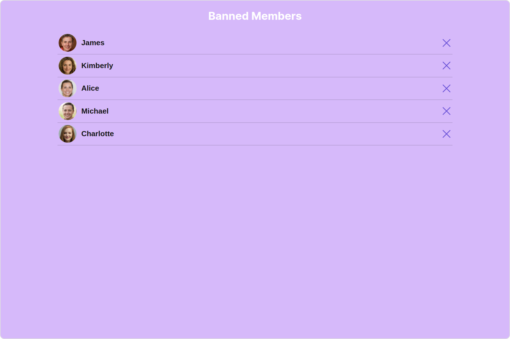

<Tabs>
<TabItem value="app.component.ts" label="app.component.ts">

```javascript
import { CometChat } from '@cometchat/chat-sdk-javascript';
import { Component, OnInit } from '@angular/core';
import {  CometChatThemeService, CometChatUIKit } from '@cometchat/chat-uikit-angular';
import { BannedMembersStyle } from '@cometchat/uikit-shared';
import "@cometchat/uikit-elements";

@Component({
  selector: 'app-root',
  templateUrl: './app.component.html',
  styleUrls: ['./app.component.css']
})
export class AppComponent {

  public groupObject!: CometChat.Group;
  ngOnInit(): void {
    CometChat.getGroup("guid").then((group: CometChat.Group) => {
      this.groupObject = group;
    });
  }
  bannedMembersStyle = new BannedMembersStyle({
    background: "#d6b9fa",
    titleTextColor: "#ffffff",
    separatorColor: "#6d1fcf",
    onlineStatusColor: "#b1f029",
  });
  constructor(private themeService:CometChatThemeService) {
    themeService.theme.palette.setMode("light")
    themeService.theme.palette.setPrimary({ light: "#6851D6", dark: "#6851D6" })
  }

  onLogin(UID?: any) {
    CometChatUIKit.login({ uid: UID }).then(
      (user) => {
        setTimeout(() => {
          window.location.reload();
        }, 1000);
      },
      (error) => {
        console.log("Login failed with exception:", { error });
      }
    );
  }
}
```

</TabItem>
<TabItem value="ts" label="app.component.html">

```html
<div class="fullwidth">
  <cometchat-banned-members
    *ngIf="groupObject"
    [group]="groupObject"
    [bannedMembersStyle]="bannedMembersStyle"
  ></cometchat-banned-members>
</div>
```

</TabItem>
</Tabs>

List of properties exposed by BannedMembersStyle

| Property                       | Description                          | Code                                   |
| ------------------------------ | ------------------------------------ | -------------------------------------- |
| **border**                     | Used to set border                   | `border?: string,`                     |
| **borderRadius**               | Used to set border radius            | `borderRadius?: string;`               |
| **background**                 | Used to set background colour        | `background?: string;`                 |
| **height**                     | Used to set height                   | `height?: string;`                     |
| **width**                      | Used to set width                    | `width?: string;`                      |
| **titleTextFont**              | Used to set title text font          | `titleTextFont?: string,`              |
| **titleTextColor**             | Used to set title text color         | `titleTextColor?: string;`             |
| **searchPlaceholderTextFont**  | Used to set search placeholder font  | `searchPlaceholderTextFont?: string;`  |
| **searchPlaceholderTextColor** | Used to set search placeholder color | `searchPlaceholderTextColor?: string;` |
| **searchTextFont**             | Used to set search text font         | `searchTextFont?: string;`             |
| **searchTextColor**            | Used to set search text color        | `searchTextColor?: string;`            |
| **emptyStateTextFont**         | Used to set empty state text font    | `emptyStateTextFont?: string;`         |
| **emptyStateTextColor**        | Used to set empty state text color   | `emptyStateTextColor?: string;`        |
| **errorStateTextFont**         | Used to set error state text font    | `errorStateTextFont?: string;`         |
| **errorStateTextColor**        | Used to set error state text color   | `errorStateTextColor?: string;`        |
| **loadingIconTint**            | Used to set loading icon tint        | `loadingIconTint?: string;`            |
| **searchIconTint**             | Used to set search icon tint         | `searchIconTint?: string;`             |
| **searchBorder**               | Used to set search border            | `searchBorder?: string;`               |
| **searchBorderRadius**         | Used to set search border radius     | `searchBorderRadius?: string;`         |
| **searchBackground**           | Used to set search background color  | `searchBackground?: string;`           |
| **onlineStatusColor**          | Used to set online status color      | `onlineStatusColor?: string;`          |
| **separatorColor**             | Used to set separator color          | `separatorColor?: string;`             |
| **boxShadow**                  | Used to set box shadow               | `boxShadow?: string;`                  |
| **backButtonIconTint**         | Used to set back button icon tint    | `backButtonIconTint?: string;`         |
| **closeButtonIconTint**        | Used to set close button icon tint   | `closeButtonIconTint?: string;`        |
| **unbanIconTint**              | Used to set unban icon tint          | `unbanIconTint?: string;`              |
| **padding**                    | Used to set padding                  | `padding?: string;`                    |

##### 2. Avatar Style

To apply customized styles to the `Avatar` component in the Banned Members Component, you can use the following code snippet. For further insights on `Avatar` Styles [refer](/ui-kit/angular/avatar#avatar-style)

<Tabs>
<TabItem value="app.component.ts" label="app.component.ts">

```javascript
import { CometChat } from '@cometchat/chat-sdk-javascript';
import { Component, OnInit } from '@angular/core';
import {  CometChatThemeService, CometChatUIKit, AvatarStyle } from '@cometchat/chat-uikit-angular';
import "@cometchat/uikit-elements";

@Component({
  selector: 'app-root',
  templateUrl: './app.component.html',
  styleUrls: ['./app.component.css']
})
export class AppComponent {

  public groupObject!: CometChat.Group;
  ngOnInit(): void {
    CometChat.getGroup("guid").then((group: CometChat.Group) => {
      this.groupObject = group;
    });
  }
  avatarStyle = new AvatarStyle({
    backgroundColor: "#cdc2ff",
    border: "2px solid #6745ff",
    borderRadius: "10px",
    outerViewBorderColor: "#ca45ff",
    outerViewBorderRadius: "5px",
    nameTextColor: "#4554ff"
  });
  constructor(private themeService:CometChatThemeService) {
    themeService.theme.palette.setMode("light")
    themeService.theme.palette.setPrimary({ light: "#6851D6", dark: "#6851D6" })
  }

  onLogin(UID?: any) {
    CometChatUIKit.login({ uid: UID }).then(
      (user) => {
        setTimeout(() => {
          window.location.reload();
        }, 1000);
      },
      (error) => {
        console.log("Login failed with exception:", { error });
      }
    );
  }
}
```

</TabItem>
<TabItem value="ts" label="app.component.html">

```html
<div class="fullwidth">
  <cometchat-banned-members
    *ngIf="groupObject"
    [group]="groupObject"
    [avatarStyle]="avatarStyle"
  ></cometchat-banned-members>
</div>
```

</TabItem>
</Tabs>

##### 3. LisItem Style

To apply customized styles to the `List Item` component in the `Banned Members` Component, you can use the following code snippet. For further insights on `List Item` Styles [refer](/ui-kit/angular/list-item)

<Tabs>
<TabItem value="app.component.ts" label="app.component.ts">

```javascript
import { CometChat } from '@cometchat/chat-sdk-javascript';
import { Component, OnInit } from '@angular/core';
import {  CometChatThemeService, CometChatUIKit, ListItemStyle } from '@cometchat/chat-uikit-angular';
import "@cometchat/uikit-elements";

@Component({
  selector: 'app-root',
  templateUrl: './app.component.html',
  styleUrls: ['./app.component.css']
})
export class AppComponent {

  public groupObject!: CometChat.Group;
  ngOnInit(): void {
    CometChat.getGroup("guid").then((group: CometChat.Group) => {
      this.groupObject = group;
    });
  }
  listItemStyle: ListItemStyle = new ListItemStyle({
    background: "transparent",
    padding: "5px",
    border: "1px solid #e9b8f5",
    titleColor: "#8830f2",
    borderRadius: "20px",
    width: "100% !important"
  });
  constructor(private themeService:CometChatThemeService) {
    themeService.theme.palette.setMode("light")
    themeService.theme.palette.setPrimary({ light: "#6851D6", dark: "#6851D6" })
  }

  onLogin(UID?: any) {
    CometChatUIKit.login({ uid: UID }).then(
      (user) => {
        setTimeout(() => {
          window.location.reload();
        }, 1000);
      },
      (error) => {
        console.log("Login failed with exception:", { error });
      }
    );
  }
}
```

</TabItem>
<TabItem value="ts" label="app.component.html">

```html
<div class="fullwidth">
  <cometchat-banned-members
    *ngIf="groupObject"
    [group]="groupObject"
    [listItemStyle]="listItemStyle"
  ></cometchat-banned-members>
</div>
```

</TabItem>
</Tabs>

##### 4. StatusIndicator Style

To apply customized styles to the Status Indicator component in the Banned Members Component, You can use the following code snippet. For further insights on Status Indicator Styles [refer](/ui-kit/angular/status-indicator)

<Tabs>
<TabItem value="app.component.ts" label="app.component.ts">

```javascript
import { CometChat } from '@cometchat/chat-sdk-javascript';
import { Component, OnInit } from '@angular/core';
import {  CometChatThemeService, CometChatUIKit } from '@cometchat/chat-uikit-angular';
import "@cometchat/uikit-elements";

@Component({
  selector: 'app-root',
  templateUrl: './app.component.html',
  styleUrls: ['./app.component.css']
})
export class AppComponent {

  public groupObject!: CometChat.Group;
  ngOnInit(): void {
    CometChat.getGroup("guid").then((group: CometChat.Group) => {
      this.groupObject = group;
    });
  }
  statusIndicatorStyle: any = ({
    height: '20px',
    width: '20px',
    backgroundColor: 'red'
  });
  constructor(private themeService:CometChatThemeService) {
    themeService.theme.palette.setMode("light")
    themeService.theme.palette.setPrimary({ light: "#6851D6", dark: "#6851D6" })
  }

  onLogin(UID?: any) {
    CometChatUIKit.login({ uid: UID }).then(
      (user) => {
        setTimeout(() => {
          window.location.reload();
        }, 1000);
      },
      (error) => {
        console.log("Login failed with exception:", { error });
      }
    );
  }
}
```

</TabItem>
<TabItem value="ts" label="app.component.html">

```html
<div class="fullwidth">
  <cometchat-banned-members
    *ngIf="groupObject"
    [group]="groupObject"
    [statusIndicatorStyle]="statusIndicatorStyle"
  ></cometchat-banned-members>
</div>
```

</TabItem>
</Tabs>

---

### Functionality

These are a set of small functional customizations that allow you to fine-tune the overall experience of the component. With these, you can change text, set custom icons, and toggle the visibility of UI elements.

<Tabs>
<TabItem value="app.component.ts" label="app.component.ts">

```javascript
import { CometChat } from '@cometchat/chat-sdk-javascript';
import { Component, OnInit } from '@angular/core';
import {  CometChatThemeService, CometChatUIKit } from '@cometchat/chat-uikit-angular';
import { TitleAlignment } from '@cometchat/uikit-resources';
import "@cometchat/uikit-elements";

@Component({
  selector: 'app-root',
  templateUrl: './app.component.html',
  styleUrls: ['./app.component.css']
})
export class AppComponent {

  public groupObject!: CometChat.Group;
  ngOnInit(): void {
    CometChat.getGroup("guid").then((group: CometChat.Group) => {
      this.groupObject = group;
    });
  }
  titleAlignment = TitleAlignment.left;
  myCustomIcon="your custom icon url"
  constructor(private themeService:CometChatThemeService) {
    themeService.theme.palette.setMode("light")
    themeService.theme.palette.setPrimary({ light: "#6851D6", dark: "#6851D6" })
  }

  onLogin(UID?: any) {
    CometChatUIKit.login({ uid: UID }).then(
      (user) => {
        setTimeout(() => {
          window.location.reload();
        }, 1000);
      },
      (error) => {
        console.log("Login failed with exception:", { error });
      }
    );
  }
}
```

</TabItem>
<TabItem value="ts" label="app.component.html">

```html
<div class="fullwidth">
  <cometchat-banned-members
    *ngIf="groupObject"
    [group]="groupObject"
    [title]="'Your Custom Title'"
    [titleAlignment]="titleAlignment"
    [unbanIconURL]="myCustomIcon"
  ></cometchat-banned-members>
</div>
```

</TabItem>
</Tabs>

Default:
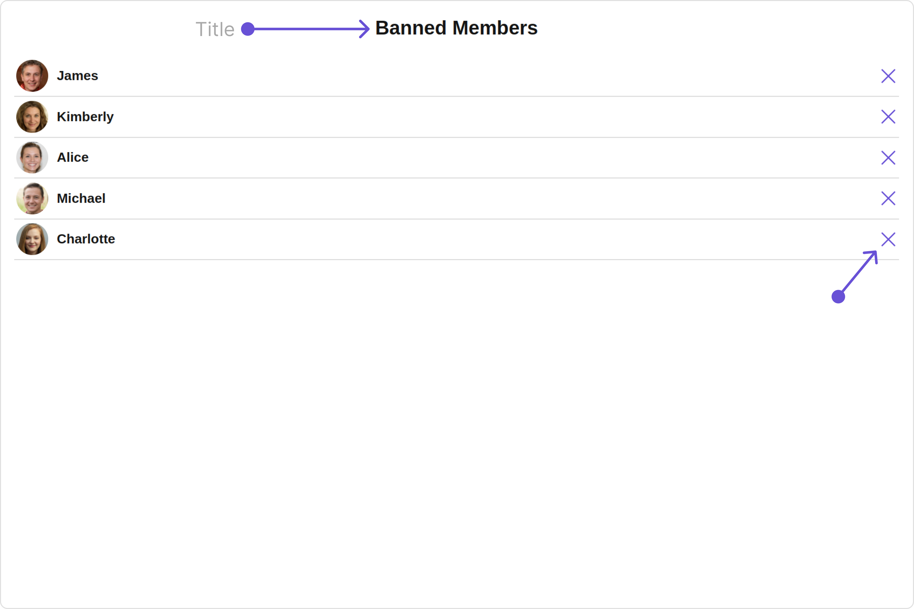

Custom:
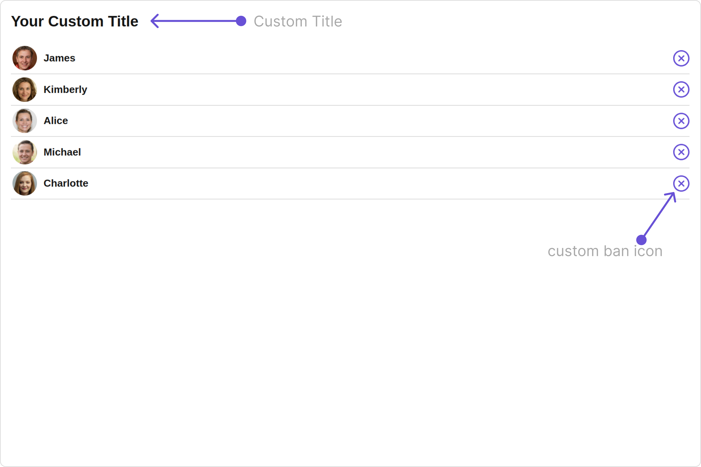

Below is a list of customizations along with corresponding code snippets

| Property                                                                                                             | Description                                                                                           | Code                                                |
| -------------------------------------------------------------------------------------------------------------------- | ----------------------------------------------------------------------------------------------------- | --------------------------------------------------- |
| **title** <a data-tooltip-id="my-tooltip-html-prop"> <span class="material-icons red">report</span> </a>             | Used to set title in the app heading                                                                  | `[title]="'Your Custom Title'"`                     |
| **errorStateText** <a data-tooltip-id="my-tooltip-html-prop"> <span class="material-icons red">report</span> </a>    | Used to set a custom text response when some error occurs on fetching the list of banned members      | `[errorStateText]="'your custom error state text'"` |
| **emptyStateText** <a data-tooltip-id="my-tooltip-html-prop"> <span class="material-icons red">report</span> </a>    | Used to set a custom text response when fetching the banned members has returned an empty list        | `[emptyStateText]="'your custom empty state text'"` |
| **searchPlaceholder** <a data-tooltip-id="my-tooltip-html-prop"> <span class="material-icons red">report</span> </a> | Used to set custom search placeholder text                                                            | `[searchPlaceholder]="'Custom Search PlaceHolder'"` |
| **unbanIconURL**                                                                                                     | Used to set the Unban button Icon in the banned user lists                                            | `[unbanIconURL]="unbanIconURL"`                     |
| **searchIconURL**                                                                                                    | Used to set search Icon in the search field                                                           | `[searchIconURL]="searchIconURL"`                   |
| **loadingIconURL**                                                                                                   | Used to set loading Icon                                                                              | `[loadingIconURL]="loadingIconURL"`                 |
| **closeButtonIconURL**                                                                                               | Used to set close button Icon                                                                         | `[closeButtonIconURL]="closeButtonIconURL"`         |
| **backButtonIconURL**                                                                                                | Used to set the back button Icon                                                                      | `[backButtonIconURL]="backButtonIconURL"`           |
| **hideError**                                                                                                        | Used to hide error on fetching banned members                                                         | `[hideError]="true"`                                |
| **hideSearch**                                                                                                       | Used to toggle visibility for search box                                                              | `[hideSearch]="true"`                               |
| **hideSeparator**                                                                                                    | Used to hide the divider separating the banned member items                                           | `[hideSeparator]="true"`                            |
| **disableUsersPresence**                                                                                             | Used to toggle functionality to show user's presence                                                  | `[disableUsersPresence]="true"`                     |
| **showBackButton**                                                                                                   | Hides / shows the back button as per the boolean value                                                | `[showBackButton]="true"`                           |
| **selectionMode**                                                                                                    | set the number of banned members that can be selected, SelectionMode can be single, multiple or none. | `[selectionMode]="selectionMode"`                   |
| **titleAlignment**                                                                                                   | Alignment of the heading text for the component                                                       | `[titleAlignment]="titleAlignment"`                 |
| **group** <a data-tooltip-id="my-tooltip-html-prop"> <span class="material-icons red">report</span> </a>             | Used to pass group object of which group members will be shown                                        | `[group]="groupObject"`                             |

---

### Advance

For advanced-level customization, you can set custom views to the component. This lets you tailor each aspect of the component to fit your exact needs and application aesthetics. You can create and define your views, layouts, and UI elements and then incorporate those into the component.

---

#### ListItemView

With this property, you can assign a custom ListItem to the Banned Members Component.

**Example**

Default:
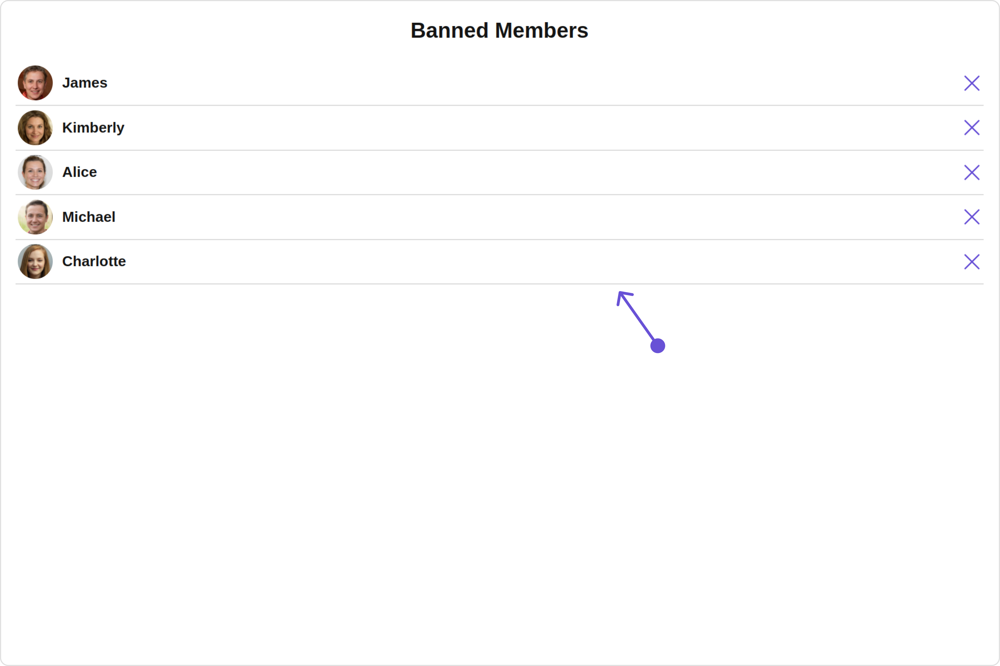

Custom:
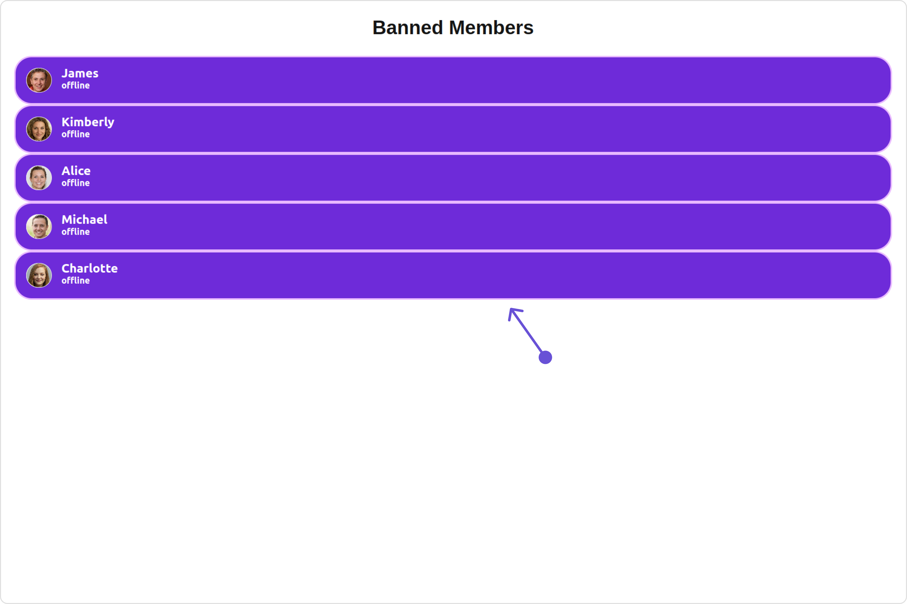

<Tabs>
<TabItem value="app.component.ts" label="app.component.ts">

```javascript
import { CometChat } from '@cometchat/chat-sdk-javascript';
import { Component, OnInit } from '@angular/core';
import {  CometChatThemeService, CometChatUIKit } from '@cometchat/chat-uikit-angular';
import "@cometchat/uikit-elements";

@Component({
  selector: 'app-root',
  templateUrl: './app.component.html',
  styleUrls: ['./app.component.css']
})
export class AppComponent {

  public groupObject!: CometChat.Group;
  ngOnInit(): void {
    CometChat.getGroup("guid").then((group: CometChat.Group) => {
      this.groupObject = group;
    });
  }
  constructor(private themeService:CometChatThemeService) {
    themeService.theme.palette.setMode("light")
    themeService.theme.palette.setPrimary({ light: "#6851D6", dark: "#6851D6" })
  }

  onLogin(UID?: any) {
    CometChatUIKit.login({ uid: UID }).then(
      (user) => {
        setTimeout(() => {
          window.location.reload();
        }, 1000);
      },
      (error) => {
        console.log("Login failed with exception:", { error });
      }
    );
  }
}
```

</TabItem>
<TabItem value="ts" label="app.component.html">

```html
<div class="fullwidth">
  <cometchat-banned-members
    *ngIf="groupObject"
    [group]="groupObject"
    [listItemView]="listItemViewTemplate"
  ></cometchat-banned-members>
</div>
<ng-template #listItemViewTemplate let-user>
  <div
    [ngStyle]="{
      display: 'flex',
      alignItems: 'left',
      padding: '10px',
      border: '2px solid #e9baff',
      borderRadius: '20px',
      background: '#ffffff'
    }"
  >
    <cometchat-avatar
      [image]="user.getAvatar()"
      [name]="user.getName()"
    ></cometchat-avatar>
    <div [ngStyle]="{ display: 'flex', paddingLeft: '10px' }">
      <div
        [ngStyle]="{
          fontWeight: 'bold',
          color: '#937aff',
          fontSize: '14px',
          marginTop: '5px'
        }"
      >
        {{ user.getName() }}
        <div
          [ngStyle]="{
            color: '#cfc4ff',
            fontSize: '10px',
            textAlign: 'left'
          }"
        >
          {{ user.getStatus() }}
        </div>
      </div>
    </div>
  </div>
</ng-template>
```

</TabItem>
</Tabs>

---

#### SubtitleView

You can customize the subtitle view for each banned members to meet your requirements

Default:
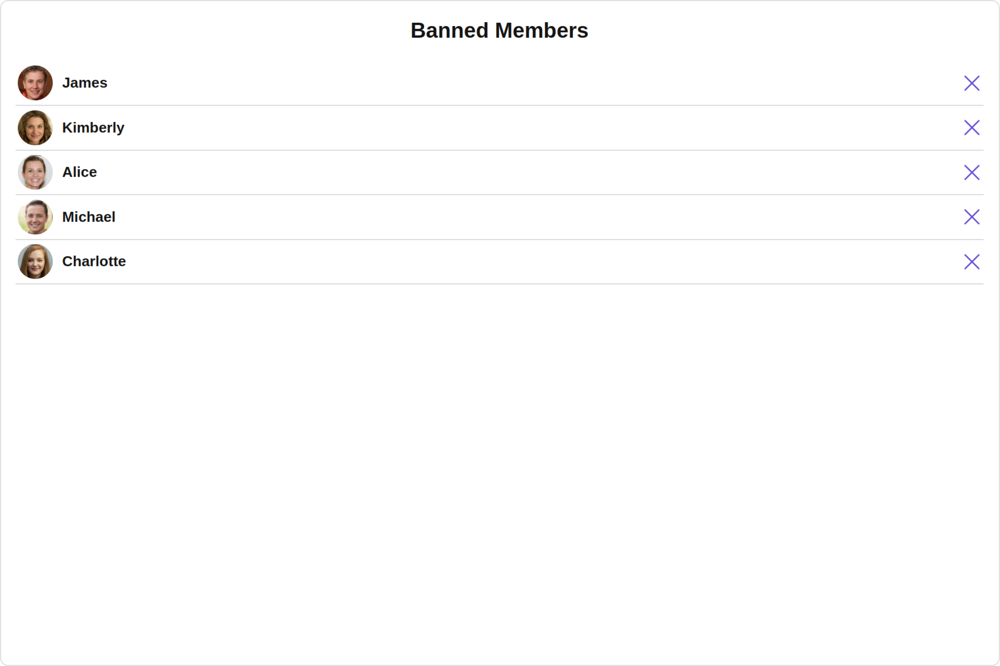

Custom:
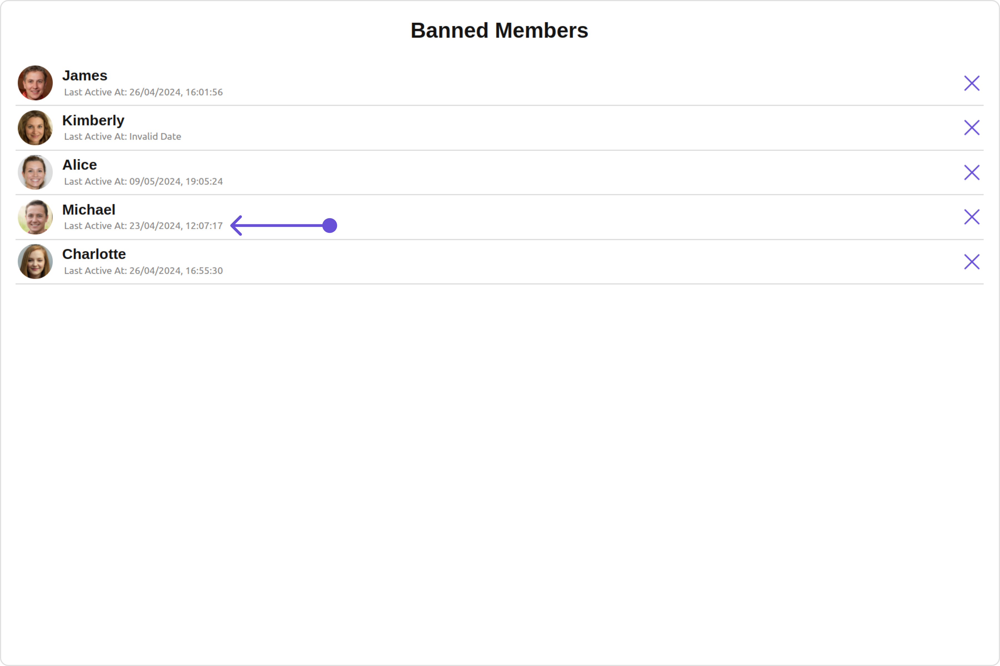

<Tabs>
<TabItem value="app.component.ts" label="app.component.ts">

```javascript
import { CometChat } from '@cometchat/chat-sdk-javascript';
import { Component, OnInit } from '@angular/core';
import {  CometChatThemeService, CometChatUIKit } from '@cometchat/chat-uikit-angular';
import "@cometchat/uikit-elements";

@Component({
  selector: 'app-root',
  templateUrl: './app.component.html',
  styleUrls: ['./app.component.css']
})
export class AppComponent {

  public groupObject!: CometChat.Group;
  ngOnInit(): void {
    CometChat.getGroup("guid").then((group: CometChat.Group) => {
      this.groupObject = group;
    });
  }
  constructor(private themeService:CometChatThemeService) {
    themeService.theme.palette.setMode("light")
    themeService.theme.palette.setPrimary({ light: "#6851D6", dark: "#6851D6" })
  }

  onLogin(UID?: any) {
    CometChatUIKit.login({ uid: UID }).then(
      (user) => {
        setTimeout(() => {
          window.location.reload();
        }, 1000);
      },
      (error) => {
        console.log("Login failed with exception:", { error });
      }
    );
  }
}
```

</TabItem>
<TabItem value="ts" label="app.component.html">

```html
<div class="fullwidth">
  <cometchat-banned-members
    *ngIf="groupObject"
    [group]="groupObject"
    [subtitleView]="subtitleTemplate"
  ></cometchat-banned-members>
</div>
<ng-template #subtitleTemplate>
  <div
    style="display: flex; align-items: left; padding: 10px; font-size: 10px;"
  >
    your custom subtitle view
  </div>
</ng-template>
```

</TabItem>
</Tabs>

---

#### LoadingStateView

You can set a custom loader view using `loadingStateView` to match the loading view of your app.

Default:
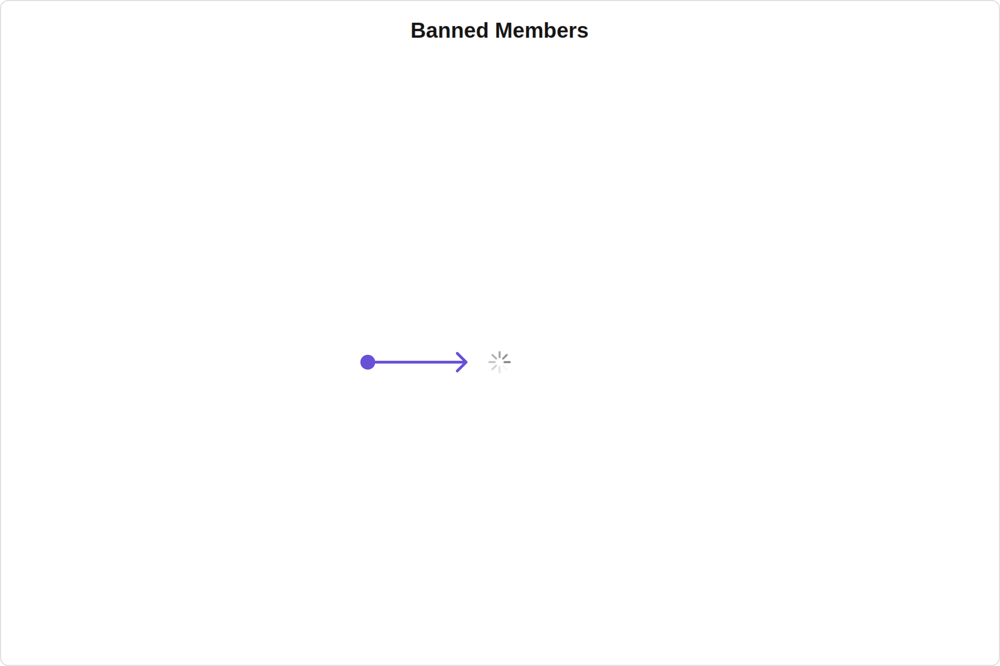

Custom:
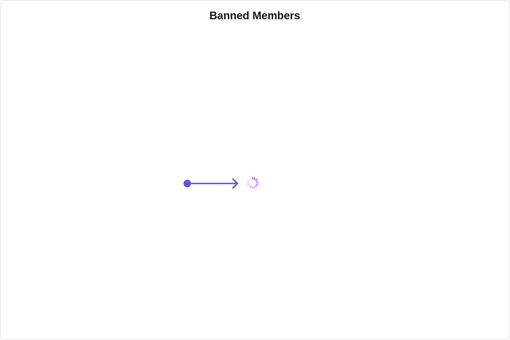

<Tabs>
<TabItem value="app.component.ts" label="app.component.ts">

```javascript
import { CometChat } from '@cometchat/chat-sdk-javascript';
import { Component, OnInit } from '@angular/core';
import {  CometChatThemeService, CometChatUIKit, LoaderStyle } from '@cometchat/chat-uikit-angular';
import "@cometchat/uikit-elements";

@Component({
  selector: 'app-root',
  templateUrl: './app.component.html',
  styleUrls: ['./app.component.css']
})
export class AppComponent {

  public groupObject!: CometChat.Group;
  ngOnInit(): void {
    CometChat.getGroup("guid").then((group: CometChat.Group) => {
      this.groupObject = group;
    });
  }
  getLoaderStyle: LoaderStyle = new LoaderStyle({
    iconTint: "red",
    background: "transparent",
    height: "20px",
    width: "20px",
    border: "none",
    borderRadius: "0",
  });
  constructor(private themeService:CometChatThemeService) {
    themeService.theme.palette.setMode("light")
    themeService.theme.palette.setPrimary({ light: "#6851D6", dark: "#6851D6" })
  }

  onLogin(UID?: any) {
    CometChatUIKit.login({ uid: UID }).then(
      (user) => {
        setTimeout(() => {
          window.location.reload();
        }, 1000);
      },
      (error) => {
        console.log("Login failed with exception:", { error });
      }
    );
  }
}
```

</TabItem>
<TabItem value="ts" label="app.component.html">

```html
<div class="fullwidth">
  <cometchat-banned-members
    *ngIf="groupObject"
    [group]="groupObject"
    [loadingStateView]="loadingStateView"
  ></cometchat-banned-members>
</div>
<ng-template #loadingStateView>
  <cometchat-loader
    iconURL="icon"
    [loaderStyle]="getLoaderStyle"
  ></cometchat-loader>
</ng-template>
```

</TabItem>
</Tabs>

---

#### EmptyStateView

You can set a custom `EmptyStateView` using `emptyStateView` to match the empty view of your app.

Default:
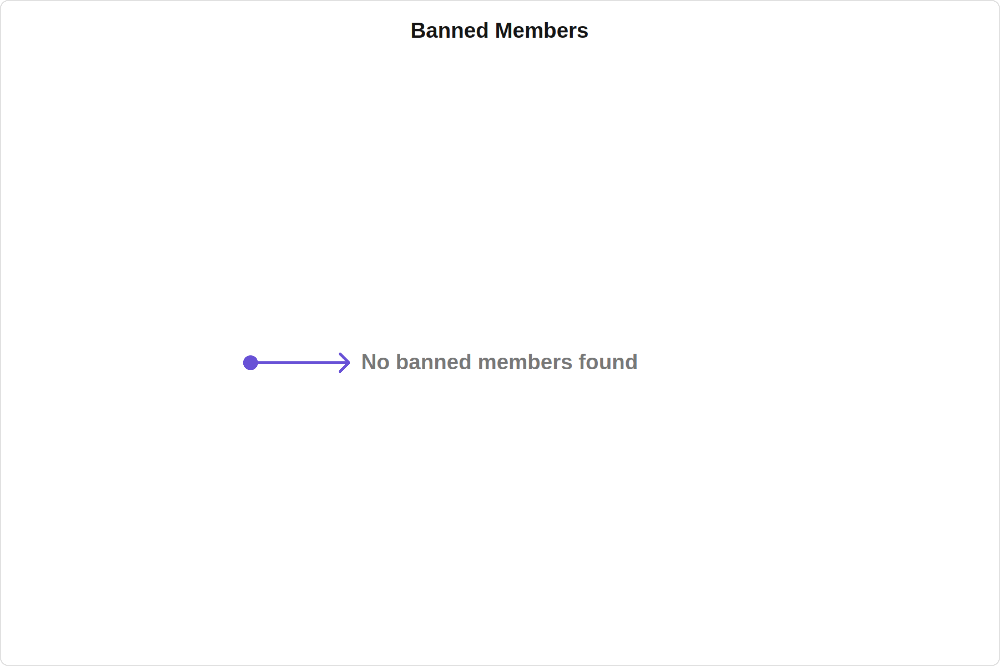

Custom:
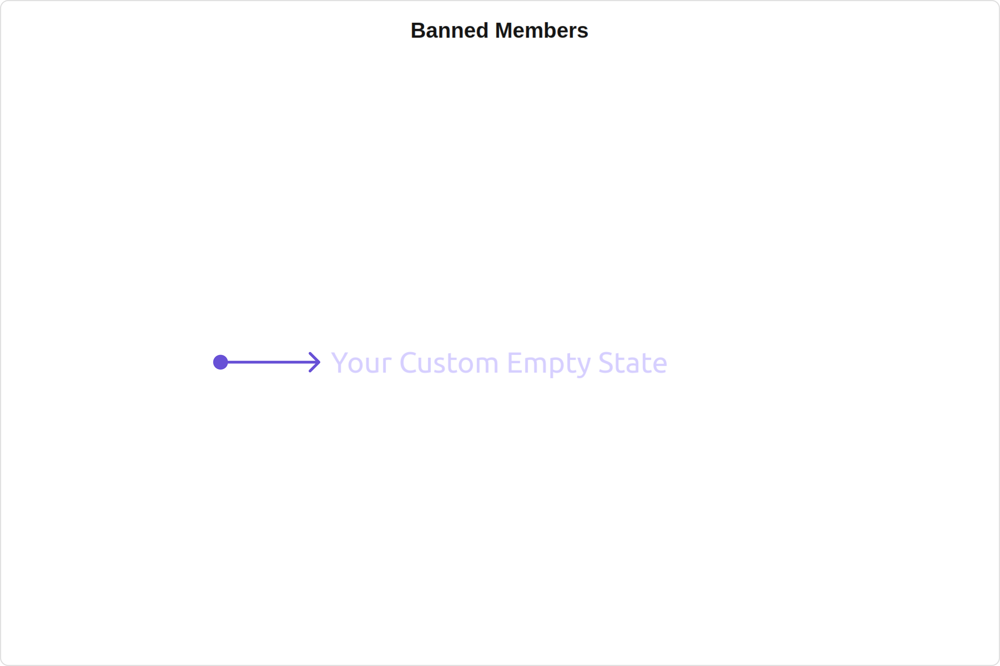

<Tabs>
<TabItem value="app.component.ts" label="app.component.ts">

```javascript
import { CometChat } from '@cometchat/chat-sdk-javascript';
import { Component, OnInit } from '@angular/core';
import {  CometChatThemeService, CometChatUIKit } from '@cometchat/chat-uikit-angular';
import "@cometchat/uikit-elements";

@Component({
  selector: 'app-root',
  templateUrl: './app.component.html',
  styleUrls: ['./app.component.css']
})
export class AppComponent {

  public groupObject!: CometChat.Group;
  ngOnInit(): void {
    CometChat.getGroup("guid").then((group: CometChat.Group) => {
      this.groupObject = group;
    });
  }
  constructor(private themeService:CometChatThemeService) {
    themeService.theme.palette.setMode("light")
    themeService.theme.palette.setPrimary({ light: "#6851D6", dark: "#6851D6" })
  }

  onLogin(UID?: any) {
    CometChatUIKit.login({ uid: UID }).then(
      (user) => {
        setTimeout(() => {
          window.location.reload();
        }, 1000);
      },
      (error) => {
        console.log("Login failed with exception:", { error });
      }
    );
  }
}
```

</TabItem>
<TabItem value="ts" label="app.component.html">

```html
<div class="fullwidth">
  <cometchat-banned-members
    *ngIf="groupObject"
    [group]="groupObject"
    [emptyStateView]="emptyStateView"
  ></cometchat-banned-members>
</div>
<ng-template #emptyStateView>
  <div>Your Custom Empty State</div>
</ng-template>
```

</TabItem>
</Tabs>

---

#### ErrorStateView

You can set a custom `ErrorStateView` using `errorStateView` to match the error view of your app.

Default:
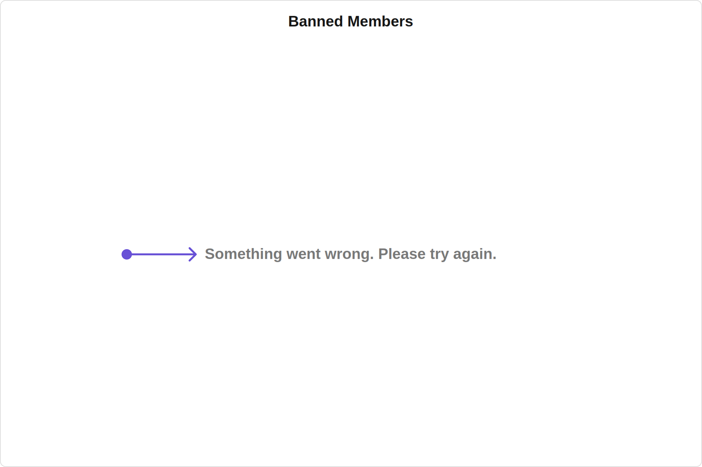

Custom:
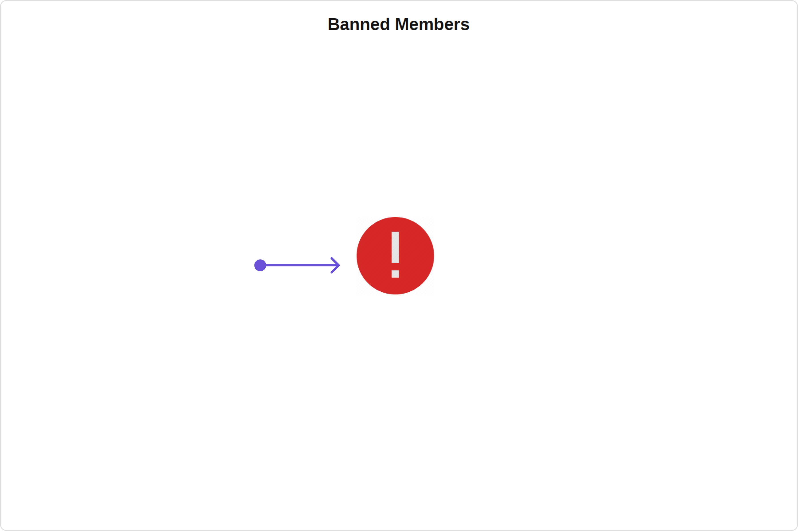

<Tabs>
<TabItem value="app.component.ts" label="app.component.ts">

```javascript
import { CometChat } from '@cometchat/chat-sdk-javascript';
import { Component, OnInit } from '@angular/core';
import {  CometChatThemeService, CometChatUIKit } from '@cometchat/chat-uikit-angular';
import "@cometchat/uikit-elements";

@Component({
  selector: 'app-root',
  templateUrl: './app.component.html',
  styleUrls: ['./app.component.css']
})
export class AppComponent {

  public groupObject!: CometChat.Group;
  ngOnInit(): void {
    CometChat.getGroup("guid").then((group: CometChat.Group) => {
      this.groupObject = group;
    });
  }
  constructor(private themeService:CometChatThemeService) {
    themeService.theme.palette.setMode("light")
    themeService.theme.palette.setPrimary({ light: "#6851D6", dark: "#6851D6" })
  }

  onLogin(UID?: any) {
    CometChatUIKit.login({ uid: UID }).then(
      (user) => {
        setTimeout(() => {
          window.location.reload();
        }, 1000);
      },
      (error) => {
        console.log("Login failed with exception:", { error });
      }
    );
  }
}
```

</TabItem>
<TabItem value="ts" label="app.component.html">

```html
<div class="fullwidth">
  <cometchat-banned-members
    *ngIf="groupObject"
    [group]="groupObject"
    [errorStateView]="errorStateView"
  ></cometchat-banned-members>
</div>
<ng-template #errorStateView>
  <div style="height: 100vh; width: 100vw">
    
  </div>
</ng-template>
```

</TabItem>
</Tabs>

---

#### Menus

You can set the Custom Menu view to add more options to the Banned Members component.

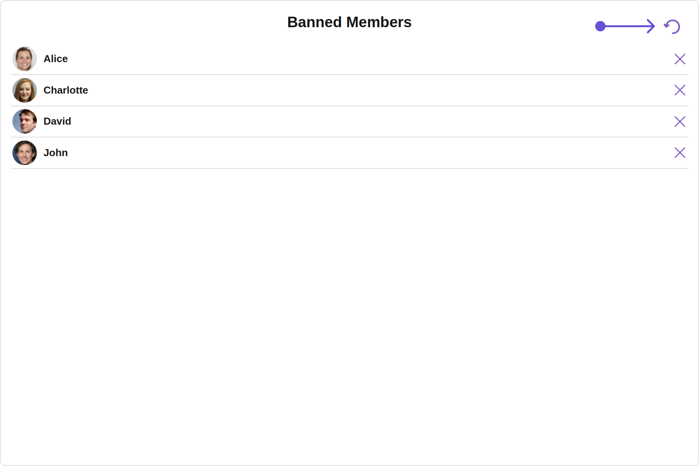

<Tabs>
<TabItem value="app.component.ts" label="app.component.ts">

```javascript
import { CometChat } from '@cometchat/chat-sdk-javascript';
import { Component, OnInit } from '@angular/core';
import {  CometChatThemeService, CometChatUIKit } from '@cometchat/chat-uikit-angular';
import "@cometchat/uikit-elements";

@Component({
  selector: 'app-root',
  templateUrl: './app.component.html',
  styleUrls: ['./app.component.css']
})
export class AppComponent {

  public groupObject!: CometChat.Group;
  ngOnInit(): void {
    CometChat.getGroup("guid").then((group: CometChat.Group) => {
      this.groupObject = group;
    });
  }
  handleReload(): void {
    window.location.reload();
  }

  getButtonStyle() {
    return {
      height: '20px',
      width: '20px',
      border: 'none',
      borderRadius: '0',
      background: 'transparent'
    };
  }
  getButtonIconStyle() {
    return {
      color: '#7E57C2'
    };
  }
  constructor(private themeService:CometChatThemeService) {
    themeService.theme.palette.setMode("light")
    themeService.theme.palette.setPrimary({ light: "#6851D6", dark: "#6851D6" })
  }

  onLogin(UID?: any) {
    CometChatUIKit.login({ uid: UID }).then(
      (user) => {
        setTimeout(() => {
          window.location.reload();
        }, 1000);
      },
      (error) => {
        console.log("Login failed with exception:", { error });
      }
    );
  }
}
```

</TabItem>
<TabItem value="ts" label="app.component.html">

```html
<div class="fullwidth">
  <cometchat-banned-members
    *ngIf="groupObject"
    [group]="groupObject"
    [menu]="menuTemplate"
  ></cometchat-banned-members>
</div>
<ng-template #menuTemplate>
  <div style="margin-right: 20px;">
    <button [ngStyle]="getButtonStyle()" (click)="handleReload()">
      
    </button>
  </div>
</ng-template>
```

</TabItem>
</Tabs>

---

#### Options

You can set the Custom options to the Banned Members component.

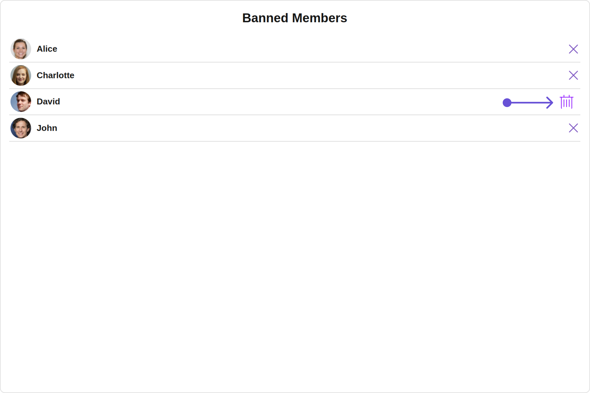

<Tabs>
<TabItem value="app.component.ts" label="app.component.ts">

```javascript
import { CometChat } from '@cometchat/chat-sdk-javascript';
import { Component, OnInit } from '@angular/core';
import {  CometChatThemeService, CometChatUIKit } from '@cometchat/chat-uikit-angular';
import { CometChatOption } from '@cometchat/uikit-resources';
import "@cometchat/uikit-elements";

@Component({
  selector: 'app-root',
  templateUrl: './app.component.html',
  styleUrls: ['./app.component.css']
})
export class AppComponent {

  public groupObject!: CometChat.Group;
  ngOnInit(): void {
    CometChat.getGroup("guid").then((group: CometChat.Group) => {
      this.groupObject = group;
    });
  }
  getOptions = (user: any) => {
    const customOptions = [
      new CometChatOption({
        id: "1",
        title: "Title",
        iconURL: icon,
        iconTint:'green',
        backgroundColor: "transparent",
        onClick: () => {
          console.log("Custom option clicked for user:", user);
        },
      }),
    ];
    return customOptions;
  };
  constructor(private themeService:CometChatThemeService) {
    themeService.theme.palette.setMode("light")
    themeService.theme.palette.setPrimary({ light: "#6851D6", dark: "#6851D6" })
  }

  onLogin(UID?: any) {
    CometChatUIKit.login({ uid: UID }).then(
      (user) => {
        setTimeout(() => {
          window.location.reload();
        }, 1000);
      },
      (error) => {
        console.log("Login failed with exception:", { error });
      }
    );
  }
}
```

</TabItem>
<TabItem value="ts" label="app.component.html">

```html
<div class="fullwidth">
  <cometchat-banned-members
    *ngIf="groupObject"
    [group]="groupObject"
    [options]="getOptions"
  ></cometchat-banned-members>
</div>
```

</TabItem>
</Tabs>

---

import { Tooltip } from 'react-tooltip'
import 'react-tooltip/dist/react-tooltip.css'

<Tooltip
  id="my-tooltip-html-prop"
  html="Not available in BannedMembersConfiguration"
/>
