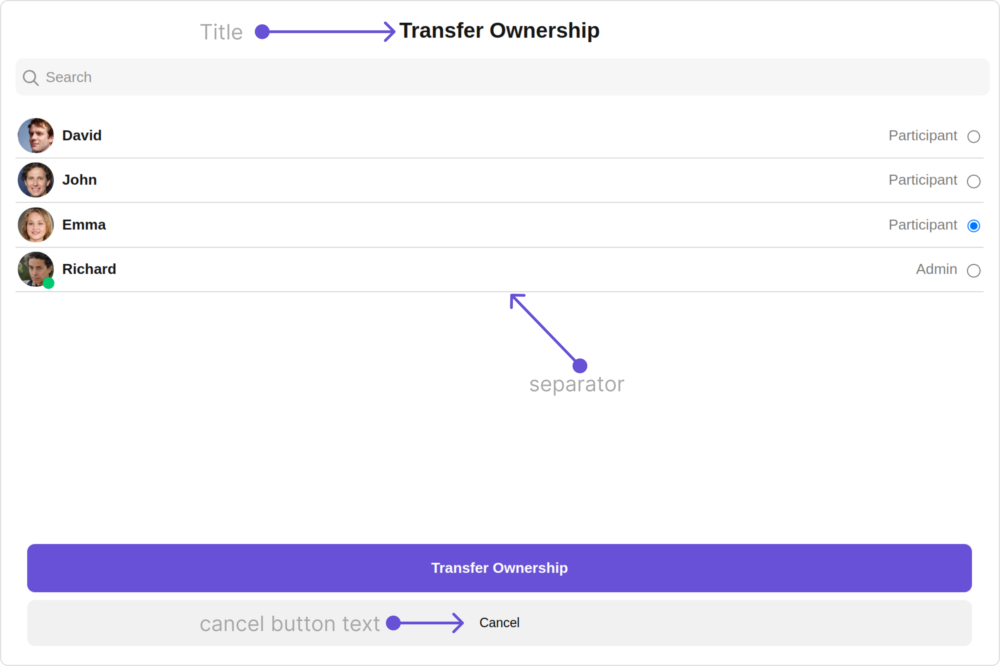
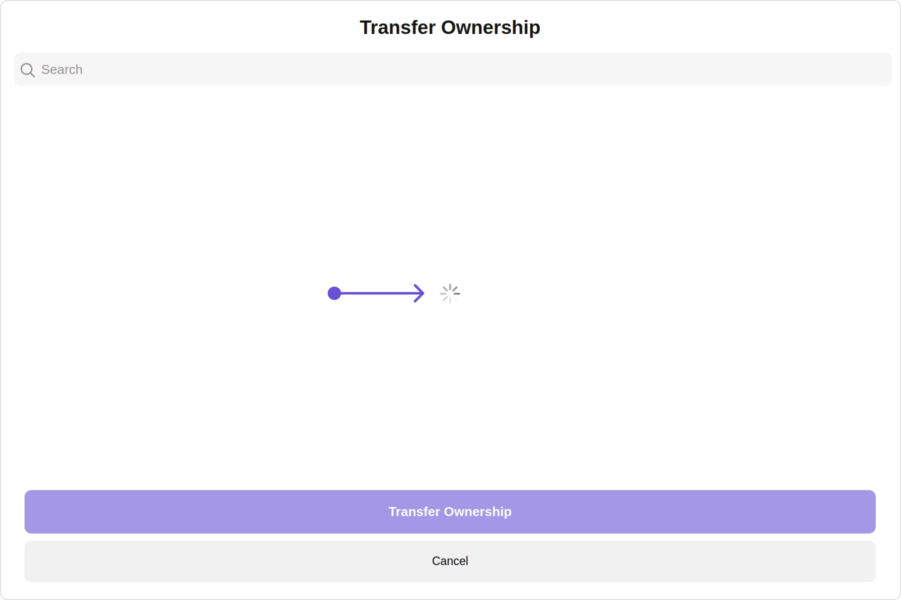
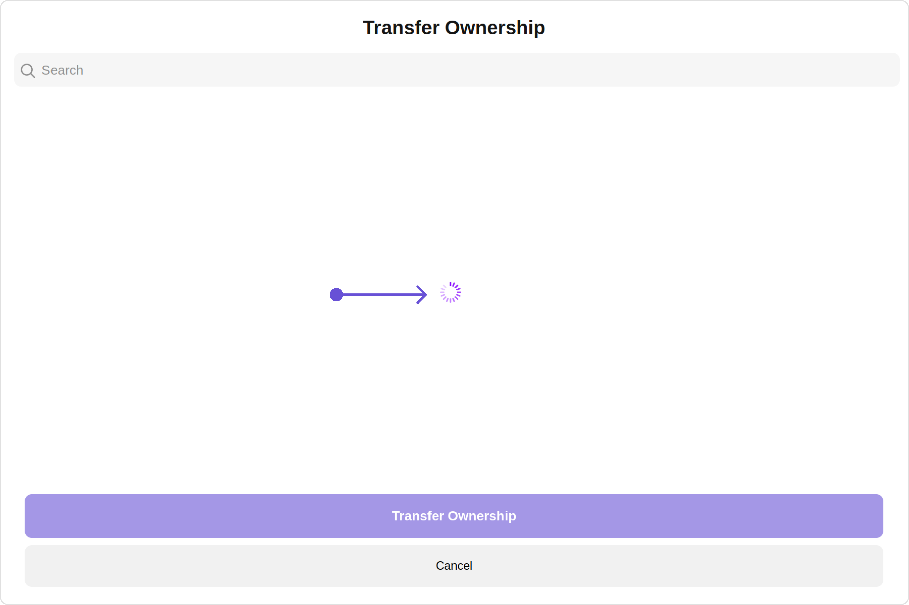
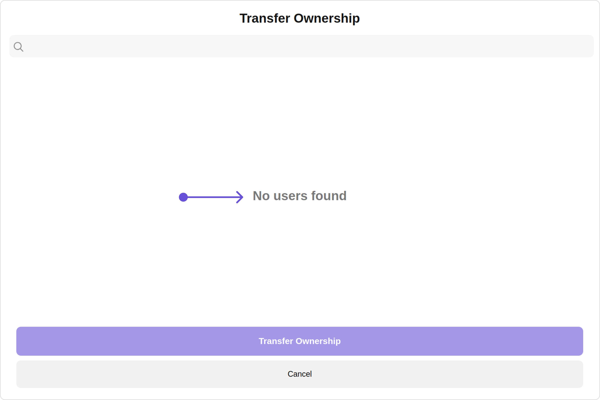
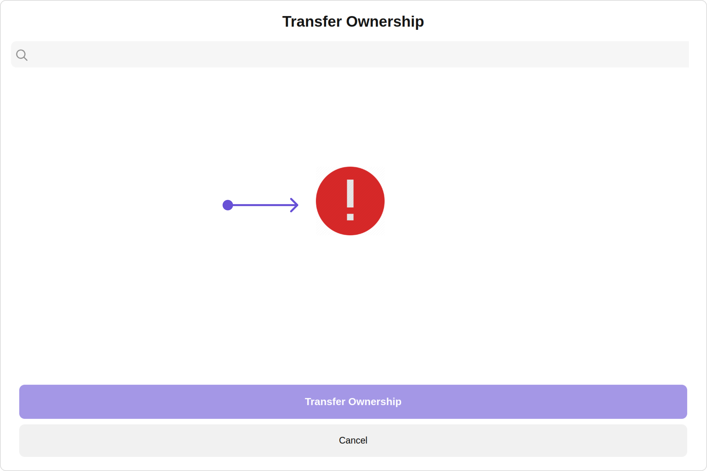

import Tabs from '@theme/Tabs';
import TabItem from '@theme/TabItem';

## Overview

`CometChatTransferOwnership` is a [Component](/ui-kit/angular/components-overview#components) that allows the current owner or administrator of a group to transfer the ownership rights and administrative control of that group to another user. By transferring ownership, the original owner can designate a new user as the group owner, giving them full control and administrative privileges over the group.

Here are some key points regarding the transfer ownership feature in CometChat:

1. Administrative Control: The current owner or administrator of the group has the authority to initiate the transfer of ownership. This feature is typically available to ensure flexibility and allow smooth transitions of group ownership.
2. New Group Owner: During the transfer process, the current owner can select a specific user from the group members to become the new owner. This new owner will then assume the responsibilities and privileges associated with being the group owner.
3. Administrative Privileges: As the new owner, the designated user will gain full administrative control over the group. They will have the ability to manage group settings, add or remove members, moderate conversations, and perform other administrative actions.
4. Group Continuity: Transferring ownership does not disrupt the existing group or its content. The transfer ensures the continuity of the group while transferring the administrative control to a new owner.


The Transfer Ownership component is composed of the following BaseComponents:

| Components                               | Description                                                                      |
| ---------------------------------------- | -------------------------------------------------------------------------------- |
| cometchat-button                         | This component represents a button with optional icon and text.                  |
| [cometchat-label](./label)               | This component provides descriptive information about the associated UI element. |
| [cometchat-radio-button](./radio-button) | This component allows the user to exactly select one item from a set             |

---

## Usage

### Integration

The following code snippet illustrates how you can directly incorporate the Transfer Ownership component into your Application.

<Tabs>
<TabItem value="js" label="app.module.ts">

```javascript
import { CUSTOM_ELEMENTS_SCHEMA, NgModule } from "@angular/core";
import { BrowserModule } from "@angular/platform-browser";
import { CometChatTransferOwnership } from "@cometchat/chat-uikit-angular";
import { AppComponent } from "./app.component";

@NgModule({
  imports: [BrowserModule, CometChatTransferOwnership],
  declarations: [AppComponent],
  providers: [],
  bootstrap: [AppComponent],
  schemas: [CUSTOM_ELEMENTS_SCHEMA],
})
export class AppModule {}
```

</TabItem>
<TabItem value="app.component.ts" label="app.component.ts">

```javascript
import { CometChat } from '@cometchat/chat-sdk-javascript';
import { Component, OnInit } from '@angular/core';
import {  CometChatThemeService, CometChatUIKit } from '@cometchat/chat-uikit-angular';
import "@cometchat/uikit-elements";

@Component({
  selector: 'app-root',
  templateUrl: './app.component.html',
  styleUrls: ['./app.component.css']
})
export class AppComponent {

  public groupObject!: CometChat.Group;
  ngOnInit(): void {
    CometChat.getGroup("guid").then((group: CometChat.Group) => {
      this.groupObject = group;
    });
  }
  constructor(private themeService:CometChatThemeService) {
    themeService.theme.palette.setMode("light")
    themeService.theme.palette.setPrimary({ light: "#6851D6", dark: "#6851D6" })
  }

  onLogin(UID?: any) {
    CometChatUIKit.login({ uid: UID }).then(
      (user) => {
        setTimeout(() => {
          window.location.reload();
        }, 1000);
      },
      (error) => {
        console.log("Login failed with exception:", { error });
      }
    );
  }
}
```

</TabItem>
<TabItem value="ts" label="app.component.html">

```html
<div class="fullwidth">
  <cometchat-transfer-ownership
    *ngIf="groupObject"
    [group]="groupObject"
  ></cometchat-transfer-ownership>
</div>
```

</TabItem>
</Tabs>

---

### Actions

[Actions](/ui-kit/angular/components-overview#actions) dictate how a component functions. They are divided into two types: Predefined and User-defined. You can override either type, allowing you to tailor the behavior of the component to fit your specific needs.

##### 1. onTransferOwnership

The `onTransferOwnership` action is activated when you select a group member and click on the transfer ownership submit button. you have the flexibility to override this event and tailor it to suit your needs using the following code snippet.

<Tabs>
<TabItem value="app.component.ts" label="app.component.ts">

```javascript
import { CometChat } from '@cometchat/chat-sdk-javascript';
import { Component, OnInit } from '@angular/core';
import {  CometChatThemeService, CometChatUIKit } from '@cometchat/chat-uikit-angular';
import "@cometchat/uikit-elements";

@Component({
  selector: 'app-root',
  templateUrl: './app.component.html',
  styleUrls: ['./app.component.css']
})
export class AppComponent {

  public groupObject!: CometChat.Group;
  ngOnInit(): void {
    CometChat.getGroup("guid").then((group: CometChat.Group) => {
      this.groupObject = group;
    });
  }
  public handleOnTransferOwnership = (member: CometChat.GroupMember) => {
    console.log("your custom on transfer ownership actions");
  };
  constructor(private themeService:CometChatThemeService) {
    themeService.theme.palette.setMode("light")
    themeService.theme.palette.setPrimary({ light: "#6851D6", dark: "#6851D6" })
  }

  onLogin(UID?: any) {
    CometChatUIKit.login({ uid: UID }).then(
      (user) => {
        setTimeout(() => {
          window.location.reload();
        }, 1000);
      },
      (error) => {
        console.log("Login failed with exception:", { error });
      }
    );
  }
}
```

</TabItem>
<TabItem value="ts" label="app.component.html">

```html
<div class="fullwidth">
  <cometchat-transfer-ownership
    *ngIf="groupObject"
    [group]="groupObject"
    [onTransferOwnership]="handleOnTransferOwnership"
  ></cometchat-transfer-ownership>
</div>
```

</TabItem>
</Tabs>

##### 2. onClose

`onClose` is triggered when you click on the close button of the Transfer Ownership component. You can override this action using the following code snippet.

<Tabs>
<TabItem value="app.component.ts" label="app.component.ts">

```javascript
import { CometChat } from '@cometchat/chat-sdk-javascript';
import { Component, OnInit } from '@angular/core';
import {  CometChatThemeService, CometChatUIKit } from '@cometchat/chat-uikit-angular';
import "@cometchat/uikit-elements";

@Component({
  selector: 'app-root',
  templateUrl: './app.component.html',
  styleUrls: ['./app.component.css']
})
export class AppComponent {

  public groupObject!: CometChat.Group;
  ngOnInit(): void {
    CometChat.getGroup("guid").then((group: CometChat.Group) => {
      this.groupObject = group;
    });
  }
  public handleOnClose = () => {
    console.log("Your custom on close actions");
  };
  constructor(private themeService:CometChatThemeService) {
    themeService.theme.palette.setMode("light")
    themeService.theme.palette.setPrimary({ light: "#6851D6", dark: "#6851D6" })
  }

  onLogin(UID?: any) {
    CometChatUIKit.login({ uid: UID }).then(
      (user) => {
        setTimeout(() => {
          window.location.reload();
        }, 1000);
      },
      (error) => {
        console.log("Login failed with exception:", { error });
      }
    );
  }
}
```

</TabItem>
<TabItem value="ts" label="app.component.html">

```html
<div class="fullwidth">
  <cometchat-transfer-ownership
    *ngIf="groupObject"
    [group]="groupObject"
    [onClose]="handleOnClose"
  ></cometchat-transfer-ownership>
</div>
```

</TabItem>
</Tabs>

##### 3. onError

This action doesn't change the behavior of the component but rather listens for any errors that occur in the Transfer Ownership component.

<Tabs>
<TabItem value="app.component.ts" label="app.component.ts">

```javascript
import { CometChat } from '@cometchat/chat-sdk-javascript';
import { Component, OnInit } from '@angular/core';
import {  CometChatThemeService, CometChatUIKit } from '@cometchat/chat-uikit-angular';
import "@cometchat/uikit-elements";

@Component({
  selector: 'app-root',
  templateUrl: './app.component.html',
  styleUrls: ['./app.component.css']
})
export class AppComponent {

  public groupObject!: CometChat.Group;
  ngOnInit(): void {
    CometChat.getGroup("guid").then((group: CometChat.Group) => {
      this.groupObject = group;
    });
  }
  public handleOnError = (error: CometChat.CometChatException) => {
    console.log("your custom on error action", error);
  };
  constructor(private themeService:CometChatThemeService) {
    themeService.theme.palette.setMode("light")
    themeService.theme.palette.setPrimary({ light: "#6851D6", dark: "#6851D6" })
  }

  onLogin(UID?: any) {
    CometChatUIKit.login({ uid: UID }).then(
      (user) => {
        setTimeout(() => {
          window.location.reload();
        }, 1000);
      },
      (error) => {
        console.log("Login failed with exception:", { error });
      }
    );
  }
}
```

</TabItem>
<TabItem value="ts" label="app.component.html">

```html
<div class="fullwidth">
  <cometchat-transfer-ownership
    *ngIf="groupObject"
    [group]="groupObject"
    [onError]="handleOnError"
  ></cometchat-transfer-ownership>
</div>
```

</TabItem>
</Tabs>

---

### Filters

**Filters** allow you to customize the data displayed in a list within a Component. You can filter the list based on your specific criteria, allowing for a more customized. Filters can be applied using RequestBuilders of Chat SDK.

##### 1. GroupMembersRequestBuilder

The [GroupMembersRequestBuilder](/sdk/javascript/retrieve-group-members) enables you to filter and customize the group members list based on available parameters in GroupMembersRequestBuilder. This feature allows you to create more specific and targeted queries when fetching groups. The following are the parameters available in [GroupMembersRequestBuilder](/sdk/javascript/retrieve-group-members)

| Methods              | Type                | Description                                                                                       |
| -------------------- | ------------------- | ------------------------------------------------------------------------------------------------- |
| **setLimit**         | number              | sets the number of group members that can be fetched in a single request, suitable for pagination |
| **setSearchKeyword** | String              | used for fetching group members matching the passed string                                        |
| **setScopes**        | Array&lt;String&gt; | used for fetching group members based on multiple scopes                                          |

**Example**

In the example below, we are applying a filter to the Group Members by setting the limit to 3 and setting the scope to show only admin.

<Tabs>
<TabItem value="app.component.ts" label="app.component.ts">

```javascript
import { CometChat } from '@cometchat/chat-sdk-javascript';
import { Component, OnInit } from '@angular/core';
import {  CometChatThemeService, CometChatUIKit } from '@cometchat/chat-uikit-angular';
import "@cometchat/uikit-elements";

@Component({
  selector: 'app-root',
  templateUrl: './app.component.html',
  styleUrls: ['./app.component.css']
})
export class AppComponent {

  public groupObject!: CometChat.Group;
  ngOnInit(): void {
    CometChat.getGroup("guid").then((group: CometChat.Group) => {
      this.groupObject = group;
    });
  }
  groupMemberRequestBuilder = new CometChat.GroupMembersRequestBuilder('guid').setLimit(3).setScopes(['admin'])
  constructor(private themeService:CometChatThemeService) {
    themeService.theme.palette.setMode("light")
    themeService.theme.palette.setPrimary({ light: "#6851D6", dark: "#6851D6" })
  }

  onLogin(UID?: any) {
    CometChatUIKit.login({ uid: UID }).then(
      (user) => {
        setTimeout(() => {
          window.location.reload();
        }, 1000);
      },
      (error) => {
        console.log("Login failed with exception:", { error });
      }
    );
  }
}
```

</TabItem>
<TabItem value="ts" label="app.component.html">

```html
<div class="fullwidth">
  <cometchat-transfer-ownership
    *ngIf="groupObject"
    [group]="groupObject"
    [groupMemberRequestBuilder]="groupMemberRequestBuilder"
  ></cometchat-transfer-ownership>
</div>
```

</TabItem>
</Tabs>

##### 2. SearchRequestBuilder

The SearchRequestBuilder uses [GroupMembersRequestBuilder](/sdk/javascript/retrieve-group-members) enables you to filter and customize the search list based on available parameters in GroupMembersRequestBuilder.
This feature allows you to keep uniformity between the displayed Group Members List and searched Group Members List.

**Example**

<Tabs>
<TabItem value="app.component.ts" label="app.component.ts">

```javascript
import { CometChat } from '@cometchat/chat-sdk-javascript';
import { Component, OnInit } from '@angular/core';
import {  CometChatThemeService, CometChatUIKit } from '@cometchat/chat-uikit-angular';
import "@cometchat/uikit-elements";

@Component({
  selector: 'app-root',
  templateUrl: './app.component.html',
  styleUrls: ['./app.component.css']
})
export class AppComponent {

  public groupObject!: CometChat.Group;
  ngOnInit(): void {
    CometChat.getGroup("guid").then((group: CometChat.Group) => {
      this.groupObject = group;
    });
  }
  searchRequestBuilder = new CometChat.GroupMembersRequestBuilder('guid').setLimit(2).setSearchKeyword("**")
  constructor(private themeService:CometChatThemeService) {
    themeService.theme.palette.setMode("light")
    themeService.theme.palette.setPrimary({ light: "#6851D6", dark: "#6851D6" })
  }

  onLogin(UID?: any) {
    CometChatUIKit.login({ uid: UID }).then(
      (user) => {
        setTimeout(() => {
          window.location.reload();
        }, 1000);
      },
      (error) => {
        console.log("Login failed with exception:", { error });
      }
    );
  }
}
```

</TabItem>
<TabItem value="ts" label="app.component.html">

```html
<div class="fullwidth">
  <cometchat-transfer-ownership
    *ngIf="groupObject"
    [group]="groupObject"
    [searchRequestBuilder]="searchRequestBuilder"
  ></cometchat-transfer-ownership>
</div>
```

</TabItem>
</Tabs>

---

### Events

[Events](/ui-kit/angular/components-overview#events) are emitted by a `Component`. By using event you can extend existing functionality. Being global events, they can be applied in Multiple Locations and are capable of being Added or Removed.

Events emitted by the Transfer Ownership component is as follows.

| Event                  | Description                                                           |
| ---------------------- | --------------------------------------------------------------------- |
| **ccOwnershipChanged** | Triggers when the ownership of a group member is changed successfully |

<Tabs>
<TabItem value="TypeScript" label="TypeScript">

```TypeScript
import {CometChatGroupEvents} from "@cometchat/chat-uikit-angular";

this.ccOwnershipChanged = CometChatGroupEvents.ccOwnershipChanged.subscribe(
  (item: IOwnershipChanged) => {
        // Your Code
  }
);
```

</TabItem>
</Tabs>

---

Removing `CometChatGroupEvents` Listener's

<Tabs>
<TabItem value="TypeScript" label="TypeScript">

```TypeScript
this.ccOwnershipChanged.unsubscribe();
```

</TabItem>
</Tabs>

---

## Customization

To fit your app's design requirements, you can customize the appearance of the Transfer Ownership component. We provide exposed methods that allow you to modify the experience and behavior according to your specific needs.

### Style

Using **Style** you can **customize** the look and feel of the component in your app, These parameters typically control elements such as the **color**, **size**, **shape**, and **fonts** used within the component.

##### 1. TransferOwnership Style

You can set the `TransferOwnershipStyle` to the Transfer Ownership Component to customize the styling.


<Tabs>
<TabItem value="app.component.ts" label="app.component.ts">

```javascript
import { CometChat } from '@cometchat/chat-sdk-javascript';
import { Component, OnInit } from '@angular/core';
import {  CometChatThemeService, CometChatUIKit } from '@cometchat/chat-uikit-angular';
import { TransferOwnershipStyle } from '@cometchat/uikit-shared';
import "@cometchat/uikit-elements";

@Component({
  selector: 'app-root',
  templateUrl: './app.component.html',
  styleUrls: ['./app.component.css']
})
export class AppComponent {

  public groupObject!: CometChat.Group;
  ngOnInit(): void {
    CometChat.getGroup("guid").then((group: CometChat.Group) => {
      this.groupObject = group;
    });
  }
  transferOwnershipStyle = new TransferOwnershipStyle({
    background: "#e9c4ff",
    MemberScopeTextColor: "#ffffff",
    transferButtonTextColor: "#ffffff",
    MemberScopeTextFont: "#ffffff",
    cancelButtonTextColor: "#ffffff",
  });
  constructor(private themeService:CometChatThemeService) {
    themeService.theme.palette.setMode("light")
    themeService.theme.palette.setPrimary({ light: "#6851D6", dark: "#6851D6" })
  }

  onLogin(UID?: any) {
    CometChatUIKit.login({ uid: UID }).then(
      (user) => {
        setTimeout(() => {
          window.location.reload();
        }, 1000);
      },
      (error) => {
        console.log("Login failed with exception:", { error });
      }
    );
  }
}
```

</TabItem>
<TabItem value="ts" label="app.component.html">

```html
<div class="fullwidth">
  <cometchat-transfer-ownership
    *ngIf="groupObject"
    [group]="groupObject"
    [transferOwnershipStyle]="transferOwnershipStyle"
  ></cometchat-transfer-ownership>
</div>
```

</TabItem>
</Tabs>

---

List of properties exposed by TransferOwnershipStyle:

| Property                    | Description                            | Code                                |
| --------------------------- | -------------------------------------- | ----------------------------------- |
| **border**                  | Used to set border                     | `border?: string,`                  |
| **borderRadius**            | Used to set border radius              | `borderRadius?: string;`            |
| **background**              | Used to set background colour          | `background?: string;`              |
| **height**                  | Used to set height                     | `height?: string;`                  |
| **width**                   | Used to set width                      | `width?: string;`                   |
| **MemberScopeTextColor**    | Used to set member scope text color    | `MemberScopeTextColor?: string,`    |
| **MemberScopeTextFont**     | Used to set member scope text font     | `MemberScopeTextFont?: string;`     |
| **transferButtonTextFont**  | Used to set transfer button text font  | `transferButtonTextFont?: string;`  |
| **transferButtonTextColor** | Used to set transfer button text color | `transferButtonTextColor?: string;` |
| **cancelButtonTextFont**    | Used to set cancel button text font    | `cancelButtonTextFont?: string;`    |
| **cancelButtonTextColor**   | Used to set cancel button text color   | `cancelButtonTextColor?: string;`   |

##### 2. Avatar Style

To apply customized styles to the `Avatar` component in the Transfer Ownership Component, you can use the following code snippet. For further insights on `Avatar` Styles [refer](/ui-kit/angular/avatar#avatar-style)

<Tabs>
<TabItem value="app.component.ts" label="app.component.ts">

```javascript
import { CometChat } from '@cometchat/chat-sdk-javascript';
import { Component, OnInit } from '@angular/core';
import {  CometChatThemeService, CometChatUIKit, AvatarStyle } from '@cometchat/chat-uikit-angular';
import "@cometchat/uikit-elements";

@Component({
  selector: 'app-root',
  templateUrl: './app.component.html',
  styleUrls: ['./app.component.css']
})
export class AppComponent {

  public groupObject!: CometChat.Group;
  ngOnInit(): void {
    CometChat.getGroup("guid").then((group: CometChat.Group) => {
      this.groupObject = group;
    });
  }
  avatarStyle = new AvatarStyle({
    backgroundColor: "#cdc2ff",
    border: "2px solid #6745ff",
    borderRadius: "10px",
    outerViewBorderColor: "#ca45ff",
    outerViewBorderRadius: "5px",
    nameTextColor: "#4554ff"
  });
  constructor(private themeService:CometChatThemeService) {
    themeService.theme.palette.setMode("light")
    themeService.theme.palette.setPrimary({ light: "#6851D6", dark: "#6851D6" })
  }

  onLogin(UID?: any) {
    CometChatUIKit.login({ uid: UID }).then(
      (user) => {
        setTimeout(() => {
          window.location.reload();
        }, 1000);
      },
      (error) => {
        console.log("Login failed with exception:", { error });
      }
    );
  }
}
```

</TabItem>
<TabItem value="ts" label="app.component.html">

```html
<div class="fullwidth">
  <cometchat-transfer-ownership
    *ngIf="groupObject"
    [group]="groupObject"
    [avatarStyle]="avatarStyle"
  ></cometchat-transfer-ownership>
</div>
```

</TabItem>
</Tabs>

##### 3. GroupMembers Style

You can set the `GroupMembersStyle` to the Transfer Ownership Component to customize the styling, you can use the following code snippet. For further insights on `GroupMembers` Styles [refer](/ui-kit/angular/group-members#1-groupmembers-style)


<Tabs>
<TabItem value="app.component.ts" label="app.component.ts">

```javascript
import { CometChat } from '@cometchat/chat-sdk-javascript';
import { Component, OnInit } from '@angular/core';
import {  CometChatThemeService, CometChatUIKit } from '@cometchat/chat-uikit-angular';
import { GroupMembersStyle } from '@cometchat/uikit-shared';
import "@cometchat/uikit-elements";

@Component({
  selector: 'app-root',
  templateUrl: './app.component.html',
  styleUrls: ['./app.component.css']
})
export class AppComponent {

  public groupObject!: CometChat.Group;
  ngOnInit(): void {
    CometChat.getGroup("guid").then((group: CometChat.Group) => {
      this.groupObject = group;
    });
  }
  groupMembersStyle = new GroupMembersStyle({
    background: "#b17efc",
    searchPlaceholderTextColor: "#ffffff",
    titleTextColor: "#000000",
    searchBackground: "#5718b5",
  });
  constructor(private themeService:CometChatThemeService) {
    themeService.theme.palette.setMode("light")
    themeService.theme.palette.setPrimary({ light: "#6851D6", dark: "#6851D6" })
  }

  onLogin(UID?: any) {
    CometChatUIKit.login({ uid: UID }).then(
      (user) => {
        setTimeout(() => {
          window.location.reload();
        }, 1000);
      },
      (error) => {
        console.log("Login failed with exception:", { error });
      }
    );
  }
}
```

</TabItem>
<TabItem value="ts" label="app.component.html">

```html
<div class="fullwidth">
  <cometchat-transfer-ownership
    *ngIf="groupObject"
    [group]="groupObject"
    [groupMembersStyle]="groupMembersStyle"
  ></cometchat-transfer-ownership>
</div>
```

</TabItem>
</Tabs>

##### 4. ListItem Style

To apply customized styles to the `List Item` component in the `Transfer Ownership` Component, you can use the following code snippet. For further insights on `List Item` Styles [refer](/ui-kit/angular/list-item)

<Tabs>
<TabItem value="app.component.ts" label="app.component.ts">

```javascript
import { CometChat } from '@cometchat/chat-sdk-javascript';
import { Component, OnInit } from '@angular/core';
import {  CometChatThemeService, CometChatUIKit, ListItemStyle } from '@cometchat/chat-uikit-angular';
import "@cometchat/uikit-elements";

@Component({
  selector: 'app-root',
  templateUrl: './app.component.html',
  styleUrls: ['./app.component.css']
})
export class AppComponent {

  public groupObject!: CometChat.Group;
  ngOnInit(): void {
    CometChat.getGroup("guid").then((group: CometChat.Group) => {
      this.groupObject = group;
    });
  }
  listItemStyle: ListItemStyle = new ListItemStyle({
    background: "transparent",
    padding: "5px",
    border: "1px solid #e9b8f5",
    titleColor: "#8830f2",
    borderRadius: "20px",
    width: "100% !important"
  });
  constructor(private themeService:CometChatThemeService) {
    themeService.theme.palette.setMode("light")
    themeService.theme.palette.setPrimary({ light: "#6851D6", dark: "#6851D6" })
  }

  onLogin(UID?: any) {
    CometChatUIKit.login({ uid: UID }).then(
      (user) => {
        setTimeout(() => {
          window.location.reload();
        }, 1000);
      },
      (error) => {
        console.log("Login failed with exception:", { error });
      }
    );
  }
}
```

</TabItem>
<TabItem value="ts" label="app.component.html">

```html
<div class="fullwidth">
  <cometchat-transfer-ownership
    *ngIf="groupObject"
    [group]="groupObject"
    [listItemStyle]="listItemStyle"
  ></cometchat-transfer-ownership>
</div>
```

</TabItem>
</Tabs>

##### 5. StatusIndicator Style

To apply customized styles to the Status Indicator component in the Transfer Ownership Component, You can use the following code snippet. For further insights on Status Indicator Styles [refer](/ui-kit/angular/status-indicator)

<Tabs>
<TabItem value="app.component.ts" label="app.component.ts">

```javascript
import { CometChat } from '@cometchat/chat-sdk-javascript';
import { Component, OnInit } from '@angular/core';
import {  CometChatThemeService, CometChatUIKit } from '@cometchat/chat-uikit-angular';
import "@cometchat/uikit-elements";

@Component({
  selector: 'app-root',
  templateUrl: './app.component.html',
  styleUrls: ['./app.component.css']
})
export class AppComponent {

  public groupObject!: CometChat.Group;
  ngOnInit(): void {
    CometChat.getGroup("guid").then((group: CometChat.Group) => {
      this.groupObject = group;
    });
  }
  statusIndicatorStyle: any = ({
    height: '20px',
    width: '20px',
    backgroundColor: 'red'
  });
  constructor(private themeService:CometChatThemeService) {
    themeService.theme.palette.setMode("light")
    themeService.theme.palette.setPrimary({ light: "#6851D6", dark: "#6851D6" })
  }

  onLogin(UID?: any) {
    CometChatUIKit.login({ uid: UID }).then(
      (user) => {
        setTimeout(() => {
          window.location.reload();
        }, 1000);
      },
      (error) => {
        console.log("Login failed with exception:", { error });
      }
    );
  }
}
```

</TabItem>
<TabItem value="ts" label="app.component.html">

```html
<div class="fullwidth">
  <cometchat-transfer-ownership
    *ngIf="groupObject"
    [group]="groupObject"
    [statusIndicatorStyle]="statusIndicatorStyle"
  ></cometchat-transfer-ownership>
</div>
```

</TabItem>
</Tabs>

---

### Functionality

These are a set of small functional customizations that allow you to fine-tune the overall experience of the component. With these, you can change text, set custom icons, and toggle the visibility of UI elements.

<Tabs>
<TabItem value="app.component.ts" label="app.component.ts">

```javascript
import { CometChat } from '@cometchat/chat-sdk-javascript';
import { Component, OnInit } from '@angular/core';
import {  CometChatThemeService, CometChatUIKit } from '@cometchat/chat-uikit-angular';
import "@cometchat/uikit-elements";

@Component({
  selector: 'app-root',
  templateUrl: './app.component.html',
  styleUrls: ['./app.component.css']
})
export class AppComponent {

  public groupObject!: CometChat.Group;
  ngOnInit(): void {
    CometChat.getGroup("guid").then((group: CometChat.Group) => {
      this.groupObject = group;
    });
  }
  constructor(private themeService:CometChatThemeService) {
    themeService.theme.palette.setMode("light")
    themeService.theme.palette.setPrimary({ light: "#6851D6", dark: "#6851D6" })
  }

  onLogin(UID?: any) {
    CometChatUIKit.login({ uid: UID }).then(
      (user) => {
        setTimeout(() => {
          window.location.reload();
        }, 1000);
      },
      (error) => {
        console.log("Login failed with exception:", { error });
      }
    );
  }
}
```

</TabItem>
<TabItem value="ts" label="app.component.html">

```html
<div class="fullwidth">
  <cometchat-transfer-ownership
    *ngIf="groupObject"
    [group]="groupObject"
    [title]="'Your Custom Title'"
    [cancelButtonText]="'Your Custom Cancel Button Text'"
    [hideSeparator]="true"
  ></cometchat-transfer-ownership>
</div>
```

</TabItem>
</Tabs>

Default:


Custom:


Below is a list of customizations along with corresponding code snippets

| Property                                                                                                              | Description                                                                                     | Code                                                      |
| --------------------------------------------------------------------------------------------------------------------- | ----------------------------------------------------------------------------------------------- | --------------------------------------------------------- |
| **title** <a data-tooltip-id="my-tooltip-html-prop"> <span class="material-icons red">report</span> </a>              | Used to set title in the app heading                                                            | `[title]="Your Custom Title"`                             |
| **cancelButtonText** <a data-tooltip-id="my-tooltip-html-prop"> <span class="material-icons red">report</span> </a>   | Used to set the cancel button text                                                              | `[cancelButtonText]="Your Custom cancel button text"`     |
| **transferButtonText** <a data-tooltip-id="my-tooltip-html-prop"> <span class="material-icons red">report</span> </a> | Used to set the transfer button text                                                            | `[transferButtonText]="Your Custom transfer button text"` |
| **errorStateText** <a data-tooltip-id="my-tooltip-html-prop"> <span class="material-icons red">report</span> </a>     | Used to set a custom text response when some error occurs on fetching the list of group members | `[errorStateText]="your custom error state text"`         |
| **emptyStateText** <a data-tooltip-id="my-tooltip-html-prop"> <span class="material-icons red">report</span> </a>     | Used to set a custom text response when fetching the group members has returned an empty list   | `[emptyStateText]="your custom empty state text"`         |
| **searchPlaceholder** <a data-tooltip-id="my-tooltip-html-prop"> <span class="material-icons red">report</span> </a>  | Used to set custom search placeholder text                                                      | `[searchPlaceholder]='Custom Search PlaceHolder'`         |
| **searchIconURL**                                                                                                     | Used to set search Icon in the search field                                                     | `[searchIconURL]="'Your Custom search icon'"`             |
| **loadingIconURL**                                                                                                    | Used to set loading Icon                                                                        | `[loadingIconURL]="'your custom loading icon url'"`       |
| **closeButtonIconURL**                                                                                                | Used to set close button Icon                                                                   | `[closeButtonIconURL]="closeButtonIconURL"`               |
| **hideSearch**                                                                                                        | Used to toggle visibility for search box                                                        | `[hideSearch]="true""`                                    |
| **hideSeparator**                                                                                                     | Used to hide the divider separating the user items                                              | `[hideSeparator]="true"`                                  |
| **disableUsersPresence**                                                                                              | Used to toggle functionality to show user's presence                                            | `[disableUsersPresence]="true"`                           |
| **titleAlignment**                                                                                                    | Alignment of the heading text for the component                                                 | `[titleAlignment]="titleAlignment"`                       |
| **group** <a data-tooltip-id="my-tooltip-html-prop"> <span class="material-icons red">report</span> </a>              | Used to pass group object of which group members will be shown                                  | `[group]="groupObject"`                                   |

---

### Advance

For advanced-level customization, you can set custom views to the component. This lets you tailor each aspect of the component to fit your exact needs and application aesthetics. You can create and define your views, layouts, and UI elements and then incorporate those into the component.

---

#### ListItemView

With this property, you can assign a custom ListItem to the Transfer Ownership Component.

**Example**

Default:


Custom:


<Tabs>
<TabItem value="app.component.ts" label="app.component.ts">

```javascript
import { CometChat } from '@cometchat/chat-sdk-javascript';
import { Component, OnInit } from '@angular/core';
import {  CometChatThemeService, CometChatUIKit } from '@cometchat/chat-uikit-angular';
import "@cometchat/uikit-elements";

@Component({
  selector: 'app-root',
  templateUrl: './app.component.html',
  styleUrls: ['./app.component.css']
})
export class AppComponent {

  public groupObject!: CometChat.Group;
  ngOnInit(): void {
    CometChat.getGroup("guid").then((group: CometChat.Group) => {
      this.groupObject = group;
    });
  }
  constructor(private themeService:CometChatThemeService) {
    themeService.theme.palette.setMode("light")
    themeService.theme.palette.setPrimary({ light: "#6851D6", dark: "#6851D6" })
  }

  onLogin(UID?: any) {
    CometChatUIKit.login({ uid: UID }).then(
      (user) => {
        setTimeout(() => {
          window.location.reload();
        }, 1000);
      },
      (error) => {
        console.log("Login failed with exception:", { error });
      }
    );
  }
}
```

</TabItem>
<TabItem value="ts" label="app.component.html">

```html
<div class="fullwidth">
  <cometchat-transfer-ownership
    *ngIf="groupObject"
    [group]="groupObject"
    [listItemView]="listItemViewTemplate"
  ></cometchat-transfer-ownership>
</div>

<ng-template #listItemViewTemplate let-groupMember>
  <div
    [ngStyle]="{
      display: 'flex',
      alignItems: 'left',
      padding: '10px',
      border: '2px solid #e9baff',
      borderRadius: '20px',
      background: '#ffffff'
    }"
  >
    <cometchat-avatar
      [image]="groupMember.getAvatar()"
      [name]="groupMember.getName()"
    ></cometchat-avatar>
    <div [ngStyle]="{ display: 'flex', paddingLeft: '10px' }">
      <div
        [ngStyle]="{
          fontWeight: 'bold',
          color: '#937aff',
          fontSize: '14px',
          marginTop: '5px'
        }"
      >
        {{ groupMember.getName() }}
        <div
          [ngStyle]="{
            color: '#cfc4ff',
            fontSize: '10px',
            textAlign: 'left'
          }"
        >
          {{ groupMember.getStatus() }}
        </div>
      </div>
    </div>
  </div>
</ng-template>
```

</TabItem>
</Tabs>

---

#### SubtitleView

You can customize the subtitle view for each Transfer Ownership to meet your requirements

Default:


Custom:


<Tabs>
<TabItem value="app.component.ts" label="app.component.ts">

```javascript
import { CometChat } from '@cometchat/chat-sdk-javascript';
import { Component, OnInit } from '@angular/core';
import {  CometChatThemeService, CometChatUIKit } from '@cometchat/chat-uikit-angular';
import "@cometchat/uikit-elements";

@Component({
  selector: 'app-root',
  templateUrl: './app.component.html',
  styleUrls: ['./app.component.css']
})
export class AppComponent {

  public groupObject!: CometChat.Group;
  ngOnInit(): void {
    CometChat.getGroup("guid").then((group: CometChat.Group) => {
      this.groupObject = group;
    });
  }
  constructor(private themeService:CometChatThemeService) {
    themeService.theme.palette.setMode("light")
    themeService.theme.palette.setPrimary({ light: "#6851D6", dark: "#6851D6" })
  }

  onLogin(UID?: any) {
    CometChatUIKit.login({ uid: UID }).then(
      (user) => {
        setTimeout(() => {
          window.location.reload();
        }, 1000);
      },
      (error) => {
        console.log("Login failed with exception:", { error });
      }
    );
  }
}
```

</TabItem>
<TabItem value="ts" label="app.component.html">

```html
<div class="fullwidth">
  <cometchat-transfer-ownership
    *ngIf="groupObject"
    [group]="groupObject"
    [subtitleView]="subtitleTemplate"
  ></cometchat-transfer-ownership>
</div>

<ng-template #subtitleTemplate>
  <div
    style="display: flex; align-items: left; padding: 10px; font-size: 10px;"
  >
    your custom subtitle view
  </div>
</ng-template>
```

</TabItem>
</Tabs>

---

#### LoadingStateView

You can set a custom loader view using `loadingStateView` to match the loading view of your app.

Default:


Custom:


<Tabs>
<TabItem value="app.component.ts" label="app.component.ts">

```javascript
import { CometChat } from '@cometchat/chat-sdk-javascript';
import { Component, OnInit } from '@angular/core';
import {  CometChatThemeService, CometChatUIKit, LoaderStyle } from '@cometchat/chat-uikit-angular';
import "@cometchat/uikit-elements";

@Component({
  selector: 'app-root',
  templateUrl: './app.component.html',
  styleUrls: ['./app.component.css']
})
export class AppComponent {

  public groupObject!: CometChat.Group;
  ngOnInit(): void {
    CometChat.getGroup("guid").then((group: CometChat.Group) => {
      this.groupObject = group;
    });
  }
  getLoaderStyle: LoaderStyle = new LoaderStyle({
    iconTint: "red",
    background: "transparent",
    height: "20px",
    width: "20px",
    border: "none",
    borderRadius: "0",
  });
  constructor(private themeService:CometChatThemeService) {
    themeService.theme.palette.setMode("light")
    themeService.theme.palette.setPrimary({ light: "#6851D6", dark: "#6851D6" })
  }

  onLogin(UID?: any) {
    CometChatUIKit.login({ uid: UID }).then(
      (user) => {
        setTimeout(() => {
          window.location.reload();
        }, 1000);
      },
      (error) => {
        console.log("Login failed with exception:", { error });
      }
    );
  }
}
```

</TabItem>
<TabItem value="ts" label="app.component.html">

```html
<div class="fullwidth">
  <cometchat-transfer-ownership
    *ngIf="groupObject"
    [group]="groupObject"
    [loadingStateView]="loadingStateView"
  ></cometchat-transfer-ownership>
</div>

<ng-template #loadingStateView>
  <cometchat-loader
    iconURL="icon"
    [loaderStyle]="getLoaderStyle"
  ></cometchat-loader>
</ng-template>
```

</TabItem>
</Tabs>

---

#### EmptyStateView

You can set a custom `EmptyStateView` using `emptyStateView` to match the empty view of your app.

Default:


Custom:


<Tabs>
<TabItem value="app.component.ts" label="app.component.ts">

```javascript
import { CometChat } from '@cometchat/chat-sdk-javascript';
import { Component, OnInit } from '@angular/core';
import {  CometChatThemeService, CometChatUIKit } from '@cometchat/chat-uikit-angular';
import "@cometchat/uikit-elements";

@Component({
  selector: 'app-root',
  templateUrl: './app.component.html',
  styleUrls: ['./app.component.css']
})
export class AppComponent {

  public groupObject!: CometChat.Group;
  ngOnInit(): void {
    CometChat.getGroup("guid").then((group: CometChat.Group) => {
      this.groupObject = group;
    });
  }
  constructor(private themeService:CometChatThemeService) {
    themeService.theme.palette.setMode("light")
    themeService.theme.palette.setPrimary({ light: "#6851D6", dark: "#6851D6" })
  }

  onLogin(UID?: any) {
    CometChatUIKit.login({ uid: UID }).then(
      (user) => {
        setTimeout(() => {
          window.location.reload();
        }, 1000);
      },
      (error) => {
        console.log("Login failed with exception:", { error });
      }
    );
  }
}
```

</TabItem>
<TabItem value="ts" label="app.component.html">

```html
<div class="fullwidth">
  <cometchat-transfer-ownership
    *ngIf="groupObject"
    [group]="groupObject"
    [emptyStateView]="emptyStateView"
  ></cometchat-transfer-ownership>
</div>

<ng-template #emptyStateView>
  <div>Your Custom Empty State</div>
</ng-template>
```

</TabItem>
</Tabs>

---

#### ErrorStateView

You can set a custom `ErrorStateView` using `errorStateView` to match the error view of your app.

Default:


Custom:


<Tabs>
<TabItem value="app.component.ts" label="app.component.ts">

```javascript
import { CometChat } from '@cometchat/chat-sdk-javascript';
import { Component, OnInit } from '@angular/core';
import {  CometChatThemeService, CometChatUIKit } from '@cometchat/chat-uikit-angular';
import "@cometchat/uikit-elements";

@Component({
  selector: 'app-root',
  templateUrl: './app.component.html',
  styleUrls: ['./app.component.css']
})
export class AppComponent {

  public groupObject!: CometChat.Group;
  ngOnInit(): void {
    CometChat.getGroup("guid").then((group: CometChat.Group) => {
      this.groupObject = group;
    });
  }
  constructor(private themeService:CometChatThemeService) {
    themeService.theme.palette.setMode("light")
    themeService.theme.palette.setPrimary({ light: "#6851D6", dark: "#6851D6" })
  }

  onLogin(UID?: any) {
    CometChatUIKit.login({ uid: UID }).then(
      (user) => {
        setTimeout(() => {
          window.location.reload();
        }, 1000);
      },
      (error) => {
        console.log("Login failed with exception:", { error });
      }
    );
  }
}
```

</TabItem>
<TabItem value="ts" label="app.component.html">

```html
<div class="fullwidth">
  <cometchat-transfer-ownership
    *ngIf="groupObject"
    [group]="groupObject"
    [errorStateView]="errorStateView"
  ></cometchat-transfer-ownership>
</div>

<ng-template #errorStateView>
  <div style="height: 100vh; width: 100vw">
    
  </div>
</ng-template>
```

</TabItem>
</Tabs>

---

import { Tooltip } from 'react-tooltip'
import 'react-tooltip/dist/react-tooltip.css'

<Tooltip
  id="my-tooltip-html-prop"
  html="Not available in TransferOwnershipConfiguration"
/>
