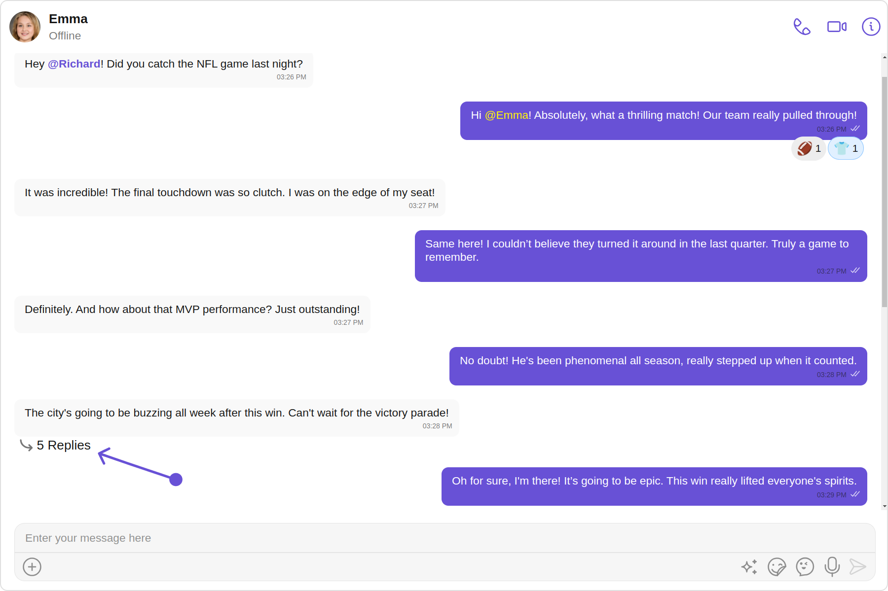
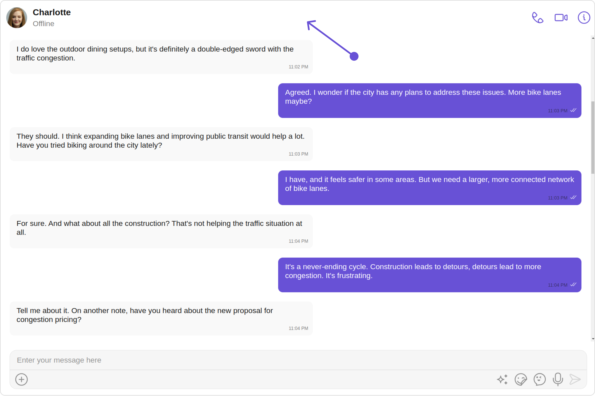
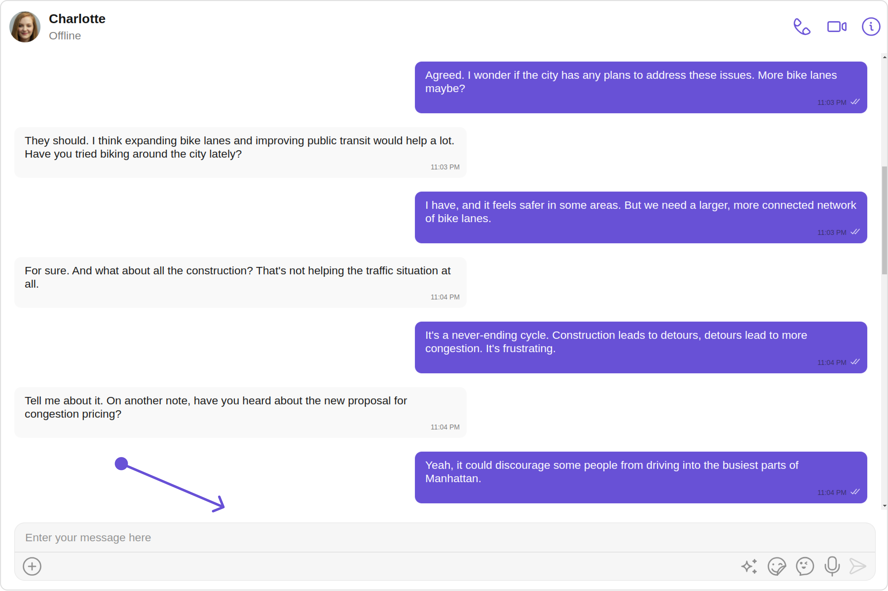
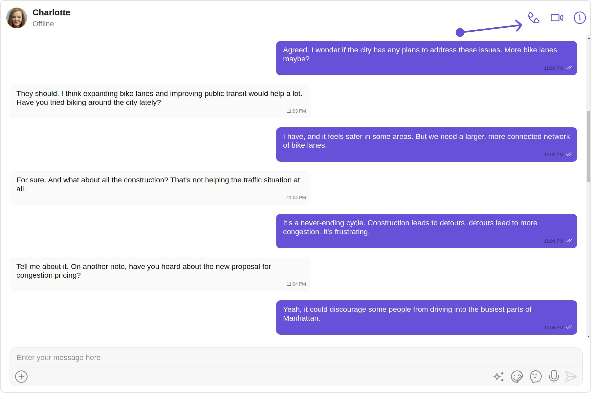
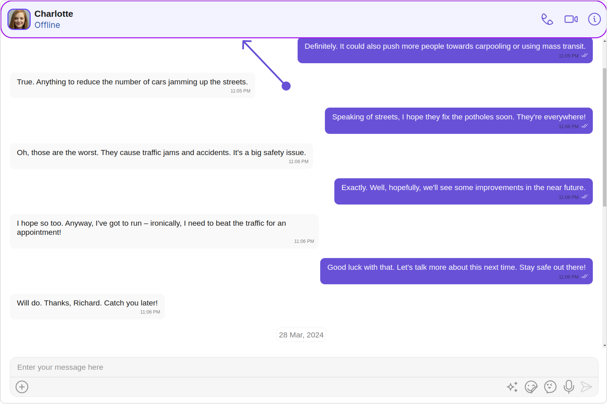
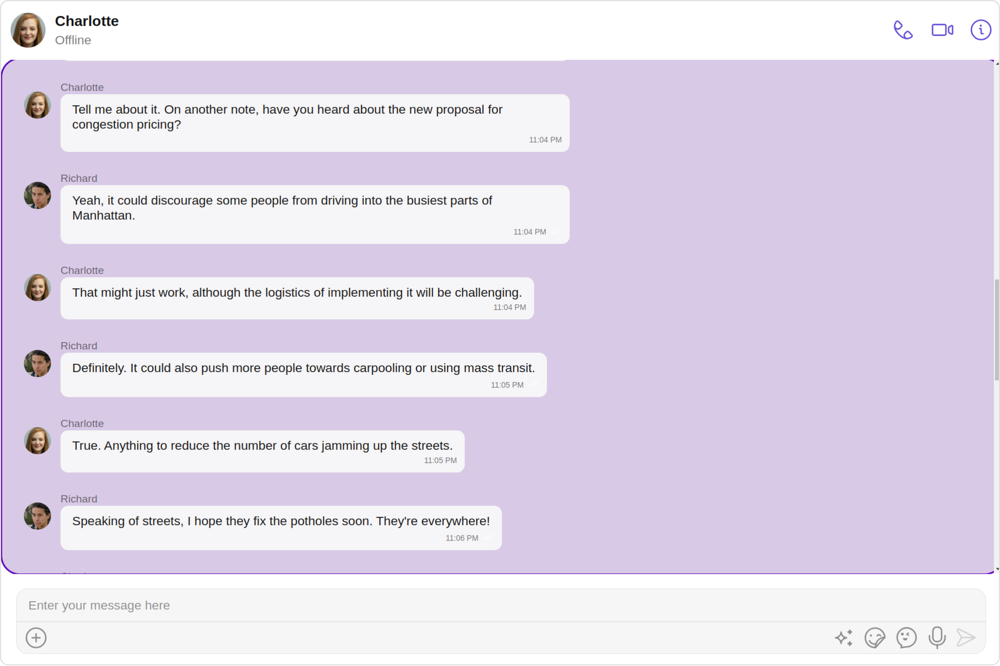
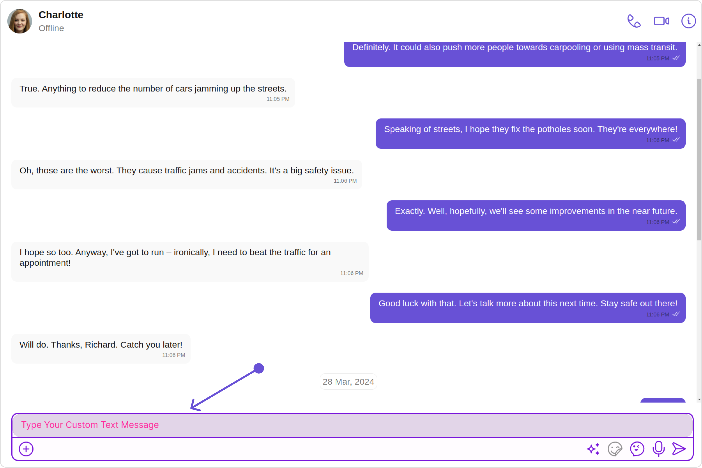
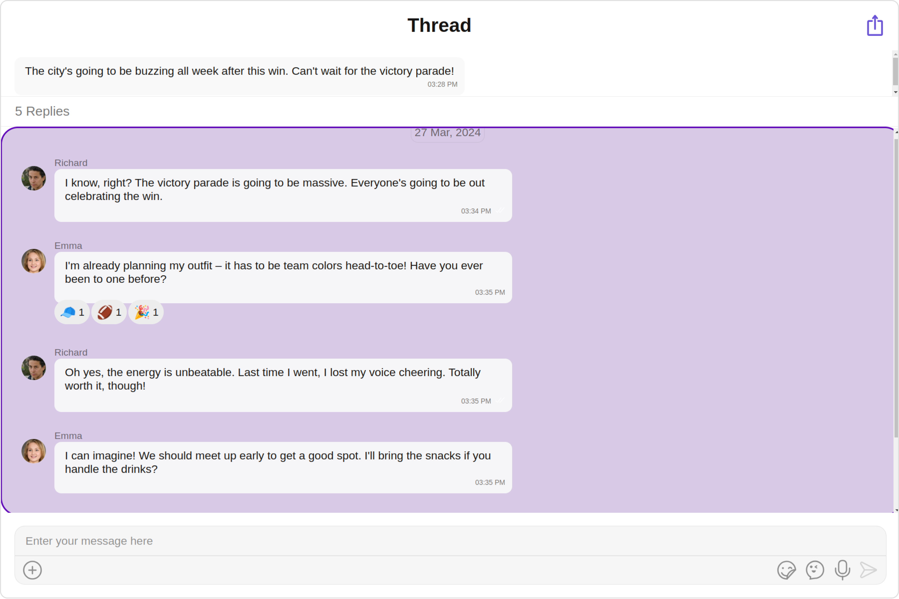

import Tabs from '@theme/Tabs';
import TabItem from '@theme/TabItem';

## Overview

The Messages is a [Composite Component](/ui-kit/angular/components-overview#composite-components) that manages messages for users and groups.


The Messages component is composed of three individual components, [MessageHeader](/ui-kit/angular/message-header), [MessageList](/ui-kit/angular/message-list), and [MessageComposer](/ui-kit/angular/message-composer). In addition, the Messages component also navigates to the [Details](/ui-kit/angular/group-details) and [ThreadedMessages](/ui-kit/angular/threaded-messages) components.

| Components                                            | Description                                                                                                                                                                                              |
| ----------------------------------------------------- | -------------------------------------------------------------------------------------------------------------------------------------------------------------------------------------------------------- |
| [MessageHeader](/ui-kit/angular/message-header)       | `CometChatMessageHeader` displays the `User` or `Group` information using CometChat SDK's `User` or `Group object.` It also shows the typing indicator when the user starts typing in `MessageComposer`. |
| [MessageList](/ui-kit/angular/message-list)           | `CometChatMessageList` is one of the core UI components. It displays a list of messages and handles real-time operations.                                                                                |
| [MessageComposer](./message-composer)                 | `CometChatMessageComposer` is an independent and critical component that allows users to compose and send various types of messages includes text, image, video and custom messages.                     |
| [Details](/ui-kit/angular/group-details)              | `CometChatDetails` is a component that displays all the available options available for `Users` & `Groups`                                                                                               |
| [ThreadedMessages](/ui-kit/angular/threaded-messages) | `CometChatThreadedMessages` is a component that displays all replies made to a particular message in a conversation.                                                                                     |

## Usage

### Integration

The following code snippet illustrates how you can directly incorporate the Messages component.

<Tabs>
<TabItem value="js" label="app.module.ts">

```javascript
import { CUSTOM_ELEMENTS_SCHEMA, NgModule } from "@angular/core";
import { BrowserModule } from "@angular/platform-browser";
import { CometChatMessages } from "@cometchat/chat-uikit-angular";
import { AppComponent } from "./app.component";

@NgModule({
  imports: [BrowserModule, CometChatMessages],
  declarations: [AppComponent],
  providers: [],
  bootstrap: [AppComponent],
  schemas: [CUSTOM_ELEMENTS_SCHEMA],
})
export class AppModule {}
```

</TabItem>
<TabItem value="app.component.ts" label="app.component.ts">

```javascript
import { CometChat } from '@cometchat/chat-sdk-javascript';
import { Component, OnInit } from '@angular/core';
import {  CometChatThemeService, CometChatUIKit } from '@cometchat/chat-uikit-angular';
import "@cometchat/uikit-elements";

@Component({
  selector: 'app-root',
  templateUrl: './app.component.html',
  styleUrls: ['./app.component.css']
})
export class AppComponent implements OnInit{
  ngOnInit(): void {
    CometChat.getUser("uid").then((user:CometChat.User)=>{
      this.userObject=user;
    });
  }

  public userObject!: CometChat.User;

  constructor(private themeService:CometChatThemeService) {
    themeService.theme.palette.setMode("light")
    themeService.theme.palette.setPrimary({ light: "#6851D6", dark: "#6851D6" })
  }

  onLogin(UID?: any) {
    CometChatUIKit.login({ uid: UID }).then(
      (user) => {
        setTimeout(() => {
          window.location.reload();
        }, 1000);
      },
      (error) => {
        console.log("Login failed with exception:", { error });
      }
    );
  }
}
```

</TabItem>
<TabItem value="ts" label="app.component.html">

```html
<div class="fullwidth">
  <cometchat-messages
    *ngIf="userObject"
    [user]="userObject"
  ></cometchat-messages>
</div>
```

</TabItem>
</Tabs>

---

### Actions

[Actions](/ui-kit/angular/components-overview#actions) dictate how a component functions. They are divided into two types: Predefined and User-defined. You can override either type, allowing you to tailor the behavior of the component to fit your specific needs.

The Messages component does not have its actions. However, since it's a [Composite Component](/ui-kit/angular/components-overview#composite-components), you can use the actions of its components by utilizing the [Configurations](#configuration) object of each component.

**Example**

In this example, we are employing the [onThreadRepliesClick](/ui-kit/angular/message-list#1-onthreadrepliesclick) action from the MessageList Component through the MessageListConfiguration object.

<Tabs>
<TabItem value="app.component.ts" label="app.component.ts">

```javascript
import { Component, OnInit } from '@angular/core';
import {  CometChatThemeService, CometChatUIKit } from '@cometchat/chat-uikit-angular';
import { MessageListConfiguration } from '@cometchat/uikit-shared';
import "@cometchat/uikit-elements";

@Component({
  selector: 'app-root',
  templateUrl: './app.component.html',
  styleUrls: ['./app.component.css']
})
export class AppComponent implements OnInit{

  ngOnInit(): void {
    CometChat.getUser("uid").then((user:CometChat.User)=>{
      this.userObject=user;
    });
  }

  public userObject!: CometChat.User;

  constructor(private themeService:CometChatThemeService) {
    themeService.theme.palette.setMode("light")
    themeService.theme.palette.setPrimary({ light: "#6851D6", dark: "#6851D6" })
  }

  public handleOnThreadRepliesClick = ()=>{
    console.log("your custom on thread replies click");
  };

  public messageListConfiguration = new MessageListConfiguration({
    onThreadRepliesClick:this.handleOnThreadRepliesClick
  });


  onLogin(UID?: any) {
    CometChatUIKit.login({ uid: UID }).then(
      (user) => {
        setTimeout(() => {
          window.location.reload();
        }, 1000);
      },
      (error) => {
        console.log("Login failed with exception:", { error });
      }
    );
  }
}
```

</TabItem>
<TabItem value="ts" label="app.component.html">

```html
<div class="fullwidth">
  <cometchat-messages
    *ngIf="userObject"
    [user]="userObject"
    [messageListConfiguration]="messageListConfiguration"
  ></cometchat-messages>
</div>
```

</TabItem>
</Tabs>

---

On thread replies click:



Thread Screen:


> The Messages Component overrides the [onThreadRepliesClick](/ui-kit/angular/message-list#1-onthreadrepliesclick) action to navigate to the [ThreadedMessages](/ui-kit/angular/threaded-messages) component. If you override `onThreadRepliesClick`, it will also override the default behavior of the Messages Component.

### Filters

**Filters** allow you to customize the data displayed in a list within a Component. You can filter the list based on your specific criteria, allowing for a more customized. Filters can be applied using RequestBuilders of Chat SDK.

The Messages component does not have its filters. But as it is a [Composite Component](/ui-kit/angular/components-overview#composite-components), you can use the filters of its components by using the [Configurations](#configuration) object of each component. For more details on the filters of its components, please refer to [MessageList Filters](/ui-kit/angular/message-list#filters).

**Example**

In this example, we're applying the MessageList Component filter to the Messages Component using `MessageListConfiguration`.

<Tabs>
<TabItem value="app.component.ts" label="app.component.ts">

```javascript
import { CometChat } from '@cometchat/chat-sdk-javascript';
import { Component, OnInit } from '@angular/core';
import {  CometChatThemeService, CometChatUIKit } from '@cometchat/chat-uikit-angular';
import { MessageListConfiguration } from '@cometchat/uikit-shared';
import "@cometchat/uikit-elements";

@Component({
  selector: 'app-root',
  templateUrl: './app.component.html',
  styleUrls: ['./app.component.css']
})
export class AppComponent implements OnInit{

  ngOnInit(): void {
    CometChat.getUser("uid").then((user:CometChat.User)=>{
      this.userObject=user;
    });
  }

  public userObject!: CometChat.User;

  constructor(private themeService:CometChatThemeService) {
    themeService.theme.palette.setMode("light")
    themeService.theme.palette.setPrimary({ light: "#6851D6", dark: "#6851D6" })
  }

  public messageListConfiguration = new MessageListConfiguration({
    messagesRequestBuilder:new CometChat.MessagesRequestBuilder().setSearchKeyword("Your Search Keyword").setLimit(10)
  });


  onLogin(UID?: any) {
    CometChatUIKit.login({ uid: UID }).then(
      (user) => {
        setTimeout(() => {
          window.location.reload();
        }, 1000);
      },
      (error) => {
        console.log("Login failed with exception:", { error });
      }
    );
  }
}
```

</TabItem>
<TabItem value="ts" label="app.component.html">

```html
<div class="fullwidth">
  <cometchat-messages
    *ngIf="userObject"
    [user]="userObject"
    [messageListConfiguration]="messageListConfiguration"
  ></cometchat-messages>
</div>
```

</TabItem>
</Tabs>

---

### Events

[Events](/ui-kit/angular/components-overview#events) are emitted by a `Component`. By using event you can extend existing functionality. Being global events, they can be applied in Multiple Locations and are capable of being Added or Removed.

The `Messages` component does not produce any events directly.

## Customization

To fit your app's design requirements, you can customize the appearance of the Messages component. We provide exposed methods that allow you to modify the experience and behavior according to your specific needs.

### Style

Using Style you can customize the look and feel of the component in your app, These parameters typically control elements such as the color, size, shape, and fonts used within the component.

##### 1. Messages Style

You can customize the appearance of the Messages Component by applying the MessagesStyle to it using the following code snippet.

<Tabs>
<TabItem value="app.component.ts" label="app.component.ts">

```javascript
import { CometChat } from '@cometchat/chat-sdk-javascript';
import { Component, OnInit } from '@angular/core';
import {  CometChatThemeService, CometChatUIKit } from '@cometchat/chat-uikit-angular';
import { MessageListConfiguration, MessagesStyle } from '@cometchat/uikit-shared';
import "@cometchat/uikit-elements";

@Component({
  selector: 'app-root',
  templateUrl: './app.component.html',
  styleUrls: ['./app.component.css']
})
export class AppComponent implements OnInit{

  ngOnInit(): void {
    CometChat.getUser("uid").then((user:CometChat.User)=>{
      this.userObject=user;
    });
  }

  public userObject!: CometChat.User;

  constructor(private themeService:CometChatThemeService) {
    themeService.theme.palette.setMode("light")
    themeService.theme.palette.setPrimary({ light: "#6851D6", dark: "#6851D6" })
  }
  messagesStyle = new MessagesStyle({
    background: "#7E57C2",
    border:'2px solid #ee7752',
    borderRadius:'12px'
  });

  onLogin(UID?: any) {
    CometChatUIKit.login({ uid: UID }).then(
      (user) => {
        setTimeout(() => {
          window.location.reload();
        }, 1000);
      },
      (error) => {
        console.log("Login failed with exception:", { error });
      }
    );
  }
}
```

</TabItem>
<TabItem value="ts" label="app.component.html">

```html
<div class="fullwidth">
  <cometchat-messages
    *ngIf="userObject"
    [user]="userObject"
    [messagesStyle]="messagesStyle"
  ></cometchat-messages>
</div>
```

</TabItem>
</Tabs>

List of properties exposed by MessagesStyle

| Property         | Description                                                                                            | Code                    |
| ---------------- | ------------------------------------------------------------------------------------------------------ | ----------------------- |
| **background**   | Sets all background style properties at once, such as color, image, origin and size, or repeat method. | `background:"sting",`   |
| **border**       | Sets the border of the component                                                                       | `border:"string"`       |
| **borderRadius** | Sets the border radius of the component                                                                | `borderRadius:"string"` |
| **height**       | Sets the height of the component                                                                       | `height:"string"`       |
| **width**        | Sets the width of the component                                                                        | `width:"string"`        |

##### 2. Component's Styles

Being a [Composite component](/ui-kit/angular/components-overview#composite-components), the Messages Component allows you to customize the styles of its components using their respective Configuration objects.

For a list of all available properties, refer to each component's styling documentation: [MesssageHeader Styles](/ui-kit/angular/message-header#1-messageheader-style), [MessageList Styles](/ui-kit/angular/message-list#style), [MessageComposer Styles](/ui-kit/angular/message-composer#style), [Details Styles](/ui-kit/angular/group-details#style), [ThreadMessages Styles](/ui-kit/angular/threaded-messages#style).

**Example**

In this example, we are creating `MessageListStyle` and `MessageComposerStyle` and then applying them to the Messages Component using `MessageListConfiguration` and `MessageComposerConfiguration`.

<Tabs>
<TabItem value="app.component.ts" label="app.component.ts">

```javascript
import { CometChat } from '@cometchat/chat-sdk-javascript';
import { Component, OnInit } from '@angular/core';
import {  CometChatThemeService, CometChatUIKit } from '@cometchat/chat-uikit-angular';
import { MessageListConfiguration, MessageComposerConfiguration, MessageListStyle, MessageComposerStyle } from '@cometchat/uikit-shared';
import "@cometchat/uikit-elements";

@Component({
  selector: 'app-root',
  templateUrl: './app.component.html',
  styleUrls: ['./app.component.css']
})
export class AppComponent implements OnInit{

  ngOnInit(): void {
    CometChat.getUser("uid").then((user:CometChat.User)=>{
      this.userObject=user;
    });
  }

  public userObject!: CometChat.User;

  constructor(private themeService:CometChatThemeService) {
    themeService.theme.palette.setMode("light")
    themeService.theme.palette.setPrimary({ light: "#6851D6", dark: "#6851D6" })
  }

  public messageListConfiguration = new MessageListConfiguration({
    messageListStyle: new MessageListStyle({
      background: "transparent",
      border: "1px solid black",
      borderRadius: "20px",
      height: "100%",
      width: "100%",
      loadingIconTint: "red",
      nameTextColor: "pink",
      threadReplyTextColor: "green"
    })
  });

  public messageComposerConfiguration = new MessageComposerConfiguration({
    messageComposerStyle: new MessageComposerStyle({
      AIIconTint: "#ec03fc",
      attachIcontint: "#ec03fc",
      background: "#fffcff",
      border: "2px solid #b30fff",
      borderRadius: "20px",
      inputBackground: "#e2d5e8",
      textColor: "#ff299b",
      sendIconTint: "#ff0088",
    })
  });

  onLogin(UID?: any) {
    CometChatUIKit.login({ uid: UID }).then(
      (user) => {
        setTimeout(() => {
          window.location.reload();
        }, 1000);
      },
      (error) => {
        console.log("Login failed with exception:", { error });
      }
    );
  }
}
```

</TabItem>
<TabItem value="ts" label="app.component.html">

```html
<div class="fullwidth">
  <cometchat-messages
    *ngIf="userObject"
    [user]="userObject"
    [messageComposerConfiguration]="messageComposerConfiguration"
    [messageListConfiguration]="messageListConfiguration"
  ></cometchat-messages>
</div>
```

</TabItem>
</Tabs>

---

### Functionality

These are a set of small functional customizations that allow you to fine-tune the overall experience of the component. With these, you can change text, set custom icons, and toggle the visibility of UI elements.

<Tabs>
<TabItem value="app.component.ts" label="app.component.ts">

```javascript
import { CometChat } from '@cometchat/chat-sdk-javascript';
import { Component, OnInit } from '@angular/core';
import {  CometChatThemeService, CometChatUIKit } from '@cometchat/chat-uikit-angular';
import "@cometchat/uikit-elements";

@Component({
  selector: 'app-root',
  templateUrl: './app.component.html',
  styleUrls: ['./app.component.css']
})
export class AppComponent implements OnInit{

  ngOnInit(): void {
    CometChat.getUser("uid").then((user:CometChat.User)=>{
      this.userObject=user;
    });
  }

  public userObject!: CometChat.User;

  constructor(private themeService:CometChatThemeService) {
    themeService.theme.palette.setMode("light")
    themeService.theme.palette.setPrimary({ light: "#6851D6", dark: "#6851D6" })
  }
  hideDetails = true;
  disableTyping = true;

  onLogin(UID?: any) {
    CometChatUIKit.login({ uid: UID }).then(
      (user) => {
        setTimeout(() => {
          window.location.reload();
        }, 1000);
      },
      (error) => {
        console.log("Login failed with exception:", { error });
      }
    );
  }
}
```

</TabItem>
<TabItem value="ts" label="app.component.html">

```html
<div class="fullwidth">
  <cometchat-messages
    *ngIf="userObject"
    [user]="userObject"
    [hideDetails]="hideDetails"
    [disableTyping]="disableTyping"
  ></cometchat-messages>
</div>
```

</TabItem>
</Tabs>

Below is a list of customizations along with corresponding code snippets
| Property | Description | Code |
| -------------------------------------------------------------------------------------------------------- | ---------------------------------------------------------------------------------------------------------------------------------- | ----------------------------------------------------------- |
| **User** <a data-tooltip-id="my-tooltip-html-prop"> <span class="material-icons red">report</span> </a> | Used to pass user object of which header specific details will be shown | `[user]="userObject"` |
| **Group** <a data-tooltip-id="my-tooltip-html-prop"> <span class="material-icons red">report</span> </a> | Used to pass group object of which header specific details will be shown | `[group]="groupObject"` |
| **Hide MessageComposer** | Used to toggle visibility for CometChatMessageComposer, default false | `hideMessageComposer=true` |
| **Hide MessageHeader** | Used to toggle visibility for CometChatMessageHeader, default false | `hideMessageHeader=true` |
| **Disable Typing** | Used to toggle functionality for showing typing indicator and also enable/disable sending message delivery/read receipts | `disableTyping=true` |
| **Disable SoundForMessages** | Used to toggle sound for messages | `disableSoundForMessages=true` |
| **CustomSoundForIncomingMessages** | Used to set custom sound asset's path for incoming messages | `customSoundForIncomingMessages="your custom sound for incoming call"` |
| **CustomSoundForOutgoingMessages** | Used to set custom sound asset's path for outgoing messages | `customSoundForOutgoingMessages="your custom sound for outgoing call"` |
| **Hide Details** | Used to toggle visibility for details icon in CometChatMessageHeader | `hideDetails=true` |

### Advanced

For advanced-level customization, you can set custom views to the component. This lets you tailor each aspect of the component to fit your exact needs and application aesthetics. You can create and define your views, layouts, and UI elements and then incorporate those into the component.

---

#### MessageHeaderView

You can set your custom message header view using the `messageHeaderView` property. But keep in mind, by using this you will override the default message header functionality.

**Example**

**Default**



**Custom**


<Tabs>
<TabItem value="app.component.ts" label="app.component.ts">

```javascript
import { CometChat } from '@cometchat/chat-sdk-javascript';
import { Component, OnInit } from '@angular/core';
import {  CometChatThemeService, CometChatUIKit } from '@cometchat/chat-uikit-angular';
import "@cometchat/uikit-elements";

@Component({
  selector: 'app-root',
  templateUrl: './app.component.html',
  styleUrls: ['./app.component.css']
})
export class AppComponent implements OnInit{

  ngOnInit(): void {
    CometChat.getUser("uid").then((user:CometChat.User)=>{
      this.userObject=user;
    });
  }

  public userObject!: CometChat.User;

  constructor(private themeService:CometChatThemeService) {
    themeService.theme.palette.setMode("light")
    themeService.theme.palette.setPrimary({ light: "#6851D6", dark: "#6851D6" })
  }

  onLogin(UID?: any) {
    CometChatUIKit.login({ uid: UID }).then(
      (user) => {
        setTimeout(() => {
          window.location.reload();
        }, 1000);
      },
      (error) => {
        console.log("Login failed with exception:", { error });
      }
    );
  }
}
```

</TabItem>
<TabItem value="ts" label="app.component.html">

```html
<div class="fullwidth">
  <cometchat-messages
    *ngIf="userObject"
    [user]="userObject"
    [messageHeaderView]="messageHeaderViewTemplate"
  ></cometchat-messages>
</div>

<ng-template #messageHeaderViewTemplate>
  <div
    style="display: flex; margin: 10px;padding: 10px; border: 2px solid #6107ba; border-radius: 15px;"
  >
    <cometchat-avatar
      image="{{userObject.getAvatar()}}"
      name="{{userObject.getName()}}"
    >
    </cometchat-avatar>
    <p style="margin-left:20px; margin-top:8px">{{userObject.getName()}}</p>
  </div>
</ng-template>
```

</TabItem>
</Tabs>

---

#### MessageListView

You can set your custom message list view using the `messageListView` property. But keep in mind, by using this you will override the default message ListView functionality.

**Example**

**Default**


**Custom**


<Tabs>
<TabItem value="app.component.ts" label="app.component.ts">

```javascript
import { CometChat } from '@cometchat/chat-sdk-javascript';
import { Component, OnInit } from '@angular/core';
import {  CometChatThemeService, CometChatUIKit } from '@cometchat/chat-uikit-angular';
import { MessageListStyle } from '@cometchat/uikit-shared';
import { MessageListAlignment } from '@cometchat/uikit-resources';

import "@cometchat/uikit-elements";

@Component({
  selector: 'app-root',
  templateUrl: './app.component.html',
  styleUrls: ['./app.component.css']
})
export class AppComponent implements OnInit{

  ngOnInit(): void {
    CometChat.getUser("uid").then((user:CometChat.User)=>{
      this.userObject=user;
    });
  }

  public userObject!: CometChat.User;
  messageListStyle = new MessageListStyle({
    background: "#fdf2ff",
    border: "1px solid #d608ff",
    borderRadius: "20px",
    loadingIconTint: "red",
    nameTextColor: "pink",
    threadReplyTextColor: "green"
  });
  alignment = MessageListAlignment.left;

  constructor(private themeService:CometChatThemeService) {
    themeService.theme.palette.setMode("light")
    themeService.theme.palette.setPrimary({ light: "#6851D6", dark: "#6851D6" })
  }

  onLogin(UID?: any) {
    CometChatUIKit.login({ uid: UID }).then(
      (user) => {
        setTimeout(() => {
          window.location.reload();
        }, 1000);
      },
      (error) => {
        console.log("Login failed with exception:", { error });
      }
    );
  }
}
```

</TabItem>
<TabItem value="ts" label="app.component.html">

```html
<div class="fullwidth">
  <cometchat-messages
    *ngIf="userObject"
    [user]="userObject"
    [messageListView]="messageListViewTemplate"
  ></cometchat-messages>
</div>

<ng-template #messageListViewTemplate>
  <div>
    <cometchat-message-list
      [user]="userObject"
      [messageListStyle]="messageListStyle"
      [alignment]="alignment"
    ></cometchat-message-list>
  </div>
</ng-template>
```

</TabItem>
</Tabs>

---

#### MessageComposerView

You can set your custom Message Composer view using the `messageComposerView` property. But keep in mind, by using this you will override the default message composer functionality.

**Example**

**Default**



**Custom**


<Tabs>
<TabItem value="app.component.ts" label="app.component.ts">

```javascript
import { CometChat } from '@cometchat/chat-sdk-javascript';
import { Component, OnInit } from '@angular/core';
import {  CometChatThemeService, CometChatUIKit } from '@cometchat/chat-uikit-angular';
import { MessageComposerStyle } from '@cometchat/uikit-shared';
import { AuxiliaryButtonAlignment } from '@cometchat/uikit-resources';

import "@cometchat/uikit-elements";

@Component({
  selector: 'app-root',
  templateUrl: './app.component.html',
  styleUrls: ['./app.component.css']
})
export class AppComponent implements OnInit{

  ngOnInit(): void {
    CometChat.getUser("uid").then((user:CometChat.User)=>{
      this.userObject=user;
    });
  }

  public userObject!: CometChat.User;
  messageComposerStyle = new MessageComposerStyle({
    AIIconTint:"#ec03fc",
    attachIcontint:"#ec03fc",
    background:"#fffcff",
    border:"2px solid #b30fff",
    borderRadius:"20px",
    inputBackground:"#e2d5e8",
    textColor:"#ff299b",
    sendIconTint:"#ff0088",
  });
  auxiliaryButtonAlignment = AuxiliaryButtonAlignment.left;

  constructor(private themeService:CometChatThemeService) {
    themeService.theme.palette.setMode("light")
    themeService.theme.palette.setPrimary({ light: "#6851D6", dark: "#6851D6" })
  }

  onLogin(UID?: any) {
    CometChatUIKit.login({ uid: UID }).then(
      (user) => {
        setTimeout(() => {
          window.location.reload();
        }, 1000);
      },
      (error) => {
        console.log("Login failed with exception:", { error });
      }
    );
  }
}
```

</TabItem>
<TabItem value="ts" label="app.component.html">

```html
<div class="fullwidth">
  <cometchat-messages
    *ngIf="userObject"
    [user]="userObject"
    [messageComposerView]="messageComposerViewTemplate"
  ></cometchat-messages>
</div>

<ng-template #messageComposerViewTemplate>
  <div>
    <cometchat-message-composer
      [user]="userObject"
      [messageComposerStyle]="messageComposerStyle"
      [auxiliaryButtonAlignment]="auxiliaryButtonAlignment"
    ></cometchat-message-composer>
  </div>
</ng-template>
```

</TabItem>
</Tabs>

---

#### AuxiliaryMenu

You can set a custom header menu option by using the `auxiliaryMenu` property.

**Example**

**Default**



**Custom**


<Tabs>
<TabItem value="app.component.ts" label="app.component.ts">

```javascript
import { CometChat } from '@cometchat/chat-sdk-javascript';
import { Component, OnInit } from '@angular/core';
import {  CometChatThemeService, CometChatUIKit, IconStyle } from '@cometchat/chat-uikit-angular';
import "@cometchat/uikit-elements";

@Component({
  selector: 'app-root',
  templateUrl: './app.component.html',
  styleUrls: ['./app.component.css']
})
export class AppComponent implements OnInit{

  ngOnInit(): void {
    CometChat.getUser("uid").then((user:CometChat.User)=>{
      this.userObject=user;
    });
  }

  public userObject!: CometChat.User;
  auxiliaryButtonURL = 'Your custom icon url';

  getIconStyle = new IconStyle({
    iconTint:"#d400ff",
  });
  constructor(private themeService:CometChatThemeService) {
    themeService.theme.palette.setMode("light")
    themeService.theme.palette.setPrimary({ light: "#6851D6", dark: "#6851D6" })
  }

  onLogin(UID?: any) {
    CometChatUIKit.login({ uid: UID }).then(
      (user) => {
        setTimeout(() => {
          window.location.reload();
        }, 1000);
      },
      (error) => {
        console.log("Login failed with exception:", { error });
      }
    );
  }
}
```

</TabItem>
<TabItem value="ts" label="app.component.html">

```html
<div class="fullwidth">
  <cometchat-messages
    *ngIf="userObject"
    [user]="userObject"
    [auxiliaryMenu]="auxiliaryMenuTemplate"
  ></cometchat-messages>
</div>

<ng-template #auxiliaryMenuTemplate>
  <cometchat-icon
    [URL]="auxiliaryButtonURL"
    [iconStyle]="getIconStyle"
  ></cometchat-icon>
</ng-template>
```

</TabItem>
</Tabs>

---

## Configuration

Configurations offer the ability to customize the properties of each individual component within a Composite Component.

The Messages Component is a Composite Component and it has a specific set of configuration for each of its components.

### MessageHeader

If you want to customize the properties of the [MessageHeader](./message-header) Component inside Messages Component, you need use the `MessageHeaderConfiguration` object.

The `MessageHeaderConfiguration` provides access to all the [Action](/ui-kit/angular/message-header#actions), [Filters](/ui-kit/angular/message-header#filters), [Styles](/ui-kit/angular/message-header#style), [Functionality](/ui-kit/angular/message-header#functionality), and [Advanced](/ui-kit/angular/message-header#advanced) properties of the [MessageHeader](/ui-kit/angular/message-header) component.

> Please note that the properties marked with the <a><span class="material-icons red">report</span></a> symbol are not accessible within the Configuration Object.

**Example**


In this example, we will style the Avatar and MessageHeader of the [MessageHeader](/ui-kit/angular/message-header) component using `MessageHeaderConfiguration`.

<Tabs>
<TabItem value="app.component.ts" label="app.component.ts">

```javascript
import { CometChat } from '@cometchat/chat-sdk-javascript';
import { Component, OnInit } from '@angular/core';
import {  CometChatThemeService, CometChatUIKit, AvatarStyle } from '@cometchat/chat-uikit-angular';
import { MessageHeaderConfiguration, MessageHeaderStyle } from '@cometchat/uikit-shared';
import "@cometchat/uikit-elements";

@Component({
  selector: 'app-root',
  templateUrl: './app.component.html',
  styleUrls: ['./app.component.css']
})
export class AppComponent implements OnInit{

  ngOnInit(): void {
    CometChat.getUser("uid").then((user:CometChat.User)=>{
      this.userObject=user;
    });
  }

  public userObject!: CometChat.User;
  public messageHeaderConfiguration = new MessageHeaderConfiguration({
    avatarStyle: this.avatarStyle,
    messageHeaderStyle: this.messageHeaderStyle
  });
  avatarStyle = new AvatarStyle({
    backgroundColor:"#cdc2ff",
    border:"2px solid #6745ff",
    borderRadius:"10px",
    outerViewBorderColor:"#ca45ff",
    outerViewBorderRadius:"5px",
    nameTextColor:"#4554ff"
  });

  messageHeaderStyle = new MessageHeaderStyle({
    background:"#f2f3ff",
    border:"2px solid #a117eb",
    borderRadius:"20px",
    subtitleTextColor:"#2d55a6"
  });
  constructor(private themeService:CometChatThemeService) {
    themeService.theme.palette.setMode("light")
    themeService.theme.palette.setPrimary({ light: "#6851D6", dark: "#6851D6" })
  }

  onLogin(UID?: any) {
    CometChatUIKit.login({ uid: UID }).then(
      (user) => {
        setTimeout(() => {
          window.location.reload();
        }, 1000);
      },
      (error) => {
        console.log("Login failed with exception:", { error });
      }
    );
  }
}
```

</TabItem>
<TabItem value="ts" label="app.component.html">

```html
<div class="fullwidth">
  <cometchat-messages
    *ngIf="userObject"
    [user]="userObject"
    [messageHeaderConfiguration]="messageHeaderConfiguration"
  ></cometchat-messages>
</div>
```

</TabItem>
</Tabs>

---

### MessageList

If you want to customize the properties of the [MessageList](./message-list) Component inside Messages Component, you need use the `MessageListConfiguration` object.

The `MessageListConfiguration` provides access to all the [Action](/ui-kit/angular/message-list#actions), [Filters](/ui-kit/angular/message-list#filters), [Styles](/ui-kit/angular/message-list#style), [Functionality](/ui-kit/angular/message-list#functionality), and [Advanced](/ui-kit/angular/message-list#functionality) properties of the [MessageList](/ui-kit/angular/message-list) component.

> Please note that the properties marked with the <a><span class="material-icons red">report</span></a> symbol are not accessible within the Configuration Object.

**Example**

In this example, we will be changing the list alignment and modifying the message list styles in the [MessageList](/ui-kit/angular/message-list) component using `MessageListConfiguration`.

<Tabs>
<TabItem value="app.component.ts" label="app.component.ts">

```javascript
import { CometChat } from '@cometchat/chat-sdk-javascript';
import { Component, OnInit } from '@angular/core';
import {  CometChatThemeService, CometChatUIKit, AvatarStyle } from '@cometchat/chat-uikit-angular';
import { MessageListConfiguration, MessageListStyle } from '@cometchat/uikit-shared';
import { MessageListAlignment } from '@cometchat/uikit-resources';
import "@cometchat/uikit-elements";

@Component({
  selector: 'app-root',
  templateUrl: './app.component.html',
  styleUrls: ['./app.component.css']
})
export class AppComponent implements OnInit{

  ngOnInit(): void {
    CometChat.getUser("uid").then((user:CometChat.User)=>{
      this.userObject=user;
    });
  }

  public userObject!: CometChat.User;
  public messageListConfiguration = new MessageListConfiguration({
    messageListStyle: new MessageListStyle({
      background:"#d8cae6",
        border:"2px solid #6107ba",
        borderRadius:"20px",
        loadingIconTint:"red",
        nameTextColor:"pink",
        threadReplyTextColor:"green"
    }),
    alignment: MessageListAlignment.left
  });
  constructor(private themeService:CometChatThemeService) {
    themeService.theme.palette.setMode("light")
    themeService.theme.palette.setPrimary({ light: "#6851D6", dark: "#6851D6" })
  }

  onLogin(UID?: any) {
    CometChatUIKit.login({ uid: UID }).then(
      (user) => {
        setTimeout(() => {
          window.location.reload();
        }, 1000);
      },
      (error) => {
        console.log("Login failed with exception:", { error });
      }
    );
  }
}
```

</TabItem>
<TabItem value="ts" label="app.component.html">

```html
<div class="fullwidth">
  <cometchat-messages
    *ngIf="userObject"
    [user]="userObject"
    [messageListConfiguration]="messageListConfiguration"
  ></cometchat-messages>
</div>
```

</TabItem>
</Tabs>

---

### MessageComposer

If you want to customize the properties of the [MessageComposer](/ui-kit/angular/message-composer) Component inside Messages Component, you need use the `MessageComposerConfiguration` object.

The `MessageComposerConfiguration` provides access to all the [Action](/ui-kit/angular/message-composer#actions), [Filters](/ui-kit/angular/message-composer#filters), [Styles](/ui-kit/angular/message-composer#style), [Functionality](/ui-kit/angular/message-composer#functionality), and [Advanced](/ui-kit/angular/message-composer#advanced) properties of the [MessageComposer](/ui-kit/angular/message-composer) component.

> Please note that the properties marked with the <a><span class="material-icons red">report</span></a> symbol are not accessible within the Configuration Object.

**Example**


In this example, we'll be adding styling to the message composer and custom text to the [MessageComposer](/ui-kit/angular/message-composer) component using `MessageComposerConfiguration`.

<Tabs>
<TabItem value="app.component.ts" label="app.component.ts">

```javascript
import { CometChat } from '@cometchat/chat-sdk-javascript';
import { Component, OnInit } from '@angular/core';
import {  CometChatThemeService, CometChatUIKit } from '@cometchat/chat-uikit-angular';
import { MessageComposerConfiguration, MessageComposerStyle } from '@cometchat/uikit-shared';
import "@cometchat/uikit-elements";

@Component({
  selector: 'app-root',
  templateUrl: './app.component.html',
  styleUrls: ['./app.component.css']
})
export class AppComponent implements OnInit{

  ngOnInit(): void {
    CometChat.getUser("uid").then((user:CometChat.User)=>{
      this.userObject=user;
    });
  }

  public userObject!: CometChat.User;
  public messageComposerConfiguration = new MessageComposerConfiguration({
    text:'Your Custom Text',

    messageComposerStyle: new MessageComposerStyle({
      AIIconTint: "#ec03fc",
      attachIcontint: "#ec03fc",
      background: "#fffcff",
      border: "2px solid #b30fff",
      borderRadius: "20px",
      inputBackground: "#e2d5e8",
      textColor: "#ff299b",
      sendIconTint: "#ff0088",
    })
  });
  constructor(private themeService:CometChatThemeService) {
    themeService.theme.palette.setMode("light")
    themeService.theme.palette.setPrimary({ light: "#6851D6", dark: "#6851D6" })
  }

  onLogin(UID?: any) {
    CometChatUIKit.login({ uid: UID }).then(
      (user) => {
        setTimeout(() => {
          window.location.reload();
        }, 1000);
      },
      (error) => {
        console.log("Login failed with exception:", { error });
      }
    );
  }
}
```

</TabItem>
<TabItem value="ts" label="app.component.html">

```html
<div class="fullwidth">
  <cometchat-messages
    *ngIf="userObject"
    [user]="userObject"
    [messageComposerConfiguration]="messageComposerConfiguration"
  ></cometchat-messages>
</div>
```

</TabItem>
</Tabs>

---

### ThreadedMessages

If you want to customize the properties of the [ThreadedMessages](/ui-kit/angular/threaded-messages) Component inside Messages Component, you need use the `ThreadedMessagesConfiguration` object.

The `ThreadedMessagesConfiguration` provides access to all the [Action](/ui-kit/angular/threaded-messages#actions), [Filters](/ui-kit/angular/threaded-messages#filters), [Styles](/ui-kit/angular/threaded-messages#style), [Functionality](/ui-kit/angular/threaded-messages#functionality), and [Advanced](/ui-kit/angular/threaded-messages#advanced) properties of the [ThreadedMessages](/ui-kit/angular/threaded-messages) component.

> Please note that the properties marked with the <a><span class="material-icons red">report</span></a> symbol are not accessible within the Configuration Object.

**Example**


In this example, we are adding a custom close icon to the Threaded Message component and also adding custom properties to the [MessageList](#messagelist) using `MessageListConfiguration`. We then apply these changes to the [ThreadedMessages](/ui-kit/angular/message-composer) component using `ThreadedMessagesConfiguration`.

<Tabs>
<TabItem value="app.component.ts" label="app.component.ts">

```javascript
import { CometChat } from '@cometchat/chat-sdk-javascript';
import { Component, OnInit } from '@angular/core';
import {  CometChatThemeService, CometChatUIKit } from '@cometchat/chat-uikit-angular';
import { ThreadedMessagesConfiguration, MessageListConfiguration, MessageListStyle } from '@cometchat/uikit-shared';
import { MessageListAlignment } from '@cometchat/uikit-resources';
import "@cometchat/uikit-elements";

@Component({
  selector: 'app-root',
  templateUrl: './app.component.html',
  styleUrls: ['./app.component.css']
})
export class AppComponent implements OnInit{

  ngOnInit(): void {
    CometChat.getUser("uid").then((user:CometChat.User)=>{
      this.userObject=user;
    });
  }

  public userObject!: CometChat.User;
  public threadedMessageConfiguration = new ThreadedMessagesConfiguration({
    closeIconURL: 'close Icon',
    messageListConfiguration: new MessageListConfiguration({
      messageListStyle: new MessageListStyle({
          background:"#d8cae6",
          border:"2px solid #6107ba",
          borderRadius:"20px",
          loadingIconTint:"red",
          nameTextColor:"pink",
          threadReplyTextColor:"green"
      }),
      alignment:MessageListAlignment.left
    })
  });
  constructor(private themeService:CometChatThemeService) {
    themeService.theme.palette.setMode("light")
    themeService.theme.palette.setPrimary({ light: "#6851D6", dark: "#6851D6" })
  }

  onLogin(UID?: any) {
    CometChatUIKit.login({ uid: UID }).then(
      (user) => {
        setTimeout(() => {
          window.location.reload();
        }, 1000);
      },
      (error) => {
        console.log("Login failed with exception:", { error });
      }
    );
  }
}
```

</TabItem>
<TabItem value="ts" label="app.component.html">

```html
<div class="fullwidth">
  <cometchat-messages
    *ngIf="userObject"
    [user]="userObject"
    [threadedMessageConfiguration]="threadedMessageConfiguration"
  ></cometchat-messages>
</div>
```

</TabItem>
</Tabs>

import { Tooltip } from 'react-tooltip'
import 'react-tooltip/dist/react-tooltip.css'

<Tooltip
  id="my-tooltip-html-prop"
  html="Not available in MessageConfiguration"
/>
