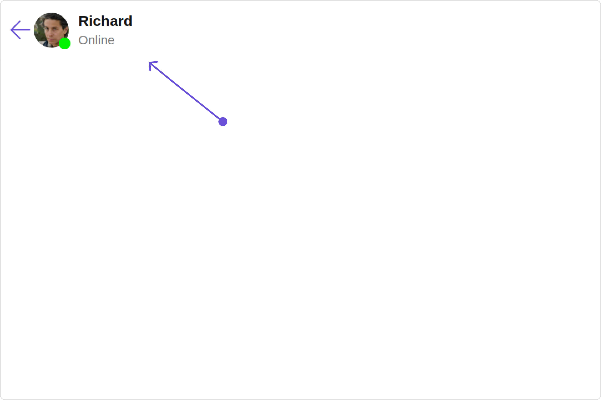
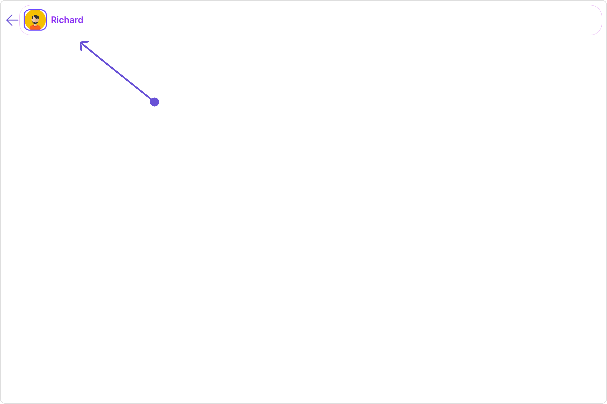
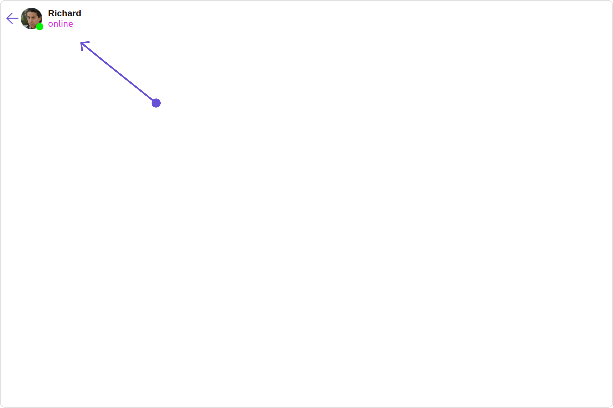
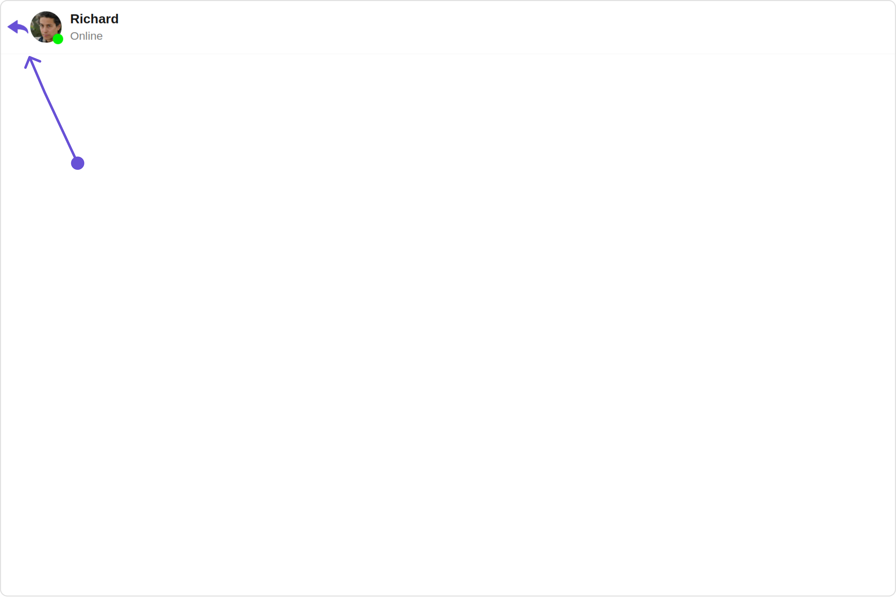
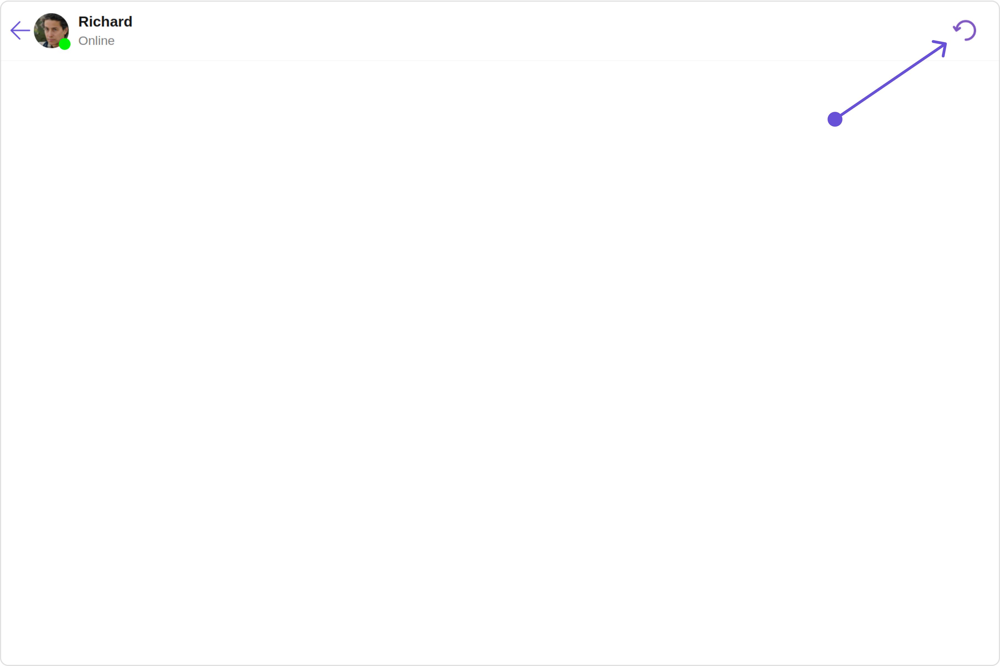

import Tabs from '@theme/Tabs';
import TabItem from '@theme/TabItem';

## Overview

`MessageHeader` is a [Component](/ui-kit/angular/components-overview#components) that showcases the [User](/sdk/javascript/users-overview) or [Group](/sdk/javascript/groups-overview) details in the toolbar. Furthermore, it also presents a typing indicator and a back navigation button for ease of use.



The `MessageHeader` is comprised of the following components:

| Components                        | Description                                                                                                                                    |
| --------------------------------- | ---------------------------------------------------------------------------------------------------------------------------------------------- |
| [ListItem Component](./list-item) | This component’s view consists of avatar, status indicator , title, and subtitle. The fields are then mapped with the SDK’s user, group class. |
| Back Button                       | BackButton that allows users to navigate back from the current activity or screen to the previous one                                          |

## Usage

### Integration

<Tabs>
<TabItem value="js" label="app.module.ts">

```javascript
import { CUSTOM_ELEMENTS_SCHEMA, NgModule } from "@angular/core";
import { BrowserModule } from "@angular/platform-browser";
import { CometChatMessageHeader } from "@cometchat/chat-uikit-angular";
import { AppComponent } from "./app.component";

@NgModule({
  imports: [BrowserModule, CometChatMessageHeader],
  declarations: [AppComponent],
  providers: [],
  bootstrap: [AppComponent],
  schemas: [CUSTOM_ELEMENTS_SCHEMA],
})
export class AppModule {}
```

</TabItem>
<TabItem value="app.component.ts" label="app.component.ts">

```javascript
import { CometChat } from '@cometchat/chat-sdk-javascript';
import { Component, OnInit } from '@angular/core';
import {  CometChatThemeService, CometChatUIKit } from '@cometchat/chat-uikit-angular';
import "@cometchat/uikit-elements";

@Component({
  selector: 'app-root',
  templateUrl: './app.component.html',
  styleUrls: ['./app.component.css']
})
export class AppComponent implements OnInit{
  ngOnInit(): void {
    CometChat.getUser("uid").then((user:CometChat.User)=>{
      this.userObject=user;
    });
  }

  public userObject!: CometChat.User;

  constructor(private themeService:CometChatThemeService) {
    themeService.theme.palette.setMode("light")
    themeService.theme.palette.setPrimary({ light: "#6851D6", dark: "#6851D6" })
  }

  onLogin(UID?: any) {
    CometChatUIKit.login({ uid: UID }).then(
      (user) => {
        setTimeout(() => {
          window.location.reload();
        }, 1000);
      },
      (error) => {
        console.log("Login failed with exception:", { error });
      }
    );
  }
}
```

</TabItem>
<TabItem value="ts" label="app.component.html">

```html
<div class="fullwidth">
  <cometchat-message-header
    *ngIf="userObject"
    [user]="userObject"
  ></cometchat-message-header>
</div>
```

</TabItem>
</Tabs>

---

### Actions

[Actions](/ui-kit/angular/components-overview#actions) dictate how a component functions. They are divided into two types: Predefined and User-defined. You can override either type, allowing you to tailor the behavior of the component to fit your specific needs.

##### 1. OnBack

`OnBack` is triggered when you click on the back button of the Message Header component. You can override this action using the following code snippet.

**Example**

In this example, we are employing the `onBack` action.

<Tabs>
<TabItem value="app.component.ts" label="app.component.ts">

```javascript
import { Component, OnInit } from '@angular/core';
import {  CometChatThemeService, CometChatUIKit } from '@cometchat/chat-uikit-angular';
import "@cometchat/uikit-elements";

@Component({
  selector: 'app-root',
  templateUrl: './app.component.html',
  styleUrls: ['./app.component.css']
})
export class AppComponent implements OnInit{

  ngOnInit(): void {
    CometChat.getUser("uid").then((user:CometChat.User)=>{
      this.userObject=user;
    });
  }

  public userObject!: CometChat.User;

  constructor(private themeService:CometChatThemeService) {
    themeService.theme.palette.setMode("light")
    themeService.theme.palette.setPrimary({ light: "#6851D6", dark: "#6851D6" })
  }

  public handleOnBack = () => {
    console.log("Your custom on back action");
  }

  onLogin(UID?: any) {
    CometChatUIKit.login({ uid: UID }).then(
      (user) => {
        setTimeout(() => {
          window.location.reload();
        }, 1000);
      },
      (error) => {
        console.log("Login failed with exception:", { error });
      }
    );
  }
}
```

</TabItem>
<TabItem value="ts" label="app.component.html">

```html
<div class="fullwidth">
  <cometchat-message-header
    *ngIf="userObject"
    [user]="userObject"
    [onBack]="handleOnBack"
  ></cometchat-message-header>
</div>
```

</TabItem>
</Tabs>

---

##### 2. OnError

This action doesn't change the behavior of the component but rather listens for any errors that occur in the Message Header component.

**Example**

In this example, we are employing the `onError` action.

<Tabs>
<TabItem value="app.component.ts" label="app.component.ts">

```javascript
import { CometChat } from '@cometchat/chat-sdk-javascript';
import { Component, OnInit } from '@angular/core';
import {  CometChatThemeService, CometChatUIKit } from '@cometchat/chat-uikit-angular';
import "@cometchat/uikit-elements";

@Component({
  selector: 'app-root',
  templateUrl: './app.component.html',
  styleUrls: ['./app.component.css']
})
export class AppComponent implements OnInit{

  ngOnInit(): void {
    CometChat.getUser("uid").then((user:CometChat.User)=>{
      this.userObject=user;
    });
  }

  public userObject!: CometChat.User;

  constructor(private themeService:CometChatThemeService) {
    themeService.theme.palette.setMode("light")
    themeService.theme.palette.setPrimary({ light: "#6851D6", dark: "#6851D6" })
  }

  public handleOnError = (error: CometChat.CometChatException) => {
    console.log("your custom on error action", error);
  };

  onLogin(UID?: any) {
    CometChatUIKit.login({ uid: UID }).then(
      (user) => {
        setTimeout(() => {
          window.location.reload();
        }, 1000);
      },
      (error) => {
        console.log("Login failed with exception:", { error });
      }
    );
  }
}
```

</TabItem>
<TabItem value="ts" label="app.component.html">

```html
<div class="fullwidth">
  <cometchat-message-header
    *ngIf="userObject"
    [user]="userObject"
    [onError]="handleOnError"
  ></cometchat-message-header>
</div>
```

</TabItem>
</Tabs>

---

### Filters

**Filters** allow you to customize the data displayed in a list within a `Component`. You can filter the list based on your specific criteria, allowing for a more customized. Filters can be applied using `RequestBuilders` of Chat SDK.

The `MessageHeader` component does not have any exposed filters.

### Events

[Events](/ui-kit/angular/components-overview#events) are emitted by a `Component`. By using event you can extend existing functionality. Being global events, they can be applied in Multiple Locations and are capable of being Added or Removed.

The `MessageHeader` component does not produce any events.

## Customization

To fit your app's design requirements, you can customize the appearance of the Message Header component. We provide exposed methods that allow you to modify the experience and behavior according to your specific needs.

### Style

Using Style you can customize the look and feel of the component in your app, These parameters typically control elements such as the color, size, shape, and fonts used within the component.

##### 1. MessageHeader Style

To customize the appearance, you can assign a `MessageHeaderStyle` object to the `MessageHeader` component.

**Example**

In this example, we are employing the `MessageHeaderStyle`.

<Tabs>
<TabItem value="app.component.ts" label="app.component.ts">

```javascript
import { CometChat } from '@cometchat/chat-sdk-javascript';
import { Component, OnInit } from '@angular/core';
import {  CometChatThemeService, CometChatUIKit } from '@cometchat/chat-uikit-angular';
import { MessageHeaderStyle } from '@cometchat/uikit-shared';
import "@cometchat/uikit-elements";

@Component({
  selector: 'app-root',
  templateUrl: './app.component.html',
  styleUrls: ['./app.component.css']
})
export class AppComponent implements OnInit{

  ngOnInit(): void {
    CometChat.getUser("uid").then((user:CometChat.User)=>{
      this.userObject=user;
    });
  }

  public userObject!: CometChat.User;

  constructor(private themeService:CometChatThemeService) {
    themeService.theme.palette.setMode("light")
    themeService.theme.palette.setPrimary({ light: "#6851D6", dark: "#6851D6" })
  }

  messageHeaderStyle = new MessageHeaderStyle({
    background:"#f2f3ff",
    border:"2px solid #a117eb",
    borderRadius:"20px",
    subtitleTextColor:"#2d55a6"
  });

  onLogin(UID?: any) {
    CometChatUIKit.login({ uid: UID }).then(
      (user) => {
        setTimeout(() => {
          window.location.reload();
        }, 1000);
      },
      (error) => {
        console.log("Login failed with exception:", { error });
      }
    );
  }
}
```

</TabItem>
<TabItem value="ts" label="app.component.html">

```html
<div class="fullwidth">
  <div style="height: 100px;width: 100%;">
    <cometchat-message-header
      *ngIf="userObject"
      [user]="userObject"
      [messageHeaderStyle]="messageHeaderStyle"
    ></cometchat-message-header>
  </div>
</div>
```

</TabItem>
</Tabs>

The properties exposed by `MessageHeaderStyle` are as follows:

| Property                        | Description                                 | Code                                    |
| ------------------------------- | ------------------------------------------- | --------------------------------------- |
| **border**                      | Used to set border                          | `border?: string,`                      |
| **borderRadius**                | Used to set border radius                   | `borderRadius?: string;`                |
| **background**                  | Used to set background colour               | `background?: string;`                  |
| **height**                      | Used to set height                          | `height?: string;`                      |
| **width**                       | Used to set width                           | `width?: string;`                       |
| **backButtonIconTint**          | Used to set back button icon tint           | `backButtonIconTint?: string;`          |
| **typingIndicatorTextFont**     | Used to set typing indicator textStyle      | `    typingIndicatorTextFont?: string;` |
| **typingIndicatorTextColor**    | Used to set typing indicator text color     | `typingIndicatorTextColor?: string;`    |
| **subtitleTextFont**            | Used to set subtitle text font style        | `subtitleTextFont?: string;`            |
| **subtitleTextColor**           | Used to set subtitle text color             | `subtitleTextColor?: string;`           |
| **onlineStatusColor**           | Used to set online status colour            | `onlineStatusColor?: string;`           |
| **privateGroupIconBackground**  | Used to set private groups icon backgound   | `privateGroupIconBackground?: string`   |
| **passwordGroupIconBackground** | Used to set protected groups icon backgound | `passwordGroupIconBackground?: string`  |

---

##### 2. Avatar Style

If you want to apply customized styles to the `Avatar` component within the `MessageHeader` Component, you can use the following code snippet. For more information you can refer [Avatar Styles](/ui-kit/angular/avatar#avatar-style).

<Tabs>
<TabItem value="app.component.ts" label="app.component.ts">

```javascript
import { CometChat } from '@cometchat/chat-sdk-javascript';
import { Component, OnInit } from '@angular/core';
import {  CometChatThemeService, CometChatUIKit, AvatarStyle } from '@cometchat/chat-uikit-angular';
import "@cometchat/uikit-elements";

@Component({
  selector: 'app-root',
  templateUrl: './app.component.html',
  styleUrls: ['./app.component.css']
})
export class AppComponent implements OnInit{

  ngOnInit(): void {
    CometChat.getUser("uid").then((user:CometChat.User)=>{
      this.userObject=user;
    });
  }

  public userObject!: CometChat.User;

  constructor(private themeService:CometChatThemeService) {
    themeService.theme.palette.setMode("light")
    themeService.theme.palette.setPrimary({ light: "#6851D6", dark: "#6851D6" })
  }

  avatarStyle = new AvatarStyle({
    backgroundColor:"#cdc2ff",
    border:"2px solid #6745ff",
    borderRadius:"10px",
    outerViewBorderColor:"#ca45ff",
    outerViewBorderRadius:"5px",
    nameTextColor:"#4554ff"
  });

  onLogin(UID?: any) {
    CometChatUIKit.login({ uid: UID }).then(
      (user) => {
        setTimeout(() => {
          window.location.reload();
        }, 1000);
      },
      (error) => {
        console.log("Login failed with exception:", { error });
      }
    );
  }
}
```

</TabItem>
<TabItem value="ts" label="app.component.html">

```html
<div class="fullwidth">
  <div style="height: 100px;width: 100%;">
    <cometchat-message-header
      *ngIf="userObject"
      [user]="userObject"
      [avatarStyle]="avatarStyle"
    ></cometchat-message-header>
  </div>
</div>
```

</TabItem>
</Tabs>

---

##### 3. ListItem Style

If you want to apply customized styles to the `List Item` component within the `MessageHeader` Component, you can use the following code snippet. For more information, you can refer [ListItem Styles](/ui-kit/angular/list-item#listitemstyle).

<Tabs>
<TabItem value="app.component.ts" label="app.component.ts">

```javascript
import { CometChat } from '@cometchat/chat-sdk-javascript';
import { Component, OnInit } from '@angular/core';
import {  CometChatThemeService, CometChatUIKit, ListItemStyle } from '@cometchat/chat-uikit-angular';
import "@cometchat/uikit-elements";

@Component({
  selector: 'app-root',
  templateUrl: './app.component.html',
  styleUrls: ['./app.component.css']
})
export class AppComponent implements OnInit{

  ngOnInit(): void {
    CometChat.getUser("uid").then((user:CometChat.User)=>{
      this.userObject=user;
    });
  }

  public userObject!: CometChat.User;

  constructor(private themeService:CometChatThemeService) {
    themeService.theme.palette.setMode("light")
    themeService.theme.palette.setPrimary({ light: "#6851D6", dark: "#6851D6" })
  }

  listItemStyle: ListItemStyle = new ListItemStyle({
      background: "transparent",
      padding:"20px",
      border:"1px solid #e9b8f5",
      titleColor:"#8830f2",
      borderRadius:"20px"
  });

  onLogin(UID?: any) {
    CometChatUIKit.login({ uid: UID }).then(
      (user) => {
        setTimeout(() => {
          window.location.reload();
        }, 1000);
      },
      (error) => {
        console.log("Login failed with exception:", { error });
      }
    );
  }
}
```

</TabItem>
<TabItem value="ts" label="app.component.html">

```html
<div class="fullwidth">
  <div style="height: 100px;width: 100%;">
    <cometchat-message-header
      *ngIf="userObject"
      [user]="userObject"
      [listItemStyle]="listItemStyle"
    ></cometchat-message-header>
  </div>
</div>
```

</TabItem>
</Tabs>

---

##### 4. StatusIndicator Style

If you want to apply customized styles to the `Status Indicator` component within the `MessageHeader` Component, you can use the following code snippet. For more information you can refer [StatusIndicator Styles](/ui-kit/angular/status-indicator).

<Tabs>
<TabItem value="app.component.ts" label="app.component.ts">

```javascript
import { CometChat } from '@cometchat/chat-sdk-javascript';
import { Component, OnInit } from '@angular/core';
import {  CometChatThemeService, CometChatUIKit } from '@cometchat/chat-uikit-angular';
import "@cometchat/uikit-elements";

@Component({
  selector: 'app-root',
  templateUrl: './app.component.html',
  styleUrls: ['./app.component.css']
})
export class AppComponent implements OnInit{

  ngOnInit(): void {
    CometChat.getUser("uid").then((user:CometChat.User)=>{
      this.userObject=user;
    });
  }

  public userObject!: CometChat.User;

  constructor(private themeService:CometChatThemeService) {
    themeService.theme.palette.setMode("light")
    themeService.theme.palette.setPrimary({ light: "#6851D6", dark: "#6851D6" })
  }
  statusIndicatorStyle: any = ({
    height: '20px',
    width: '20px',
    backgroundColor: 'red'
  });
  onLogin(UID?: any) {
    CometChatUIKit.login({ uid: UID }).then(
      (user) => {
        setTimeout(() => {
          window.location.reload();
        }, 1000);
      },
      (error) => {
        console.log("Login failed with exception:", { error });
      }
    );
  }
}
```

</TabItem>
<TabItem value="ts" label="app.component.html">

```html
<div class="fullwidth">
  <div style="height: 100px;width: 100%;">
    <cometchat-message-header
      *ngIf="userObject"
      [user]="userObject"
      [statusIndicatorStyle]="statusIndicatorStyle"
    ></cometchat-message-header>
  </div>
</div>
```

</TabItem>
</Tabs>

---

### Functionality

These are a set of small functional customizations that allow you to fine-tune the overall experience of the component. With these, you can change text, set custom icons, and toggle the visibility of UI elements.

Here is a code snippet demonstrating how you can customize the functionality of the Message Header component.

<Tabs>
<TabItem value="app.component.ts" label="app.component.ts">

```javascript
import { CometChat } from '@cometchat/chat-sdk-javascript';
import { Component, OnInit } from '@angular/core';
import {  CometChatThemeService, CometChatUIKit } from '@cometchat/chat-uikit-angular';
import "@cometchat/uikit-elements";

@Component({
  selector: 'app-root',
  templateUrl: './app.component.html',
  styleUrls: ['./app.component.css']
})
export class AppComponent implements OnInit{

  ngOnInit(): void {
    CometChat.getUser("uid").then((user:CometChat.User)=>{
      this.userObject=user;
    });
  }

  public userObject!: CometChat.User;

  constructor(private themeService:CometChatThemeService) {
    themeService.theme.palette.setMode("light")
    themeService.theme.palette.setPrimary({ light: "#6851D6", dark: "#6851D6" })
  }
  hideBackButton = true;
  onLogin(UID?: any) {
    CometChatUIKit.login({ uid: UID }).then(
      (user) => {
        setTimeout(() => {
          window.location.reload();
        }, 1000);
      },
      (error) => {
        console.log("Login failed with exception:", { error });
      }
    );
  }
}
```

</TabItem>
<TabItem value="ts" label="app.component.html">

```html
<div class="fullwidth">
  <div style="height: 100px;width: 100%;">
    <cometchat-message-header
      *ngIf="userObject"
      [user]="userObject"
      [hideBackButton]="hideBackButton"
    ></cometchat-message-header>
  </div>
</div>
```

</TabItem>
</Tabs>

Following is a list of customizations along with their corresponding code snippets:

| Property                                                                                                 | Description                                                              | Code                                                      |
| -------------------------------------------------------------------------------------------------------- | ------------------------------------------------------------------------ | --------------------------------------------------------- |
| **user** <a data-tooltip-id="my-tooltip-html-prop"> <span class="material-icons red">report</span> </a>  | Used to pass user object of which header specific details will be shown  | `[user]="userObject"`                                     |
| **group** <a data-tooltip-id="my-tooltip-html-prop"> <span class="material-icons red">report</span> </a> | Used to pass group object of which header specific details will be shown | `[group]="groupObject"`                                   |
| **passwordGroupIcon**                                                                                    | Used to set custom protected group icon                                  | `passwordGroupIcon="your custom private group icon url"`  |
| **privateGroupIcon**                                                                                     | Used to set custom private group icon                                    | `privateGroupIcon="your custom protected group icon url"` |
| **hideBackButton**                                                                                       | Used to toggle back button visibility                                    | `hideBackButton=true`                                     |
| **disableTyping**                                                                                        | Used to enable disable typing indicators                                 | `disableTyping=true`                                      |
| **disableUsersPresence**                                                                                 | Used to toggle functionality to show user's presence                     | `disableUsersPresence=true`                               |

---

### Advanced

For advanced-level customization, you can set custom views to the component. This lets you tailor each aspect of the component to fit your exact needs and application aesthetics. You can create and define your views, layouts, and UI elements and then incorporate those into the component.

#### ListItemView

The `MessageHeader` component consists of a `listItemView`. You can customize the ListItem according to your requirements by using the `listItemView` property.

**Example**



<Tabs>
<TabItem value="app.component.ts" label="app.component.ts">

```javascript
import { CometChat } from '@cometchat/chat-sdk-javascript';
import { Component, OnInit } from '@angular/core';
import {  CometChatThemeService, CometChatUIKit, ListItemStyle, AvatarStyle } from '@cometchat/chat-uikit-angular';
import "@cometchat/uikit-elements";

@Component({
  selector: 'app-root',
  templateUrl: './app.component.html',
  styleUrls: ['./app.component.css']
})
export class AppComponent implements OnInit{

  ngOnInit(): void {
    CometChat.getUser("uid").then((user:CometChat.User)=>{
      this.userObject=user;
    });
  }

  public userObject!: CometChat.User;

  constructor(private themeService:CometChatThemeService) {
    themeService.theme.palette.setMode("light")
    themeService.theme.palette.setPrimary({ light: "#6851D6", dark: "#6851D6" })
  }
  listItemStyle: ListItemStyle = new ListItemStyle({
    background: "transparent",
    padding:"5px",
    border:"1px solid #e9b8f5",
    titleColor:"#8830f2",
    borderRadius:"20px",
    width:"100% !important"
  });
  avatarStyle = new AvatarStyle({
    backgroundColor:"#cdc2ff",
    border:"2px solid #6745ff",
    borderRadius:"10px",
    outerViewBorderColor:"#ca45ff",
    outerViewBorderRadius:"5px",
    nameTextColor:"#4554ff"
  });
  hideSeparator = true;
  onLogin(UID?: any) {
    CometChatUIKit.login({ uid: UID }).then(
      (user) => {
        setTimeout(() => {
          window.location.reload();
        }, 1000);
      },
      (error) => {
        console.log("Login failed with exception:", { error });
      }
    );
  }
}
```

</TabItem>
<TabItem value="ts" label="app.component.html">

```html
<div class="fullwidth">
  <div style="height: 100px;width: 100%;">
    <cometchat-message-header
      *ngIf="userObject"
      [user]="userObject"
      [listItemView]="listItemViewTemplate"
    ></cometchat-message-header>
  </div>
</div>

<ng-template #listItemViewTemplate>
  <cometchat-list-item
    [ngStyle]="{width:'100%'}"
    [avatarURL]="userObject.getAvatar()"
    [title]="userObject.getName()"
    [hideSeparator]="hideSeparator"
    [avatarStyle]="avatarStyle"
    [listItemStyle]="listItemStyle"
  ></cometchat-list-item>
</ng-template>
```

</TabItem>
</Tabs>

---

#### SubtitleView

By using the `subtitleView` property, you can modify the SubtitleView to meet your specific needs.

**Example**


<Tabs>
<TabItem value="app.component.ts" label="app.component.ts">

```javascript
import { CometChat } from '@cometchat/chat-sdk-javascript';
import { Component, OnInit } from '@angular/core';
import {  CometChatThemeService, CometChatUIKit } from '@cometchat/chat-uikit-angular';
import "@cometchat/uikit-elements";

@Component({
  selector: 'app-root',
  templateUrl: './app.component.html',
  styleUrls: ['./app.component.css']
})
export class AppComponent implements OnInit{

  ngOnInit(): void {
    CometChat.getUser("uid").then((user:CometChat.User)=>{
      this.userObject=user;
    });
  }

  public userObject!: CometChat.User;

  constructor(private themeService:CometChatThemeService) {
    themeService.theme.palette.setMode("light")
    themeService.theme.palette.setPrimary({ light: "#6851D6", dark: "#6851D6" })
  }
  onLogin(UID?: any) {
    CometChatUIKit.login({ uid: UID }).then(
      (user) => {
        setTimeout(() => {
          window.location.reload();
        }, 1000);
      },
      (error) => {
        console.log("Login failed with exception:", { error });
      }
    );
  }
}
```

</TabItem>
<TabItem value="ts" label="app.component.html">

```html
<div class="fullwidth">
  <div style="height: 100px;width: 100%;">
    <cometchat-message-header
      *ngIf="userObject"
      [user]="userObject"
      [subtitleView]="subtitleView"
    ></cometchat-message-header>
  </div>
</div>

<ng-template #subtitleView>
  <div style="color: #db35de; font-size: 15px;">{{userObject.getStatus()}}</div>
</ng-template>
```

</TabItem>
</Tabs>

---

#### BackButtonIconURL

You can customize the Back Icon according to your specific requirements by using the `backButtonIconURL` property.

**Example**


<Tabs>
<TabItem value="app.component.ts" label="app.component.ts">

```javascript
import { CometChat } from '@cometchat/chat-sdk-javascript';
import { Component, OnInit } from '@angular/core';
import {  CometChatThemeService, CometChatUIKit } from '@cometchat/chat-uikit-angular';
import "@cometchat/uikit-elements";

@Component({
  selector: 'app-root',
  templateUrl: './app.component.html',
  styleUrls: ['./app.component.css']
})
export class AppComponent implements OnInit{

  ngOnInit(): void {
    CometChat.getUser("uid").then((user:CometChat.User)=>{
      this.userObject=user;
    });
  }

  public userObject!: CometChat.User;
  BackButtonIconURL = 'your custom back icon url';
  constructor(private themeService:CometChatThemeService) {
    themeService.theme.palette.setMode("light")
    themeService.theme.palette.setPrimary({ light: "#6851D6", dark: "#6851D6" })
  }
  onLogin(UID?: any) {
    CometChatUIKit.login({ uid: UID }).then(
      (user) => {
        setTimeout(() => {
          window.location.reload();
        }, 1000);
      },
      (error) => {
        console.log("Login failed with exception:", { error });
      }
    );
  }
}
```

</TabItem>
<TabItem value="ts" label="app.component.html">

```html
<div class="fullwidth">
  <div style="height: 100px;width: 100%;">
    <cometchat-message-header
      *ngIf="userObject"
      [user]="userObject"
      [backButtonIconURL]="backButtonIconURL"
    ></cometchat-message-header>
  </div>
</div>
```

</TabItem>
</Tabs>

---

#### Menu

You can customize the Menu options to meet your specific needs by using the `menu` property.

**Example**


<Tabs>
<TabItem value="app.component.ts" label="app.component.ts">

```javascript
import { CometChat } from '@cometchat/chat-sdk-javascript';
import { Component, OnInit } from '@angular/core';
import {  CometChatThemeService, CometChatUIKit } from '@cometchat/chat-uikit-angular';
import "@cometchat/uikit-elements";

@Component({
  selector: 'app-root',
  templateUrl: './app.component.html',
  styleUrls: ['./app.component.css']
})
export class AppComponent implements OnInit{

  ngOnInit(): void {
    CometChat.getUser("uid").then((user:CometChat.User)=>{
      this.userObject=user;
    });
  }

  public userObject!: CometChat.User;
  BackButtonIconURL = 'your custom back icon url';
  constructor(private themeService:CometChatThemeService) {
    themeService.theme.palette.setMode("light")
    themeService.theme.palette.setPrimary({ light: "#6851D6", dark: "#6851D6" })
  }
  handleReload(): void {
    window.location.reload();
  };

  getButtonStyle() {
    return {
      height: '20px',
      width: '20px',
      border: 'none',
      borderRadius: '0',
      background: 'transparent'
    };
  };
  getButtonIconStyle() {
    return {
      color: '#7E57C2'
    };
  };
  onLogin(UID?: any) {
    CometChatUIKit.login({ uid: UID }).then(
      (user) => {
        setTimeout(() => {
          window.location.reload();
        }, 1000);
      },
      (error) => {
        console.log("Login failed with exception:", { error });
      }
    );
  }
}
```

</TabItem>
<TabItem value="ts" label="app.component.html">

```html
<div class="fullwidth">
  <div style="height: 100px;width: 100%;">
    <cometchat-message-header
      *ngIf="userObject"
      [user]="userObject"
      [menu]="buttonTemplate"
    ></cometchat-message-header>
  </div>
</div>

<ng-template #buttonTemplate>
  <div style="margin-right: 20px;">
    <button [ngStyle]="getButtonStyle()" (click)="handleReload()">
      
    </button>
  </div>
</ng-template>
```

</TabItem>
</Tabs>

---

import { Tooltip } from 'react-tooltip'
import 'react-tooltip/dist/react-tooltip.css'

<Tooltip
  id="my-tooltip-html-prop"
  html="Not available in MessageHeaderConfiguration"
/>
