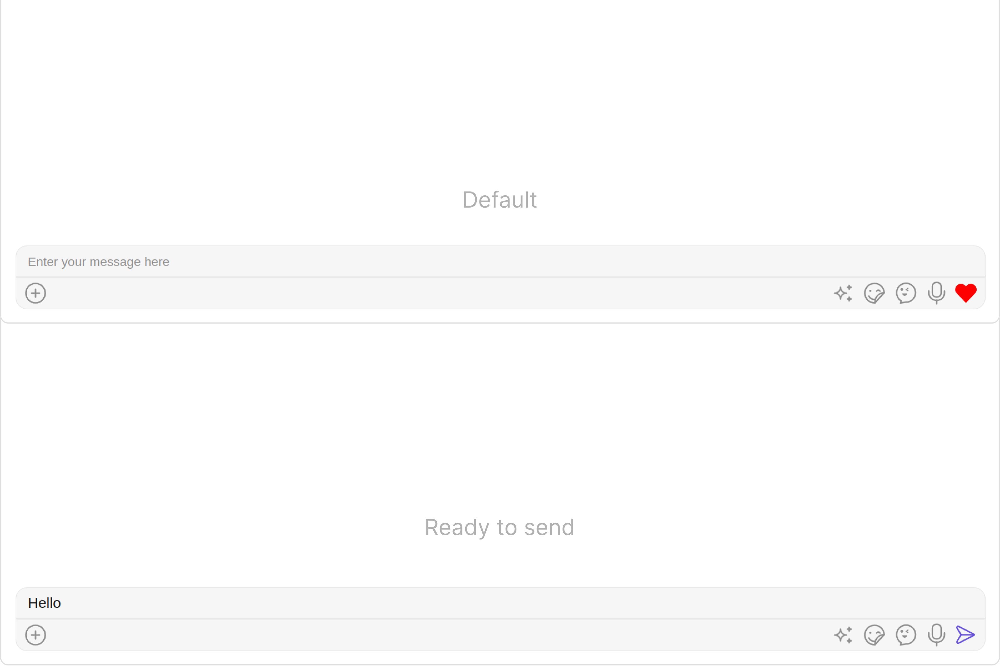
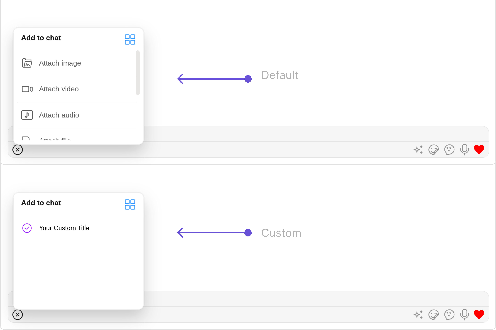
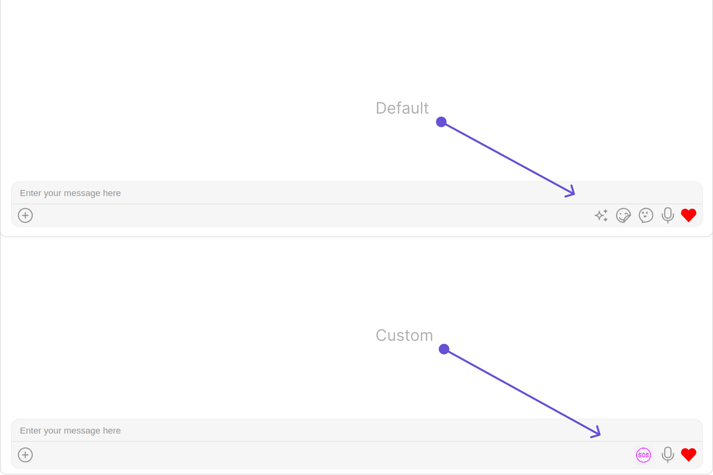
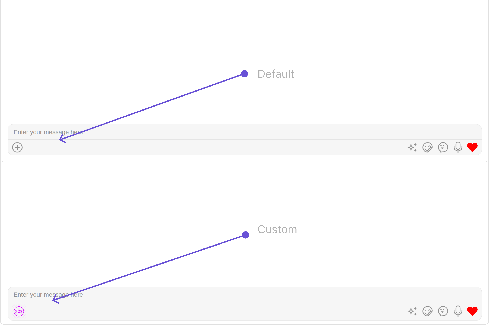
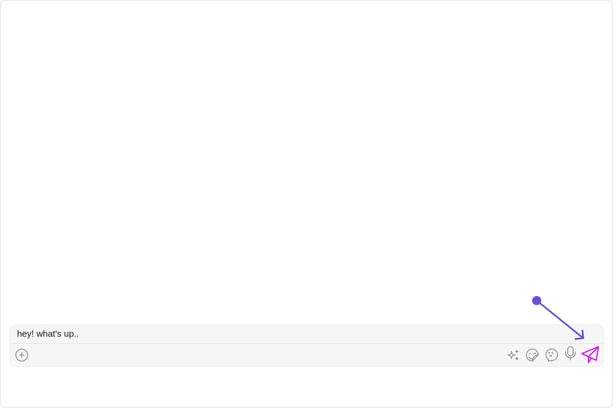
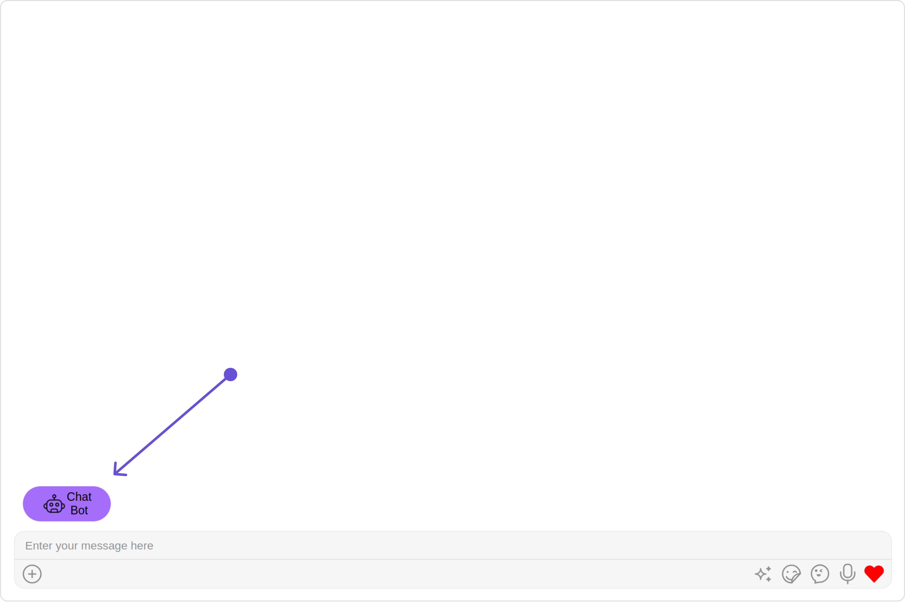
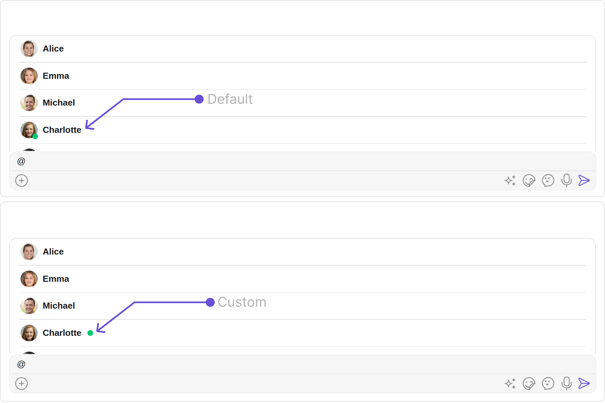

import Tabs from '@theme/Tabs';
import TabItem from '@theme/TabItem';


## Overview

MessageComposer is a [Component](/ui-kit/angular/components-overview#components) that enables users to write and send a variety of messages, including text, image, video, and custom messages.

Features such as **Live Reaction**, **Attachments**, and **Message Editing** are also supported by it.





MessageComposer is comprised of the following [Base Components](/ui-kit/angular/components-overview#base-components):

| Base Components                 | Description                                                                                                            |
| ------------------------------- | ---------------------------------------------------------------------------------------------------------------------- |
| [MessageInput](./message-input) | This provides a basic layout for the contents of this component, such as the TextField and buttons                     |
| [ActionSheet](./action-sheet)   | The ActionSheet component presents a list of options in either a list or grid mode, depending on the user's preference |

## Usage

### Integration

The following code snippet illustrates how you can directly incorporate the MessageComposer component into your app.


<Tabs>
<TabItem value="js" label="app.module.ts">

```javascript
import { CUSTOM_ELEMENTS_SCHEMA, NgModule } from '@angular/core';
import { BrowserModule } from '@angular/platform-browser';
import { CometChatMessageComposer } from '@cometchat/chat-uikit-angular';
import { AppComponent } from './app.component';

@NgModule({
  imports: [
    BrowserModule,
    CometChatMessageComposer
  ],
  declarations: [AppComponent],
  providers: [],
  bootstrap: [AppComponent],
  schemas: [CUSTOM_ELEMENTS_SCHEMA]
})
export class AppModule { }
```

</TabItem>
<TabItem value="app.component.ts" label="app.component.ts">

```javascript
import { CometChat } from '@cometchat/chat-sdk-javascript';
import { Component, OnInit } from '@angular/core';
import {  CometChatThemeService, CometChatUIKit } from '@cometchat/chat-uikit-angular';
import "@cometchat/uikit-elements";

@Component({
  selector: 'app-root',
  templateUrl: './app.component.html',
  styleUrls: ['./app.component.css']
})
export class AppComponent implements OnInit{
  ngOnInit(): void {
    CometChat.getUser("uid").then((user:CometChat.User)=>{
      this.userObject=user;
    });
  }

  public userObject!: CometChat.User;

  constructor(private themeService:CometChatThemeService) {
    themeService.theme.palette.setMode("light")
    themeService.theme.palette.setPrimary({ light: "#6851D6", dark: "#6851D6" })
  }

  onLogin(UID?: any) {
    CometChatUIKit.login({ uid: UID }).then(
      (user) => {
        setTimeout(() => {
          window.location.reload();
        }, 1000);
      },
      (error) => {
        console.log("Login failed with exception:", { error });
      }
    );
  }
}
```
</TabItem>
<TabItem value="ts" label="app.component.html">

```html
<div class="fullwidth">
<cometchat-message-composer
*ngIf="userObject"
[user]="userObject"
></cometchat-message-composer>
</div>
```

</TabItem>
</Tabs>


### Actions

[Actions](/ui-kit/angular/components-overview#actions) dictate how a component functions. They are divided into two types: Predefined and User-defined. You can override either type, allowing you to tailor the behavior of the component to fit your specific needs.


##### 1. OnSendButtonClick

The `OnSendButtonClick` event gets activated when the send message button is clicked. It has a predefined function of sending messages entered in the composer `EditText`. However, you can overide this action with the following code snippet.


<Tabs>
<TabItem value="app.component.ts" label="app.component.ts">

```javascript
import { CometChat } from '@cometchat/chat-sdk-javascript';
import { Component, OnInit } from '@angular/core';
import {  CometChatThemeService, CometChatUIKit } from '@cometchat/chat-uikit-angular';
import "@cometchat/uikit-elements";

@Component({
  selector: 'app-root',
  templateUrl: './app.component.html',
  styleUrls: ['./app.component.css']
})
export class AppComponent implements OnInit{

  ngOnInit(): void {
    CometChat.getUser("uid").then((user:CometChat.User)=>{
      this.userObject=user;
    });
  }

  public userObject!: CometChat.User;

  constructor(private themeService:CometChatThemeService) {
    themeService.theme.palette.setMode("light")
    themeService.theme.palette.setPrimary({ light: "#6851D6", dark: "#6851D6" })
  }

  public handleOnSendButtonClick = (message: CometChat.BaseMessage) =>{
    console.log("Your Custom send button click actions", message);
  };

  onLogin(UID?: any) {
    CometChatUIKit.login({ uid: UID }).then(
      (user) => {
        setTimeout(() => {
          window.location.reload();
        }, 1000);
      },
      (error) => {
        console.log("Login failed with exception:", { error });
      }
    );
  }
}
```
</TabItem>
<TabItem value="ts" label="app.component.html">

```html
<div class="fullwidth">

<cometchat-message-composer
*ngIf="userObject"
[user]="userObject"
[onSendButtonClick]="handleOnSendButtonClick"
></cometchat-message-composer>

</div>
```
</TabItem>
</Tabs>


##### 2. onError

This action doesn't change the behavior of the component but rather listens for any errors that occur in the MessageList component.


<Tabs>
<TabItem value="app.component.ts" label="app.component.ts">

```javascript
import { CometChat } from '@cometchat/chat-sdk-javascript';
import { Component, OnInit } from '@angular/core';
import {  CometChatThemeService, CometChatUIKit } from '@cometchat/chat-uikit-angular';
import "@cometchat/uikit-elements";

@Component({
  selector: 'app-root',
  templateUrl: './app.component.html',
  styleUrls: ['./app.component.css']
})
export class AppComponent implements OnInit{

  ngOnInit(): void {
    CometChat.getUser("uid").then((user:CometChat.User)=>{
      this.userObject=user;
    });
  }

  public userObject!: CometChat.User;

  constructor(private themeService:CometChatThemeService) {
    themeService.theme.palette.setMode("light")
    themeService.theme.palette.setPrimary({ light: "#6851D6", dark: "#6851D6" })
  }

  public handleOnError = (error: CometChat.CometChatException) => {
    console.log("your custom on error action", error);
  };

  onLogin(UID?: any) {
    CometChatUIKit.login({ uid: UID }).then(
      (user) => {
        setTimeout(() => {
          window.location.reload();
        }, 1000);
      },
      (error) => {
        console.log("Login failed with exception:", { error });
      }
    );
  }
}
```
</TabItem>
<TabItem value="ts" label="app.component.html">

```html
<div class="fullwidth">

<cometchat-message-composer
*ngIf="userObject"
[user]="userObject"
[onError]="handleOnError"
></cometchat-message-composer>

</div>
```
</TabItem>
</Tabs>


---

### Filters

MessageComposer component does not have any available filters.

---

### Events

[Events](/ui-kit/angular/components-overview#events) are emitted by a `Component`. By using event you can extend existing functionality. Being global events, they can be applied in Multiple Locations and are capable of being Added or Removed.

The list of events emitted by the Messages component is as follows.

| Event                | Description                                                                                                                       |
| -------------------- | --------------------------------------------------------------------------------------------------------------------------------- |
| **ccMessageEdited**  | Triggers whenever a loggedIn user edits any message from the list of messages .it will have three states such as: inProgress, success and error |
| **ccMessageSent**    | Triggers whenever a loggedIn user sends any message, it will have three states such as: inProgress, success and error|
| **ccLiveReaction**   | Triggers whenever a loggedIn clicks on live reaction|


Adding `CometChatMessageEvents` Listener's


<Tabs>
<TabItem value="TypeScript" label="TypeScript">

```TypeScript
import {CometChatMessageEvents} from "@cometchat/chat-uikit-angular";

this.ccMessageEdited = CometChatMessageEvents.ccMessageEdited.subscribe(
 () => {
        // Your Code
  }   
);

this.ccMessageSent = CometChatMessageEvents.ccMessageSent.subscribe(
  () => {
        // Your Code
  }        
);

this.ccLiveReaction = CometChatMessageEvents.ccLiveReaction.subscribe(
  () => {
        // Your Code
  }      
);
```

</TabItem>
</Tabs>

---

Removing `CometChatMessageEvents` Listener's

<Tabs>
<TabItem value="TypeScript" label="TypeScript">

```TypeScript
this.ccMessageEdited.unsubscribe();
this.ccMessageSent.unsubscribe();
```

</TabItem>
</Tabs> 


---


## Customization

To fit your app's design requirements, you can customize the appearance of the MessageComposer component. We provide exposed methods that allow you to modify the experience and behavior according to your specific needs.

### Style

Using Style you can customize the look and feel of the component in your app, These parameters typically control elements such as the color, size, shape, and fonts used within the component.

##### 1. MessageComposer Style

To modify the styling, you can apply the MessageComposerStyle to the MessageComposer Component using the `messageComposerStyle` property.


<Tabs>
<TabItem value="app.component.ts" label="app.component.ts">

```javascript
import { CometChat } from '@cometchat/chat-sdk-javascript';
import { Component, OnInit } from '@angular/core';
import {  CometChatThemeService, CometChatUIKit } from '@cometchat/chat-uikit-angular';
import { MessageComposerStyle } from '@cometchat/uikit-shared';
import "@cometchat/uikit-elements";

@Component({
  selector: 'app-root',
  templateUrl: './app.component.html',
  styleUrls: ['./app.component.css']
})
export class AppComponent implements OnInit{

  ngOnInit(): void {
    CometChat.getUser("uid").then((user:CometChat.User)=>{
      this.userObject=user;
    });
  }

  public userObject!: CometChat.User;

  constructor(private themeService:CometChatThemeService) {
    themeService.theme.palette.setMode("light")
    themeService.theme.palette.setPrimary({ light: "#6851D6", dark: "#6851D6" })
  }

  messageComposerStyle = new MessageComposerStyle({
    AIIconTint:"#ec03fc",
    attachIcontint:"#ec03fc",
    background:"#fffcff",
    border:"2px solid #b30fff",
    borderRadius:"20px",
    inputBackground:"#e2d5e8",
    textColor:"#ff299b",
    sendIconTint:"#ff0088",  
  });
  onLogin(UID?: any) {
    CometChatUIKit.login({ uid: UID }).then(
      (user) => {
        setTimeout(() => {
          window.location.reload();
        }, 1000);
      },
      (error) => {
        console.log("Login failed with exception:", { error });
      }
    );
  }
}
```
</TabItem>
<TabItem value="ts" label="app.component.html">

```html
<div class="fullwidth">

<cometchat-message-composer
*ngIf="userObject"
[user]="userObject"
[messageComposerStyle]="messageComposerStyle"
></cometchat-message-composer>

</div>
```
</TabItem>
</Tabs>


The following properties are exposed by MessageComposerStyle:

| Property                       | Description     | Code      |
| ------------------------------ | ---------------------------------------------------------- | ------------------------------------------- |
| **border**                         | Used to set border                      | `border?: string,`       |
| **borderRadius**                   | Used to set border radius               | `borderRadius?: string;` |
| **background**                     | Used to set background colour           | `background?: string;`   |
| **height**                         | Used to set height                      | `height?: string;`       |
| **width**                          | Used to set width                       | `width?: string;`        |
| **inputBackground**                | Used to set input background color      | `inputBackground?: string;` |
| **inputBorder**                    | used to set input border                | `inputBorder?: string;` |
| **inputBorderRadius**              | used to set input border radius         | `inputBorderRadius?: string;` |
| **textFont**                       | Used to set input text font             | `textFont?: string;` |
| **textColor**                      | used to set input text color            | `textColor?: string;`|
| **placeHolderTextColor**           | Used to set placeholder text color      | `placeHolderTextColor?: string;`|
| **placeHolderTextFont**            | Used to set placeholder text font       | `placeHolderTextFont?: string;`|
| **attachIcontint**                 | Used to set attachment icon tint        | `attachIcontint?: string;`     |
| **sendIconTint**                   | Used to set send button icon tint       | `sendIconTint?: string;`       |
| **dividerTint**                    | Used to set separator color             | `dividerTint?: string;`          |
| **voiceRecordingIconTint**         | used to set voice recording icon color  | `voiceRecordingIconTint?: string;` |
| **emojiIconTint**                  | used to set emoji icon color            | `emojiIconTint?: string;` |
| **AIIconTint**                     | used to set AI icon color               | `AIIconTint?: string;` |
| **emojiKeyboardTextFont**          | used to set emoji keyboard text font    | `emojiKeyboardTextFont?: string;` |
| **previewTitleFont**               | used to set preview title font          | `previewTitleFont?: string;` |
| **previewTitleColor**              | used to set preview title color         | `previewTitleColor?: string;` |
| **previewSubtitleFont**            | used to set preview subtitle font       | `previewSubtitleFont?: string;` |
| **previewSubtitleColor**           | used to set preview subtitle color      | `previewSubtitleColor?: string;` |
| **closePreviewTint**               | used to set close preview color         | `closePreviewTint?: string;` |
| **maxInputHeight**                 | used to set max input height            | `maxInputHeight?: string;` |


##### 2. MediaRecorder Style

To customize the styles of the MediaRecorder component within the MessageComposer Component, use the `mediaRecorderStyle` property. For more details, please refer to [MediaRecorder](/ui-kit/angular/media-recorder) styles.


<Tabs>
<TabItem value="app.component.ts" label="app.component.ts">

```javascript
import { CometChat } from '@cometchat/chat-sdk-javascript';
import { Component, OnInit } from '@angular/core';
import {  CometChatThemeService, CometChatUIKit, MediaRecorderStyle } from '@cometchat/chat-uikit-angular';
import "@cometchat/uikit-elements";

@Component({
  selector: 'app-root',
  templateUrl: './app.component.html',
  styleUrls: ['./app.component.css']
})
export class AppComponent implements OnInit{

  ngOnInit(): void {
    CometChat.getUser("uid").then((user:CometChat.User)=>{
      this.userObject=user;
    });
  }

  public userObject!: CometChat.User;

  constructor(private themeService:CometChatThemeService) {
    themeService.theme.palette.setMode("light")
    themeService.theme.palette.setPrimary({ light: "#6851D6", dark: "#6851D6" })
  }

  mediaRecorderStyle = new MediaRecorderStyle({
    background:"#f2f5fa",
    border:"2px solid #be0be6",
    closeIconTint:"#830be6",
    submitIconTint:"#c2a3ff",
    startIconTint:"#a313f0"
  });
  onLogin(UID?: any) {
    CometChatUIKit.login({ uid: UID }).then(
      (user) => {
        setTimeout(() => {
          window.location.reload();
        }, 1000);
      },
      (error) => {
        console.log("Login failed with exception:", { error });
      }
    );
  }
}
```
</TabItem>
<TabItem value="ts" label="app.component.html">

```html
<div class="fullwidth">

<cometchat-message-composer
*ngIf="userObject"
[user]="userObject"
[mediaRecorderStyle]="mediaRecorderStyle"
></cometchat-message-composer>

</div>
```
</TabItem>
</Tabs>


##### 3. MentionsWarning Style

To customize the styles of the MentionsWarning within the MessageComposer Component, use the `mentionsWarningStyle` property. 


<Tabs>
<TabItem value="app.component.ts" label="app.component.ts">

```javascript
import { CometChat } from '@cometchat/chat-sdk-javascript';
import { Component, OnInit } from '@angular/core';
import {  CometChatThemeService, CometChatUIKit } from '@cometchat/chat-uikit-angular';
import "@cometchat/uikit-elements";

@Component({
  selector: 'app-root',
  templateUrl: './app.component.html',
  styleUrls: ['./app.component.css']
})
export class AppComponent implements OnInit{

  ngOnInit(): void {
    CometChat.getUser("uid").then((user:CometChat.User)=>{
      this.userObject=user;
    });
  }

  public userObject!: CometChat.User;

  constructor(private themeService:CometChatThemeService) {
    themeService.theme.palette.setMode("light")
    themeService.theme.palette.setPrimary({ light: "#6851D6", dark: "#6851D6" })
  }

  mentionsWarningStyle: any = ({
    backgroundColor:'red',
    height:'50px',
    width:'200px'
  });
  onLogin(UID?: any) {
    CometChatUIKit.login({ uid: UID }).then(
      (user) => {
        setTimeout(() => {
          window.location.reload();
        }, 1000);
      },
      (error) => {
        console.log("Login failed with exception:", { error });
      }
    );
  }
}
```
</TabItem>
<TabItem value="ts" label="app.component.html">

```html
<div class="fullwidth">

<cometchat-message-composer
*ngIf="userObject"
[user]="userObject"
[mentionsWarningStyle]="mentionsWarningStyle"
></cometchat-message-composer>

</div>
```
</TabItem>
</Tabs>


---

### Functionality

These are a set of small functional customizations that allow you to fine-tune the overall experience of the component. With these, you can change text, set custom icons, and toggle the visibility of UI elements.


<Tabs>
<TabItem value="app.component.ts" label="app.component.ts">

```javascript
import { CometChat } from '@cometchat/chat-sdk-javascript';
import { Component, OnInit } from '@angular/core';
import { CometChatThemeService, CometChatUIKit } from '@cometchat/chat-uikit-angular';
import "@cometchat/uikit-elements";

@Component({
  selector: 'app-root',
  templateUrl: './app.component.html',
  styleUrls: ['./app.component.css']
})
export class AppComponent implements OnInit{

  ngOnInit(): void {
    CometChat.getUser("uid").then((user:CometChat.User)=>{
      this.userObject=user;
    });
  }

  public userObject!: CometChat.User;

  constructor(private themeService:CometChatThemeService) {
    themeService.theme.palette.setMode("light")
    themeService.theme.palette.setPrimary({ light: "#6851D6", dark: "#6851D6" })
  }

  onLogin(UID?: any) {
    CometChatUIKit.login({ uid: UID }).then(
      (user) => {
        setTimeout(() => {
          window.location.reload();
        }, 1000);
      },
      (error) => {
        console.log("Login failed with exception:", { error });
      }
    );
  }
}
```
</TabItem>
<TabItem value="ts" label="app.component.html">

```html
<div class="fullwidth">

<cometchat-message-composer
*ngIf="userObject"
[user]="userObject"
[hideLiveReaction]="false"
[disableTypingEvents]="true"
></cometchat-message-composer>

</div>
```
</TabItem>
</Tabs>


Below is a list of customizations along with corresponding code snippets

| Property                                                                                                 | Description                                                                                          | Code                                                      |
| -------------------------------------------------------------------------------------------------------- | ---------------------------------------------------------------------------------------------------- | --------------------------------------------------------- |
| **User** <a data-tooltip-id="my-tooltip-html-prop"> <span class="material-icons red">report</span> </a>  | Used to pass user object of which header specific details will be show   | `[user]="userObject"`             |
| **Group** <a data-tooltip-id="my-tooltip-html-prop"> <span class="material-icons red">report</span> </a> | Used to pass group object of which header specific details will be shown  | `[group]="groupObject"`           |
| **placeHolderText** | Used to set composer's placeholder text| `placeHolderText="your custom placeholder text"` |
| **mentionsWarningText** | Text to be displayed when max limit reaches for valid mentions | `[mentionsWarningText]="'Your Custom Mentions warning Text'"` |
| **disableTypingEvents**  | Used to disable/enable typing events , default false  | `[disableTypingEvents]="true"`|
| **disableSoundForMessages** | Used to toggle sound for outgoing messages | `[disableSoundForMessages]="true"`   |
| **sendButtonIconURL**| Used to set send button icon| `sendButtonIconURL="your custom isend button icon url"`|
| **text**| Used to set predefined text| `text="Your custom text"`                                   |
| **voiceRecordingStartIconURL**| Sets custom icon for voice recording start.| `voiceRecordingStartIconURL="your custom voice recording start icon"`|
| **voiceRecordingStopIconURL**|Sets custom icon for voice recording stop. | `voiceRecordingStopIconURL="your custom voice recording stop icon"`|
| **voiceRecordingCloseIconURL**| Sets custom icon for voice recording close. | `voiceRecordingCloseIconURL="your custom voice recording close icon"`|
| **voiceRecordingSubmitIconURL**| Sets custom icon for voice recording submit | `voiceRecordingSubmitIconURL="your custom voice recording submit icon"`|
| **auxiliaryButtonAlignment**| controls position of auxiliary button view , can be **left** or **right** . default **right**| `auxiliaryButtonAlignment=AuxiliaryButtonAlignment.left` |
| **attachmentIconURL**| sets the icon to show in the attachment button| `attachmentIconURL="your custom attachment icon url"`|
| **hideLiveReaction**| used to toggle visibility for live reaction component| `[hideLiveReaction]="true"`|
| **customSoundForMessage**| Used to give custom sounds to outgoing messages| `customSoundForMessage="your custom sound for messages"`|
| **LiveReactionIconURL**| used to set custom live reaction icon.| `LiveReactionIconURL="your custom live reaction icon"`|
| **AIIconURL**| used to set custom AI icon.| `AIIconURL="your custom AI icon"`|
| **emojiIconURL**| used to set custom emoji icon.| `emojiIconURL="your custom emoji icon"`|
| **hideLayoutMode**| used to hide the layout mode.| `[hideLayoutMode]="true"`|
| **hideVoiceRecording**| used to hide the voice recording option.| `[hideVoiceRecording]="true"`|
| **Disable Mentions**| Sets whether mentions in text should be disabled. Processes the text formatters If there are text formatters available and the disableMentions flag is set to true, it removes any formatters that are instances of CometChatMentionsFormatter.| `[disableMentions]="true"`|
---
 
### Advanced

For advanced-level customization, you can set custom views to the component. This lets you tailor each aspect of the component to fit your exact needs and application aesthetics. You can create and define your views, layouts, and UI elements and then incorporate those into the component.

---

#### AttachmentOptions

By using `attachmentOptions`, you can set a list of custom `MessageComposerActions` for the MessageComposer Component. This will override the existing list of `MessageComposerActions`.

**Example**


<Tabs>
<TabItem value="app.component.ts" label="app.component.ts">

```javascript
import { CometChat } from '@cometchat/chat-sdk-javascript';
import { Component, OnInit } from '@angular/core';
import { CometChatThemeService, CometChatUIKit, ComposerId } from '@cometchat/chat-uikit-angular';
import { CometChatMessageComposerAction } from '@cometchat/uikit-resources';

import "@cometchat/uikit-elements";

@Component({
  selector: 'app-root',
  templateUrl: './app.component.html',
  styleUrls: ['./app.component.css']
})
export class AppComponent implements OnInit{

  ngOnInit(): void {
    CometChat.getUser("uid").then((user:CometChat.User)=>{
      this.userObject=user;
    });
  }

  public userObject!: CometChat.User;

  constructor(private themeService:CometChatThemeService) {
    themeService.theme.palette.setMode("light")
    themeService.theme.palette.setPrimary({ light: "#6851D6", dark: "#6851D6" })
  }
  getAttachmentOptions = (item: CometChat.User | CometChat.Group, composerId: ComposerId)=>{
    const CustomAttachment = [
      new CometChatMessageComposerAction({
          id: 'your custom id',
          iconURL: 'icon',
          background: 'blue',
          title: 'Your Custom Title',
          iconTint: '#9000ff'
      })
    ];
    if(item instanceof CometChat.User) {
      //push user specific custom attachment options
    } else if(item instanceof CometChat.Group) {
      //push group specific custom attachment options
    }
    return CustomAttachment;
  };

  onLogin(UID?: any) {
    CometChatUIKit.login({ uid: UID }).then(
      (user) => {
        setTimeout(() => {
          window.location.reload();
        }, 1000);
      },
      (error) => {
        console.log("Login failed with exception:", { error });
      }
    );
  }
}
```
</TabItem>
<TabItem value="ts" label="app.component.html">

```html
<div class="fullwidth">

<cometchat-message-composer
*ngIf="userObject"
[user]="userObject"
[attachmentOptions]="getAttachmentOptions"
></cometchat-message-composer>

</div>
```
</TabItem>
</Tabs>


---

#### AuxiliaryButtonView

You can insert a custom view into the MessageComposer component to add additional functionality using the following method.


Please note that the MessageComposer Component utilizes the AuxiliaryButton to provide sticker functionality. Overriding the AuxiliaryButton will subsequently replace the sticker functionality.

In this example, we'll be adding a custom SOS button. 

**Example**



<Tabs>
<TabItem value="app.component.ts" label="app.component.ts">

```javascript
import { CometChat } from '@cometchat/chat-sdk-javascript';
import { Component, OnInit } from '@angular/core';
import { CometChatThemeService, CometChatUIKit, IconStyle } from '@cometchat/chat-uikit-angular';
import "@cometchat/uikit-elements";

@Component({
  selector: 'app-root',
  templateUrl: './app.component.html',
  styleUrls: ['./app.component.css']
})
export class AppComponent implements OnInit{

  ngOnInit(): void {
    CometChat.getUser("uid").then((user:CometChat.User)=>{
      this.userObject=user;
    });
  }

  public userObject!: CometChat.User;

  constructor(private themeService:CometChatThemeService) {
    themeService.theme.palette.setMode("light")
    themeService.theme.palette.setPrimary({ light: "#6851D6", dark: "#6851D6" })
  }

  name = 'Your Custom name';
  auxiliaryButtonURL = 'Your custom url';
  getIconStyle = new IconStyle({
    iconTint:"#d400ff",
  });

  onLogin(UID?: any) {
    CometChatUIKit.login({ uid: UID }).then(
      (user) => {
        setTimeout(() => {
          window.location.reload();
        }, 1000);
      },
      (error) => {
        console.log("Login failed with exception:", { error });
      }
    );
  }
}
```
</TabItem>
<TabItem value="ts" label="app.component.html">

```html
<div class="fullwidth">

<cometchat-message-composer
*ngIf="userObject"
[user]="userObject"
[auxilaryButtonView]="auxilaryButtonViewTemplate"
></cometchat-message-composer>

</div>

<ng-template #auxilaryButtonViewTemplate>
  <cometchat-icon
  [name]="name"
  [URL]="auxiliaryButtonURL"
  [iconStyle]="getIconStyle"
  ></cometchat-icon>
</ng-template>
```
</TabItem>
</Tabs>

---

#### SecondaryButtonView

You can add a custom view into the SecondaryButton component for additional functionality using the below method.

In this example, we'll be adding a custom SOS button. 

**Example**



<Tabs>
<TabItem value="app.component.ts" label="app.component.ts">

```javascript
import { CometChat } from '@cometchat/chat-sdk-javascript';
import { Component, OnInit } from '@angular/core';
import { CometChatThemeService, CometChatUIKit, IconStyle } from '@cometchat/chat-uikit-angular';
import "@cometchat/uikit-elements";

@Component({
  selector: 'app-root',
  templateUrl: './app.component.html',
  styleUrls: ['./app.component.css']
})
export class AppComponent implements OnInit{

  ngOnInit(): void {
    CometChat.getUser("uid").then((user:CometChat.User)=>{
      this.userObject=user;
    });
  }

  public userObject!: CometChat.User;

  constructor(private themeService:CometChatThemeService) {
    themeService.theme.palette.setMode("light")
    themeService.theme.palette.setPrimary({ light: "#6851D6", dark: "#6851D6" })
  }

  name = 'Your Custom name';
  secondaryButtonURL = 'Your custom url';
  getIconStyle = new IconStyle({
    iconTint:"#d400ff",
  });

  onLogin(UID?: any) {
    CometChatUIKit.login({ uid: UID }).then(
      (user) => {
        setTimeout(() => {
          window.location.reload();
        }, 1000);
      },
      (error) => {
        console.log("Login failed with exception:", { error });
      }
    );
  }
}
```
</TabItem>
<TabItem value="ts" label="app.component.html">

```html
<div class="fullwidth">

<cometchat-message-composer
*ngIf="userObject"
[user]="userObject"
[secondaryButtonView]="secondaryButtonViewTemplate"
></cometchat-message-composer>

</div>

<ng-template #secondaryButtonViewTemplate>
  <cometchat-icon
  [name]="name"
  [URL]="secondaryButtonURL"
  [iconStyle]="getIconStyle"
  ></cometchat-icon>
</ng-template>
```
</TabItem>
</Tabs>


---

#### SendButtonView

You can set a custom view in place of the already existing send button view. Using the following method.


**Example**



<Tabs>
<TabItem value="app.component.ts" label="app.component.ts">

```javascript
import { CometChat } from '@cometchat/chat-sdk-javascript';
import { Component, OnInit } from '@angular/core';
import { CometChatThemeService, CometChatUIKit, IconStyle } from '@cometchat/chat-uikit-angular';
import "@cometchat/uikit-elements";

@Component({
  selector: 'app-root',
  templateUrl: './app.component.html',
  styleUrls: ['./app.component.css']
})
export class AppComponent implements OnInit{

  ngOnInit(): void {
    CometChat.getUser("uid").then((user:CometChat.User)=>{
      this.userObject=user;
    });
  }

  public userObject!: CometChat.User;

  constructor(private themeService:CometChatThemeService) {
    themeService.theme.palette.setMode("light")
    themeService.theme.palette.setPrimary({ light: "#6851D6", dark: "#6851D6" })
  }

  name = 'Your Custom name';
  customURL = 'Your custom url';
  getIconStyle = new IconStyle({
    iconTint:"#d400ff",
  });

  onLogin(UID?: any) {
    CometChatUIKit.login({ uid: UID }).then(
      (user) => {
        setTimeout(() => {
          window.location.reload();
        }, 1000);
      },
      (error) => {
        console.log("Login failed with exception:", { error });
      }
    );
  }
}
```
</TabItem>
<TabItem value="ts" label="app.component.html">

```html
<div class="fullwidth">

<cometchat-message-composer
*ngIf="userObject"
[user]="userObject"
[sendButtonView]="sendButtonViewTemplate"
></cometchat-message-composer>

</div>

<ng-template #sendButtonViewTemplate>
  <cometchat-icon
  [name] = "name"
  [URL]="customURL"
  [iconStyle]="getIconStyle"
  ></cometchat-icon>
</ng-template>
```
</TabItem>
</Tabs>


---

#### HeaderView

You can set custom headerView to the MessageComposer component using the following method

In the following example, we're going to apply a mock chat bot button to the MessageComposer Component using the `headerView` property.


**Example**



<Tabs>
<TabItem value="app.component.ts" label="app.component.ts">

```javascript
import { CometChat } from '@cometchat/chat-sdk-javascript';
import { Component, OnInit } from '@angular/core';
import { CometChatThemeService, CometChatUIKit } from '@cometchat/chat-uikit-angular';
import "@cometchat/uikit-elements";

@Component({
  selector: 'app-root',
  templateUrl: './app.component.html',
  styleUrls: ['./app.component.css']
})
export class AppComponent implements OnInit{

  ngOnInit(): void {
    CometChat.getUser("uid").then((user:CometChat.User)=>{
      this.userObject=user;
    });
  }

  public userObject!: CometChat.User;

  constructor(private themeService:CometChatThemeService) {
    themeService.theme.palette.setMode("light")
    themeService.theme.palette.setPrimary({ light: "#6851D6", dark: "#6851D6" })
  }
  myCustomIcon = 'Your custom url';


  onLogin(UID?: any) {
    CometChatUIKit.login({ uid: UID }).then(
      (user) => {
        setTimeout(() => {
          window.location.reload();
        }, 1000);
      },
      (error) => {
        console.log("Login failed with exception:", { error });
      }
    );
  }
}
```
</TabItem>
<TabItem value="ts" label="app.component.html">

```html
<div class="fullwidth">

<cometchat-message-composer
*ngIf="userObject"
[user]="userObject"
[headerView]="headerView"
></cometchat-message-composer>

</div>

<ng-template #headerView>
  <div [ngStyle]="{ height: '40px', width: '100px', background: '#a46efa', borderRadius: '20px', display: 'flex', justifyContent: 'center', alignItems: 'center', margin: '10px' }">
    <button [ngStyle]="{ height: '40px', width: '40px', background: '#a46efa', border: 'none', display: 'flex', justifyContent: 'center', alignItems: 'center', cursor: 'pointer' }">
      
      <span>Chat Bot</span>
    </button>
</div>
</ng-template>

```
</TabItem>
</Tabs>


---


#### TextFormatters 
Assigns the list of text formatters. If the provided list is not null, it sets the list. Otherwise, it assigns the default text formatters retrieved from the data source. To configure the existing Mentions look and feel check out [CometChatMentionsFormatter](/ui-kit/angular/mentions-formatter-guide).

**Example**


<Tabs>
<TabItem value="ShortCutFormatter" label="ShortCutFormatter.ts">

```javascript
import { CometChatTextFormatter } from "@cometchat/uikit-shared";
import { Subject } from 'rxjs';
import { CometChat } from "@cometchat/chat-sdk-javascript";

export class ShortcutFormatter extends CometChatTextFormatter {
    private shortcuts: { [key: string]: string } = {};
    private dialogIsOpen: boolean = false;
    private currentShortcut: string | null = null;
    private openDialogSubject = new Subject<{ closeDialog?: boolean, buttonText?: string, shortcut?: string, handleButtonClick?:any }>();
    openDialog$ = this.openDialogSubject.asObservable();

    constructor() {
        super();
        this.setTrackingCharacter('!');
        CometChat.callExtension('message-shortcuts', 'GET', 'v1/fetch', undefined)
            .then((data: any) => {
                if (data && data.shortcuts) {
                    this.shortcuts = data.shortcuts;
                }
            })
            .catch(error => console.log("error fetching shortcuts", error));
    }

    override onKeyDown(event: KeyboardEvent) {
        const caretPosition = this.currentCaretPosition instanceof Selection
            ? this.currentCaretPosition.anchorOffset
            : 0;
        const textBeforeCaret = this.getTextBeforeCaret(caretPosition);

        const match = textBeforeCaret.match(/!([a-zA-Z]+)$/);
        if (match) {
            const shortcut = match[0];
            const replacement = this.shortcuts[shortcut];
            if (replacement) {
                if (this.dialogIsOpen && this.currentShortcut !== shortcut) {
                    this.closeDialog();
                }
                this.openDialog(replacement, shortcut);
            }
        }
    }

    getCaretPosition() {
        if (!this.currentCaretPosition?.rangeCount) return { x: 0, y: 0 };
        const range = this.currentCaretPosition?.getRangeAt(0);
        const rect = range.getBoundingClientRect();
        return {
            x: rect.left,
            y: rect.top
        };
    }

    openDialog(buttonText: string, shortcut: string) {
        this.openDialogSubject.next({ buttonText, shortcut , handleButtonClick: this.handleButtonClick});
        this.dialogIsOpen = true;
        this.currentShortcut = shortcut;
    }

    closeDialog() {
        this.openDialogSubject.next({closeDialog: true});
    }

    handleButtonClick = (buttonText: string) => {
        console.log(buttonText);
        
        if (this.currentCaretPosition && this.currentRange) {
            const shortcut = Object.keys(this.shortcuts).find(key => this.shortcuts[key] === buttonText);
            if (shortcut) {
                const replacement = this.shortcuts[shortcut];
                this.addAtCaretPosition(replacement, this.currentCaretPosition, this.currentRange);
            }
        }
        if (this.dialogIsOpen) {
            this.closeDialog();
        }
    };

    override getFormattedText(text: string): string {
        return text;
    }

    private getTextBeforeCaret(caretPosition: number): string {
        if (this.currentRange && this.currentRange.startContainer && typeof this.currentRange.startContainer.textContent === "string") {
            const textContent = this.currentRange.startContainer.textContent;
            if (textContent.length >= caretPosition) {
                return textContent.substring(0, caretPosition);
            }
        }
        return "";
    }
}

export default ShortcutFormatter;
```
</TabItem>
<TabItem value="app.component.ts" label="app.component.ts">

```javascript
import { CometChat } from '@cometchat/chat-sdk-javascript';
import { Component, OnInit } from '@angular/core';
import { CometChatThemeService, CometChatUIKit } from '@cometchat/chat-uikit-angular';
import "@cometchat/uikit-elements";
import { ShortcutFormatter } from '../ShortCutFormatter';
import { Subscription } from 'rxjs';

@Component({
  selector: 'app-root',
  templateUrl: './app.component.html',
  styleUrls: ['./app.component.css']
})
export class AppComponent implements OnInit{

    dialogIsOpen: boolean = false;
    currentDialogButtonText: string = '';
    private dialogSubscription!: Subscription;
    onClick : any;

  ngOnInit(): void {
    CometChat.getUser("uid").then((user:CometChat.User)=>{
      this.userObject=user;
    });
  }

  public userObject!: CometChat.User;

  constructor(private themeService:CometChatThemeService) {
    themeService.theme.palette.setMode("light")
    themeService.theme.palette.setPrimary({ light: "#6851D6", dark: "#6851D6" })

    this.dialogSubscription = this.shortcutFormatter.openDialog$.subscribe(
      ({ closeDialog, buttonText, shortcut, handleButtonClick }) =>  {
        if(closeDialog) {
          this.closeDialog();
          return;
        }
        this.onOpenDialog(buttonText!, shortcut!, handleButtonClick!)
      }
    );
  }
  ngOnDestroy() {
  this.dialogSubscription.unsubscribe();
  }
  onOpenDialog(buttonText: string, shortcut: string, handleButtonClick: any) {
    this.currentDialogButtonText = buttonText;
    this.dialogIsOpen = true;
    this.onClick= handleButtonClick;
  }
  closeDialog() {
    this.dialogIsOpen = false;
    this.currentDialogButtonText = '';
  }


  onLogin(UID?: any) {
    CometChatUIKit.login({ uid: UID }).then(
      (user) => {
        setTimeout(() => {
          window.location.reload();
        }, 1000);
      },
      (error) => {
        console.log("Login failed with exception:", { error });
      }
    );
  }
}
```
</TabItem>
<TabItem value="ts" label="app.component.html">

```html
<div class="fullwidth">

<cometchat-message-composer
*ngIf="userObject"
[user]="userObject"
[textFormatters]="[shortcutFormatter]"
></cometchat-message-composer>

</div>

<div *ngIf="dialogIsOpen" [ngStyle]="{ position: 'absolute', top: '150px', left: '50%', transform: 'translateX(-50%)', width: '600px' }">
  <button (click)="onClick(currentDialogButtonText)" [ngStyle]="{ width: '100%', height: '100%', cursor: 'pointer', backgroundColor: '#f2e6ff', border: '2px solid #9b42f5', borderRadius: '12px', textAlign: 'left', font: '600 15px sans-serif, Inter' }">
    {{ currentDialogButtonText }}
  </button>
</div>

```
</TabItem>
</Tabs>


---


## Configuration

[Configurations](/ui-kit/angular/components-overview#configurations) offer the ability to customize the properties of each component within a Composite Component.


### UserMemberWrapper

From the MessageComposer, you can navigate to the [UserMemberWrapper](/ui-kit/angular/user-member-wrapper) component as shown in the image.


If you wish to modify the properties of the [UserMemberWrapper](/ui-kit/angular/user-member-wrapper) Component, you can use the `UserMemberWrapperConfiguration` object.


<Tabs>
<TabItem value="app.component.ts" label="app.component.ts">

```javascript
import { CometChat } from '@cometchat/chat-sdk-javascript';
import { Component, OnInit } from '@angular/core';
import { CometChatThemeService, CometChatUIKit } from '@cometchat/chat-uikit-angular';
import { UserMemberWrapperConfiguration } from '@cometchat/uikit-shared';
import { UserPresencePlacement } from '@cometchat/uikit-resources';
import "@cometchat/uikit-elements";

@Component({
  selector: 'app-root',
  templateUrl: './app.component.html',
  styleUrls: ['./app.component.css']
})
export class AppComponent implements OnInit{

  ngOnInit(): void {
    CometChat.getUser("uid").then((user:CometChat.User)=>{
      this.userObject=user;
    });
  }

  public userObject!: CometChat.User;

  constructor(private themeService:CometChatThemeService) {
    themeService.theme.palette.setMode("light")
    themeService.theme.palette.setPrimary({ light: "#6851D6", dark: "#6851D6" })
  }
  public userMemberWrapperConfiguration= new UserMemberWrapperConfiguration({
    userPresencePlacement: UserPresencePlacement.right,
    //properties of UserMemberWrapper
  });


  onLogin(UID?: any) {
    CometChatUIKit.login({ uid: UID }).then(
      (user) => {
        setTimeout(() => {
          window.location.reload();
        }, 1000);
      },
      (error) => {
        console.log("Login failed with exception:", { error });
      }
    );
  }
}
```
</TabItem>
<TabItem value="ts" label="app.component.html">

```html
<div class="fullwidth">

<cometchat-message-composer
*ngIf="userObject"
[user]="userObject"
[userMemberWrapperConfiguration]="userMemberWrapperConfiguration"
></cometchat-message-composer>

</div>

```
</TabItem>
</Tabs>


The `UserMemberWrapperConfiguration` indeed provides access to all the [Action](/ui-kit/angular/user-member-wrapper#actions), [Filters](/ui-kit/angular/message-information#filters), [Styles](/ui-kit/angular/user-member-wrapper#style), [Functionality](/ui-kit/angular/user-member-wrapper#functionality), and [Advanced](/ui-kit/angular/user-member-wrapper#advanced) properties of the [UserMemberWrapper](/ui-kit/angular/user-member-wrapper) component.

Please note that the properties marked with the <a><span class="material-icons red">report</span></a> symbol are not accessible within the Configuration Object.


**Example**





In the above example, we are styling a few properties of the [UserMemberWrapper](/ui-kit/angular/user-member-wrapper) component using `UserMemberWrapperConfiguration`.


---
import { Tooltip } from 'react-tooltip'
import 'react-tooltip/dist/react-tooltip.css'

<Tooltip
  id="my-tooltip-html-prop"
  html="Not available in MessageComposerConfiguration"
/>

