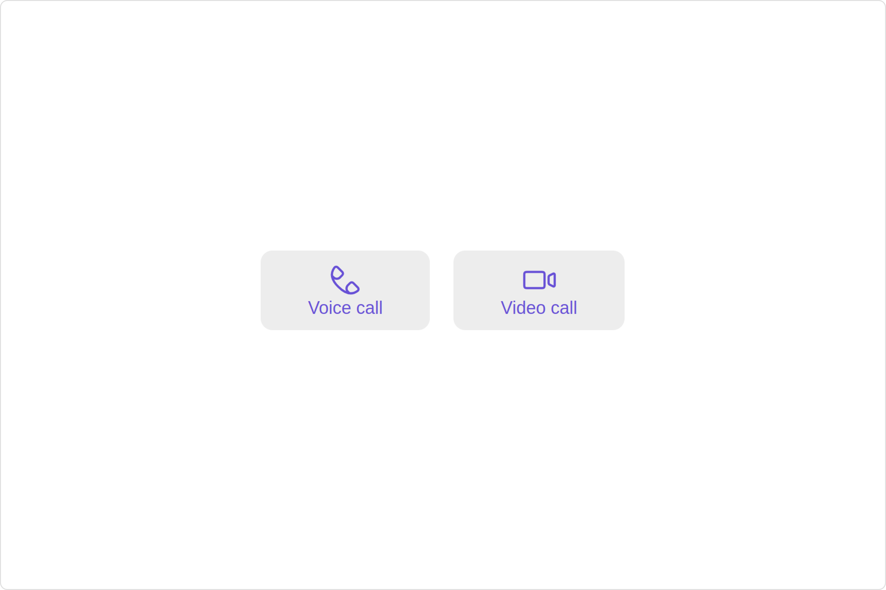
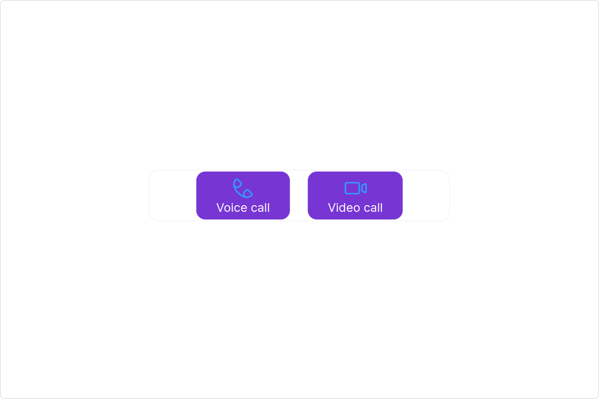
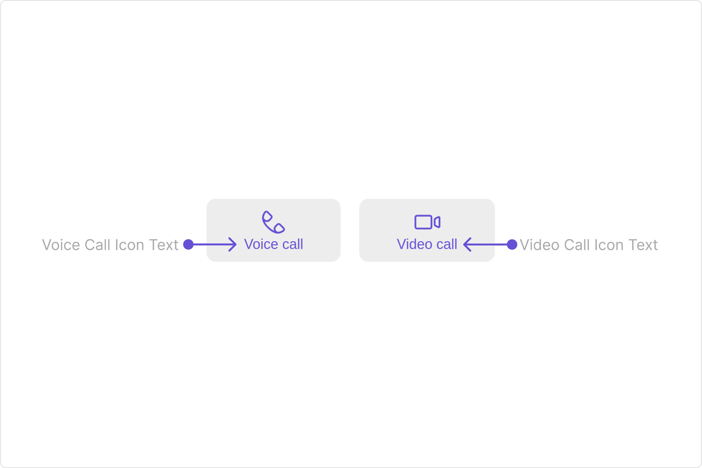
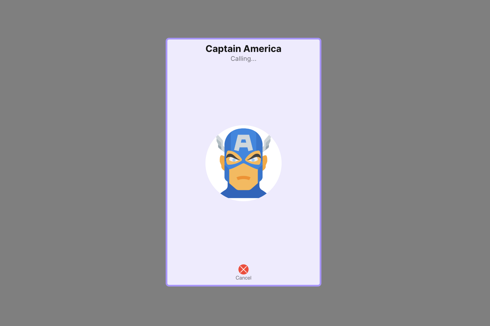

import Tabs from '@theme/Tabs';
import TabItem from '@theme/TabItem';

## Overview

The `Call Button` is a [Component](/ui-kit/angular/components-overview#components) provides users with the ability to make calls, access call-related functionalities, and control call settings. Clicking this button typically triggers the call to be placed to the desired recipient.



## Usage

### Integration

<Tabs>
<TabItem value="js" label="app.module.ts">

```javascript
import { CUSTOM_ELEMENTS_SCHEMA, NgModule } from "@angular/core";
import { BrowserModule } from "@angular/platform-browser";
import { CometChatCallButtons } from "@cometchat/chat-uikit-angular";
import { AppComponent } from "./app.component";

@NgModule({
  imports: [BrowserModule, CometChatCallButtons],
  declarations: [AppComponent],
  providers: [],
  bootstrap: [AppComponent],
  schemas: [CUSTOM_ELEMENTS_SCHEMA],
})
export class AppModule {}
```

</TabItem>
<TabItem value="app.component.ts" label="app.component.ts">

```javascript
import { CometChat } from '@cometchat/chat-sdk-javascript';
import { Component, OnInit } from '@angular/core';
import {  CometChatThemeService, CometChatUIKit } from '@cometchat/chat-uikit-angular';
import "@cometchat/uikit-elements";

@Component({
  selector: 'app-root',
  templateUrl: './app.component.html',
  styleUrls: ['./app.component.css']
})
export class AppComponent {

  constructor(private themeService:CometChatThemeService) {
    themeService.theme.palette.setMode("light")
    themeService.theme.palette.setPrimary({ light: "#6851D6", dark: "#6851D6" })
  }
  public userObject!: CometChat.User;
  ngOnInit(): void {
    CometChat.getUser("uid").then((user: CometChat.User) => {
      this.userObject = user;
    });
  }
  onLogin(UID?: any) {
    CometChatUIKit.login({ uid: UID }).then(
      (user) => {
        setTimeout(() => {
          window.location.reload();
        }, 1000);
      },
      (error) => {
        console.log("Login failed with exception:", { error });
      }
    );
  }
}
```

</TabItem>
<TabItem value="ts" label="app.component.html">

```html
<div class="fullwidth">
  <cometchat-call-buttons
    *ngIf="userObject"
    [user]="userObject"
  ></cometchat-call-buttons>
</div>
```

</TabItem>
</Tabs>

### Actions

[Actions](/ui-kit/angular/components-overview#actions) dictate how a component functions. They are divided into two types: Predefined and User-defined. You can override either type, allowing you to tailor the behavior of the component to fit your specific needs.

##### 1. onVoiceCallClick

`onVoiceCallClick` is triggered when you click the voice call button of the `Call Buttons` component. You can override this action using the following code snippet.

<Tabs>
<TabItem value="app.component.ts" label="app.component.ts">

```javascript
import { CometChat } from '@cometchat/chat-sdk-javascript';
import { Component, OnInit } from '@angular/core';
import {  CometChatThemeService, CometChatUIKit } from '@cometchat/chat-uikit-angular';
import "@cometchat/uikit-elements";

@Component({
  selector: 'app-root',
  templateUrl: './app.component.html',
  styleUrls: ['./app.component.css']
})
export class AppComponent {

  constructor(private themeService:CometChatThemeService) {
    themeService.theme.palette.setMode("light")
    themeService.theme.palette.setPrimary({ light: "#6851D6", dark: "#6851D6" })
  }
  public userObject!: CometChat.User;
  ngOnInit(): void {
    CometChat.getUser("uid").then((user: CometChat.User) => {
      this.userObject = user;
    });
  }
  public handleOnVoiceCallClick = (user: CometChat.User, group: CometChat.Group) => {
    console.log("your custom on voice call click actions");
  };
  onLogin(UID?: any) {
    CometChatUIKit.login({ uid: UID }).then(
      (user) => {
        setTimeout(() => {
          window.location.reload();
        }, 1000);
      },
      (error) => {
        console.log("Login failed with exception:", { error });
      }
    );
  }
}
```

</TabItem>
<TabItem value="ts" label="app.component.html">

```html
<div class="fullwidth">
  <cometchat-call-buttons
    *ngIf="userObject"
    [user]="userObject"
    [onVoiceCallClick]="handleOnVoiceCallClick"
  ></cometchat-call-buttons>
</div>
```

</TabItem>
</Tabs>

##### 2. onVideoCallClick

`onVideoCallClick` is triggered when you click the video call button of the `Call Buttons` component. You can override this action using the following code snippet.

<Tabs>
<TabItem value="app.component.ts" label="app.component.ts">

```javascript
import { CometChat } from '@cometchat/chat-sdk-javascript';
import { Component, OnInit } from '@angular/core';
import {  CometChatThemeService, CometChatUIKit } from '@cometchat/chat-uikit-angular';
import "@cometchat/uikit-elements";

@Component({
  selector: 'app-root',
  templateUrl: './app.component.html',
  styleUrls: ['./app.component.css']
})
export class AppComponent {

  constructor(private themeService:CometChatThemeService) {
    themeService.theme.palette.setMode("light")
    themeService.theme.palette.setPrimary({ light: "#6851D6", dark: "#6851D6" })
  }
  public userObject!: CometChat.User;
  ngOnInit(): void {
    CometChat.getUser("uid").then((user: CometChat.User) => {
      this.userObject = user;
    });
  }
  public handleOnVideoCallClick = (user: CometChat.User, group: CometChat.Group) => {
    console.log("your custom on video call click actions");
  };
  onLogin(UID?: any) {
    CometChatUIKit.login({ uid: UID }).then(
      (user) => {
        setTimeout(() => {
          window.location.reload();
        }, 1000);
      },
      (error) => {
        console.log("Login failed with exception:", { error });
      }
    );
  }
}
```

</TabItem>
<TabItem value="ts" label="app.component.html">

```html
<div class="fullwidth">
  <cometchat-call-buttons
    *ngIf="userObject"
    [user]="userObject"
    [onVideoCallClick]="handleOnVideoCallClick"
  ></cometchat-call-buttons>
</div>
```

</TabItem>
</Tabs>

##### 3. onError

This action doesn't change the behavior of the component but rather listens for any errors that occur in the Call Button component.

<Tabs>
<TabItem value="app.component.ts" label="app.component.ts">

```javascript
import { CometChat } from '@cometchat/chat-sdk-javascript';
import { Component, OnInit } from '@angular/core';
import {  CometChatThemeService, CometChatUIKit } from '@cometchat/chat-uikit-angular';
import "@cometchat/uikit-elements";

@Component({
  selector: 'app-root',
  templateUrl: './app.component.html',
  styleUrls: ['./app.component.css']
})
export class AppComponent {

  constructor(private themeService:CometChatThemeService) {
    themeService.theme.palette.setMode("light")
    themeService.theme.palette.setPrimary({ light: "#6851D6", dark: "#6851D6" })
  }
  public userObject!: CometChat.User;
  ngOnInit(): void {
    CometChat.getUser("uid").then((user: CometChat.User) => {
      this.userObject = user;
    });
  }
  public handleOnError = (error: CometChat.CometChatException) => {
    console.log("your custom on error action", error);
  };
  onLogin(UID?: any) {
    CometChatUIKit.login({ uid: UID }).then(
      (user) => {
        setTimeout(() => {
          window.location.reload();
        }, 1000);
      },
      (error) => {
        console.log("Login failed with exception:", { error });
      }
    );
  }
}
```

</TabItem>
<TabItem value="ts" label="app.component.html">

```html
<div class="fullwidth">
  <cometchat-call-buttons
    *ngIf="userObject"
    [user]="userObject"
    [onError]="handleOnError"
  ></cometchat-call-buttons>
</div>
```

</TabItem>
</Tabs>

---

### Filters

**Filters** allow you to customize the data displayed in a list within a `Component`. You can filter the list based on your specific criteria, allowing for a more customized. Filters can be applied using `RequestBuilders` of Chat SDK.

The `Call Buttons` component does not have any exposed filters.

---

### Events

[Events](/ui-kit/angular/components-overview#events) are emitted by a `Component`. By using event you can extend existing functionality. Being global events, they can be applied in Multiple Locations and are capable of being Added or Removed.

The list of events emitted by the `Call Buttons` component is as follows.

| Event              | Description                                                                                               |
| ------------------ | --------------------------------------------------------------------------------------------------------- |
| **ccCallRejected** | This event is triggered when the initiated call is rejected by the receiver.                              |
| **ccCallEnded**    | This event is triggered when the initiated call successfully ends.                                        |
| **ccOutgoingCall** | This event is triggered when the user initiates a voice/video call.                                       |
| **ccMessageSent**  | This event is triggered when the sent message is in transit and also when it is received by the receiver. |

---

<Tabs>
<TabItem value="TypeScript" label="TypeScript">

```TypeScript
import {CometChatCallEvents} from "@cometchat/chat-uikit-angular";

this.ccCallRejected = CometChatCallEvents.ccCallRejected.subscribe(
(call: CometChat.Call) => {
        // Your Code
  }
);

this.ccOutgoingCall = CometChatCallEvents.ccOutgoingCall.subscribe(
(call: CometChat.Call) => {
        // Your Code
  }
);

this.ccCallEnded = CometChatCallEvents.ccCallEnded.subscribe(
(call: CometChat.Call) => {
        // Your Code
  }
);

this.ccMessageSent = CometChatCallEvents.ccMessageSent.subscribe(
() => {
        // Your Code
  }
);
```

</TabItem>
</Tabs>

---

Removing `CometChatCallEvents` Listener's

<Tabs>
<TabItem value="TypeScript" label="TypeScript">

```TypeScript
this.ccCallRejected.unsubscribe();
this.ccOutgoingCall.unsubscribe();
this.ccCallEnded.unsubscribe();
this.ccMessageSent.unsubscribe();
```

</TabItem>
</Tabs>

---

## Customization

To fit your app's design requirements, you can customize the appearance of the Call Buttons component. We provide exposed methods that allow you to modify the experience and behavior according to your specific needs.

### Style

Using Style you can customize the look and feel of the component in your app, These parameters typically control elements such as the color, size, shape, and fonts used within the component.

##### 1. CallButtons Style

To customize the appearance, you can assign a `CallButtonsStyle` object to the `Call Buttons` component.



**Example**

In this example, we are employing the `callButtonsStyle`.

<Tabs>
<TabItem value="app.component.ts" label="app.component.ts">

```javascript
import { CometChat } from '@cometchat/chat-sdk-javascript';
import { Component, OnInit } from '@angular/core';
import {  CometChatThemeService, CometChatUIKit } from '@cometchat/chat-uikit-angular';
import { CallButtonsStyle } from '@cometchat/uikit-shared';
import "@cometchat/uikit-elements";

@Component({
  selector: 'app-root',
  templateUrl: './app.component.html',
  styleUrls: ['./app.component.css']
})
export class AppComponent {

  constructor(private themeService:CometChatThemeService) {
    themeService.theme.palette.setMode("light")
    themeService.theme.palette.setPrimary({ light: "#6851D6", dark: "#6851D6" })
  }
  public userObject!: CometChat.User;
  ngOnInit(): void {
    CometChat.getUser("uid").then((user: CometChat.User) => {
      this.userObject = user;
    });
  }
  callButtonsStyle = new CallButtonsStyle({
    background: "#e5c9f5",
    height: "50px",
    width: "400px",
    border: "1px solid #f8f5fa",
    buttonBackground: "#7735d4",
    buttonBorderRadius: "10px",
    videoCallIconTextColor: "#ffffff",
    voiceCallIconTextColor: "#ffffff",
    buttonPadding: "20px",
  });
  onLogin(UID?: any) {
    CometChatUIKit.login({ uid: UID }).then(
      (user) => {
        setTimeout(() => {
          window.location.reload();
        }, 1000);
      },
      (error) => {
        console.log("Login failed with exception:", { error });
      }
    );
  }
}
```

</TabItem>
<TabItem value="ts" label="app.component.html">

```html
<div class="fullwidth">
  <cometchat-call-buttons
    *ngIf="userObject"
    [user]="userObject"
    [callButtonsStyle]="callButtonsStyle"
  ></cometchat-call-buttons>
</div>
```

</TabItem>
</Tabs>

---

The following properties are exposed by `CallButtonsStyle`:

| Property                   | Description                            | Code                               |
| -------------------------- | -------------------------------------- | ---------------------------------- |
| **border**                 | Used to set border                     | `border?: string,`                 |
| **borderRadius**           | Used to set border radius              | `borderRadius?: string;`           |
| **background**             | Used to set background colour          | `background?: string;`             |
| **height**                 | Used to set height                     | `height?: string;`                 |
| **width**                  | Used to set width                      | `width?: string;`                  |
| **voiceCallIconTint**      | Used to set voice call icon tint       | `voiceCallIconTint?: string,`      |
| **videoCallIconTint**      | Used to set video call icon tint       | `videoCallIconTint?: string;`      |
| **voiceCallIconTextFont**  | Used to set voice call icon text font  | `voiceCallIconTextFont?: string;`  |
| **videoCallIconTextFont**  | Used to set video call icon text font  | `videoCallIconTextFont?: string;`  |
| **voiceCallIconTextColor** | Used to set voice call icon text color | `voiceCallIconTextColor?: string;` |
| **videoCallIconTextColor** | Used to set video call icon text color | `videoCallIconTextColor?: string;` |
| **buttonBackground**       | Used to set button background color    | `buttonBackground?: string;`       |
| **buttonBorder**           | Used to set button border              | `buttonBorder?: string;`           |
| **buttonBorderRadius**     | Used to set button border radius       | `buttonBorderRadius?: string;`     |
| **buttonPadding**          | Used to set button padding             | `buttonPadding?: string;`          |

---

### Functionality

These are a set of small functional customizations that allow you to fine-tune the overall experience of the component. With these, you can change text, set custom icons, and toggle the visibility of UI elements.

Here is a code snippet demonstrating how you can customize the functionality of the `Call Buttons` component.

<Tabs>
<TabItem value="app.component.ts" label="app.component.ts">

```javascript
import { CometChat } from '@cometchat/chat-sdk-javascript';
import { Component, OnInit } from '@angular/core';
import {  CometChatThemeService, CometChatUIKit } from '@cometchat/chat-uikit-angular';
import "@cometchat/uikit-elements";

@Component({
  selector: 'app-root',
  templateUrl: './app.component.html',
  styleUrls: ['./app.component.css']
})
export class AppComponent {

  constructor(private themeService:CometChatThemeService) {
    themeService.theme.palette.setMode("light")
    themeService.theme.palette.setPrimary({ light: "#6851D6", dark: "#6851D6" })
  }
  public userObject!: CometChat.User;
  ngOnInit(): void {
    CometChat.getUser("uid").then((user: CometChat.User) => {
      this.userObject = user;
    });
  }
  onLogin(UID?: any) {
    CometChatUIKit.login({ uid: UID }).then(
      (user) => {
        setTimeout(() => {
          window.location.reload();
        }, 1000);
      },
      (error) => {
        console.log("Login failed with exception:", { error });
      }
    );
  }
}
```

</TabItem>
<TabItem value="ts" label="app.component.html">

```html
<div class="fullwidth">
  <cometchat-call-buttons
    *ngIf="userObject"
    [user]="userObject"
    [videoCallIconHoverText]="'Your Custom Video Call Icon Hover Text'"
    [videoCallIconText]="'Your Custom Video Call Icon Text'"
  ></cometchat-call-buttons>
</div>
```

</TabItem>
</Tabs>

Default:



Custom:


Below is a list of customizations along with corresponding code snippets

| Property                   | Description                                                                              | Code                                                                  |
| -------------------------- | ---------------------------------------------------------------------------------------- | --------------------------------------------------------------------- |
| **videoCallIconHoverText** | Used to set the custom text or tooltip displayed on the video call button on mouse over. | `[videoCallIconHoverText]="'Your Custom Video Call Icon Hover Text'"` |
| **voiceCallIconHoverText** | Used to set the custom text or tooltip displayed on the voice call button on mouse over. | `[voiceCallIconHoverText]="'Your Custom Voice Call Icon Hover text'"` |
| **videoCallIconText**      | Used to set custom video call icon text                                                  | `[videoCallIconText]="'Your Custom Video Call Icon Text'"`            |
| **voiceCallIconText**      | Used to set custom voice call icon text                                                  | `[voiceCallIconText]="'Your Custom Voice Call Icon Text'"`            |
| **videoCallIconURL**       | Used to set custom Icon for Video Call Button                                            | `[videoCallIconURL]="videoCallIconURL"`                               |
| **voiceCallIconURL**       | Used to set custom Icon for Voice Call Button                                            | `[videoCallIconURL]="videoCallIconURL"`                               |
| **group**                  | Used to set the group object for Call Buttons                                            | `[group]="groupObject"`                                               |
| **user**                   | Sets the user object for Call Buttons                                                    | `[user]="userObject"`                                                 |

---

### Advanced

For advanced-level customization, you can set custom views to the component. This lets you tailor each aspect of the component to fit your exact needs and application aesthetics. You can create and define your views, layouts, and UI elements and then incorporate those into the component.

the `Call Buttons` component does not offer any advanced functionalities beyond this level of customization.


---

## Configuration

Configurations offer the ability to customize the properties of each individual component within a Composite Component.

The Call Buttons Component is a Composite Component and it has a specific set of configuration for each of its components.

### OngoingCall

If you want to customize the properties of the [OngoingCall](./ongoing-call) Component inside Call Buttons Component, you need use the `CallScreenConfiguration` object.

The `OngoingCallConfiguration` provides access to all the [Action](/ui-kit/angular/ongoing-call#actions), [Filters](/ui-kit/angular/ongoing-call#filters), [Styles](/ui-kit/angular/ongoing-call#style), [Functionality](/ui-kit/angular/ongoing-call#functionality), and [Advanced](/ui-kit/angular/ongoing-call#advanced) properties of the [OngoingCall](/ui-kit/angular/ongoing-call) component.

> Please note that the properties marked with the <a><span class="material-icons red">report</span></a> symbol are not accessible within the Configuration Object.

**Example**


In this example, we will show how you can display the call recording button in the [OngoingCall](/ui-kit/angular/ongoing-call) component using `ongoingCallConfiguration`.

<Tabs>
<TabItem value="app.component.ts" label="app.component.ts">

```javascript
import { CometChat } from '@cometchat/chat-sdk-javascript';
import { Component, OnInit } from '@angular/core';
import { CometChatThemeService, CometChatUIKit } from '@cometchat/chat-uikit-angular';
import { CallScreenConfiguration, CometChatUIKitCalls } from '@cometchat/uikit-shared';
import "@cometchat/uikit-elements";

@Component({
  selector: 'app-root',
  templateUrl: './app.component.html',
  styleUrls: ['./app.component.css']
})
export class AppComponent {

  constructor(private themeService:CometChatThemeService) {
    themeService.theme.palette.setMode("light")
    themeService.theme.palette.setPrimary({ light: "#6851D6", dark: "#6851D6" })
  }
  public userObject!: CometChat.User;
  public ongoingCallConfig!: CallScreenConfiguration;
  ngOnInit(): void {
    CometChat.getUser("uid").then((user: CometChat.User) => {
      this.userObject = user;
    });
    this.ongoingCallConfig = new CallScreenConfiguration({
      callSettingsBuilder: this.customSettingBuilder,
    });
  }
  customSettingBuilder(
    audioOnlyCall: boolean,
    user?: CometChat.User,
    group?: CometChat.Group
  ) {
  const builder = new CometChatUIKitCalls.CallSettingsBuilder();
    if (user) {
      builder
        .enableDefaultLayout(true)
        .setIsAudioOnlyCall(audioOnlyCall)
        .showRecordingButton(true);
    } else if (group) {
      builder
        .enableDefaultLayout(true)
        .setIsAudioOnlyCall(false)
        .showRecordingButton(true);
    }
    return builder;
  }
  onLogin(UID?: any) {
    CometChatUIKit.login({ uid: UID }).then(
      (user) => {
        setTimeout(() => {
          window.location.reload();
        }, 1000);
      },
      (error) => {
        console.log("Login failed with exception:", { error });
      }
    );
  }
}
```

</TabItem>
<TabItem value="ts" label="app.component.html">

```html
<div class="fullwidth">
  <cometchat-call-buttons
    *ngIf="userObject"
    [user]="userObject"
    [ongoingCallConfiguration]="ongoingCallConfig"
  ></cometchat-call-buttons>
</div>
```

</TabItem>
</Tabs>


### OutGoingCall

If you want to customize the properties of the [OutGoingCall](./outgoing-call) Component inside Call Buttons Component, you need use the `OutGoingCallConfiguration` object.

The `OutGoingCallConfiguration` provides access to all the [Action](/ui-kit/angular/outgoing-call#actions), [Filters](/ui-kit/angular/outgoing-call#filters), [Styles](/ui-kit/angular/outgoing-call#style), [Functionality](/ui-kit/angular/outgoing-call#functionality), and [Advanced](/ui-kit/angular/outgoing-call#functionality) properties of the [OutGoingCall](/ui-kit/angular/outgoing-call) component.

> Please note that the properties marked with the <a><span class="material-icons red">report</span></a> symbol are not accessible within the Configuration Object.

**Example**


In this example, we will be changing the background color of [OutGoingCall](/ui-kit/angular/outgoing-call) component using `OutGoingCallConfiguration`.

<Tabs>
<TabItem value="app.component.ts" label="app.component.ts">

```javascript
import { CometChat } from '@cometchat/chat-sdk-javascript';
import { Component, OnInit } from '@angular/core';
import {  CometChatThemeService, CometChatUIKit } from '@cometchat/chat-uikit-angular';
import { OutgoingCallConfiguration, OutgoingCallStyle } from '@cometchat/uikit-shared';
import "@cometchat/uikit-elements";

@Component({
  selector: 'app-root',
  templateUrl: './app.component.html',
  styleUrls: ['./app.component.css']
})
export class AppComponent {

  constructor(private themeService:CometChatThemeService) {
    themeService.theme.palette.setMode("light")
    themeService.theme.palette.setPrimary({ light: "#6851D6", dark: "#6851D6" })
  }
  public userObject!: CometChat.User;
  public outgoingCallConfiguration!: OutgoingCallConfiguration;
  ngOnInit(): void {
    CometChat.getUser("uid").then((user: CometChat.User) => {
      this.userObject = user;
    });
    this.outgoingCallConfiguration = new OutgoingCallConfiguration({
      outgoingCallStyle: new OutgoingCallStyle({
        background: '#efebff',
        border: '4px solid #ab94ff',
      })
    })
  }
  
  onLogin(UID?: any) {
    CometChatUIKit.login({ uid: UID }).then(
      (user) => {
        setTimeout(() => {
          window.location.reload();
        }, 1000);
      },
      (error) => {
        console.log("Login failed with exception:", { error });
      }
    );
  }
}
```

</TabItem>
<TabItem value="ts" label="app.component.html">

```html
<div class="fullwidth">
  <cometchat-call-buttons
    *ngIf="userObject"
    [user]="userObject"
    [outgoingCallConfiguration]="outgoingCallConfiguration"
  ></cometchat-call-buttons>
</div>
```

</TabItem>
</Tabs>

---

import { Tooltip } from 'react-tooltip'
import 'react-tooltip/dist/react-tooltip.css'

<Tooltip
  id="my-tooltip-html-prop"
  html="Not available in CallButtonsConfiguration"
/>


---
