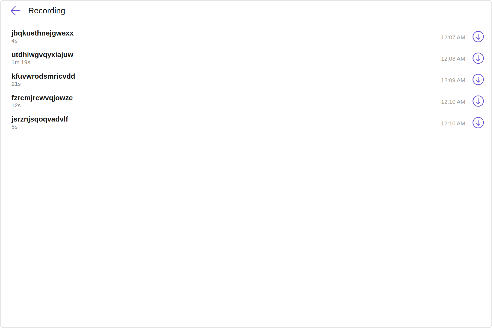
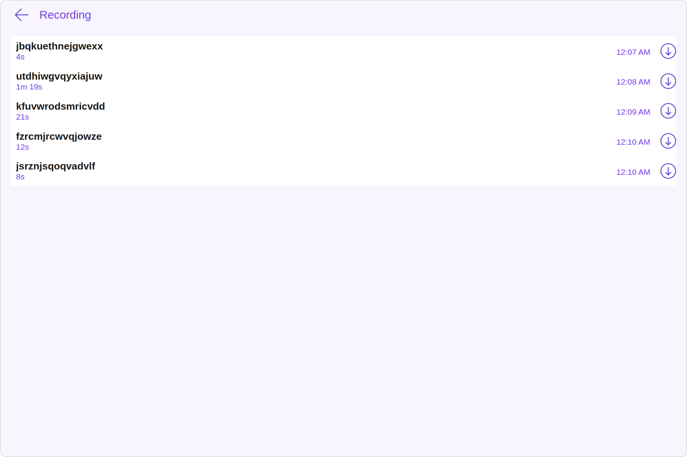
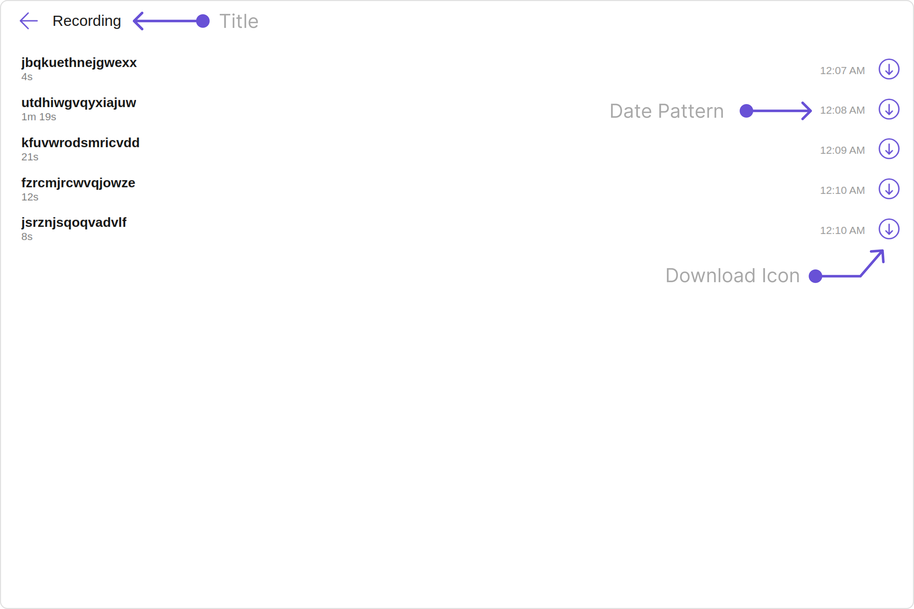
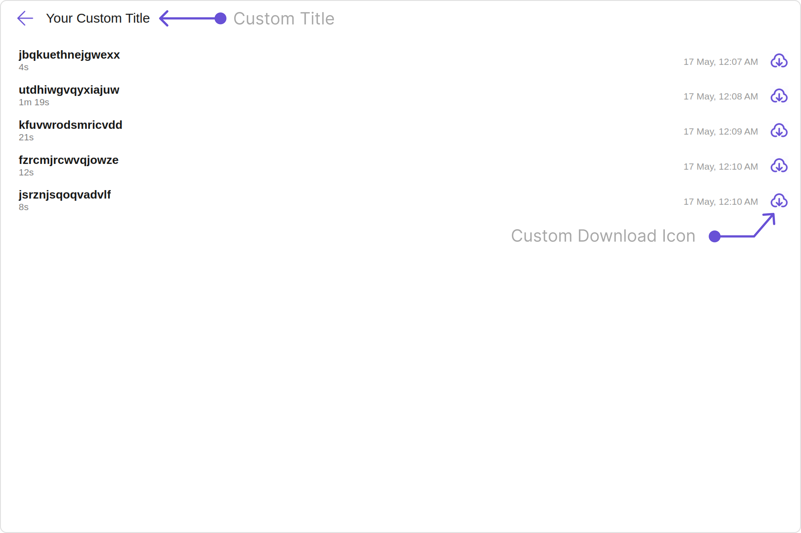
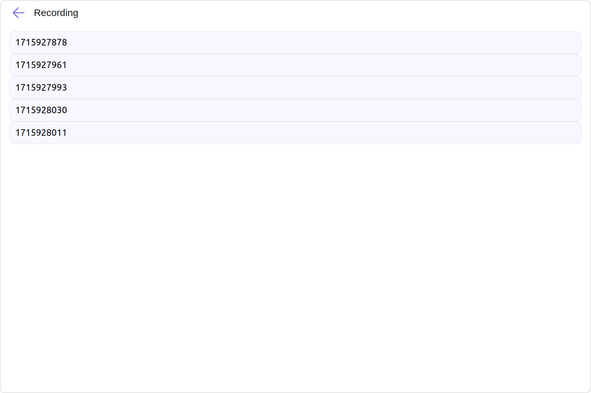
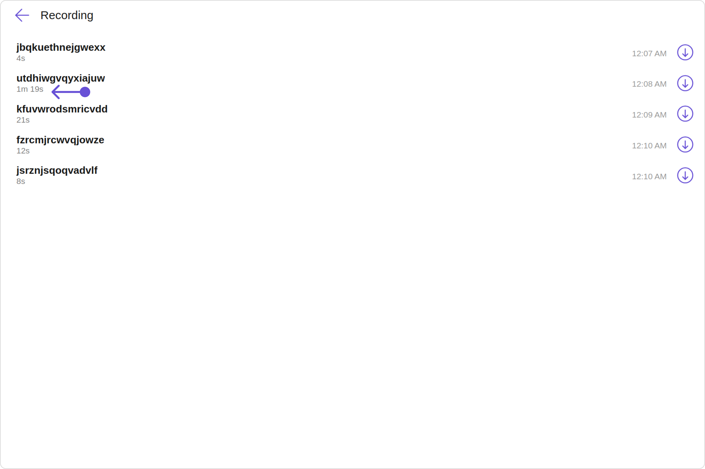
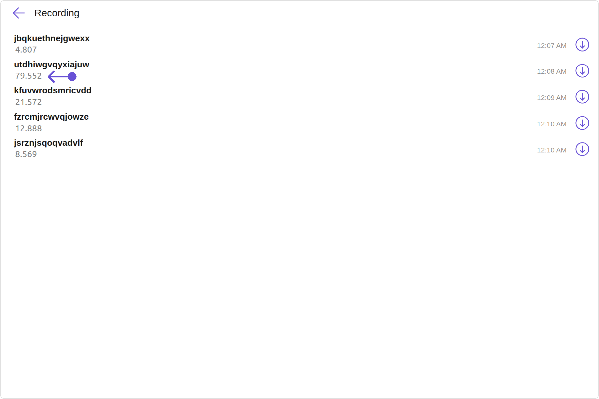

import Tabs from '@theme/Tabs';
import TabItem from '@theme/TabItem';

## Overview

The `CometChatCallLogRecordings` is a [Component](/ui-kit/angular/components-overview#components) that shows a paginated list of recordings of a particular call. This allows the user to see all the recordings along with the duration as well as a download link using which one can download the recording.



The `Call Log Recordings` is comprised of the following components:

| Components                       | Description                                                                                                                 |
| -------------------------------- | --------------------------------------------------------------------------------------------------------------------------- |
| CometChatList                    | a reusable container component having title, search box, customisable background and a List View                            |
| [CometChatListItem](./list-item) | a component that renders data obtained from a Group object on a Tile having a title, subtitle, leading and trailing view    |
| [cometchat-date](./date)         | This Component used to show the date and time. You can also customize the appearance of this widget by modifying its logic. |
| cometchat-button                 | This component represents a button with optional icon and text.                                                             |

## Usage

### Integration

<Tabs>
<TabItem value="js" label="app.module.ts">

```javascript
import { CUSTOM_ELEMENTS_SCHEMA, NgModule } from "@angular/core";
import { BrowserModule } from "@angular/platform-browser";
import { CometChatCallLogRecordings } from "@cometchat/chat-uikit-angular";
import { AppComponent } from "./app.component";

@NgModule({
  imports: [BrowserModule, CometChatCallLogRecordings],
  declarations: [AppComponent],
  providers: [],
  bootstrap: [AppComponent],
  schemas: [CUSTOM_ELEMENTS_SCHEMA],
})
export class AppModule {}
```

</TabItem>
<TabItem value="app.component.ts" label="app.component.ts">

```javascript
import { CometChat } from '@cometchat/chat-sdk-javascript';
import { Component, OnInit } from '@angular/core';
import {  CometChatThemeService, CometChatUIKit } from '@cometchat/chat-uikit-angular';
import "@cometchat/uikit-elements";

@Component({
  selector: 'app-root',
  templateUrl: './app.component.html',
  styleUrls: ['./app.component.css']
})
export class AppComponent {

  constructor(private themeService:CometChatThemeService) {
    themeService.theme.palette.setMode("light")
    themeService.theme.palette.setPrimary({ light: "#6851D6", dark: "#6851D6" })
  }

  onLogin(UID?: any) {
    CometChatUIKit.login({ uid: UID }).then(
      (user) => {
        setTimeout(() => {
          window.location.reload();
        }, 1000);
      },
      (error) => {
        console.log("Login failed with exception:", { error });
      }
    );
  }
}
```

</TabItem>
<TabItem value="ts" label="app.component.html">

```html
<div class="fullwidth">
  <cometchat-call-log-recordings></cometchat-call-log-recordings>
</div>
```

</TabItem>
</Tabs>

### Actions

[Actions](/ui-kit/angular/components-overview#actions) dictate how a component functions. They are divided into two types: Predefined and User-defined. You can override either type, allowing you to tailor the behavior of the component to fit your specific needs.

##### 1. onBackClick

`onBackClick` is triggered when you click the Back button Icon of the `Call Log Participants` component. It does not have a default behavior. However, you can override its behavior using the following code snippet.

<Tabs>
<TabItem value="app.component.ts" label="app.component.ts">

```javascript
import { CometChat } from '@cometchat/chat-sdk-javascript';
import { Component, OnInit } from '@angular/core';
import {  CometChatThemeService, CometChatUIKit } from '@cometchat/chat-uikit-angular';
import "@cometchat/uikit-elements";

@Component({
  selector: 'app-root',
  templateUrl: './app.component.html',
  styleUrls: ['./app.component.css']
})
export class AppComponent {

  constructor(private themeService:CometChatThemeService) {
    themeService.theme.palette.setMode("light")
    themeService.theme.palette.setPrimary({ light: "#6851D6", dark: "#6851D6" })
  }
  public handleOnBack = () => {
    console.log("Your custom on back action");
  }
  onLogin(UID?: any) {
    CometChatUIKit.login({ uid: UID }).then(
      (user) => {
        setTimeout(() => {
          window.location.reload();
        }, 1000);
      },
      (error) => {
        console.log("Login failed with exception:", { error });
      }
    );
  }
}
```

</TabItem>
<TabItem value="ts" label="app.component.html">

```html
<div class="fullwidth">
  <cometchat-call-log-recordings
    [onBackClick]="handleOnBack"
  ></cometchat-call-log-recordings>
</div>
```

</TabItem>
</Tabs>

##### 2. onDownloadClick

`onDownloadClick` is triggered when you click on the download of the of the `Call Log Recordings` component. you can override its behavior using the following code snippet.

<Tabs>
<TabItem value="app.component.ts" label="app.component.ts">

```javascript
import { CometChat } from '@cometchat/chat-sdk-javascript';
import { Component, OnInit } from '@angular/core';
import {  CometChatThemeService, CometChatUIKit } from '@cometchat/chat-uikit-angular';
import "@cometchat/uikit-elements";

@Component({
  selector: 'app-root',
  templateUrl: './app.component.html',
  styleUrls: ['./app.component.css']
})
export class AppComponent {

  constructor(private themeService:CometChatThemeService) {
    themeService.theme.palette.setMode("light")
    themeService.theme.palette.setPrimary({ light: "#6851D6", dark: "#6851D6" })
  }
  public handleOnDownloadClick = (item: any)=>{
    console.log("your custom on download click actions");
  }
  onLogin(UID?: any) {
    CometChatUIKit.login({ uid: UID }).then(
      (user) => {
        setTimeout(() => {
          window.location.reload();
        }, 1000);
      },
      (error) => {
        console.log("Login failed with exception:", { error });
      }
    );
  }
}
```

</TabItem>
<TabItem value="ts" label="app.component.html">

```html
<div class="fullwidth">
  <cometchat-call-log-recordings
    [onDownloadClick]="handleOnDownloadClick"
  ></cometchat-call-log-recordings>
</div>
```

</TabItem>
</Tabs>

---

### Filters

**Filters** allow you to customize the data displayed in a list within a `Component`. You can filter the list based on your specific criteria, allowing for a more customized. Filters can be applied using `RequestBuilders` of Chat SDK.

The `Call Log Recordings` component does not have any exposed filters.

---

### Events

[Events](/ui-kit/angular/components-overview#events) are emitted by a `Component`. By using event you can extend existing functionality. Being global events, they can be applied in Multiple Locations and are capable of being Added or Removed.

The `Call Log Recordings` does not produce any events.

---

## Customization

To fit your app's design requirements, you have the ability to customize the appearance of the
`CallLogRecordings` component. We provide exposed methods that allow you to modify the experience and behavior according to your specific needs.

### Style

Using **Style** you can **customize** the look and feel of the component in your app, These parameters typically control elements such as the **color**, **size**, **shape**, and **fonts** used within the component.

##### 1. CallLogRecordings Style

To customize the appearance, you can assign a `CallLogRecordingsStyle` object to the `Call Log Recordings` component.

**Example**

In this example, we are employing the `CallLogRecordingsStyle`.

<Tabs>
<TabItem value="app.component.ts" label="app.component.ts">

```javascript
import { CometChat } from '@cometchat/chat-sdk-javascript';
import { Component, OnInit } from '@angular/core';
import {  CometChatThemeService, CometChatUIKit } from '@cometchat/chat-uikit-angular';
import { CallLogRecordingsStyle } from '@cometchat/uikit-shared';
import "@cometchat/uikit-elements";

@Component({
  selector: 'app-root',
  templateUrl: './app.component.html',
  styleUrls: ['./app.component.css']
})
export class AppComponent {

  constructor(private themeService:CometChatThemeService) {
    themeService.theme.palette.setMode("light")
    themeService.theme.palette.setPrimary({ light: "#6851D6", dark: "#6851D6" })
  }
  callLogRecordingsStyle = new CallLogRecordingsStyle({
    background: "#f4f0fc",
    backIconTint: "#5f20e6",
    titleColor: "#5f20e6",
    dateTextColor: "#5f20e6",
    border: "2px solid #5f20e6",
  });
  onLogin(UID?: any) {
    CometChatUIKit.login({ uid: UID }).then(
      (user) => {
        setTimeout(() => {
          window.location.reload();
        }, 1000);
      },
      (error) => {
        console.log("Login failed with exception:", { error });
      }
    );
  }
}
```

</TabItem>
<TabItem value="ts" label="app.component.html">

```html
<div class="fullwidth">
  <cometchat-call-log-recordings
    [CallLogRecordingsStyle]="callLogRecordingsStyle"
  ></cometchat-call-log-recordings>
</div>
```

</TabItem>
</Tabs>



---

The following properties are exposed by `CallLogRecordingsStyle`:

| Property                   | Description                          | Code                               |
| -------------------------- | ------------------------------------ | ---------------------------------- |
| **border**                 | Used to set border                   | `border?: string,`                 |
| **borderRadius**           | Used to set border radius            | `borderRadius?: string;`           |
| **background**             | Used to set background colour        | `background?: string;`             |
| **height**                 | Used to set height                   | `height?: string;`                 |
| **width**                  | Used to set width                    | `width?: string;`                  |
| **titleFont**              | Used to set title font               | `titleFont?: string,`              |
| **titleColor**             | Used to set title color              | `titleColor?: string;`             |
| **backIconTint**           | Used to set back icon tint           | `backIconTint?: string;`           |
| **downloadIconTint**       | Used to set download icon tint       | `downloadIconTint?: string;`       |
| **recordingDurationFont**  | Used to set recording duration font  | `recordingDurationFont?: string;`  |
| **recordingDurationColor** | Used to set recording duration color | `recordingDurationColor?: string;` |
| **dateTextFont**           | Used to set date text font           | `dateTextFont?: string;`           |
| **dateTextColor**          | Used to set date text color          | `dateTextColor?: string;`          |

##### 2. ListItem Style

If you want to apply customized styles to the `List Item` component within the `Call Log Recordings` Component, you can use the following code snippet. For more information, you can refer [ListItem Styles](/ui-kit/angular/list-item#listitemstyle).

<Tabs>
<TabItem value="app.component.ts" label="app.component.ts">

```javascript
import { CometChat } from '@cometchat/chat-sdk-javascript';
import { Component, OnInit } from '@angular/core';
import {  CometChatThemeService, CometChatUIKit, ListItemStyle } from '@cometchat/chat-uikit-angular';
import "@cometchat/uikit-elements";

@Component({
  selector: 'app-root',
  templateUrl: './app.component.html',
  styleUrls: ['./app.component.css']
})
export class AppComponent {

  constructor(private themeService:CometChatThemeService) {
    themeService.theme.palette.setMode("light")
    themeService.theme.palette.setPrimary({ light: "#6851D6", dark: "#6851D6" })
  }
  listItemStyle: ListItemStyle = new ListItemStyle({
    background: "transparent",
    padding: "5px",
    border: "1px solid #e9b8f5",
    titleColor: "#8830f2",
    borderRadius: "20px",
    width: "100% !important"
  });
  onLogin(UID?: any) {
    CometChatUIKit.login({ uid: UID }).then(
      (user) => {
        setTimeout(() => {
          window.location.reload();
        }, 1000);
      },
      (error) => {
        console.log("Login failed with exception:", { error });
      }
    );
  }
}
```

</TabItem>
<TabItem value="ts" label="app.component.html">

```html
<div class="fullwidth">
  <cometchat-call-log-recordings
    [listItemStyle]="listItemStyle"
  ></cometchat-call-log-recordings>
</div>
```

</TabItem>
</Tabs>

---

### Functionality

These are a set of small functional customizations that allow you to fine-tune the overall experience of the component. With these, you can change text, set custom icons, and toggle the visibility of UI elements.

Here is a code snippet demonstrating how you can customize the functionality of the `Call Log Recordings` component.

<Tabs>
<TabItem value="app.component.ts" label="app.component.ts">

```javascript
import { CometChat } from '@cometchat/chat-sdk-javascript';
import { Component, OnInit } from '@angular/core';
import {  CometChatThemeService, CometChatUIKit } from '@cometchat/chat-uikit-angular';
import { DatePatterns } from '@cometchat/uikit-resources';
import "@cometchat/uikit-elements";

@Component({
  selector: 'app-root',
  templateUrl: './app.component.html',
  styleUrls: ['./app.component.css']
})
export class AppComponent {

  constructor(private themeService:CometChatThemeService) {
    themeService.theme.palette.setMode("light")
    themeService.theme.palette.setPrimary({ light: "#6851D6", dark: "#6851D6" })
  }
  public datePattern: DatePatterns = DatePatterns.DateTime;
  onLogin(UID?: any) {
    CometChatUIKit.login({ uid: UID }).then(
      (user) => {
        setTimeout(() => {
          window.location.reload();
        }, 1000);
      },
      (error) => {
        console.log("Login failed with exception:", { error });
      }
    );
  }
}
```

</TabItem>
<TabItem value="ts" label="app.component.html">

```html
<div class="fullwidth">
  <cometchat-call-log-recordings
    [title]="'Your Custom Title'"
    [datePattern]="datePattern"
    [downloadIconURL]="myCustomIcon"
  ></cometchat-call-log-recordings>
</div>
```

</TabItem>
</Tabs>

Default:



Custom:



---

Below is a list of customizations along with corresponding code snippets

| Property               | Description                                                                  | Code                                             |
| ---------------------- | ---------------------------------------------------------------------------- | ------------------------------------------------ |
| **title**              | Used to set custom title                                                     | `[title]="'Your Custom Title'"`                  |
| **backIconUrl**        | Used to set custom back icon URL                                             | `[backIconUrl]="'custom back icon url'"`         |
| **downloadIconUrl**    | Used to set custom download icon URL                                         | `[downloadIconUrl]="'custom download icon url'"` |
| **datePattern**        | Used to set custom date pattern                                              | `[datePattern]="datePattern"`                    |
| **call**               | Call data object                                                             | `call: CallLog;`                                 |
| **hideDownloadButton** | used to control the visibility of the download button in the user interface. | `[hideDownloadButton]="true"`                    |

---

### Advanced

For advanced-level customization, you can set custom views to the component. This lets you tailor each aspect of the component to fit your exact needs and application aesthetics. You can create and define your views, layouts, and UI elements and then incorporate those into the component.

---

#### ListItemView

With this property, you can assign a custom ListItem to the `Call Log Recordings` Component.

**Example**

Default:


Custom:


<Tabs>
<TabItem value="app.component.ts" label="app.component.ts">

```javascript
import { CometChat } from '@cometchat/chat-sdk-javascript';
import { Component, OnInit } from '@angular/core';
import {  CometChatThemeService, CometChatUIKit } from '@cometchat/chat-uikit-angular';
import "@cometchat/uikit-elements";

@Component({
  selector: 'app-root',
  templateUrl: './app.component.html',
  styleUrls: ['./app.component.css']
})
export class AppComponent {

  constructor(private themeService:CometChatThemeService) {
    themeService.theme.palette.setMode("light")
    themeService.theme.palette.setPrimary({ light: "#6851D6", dark: "#6851D6" })
  }
  onLogin(UID?: any) {
    CometChatUIKit.login({ uid: UID }).then(
      (user) => {
        setTimeout(() => {
          window.location.reload();
        }, 1000);
      },
      (error) => {
        console.log("Login failed with exception:", { error });
      }
    );
  }
}
```

</TabItem>
<TabItem value="ts" label="app.component.html">

```html
<div class="fullwidth">
  <cometchat-call-log-recordings
    [listItemView]="listItemView"
  ></cometchat-call-log-recordings>
</div>
<ng-template #listItemView>
  <div>your custom listitem</div>
</ng-template>
```

</TabItem>
</Tabs>

---

#### SubtitleView

You can customize the subtitle view for each call log Recordings item to meet your requirements

Default:


Custom:


<Tabs>
<TabItem value="app.component.ts" label="app.component.ts">

```javascript
import { CometChat } from '@cometchat/chat-sdk-javascript';
import { Component, OnInit } from '@angular/core';
import {  CometChatThemeService, CometChatUIKit } from '@cometchat/chat-uikit-angular';
import "@cometchat/uikit-elements";

@Component({
  selector: 'app-root',
  templateUrl: './app.component.html',
  styleUrls: ['./app.component.css']
})
export class AppComponent {

  constructor(private themeService:CometChatThemeService) {
    themeService.theme.palette.setMode("light")
    themeService.theme.palette.setPrimary({ light: "#6851D6", dark: "#6851D6" })
  }
  onLogin(UID?: any) {
    CometChatUIKit.login({ uid: UID }).then(
      (user) => {
        setTimeout(() => {
          window.location.reload();
        }, 1000);
      },
      (error) => {
        console.log("Login failed with exception:", { error });
      }
    );
  }
}
```

</TabItem>
<TabItem value="ts" label="app.component.html">

```html
<div class="fullwidth">
  <cometchat-call-log-recordings
    [subtitleView]="subtitleTemplate"
  ></cometchat-call-log-recordings>
</div>
<ng-template #subtitleTemplate>
  <div
    style="display: flex; align-items: left; padding: 10px; font-size: 10px;"
  >
    your custom subtitle view
  </div>
</ng-template>
```

</TabItem>
</Tabs>

---
