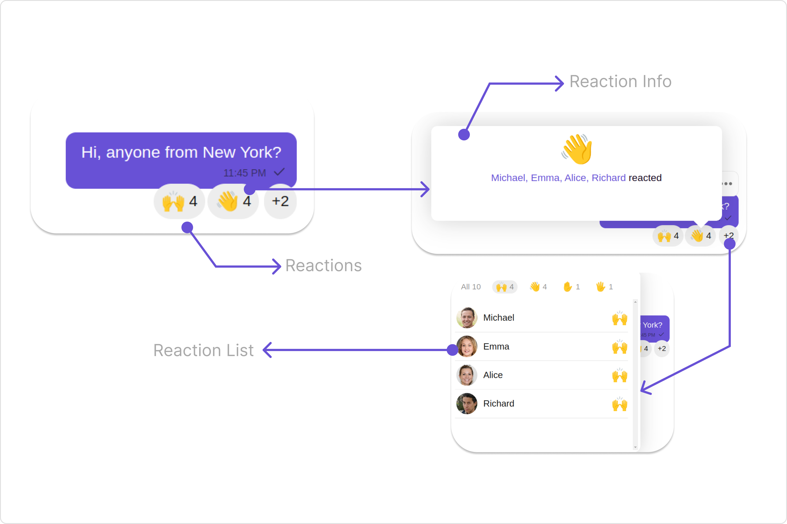
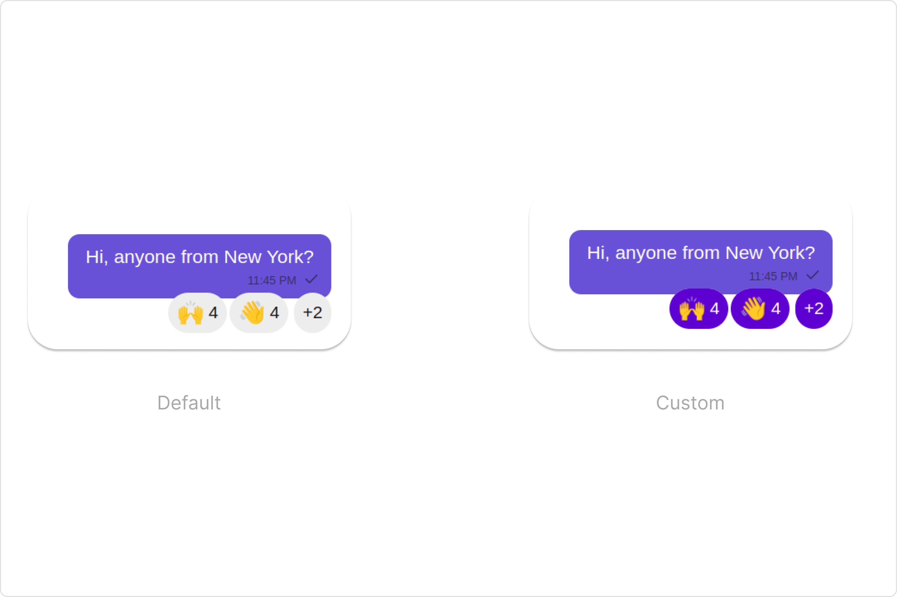
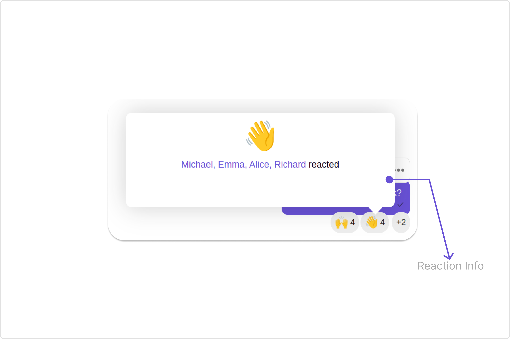
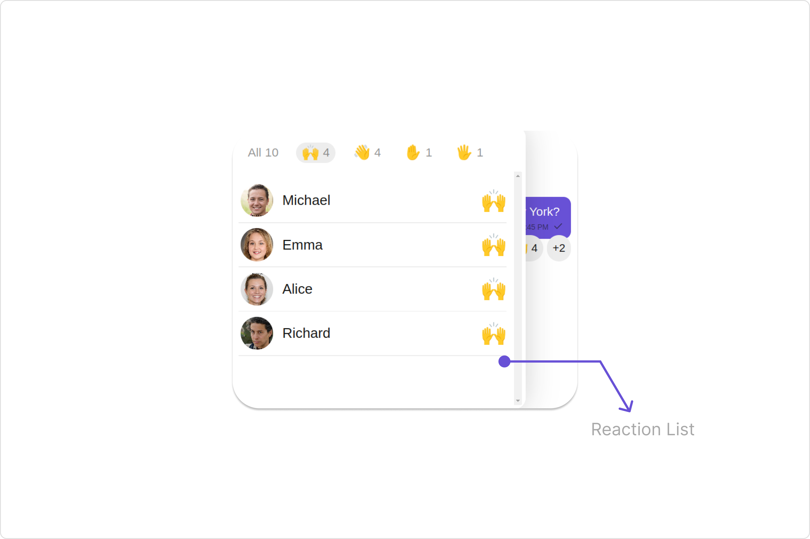

import Tabs from '@theme/Tabs';
import TabItem from '@theme/TabItem';

## Overview

The `CometChatReactions` component provides a visual representation of emoji reactions associated with a specific message. It enables users to quickly identify which emojis were used to react to the message and by whom.



## Usage

### Integration

The following code snippet illustrates how you can directly incorporate the Reactions component into your app.

<Tabs>
<TabItem value="js" label="app.module.ts">

```javascript
import { CUSTOM_ELEMENTS_SCHEMA, NgModule } from "@angular/core";
import { BrowserModule } from "@angular/platform-browser";
import { AppComponent } from "./app.component";

@NgModule({
  imports: [BrowserModule],
  declarations: [AppComponent],
  providers: [],
  bootstrap: [AppComponent],
  schemas: [CUSTOM_ELEMENTS_SCHEMA],
})
export class AppModule {}
```

</TabItem>
<TabItem value="app.component.ts" label="app.component.ts">

```javascript
import { CometChat } from '@cometchat/chat-sdk-javascript';
import { Component, OnInit } from '@angular/core';
import {  CometChatThemeService, CometChatUIKit } from '@cometchat/chat-uikit-angular';
import "@cometchat/uikit-elements";

@Component({
  selector: 'app-root',
  templateUrl: './app.component.html',
  styleUrls: ['./app.component.css']
})
export class AppComponent {

  constructor(private themeService:CometChatThemeService) {
    themeService.theme.palette.setMode("light")
    themeService.theme.palette.setPrimary({ light: "#6851D6", dark: "#6851D6" })
  }
  public messageObject!: CometChat.TextMessage;
  ngOnInit(): void {
    CometChat.getMessageDetails("messageId").then((message) => {
        this.messageObject = message;
    }).catch((error) => {
      console.error('Error fetching message details:', error);
    });
  }

  onLogin(UID?: any) {
    CometChatUIKit.login({ uid: UID }).then(
      (user) => {
        setTimeout(() => {
          window.location.reload();
        }, 1000);
      },
      (error) => {
        console.log("Login failed with exception:", { error });
      }
    );
  }
}
```

</TabItem>
<TabItem value="ts" label="app.component.html">

```html
<div class="fullwidth">
  <cometchat-reactions
    *ngIf="messageObject"
    [messageObject]="messageObject"
  ></cometchat-reactions>
</div>
```

</TabItem>
</Tabs>

---

### Actions

[Actions](/ui-kit/angular/components-overview#actions) dictate how a component functions. They are divided into two types: Predefined and User-defined. You can override either type, allowing you to tailor the behavior of the component to fit your specific needs.

##### 1. reactionClick

`reactionClick` is triggered when you click on each Reaction in the footer view of message bubble. You can override this action using the following code snippet.

**Example**

In this example, we are employing the `reactionClick` action.

<Tabs>
<TabItem value="app.component.ts" label="app.component.ts">

```javascript
import { CometChat } from '@cometchat/chat-sdk-javascript';
import { Component, OnInit } from '@angular/core';
import {  CometChatThemeService, CometChatUIKit } from '@cometchat/chat-uikit-angular';
import "@cometchat/uikit-elements";

@Component({
  selector: 'app-root',
  templateUrl: './app.component.html',
  styleUrls: ['./app.component.css']
})
export class AppComponent {

  constructor(private themeService:CometChatThemeService) {
    themeService.theme.palette.setMode("light")
    themeService.theme.palette.setPrimary({ light: "#6851D6", dark: "#6851D6" })
  }
  public messageObject!: CometChat.TextMessage;
  ngOnInit(): void {
    CometChat.getMessageDetails("c").then((message) => {
        this.messageObject = message;
    }).catch((error) => {
      console.error('Error fetching message details:', error);
    });
  }
  public handleOnReactionClick = (reaction: CometChat.ReactionCount, message: CometChat.BaseMessage): void  =>{
    console.log("your custom on reaction click actions");
  };
  onLogin(UID?: any) {
    CometChatUIKit.login({ uid: UID }).then(
      (user) => {
        setTimeout(() => {
          window.location.reload();
        }, 1000);
      },
      (error) => {
        console.log("Login failed with exception:", { error });
      }
    );
  }
}
```

</TabItem>
<TabItem value="ts" label="app.component.html">

```html
<div class="fullwidth">
  <cometchat-reactions
    *ngIf="messageObject"
    [messageObject]="messageObject"
    [reactionClick]="handleOnReactionClick"
  ></cometchat-reactions>
</div>
```

</TabItem>
</Tabs>

---

### Filters

**Filters** allow you to customize the data displayed in a list within a `Component`. You can filter the list based on your specific criteria, allowing for a more customized. Filters can be applied using `RequestBuilders` of Chat SDK.

The `Reactions` component does not have any exposed filters.

### Events

[Events](/ui-kit/angular/components-overview#events) are emitted by a `Component`. By using event you can extend existing functionality. Being global events, they can be applied in Multiple Locations and are capable of being Added or Removed.

The `Reactions` component does not produce any events.

## Customization

To fit your app's design requirements, you can customize the appearance of the Reaction component. We provide exposed methods that allow you to modify the experience and behavior according to your specific needs.

### Style

Using Style you can customize the look and feel of the component in your app, These parameters typically control elements such as the color, size, shape, and fonts used within the component.

##### 1. reactionsStyle

To customize the appearance, you can assign a `reactionsStyle` object to the `Reactions` component.

**Example**

In this example, we are employing the `reactionsStyle`.

<Tabs>
<TabItem value="app.component.ts" label="app.component.ts">

```javascript
import { CometChat } from '@cometchat/chat-sdk-javascript';
import { Component, OnInit } from '@angular/core';
import {  CometChatThemeService, CometChatUIKit } from '@cometchat/chat-uikit-angular';
import { ReactionsStyle } from '@cometchat/uikit-shared';
import "@cometchat/uikit-elements";

@Component({
  selector: 'app-root',
  templateUrl: './app.component.html',
  styleUrls: ['./app.component.css']
})
export class AppComponent {

  constructor(private themeService:CometChatThemeService) {
    themeService.theme.palette.setMode("light")
    themeService.theme.palette.setPrimary({ light: "#6851D6", dark: "#6851D6" })
  }
  public messageObject!: CometChat.TextMessage;
  ngOnInit(): void {
    CometChat.getMessageDetails("messageId").then((message) => {
        this.messageObject = message;
    }).catch((error) => {
      console.error('Error fetching message details:', error);
    });
  }
  reactionsStyle = new ReactionsStyle({
    background:'#b067f5',
    border:'2px solid #881ced',
    borderRadius:'20px',
    width:'170px',
  });
  onLogin(UID?: any) {
    CometChatUIKit.login({ uid: UID }).then(
      (user) => {
        setTimeout(() => {
          window.location.reload();
        }, 1000);
      },
      (error) => {
        console.log("Login failed with exception:", { error });
      }
    );
  }
}
```

</TabItem>
<TabItem value="ts" label="app.component.html">

```html
<div class="fullwidth">
  <cometchat-reactions
    *ngIf="messageObject"
    [messageObject]="messageObject"
    [reactionsStyle]="reactionsStyle"
  ></cometchat-reactions>
</div>
```

</TabItem>
</Tabs>



List of properties exposed by ReactionsStyle

| Property                         | Description                                 | Code                                     |
| -------------------------------- | ------------------------------------------- | ---------------------------------------- |
| **border**                       | Used to set border                          | `border?: string,`                       |
| **borderRadius**                 | Used to set border radius                   | `borderRadius?: string;`                 |
| **background**                   | Used to set background colour               | `background?: string;`                   |
| **height**                       | Used to set height                          | `height?: string;`                       |
| **width**                        | Used to set width                           | `width?: string;`                        |
| **barPadding**                   | used to set the bar padding                 | `barPadding?: string;`                   |
| **reactionBoxShadow**            | used to set the reactions box-shadow        | `reactionBoxShadow?: string;`            |
| **reactionBorderRadius**         | used to set the reactions border radius     | `reactionBorderRadius?: string;`         |
| **reactionBorder**               | used to set the reactions border            | `reactionBorder?: string;`               |
| **reactionBackground**           | used to set the reactions background        | `reactionBackground?: string;`           |
| **activeReactionBorder**         | used to set the active reactions border     | `activeReactionBorder?: string;`         |
| **activeReactionBackground**     | used to set the active reactions background | `activeReactionBackground?: string;`     |
| **reactionEmojiFont**            | used to set the reaction emoji text font    | `reactionEmojiFont?: string;`            |
| **reactionCountTextFont**        | used to set the reaction count text font    | `reactionCountTextFont?: string;`        |
| **reactionCountTextColor**       | used to set the reaction count text color   | `reactionCountTextColor?: string;`       |
| **activeReactionCountTextFont**  | used to set the active reaction text font   | `activeReactionCountTextFont?: string;`  |
| **activeReactionCountTextColor** | used to set the active reaction text color  | `activeReactionCountTextColor?: string;` |
| **baseReactionBackground**       | used to set the base reaction background    | `baseReactionBackground?: string;`       |

---

### Functionality

These are a set of small functional customizations that allow you to fine-tune the overall experience of the component. With these, you can change text, set custom icons, and toggle the visibility of UI elements.

<Tabs>
<TabItem value="app.component.ts" label="app.component.ts">

```javascript
import { CometChat } from '@cometchat/chat-sdk-javascript';
import { Component, OnInit } from '@angular/core';
import {  CometChatThemeService, CometChatUIKit } from '@cometchat/chat-uikit-angular';
import { MessageBubbleAlignment } from '@cometchat/uikit-resources';
import "@cometchat/uikit-elements";

@Component({
  selector: 'app-root',
  templateUrl: './app.component.html',
  styleUrls: ['./app.component.css']
})
export class AppComponent {

  constructor(private themeService:CometChatThemeService) {
    themeService.theme.palette.setMode("light")
    themeService.theme.palette.setPrimary({ light: "#6851D6", dark: "#6851D6" })
  }
  public messageObject!: CometChat.TextMessage;
  ngOnInit(): void {
    CometChat.getMessageDetails("messageId").then((message) => {
        this.messageObject = message;
    }).catch((error) => {
      console.error('Error fetching message details:', error);
    });
  }
  alignment = MessageBubbleAlignment.right;
  onLogin(UID?: any) {
    CometChatUIKit.login({ uid: UID }).then(
      (user) => {
        setTimeout(() => {
          window.location.reload();
        }, 1000);
      },
      (error) => {
        console.log("Login failed with exception:", { error });
      }
    );
  }
}
```

</TabItem>
<TabItem value="ts" label="app.component.html">

```html
<div class="fullwidth">
  <cometchat-reactions
    *ngIf="messageObject"
    [messageObject]="messageObject"
    [alignment]="alignment"
    [hoverDebounceTime]="100"
  ></cometchat-reactions>
</div>
```

</TabItem>
</Tabs>

---

Below is a customizations list along with corresponding code snippets

| Property                                                                                                             | Description                                                                                            | Code                        |
| -------------------------------------------------------------------------------------------------------------------- | ------------------------------------------------------------------------------------------------------ | --------------------------- |
| **alignment** <a data-tooltip-id="my-tooltip-html-prop"> <span class="material-icons red">report</span> </a>         | Used to set the allignment of the reactions. it can be either **left**, **right** or **center**        | `[alignment]="alignment"`   |
| **hoverDebounceTime** <a data-tooltip-id="my-tooltip-html-prop"> <span class="material-icons red">report</span> </a> | Used to sets the delay before displaying the tooltip reaction information when hovering over reactions | `[hoverDebounceTime]="100"` |

## Configuration

[Configurations](/ui-kit/angular/components-overview#configurations) offer the ability to customize the properties of each component within a Composite Component.

### Reaction Info

If you want to customize the properties of the [Reaction Info](/ui-kit/angular/reaction-info) Component inside Reactions Component, you need use the `reactionInfoConfiguration` object.



<Tabs>
<TabItem value="app.component.ts" label="app.component.ts">

```javascript
import { CometChat } from '@cometchat/chat-sdk-javascript';
import { Component, OnInit } from '@angular/core';
import { CometChatThemeService, CometChatUIKit } from '@cometchat/chat-uikit-angular';
import { ReactionInfoConfiguration, ReactionInfoStyle } from '@cometchat/uikit-shared';
import "@cometchat/uikit-elements";

@Component({
  selector: 'app-root',
  templateUrl: './app.component.html',
  styleUrls: ['./app.component.css']
})
export class AppComponent {

  constructor(private themeService:CometChatThemeService) {
    themeService.theme.palette.setMode("light")
    themeService.theme.palette.setPrimary({ light: "#6851D6", dark: "#6851D6" })
  }
  public messageObject!: CometChat.TextMessage;
  ngOnInit(): void {
    CometChat.getMessageDetails("messageId").then((message) => {
        this.messageObject = message;
    }).catch((error) => {
      console.error('Error fetching message details:', error);
    });
  }
  reactionInfoConfiguration = new ReactionInfoConfiguration({
    reactionInfoStyle: new ReactionInfoStyle({
      background:'#631aeb',
      borderRadius:'20px'
    }),
     //properties of reaction info
  });
  onLogin(UID?: any) {
    CometChatUIKit.login({ uid: UID }).then(
      (user) => {
        setTimeout(() => {
          window.location.reload();
        }, 1000);
      },
      (error) => {
        console.log("Login failed with exception:", { error });
      }
    );
  }
}
```

</TabItem>
<TabItem value="ts" label="app.component.html">

```html
<div class="fullwidth">
  <cometchat-reactions
    *ngIf="messageObject"
    [messageObject]="messageObject"
    [reactionInfoConfiguration]="reactionInfoConfiguration"
  ></cometchat-reactions>
</div>
```

</TabItem>
</Tabs>

The `reactionInfoConfiguration` indeed provides access to all the [Action](/ui-kit/angular/reaction-info#actions), [Filters](/ui-kit/angular/reaction-info#filters), [Styles](/ui-kit/angular/reaction-info#style), [Functionality](/ui-kit/angular/reaction-info#functionality), and [Advanced](/ui-kit/angular/reaction-info#functionality) properties of the [Reaction Info](/ui-kit/angular/reaction-info) component.

In the above example, we are styling a few properties of the [Reaction Info](/ui-kit/angular/reaction-info) component using `reactionInfoConfiguration`.

### Reaction List

If you want to customize the properties of the [Reaction List](/ui-kit/angular/reaction-list) Component inside Reactions Component, you need use the `reactionListConfiguration` object.



<Tabs>
<TabItem value="app.component.ts" label="app.component.ts">

```javascript
import { CometChat } from '@cometchat/chat-sdk-javascript';
import { Component, OnInit } from '@angular/core';
import { CometChatThemeService, CometChatUIKit } from '@cometchat/chat-uikit-angular';
import { ReactionListConfiguration, ReactionListStyle } from '@cometchat/uikit-shared';
import "@cometchat/uikit-elements";

@Component({
  selector: 'app-root',
  templateUrl: './app.component.html',
  styleUrls: ['./app.component.css']
})
export class AppComponent {

  constructor(private themeService:CometChatThemeService) {
    themeService.theme.palette.setMode("light")
    themeService.theme.palette.setPrimary({ light: "#6851D6", dark: "#6851D6" })
  }
  public messageObject!: CometChat.TextMessage;
  ngOnInit(): void {
    CometChat.getMessageDetails("messageId").then((message) => {
        this.messageObject = message;
    }).catch((error) => {
      console.error('Error fetching message details:', error);
    });
  }
  reactionListConfiguration = new ReactionListConfiguration({
    reactionListStyle: new ReactionListStyle({
      background:'#631aeb',
      border:'2px solid #881ced'
    }),
    //properties of reaction list
  });
  onLogin(UID?: any) {
    CometChatUIKit.login({ uid: UID }).then(
      (user) => {
        setTimeout(() => {
          window.location.reload();
        }, 1000);
      },
      (error) => {
        console.log("Login failed with exception:", { error });
      }
    );
  }
}
```

</TabItem>
<TabItem value="ts" label="app.component.html">

```html
<div class="fullwidth">
  <cometchat-reactions
    *ngIf="messageObject"
    [messageObject]="messageObject"
    [reactionListConfiguration]="reactionListConfiguration"
  ></cometchat-reactions>
</div>
```

</TabItem>
</Tabs>

The `reactionListConfiguration` indeed provides access to all the [Action](/ui-kit/angular/reaction-list#actions), [Filters](/ui-kit/angular/reaction-list#filters), [Styles](/ui-kit/angular/reaction-list#style), [Functionality](/ui-kit/angular/reaction-list#functionality), and [Advanced](/ui-kit/angular/reaction-list#functionality) properties of the [Reaction List](/ui-kit/angular/reaction-list) component.

In the above example, we are styling a few properties of the [Reaction List](/ui-kit/angular/reaction-list) component using `reactionListConfiguration`.

import { Tooltip } from 'react-tooltip'
import 'react-tooltip/dist/react-tooltip.css'

<Tooltip
  id="my-tooltip-html-prop"
  html="Not available in ReactionsConfiguration"
/>
