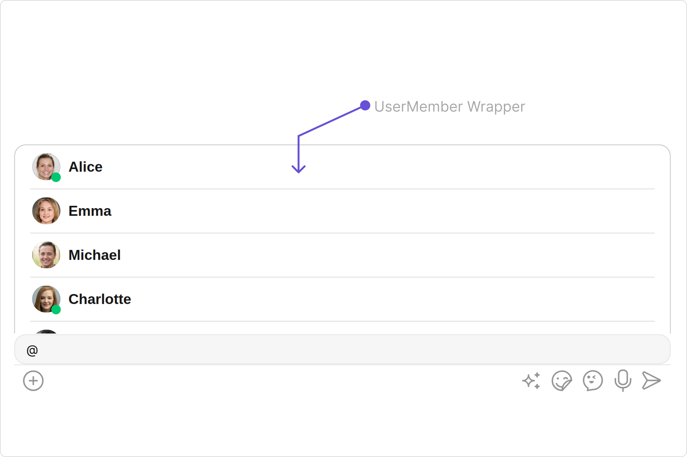
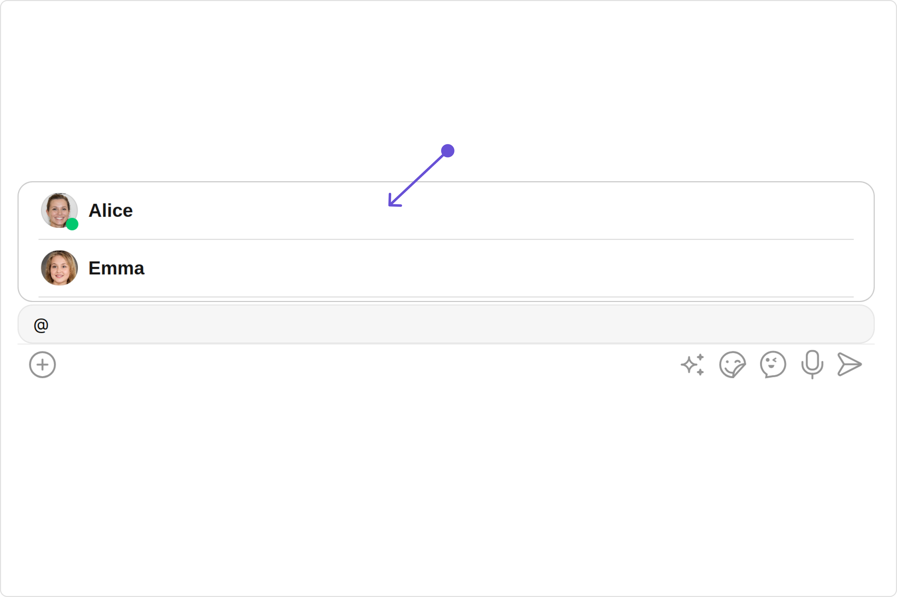
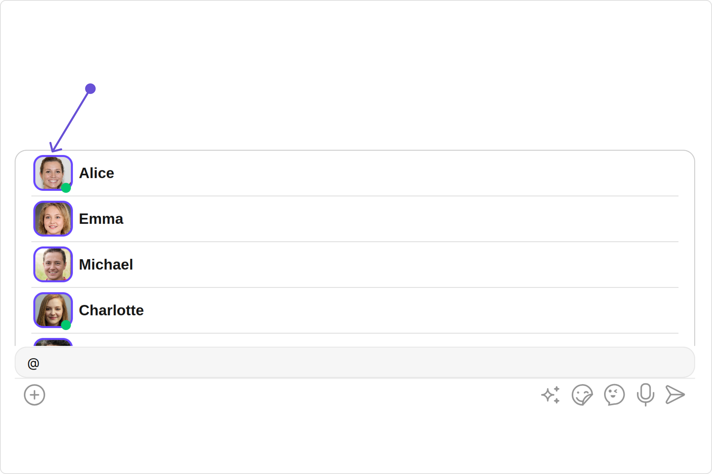
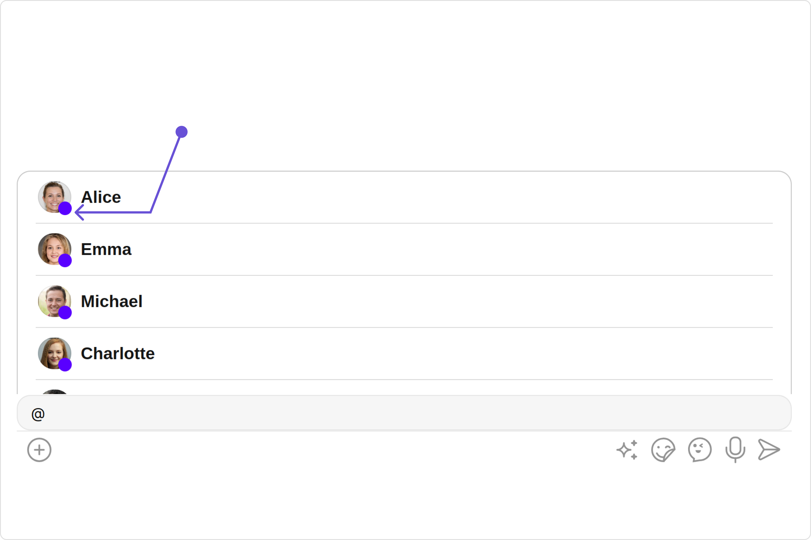
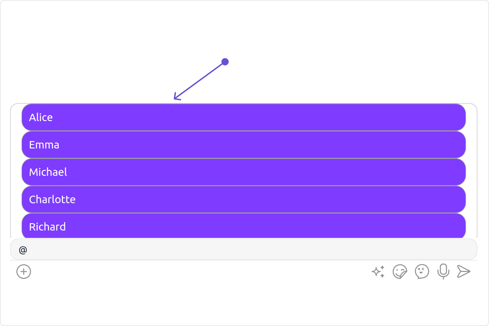

import Tabs from '@theme/Tabs';
import TabItem from '@theme/TabItem';

## Overview

The `UserMemberWrapper` component is an intuitive interface that presents a list of users or group members according to the chat context. by default it shows the list of users.



## Usage

### Integration

The following code snippet illustrates how you can directly incorporate the CometChatUserMemberWrapper component into your app.

<Tabs>
<TabItem value="js" label="app.module.ts">

```javascript
import { CUSTOM_ELEMENTS_SCHEMA, NgModule } from "@angular/core";
import { BrowserModule } from "@angular/platform-browser";
import { CometChatUserMemberWrapper } from "@cometchat/chat-uikit-angular";
import { AppComponent } from "./app.component";

@NgModule({
  imports: [BrowserModule, CometChatUserMemberWrapper],
  declarations: [AppComponent],
  providers: [],
  bootstrap: [AppComponent],
  schemas: [CUSTOM_ELEMENTS_SCHEMA],
})
export class AppModule {}
```

</TabItem>
<TabItem value="app.component.ts" label="app.component.ts">

```javascript
import { CometChat } from '@cometchat/chat-sdk-javascript';
import { Component, OnInit } from '@angular/core';
import {  CometChatThemeService, CometChatUIKit } from '@cometchat/chat-uikit-angular';
import { UserMemberListType } from '@cometchat/uikit-resources';
import "@cometchat/uikit-elements";

@Component({
  selector: 'app-root',
  templateUrl: './app.component.html',
  styleUrls: ['./app.component.css']
})
export class AppComponent {

  constructor(private themeService:CometChatThemeService) {
    themeService.theme.palette.setMode("light")
    themeService.theme.palette.setPrimary({ light: "#6851D6", dark: "#6851D6" })
  }
  userMemberListType = UserMemberListType.users;
  onLogin(UID?: any) {
    CometChatUIKit.login({ uid: UID }).then(
      (user) => {
        setTimeout(() => {
          window.location.reload();
        }, 1000);
      },
      (error) => {
        console.log("Login failed with exception:", { error });
      }
    );
  }
}
```

</TabItem>
<TabItem value="ts" label="app.component.html">

```html
<div class="fullwidth">
  <cometchat-user-member-wrapper
    [userMemberListType]="userMemberListType"
  ></cometchat-user-member-wrapper>
</div>
```

</TabItem>
</Tabs>

---

### Actions

[Actions](/ui-kit/angular/components-overview#actions) dictate how a component functions. They are divided into two types: Predefined and User-defined. You can override either type, allowing you to tailor the behavior of the component to fit your specific needs.

##### 1. onItemClick

`onItemClick` is triggered when you click on a ListItem of UserMemberWrapper component. You can override this action using the following code snippet.

<Tabs>
<TabItem value="app.component.ts" label="app.component.ts">

```javascript
import { CometChat } from '@cometchat/chat-sdk-javascript';
import { Component, OnInit } from '@angular/core';
import {  CometChatThemeService, CometChatUIKit } from '@cometchat/chat-uikit-angular';
import { UserMemberListType } from '@cometchat/uikit-resources';
import "@cometchat/uikit-elements";

@Component({
  selector: 'app-root',
  templateUrl: './app.component.html',
  styleUrls: ['./app.component.css']
})
export class AppComponent {

  constructor(private themeService:CometChatThemeService) {
    themeService.theme.palette.setMode("light")
    themeService.theme.palette.setPrimary({ light: "#6851D6", dark: "#6851D6" })
  }
  userMemberListType = UserMemberListType.users;
  public handleOnItemClick = (userMember: CometChat.User | CometChat.GroupMember) => {
    console.log("your custom on item click action");
  };
  onLogin(UID?: any) {
    CometChatUIKit.login({ uid: UID }).then(
      (user) => {
        setTimeout(() => {
          window.location.reload();
        }, 1000);
      },
      (error) => {
        console.log("Login failed with exception:", { error });
      }
    );
  }
}
```

</TabItem>
<TabItem value="ts" label="app.component.html">

```html
<div class="fullwidth">
  <cometchat-user-member-wrapper
    [userMemberListType]="userMemberListType"
    [onItemClick]="handleOnItemClick"
  ></cometchat-user-member-wrapper>
</div>
```

</TabItem>
</Tabs>

---

##### 2. onError

This action doesn't change the behavior of the component but rather listens for any errors that occur in the UserMemberWrapper component.

<Tabs>
<TabItem value="app.component.ts" label="app.component.ts">

```javascript
import { CometChat } from '@cometchat/chat-sdk-javascript';
import { Component, OnInit } from '@angular/core';
import {  CometChatThemeService, CometChatUIKit } from '@cometchat/chat-uikit-angular';
import { UserMemberListType } from '@cometchat/uikit-resources';
import "@cometchat/uikit-elements";

@Component({
  selector: 'app-root',
  templateUrl: './app.component.html',
  styleUrls: ['./app.component.css']
})
export class AppComponent {

  constructor(private themeService:CometChatThemeService) {
    themeService.theme.palette.setMode("light")
    themeService.theme.palette.setPrimary({ light: "#6851D6", dark: "#6851D6" })
  }
  userMemberListType = UserMemberListType.users;
  public handleOnError = (error: CometChat.CometChatException) => {
    console.log("your custom on error action", error);
  };
  onLogin(UID?: any) {
    CometChatUIKit.login({ uid: UID }).then(
      (user) => {
        setTimeout(() => {
          window.location.reload();
        }, 1000);
      },
      (error) => {
        console.log("Login failed with exception:", { error });
      }
    );
  }
}
```

</TabItem>
<TabItem value="ts" label="app.component.html">

```html
<div class="fullwidth">
  <cometchat-user-member-wrapper
    [userMemberListType]="userMemberListType"
    [onError]="handleOnError"
  ></cometchat-user-member-wrapper>
</div>
```

</TabItem>
</Tabs>

---

##### 3. onEmpty

This action allows you to specify a callback function to be executed when a certain condition, typically the absence of data or content, is met within the component or element.

<Tabs>
<TabItem value="app.component.ts" label="app.component.ts">

```javascript
import { CometChat } from '@cometchat/chat-sdk-javascript';
import { Component, OnInit } from '@angular/core';
import {  CometChatThemeService, CometChatUIKit } from '@cometchat/chat-uikit-angular';
import { UserMemberListType } from '@cometchat/uikit-resources';
import "@cometchat/uikit-elements";

@Component({
  selector: 'app-root',
  templateUrl: './app.component.html',
  styleUrls: ['./app.component.css']
})
export class AppComponent {

  constructor(private themeService:CometChatThemeService) {
    themeService.theme.palette.setMode("light")
    themeService.theme.palette.setPrimary({ light: "#6851D6", dark: "#6851D6" })
  }
  userMemberListType = UserMemberListType.users;
  public handleOnEmpty = () =>{
    console.log("your custom on empty action");
  }
  onLogin(UID?: any) {
    CometChatUIKit.login({ uid: UID }).then(
      (user) => {
        setTimeout(() => {
          window.location.reload();
        }, 1000);
      },
      (error) => {
        console.log("Login failed with exception:", { error });
      }
    );
  }
}
```

</TabItem>
<TabItem value="ts" label="app.component.html">

```html
<div class="fullwidth">
  <cometchat-user-member-wrapper
    [userMemberListType]="userMemberListType"
    [onEmpty]="handleOnEmpty"
  ></cometchat-user-member-wrapper>
</div>
```

</TabItem>
</Tabs>

---

### Filters

**Filters** allow you to customize the data displayed in a list within a `Component`. You can filter the list based on your specific criteria, allowing for a more customized. Filters can be applied using `RequestBuilders` of Chat SDK.

You can set `usersRequestBuilder`and `groupMemberRequestBuilder` in the UserMemberWrapper Component to filter the list. You can modify the builder as per your specific requirements with multiple options available to know more refer to [UsersRequestBuilder](/sdk/javascript/retrieve-users) and [GroupMemberRequestBuilder](/sdk/javascript/retrieve-group-members)



<Tabs>
<TabItem value="app.component.ts" label="app.component.ts">

```javascript
import { CometChat } from '@cometchat/chat-sdk-javascript';
import { Component, OnInit } from '@angular/core';
import {  CometChatThemeService, CometChatUIKit } from '@cometchat/chat-uikit-angular';
import { UserMemberListType } from '@cometchat/uikit-resources';
import "@cometchat/uikit-elements";

@Component({
  selector: 'app-root',
  templateUrl: './app.component.html',
  styleUrls: ['./app.component.css']
})
export class AppComponent {

  constructor(private themeService:CometChatThemeService) {
    themeService.theme.palette.setMode("light")
    themeService.theme.palette.setPrimary({ light: "#6851D6", dark: "#6851D6" })
  }
  userMemberListType = UserMemberListType.users;
  usersRequestBuilder = new CometChat.UsersRequestBuilder().setLimit(2)
  groupMemberRequestBuilder = new CometChat.GroupMembersRequestBuilder('guid').setLimit(2)
  onLogin(UID?: any) {
    CometChatUIKit.login({ uid: UID }).then(
      (user) => {
        setTimeout(() => {
          window.location.reload();
        }, 1000);
      },
      (error) => {
        console.log("Login failed with exception:", { error });
      }
    );
  }
}
```

</TabItem>
<TabItem value="ts" label="app.component.html">

```html
<div class="fullwidth">
  <cometchat-user-member-wrapper
    [userMemberListType]="userMemberListType"
    [usersRequestBuilder]="usersRequestBuilder"
    [groupMemberRequestBuilder]="groupMemberRequestBuilder"
  ></cometchat-user-member-wrapper>
</div>
```

</TabItem>
</Tabs>

---

### Events

[Events](/ui-kit/angular/components-overview#events) are emitted by a `Component`. By using event you can extend existing functionality. Being global events, they can be applied in Multiple Locations and are capable of being Added or Removed.

The `CometChatUserMemberWrapper` component does not produce any events.

## Customization

To fit your app's design requirements, you can customize the appearance of the `UserMemberWrapper` component. We provide exposed methods that allow you to modify the experience and behavior according to your specific needs.

### Style

Using Style you can customize the look and feel of the component in your app, These parameters typically control elements such as the color, size, shape, and fonts used within the component.

##### 1. Avatar Style

If you want to apply customized styles to the `Avatar` component within the `UserMemberWrapper` Component, you can use the following code snippet. For more information you can refer [Avatar Styles](/ui-kit/angular/avatar#avatar-style).



<Tabs>
<TabItem value="app.component.ts" label="app.component.ts">

```javascript
import { CometChat } from '@cometchat/chat-sdk-javascript';
import { Component, OnInit } from '@angular/core';
import {  CometChatThemeService, CometChatUIKit, AvatarStyle } from '@cometchat/chat-uikit-angular';
import { UserMemberListType } from '@cometchat/uikit-resources';
import "@cometchat/uikit-elements";

@Component({
  selector: 'app-root',
  templateUrl: './app.component.html',
  styleUrls: ['./app.component.css']
})
export class AppComponent {

  constructor(private themeService:CometChatThemeService) {
    themeService.theme.palette.setMode("light")
    themeService.theme.palette.setPrimary({ light: "#6851D6", dark: "#6851D6" })
  }
  userMemberListType = UserMemberListType.users;
  avatarStyle = new AvatarStyle({
    backgroundColor: "#cdc2ff",
    border: "2px solid #6745ff",
    borderRadius: "10px",
    outerViewBorderColor: "#ca45ff",
    outerViewBorderRadius: "5px",
    nameTextColor: "#4554ff"
  });
  onLogin(UID?: any) {
    CometChatUIKit.login({ uid: UID }).then(
      (user) => {
        setTimeout(() => {
          window.location.reload();
        }, 1000);
      },
      (error) => {
        console.log("Login failed with exception:", { error });
      }
    );
  }
}
```

</TabItem>
<TabItem value="ts" label="app.component.html">

```html
<div class="fullwidth">
  <cometchat-user-member-wrapper
    [userMemberListType]="userMemberListType"
    [avatarStyle]="avatarStyle"
  ></cometchat-user-member-wrapper>
</div>
```

</TabItem>
</Tabs>

---

##### 2. StatusIndicator Style

To apply customized styles to the Status Indicator component in the `UserMemberWrapper` Component, you can use the following code snippet. For further insights on Status Indicator Styles [refer](/ui-kit/angular/status-indicator)



<Tabs>
<TabItem value="app.component.ts" label="app.component.ts">

```javascript
import { CometChat } from '@cometchat/chat-sdk-javascript';
import { Component, OnInit } from '@angular/core';
import {  CometChatThemeService, CometChatUIKit } from '@cometchat/chat-uikit-angular';
import { UserMemberListType } from '@cometchat/uikit-resources';
import "@cometchat/uikit-elements";

@Component({
  selector: 'app-root',
  templateUrl: './app.component.html',
  styleUrls: ['./app.component.css']
})
export class AppComponent {

  constructor(private themeService:CometChatThemeService) {
    themeService.theme.palette.setMode("light")
    themeService.theme.palette.setPrimary({ light: "#6851D6", dark: "#6851D6" })
  }
  userMemberListType = UserMemberListType.users;
  statusIndicatorStyle: any = ({
    height: '15px',
    width: '15px',
    backgroundColor: 'green'
  });
  onLogin(UID?: any) {
    CometChatUIKit.login({ uid: UID }).then(
      (user) => {
        setTimeout(() => {
          window.location.reload();
        }, 1000);
      },
      (error) => {
        console.log("Login failed with exception:", { error });
      }
    );
  }
}
```

</TabItem>
<TabItem value="ts" label="app.component.html">

```html
<div class="fullwidth">
  <cometchat-user-member-wrapper
    [userMemberListType]="userMemberListType"
    [statusIndicatorStyle]="statusIndicatorStyle"
  ></cometchat-user-member-wrapper>
</div>
```

</TabItem>
</Tabs>

---

### Functionality

These are a set of small functional customizations that allow you to fine-tune the overall experience of the component. With these, you can change text, set custom icons, and toggle the visibility of UI elements.

<Tabs>
<TabItem value="app.component.ts" label="app.component.ts">

```javascript
import { CometChat } from '@cometchat/chat-sdk-javascript';
import { Component, OnInit } from '@angular/core';
import {  CometChatThemeService, CometChatUIKit } from '@cometchat/chat-uikit-angular';
import { UserMemberListType } from '@cometchat/uikit-resources';
import "@cometchat/uikit-elements";

@Component({
  selector: 'app-root',
  templateUrl: './app.component.html',
  styleUrls: ['./app.component.css']
})
export class AppComponent {

  constructor(private themeService:CometChatThemeService) {
    themeService.theme.palette.setMode("light")
    themeService.theme.palette.setPrimary({ light: "#6851D6", dark: "#6851D6" })
  }
  userMemberListType = UserMemberListType.users;
  onLogin(UID?: any) {
    CometChatUIKit.login({ uid: UID }).then(
      (user) => {
        setTimeout(() => {
          window.location.reload();
        }, 1000);
      },
      (error) => {
        console.log("Login failed with exception:", { error });
      }
    );
  }
}
```

</TabItem>
<TabItem value="ts" label="app.component.html">

```html
<div class="fullwidth">
  <cometchat-user-member-wrapper
    [userMemberListType]="userMemberListType"
    [disableUsersPresence]="true"
  ></cometchat-user-member-wrapper>
</div>
```

</TabItem>
</Tabs>

below is a list of customizations along with corresponding code snippets

Below is a customizations list along with corresponding code snippets

| Property                                                                                                               | Description                                                                                                                                                                                                 | Code                                              |
| ---------------------------------------------------------------------------------------------------------------------- | ----------------------------------------------------------------------------------------------------------------------------------------------------------------------------------------------------------- | ------------------------------------------------- |
| **userMemberListType**                                                                                                 | specifies whether the member list should display group members or individual users.                                                                                                                         | `[userMemberListType]="userMemberListType"`       |
| **searchKeyword** <a data-tooltip-id="my-tooltip-html-prop"> <span class="material-icons red">report</span> </a>       | allows users to filter and display only those items in a list that match the provided keyword.                                                                                                              | `[searchKeyword]="'custom searchkeyword'"`        |
| **disableLoadingState** <a data-tooltip-id="my-tooltip-html-prop"> <span class="material-icons red">report</span> </a> | disable the loading state                                                                                                                                                                                   | `[disableLoadingState]="true"`                    |
| **disableUsersPresence**                                                                                               | used to control visibility of status indicator shown if user is online                                                                                                                                      | `[disableUsersPresence]="true"`                   |
| **userPresencePlacement**                                                                                              | determines the position where the user presence indicator is displayed relative to the user's avatar or name, with `right` or `bottom` indicating it's displayed to the right or bottom of the user's list. | `[userPresencePlacement]="userPresencePlacement"` |
| **hideSeparator**                                                                                                      | When set to true, hides the separator between the individual elements in the list.                                                                                                                          | `[hideSeparator]="true"`                          |
| **loadingIconUrl**                                                                                                     | used to set the custom loading icon                                                                                                                                                                         | `[loadingIconUrl]="'custom loading url'"`         |

---

### Advanced

For advanced-level customization, you can set custom views to the component. This lets you tailor each aspect of the component to fit your exact needs and application aesthetics. You can create and define your views, layouts, and UI elements and then incorporate those into the component.

#### ListItemView

With the listItemVIew property, you can assign a custom ListItem to the UserMemberWrapper Component.



<Tabs>
<TabItem value="app.component.ts" label="app.component.ts">

```javascript
import { CometChat } from '@cometchat/chat-sdk-javascript';
import { Component, OnInit } from '@angular/core';
import {  CometChatThemeService, CometChatUIKit } from '@cometchat/chat-uikit-angular';
import { UserMemberListType } from '@cometchat/uikit-resources';
import "@cometchat/uikit-elements";

@Component({
  selector: 'app-root',
  templateUrl: './app.component.html',
  styleUrls: ['./app.component.css']
})
export class AppComponent {

  constructor(private themeService:CometChatThemeService) {
    themeService.theme.palette.setMode("light")
    themeService.theme.palette.setPrimary({ light: "#6851D6", dark: "#6851D6" })
  }
  userMemberListType = UserMemberListType.users;
  onLogin(UID?: any) {
    CometChatUIKit.login({ uid: UID }).then(
      (user) => {
        setTimeout(() => {
          window.location.reload();
        }, 1000);
      },
      (error) => {
        console.log("Login failed with exception:", { error });
      }
    );
  }
}
```

</TabItem>
<TabItem value="ts" label="app.component.html">

```html
<div class="fullwidth">
  <cometchat-user-member-wrapper
    [userMemberListType]="userMemberListType"
    [listItemView]="listItemView"
  ></cometchat-user-member-wrapper>
</div>
<ng-template #listItemView let-item>
  <div>{{item.getName()}}</div>
</ng-template>
```

</TabItem>
</Tabs>

---

import { Tooltip } from 'react-tooltip'
import 'react-tooltip/dist/react-tooltip.css'

<Tooltip
  id="my-tooltip-html-prop"
  html="Not available in UserMemberWrapperConfiguration"
/>
