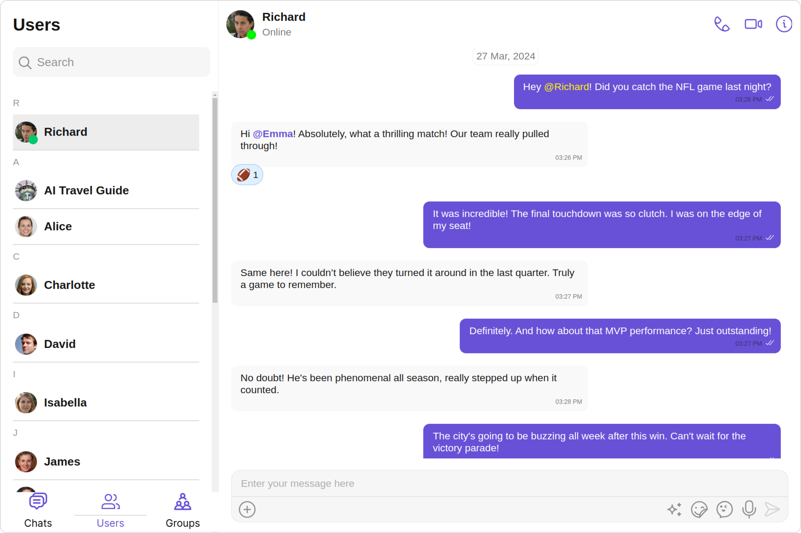
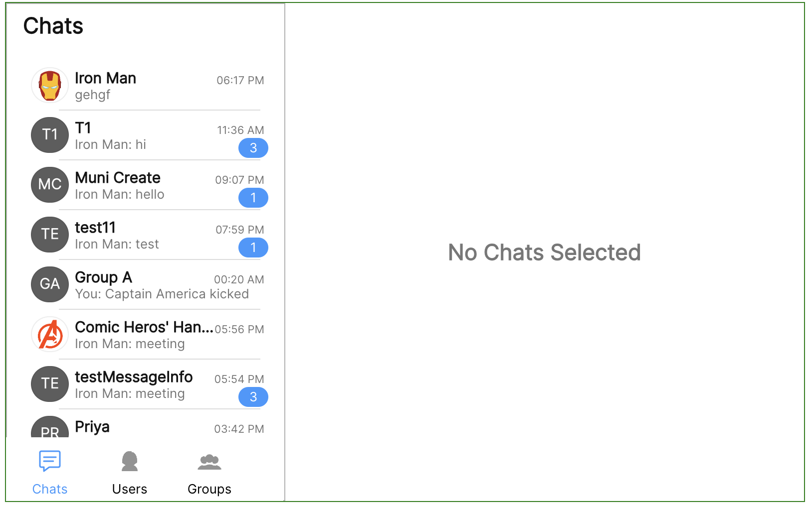

import Tabs from '@theme/Tabs';
import TabItem from '@theme/TabItem';

This guide will help you achieve a tabbed layout (aka Multi-Tab Chat UI) of the components available in CometChatUIKit for Angular.



We’ll use the [CometChatConversationsWithMessages](./conversations-with-messages), [CometChatUsersWithMessages](./users-with-messages), and [CometChatGroupsWithMessages](./groups-with-messages) components and launch them as individual tab items within the tabbed layout.

:::info

We recommend that you read the [Key Concepts](/fundamentals/key-concepts) , follow the guidelines, and also take the time to familiarise yourself with the library's [components](/ui-kit/angular/components-overview).

:::

Step 1: Create a new component CometChatUI

<Tabs>
<TabItem value="ts" label="cometchat-ui.component.ts">

```typescript
import { Component, HostListener, OnInit, TemplateRef, ViewChild } from '@angular/core';
import { CometChatTabItem } from '@cometchat/chat-uikit-angular';

@Component({
  selector: 'app-cometchat-ui',
  templateUrl: './cometchat-ui.component.html',
  styleUrls: ['./cometchat-ui.component.scss']
});

export class CometchatUiComponent implements OnInit {


}
```

</TabItem>
</Tabs>

Step 2: Include the Tabs component from the UI Kit and include the ConversationsWithMessages, UsersWithMessages, GroupsWithMessages components. We'll also apply some styling to the tab items.

<Tabs>
<TabItem value="ts" label="cometchat-ui.component.ts">

```typescript
import {
  Component,
  HostListener,
  OnInit,
  TemplateRef,
  ViewChild,
} from "@angular/core";
import { BaseStyle } from "@cometchat/uikit-elements";
import { TabItemStyle } from "@cometchat/uikit-shared";
import { CometChatTabItem } from "@cometchat/chat-uikit-angular";

export class CometchatUiComponent implements OnInit {
  //access the refs using view child
  @ViewChild("chatsRef", { static: false }) chatsRef!: TemplateRef<any>;
  @ViewChild("usersRef", { static: false }) usersRef!: TemplateRef<any>;
  @ViewChild("groupsRef", { static: false }) groupsRef!: TemplateRef<any>;

  public tabsStyle: BaseStyle = {
    border: "1px solid grey",
  };
  public tabs!: CometChatTabItem[]; //array of tabs item

  //Styling tab items
  public tabItemStyle: TabItemStyle = new TabItemStyle({
    height: "fit-content",
    width: "67px",
    background: "white",
    activeBackground: "white",
    titleTextColor: "RGBA(20, 20, 20, 0.46)",
    titleTextFont: "400 13px Inter",
    iconTint: "RGBA(20, 20, 20, 0.46)",
    activeIconTint: "RGB(51, 153, 255)",
    activeTitleTextColor: "RGB(51, 153, 255)",
    activeTitleTextFont: "RGB(51, 153, 255)",
  });

  //create an array of tabs item
  ngAfterViewInit() {
    setTimeout(() => {
      this.tabs = [
        {
          childView: this.chatsRef,
          title: "chats",
          id: "chats",
          iconURL: "assets/chats.svg",
          style: this.tabItemStyle,
        },
        {
          childView: this.usersRef,
          title: "users",
          id: "users",
          iconURL: "assets/user.svg",
          style: this.tabItemStyle,
        },
        {
          childView: this.groupsRef,
          title: "groups",
          iconURL: "assets/group.svg",
          id: "groups",
          style: this.tabItemStyle,
        },
      ];
    }, 0);
  }
}
```

</TabItem>
<TabItem value="html" label="cometchat-ui.component.html">

```html
<cometchat-tabs [tabs]="tabs" [tabsStyle]="tabsStyle"></cometchat-tabs>

<ng-template #chatsRef>
  <cometchat-conversations-with-messages
    [isMobileView]="isMobileView"
  ></cometchat-conversations-with-messages>
</ng-template>

<ng-template #usersRef>
  <cometchat-users-with-messages
    [isMobileView]="isMobileView"
  ></cometchat-users-with-messages>
</ng-template>

<ng-template #groupsRef>
  <cometchat-groups-with-messages
    [isMobileView]="isMobileView"
  ></cometchat-groups-with-messages>
</ng-template>
```

</TabItem>
</Tabs>

Step 3: We'll now set the isMobileView prop to true/false when the window resizes, so that the components will change to a mobile or desktop view accordingly.

<Tabs>
<TabItem value="ts" label="cometchat-ui.component.ts">

```typescript
import { Component, HostListener, OnInit, TemplateRef, ViewChild } from '@angular/core';
import { BaseStyle } from '@cometchat/uikit-elements';
import { TabItemStyle } from '@cometchat/uikit-shared';
import { CometChatTabItem } from '@cometchat/chat-uikit-angular';

export class CometchatUiComponent implements OnInit {

  public innerWidth!: number;
  public isMobileView!: boolean;

	//access the refs using view child
	@ViewChild("chatsRef", { static: false }) chatsRef!: TemplateRef<any> ;
	@ViewChild("usersRef", { static: false }) usersRef!: TemplateRef<any>;
	@ViewChild("groupsRef", { static: false }) groupsRef!: TemplateRef<any>;

	public tabs!:CometChatTabItem[]; //array of tabs item

  //Styling tab items
  public tabItemStyle:TabItemStyle = new TabItemStyle({
    height: "fit-content",
    width: "67px",
    background: "white",
    activeBackground: "white",
    titleTextColor: "RGBA(20, 20, 20, 0.46)",
    titleTextFont: "400 13px Inter",
    iconTint: "RGBA(20, 20, 20, 0.46)",
    activeIconTint: "RGB(51, 153, 255)",
    activeTitleTextColor: "RGB(51, 153, 255)",
    activeTitleTextFont: "RGB(51, 153, 255)",
  });

	//updating mobile view and desktop view
	ngOnInit(): void {
		this.onResize();
	}

  //create an array of tabs item
  ngAfterViewInit() {
    setTimeout(() => {
       this.tabs = [
         {
           childView:this.chatsRef,
           title:"chats",
           id:"chats",
           iconURL:"assets/chats.svg",
           style:this.tabItemStyle
         },
         {
           childView:this.usersRef,
           title:"users",
           id:"users",
           iconURL:"assets/user.svg",
           style:this.tabItemStyle
         },
         {
         childView:this.groupsRef,
         title:"groups",
         iconURL:"assets/group.svg",
         id:"groups",
         style:this.tabItemStyle
         }
       ]
     },0);

   }

	//host listener fo
 	@HostListener("window:resize", []);
	onResize(): void {
    try {
    	this.innerWidth = window.innerWidth;
    if (
    (this.innerWidth as any) >=  "320" &&
    (this.innerWidth as any) <=  "767"
    ) {
    	this.isMobileView = true
    } else {
    	this.isMobileView = false
    }
    } catch (error) {}
	}

}
```

</TabItem>
</Tabs>

Step 4: Import the CometChatUI component into your App component.

<Tabs>
<TabItem value="ts" label="app.module.ts">

```typescript
import { CUSTOM_ELEMENTS_SCHEMA, NgModule } from "@angular/core";
import { BrowserModule } from "@angular/platform-browser";
import {
  CometChatConversationsWithMessages,
  CometChatGroupsWithMessages,
  CometChatUsersWithMessages,
} from "@cometchat/chat-uikit-angular";

@NgModule({
  declarations: [AppComponent, CometchatUiComponent],
  imports: [
    BrowserModule,
    CometChatTabs,
    CometChatConversationsWithMessages,
    CometChatGroupsWithMessages,
    CometChatUsersWithMessages,
  ],
  providers: [],
  bootstrap: [AppComponent],
  schemas: [CUSTOM_ELEMENTS_SCHEMA],
})
export class AppModule {}
```

</TabItem>
</Tabs>

You can now see chats, users and group components each as tab items. This is how you can launch CometChat UIKit’s individual component in a tabbed layout. 🎉


