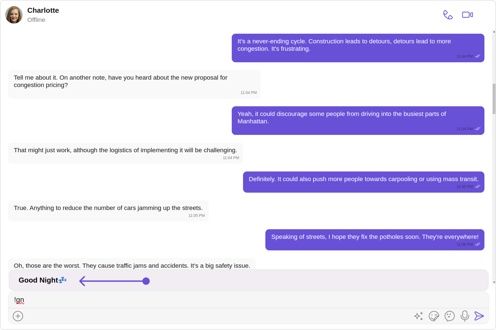
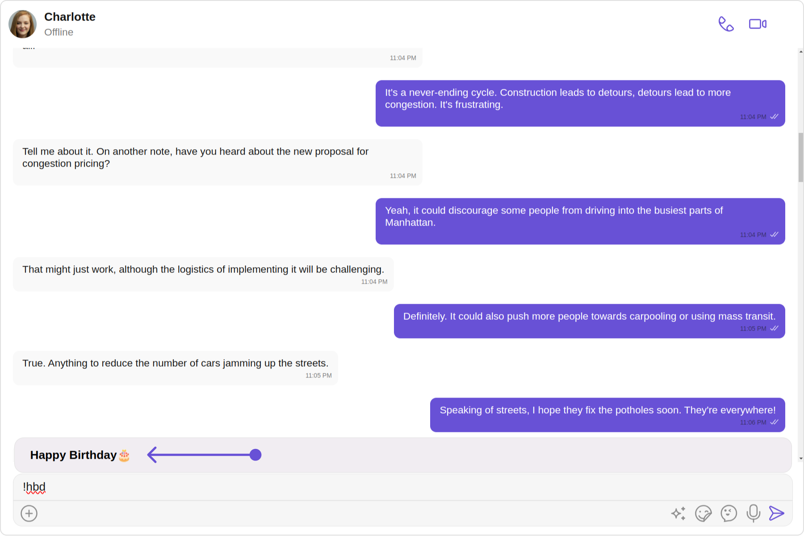
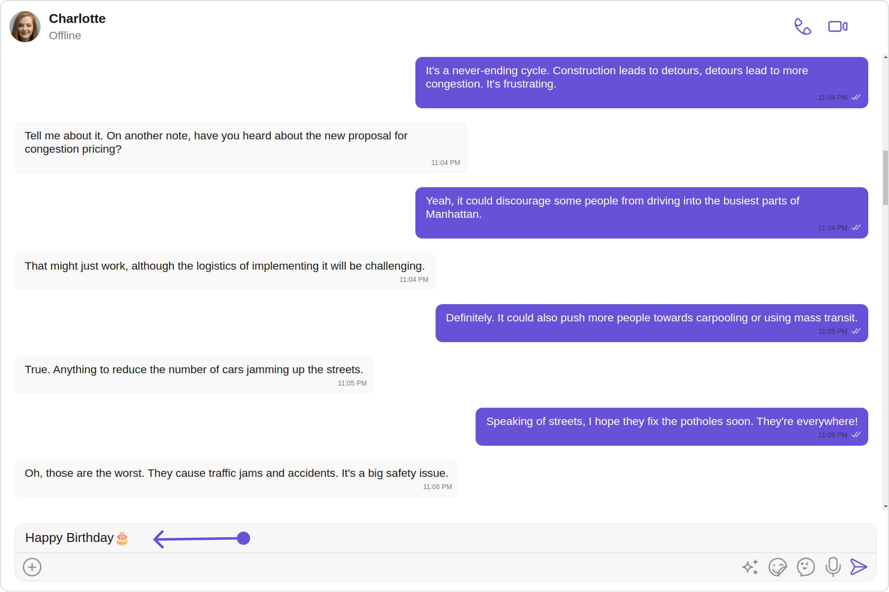

import Tabs from '@theme/Tabs';
import TabItem from '@theme/TabItem';

## Overview

The `ShortCutFormatter` class extends the [CometChatTextFormatter](./custom-text-formatter-guide) class to provide a mechanism for handling shortcuts within messages. This guide will walk you through the process of using `ShortCutFormatter` to implement shortcut extensions in your CometChat application.



## Usage

Here are the steps to create a `ShortCutFormatter` for CometChat using the CometChatTextFormatter:

1. Firstly, you need to import `CometChatTextFormatter` from the CometChat UI Kit angular library.

```jsx
import { CometChatTextFormatter } from "@cometchat/chat-uikit-angular";
```

2. Now, extend the `CometChatTextFormatter` class to create your custom text formatter class. In this case, let's create a `HashTagTextFormatter`.

```jsx
class ShortCutFormatter extends CometChatTextFormatter {
  ...
}
```

3. Set up the `trackCharacter` and define any necessary private fields.

```jsx
this.setTrackingCharacter("!");
```

4. Implement the `onKeyDown` method to handle key events and trigger actions based on defined shortcuts.

```jsx
onKeyDown(event: KeyboardEvent) {
  // Your implementation
}
```

5. Implement any additional methods required for your custom formatter, such as opening and closing dialogs, handling button clicks, and formatting text.

```jsx
openDialog(buttonText: string) {
  // Your implementation
}

closeDialog() {
  // Your implementation
}

handleButtonClick = () => {
  // Your implementation
};

getFormattedText(text: string): string {
  return text;
}

private getTextBeforeCaret(caretPosition: number): string {
  // Your implementation
}
```

## Example

Below is an example demonstrating how to use a custom formatter class in components such as [CometChatConversations](/ui-kit/angular/conversations), [CometChatMessageList](/ui-kit/angular/message-list), [CometChatMessageComposer](/ui-kit/angular/message-composer).




<Tabs>
<TabItem value="ShortCutFormatter" label="ShortCutFormatter.ts">

```typescript
import { CometChatTextFormatter } from "@cometchat/uikit-shared";
import { Subject } from 'rxjs';
import { CometChat } from "@cometchat/chat-sdk-javascript";

export class ShortcutFormatter extends CometChatTextFormatter {
    private shortcuts: { [key: string]: string } = {};
    private dialogIsOpen: boolean = false;
    private currentShortcut: string | null = null;
    private openDialogSubject = new Subject<{ closeDialog?: boolean, buttonText?: string, shortcut?: string, handleButtonClick?:any }>();
    openDialog$ = this.openDialogSubject.asObservable();

    constructor() {
        super();
        this.setTrackingCharacter('!');
        CometChat.callExtension('message-shortcuts', 'GET', 'v1/fetch', undefined)
            .then((data: any) => {
                if (data && data.shortcuts) {
                    this.shortcuts = data.shortcuts;
                }
            })
            .catch(error => console.log("error fetching shortcuts", error));
    }

    override onKeyDown(event: KeyboardEvent) {
        const caretPosition = this.currentCaretPosition instanceof Selection
            ? this.currentCaretPosition.anchorOffset
            : 0;
        const textBeforeCaret = this.getTextBeforeCaret(caretPosition);

        const match = textBeforeCaret.match(/!([a-zA-Z]+)$/);
        if (match) {
            const shortcut = match[0];
            const replacement = this.shortcuts[shortcut];
            if (replacement) {
                if (this.dialogIsOpen && this.currentShortcut !== shortcut) {
                    this.closeDialog();
                }
                this.openDialog(replacement, shortcut);
            }
        }
    }

    getCaretPosition() {
        if (!this.currentCaretPosition?.rangeCount) return { x: 0, y: 0 };
        const range = this.currentCaretPosition?.getRangeAt(0);
        const rect = range.getBoundingClientRect();
        return {
            x: rect.left,
            y: rect.top
        };
    }

    openDialog(buttonText: string, shortcut: string) {
        this.openDialogSubject.next({ buttonText, shortcut , handleButtonClick: this.handleButtonClick});
        this.dialogIsOpen = true;
        this.currentShortcut = shortcut;
    }

    closeDialog() {
        this.openDialogSubject.next({closeDialog: true});
    }

    handleButtonClick = (buttonText: string) => {
        console.log(buttonText);
        
        if (this.currentCaretPosition && this.currentRange) {
            const shortcut = Object.keys(this.shortcuts).find(key => this.shortcuts[key] === buttonText);
            if (shortcut) {
                const replacement = this.shortcuts[shortcut];
                this.addAtCaretPosition(replacement, this.currentCaretPosition, this.currentRange);
            }
        }
        if (this.dialogIsOpen) {
            this.closeDialog();
        }
    };

    override getFormattedText(text: string): string {
        return text;
    }

    private getTextBeforeCaret(caretPosition: number): string {
        if (this.currentRange && this.currentRange.startContainer && typeof this.currentRange.startContainer.textContent === "string") {
            const textContent = this.currentRange.startContainer.textContent;
            if (textContent.length >= caretPosition) {
                return textContent.substring(0, caretPosition);
            }
        }
        return "";
    }
}

export default ShortcutFormatter;
```

</TabItem>
<TabItem value="app" label="app.component.ts">

```typescript
import { CometChat } from '@cometchat/chat-sdk-javascript';
import { Component, OnInit } from '@angular/core';
import { CometChatThemeService, CometChatUIKit } from '@cometchat/chat-uikit-angular';
import "@cometchat/uikit-elements";
import { ShortcutFormatter } from '../ShortCutFormatter';
import { Subscription } from 'rxjs';

@Component({
  selector: 'app-root',
  templateUrl: './app.component.html',
  styleUrls: ['./app.component.css']
})
export class AppComponent implements OnInit{

    dialogIsOpen: boolean = false;
    currentDialogButtonText: string = '';
    private dialogSubscription!: Subscription;
    onClick : any;

  ngOnInit(): void {
    CometChat.getUser("uid").then((user:CometChat.User)=>{
      this.userObject=user;
    });
  }

  public userObject!: CometChat.User;

  constructor(private themeService:CometChatThemeService) {
    themeService.theme.palette.setMode("light")
    themeService.theme.palette.setPrimary({ light: "#6851D6", dark: "#6851D6" })

    this.dialogSubscription = this.shortcutFormatter.openDialog$.subscribe(
      ({ closeDialog, buttonText, shortcut, handleButtonClick }) =>  {
        if(closeDialog) {
          this.closeDialog();
          return;
        }
        this.onOpenDialog(buttonText!, shortcut!, handleButtonClick!)
      }
    );
  }
  ngOnDestroy() {
  this.dialogSubscription.unsubscribe();
  }
  onOpenDialog(buttonText: string, shortcut: string, handleButtonClick: any) {
    this.currentDialogButtonText = buttonText;
    this.dialogIsOpen = true;
    this.onClick= handleButtonClick;
  }
  closeDialog() {
    this.dialogIsOpen = false;
    this.currentDialogButtonText = '';
  }


  onLogin(UID?: any) {
    CometChatUIKit.login({ uid: UID }).then(
      (user) => {
        setTimeout(() => {
          window.location.reload();
        }, 1000);
      },
      (error) => {
        console.log("Login failed with exception:", { error });
      }
    );
  }
}
```

</TabItem>
<TabItem value="html" label="app.component.html">

```typescript
<div class="fullwidth">

<cometchat-message-composer
*ngIf="userObject"
[user]="userObject"
[textFormatters]="[shortcutFormatter]"
></cometchat-message-composer>

</div>

<div *ngIf="dialogIsOpen" [ngStyle]="{ position: 'absolute', top: '150px', left: '50%', transform: 'translateX(-50%)', width: '600px' }">
  <button (click)="onClick(currentDialogButtonText)" [ngStyle]="{ width: '100%', height: '100%', cursor: 'pointer', backgroundColor: '#f2e6ff', border: '2px solid #9b42f5', borderRadius: '12px', textAlign: 'left', font: '600 15px sans-serif, Inter' }">
    {{ currentDialogButtonText }}
  </button>
</div>

```

</TabItem>
</Tabs>

---
