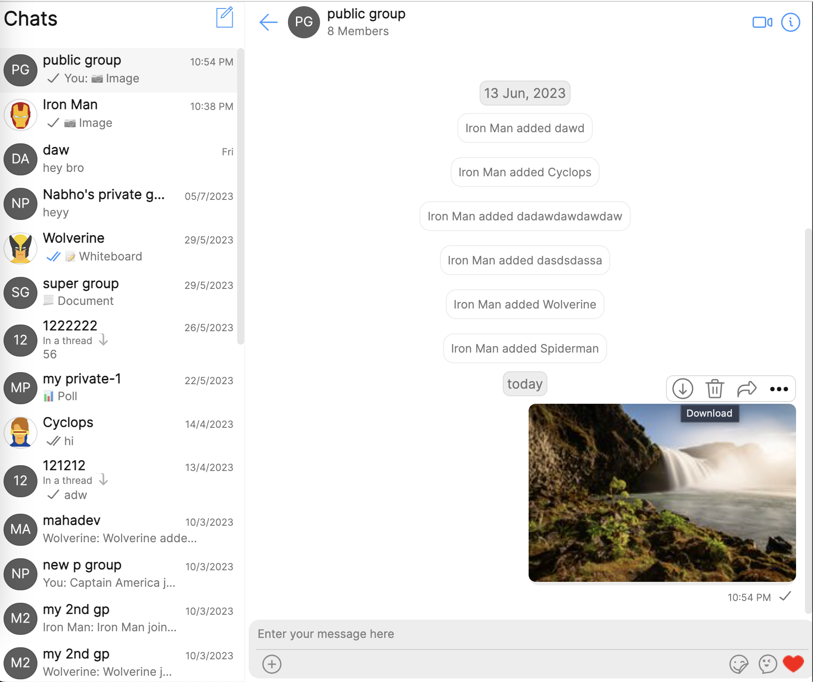

import Tabs from '@theme/Tabs';
import TabItem from '@theme/TabItem';

This guide will help you add a custom option to the messages of type image. By default, CometChat UI Kit for Angular supports the following message options:

`text message` - `edit`, `delete`, `copy`, `reply in thread`, `react`

`media message`, `custom message` - `delete`, `reply in thread`, `react`

:::info

We recommend that you read the [Key Concepts](/fundamentals/key-concepts) , follow the guidelines, and also take the time to familiarise yourself with the library's [components](/ui-kit/angular/components-overview).

:::

In the example below, we are going to simulate a "download image" feature when user clicks on the custom message option.

## Custom Option

The first step is to create the custom option using `CometChatMessageOption` class which has the following structure:

<Tabs>
<TabItem value="ts" label="Typescript">

```typescript
new CometChatMessageOption({
  id: string;
  title: string;
  iconURL: string;
  onClick: any;
  titleFont: string;
  titleColor: string;
  backgroundColor: string;
  iconTint: string;
})
```

</TabItem>
</Tabs>

## Click handler

We'll download the image when user clicks on the custom option.

<Tabs>
<TabItem value="ts" label="Typescript">

```typescript
const downloadOption = new CometChatMessageOption({
  id: "download",
  title: "Download",
  iconURL: downloadIcon,
  onClick: () => downloadImage(mediaMessage),
  iconTint: theme.palette.getAccent600(),
  backgroundColor: "transparent",
  titleFont: fontHelper(theme.typography.subtitle1),
  titleColor: theme.palette.getAccent600(),
});

const downloadImage = async (message: CometChat.MediaMessage) => {
  const attachments = message.getAttachments();
  if (Array.isArray(attachments) && attachments.length) {
    const attachment = attachments[0];
    const imageName = attachment.getName();

    const image = await fetch(attachment.getUrl());
    const imageBlob = await image.blob();
    const imageURL = URL.createObjectURL(imageBlob);

    const link = document.createElement("a");
    link.href = imageURL;
    link.download = imageName;
    document.body.appendChild(link);
    link.click();
    document.body.removeChild(link);
  }
};
```

</TabItem>
</Tabs>

The download option is then pushed to the default set of options for message type `image`. The default options for message type `image` and its template are fetched using the `CometChatUIKit` class.

The download option is then pushed to the default set of message options for image message supported by the Angular UI Kit. The default options are fetched using the `CometChatUIKit` class.

<Tabs>
<TabItem value="ts" label="Typescript">

```typescript
let templates = CometChatUIKit.getDataSource().getAllMessageTemplates(this.themeService.theme)

//updating the options for image bubble
for (let i = 0; i < templates.length; i++) {
  if (templates[i].category == CometChatUIKitConstants.MessageCategory.message && templates[i].type == CometChatUIKitConstants.MessageTypes.image) {

    templates[i].options = (loggedInUser: CometChat.User, message: CometChat.BaseMessage, theme: CometChatTheme, group?: CometChat.Group | undefined) => {
      let options = CometChatUIKit.getDataSource().getTextMessageOptions(loggedInUser, message, theme, group)
      options.unshift(this.createOption(message, theme))
      return options
    }
    break;
  }
}

createOption(message: CometChat.BaseMessage, theme: CometChatTheme) {

  let mediaMessage = message as CometChat.MediaMessage;

  return new CometChatMessageOption({
    id: 'download',
    title: "Download",
    iconURL: "assets/star.svg",
    onClick: () => this.downloadImage(mediaMessage),
    iconTint: theme.palette.getAccent600(),
    backgroundColor: "transparent",
    titleFont: fontHelper(theme.typography.subtitle1),
    titleColor: theme.palette.getAccent600()
  })
}

downloadImage = async(message:CometChat.MediaMessage) => {

  const attachments = message.getAttachments();
  if(Array.isArray(attachments) && attachments.length) {

    const attachment = attachments[0];
    const imageName = attachment.getName();

    const image = await fetch(attachment.getUrl())
    const imageBlob = await image.blob()
    const imageURL = URL.createObjectURL(imageBlob)

    const link = document.createElement('a')
    link.href = imageURL
    link.download = imageName
    document.body.appendChild(link)
    link.click()
    document.body.removeChild(link);
  }
}
```

</TabItem>
</Tabs>

The message options are then passed to the [ConversationsWithMessages](./conversations-with-messages) component as a prop using [MessagesConfiguration](/web-shared/messages-configuration).

<Tabs>
<TabItem value="ts" label="Typescript">

```typescript
//creating new configuration
this.messagesConfiguration.messageListConfiguration.templates = templates;
this.messagesConfiguration = { ...this.messagesConfiguration };
```

</TabItem>
</Tabs>

## Implementation

With the completion of each individual piece, we can now integrate all the code snippets to form the final code example.

### Code

<Tabs>
<TabItem value="html" label="message-option.component.html">

```html
<cometchat-conversations-with-messages
  [messagesConfiguration]="messagesConfiguration"
></cometchat-conversations-with-messages>
```

</TabItem>

<TabItem value="ts" label="message-option.component.ts">

```typescript
import {
  Component,
  ElementRef,
  HostListener,
  OnInit,
  TemplateRef,
  ViewChild,
} from "@angular/core";
import { CometChat } from "@cometchat/chat-sdk-javascript";
import {
  CometChatMessageComposerAction,
  CometChatMessageEvents,
  CometChatMessageOption,
  CometChatMessageTemplate,
  CometChatTheme,
  CometChatUIKitConstants,
  fontHelper,
} from "@cometchat/uikit-resources";
import {
  MessagesConfiguration,
  ComposerId,
  CometChatUIKitHelper,
  CometChatUIKitUtility,
  MessageStatus,
} from "@cometchat/uikit-shared";
import {
  CometChatUIKit,
  CometChatThemeService,
} from "@cometchat/chat-uikit-angular";

import "@cometchat/uikit-elements"; //accesing web component image bubble

@Component({
  selector: "app-message-option",
  templateUrl: "./message-option.component.html",
  styleUrls: ["./message-option.component.scss"],
})
export class MessageOptionComponent implements OnInit {
  //template ref for text bubble
  @ViewChild("textBubbleRef") textBubbleRef!: TemplateRef<any>;
  messagesConfiguration: MessagesConfiguration = new MessagesConfiguration({});
  loggedInUser: CometChat.User | null = null;
  //accessing global theme object.
  constructor(private themeService: CometChatThemeService) {}

  //get the existing message template and  override text bubble options on init.
  ngOnInit() {
    CometChat.getLoggedinUser().then((user) => {
      this.loggedInUser = user;
    });
    //default templates
    let templates = CometChatUIKit.getDataSource().getAllMessageTemplates(
      this.themeService.theme
    );

    //updating the contentview for text bubble
    for (let i = 0; i < templates.length; i++) {
      if (
        templates[i].category ==
          CometChatUIKitConstants.MessageCategory.message &&
        templates[i].type == CometChatUIKitConstants.MessageTypes.image
      ) {
        //templates[i].contentView = () => { return this.textBubbleRef };
        templates[i].options = (
          loggedInUser: CometChat.User,
          message: CometChat.BaseMessage,
          theme: CometChatTheme,
          group?: CometChat.Group | undefined
        ) => {
          let options = CometChatUIKit.getDataSource().getTextMessageOptions(
            loggedInUser,
            message,
            theme,
            group
          );
          //if (!message.getSender() || (this.loggedInUser?.getUid() == message.getSender().getUid())) {
          options.unshift(this.createOption(message, theme));
          //}
          return options;
        };
        break;
      }
    }
    //creating new configuration
    this.messagesConfiguration.messageListConfiguration.templates = templates;
    this.messagesConfiguration = { ...this.messagesConfiguration };
  }

  createOption(message: CometChat.BaseMessage, theme: CometChatTheme) {
    let mediaMessage = message as CometChat.MediaMessage;

    return new CometChatMessageOption({
      id: "download",
      title: "Download",
      iconURL: "assets/star.svg",
      onClick: () => this.downloadImage(mediaMessage),
      iconTint: theme.palette.getAccent600(),
      backgroundColor: "transparent",
      titleFont: fontHelper(theme.typography.subtitle1),
      titleColor: theme.palette.getAccent600(),
    });
  }

  downloadImage = async (message: CometChat.MediaMessage) => {
    const attachments = message.getAttachments();
    if (Array.isArray(attachments) && attachments.length) {
      const attachment = attachments[0];
      const imageName = attachment.getName();

      const image = await fetch(attachment.getUrl());
      const imageBlob = await image.blob();
      const imageURL = URL.createObjectURL(imageBlob);

      const link = document.createElement("a");
      link.href = imageURL;
      link.download = imageName;
      document.body.appendChild(link);
      link.click();
      document.body.removeChild(link);
    }
  };
}
```

</TabItem>

<TabItem value="app" label="app.component.html">

```html
<app-message-option></app-message-option>
```

</TabItem>

<TabItem value="module" label="app.module.ts">

```typescript
import { CUSTOM_ELEMENTS_SCHEMA, NgModule } from "@angular/core";
import { BrowserModule } from "@angular/platform-browser";
import { AppComponent } from "./app.component";
import { CometChatConversationsWithMessages } from "@cometchat/chat-uikit-angular";
import { MessageOptionComponent } from "./message-option/message-option.component";

@NgModule({
  declarations: [AppComponent, MessageOptionComponent],
  imports: [BrowserModule, CometChatConversationsWithMessages],
  providers: [],
  bootstrap: [AppComponent],
  schemas: [CUSTOM_ELEMENTS_SCHEMA],
})
export class AppModule {}
```

</TabItem>
</Tabs>

## Result


