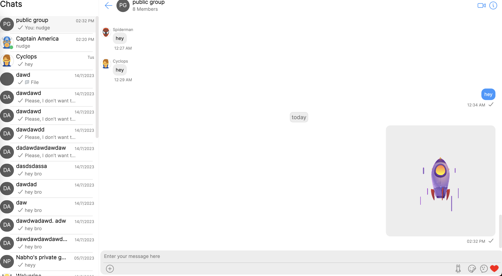

import Tabs from '@theme/Tabs';
import TabItem from '@theme/TabItem';

In this guide, we will demonstrate how to add a custom message with a custom-built message bubble to the [Message List](./message-list) component.

:::info

We recommend that you read the [Key Concepts](/fundamentals/key-concepts) , follow the guidelines, and also take the time to familiarise yourself with the library's [components](/ui-kit/angular/components-overview).

:::

In the example below, we are going to simulate a "nudge" behaviour which sends out a custom message when the user clicks on the auxiliary button placed in the [Message Composer](./message-composer) component.

## Custom Auxiliary Button

The first step is to create a new auxiliary button. We'll be making use of [CometChatIcon](/web-elements/icon) web component to create the auxiliary icon.

<Tabs>
<TabItem value="html" label="HTML">

```html
<cometchat-icon
  URL="assets/nudge-icon.png"
  [iconStyle]="iconStyle"
  (click)="sendMessage(item)"
></cometchat-icon>
```

</TabItem>

<TabItem value="ts" label="Typescript">

```typescript
const iconStyle = new IconStyle({
  iconTint: this.themeService.theme.palette.getAccent600(),
  width: "24px",
  height: "24px",
});
```

</TabItem>
</Tabs>

## Click Handler

We'll send a custom message i.e. a Nudge when user clicks on the button.

<Tabs>

<TabItem value="ts" label="Typescript">

```typescript
sendMessage(item:CometChat.User | CometChat.Group){
  if(item instanceof CometChat.User){
    this.user = item
  } else {
    this.group = item
  }

  let { receiverId, receiverType } = this.getReceiverDetails();
  const customData = {nudge_url: "assets/rocket.gif"};
 	const customType = "nudge";
 	const customMessage: CometChat.CustomMessage = new CometChat.CustomMessage(receiverId, receiverType, customType, customData);
 	customMessage.setMetadata({ incrementUnreadCount: true });
 	(customMessage as any).setSentAt(CometChatUIKitUtility.getUnixTimestamp());
 	customMessage.setMuid(CometChatUIKitUtility.ID());
	CometChatUIKit.sendCustomMessage(customMessage)
}

getReceiverDetails() {
	let receiverId!: string;
	let receiverType!: string;
  if (this.user && this.user.getUid()) {
  	receiverId = this.user.getUid();
  	receiverType = CometChatUIKitConstants.MessageReceiverType.user;
  } else if (this.group && this.group.getGuid()) {
  	receiverId = this.group.getGuid();
  	receiverType = CometChatUIKitConstants.MessageReceiverType.group;
  }
	return { receiverId: receiverId, receiverType: receiverType };
}
```

</TabItem>
</Tabs>

The auxiliary button is then passed to the [ConversationsWithMessages](./conversations-with-messages) component as a prop using the [MessagesConfiguration](/web-shared/messages-configuration).

<Tabs>
<TabItem value="ts" label="Typescript">

```typescript
@ViewChild('auxButtonRef') auxButtonRef!:TemplateRef<any>;

messagesConfiguration:MessagesConfiguration = new MessagesConfiguration({});

ngAfterViewInit(){
	this.messagesConfiguration.messageComposerConfiguration.auxilaryButtonView = this.auxButtonRef;
}
```

</TabItem>
<TabItem value="html" label="HTML">

```html
<ng-template #auxButtonRef let-item let-composerId="composerId">
  <cometchat-icon
    URL="assets/nudge-icon.png"
    [iconStyle]="iconStyle"
    (click)="sendMessage(item)"
  ></cometchat-icon>
</ng-template>
```

</TabItem>
</Tabs>

We'll create a new message template for the custom message and add to the list of pre-defined list of message templates. The pre-defined message templates are fetched using the `CometChatUIKit` class.

<Tabs>
<TabItem value="ts" label="Typescript">

```typescript
ngAfterViewInit() {

    let templates = CometChatUIKit.getDataSource().getAllMessageTemplates(this.themeService.theme);

    const messageTemplate = new CometChatMessageTemplate({
  options: this.getMessageOptions,
  contentView: () => this.imageBubbleRef,
  type: "nudge",
  category: "custom"
  });

    templates.push(messageTemplate);
}

getMessageOptions(loggedInUser: CometChat.User, message: CometChat.BaseMessage, theme: CometChatTheme, group?: CometChat.Group | undefined) {
	return CometChatUIKit.getDataSource().getCommonOptions(loggedInUser,message,theme,group)}
}
```

</TabItem>
<TabItem value="html" label="HTML">

```html
@ViewChild('imageBubbleRef') imageBubbleRef!:TemplateRef<any>;</any>
```

</TabItem>
</Tabs>

Now, we'll add the custom message type to message request builder so that these custom messages can be pulled while fetching the historical messages.

<Tabs>
<TabItem value="ts" label="Typescript">

```typescript
let defaultTypes: string[] =
  CometChatUIKit.getDataSource().getAllMessageTypes();
let defaultCategory: string[] =
  CometChatUIKit.getDataSource().getAllMessageCategories();

if (!defaultCategory.includes("custom")) {
  defaultCategory.push("custom");
}

if (!defaultTypes.includes("nudge")) {
  defaultTypes.push("nudge");
}
```

</TabItem>
</Tabs>

The message request builder is then applied to the [ConversationsWithMessages](./conversations-with-messages) component using [MessagesConfiguration](/web-shared/messages-configuration).

<Tabs>
<TabItem value="ts" label="Typescript">

```typescript
this.messagesConfiguration.messageListConfiguration.templates = templates;
this.messagesConfiguration.messageListConfiguration.messagesRequestBuilder =
  new CometChat.MessagesRequestBuilder()
    .setLimit(30)
    .setTypes(defaultTypes)
    .setCategories(defaultCategory)
    .hideReplies(true);
```

</TabItem>
</Tabs>

## Implementation

With the completion of each individual piece, we can now integrate all the code snippets to form the final code example.

### Code

<Tabs>
<TabItem value="ts" label="auxiliary-button.component.ts">

```typescript
import { Component, ElementRef, HostListener, OnInit, TemplateRef, ViewChild } from '@angular/core';
import { CometChat } from '@cometchat/chat-sdk-javascript';
import '@cometchat/uikit-elements';
import { CometChatMessageComposerAction, CometChatMessageEvents, CometChatMessageOption, CometChatMessageTemplate, CometChatTheme, CometChatUIKitConstants, fontHelper } from '@cometchat/uikit-resources';
import { MessagesConfiguration,ComposerId, CometChatUIKitHelper, CometChatUIKitUtility, MessageStatus } from '@cometchat/uikit-shared';
import { CometChatUIKit, CometChatThemeService } from '@cometchat/chat-uikit-angular';

@Component({
  selector: 'app-auxiliary-button',
  templateUrl: './auxiliary-button.component.html',
  styleUrls: ['./auxiliary-button.component.scss']
})

export class AuxiliaryButtonComponent implements OnInit {

  //template ref for image bubble
  @ViewChild('auxButtonRef') auxButtonRef!:TemplateRef<any>;
  @ViewChild('imageBubbleRef') imageBubbleRef!:TemplateRef<any>;

  //properties
  iconStyle = { iconTint: this.themeService.theme.palette.getAccent600(), width: "24px", height: "24px"};
  messagesConfiguration:MessagesConfiguration = new MessagesConfiguration({});
  loggedInUser:CometChat.User | null = null;
  public  user!:CometChat.User;
  public  group!:CometChat.Group;

  //accessing global theme object.
  constructor(private themeService:CometChatThemeService){}

  ngAfterViewInit(){
    //default templates
    let templates = CometChatUIKit.getDataSource().getAllMessageTemplates(this.themeService.theme)

    const messageTemplate = new CometChatMessageTemplate({
      options: this.getMessageOptions,
      contentView: () => this.imageBubbleRef,
      type: "nudge",
      category: "custom"
    });

    //adding new template
    templates.push(messageTemplate)

    let defaultTypes:string[] = CometChatUIKit.getDataSource().getAllMessageTypes()
    let defaultCategory:string[] = CometChatUIKit.getDataSource().getAllMessageCategories()
    if(!defaultCategory.includes("custom")){
      defaultCategory.push("custom")
    }
    if(!defaultTypes.includes("nudge")){
      defaultTypes.push("nudge")
    }

    //creating new configuration
    this.messagesConfiguration.messageListConfiguration.templates = templates
    this.messagesConfiguration.messageListConfiguration.messagesRequestBuilder = new CometChat.MessagesRequestBuilder()
    .setLimit(30)
    .setTypes(defaultTypes)
    .setCategories(defaultCategory)
    .hideReplies(true);
    this.messagesConfiguration.messageComposerConfiguration.auxilaryButtonView = this.auxButtonRef;
    this.messagesConfiguration =  {...this.messagesConfiguration};
}

  sendMessage(item:CometChat.User | CometChat.Group){
    if(item instanceof CometChat.User){
      this.user = item
    } else {
      this.group = item
    }

    let { receiverId, receiverType } = this.getReceiverDetails();
    const customData = {nudge_url: "assets/rocket.gif"};
    const customType = "nudge";
    const customMessage: CometChat.CustomMessage = new CometChat.CustomMessage(receiverId, receiverType, customType, customData);
    customMessage.setMetadata({ incrementUnreadCount: true });
    (customMessage as any).setSentAt(CometChatUIKitUtility.getUnixTimestamp());
    customMessage.setMuid(CometChatUIKitUtility.ID());
    CometChatUIKit.sendCustomMessage(customMessage)
  }

  getReceiverDetails() {
    let receiverId!: string;
    let receiverType!: string;
    if (this.user && this.user.getUid()) {
      receiverId = this.user.getUid();
      receiverType = CometChatUIKitConstants.MessageReceiverType.user;
    } else if (this.group && this.group.getGuid()) {
      receiverId = this.group.getGuid();
      receiverType = CometChatUIKitConstants.MessageReceiverType.group;
    }
    return { receiverId: receiverId, receiverType: receiverType };
  }

   getMessageOptions(loggedInUser: CometChat.User, message: CometChat.BaseMessage, theme: CometChatTheme, group?: CometChat.Group | undefined) {
    return CometChatUIKit.getDataSource().getCommonOptions(loggedInUser,message,theme,group)}
  }

}
```

</TabItem>

<TabItem value="auxhtml" label="auxiliary-button.component.html">

```html
<cometchat-conversations-with-messages
  [messagesConfiguration]="messagesConfiguration"
></cometchat-conversations-with-messages>

//auxiliary button ref
<ng-template #auxButtonRef let-item let-composerId="composerId">
  <cometchat-icon
    URL="assets/nudge-icon.png"
    [iconStyle]="iconStyle"
    (click)="sendMessage(item)"
  ></cometchat-icon>
</ng-template>

//image bubble ref
<ng-template #imageBubbleRef let-message>
  <cometchat-image-bubble
    [src]="message?.customData?.nudge_url"
  ></cometchat-image-bubble>
</ng-template>
```

</TabItem>

<TabItem value="html" label="app.component.html">

```html
<app-nudge></app-nudge>
```

</TabItem>

<TabItem value="app" label="app.module.ts">

```typescript
import { CUSTOM_ELEMENTS_SCHEMA, NgModule } from "@angular/core";
import { BrowserModule } from "@angular/platform-browser";
import { AppComponent } from "./app.component";
import { CometChatConversationsWithMessages } from "@cometchat/chat-uikit-angular";
import { NudgeComponent } from "./nudge/nudge.component";

@NgModule({
  declarations: [AppComponent, NudgeComponent],
  imports: [BrowserModule, CometChatConversationsWithMessages],
  providers: [],
  bootstrap: [AppComponent],
  schemas: [CUSTOM_ELEMENTS_SCHEMA],
})
export class AppModule {}
```

</TabItem>
</Tabs>


