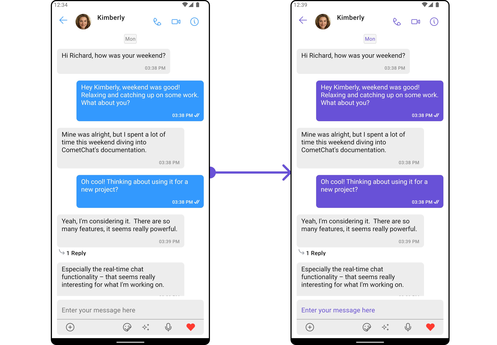
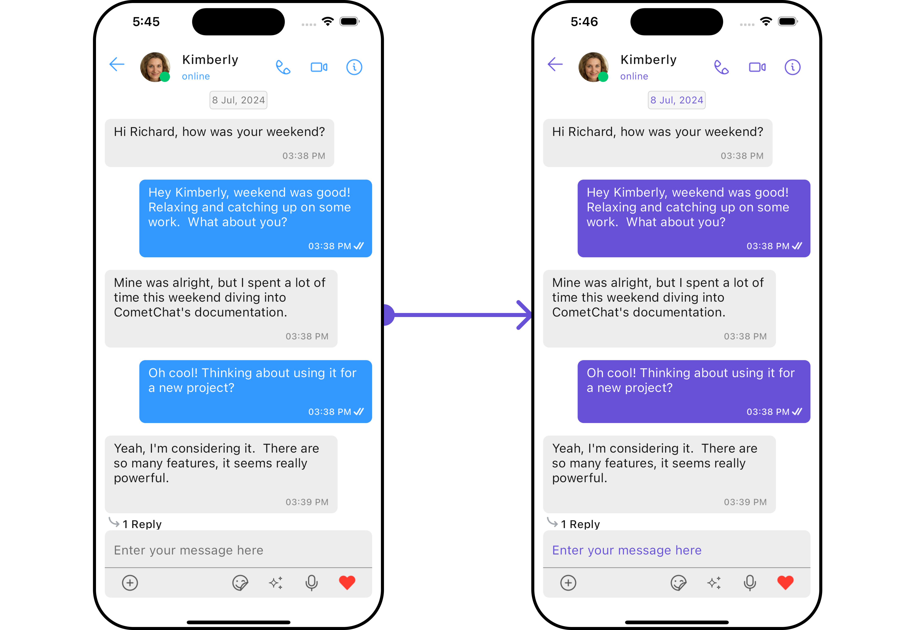
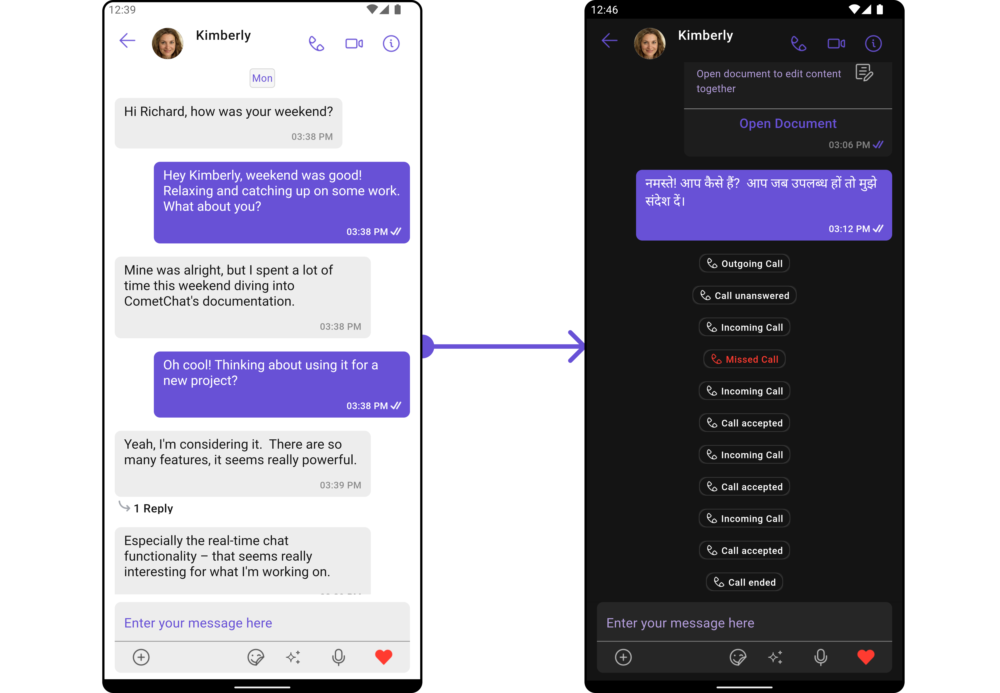
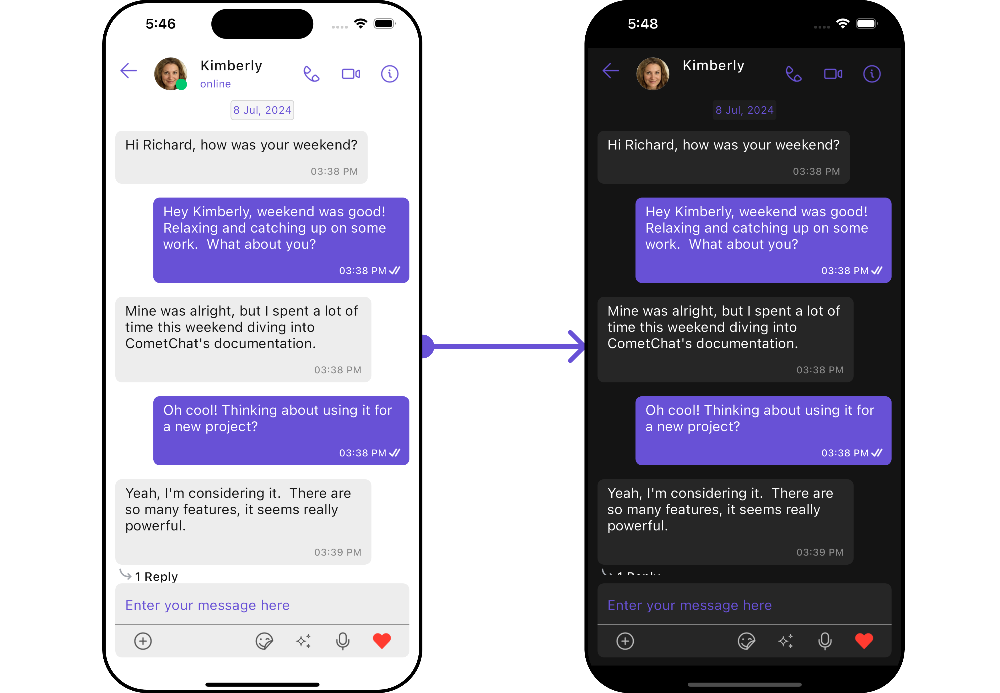
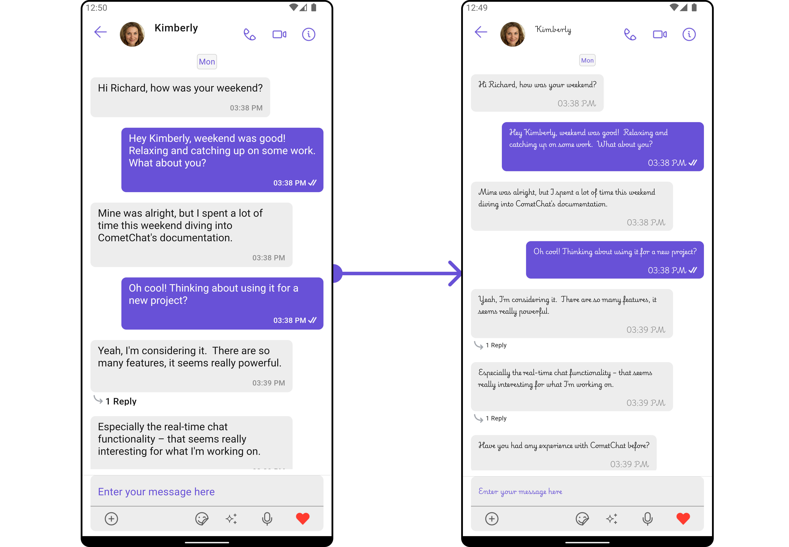
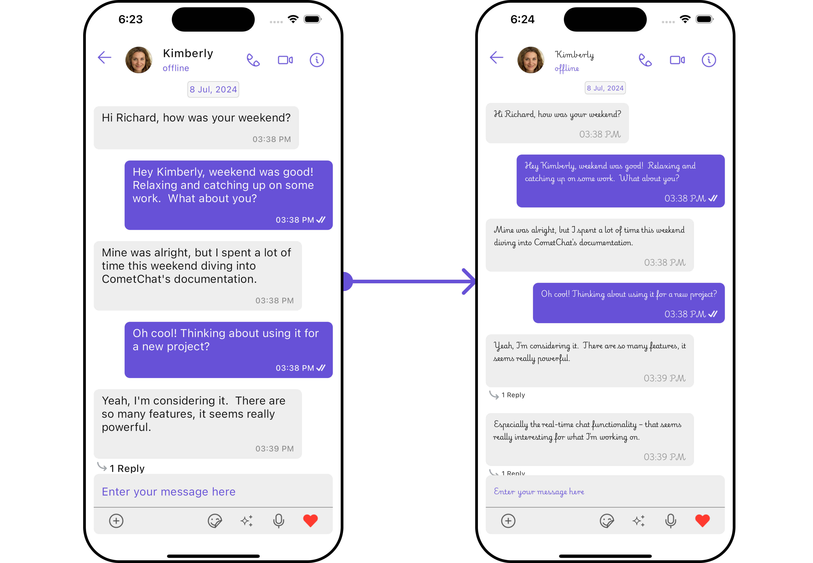

import Tabs from '@theme/Tabs';
import TabItem from '@theme/TabItem';

## Overview

The Theme is a style applied to every component of CometChat. When a style is applied as a theme, every view in the activity or every component in the UiKit will apply each property of the theme that it supports.

CometChat theme comprises two key components: Palette and Typography.

**Palette**: The Palette is a singleton class that possesses all the color variables with their default values. It can be used to customize the color scheme of the CometChat theme, including background color, primary and secondary colors, error color, and various levels of accent colors.

**Typography**: Typography, which is also a singleton class, encompasses all the default Text Style's values. It allows you to customize the text appearances throughout the CometChat theme, such as heading, name, titles, subtitles, text, and captions.
s

## Usage

### Palette

The CometChat UI kit provides an easy way to customize the visual appearance of your chat application via the Palette class. This class contains several methods that allow you to modify the default color scheme of your app, imparting a unique look and feel that aligns with your branding or design guidelines.

<Tabs>

<TabItem value="Dart" label="Dart">

```dart
//Color purple700 = Color(0xFF6851D6);

Palette palette = const Palette(
  mode: PaletteThemeModes.light,
  primary: PaletteModel(light: Color(0xFF6851D6), dark: Color(0xFF6851D6)),
  accent600: PaletteModel(light: Color(0xFF6851D6), dark: Color(0xFF6851D6)),
);

cometChatTheme = CometChatTheme(palette: palette, typography: defaultTypographyTheme);
```

</TabItem>

</Tabs>

<Tabs>

<TabItem value="Android" label="Android">



</TabItem>

<TabItem value="iOS" label="iOS">



</TabItem>

</Tabs>

Switching between Light and Dark modes in CometChat is quite simple by manipulating the mode property of the Palette class.

<Tabs>

<TabItem value="Dart" label="Dart">

```dart
//Color purple700 = Color(0xFF6851D6);

Palette palette = const Palette(
  mode: PaletteThemeModes.dark,
  primary: PaletteModel(light: Color(0xFF6851D6), dark: Color(0xFF6851D6)),
  accent600: PaletteModel(light: Color(0xFF6851D6), dark: Color(0xFF6851D6)),
);

cometChatTheme = CometChatTheme(palette: palette, typography: defaultTypographyTheme);
```

</TabItem>

</Tabs>

<Tabs>

<TabItem value="Android" label="Android">



</TabItem>

<TabItem value="iOS" label="iOS">



</TabItem>

</Tabs>

Here's an overview of the different Parameters available in the Palette class:

| Parameters        | Description                                                                    |
|------------------|--------------------------------------------------------------------------------|
| `mode`           | Light or dark mode, default is light.                                          |
| `backGroundColor`| List of gradient for background color.                                         |
| `primary`        | Primary color component with light and dark theme.                             |
| `secondary`      | Secondary color component with light and dark theme.                           |
| `error`          | Error color component with light and dark theme.                               |
| `success`        | Success color component with light and dark theme.                             |
| `accent`         | Accent color component used.                                                   |
| `option`         | Primary color component with light and dark theme.                             |
| `accent50`       | Optional parameter with accent color, light and dark theme, range 50.          |
| `accent100`      | Optional parameter with accent color, light and dark theme, range 100.         |
| `accent200`      | Optional parameter with accent color, light and dark theme, range 200.         |
| `accent300`      | Optional parameter with accent color, light and dark theme, range 300.         |
| `accent400`      | Optional parameter with accent color, light and dark theme, range 400.         |
| `accent500`      | Optional parameter with accent color, light and dark theme, range 500.         |
| `accent600`      | Optional parameter with accent color, light and dark theme, range 600.         |
| `accent700`      | Optional parameter with accent color, light and dark theme, range 700.         |
| `accent800`      | Optional parameter with accent color, light and dark theme, range 800.         |
| `primary200`     | Optional parameter with primary color, light and dark theme, range 200.        |
| `secondary900`   | Optional parameter with secondary color, light and dark theme, range 900.      |
| `tertiary`       | Tertiary color component with light and dark theme.                            |


### Typography

The Typography class provides methods that allow you to change the default text styles in the CometChat theme as per your requirements.

1. Import the CometChatTheme Typography

<Tabs>

<TabItem value="Dart" label="Dart">

```dart
import 'package:cometchat_uikit_shared/src/resources/themes/typography.dart' as cc;
```

</TabItem>

</Tabs>

2. To customize the typography within your CometChat theme, create a Typography object and then pass it to the `CometChatTheme` constructor.

<Tabs>

<TabItem value="Dart" label="Dart">

```dart
cc.Typography typographyObject =  cc.Typography(
    fontBasics: cometChatTheme.typography.fontBasics,
);

cometChatTheme = CometChatTheme(palette: palette, typography: typographyObject);
```

</TabItem>

</Tabs>

Here are some of the Parameters provided by the Typography class:


| Parameters | Type | Description | 
| ---- | ---- | ---- | 
| heading | FontStyle | Use to set **Heading** text Appearance. | 
| name | FontStyle | Use to set **Name** text Appearance. | 
| title1 | FontStyle | Use to set **Title 1** text Appearance. | 
| title2 | FontStyle | Use to set **Title 2** text Appearance. | 
| subtitle1 | FontStyle | Use to set **Subtitle 1** text Appearance. | 
| subtitle2 | FontStyle | Use to set **Subtitle 2** text Appearance. | 
| text1 | FontStyle | Use to set **Text 1**  text Appearance. | 
| text2 | FontStyle | Use to set **Text 2** text Appearance. | 
| caption1 | FontStyle | Use to set **Caption 1** text Appearance. | 
| caption2 | FontStyle | Use to set **Caption 2** text Appearance. | 
| body | FontStyle | Use to set **Body** text Appearance. | 

**Example**

<Tabs>

<TabItem value="Dart" label="Dart">

```dart
import 'package:cometchat_uikit_shared/src/resources/themes/typography.dart' as cc;

cc.Typography typographyObject =  cc.Typography(
    fontBasics: cometChatTheme.typography.fontBasics,
    heading: FontStyle(fontSize: 10, fontFamily: "PlaywritePL"),
    name: FontStyle(fontSize: 10, fontFamily: "PlaywritePL"),
    title1: FontStyle(fontSize: 10, fontFamily: "PlaywritePL"),
    title2: FontStyle(fontSize: 10, fontFamily: "PlaywritePL"),
    subtitle1: FontStyle(fontSize: 10, fontFamily: "PlaywritePL"),
    subtitle2: FontStyle(fontSize: 10, fontFamily: "PlaywritePL"),
    text1: FontStyle(fontSize: 10, fontFamily: "PlaywritePL"),
    text2: FontStyle(fontSize: 10, fontFamily: "PlaywritePL"),
    caption1: FontStyle(fontSize: 10, fontFamily: "PlaywritePL"),
    caption2: FontStyle(fontSize: 10, fontFamily: "PlaywritePL"),
    body: FontStyle(fontSize: 10, fontFamily: "PlaywritePL")
);

cometChatTheme = CometChatTheme(palette: cometChatTheme.palette, typography: typographyObject);
```

</TabItem>

</Tabs>

<Tabs>

<TabItem value="Android" label="Android">



</TabItem>

<TabItem value="iOS" label="iOS">



</TabItem>

</Tabs>


