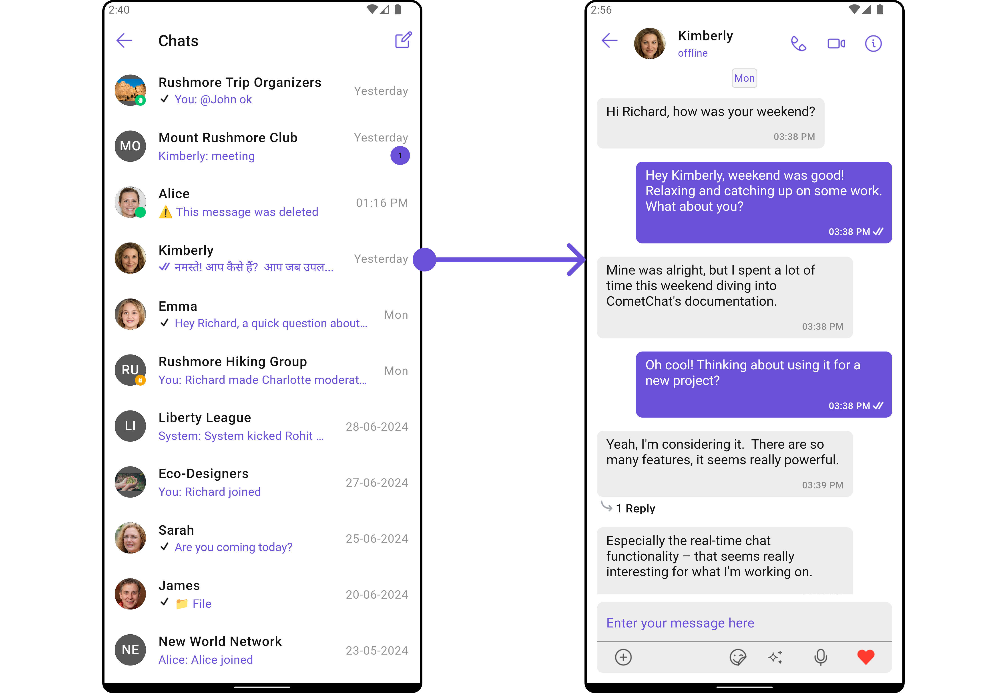
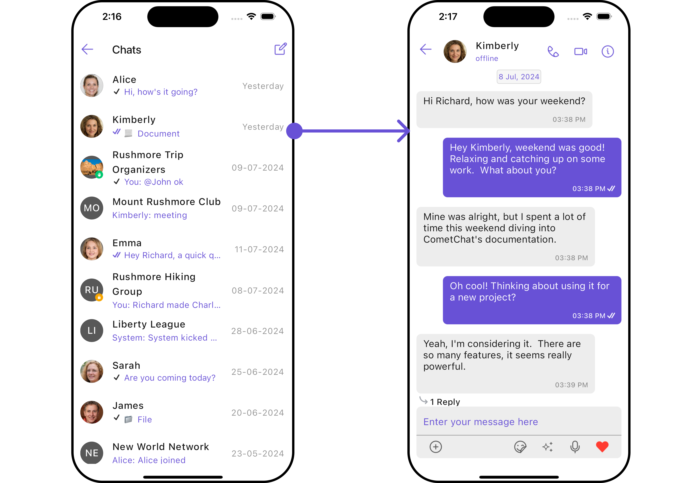
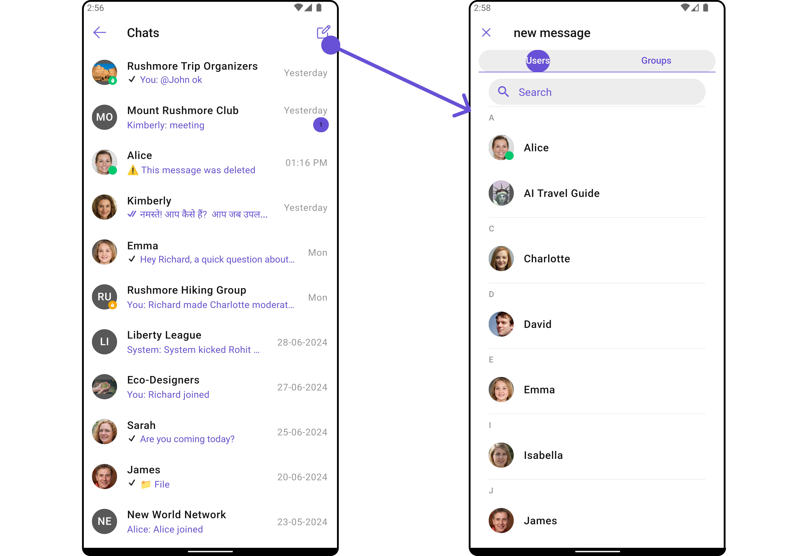
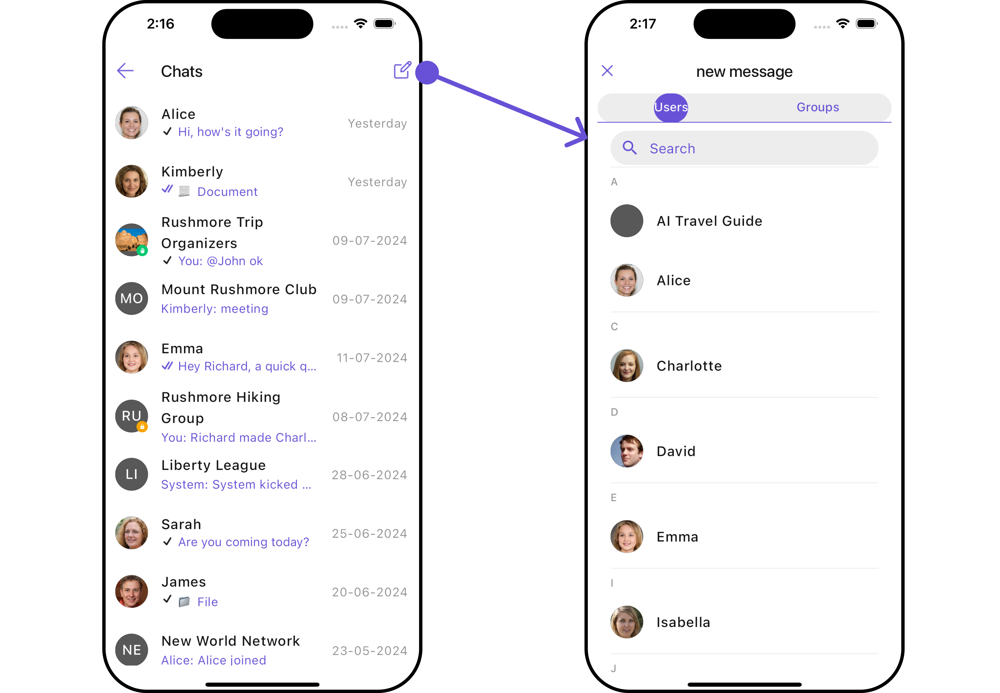
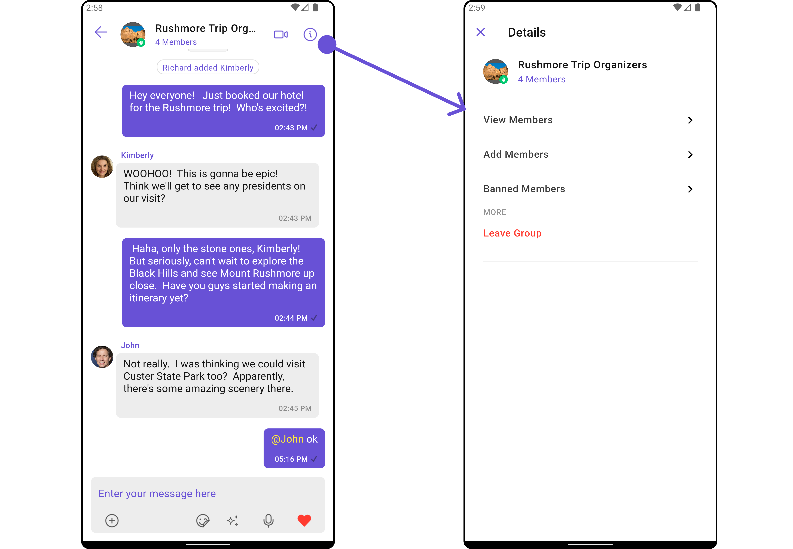
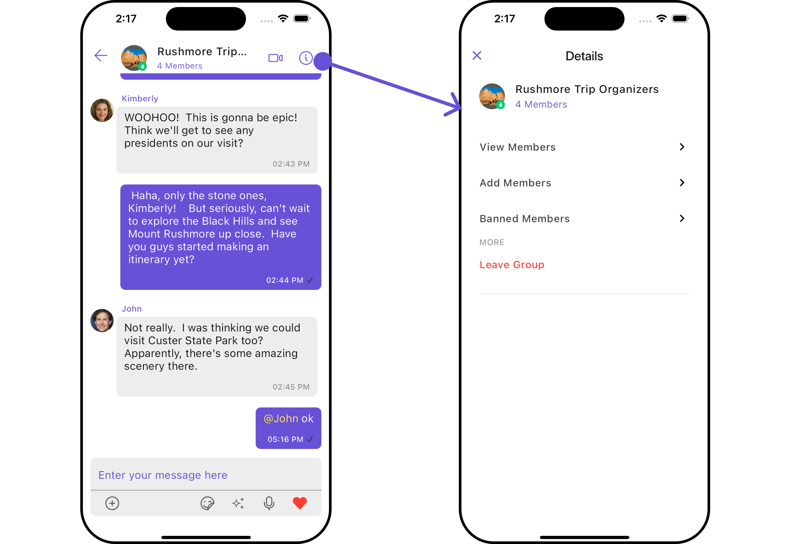
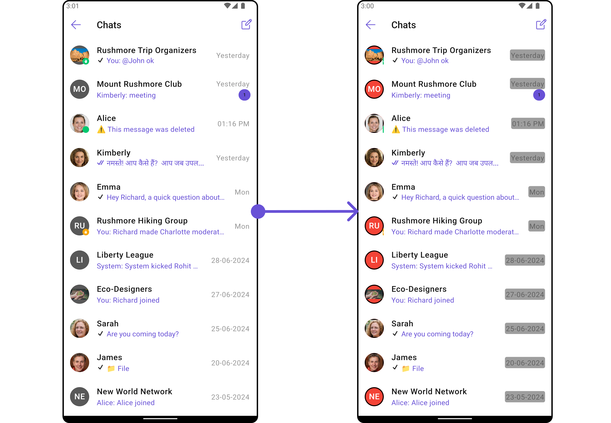
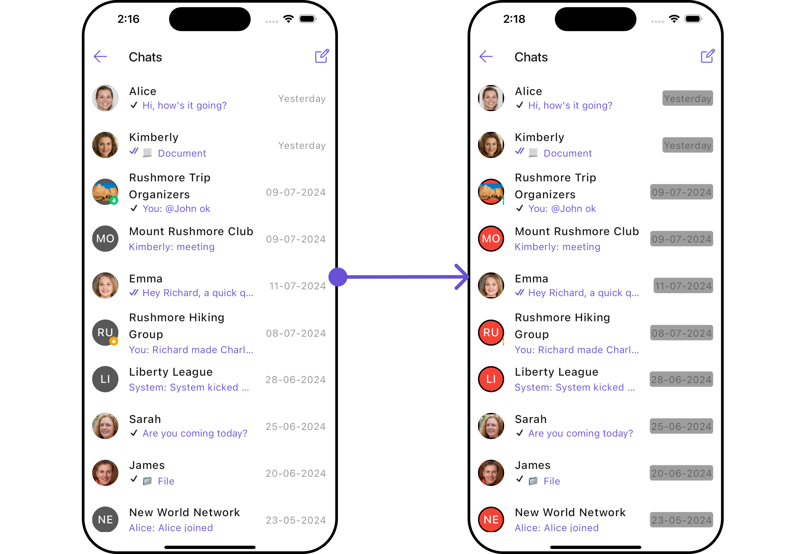

import Tabs from '@theme/Tabs';
import TabItem from '@theme/TabItem';

## Overview

The `CometChatConversationsWithMessages` is a [Composite Widget](/ui-kit/flutter/components-overview#components) encompassing widgets such as [Conversations](/ui-kit/flutter/conversations), [Messages](/ui-kit/flutter/messages), and [Contacts](/ui-kit/flutter/contacts). Each of these widgets contributes to the functionality and structure of the overall `CometChatConversationsWithMessages` widget.

<Tabs>

<TabItem value="Android" label="Android">



</TabItem>

<TabItem value="iOS" label="iOS">



</TabItem>

</Tabs>

| Widgets                                        | Description                                                                                                                                         |
| ---------------------------------------------- | --------------------------------------------------------------------------------------------------------------------------------------------------- |
| [Conversations](/ui-kit/flutter/conversations) | The `Conversations` widget is designed to display a list of either `User` or `Group`. This essentially represents your recent conversation history. |
| [Messages](/ui-kit/flutter/messages)           | The `Messages` widget is designed to manage the messaging interaction for either individual `User` or `Group` conversations.                        |
| [Contacts](/ui-kit/flutter/contacts)           | The `CometChatContacts` widget is specifically designed to facilitate the display and management of both `User` and `Groups`.                       |

## Usage

### Integration

Since `CometChatConversationsWithMessages` is a widget, it can be launched either by a button click or through any event's trigger. It inherits all the customizable properties and methods of `CometChatConversations.`

You can launch `CometChatConversationsWithMessages` directly using `Navigator.push`, or you can define it as a widget within the `build` method of your `State` class.

##### 1. Using Navigator to Launch `CometChatConversationsWithMessages`

<Tabs>

<TabItem value="Dart" label="Dart">

```dart
Navigator.push(context, MaterialPageRoute(builder: (context) => const CometChatConversationsWithMessages()));
```

</TabItem>

</Tabs>

##### 2. Embedding `CometChatConversationsWithMessages` as a Widget in the build Method

<Tabs>

<TabItem value="Dart" label="Dart">

```dart
import 'package:cometchat_chat_uikit/cometchat_chat_uikit.dart';
import 'package:flutter/material.dart';


class ConversationsWithMessages extends StatefulWidget {
  const ConversationsWithMessages({super.key});

  @override
  State<ConversationsWithMessages> createState() => _ConversationsWithMessagesState();
}

class _ConversationsWithMessagesState extends State<ConversationsWithMessages> {

  @override
  Widget build(BuildContext context) {
    return const Scaffold(
        body: SafeArea(
            child: CometChatConversationsWithMessages()
        )
    );
  }
}
```

</TabItem>

</Tabs>

List of properties exposed by `CometChatConversationsWithMessages`

| Property                         | Data Type                         | Description                                                    |
| -------------------------------- | --------------------------------- | -------------------------------------------------------------- |
| `user`                           | `User?`                           | The user object representing the current user.                 |
| `group`                          | `Group?`                          | The group object representing the current group.               |
| `theme`                          | `Theme?`                          | The theme object for customizing the appearance of the widget. |
| `conversationsConfiguration`     | `ConversationsConfiguration?`     | Configuration settings for the conversations list.             |
| `messageConfiguration`           | `MessageConfiguration?`           | Configuration settings for individual messages.                |
| `startConversationConfiguration` | `StartConversationConfiguration?` | Configuration settings for starting new conversations.         |

---

### Actions

[Actions](/ui-kit/flutter/components-overview#actions) dictate how a widget functions. They are divided into two types: Predefined and User-defined. You can override either type, allowing you to tailor the behavior of the widget to fit your specific needs.

While the `CometChatConversationsWithMessages` widget does not have its actions, its sub-widgets - [Conversation](/ui-kit/flutter/conversations#actions), [Messages](/ui-kit/flutter/messages), and [Contacts](/ui-kit/flutter/contacts) - each have their own set of actions.

The actions of these widgets can be overridden through the use of the [Configurations](#configurations) object of each widget. Here is an example code snippet.

<Tabs>

<TabItem value="Dart" label="Dart">

```dart
CometChatConversationsWithMessages(
  conversationsConfiguration: ConversationsConfiguration(
      onItemTap: (conversation) {
        // TODO("Not yet implemented")
      }
  ),
)
```

</TabItem>

</Tabs>

<Tabs>

<TabItem value="Android" label="Android">


</TabItem>

<TabItem value="iOS" label="iOS">


</TabItem>

</Tabs>

---

### Filters

**Filters** allow you to customize the data displayed in a list within a Widget. You can filter the list based on your specific criteria, allowing for a more customized. Filters can be applied using RequestBuilders of Chat SDK.

While the `CometChatConversationsWithMessages` widget does not have filters, its widgets do, For more detail on individual filters of its widget refer to [Conversations](/ui-kit/flutter/conversations#filters)[ Filters](/ui-kit/flutter/conversations#filters) and [Messages Filters](/ui-kit/flutter/messages).

By utilizing the [Configurations](#configurations) object of its widgets, you can apply filters.

In the following **example**, we're filtering Conversation to only show `User`

<Tabs>

<TabItem value="Dart" label="Dart">

```dart
CometChatConversationsWithMessages(
  conversationsConfiguration: ConversationsConfiguration(
    conversationsRequestBuilder: ConversationsRequestBuilder()
        ..limit = 5
        ..conversationType = "user"
  ),
)
```

</TabItem>

</Tabs>

---

### Events

[Events](/ui-kit/flutter/components-overview#events) are emitted by a `Widget`. By using event you can extend existing functionality. Being global events, they can be applied in Multiple Locations and are capable of being Added or Removed.

The `CometChatConversationsWithMessages` does not produce any events but its subwidget does. For a full list of these events, you can refer to [Conversations events](/ui-kit/flutter/conversations#events) and [Messages events](/ui-kit/flutter/messages#events).

In the following example, we're incorporating observers for the `ConversationDeleted` event of `Conversations` widget.

This `ccConversationDeleted` will be emitted when the user deletes a conversation

<Tabs>

<TabItem value="Dart" label="Dart">

```dart
import 'package:cometchat_chat_uikit/cometchat_chat_uikit.dart';

class _YourScreenState extends State<YourScreen> with CometChatConversationEventListener {

  @override
  void initState() {
    super.initState();
    CometChatConversationEvents.addConversationListListener("listenerId", this); // Add the listener
  }

  @override
  void dispose(){
    super.dispose();
    CometChatConversationEvents.removeConversationListListener("listenerId"); // Remove the listener
  }

  @override
  void ccConversationDeleted(Conversation conversation) {
    // TODO("Not yet implemented")
  }
}
```

</TabItem>

</Tabs>

---

## Customization

To fit your app's design requirements, you have the ability to customize the appearance of the `CometChatConversationsWithMessages` widget. We provide exposed methods that allow you to modify the experience and behavior according to your specific needs.

### Style

Using **Style** you can **customize** the look and feel of the widget in your app, These parameters typically control elements such as the **color**, **size**, **shape**, and **fonts** used within the widget.
CometChatConversationsWithMessages widget doesn't have its own style parameters. But you can customize its widget styles. For more details on individual widget styles, you can refer [Conversation Styles](/ui-kit/flutter/conversations#style), [Messages Styles](/ui-kit/flutter/messages#style), and [Contacts Styles](/ui-kit/flutter/contacts#contactsstyle)

Styles can be applied to SubWidgets using their respective [configurations](#configurations).

<Tabs>

<TabItem value="Dart" label="Dart">

```dart
CometChatConversationsWithMessages(
  conversationsConfiguration: ConversationsConfiguration(
      avatarStyle: AvatarStyle(
          border: Border.all(width: 2),
          borderRadius: 20,
          background: Colors.red
      ),
      statusIndicatorStyle: const StatusIndicatorStyle(
          borderRadius: 10,
          width: 2
      ),
      dateStyle: const DateStyle (
          contentPadding: EdgeInsets.all(2),
          background: Colors.grey
      )
  ),
)
```

</TabItem>

</Tabs>

### Functionality

These are a set of **small functional customizations** that allow you to **fine-tune** the overall experience of the widget. With these, you can **change text**, set **custom icons**, and toggle the **visibility** of UI elements.

##### Set User

You can utilize the `user` function with a [User](/sdk/flutter/user-management) object as input to `CometChatConversationsWithMessages`. This will automatically guide you to the [Messages](./messages) widget for the designated `User`.

<Tabs>

<TabItem value="Dart" label="Dart">

```dart
CometChatConversationsWithMessages(
  user: User(
    name: "",
    uid: "",
    avatar: ""
  ),
)
```

</TabItem>

</Tabs>

---

##### Set Group

You can utilize the `set(group: Group?)` function with a [Group](/sdk/flutter/groups-overview) object as input to `CometChatConversationsWithMessages`. This will automatically guide you to the [Messages](./messages) widget for the designated `Group`.

<Tabs>

<TabItem value="Dart" label="Dart">

```dart
CometChatConversationsWithMessages(
  group: Group(
    guid: "",
    name: "",
    type: ""
  ),
)
```

</TabItem>

</Tabs>

---

##### Widgets

Nearly all functionality customizations are available for the composite widget. Using [Configuration](#configurations), you can modify the properties of its widgets to suit your needs.

You can find the list of all Functionality customization of individual widgets in [Conversations](/ui-kit/flutter/conversations#functionality) , [Messages](/ui-kit/flutter/messages#functionality), and [Contacts](/ui-kit/flutter/contacts)

<Tabs>

<TabItem value="Dart" label="Dart">

```dart
CometChatConversationsWithMessages(
  conversationsConfiguration: ConversationsConfiguration(
    hideReceipt: true,
    title: "Your Title",
    hideSeparator: true,
    hideStartConversation: true,
    backButton: Icon(Icons.add_alert_outlined, color: Color(0xFF6851D6),)
  ),
)
```

</TabItem>

</Tabs>

---

### Advanced

For advanced-level customization, you can set custom views to the widget. This lets you tailor each aspect of the widget to fit your exact needs and application aesthetics. You can create and define your own widget and then incorporate those into the widget.

By utilizing the [Configuration](#configurations) object of each widget, you can apply advanced-level customizations to the ConversationsWithMessages.

<Tabs>

<TabItem value="Dart" label="Dart">

```dart
CometChatConversationsWithMessages(
  conversationsConfiguration: ConversationsConfiguration(),
)
```

</TabItem>

</Tabs>

To find all the details on individual Widget advance customization you can refer, [Conversations Advance](/ui-kit/flutter/conversations#advanced),[Messages Advance](/ui-kit/flutter/messages#advanced) and [Contacts Advance](/ui-kit/flutter/contacts)

ConversationsWithMessages uses advanced-level customization of both Conversation & Messages widgets to achieve its default behavior.

1. ConversationsWithMessages utilizes the [SetMenu](/ui-kit/flutter/conversations#appbaroptions) function of the `Conversations` subwidget to navigate the user from [Conversations](/ui-kit/flutter/conversations) to [Contacts](/ui-kit/flutter/contacts)

<Tabs>

<TabItem value="Android" label="Android">



</TabItem>

<TabItem value="iOS" label="iOS">



</TabItem>

</Tabs>

2. ConversationsWithMessages utilizes the [SetMenu](/ui-kit/flutter/message-header#appbaroptions) function of the `Messages` subwidget to navigate the user from [Messages](/ui-kit/flutter/messages) to [Details](/ui-kit/flutter/group-details).

<Tabs>

<TabItem value="Android" label="Android">



</TabItem>

<TabItem value="iOS" label="iOS">



</TabItem>

</Tabs>

---

## Configurations

[Configurations](/ui-kit/flutter/components-overview#configurations) offer the ability to customize the properties of each widget within a Composite Widget.

CometChatConversationsWithMessages has `Conversations`, `Messages`, and `Contacts` widget. Hence, each of these widgets will have its individual `Configuration``.

- `Configurations` expose properties that are available in its individual widgets.

#### Conversations

You can customize the properties of the Conversations widget by making use of the ConversationsConfiguration. You can accomplish this by employing the `.conversationsConfiguration` method as demonstrated below:

<Tabs>

<TabItem value="Dart" label="Dart">

```dart
CometChatConversationsWithMessages(
  conversationsConfiguration: ConversationsConfiguration(),
)
```

</TabItem>

</Tabs>

Example

<Tabs>

<TabItem value="Dart" label="Dart">

```dart
CometChatConversationsWithMessages(
  conversationsConfiguration: ConversationsConfiguration(
      avatarStyle: AvatarStyle(
          border: Border.all(width: 2),
          borderRadius: 20,
          background: Colors.red
      ),
      statusIndicatorStyle: const StatusIndicatorStyle(
          borderRadius: 10,
          width: 2
      ),
      dateStyle: const DateStyle (
          contentPadding: EdgeInsets.all(2),
          background: Colors.grey
      )
  ),
)
```

</TabItem>

</Tabs>

<Tabs>

<TabItem value="Android" label="Android">



</TabItem>

<TabItem value="iOS" label="iOS">



</TabItem>

</Tabs>

---
