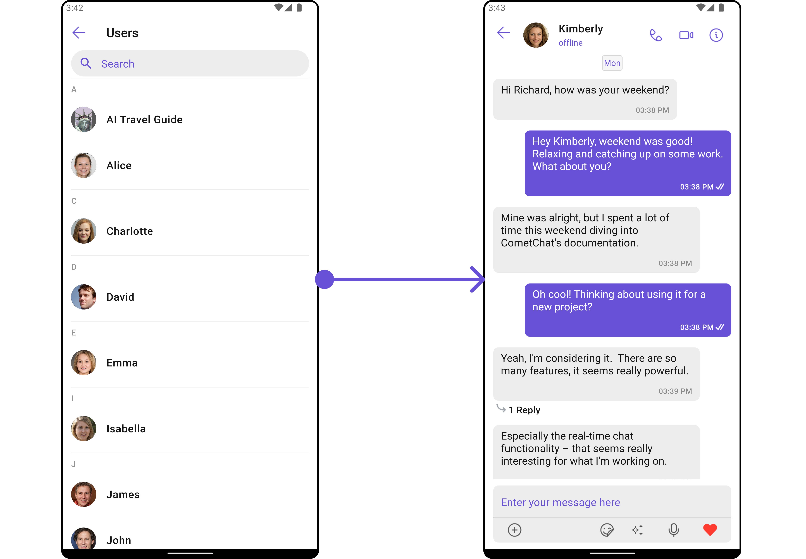
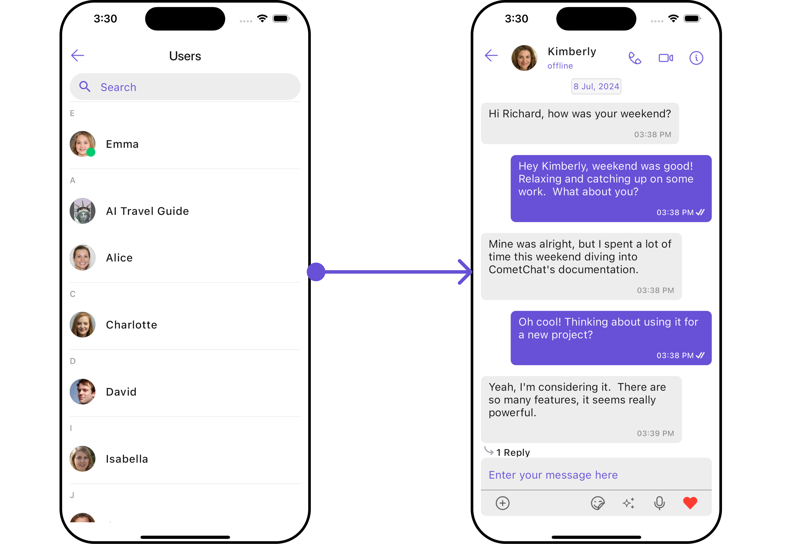
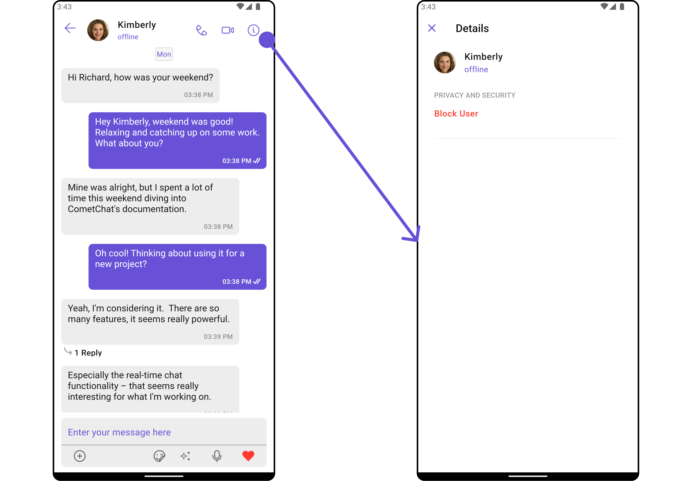
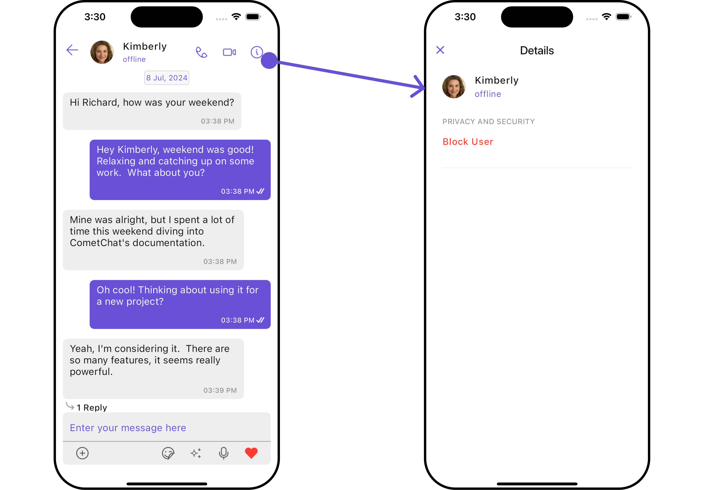
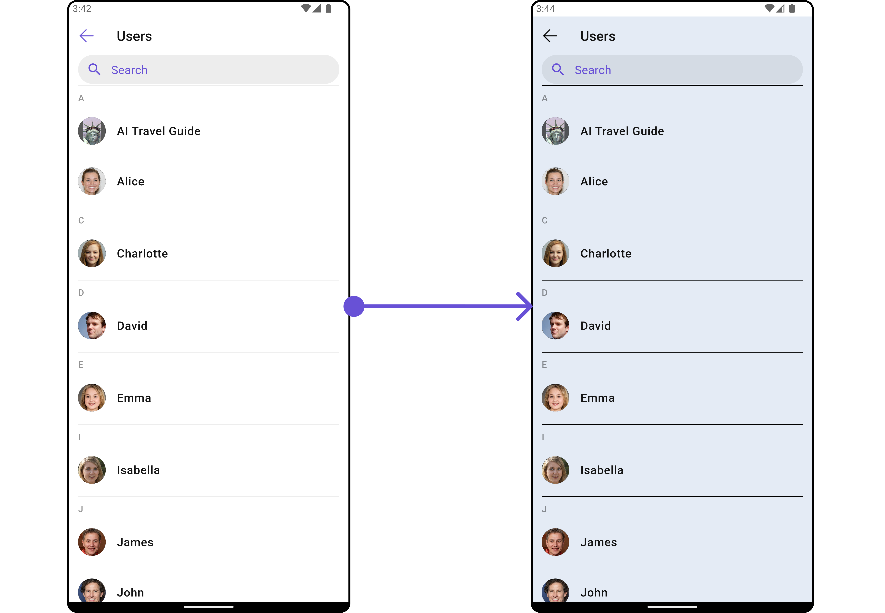
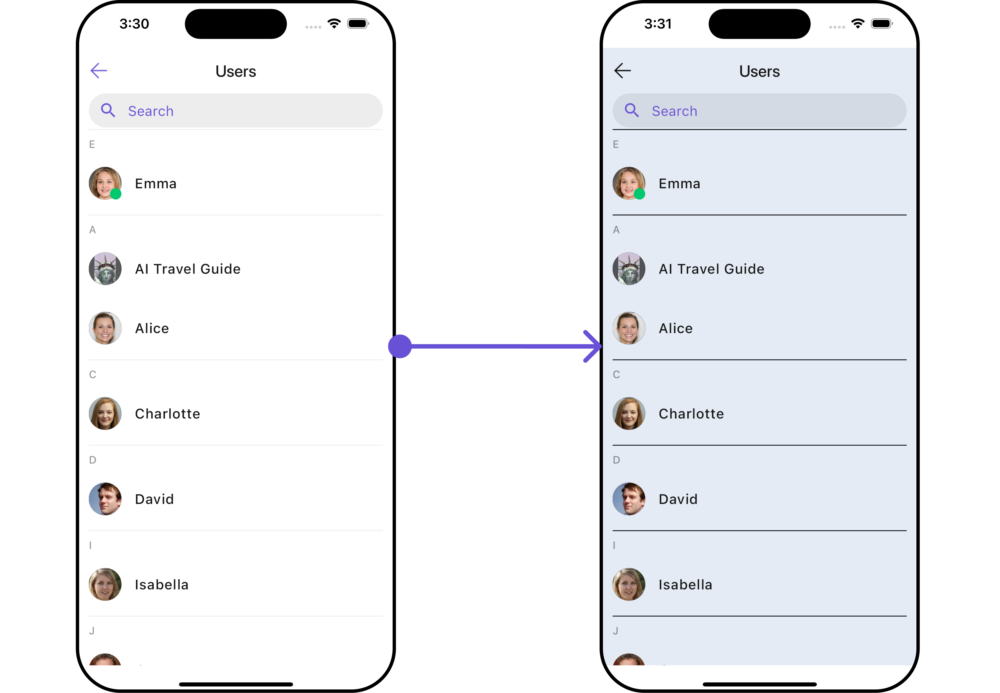
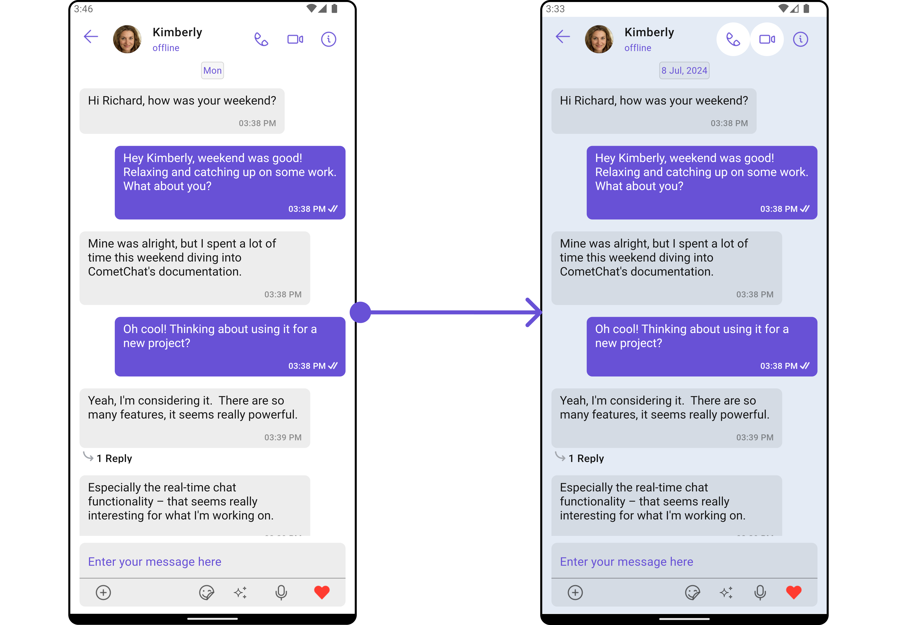
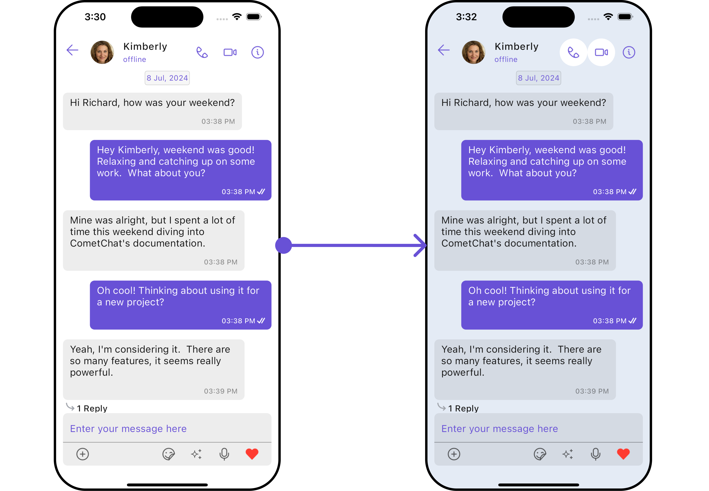

import Tabs from '@theme/Tabs';
import TabItem from '@theme/TabItem';
import { Tooltip } from 'react-tooltip'
import 'react-tooltip/dist/react-tooltip.css'

<Tooltip id="my-tooltip-html-prop" html="Not available in Group Members Configuration object"/>

## Overview

`CometChatUsersWithMessages` is a [Composite Widget](/ui-kit/flutter/components-overview#composite-components) that seamlessly merges the functionalities of both the [Users](/ui-kit/flutter/users) and [Messages](/ui-kit/flutter/messages) modules. It empowers users to effortlessly navigate to any individual's chat window by simply clicking on their respective **list item** in the user list.

Additionally, `CometChatUsersWithMessages` inherits and encompasses all attributes available within the `CometChatUsersWithMessages` module, ensuring a comprehensive user experience.

<Tabs>

<TabItem value="Android" label="Android">


</TabItem>

<TabItem value="iOS" label="iOS">


</TabItem>

</Tabs>

| Widget                               | Description                                                                                                           |
| ------------------------------------ | --------------------------------------------------------------------------------------------------------------------- |
| [Users](/ui-kit/flutter/users)       | Standalone screen displaying a searchable user list. Inherits from `CometChatListBase` and wraps `CometChatUserList`. |
| [Messages](/ui-kit/flutter/messages) | Chat interface for users and groups. Displays message list for logged-in user's interactions.                         |

## Usage

### Integration

Since `CometChatUsersWithMessages` is a widget, it can be launched either by a button click or through any event's trigger. It inherits all the customizable properties and methods of `CometChatUsers.`

You can launch `CometChatUsersWithMessages` directly using `Navigator.push`, or you can define it as a widget within the `build` method of your `State` class.

##### 1. Using Navigator to Launch `CometChatUsersWithMessages`

<Tabs>

<TabItem value="Dart" label="Dart">

```dart
Navigator.push(context, MaterialPageRoute(builder: (context) => const CometChatUsersWithMessages()));
```

</TabItem>

</Tabs>

##### 2. Embedding `CometChatUsersWithMessages` as a Widget in the build Method

<Tabs>

<TabItem value="Dart" label="Dart">

```dart
import 'package:cometchat_chat_uikit/cometchat_chat_uikit.dart';
import 'package:flutter/material.dart';

class UsersWithMessages extends StatefulWidget {
  const UsersWithMessages({super.key});

  @override
  State<UsersWithMessages> createState() => _UsersWithMessagesState();
}

class _UsersWithMessagesState extends State<UsersWithMessages> {

  @override
  Widget build(BuildContext context) {
    return Scaffold(
        body: SafeArea(
            child: CometChatUsersWithMessages()
        )
    );
  }
}
```

</TabItem>

</Tabs>

---

### Actions

[Actions](/ui-kit/flutter/components-overview#actions) dictate how a widget functions. They are divided into two types: Predefined and User-defined. You can override either type, allowing you to tailor the behavior of the widget to fit your specific needs.

---

##### 1. onItemTap

The `onItemTap` method is used to override the onClick behavior in `CometChatUsersWithMessages`.
This action does not come with any predefined behavior. However, you have the flexibility to override this event and tailor it to suit your needs using the following code snippet.

<Tabs>

<TabItem value="Dart" label="Dart">

```dart
CometChatUsersWithMessages(
    usersConfiguration: UsersConfiguration(
      onItemTap: (context, user) {
        // TODO("Not yet implemented")
      },
    )
)
```

</TabItem>

</Tabs>

---

##### 2. onItemLongPress

This method `onItemLongPress`, empowers users to customize long-click actions within `CometChatUsersWithMessages`, offering enhanced functionality and interaction possibilities.

<Tabs>

<TabItem value="Dart" label="Dart">

```dart
CometChatUsersWithMessages(
    usersConfiguration: UsersConfiguration(
      onItemLongPress: (context, user) {
        // TODO("Not yet implemented")
      },
    )
)
```

</TabItem>

</Tabs>

---

##### 3. onBack

This method allows users to override the onBack Pressed behavior in `CometChatUsersWithMessages` by utilizing the `onBack` , providing customization options for handling the back action.

By default, this action has a predefined behavior: it simply dismisses the current widget.
However, the flexibility of CometChat UI Kit allows you to override this standard behavior according to your application's specific requirements. You can define a custom action that will be performed instead when the back button is pressed.

<Tabs>

<TabItem value="Dart" label="Dart">

```dart
CometChatUsersWithMessages(
    usersConfiguration: UsersConfiguration(
      onBack: () {
        // TODO("Not yet implemented")
      },
    )
)
```

</TabItem>

</Tabs>

---

##### 4. onError

This method `onError`, allows users to override error handling within `CometChatUsersWithMessages`, providing greater control over error responses and actions.

<Tabs>

<TabItem value="Dart" label="Dart">

```dart
CometChatUsersWithMessages(
    usersConfiguration: UsersConfiguration(
      onError: (e) {
        // TODO("Not yet implemented")
      },
    )
)
```

</TabItem>

</Tabs>

---

##### 5. onSelection

When the `onSelection` event is triggered, it furnishes the list of selected users. This event can be invoked by any button or action within the interface. You have the flexibility to implement custom actions or behaviors based on the selected users.

This action does not come with any predefined behavior. However, you have the flexibility to override this event and tailor it to suit your needs using the following code snippet.

<Tabs>

<TabItem value="Dart" label="Dart">

```dart
CometChatUsersWithMessages(
    usersConfiguration: UsersConfiguration(
      onSelection: (userList, context) {
        // TODO("Not yet implemented")
      },
    )
)
```

</TabItem>

</Tabs>

---

### Filters

**Filters** allow you to customize the data displayed in a list within a widget. You can filter the list based on your specific criteria, allowing for a more customized. Filters can be applied using RequestBuilders of Chat SDK.

While the `CometChatUsersWithMessages` widget does not have filters, its widgets do, For more detail on individual filters of its widget refer to [Users Filters](/ui-kit/flutter/users)[ Messages Filters](/ui-kit/flutter/messages)

By utilizing the [Configurations](#configurations) object of its widgets, you can apply filters.

In the following **example**, we're sorting `Users` by `UID's` and setting the `limit` to 10 using the `UsersRequestBuilder`.

##### 1. UsersRequestBuilder

The [UsersRequestBuilder](/sdk/flutter/retrieve-users) enables you to filter and customize the user list based on available parameters in UsersRequestBuilder. This feature allows you to create more specific and targeted queries when fetching users. The following are the parameters available in [UsersRequestBuilder](/sdk/flutter/retrieve-users)

<Tabs>

<TabItem value="Dart" label="Dart">

```dart
CometChatUsersWithMessages(
    usersConfiguration: UsersConfiguration(
        usersRequestBuilder: UsersRequestBuilder()
          ..limit = 5
          ..uids = ["user_uid"]
    )
)
```

</TabItem>

</Tabs>

---

### Events

[Events](/ui-kit/flutter/components-overview#events) are emitted by a `Widget`. By using event you can extend existing functionality. Being global events, they can be applied in Multiple Locations and are capable of being Added or Removed.

The `CometChatUsersWithMessages` does not produce any events but its subwidget does.

---

## Customization

To fit your app's design requirements, you have the ability to customize the appearance of the
`CometChatUsersWithMessages` widget. We provide exposed methods that allow you to modify the experience and behavior according to your specific needs.

### Style

Using **Style** you can **customize** the look and feel of the widget in your app, These parameters typically control elements such as the **color**, **size**, **shape**, and **fonts** used within the widget.

##### 1. Users Style <a data-tooltip-id="my-tooltip-002-html-prop"> <span class="material-icons red">report</span> </a>

<Tooltip
  id="my-tooltip-002-html-prop"
  html="Not available "
/>

You can set the `UsersWithMessagesStyle` to the `CometChatUsersWithMessages` Widget to customize the styling.

Example

<Tabs>

<TabItem value="Dart" label="Dart">

```dart
CometChatUsersWithMessages(
    usersConfiguration: UsersConfiguration(
        usersStyle: UsersStyle(
            background: Color(0xFFE4EBF5),
            backIconTint: Colors.black,
            separatorColor: Colors.black
        )
    )
)
```

</TabItem>

</Tabs>

You can also customize its widget styles. For more details on individual widget styles, you can refer [Users Styles](/ui-kit/flutter/users) and [Messages Styles](/ui-kit/flutter/messages).

Styles can be applied to child widgets using their respective configurations.

---

### Functionality

Functionality is a set of **small functional customizations** that allow you to **fine-tune** the overall experience of the widget. With these, you can **change text**, set **custom icons**, and toggle the **visibility** of UI elements.

`CometChatUsersWithMessages` widget does not have any available functionality.

---

### Advanced

For advanced-level customization, you can set custom views to the component. This lets you tailor each aspect of the component to fit your exact needs and application aesthetics. You can create and define your own widget and then incorporate those into the component.

UsersWithMessages component does not have any advanced-level customization . You can use Advanced customisation its [Components](/ui-kit/flutter/components-overview#components). For more details on individual component functionalities, you can refer [Users Advanced](/ui-kit/flutter/users#advance) and [Messages Advanced](/ui-kit/flutter/messages#advanced).

<Tabs>

<TabItem value="Dart" label="Dart">

```dart
CometChatUsersWithMessages(
    usersConfiguration: UsersConfiguration()
)
```

</TabItem>

</Tabs>

UsersWithMessages uses advanced-level customization of both Users & Messages components to achieve its default behavior.

1. UsersWithMessages utilizes the [Itemclicklistener](/ui-kit/flutter/users#2-onitemtap) function of the `Users` subcomponent to navigate the [User](/ui-kit/flutter/users) to [Messages](/ui-kit/flutter/messages)

<Tabs>

<TabItem value="Android" label="Android">



</TabItem>

<TabItem value="iOS" label="iOS">



</TabItem>

</Tabs>

2. UsersWithMessages utilizes the [SetMenu](/ui-kit/flutter/users) function of the `Messages` subcomponent to navigatefrom [Messages](/ui-kit/flutter/messages) to Details.

<Tabs>

<TabItem value="Android" label="Android">



</TabItem>

<TabItem value="iOS" label="iOS">



</TabItem>

</Tabs>

---

## Configurations

[Configurations](/ui-kit/flutter/components-overview#configurations) offer the ability to customize the properties of each widget within a Composite widget.

**`CometChatUsersWithMessages`** has `Users` and `Messages` widget. Hence, each of these widgets will have its individual `Configuration``.

- `Configurations` expose properties that are available in its individual widgets.

#### Users

You can customize the properties of the Users widget by making use of the UsersConfiguration. You can accomplish this by employing the `.set(usersConfiguration: usersConfiguration)` method as demonstrated below:

<Tabs>

<TabItem value="Dart" label="Dart">

```dart
CometChatUsersWithMessages(
    usersConfiguration: UsersConfiguration()
)
```

</TabItem>

</Tabs>

All exposed properties of `UsersConfiguration` can be found under [Users](/ui-kit/flutter/users). Properties marked with the <a data-tooltip-id="my-tooltip-html-prop"><span class="material-icons red">report</span></a> symbol are not accessible within the Configuration Object.

**Example**

Let's say you want to change the style of the Users child widgets and, in addition, you only want to display users with offline status.

You can modify the style using the `UsersStyle` method and filter the list with the `UsersRequestBuilder` method.

<Tabs>

<TabItem value="Dart" label="Dart">

```dart
CometChatUsersWithMessages(
    usersConfiguration: UsersConfiguration(
        usersStyle: UsersStyle(
            background: Color(0xFFE4EBF5),
            backIconTint: Colors.black,
            separatorColor: Colors.black,
            searchBackground: Color(0xFFFAE6FA)
        )
    )
)
```

</TabItem>

</Tabs>

<Tabs>

<TabItem value="Android" label="Android">



</TabItem>

<TabItem value="iOS" label="iOS">



</TabItem>

</Tabs>

---

#### Messages

You can customize the properties of the Messages widget by making use of the `messagesConfiguration`. You can accomplish this by employing the `messagesConfiguration` as demonstrated below:

<Tabs>

<TabItem value="Dart" label="Dart">

```dart
CometChatUsersWithMessages(
    messageConfiguration: MessageConfiguration()
)
```

</TabItem>

</Tabs>

**Example**

<Tabs>

<TabItem value="Dart" label="Dart">

```dart
CometChatUsersWithMessages(
    messageConfiguration: MessageConfiguration(
        messagesStyle: MessagesStyle(
            background: Color(0xFFE4EBF5),
            borderRadius: 10,
        )
    )
)
```

</TabItem>

</Tabs>

<Tabs>

<TabItem value="Android" label="Android">



</TabItem>

<TabItem value="iOS" label="iOS">



</TabItem>

</Tabs>

---
