import Tabs from '@theme/Tabs';
import TabItem from '@theme/TabItem';
import { Tooltip } from 'react-tooltip'
import 'react-tooltip/dist/react-tooltip.css'

<Tooltip id="my-tooltip-html-prop" html="Not available in Group Members Configuration object"/>

## Overview

`CometChatDetails` functions as a standalone widgets designed to establish a screen displaying the details of a specific user or group object. It inherits all properties and methods from the `CometChatListBase` class, ensuring comprehensive functionality and customization options.

`CometChatDetails` internally implements the following functionalities:

- User Information: It displays details about the user. This includes his/her profile picture, name, status, and other relevant information.
- User Actions: The details screen provides actions to block/unblock the user.

<Tabs>

<TabItem value="Android" label="Android">

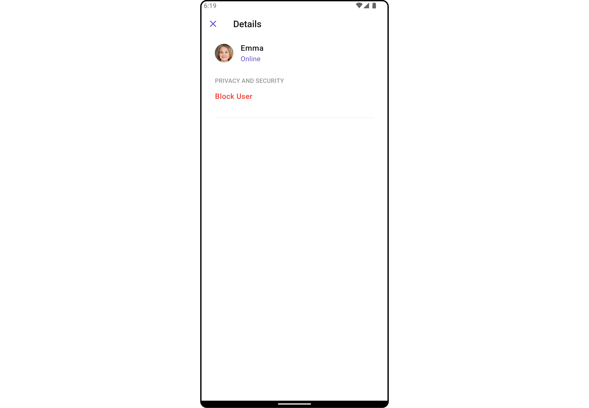

</TabItem>

<TabItem value="iOS" label="iOS">

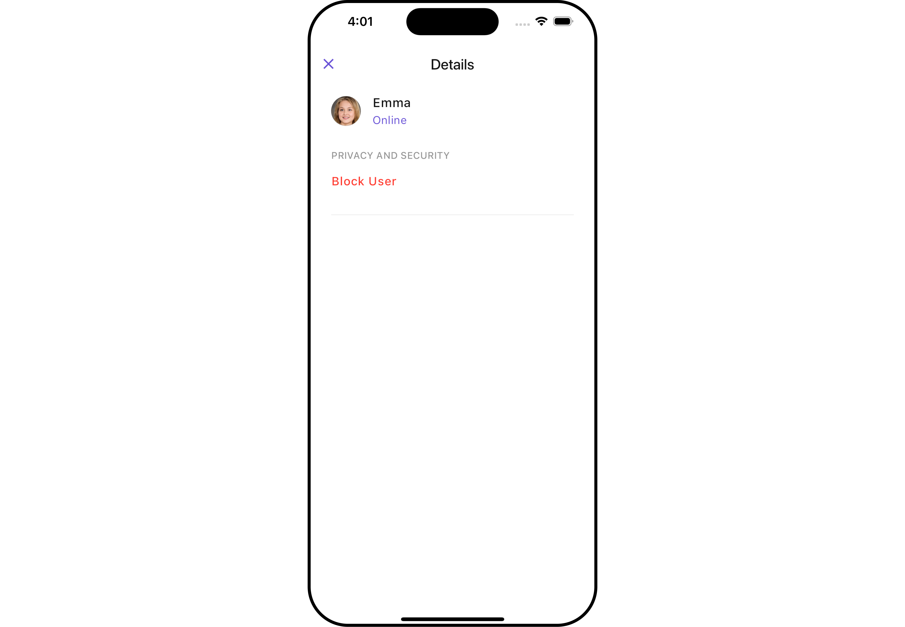

</TabItem>

</Tabs>

## Usage

### Integration

As `CometChatDetails` functions as a **widget**, it can be directly launched through a button click or any user-initiated action. Additionally, it can be seamlessly integrated into a tab view controller. `CometChatDetails` offers a range of parameters and methods for customizing its user interface.

You can launch `CometChatUsersWithMessages` directly using `Navigator.push`, or you can define it as a widget within the `build` method of your `State` class.

##### 1. Using Navigator to Launch `CometChatUsersWithMessages`

<Tabs>

<TabItem value="Dart" label="Dart">

```dart
Navigator.push(context, MaterialPageRoute(builder: (context) => CometChatDetails(
    user: User(
        uid: "uid",
        name: "name",
    ),
)));
```

</TabItem>

</Tabs>

##### 2. Embedding `CometChatUsersWithMessages` as a Widget in the build Method

<Tabs>

<TabItem value="Dart" label="Dart">

```dart
import 'package:cometchat_chat_uikit/cometchat_chat_uikit.dart';
import 'package:flutter/material.dart';

class UserDetails extends StatefulWidget {
  const UserDetails({super.key});

  @override
  State<UserDetails> createState() => _UserDetailsState();
}

class _UserDetailsState extends State<UserDetails> {

  @override
  Widget build(BuildContext context) {
    return Scaffold(
        body: SafeArea(
            child: CometChatDetails(
                user: User(
                    uid: "uid",
                    name: "name",
                ) // Required User object with name and UID (rest parameters optional)
            )
        )
    );
  }
}
```

</TabItem>

</Tabs>

### Actions

[Actions](/ui-kit/flutter/components-overview#actions) dictate how a widgets functions. They are divided into two types: Predefined and User-defined. You can override either type, allowing you to tailor the behavior of the widgets to fit your specific needs.

##### 1. onBack

The `onBack` event is typically triggered when the close button is clicked and it carries a default action. However, with the following code snippet, you can effortlessly override this default operation.

This action does not come with any predefined behavior. However, you have the flexibility to override this event and tailor it to suit your needs using the following code snippet.

<Tabs>

<TabItem value="Dart" label="Dart">

```dart
CometChatDetails(
  user: User(
      uid: "uid",
      name: "name"
  ),
  onBack: () {
    // TODO("Not yet implemented")
  },
)
```

</TabItem>

</Tabs>

##### 2. onError

This method `onError`, allows users to override error handling within `CometChatDetails`, providing greater control over error responses and actions.

<Tabs>

<TabItem value="Dart" label="Dart">

```dart
CometChatDetails(
  user: User(
      uid: "uid",
      name: "name"
  ),
  onError: (e) {
    // TODO("Not yet implemented")
  },
)
```

</TabItem>

</Tabs>

---

### Filters

**Filters** allow you to customize the data displayed in a list within a widget. You can filter the list based on your specific criteria, allowing for a more customized. Filters can be applied using RequestBuilders of Chat SDK.

`CometChatDetails` widgets does not have available filters.

---

### Events

[Events](/ui-kit/flutter/components-overview#events) are emitted by a widget. By using event you can extend existing functionality. Being global events, they can be applied in Multiple Locations and are capable of being Added or Removed.

To handle events supported by Users you have to add corresponding listeners by using `CometChatUserEvents`

| Events          | Description                                                           |
| --------------- | --------------------------------------------------------------------- |
| ccUserBlocked   | This will get triggered when the logged in user blocks another user   |
| ccUserUnblocked | This will get triggered when the logged in user unblocks another user |

<Tabs>

<TabItem value="Dart" label="Dart">

```dart
import 'package:cometchat_chat_uikit/cometchat_chat_uikit.dart';
import 'package:flutter/material.dart';

class YourScreen extends StatefulWidget {
  const YourScreen({super.key});

  @override
  State<YourScreen> createState() => _YourScreenState();
}

class _YourScreenState extends State<YourScreen> with CometChatUserEventListener {

  @override
  void initState() {
    super.initState();
    CometChatUserEvents.addUsersListener("listenerId", this);
  }

  @override
  void dispose(){
    super.dispose();
    CometChatUserEvents.removeUsersListener("listenerId");
  }

  @override
  void ccUserBlocked(User user) {
    // TODO("Not yet implemented")
  }

  @override
  void ccUserUnblocked(User user) {
    // TODO("Not yet implemented")
  }

  @override
  Widget build(BuildContext context) {
    return const Placeholder();
  }

}
```

</TabItem>

</Tabs>

---

## Customization

To fit your app's design requirements, you can customize the appearance of the details widget. We provide exposed methods that allow you to modify the experience and behavior according to your specific needs.

### Style

Using Style you can customize the look and feel of the widgets in your app, These parameters typically control elements such as the color, size, shape, and fonts used within the widget.

##### 1. Details Style

You can set the `DetailsStyle` to the User Detail Widget to customize the styling.

<Tabs>

<TabItem value="Dart" label="Dart">

```dart
CometChatDetails(
    user: User(
        uid: "uid",
        name: "name"
    ),
    detailsStyle: DetailsStyle(
        background: Color(0xFFE4EBF5),
        closeIconTint: Colors.black,
        titleStyle: TextStyle(fontFamily: "")
    )
)
```

</TabItem>

</Tabs>

<Tabs>

<TabItem value="Android" label="Android">

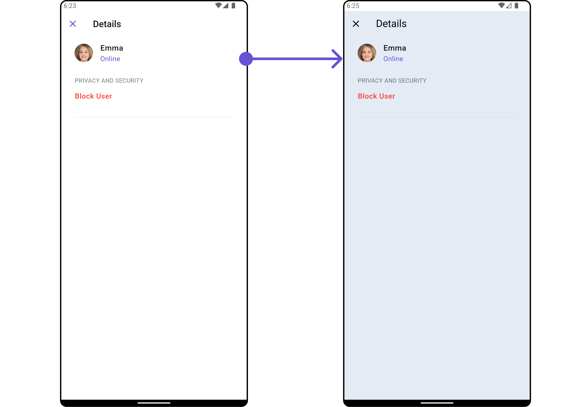

</TabItem>

<TabItem value="iOS" label="iOS">

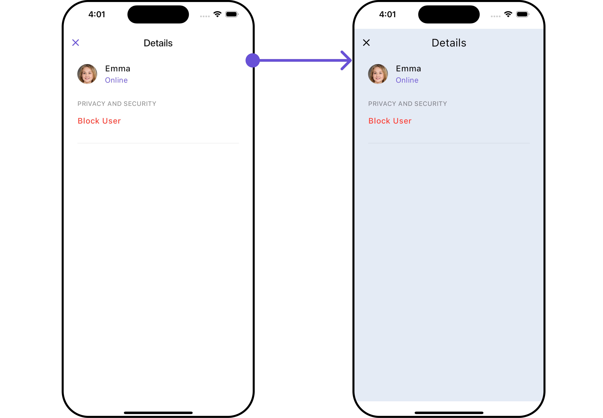

</TabItem>

</Tabs>

List of properties exposed by `DetailsStyle`

| Property                       | Data Type               | Description                                                                   |
| ------------------------------ | ----------------------- | ----------------------------------------------------------------------------- |
| `titleStyle`                   | `TextStyle?`            | Provides styling for the title text.                                          |
| `closeIconTint`                | `Color?`                | Provides color to the close button.                                           |
| `privateGroupIconBackground`   | `Color?`                | Provides background color for the status indicator if the group is private.   |
| `protectedGroupIconBackground` | `Color?`                | Provides background color for the status indicator if the group is protected. |
| `onlineStatusColor`            | `Color?`                | Sets the color for the online status indicator.                               |
| `width`                        | `double?`               | Width of the details widget.                                                  |
| `height`                       | `double?`               | Height of the details widget.                                                 |
| `background`                   | `Color?` or `Gradient?` | Background color or gradient of the details widget.                           |
| `gradient`                     | `Gradient?`             | Gradient background of the details widget.                                    |
| `border`                       | `Border?`               | Border of the details widget.                                                 |

---

##### 2. Avatar Style

To apply customized styles to the `Avatar` widget in the `CometChatDetails` widget, you can use the following code snippet. For further insights on **Avatar** Styles [refer](/ui-kit/flutter/avatar)

<Tabs>

<TabItem value="Dart" label="Dart">

```dart
CometChatDetails(
    user: User(
        uid: "uid",
        name: "name",
    ),
    avatarStyle: AvatarStyle(
        border: Border.all(width: 3),
        borderRadius: 20,
        background: Colors.yellow
    ),
)
```

</TabItem>

</Tabs>

---

##### 3. StatusIndicator Style

To apply customized styles to the `StatusIndicator` widget in the `CometChatDetails` widget, You can use the following code snippet. For further insights on Status Indicator Styles [refer](/ui-kit/flutter/status-indicator)

<Tabs>

<TabItem value="Dart" label="Dart">

```dart
CometChatDetails(
  user: User(
      uid: "uid",
      name: "name",
      status: "Online"
  ),
  statusIndicatorStyle: const StatusIndicatorStyle(
      borderRadius: 10,
      gradient: LinearGradient(colors: [Colors.red, Colors.orange], begin: Alignment.topLeft, end: Alignment.bottomRight)
  ),
)
```

</TabItem>

</Tabs>

---

##### 4. ListItem Style

To apply customized styles to the List Item widget in the `CometChatDetails` widget, You can use the following code snippet. For further insights on List Item Styles [refer](/ui-kit/flutter/list-item)

<Tabs>

<TabItem value="Dart" label="Dart">

```dart
CometChatDetails(
  user: User(
      uid: "uid",
      name: "name",
      status: "Online"
  ),
  listItemStyle: ListItemStyle(
    titleStyle: TextStyle(color: Colors.red),
    separatorColor: Colors.red,
    border: Border.all(width: 2, color: Colors.red),
    padding: EdgeInsets.only(left: 10)
  ),
)
```

</TabItem>

</Tabs>

---

### Functionality

These are a set of small functional customizations that allow you to fine-tune the overall experience of the widget. With these, you can change text, set custom icons, and toggle the visibility of UI elements.

<Tabs>

<TabItem value="Dart" label="Dart">

```dart
CometChatDetails(
  user: User(
      uid: "uid",
      name: "name",
      status: "Online"
  ),
  hideProfile: true,
  showCloseButton: false,
  title: "Your Title",
)
```

</TabItem>

</Tabs>

<Tabs>

<TabItem value="Android" label="Android">

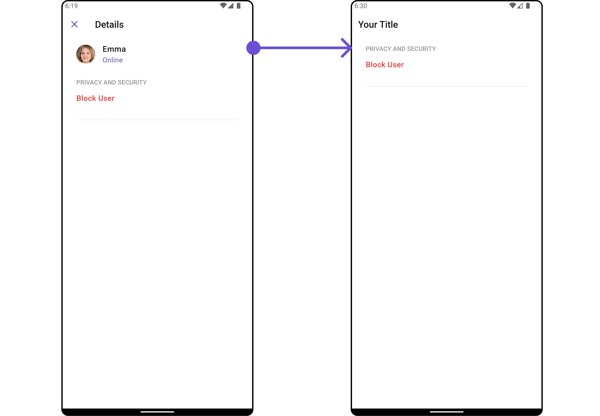

</TabItem>

<TabItem value="iOS" label="iOS">

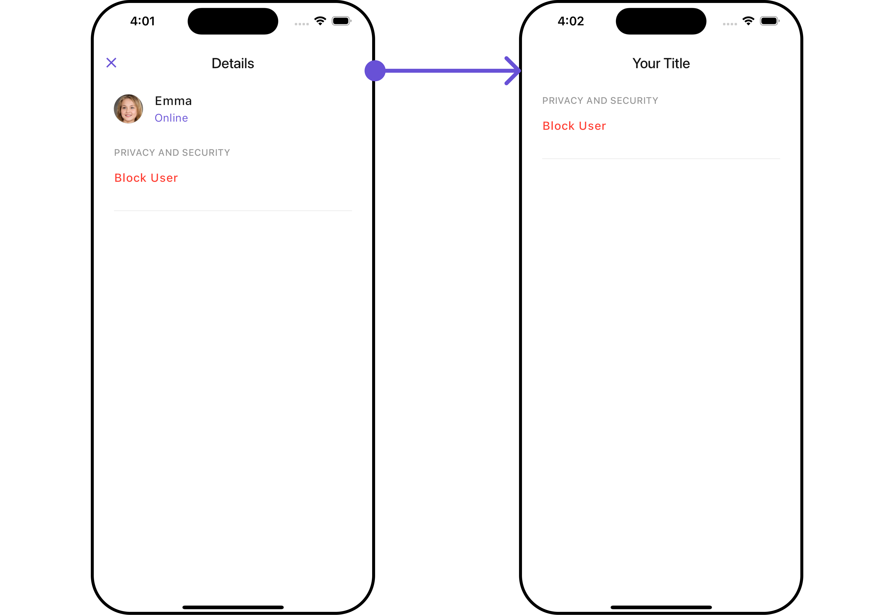

</TabItem>

</Tabs>

---

### Advance

For advanced-level customization, you can set custom views to the widget. This lets you tailor each aspect of the widgets to fit your exact needs and application aesthetics. You can create and define your own widget and then incorporate those into the widget.

---

#### SubTitleView

You can customize the subtitle view for each item to meet your specific preferences and needs.

<Tabs>

<TabItem value="Dart" label="Dart">

```dart
CometChatDetails(
  user: User(
      uid: "uid",
      name: "name",
      status: "Online"
  ),
  subtitleView: ({BuildContext? context, Group? group, User? user}) {
    return const Row(
      children: [
        Icon(Icons.call, color: Color(0xFF6851D6), size: 25,),
        SizedBox(width: 10),
        Icon(Icons.video_call, color: Color(0xFF6851D6), size: 25,),
      ],
    );
  }
)
```

</TabItem>

</Tabs>

<Tabs>

<TabItem value="Android" label="Android">

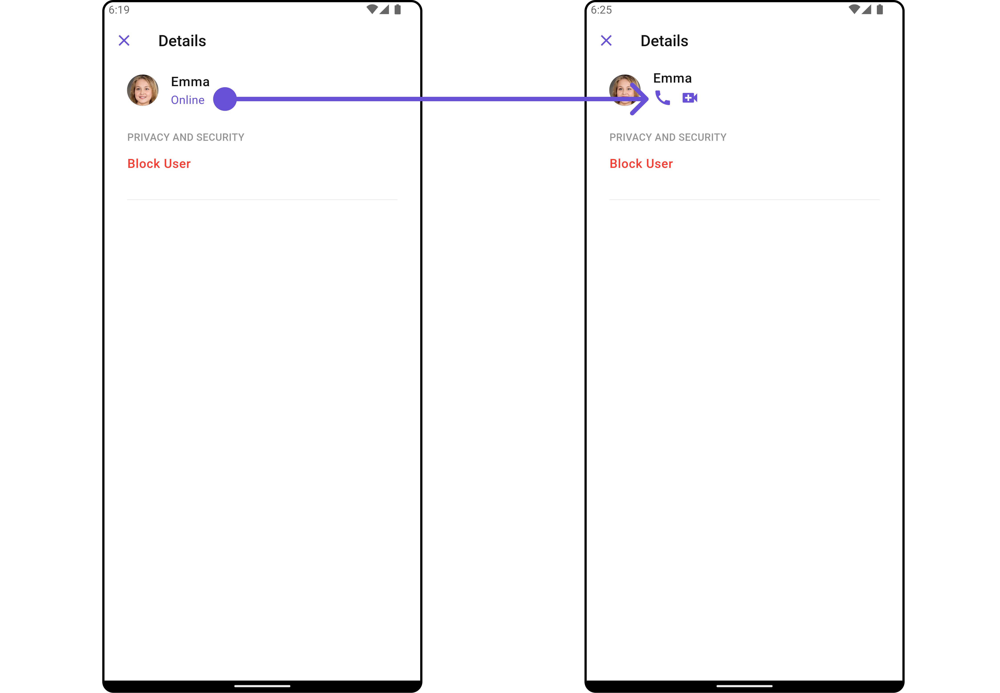

</TabItem>

<TabItem value="iOS" label="iOS">

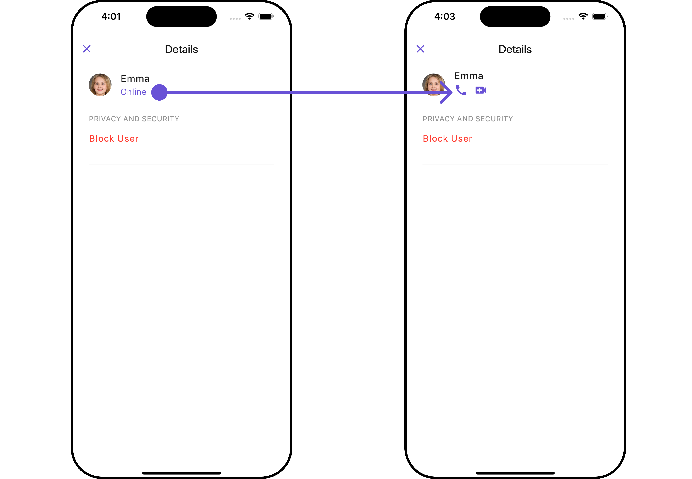

</TabItem>

</Tabs>

---

#### CustomProfileView <a data-tooltip-id="my-tooltip-005-html-prop"> <span class="material-icons red">report</span> </a> <Tooltip id="my-tooltip-005-html-prop" html="Not available"/>

Tailor the custom profile view for each user item to suit your specific preferences and needs.

<Tabs>

<TabItem value="Dart" label="Dart">

```dart
CometChatDetails(
  user: User(
      uid: "uid",
      name: "name",
      status: "Online"
  ),
  customProfileView: Container(
    height: 80,
    width: MediaQuery.of(context).size.width,
    decoration: BoxDecoration(
        color: Color(0xFFE4EBF5),
        border: Border.all(width: 1, color: Colors.black)
    ),
    child: Center(
        child: Text("Your Custom Profile View")
    ),
  ),
)
```

</TabItem>

</Tabs>

<Tabs>

<TabItem value="Android" label="Android">

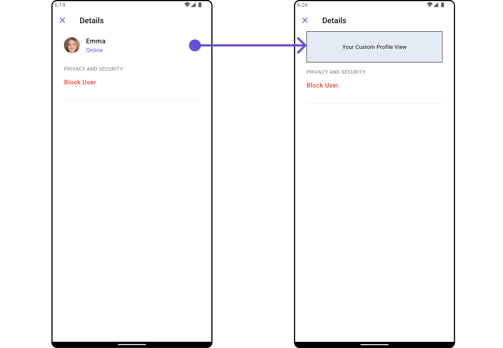

</TabItem>

<TabItem value="iOS" label="iOS">

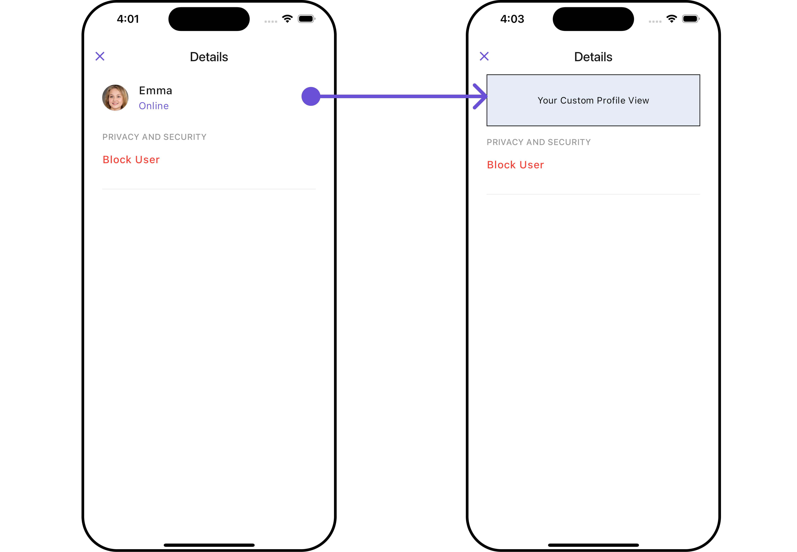

</TabItem>

</Tabs>

---

#### DetailsOption

The `CometChatDetailsOption` defines the structure for individual options within the CometChat details widget, facilitating customization and functionality for user interactions.

<Tabs>

<TabItem value="Dart" label="Dart">

```dart
CometChatDetailsOption option = CometChatDetailsOption(
    id: "OPTION_ID",
    onClick: (user, group, section, state) {},
    tail: Icon(
        Icons.abc_rounded,
        color: Colors.pink,
    ),
    title: "CUSTOM OPTION",
    titleStyle: TextStyle(
        backgroundColor: Colors.lightBlue.shade200,
        fontWeight: FontWeight.bold
    ),
    icon: AssetConstants.heart,
    packageName: UIConstants.packageName
);
```

</TabItem>

</Tabs>

This defines the structure of each option for a template in the details widget.

| Property      | Data Type                                                                                       | Description                                                     |
| ------------- | ----------------------------------------------------------------------------------------------- | --------------------------------------------------------------- |
| `customView`  | `Widget?`                                                                                       | Custom view widget for the details option.                      |
| `tail`        | `Widget?`                                                                                       | Tail widget for the details option.                             |
| `height`      | `double?`                                                                                       | Height of the details option.                                   |
| `onClick`     | `Function(User? user, Group? group, String section, CometChatDetailsControllerProtocol state)?` | Callback function triggered when the details option is clicked. |
| `id`          | `String`                                                                                        | Unique identifier for the details option.                       |
| `title`       | `String?`                                                                                       | Title of the details option.                                    |
| `icon`        | `String?`                                                                                       | URL or asset name for the icon of the details option.           |
| `packageName` | `String?`                                                                                       | Package name associated with the details option.                |
| `titleStyle`  | `TextStyle?`                                                                                    | Text style for the title of the details option.                 |

---

#### DetailsTemplate <a data-tooltip-id="my-tooltip-005-html-prop"> <span class="material-icons red">report</span> </a> <Tooltip id="my-tooltip-005-html-prop" html="Not available"/>

The `CometChatDetailsTemplate` offers a structure for organizing information in the CometChat details widget. It serves as a blueprint, defining how user-related details are presented. This structure allows for customization and organization within the CometChat interface.

<Tabs>

<TabItem value="Dart" label="Dart">

```dart
CometChatDetailsTemplate template = CometChatDetailsTemplate(
    id: "TEMPLATE_ID",
    hideItemSeparator: false,
    hideSectionSeparator: false,
    itemSeparatorColor: Colors.deepOrange,
    sectionSeparatorColor: Colors.pink,
    title: "CUSTOM TEMPLATE",
    titleStyle: TextStyle(
        backgroundColor: Colors.yellow,
        fontWeight: FontWeight.bold
    ),
    options: (user, group, context, theme) => [option],
);

```

</TabItem>

</Tabs>

##### Complete Example of Options and Template

<Tabs>

<TabItem value="Dart" label="Dart">

```dart
CometChatDetails(
  user: User(
      uid: "uid",
      name: "name",
      status: "Online"
  ),
  data: (group, user) {
    //Create Options
    CometChatDetailsOption option = CometChatDetailsOption(
        id: "OPTION_ID",
        onClick: (user, group, section, state) {},
        tail: Icon(
          Icons.abc_rounded,
          color: Colors.pink,
        ),
        title: "CUSTOM OPTION",
        titleStyle: TextStyle(
            backgroundColor: Colors.lightBlue.shade200,
            fontWeight: FontWeight.bold
        ),
        icon: AssetConstants.heart,
        packageName: UIConstants.packageName
    );

    //Create Template and add the options in it
    CometChatDetailsTemplate template = CometChatDetailsTemplate(
      id: "TEMPLATE_ID",
      hideItemSeparator: false,
      hideSectionSeparator: false,
      itemSeparatorColor: Colors.deepOrange,
      sectionSeparatorColor: Colors.pink,
      title: "CUSTOM TEMPLATE",
      titleStyle: TextStyle(
          backgroundColor: Colors.yellow,
          fontWeight: FontWeight.bold
      ),
      options: (user, group, context, theme) => [option],
    );

    //Return the template list
    return [template];
  },
)
```

</TabItem>

</Tabs>

<Tabs>

<TabItem value="Android" label="Android">

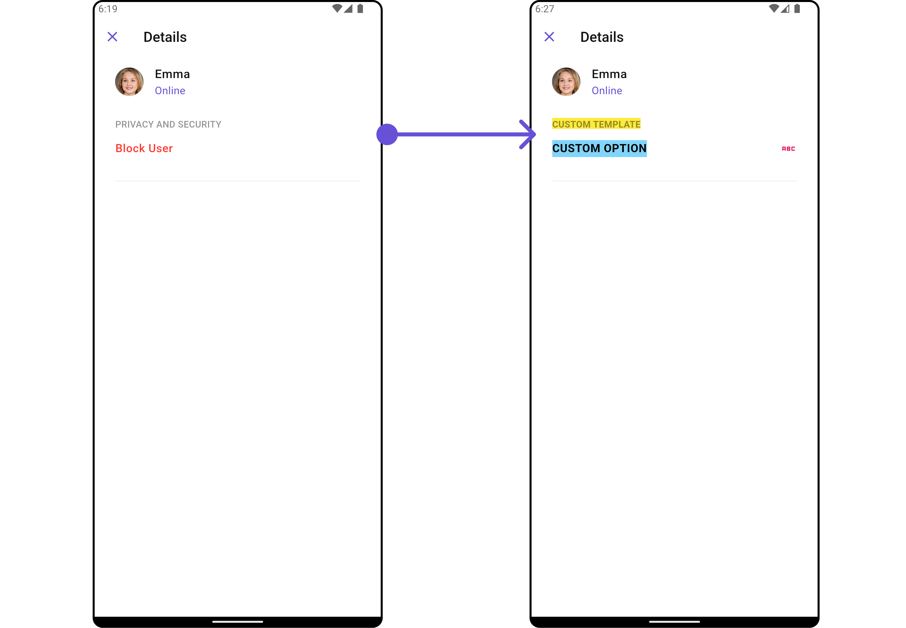

</TabItem>

<TabItem value="iOS" label="iOS">

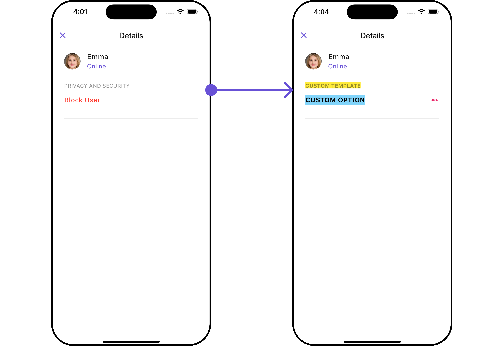

</TabItem>

</Tabs>

---
