import Tabs from '@theme/Tabs';
import TabItem from '@theme/TabItem';
import { Tooltip } from 'react-tooltip'
import 'react-tooltip/dist/react-tooltip.css'

<Tooltip id="my-tooltip-html-prop" html="Not available in Group Members Configuration object"/>

## Overview

`CometChatGroupsWithMessages` is a [Composite Widget](/ui-kit/flutter/components-overview#composite-components) encapsulating functionalities from the [Groups](/ui-kit/flutter/groups) and [Messages](/ui-kit/flutter/messages) widgets. Serving as a versatile wrapper, it seamlessly integrates with `CometChatMessages`, enabling users to open the module by clicking on any group within the list. This widget inherits the behavior of Groups, fostering consistency and familiarity in user interactions.

<Tabs>

<TabItem value="Android" label="Android">

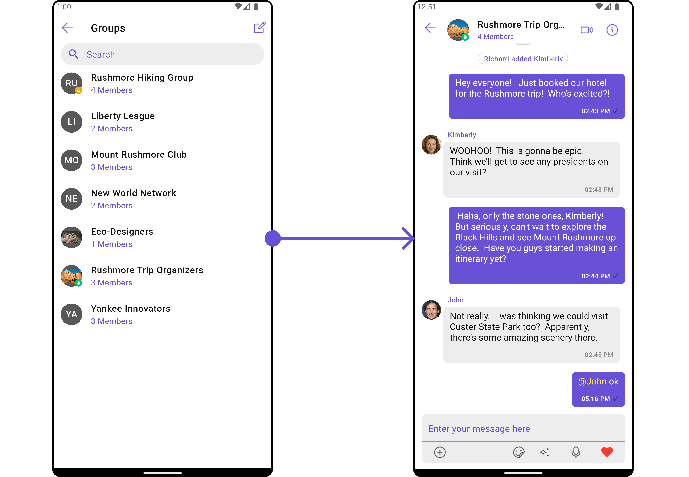

</TabItem>

<TabItem value="iOS" label="iOS">

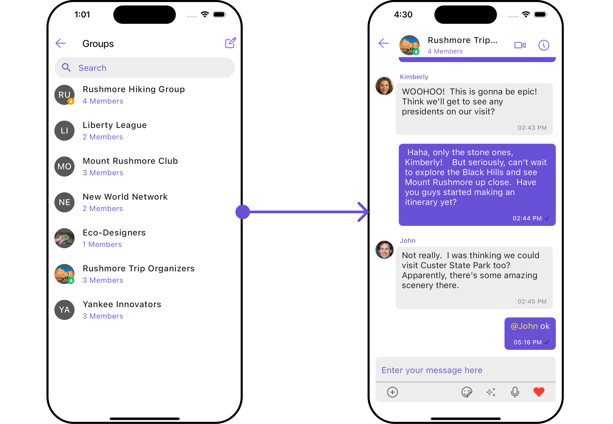

</TabItem>

</Tabs>

| Widgets                       | Description                                                                                                                    |
| -------------------------------- | ------------------------------------------------------------------------------------------------------------------------------ |
| [Groups](/ui-kit/flutter/groups)     | The `Groups` widget is designed to display a list of `Groups`. This essentially represents the recent conversation history. |
| [Messages](/ui-kit/flutter/messages) | The `Messages` widget is designed to manage the messaging interaction for `Group's` conversations.                          |

## Usage

### Integration

As `CometChatGroupsWithMessages` is a widget, it can be effortlessly added directly in response to a button click or any event. Leveraging all the customizable properties and methods inherited from Groups, this widget offers seamless integration and extensive customization capabilities. This makes it a versatile solution for enhancing user interaction within your application.

You can launch `CometChatGroupsWithMessages` directly using `Navigator.push`, or you can define it as a widget within the `build` method of your `State` class.

##### 1. Using Navigator to Launch `CometChatGroupsWithMessages`

<Tabs>

<TabItem value="Dart" label="Dart">

```dart
Navigator.push(context, MaterialPageRoute(builder: (context) => const CometChatGroupsWithMessages()));
```

</TabItem>

</Tabs>

##### 2. Embedding `CometChatGroupsWithMessages` as a Widget in the build Method

<Tabs>

<TabItem value="Dart" label="Dart">

```dart
import 'package:cometchat_chat_uikit/cometchat_chat_uikit.dart';
import 'package:flutter/material.dart';

class CometChatGroupsWithMessages extends StatefulWidget {
  const CometChatGroupsWithMessages({super.key});

  @override
  State<CometChatGroupsWithMessages> createState() => _CometChatGroupsWithMessagesState();
}

class _CometChatGroupsWithMessagesState extends State<CometChatGroupsWithMessages> {

  @override
  Widget build(BuildContext context) {
    return const Scaffold(
        body: SafeArea(
            child: CometChatGroupsWithMessages()
        )
    );
  }
}
```

</TabItem>

</Tabs>

---

### Actions

[Actions](/ui-kit/flutter/components-overview#actions) dictate how a widget functions. They are divided into two types: Predefined and User-defined. You can override either type, allowing you to tailor the behavior of the widget to fit your specific needs.

##### 1. onItemTap

This method proves valuable when users seek to override onItemTap functionality within `CometChatGroupsWithMessages`, empowering them with greater control and customization options.

The `onItemTap` action doesn't have a predefined behavior. You can override this action using the following code snippet.

<Tabs>

<TabItem value="Dart" label="Dart">

```dart
CometChatGroupsWithMessages(
  groupsConfiguration: GroupsConfiguration(
    onItemTap: (context, group) {
      // TODO("Not yet implemented")
    },
  ),
)
```

</TabItem>

</Tabs>

---

##### 2. onBack
Enhance your application's functionality by leveraging the `onBack` feature. This capability allows you to customize the behavior associated with navigating back within your app. Utilize the provided code snippet to override default behaviors and tailor the user experience according to your specific requirements.

<Tabs>

<TabItem value="Dart" label="Dart">

```dart
CometChatGroupsWithMessages(
  groupsConfiguration: GroupsConfiguration(
    onBack: () {
      // TODO("Not yet implemented")
    },
  ),
)
```

</TabItem>

</Tabs>

---

##### 3. onError

You can customize this behavior by using the provided code snippet to override the `onError` and improve error handling.

<Tabs>

<TabItem value="Dart" label="Dart">

```dart
CometChatGroupsWithMessages(
  groupsConfiguration: GroupsConfiguration(
    onError: (e) {
      // TODO("Not yet implemented")
    },
  ),
)
```

</TabItem>

</Tabs>

---

##### 4. onItemLongPress

This method becomes invaluable when users seek to override long-click functionality within `CometChatGroupsWithMessages`, offering them enhanced control and flexibility in their interactions.

The `onItemLongPress` action doesn't have a predefined behavior. You can override this action using the following code snippet.

<Tabs>

<TabItem value="Dart" label="Dart">

```dart
CometChatGroupsWithMessages(
  groupsConfiguration: GroupsConfiguration(
    onItemLongPress: (context, group) {
      // TODO("Not yet implemented")
    },
  ),
)
```

</TabItem>

</Tabs>

---

### Filters

**Filters** allow you to customize the data displayed in a list within a widget. You can filter the list based on your specific criteria, allowing for a more customized. Filters can be applied using RequestBuilders of Chat SDK.

While the `CometChatGroupsWithMessages` widget does not have filters, its widgets do, For more detail on individual filters of its widget refer to [Groups Filters](/ui-kit/flutter/groups#filters) and [Messages Filters](/ui-kit/flutter/messages#filters).

By utilizing the [Configurations](#configurations) object of its widgets, you can apply filters.

In the following **example**, we are applying a filter to the Group List based on only joined groups and setting the limit to 3 using the `groupsRequestBuilder`.

<Tabs>

<TabItem value="Dart" label="Dart">

```dart
CometChatGroupsWithMessages(
  groupsConfiguration: GroupsConfiguration(
    groupsRequestBuilder: GroupsRequestBuilder()
      ..limit = 10,
  ),
)
```

</TabItem>

</Tabs>

---

### Events

[Events](/ui-kit/flutter/components-overview#events) are emitted by a `widget`. By using event you can extend existing functionality. Being global events, they can be applied in Multiple Locations and are capable of being Added or Removed.

The `CometChatGroupsWithMessages` does not produce any events but its subwidget does.

---

## Customization

To fit your app's design requirements, you have the ability to customize the appearance of the `CometChatGroupsWithMessages` widget. We provide exposed methods that allow you to modify the experience and behavior according to your specific needs.

### Style

Using **Style** you can **customize** the look and feel of the widget in your app, These parameters typically control elements such as the **color**, **size**, **shape**, and **fonts** used within the widget.

##### 1. CometChatGroupsWithMessages Style <a data-tooltip-id="my-tooltip-html-prop"> <span class="material-icons red">report</span> </a>

You can set the `groupsWithMessagesStyle` to the `CometChatGroupsWithMessages` Widget to customize the styling.

<Tabs>

<TabItem value="Dart" label="Dart">

```dart
CometChatGroupsWithMessages(
  groupsConfiguration: GroupsConfiguration(
    groupsStyle: GroupsStyle(
        background: Color(0xFFE4EBF5),
        titleStyle: TextStyle(color: Colors.red),
        backIconTint: Colors.red
    ),
  ),
)
```

</TabItem>

</Tabs>

<Tabs>

<TabItem value="Android" label="Android">

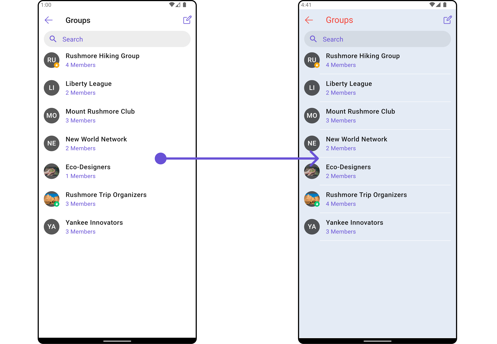

</TabItem>

<TabItem value="iOS" label="iOS">

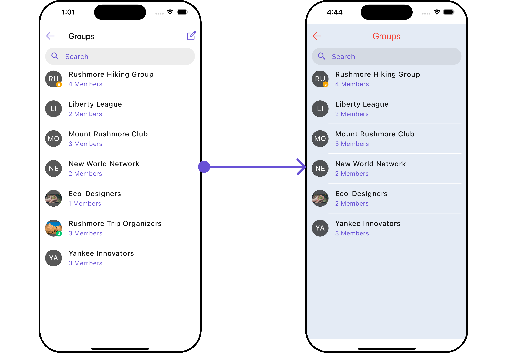

</TabItem>

</Tabs>

You can also customize its widget styles. For more details on individual widget styles, you can refer [Groups Styles](/ui-kit/flutter/groups#style) and [Messages Styles](/ui-kit/flutter/messages#style).

Styles can be applied to Sub widgets using their respective [configurations](#configurations).

---

### Functionality

These are a set of **small functional customizations** that allow you to **fine-tune** the overall experience of the widget. With these, you can **change text**, set **custom icons**, and toggle the **visibility** of UI elements.

`CometChatGroupsWithMessages` widget does not have any available functionality. You can use Functional customisation its [Widgets](/ui-kit/flutter/components-overview#components). For more details on individual widget functionalities, you can refer [Groups Functionalities](/ui-kit/flutter/groups#functionality) and [Messages functionalities](/ui-kit/flutter/messages#functionality).

---

### Advanced

For advanced-level customization, you can set custom widget to the widget. This lets you tailor each aspect of the widget to fit your exact needs and application aesthetics. You can create and define your own widget and then incorporate those into the widget.

`CometChatGroupsWithMessages` widget does not have any advanced-level customization . You can use Advanced customisation its [Widgets](/ui-kit/flutter/components-overview#components). For more details on individual widget functionalities, you can refer [Groups Advanced](/ui-kit/flutter/groups#advance) and [Messages Advanced](/ui-kit/flutter/messages#advanced).

`CometChatGroupsWithMessages` uses advanced-level customization of both Groups & Messages widgets to achieve its default behavior.

##### 1. SubtitleView

You can customize the subtitle widget for each `CometChatGroupsWithMessages` item to meet your requirements

<Tabs>

<TabItem value="Dart" label="Dart">

```dart
CometChatGroupsWithMessages(
  groupsConfiguration: GroupsConfiguration(
    subtitleView: (context, conversation) {
      return const Row(
        children: [
          Icon(Icons.call, color: Color(0xFF6851D6), size: 25,),
          SizedBox(width: 10),
          Icon(Icons.video_call, color: Color(0xFF6851D6), size: 25,),
        ],
      );
    },
  ),
)
```

</TabItem>

</Tabs>

<Tabs>

<TabItem value="Android" label="Android">

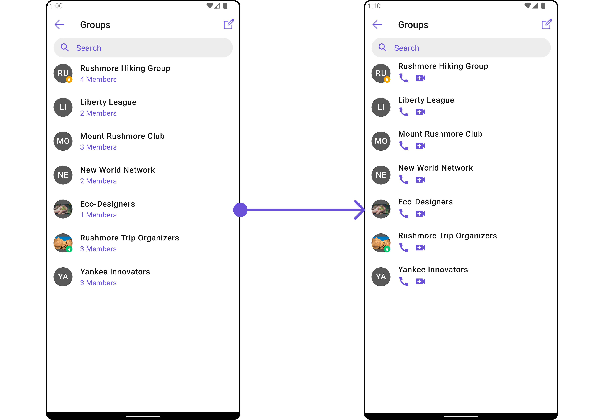

</TabItem>

<TabItem value="iOS" label="iOS">

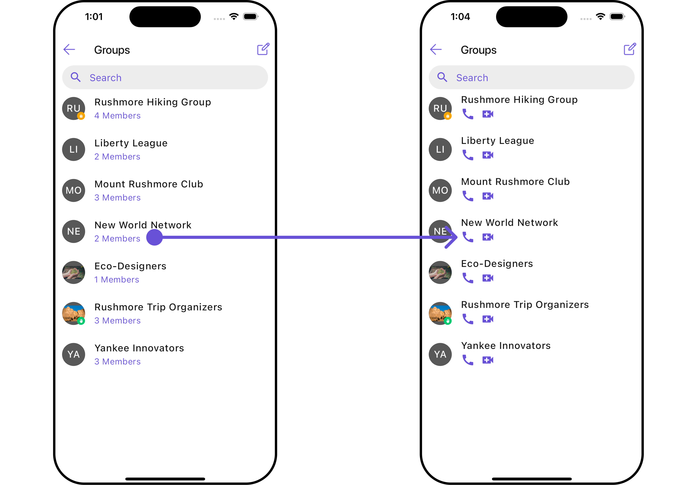

</TabItem>

</Tabs>

---

##### 2. AppBarOptions

You can set the Custom AppBarOptions to the `CometChatGroupsWithMessages` widget.

<Tabs>

<TabItem value="Dart" label="Dart">

```dart
CometChatGroupsWithMessages(
  groupsConfiguration: GroupsConfiguration(
    appBarOptions: (context) {
      return [
        InkWell(
          onTap: () {
            // TODO("Not yet implemented")
          },
          child: const Icon(Icons.ac_unit, color: Color(0xFF6851D6)),
        ),
        const SizedBox(width: 10)
      ];
    },
  ),
)
```

</TabItem>

</Tabs>


<Tabs>

<TabItem value="Android" label="Android">

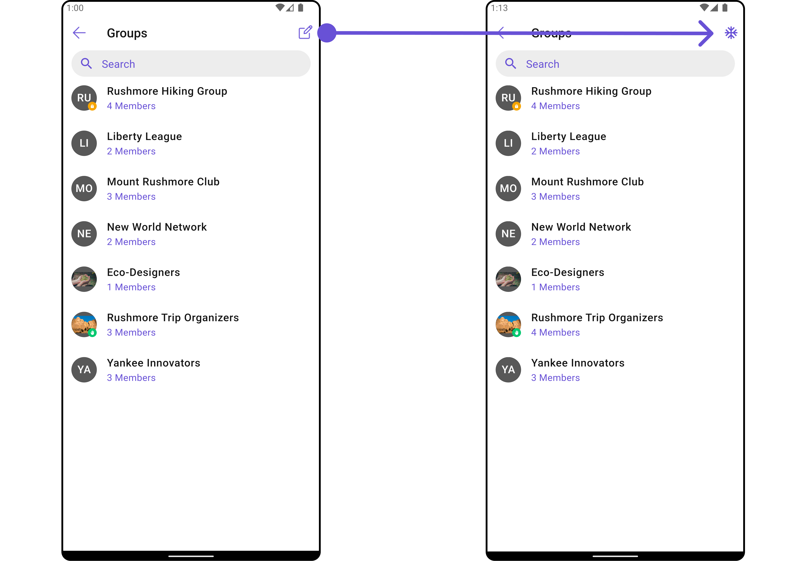

</TabItem>

<TabItem value="iOS" label="iOS">

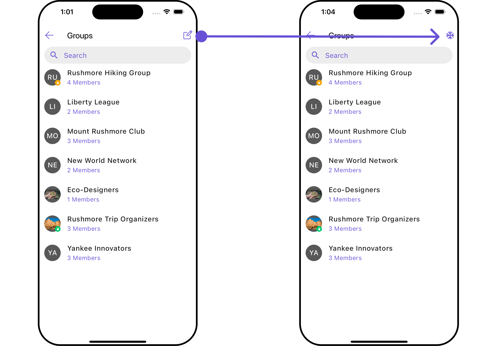

</TabItem>

</Tabs>

---

## Configurations

[Configurations](/ui-kit/flutter/components-overview#configurations) offer the ability to customize the properties of each widget within a Composite widget.

**CometChatGroupsWithMessages** has `Groups` and `Messages` widget. Hence, each of these widgets will have its individual `Configuration`. `Configurations` expose properties that are available in its individual widgets.

#### Groups

You can customize the properties of the Groups widget by making use of the GroupsConfiguration. You can accomplish this by employing the following method as demonstrated below:

<Tabs>

<TabItem value="Dart" label="Dart">

```dart
CometChatGroupsWithMessages(
  groupsConfiguration: GroupsConfiguration(
    // TODO("Not yet implemented")
  ),
)
```

</TabItem>

</Tabs>

All exposed properties of `GroupsConfiguration` can be found under [Groups](./groups#configuration). Properties marked with the <a data-tooltip-id="my-tooltip-html-prop"><span class="material-icons red">report</span></a> symbol are not accessible within the Configuration Object.

**Example**

Let's say you want to change the style of the Groups sub widget

You can modify the style using the `GroupsStyle` method.

<Tabs>

<TabItem value="Dart" label="Dart">

```dart
CometChatGroupsWithMessages(
  groupsConfiguration: GroupsConfiguration(
    groupsStyle: GroupsStyle(
        background: Color(0xFFFAE6FA),
        titleStyle: TextStyle(color: Colors.red),
        backIconTint: Colors.red
    ),
  ),
)
```

</TabItem>

</Tabs>

<Tabs>

<TabItem value="Android" label="Android">


</TabItem>

<TabItem value="iOS" label="iOS">


</TabItem>

</Tabs>

---

#### Messages

You can customize the properties of the Messages widget by making use of the `messagesConfiguration`. You can accomplish this by employing the `messagesConfiguration` as demonstrated below:

<Tabs>

<TabItem value="Dart" label="Dart">

```dart
CometChatGroupsWithMessages(
  messageConfiguration: MessageConfiguration(
    // TODO("Not yet implemented")
  ),
)
```

</TabItem>

</Tabs>

All exposed properties of `MessagesConfiguration` can be found under [Messages](./messages#configuration). Properties marked with the <a data-tooltip-id="my-tooltip-html-prop"><span class="material-icons red">report</span></a> symbol are not accessible within the Configuration Object.

**Example**

Let's say you want to change the style of the Messages sub widget and, in addition, you want to hide message composer.

You can modify the style using the `messagesStyle` method and hide using `hideMessageComposer` method.

<Tabs>

<TabItem value="Dart" label="Dart">

```dart
CometChatGroupsWithMessages(
  messageConfiguration: MessageConfiguration(
    disableTyping: true,
    hideMessageComposer: true,
    messagesStyle: MessagesStyle(
      background: Color(0xFFE4EBF5),
    )
  ),
)
```

</TabItem>

</Tabs>

<Tabs>

<TabItem value="Android" label="Android">

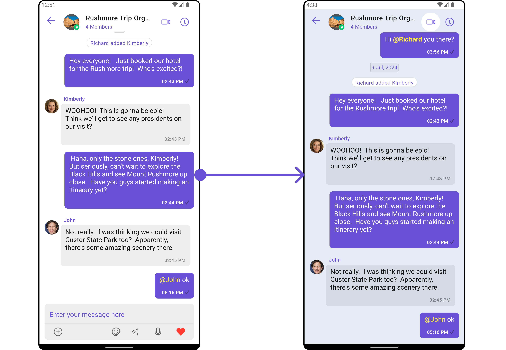

</TabItem>

<TabItem value="iOS" label="iOS">

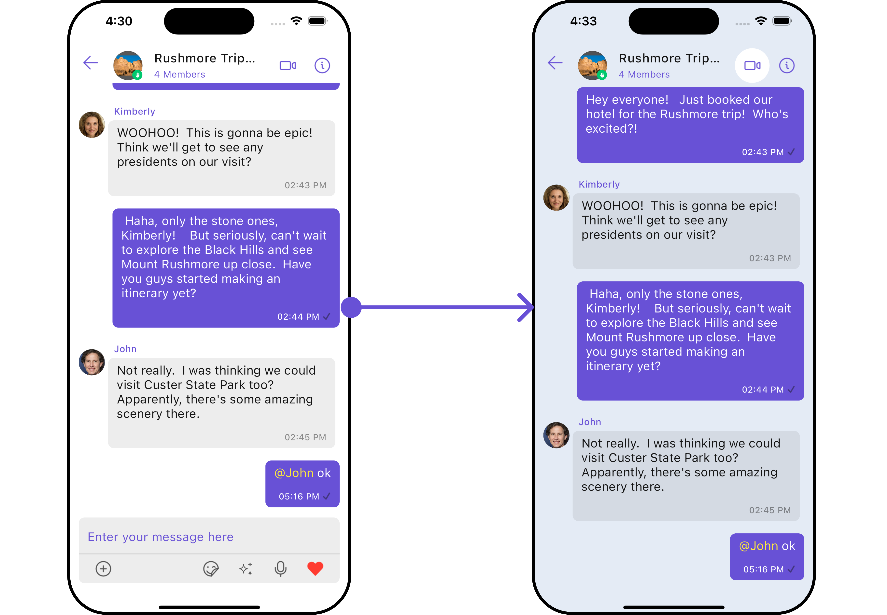

</TabItem>

</Tabs>

#### Join Protected Group

You can customize the properties of the Join Group widget by making use of the JoinGroupConfiguration. You can accomplish this by employing the `JoinProtectedGroupConfiguration` class as demonstrated below:

<Tabs>

<TabItem value="Dart" label="Dart">

```dart
CometChatGroupsWithMessages(
  joinProtectedGroupConfiguration: JoinProtectedGroupConfiguration(
    // TODO("Not yet implemented")
  ),
)
```

</TabItem>

</Tabs>

All exposed properties of `JoinProtectedGroupConfiguration` can be found under Join Group. Properties marked with the report symbol are not accessible within the Configuration Object.

**Example**

Let's say you want to change the style of the Join Group sub widget.

You can modify the style using the `JoinProtectedGroupStyle` property.

<Tabs>

<TabItem value="Dart" label="Dart">

```dart
CometChatGroupsWithMessages(
  joinProtectedGroupConfiguration: JoinProtectedGroupConfiguration(
    joinProtectedGroupStyle: JoinProtectedGroupStyle(
      background: Color(0xFFE4EBF5),
      titleStyle: TextStyle(color: Colors.red)
    )
  ),
)
```

</TabItem>

</Tabs>

<Tabs>

<TabItem value="Android" label="Android">

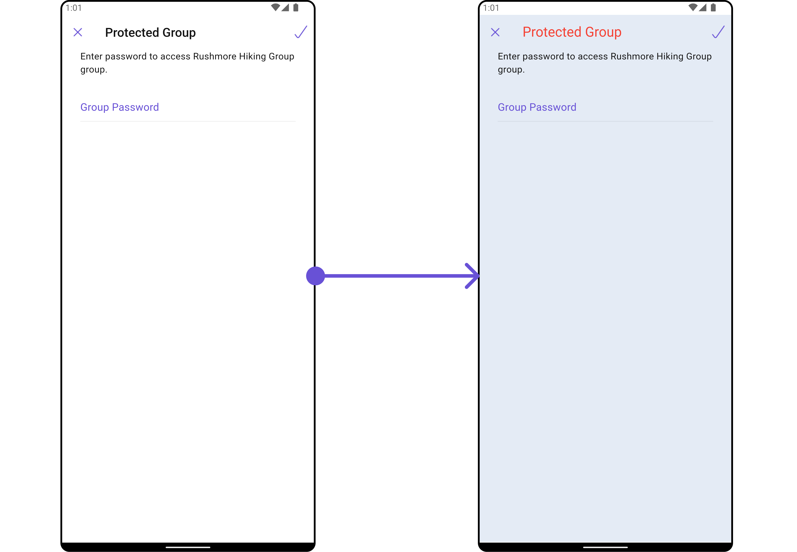

</TabItem>

<TabItem value="iOS" label="iOS">

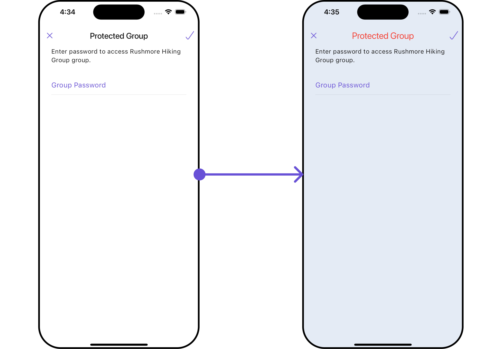

</TabItem>

</Tabs>

---

#### Create Group

You can customize the properties of the Create Group widget by making use of the CreateGroupConfiguration. You can accomplish this by employing the `createGroupConfiguration` props as demonstrated below:

<Tabs>

<TabItem value="Dart" label="Dart">

```dart
CometChatGroupsWithMessages(
  createGroupConfiguration: CreateGroupConfiguration(
    // TODO("Not yet implemented")
  ),
)
```

</TabItem>

</Tabs>

All exposed properties of `CreateGroupConfiguration` can be found under [Create Group](./create-group#configurations). Properties marked with the <a data-tooltip-id="my-tooltip-html-prop"><span class="material-icons red">report</span></a> symbol are not accessible within the Configuration Object.

**Example**

Let's say you want to change the style of the Create Group sub widget.

You can modify the style using the `createGroupStyle` property.

<Tabs>

<TabItem value="Dart" label="Dart">

```dart
CometChatGroupsWithMessages(
  createGroupConfiguration: CreateGroupConfiguration(
    createGroupStyle: CreateGroupStyle(
      background: Color(0xFFE4EBF5),
      titleTextStyle: TextStyle(color: Colors.red, fontFamily: "PlaywritePL")
    )
  ),
)
```

</TabItem>

</Tabs>

<Tabs>

<TabItem value="Android" label="Android">

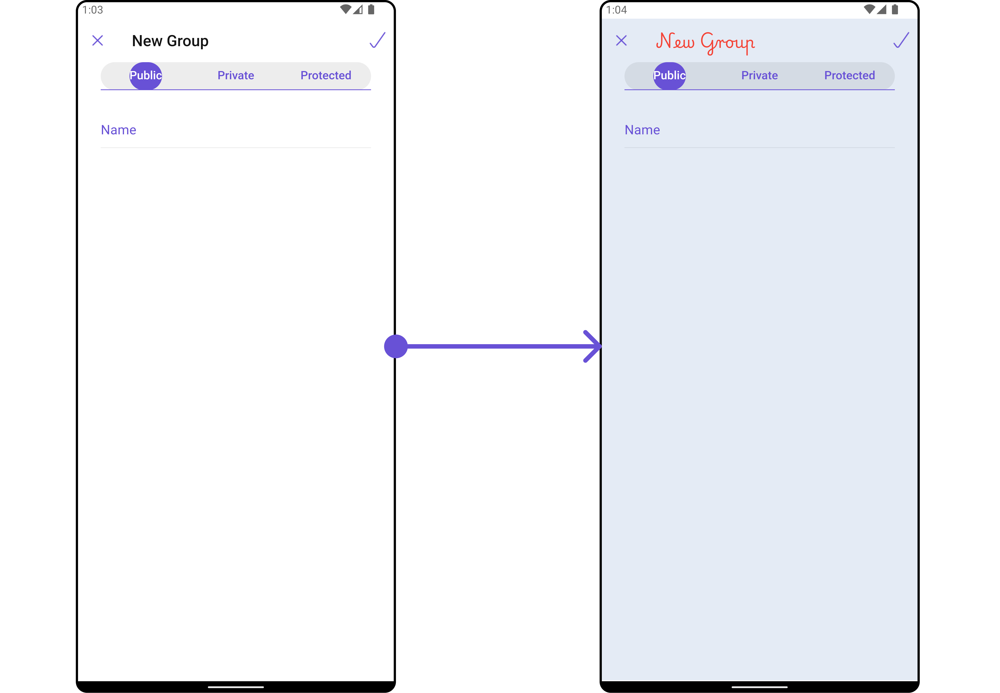

</TabItem>

<TabItem value="iOS" label="iOS">

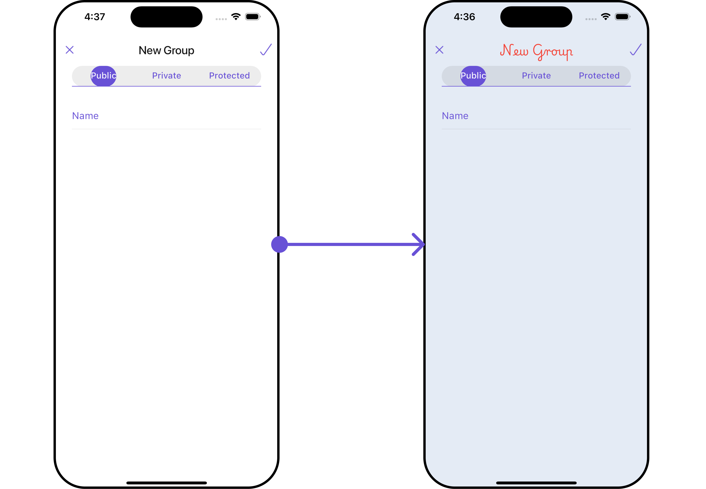

</TabItem>

</Tabs>

---
