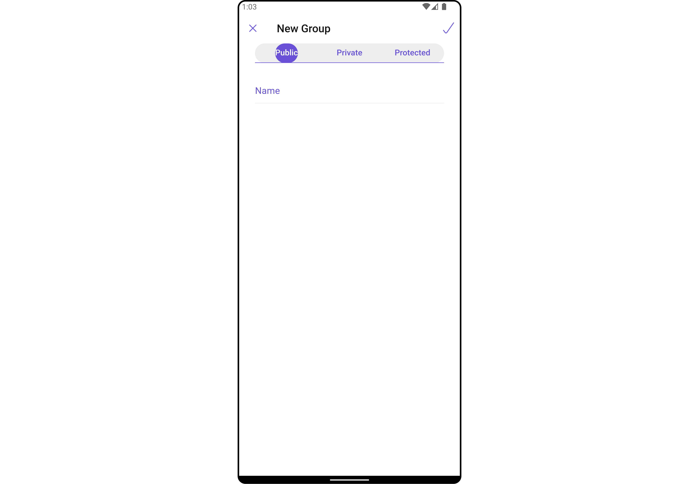
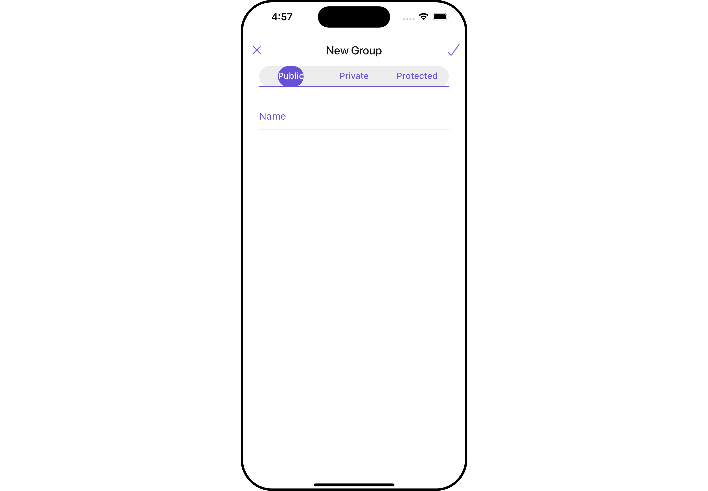
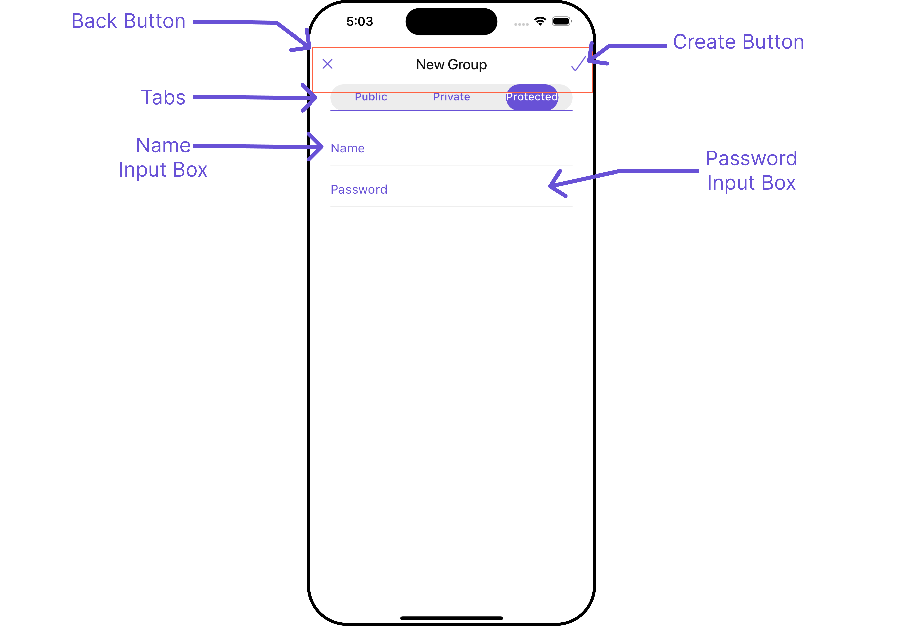

import Tabs from '@theme/Tabs';
import TabItem from '@theme/TabItem';
import { Tooltip } from 'react-tooltip'
import 'react-tooltip/dist/react-tooltip.css'

<Tooltip id="my-tooltip-html-prop" html="Not available in Group Members Configuration object"/>

## Overview

`CometChatCreateGroup` serves as a versatile [Widget](/ui-kit/flutter/components-overview#components), empowering users to create diverse group types, encompassing public, private, and password-protected options. This functionality grants users the flexibility to tailor their group settings to suit their preferences and requirements.

<Tabs>

<TabItem value="Android" label="Android">



</TabItem>

<TabItem value="iOS" label="iOS">



</TabItem>

</Tabs>

The `CometChatCreateGroup` widget is composed of the following Base Widget:

| Widgets                                        | Description                                                                                                                                                                                                                                                                                                                                                |
| ---------------------------------------------- | ---------------------------------------------------------------------------------------------------------------------------------------------------------------------------------------------------------------------------------------------------------------------------------------------------------------------------------------------------------- |
| [CometChatListBase](/ui-kit/flutter/list-base) | `CometChatListBase` serves as a comprehensive container widget, encompassing essential elements such as a title (navigationBar), search functionality (search-bar), background, and a container to embed a list widget. This design provides a cohesive and intuitive user experience, facilitating seamless navigation and interaction within the widget. |

---

## Usage

### Integration

`CometChatCreateGroup`, as a is a Composite Widget, offers flexible integration options, allowing it to be launched directly via button clicks or any user-triggered action. Additionally, it seamlessly integrates into activities and fragments. With `CometChatCreateGroup`, users gain access to a wide range of parameters and methods for effortless customization of its user interface.

You can launch `CometChatCreateGroup` directly using `Navigator.push`, or you can define it as a widget within the `build` method of your `State` class.

##### 1. Using Navigator to Launch `CometChatCreateGroup`

<Tabs>

<TabItem value="Dart" label="Dart">

```dart
Navigator.push(context, MaterialPageRoute(builder: (context) => const CometChatCreateGroup()));
```

</TabItem>

</Tabs>

##### 2. Embedding `CometChatCreateGroup` as a Widget in the build Method

<Tabs>

<TabItem value="Dart" label="Dart">

```dart
import 'package:cometchat_chat_uikit/cometchat_chat_uikit.dart';
import 'package:flutter/material.dart';

class CreateGroup extends StatefulWidget {
  const CreateGroup({super.key});

  @override
  State<CreateGroup> createState() => _CreateGroupState();
}

class _CreateGroupState extends State<CreateGroup> {

  @override
  Widget build(BuildContext context) {
    return const Scaffold(
        body: SafeArea(
            child: CometChatCreateGroup()
        )
    );
  }
}
```

</TabItem>

</Tabs>

---

### Actions

[Actions](/ui-kit/flutter/components-overview#actions) dictate how a widget functions. They are divided into two types: Predefined and User-defined. You can override either type, allowing you to tailor the behavior of the widget to fit your specific needs.

##### 1. onCreateTap

The `onCreateTap` action is activated when you click the create Group button. This returns the created groups.

You can override this action using the following code snippet.

<Tabs>

<TabItem value="Dart" label="Dart">

```dart
CometChatCreateGroup(
  onCreateTap: (group) {
    // TODO("Not yet implemented")
  },
)
```

</TabItem>

</Tabs>

##### 2. onError

You can customize this behavior by using the provided code snippet to override the `On Error` and improve error handling.

<Tabs>

<TabItem value="Dart" label="Dart">

```dart
CometChatCreateGroup(
  onError: (e) {
    // TODO("Not yet implemented")
  },
)
```

</TabItem>

</Tabs>

##### 3. onBack

Enhance your application's functionality by leveraging the `onBack` feature. This capability allows you to customize the behavior associated with navigating back within your app. Utilize the provided code snippet to override default behaviors and tailor the user experience according to your specific requirements.

<Tabs>

<TabItem value="Dart" label="Dart">

```dart
CometChatCreateGroup(
  onBack: () {
    // TODO("Not yet implemented")
  },
)
```

</TabItem>

</Tabs>

---

### Filters

**Filters** allow you to customize the data displayed in a list within a `Widget`. You can filter the list based on your specific criteria, allowing for a more customized. Filters can be applied using `RequestBuilders` of Chat SDK.

The `CreateGroup` widget does not have any exposed filters.

[Events](/ui-kit/flutter/components-overview#events) are emitted by a `Widget`. By using [CometChatGroupEvents](/ui-kit/flutter/groups#events) you can extend existing functionality. Being global events, they can be applied in Multiple Locations and are capable of being Added or Removed.

Events emitted by the Create Group widget is as follows.

| Event                         | Description                                                                             |
| ----------------------------- | --------------------------------------------------------------------------------------- |
| `ccGroupCreated(Group group)` | This event will be triggered when the logged-in user initiates the creation of a group. |

**Example**

<Tabs>

<TabItem value="Dart" label="Dart">

```dart
import 'package:cometchat_chat_uikit/cometchat_chat_uikit.dart';
import 'package:flutter/material.dart';

class YourScreen extends StatefulWidget {
  const YourScreen({super.key});

  @override
  State<YourScreen> createState() => _YourScreenState();
}

class _YourScreenState extends State<YourScreen> with CometChatGroupEventListener {

  @override
  void initState() {
    super.initState();
    CometChatGroupEvents.addGroupsListener("listenerId", this); // Add the listener
  }

  @override
  void dispose(){
    super.dispose();
    CometChatGroupEvents.removeGroupsListener("listenerId"); // Remove the listener
  }

  @override
  void ccGroupCreated(Group group) {
    // TODO("Not yet implemented")
  }

  @override
  Widget build(BuildContext context) {
    return const Placeholder();
  }
}
```

</TabItem>

</Tabs>

---

## Customization

To fit your app's design requirements, you can customize the appearance of the Groups widget. We provide exposed methods that allow you to modify the experience and behavior according to your specific needs.

### Style

Using **Style** you can **customize** the look and feel of the widget in your app, These parameters typically control elements such as the **color**, **size**, **shape**, and **fonts** used within the widget.

##### 1. CreateGroup Style <a data-tooltip-id="my-tooltip-html-prop"> <span class="material-icons red">report</span> </a> <Tooltip id="my-tooltip-html-prop" html="Not available"/>

<Tabs>

<TabItem value="Dart" label="Dart">

```dart
CometChatCreateGroup(
  createGroupStyle: CreateGroupStyle(
    background: Color(0xFFE4EBF5),
    titleTextStyle: TextStyle(color: Colors.red, fontFamily: "PlaywritePL"),
    borderColor: Colors.red,
    borderRadius: 20,
    selectedTabTextStyle: TextStyle(color: Colors.red, fontFamily: "PlaywritePL"),
  ),
)
```

</TabItem>

</Tabs>

You can set the `CreateGroupStyle` to the `CometChatCreateGroup` Widget to customize the styling.

| Property                            | Description                                                         | Code                                       |
| ----------------------------------- | ------------------------------------------------------------------- | ------------------------------------------ |
| **Border Color**                    | Provides color to border                                            | `borderColor: Color?`                      |
| **Close Icon Tint**                 | Provides color to back icon                                         | `closeIconTint: Color?`                    |
| **Create Icon Tint**                | Provides color to create icon                                       | `createIconTint: Color?`                   |
| **Name Input Text Style**           | Provides styling for the text in the name input field               | `nameInputTextStyle: TextStyle?`           |
| **Name Placeholder Text Style**     | Provides styling for the hint text in the name text input field     | `namePlaceholderTextStyle: TextStyle?`     |
| **Password Input Text Style**       | Provides styling for the text in the password input field           | `passwordInputTextStyle: TextStyle?`       |
| **Password Placeholder Text Style** | Provides styling for the hint text in the password text input field | `passwordPlaceholderTextStyle: TextStyle?` |
| **Selected Tab Color**              | Provides color to the active/selected tab                           | `selectedTabColor: Color?`                 |
| **Selected Tab Text Style**         | Provides styling for the text in the active/selected tab            | `selectedTabTextStyle: TextStyle?`         |
| **Tab Color**                       | Provides color to the inactive/unselected tabs                      | `tabColor: Color?`                         |
| **Tab Text Style**                  | Provides styling for the text in the inactive/unselected tab        | `tabTextStyle: TextStyle?`                 |
| **Title Text Style**                | Provides styling for title text                                     | `titleTextStyle: TextStyle?`               |

---

### Functionality

These are a set of small functional customizations that allow you to fine-tune the overall experience of the widget. With these, you can change text, set custom icons, and toggle the visibility of UI elements.

<Tabs>

<TabItem value="Dart" label="Dart">

```dart
CometChatCreateGroup(
    title: "Your Title",
    namePlaceholderText: "Placeholder Text",
    passwordPlaceholderText: "Password Placeholder Text",
    createIcon: Icon(Icons.create, color: Color(0xFF6851D6)),
    closeIcon: Icon(Icons.close_fullscreen_sharp, color: Color(0xFF6851D6))
)
```

</TabItem>

</Tabs>

<Tabs>

<TabItem value="Android" label="Android">


</TabItem>

<TabItem value="iOS" label="iOS">



</TabItem>

</Tabs>

List of functionality exposed by `CometChatCreateGroup`

| Property                      | Description                                                                          | Code                               |
| ----------------------------- | ------------------------------------------------------------------------------------ | ---------------------------------- |
| **Close Icon**                | Used to set back button icon                                                         | `closeIcon: Widget?`               |
| **Create Icon**               | Used to set create group icon                                                        | `createIcon: Widget?`              |
| **Disable Close Button**      | Used to toggle visibility for back button                                            | `disableCloseButton: bool?`        |
| **Name Placeholder Text**     | Used to customize the hint text for the name input field in protected group form     | `namePlaceholderText: String?`     |
| **Password Placeholder Text** | Used to customize the hint text for the password input field in protected group form | `passwordPlaceholderText: String?` |
| **Theme**                     | Used to set the theme of the widget                                                  | `theme: CometChatTheme?`           |
| **Title**                     | Used to set title                                                                    | `title: String?`                   |

---

### Advanced

For advanced-level customization, you can set custom widgets to the widget. This lets you tailor each aspect of the widget to fit your exact needs and application aesthetics. You can create and define your own widgets and then incorporate those into the widget.

The `CometChatCreateGroup` widget does not provide additional functionalities beyond this level of customization.

---
