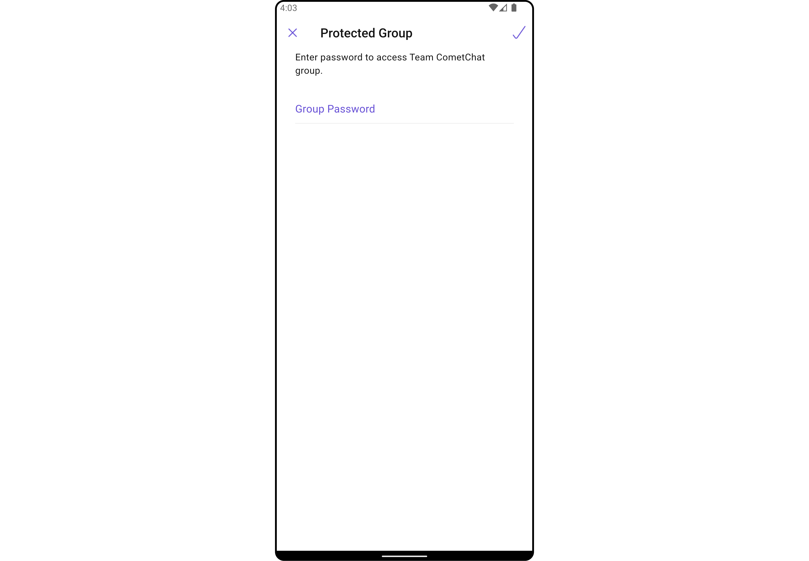
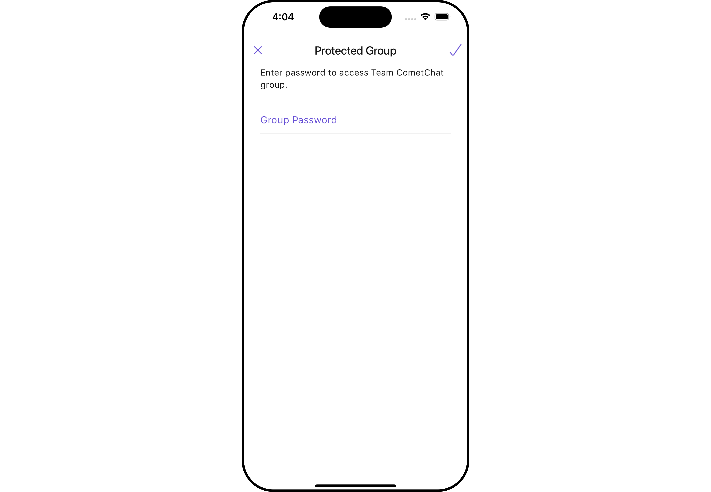
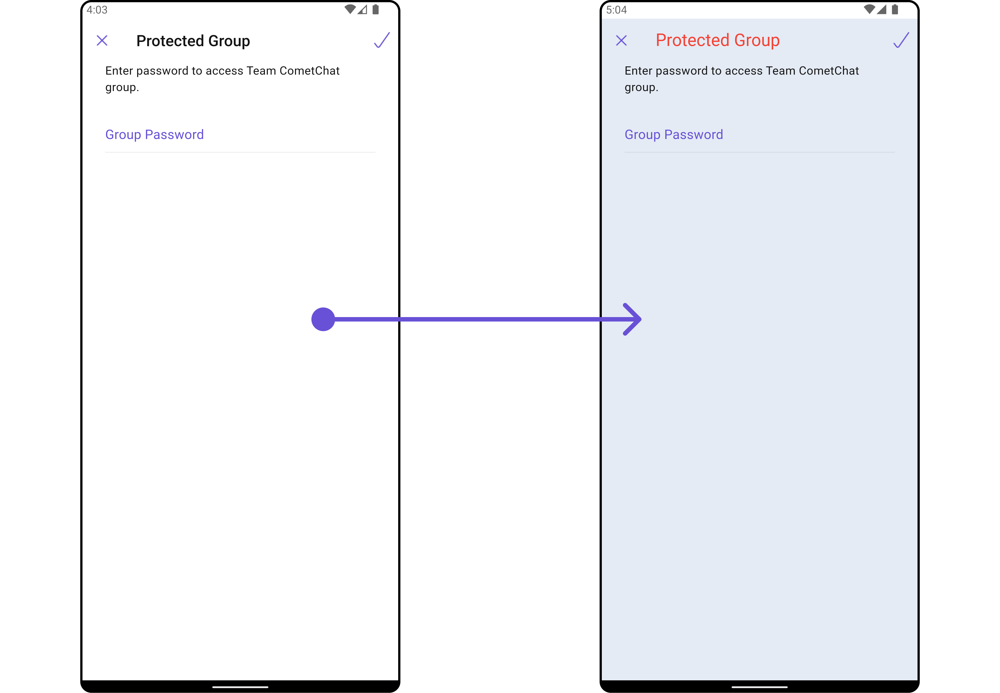
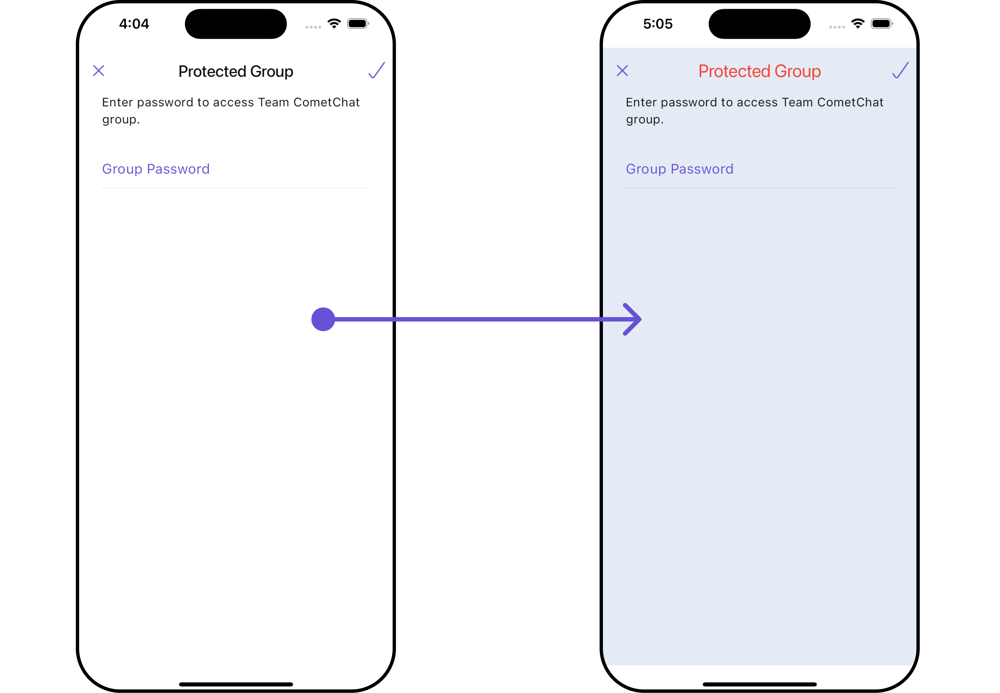
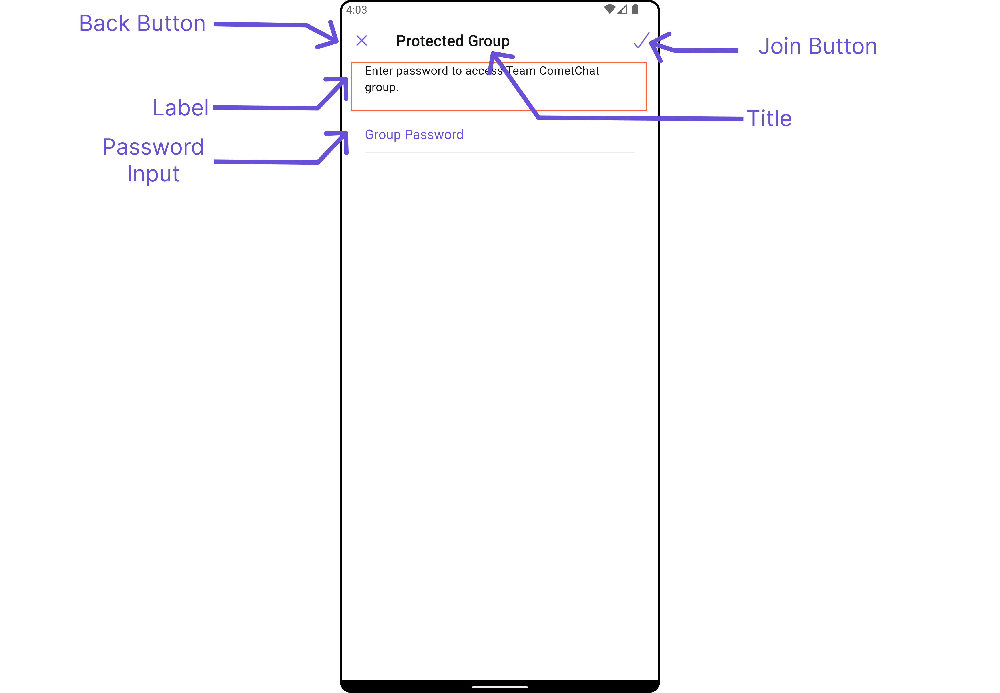
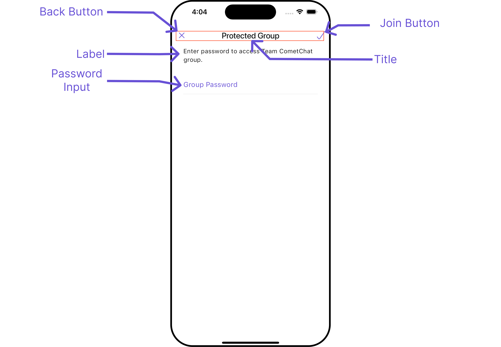
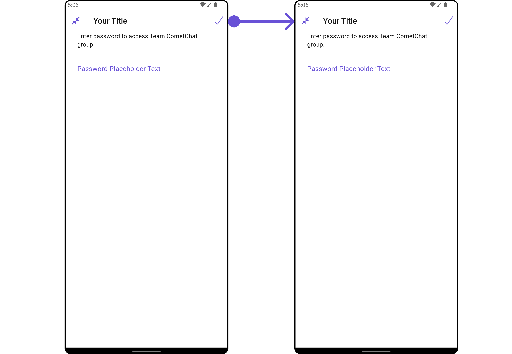
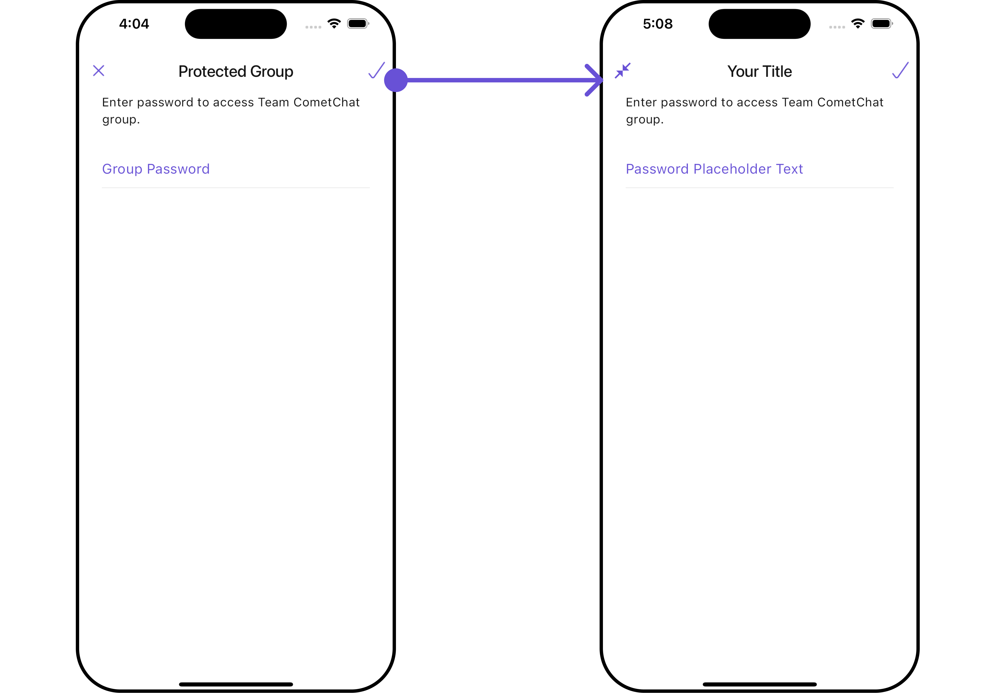

import Tabs from '@theme/Tabs';
import TabItem from '@theme/TabItem';
import { Tooltip } from 'react-tooltip'
import 'react-tooltip/dist/react-tooltip.css'

<Tooltip id="my-tooltip-html-prop" html="Not available in Group Members Configuration object"/>

## Overview

`CometChatJoinProtectedGroup` is a [Widget](/ui-kit/flutter/components-overview#components) used to set up a screen that shows the functionality to join a password protected group, featuring the functionality to join a password-protected group, where users can join a single password-protected group at a time.

<Tabs>

<TabItem value="Android" label="Android">



</TabItem>

<TabItem value="iOS" label="iOS">



</TabItem>

</Tabs>

The `CometChatJoinProtectedGroup` widget is composed of the following Base Widgets:

| Widgets                                        | Description                                                                                                                                                                                                                                                                                                                                                |
| ---------------------------------------------- | ---------------------------------------------------------------------------------------------------------------------------------------------------------------------------------------------------------------------------------------------------------------------------------------------------------------------------------------------------------- |
| [CometChatListBase](/ui-kit/flutter/list-base) | `CometChatListBase` serves as a comprehensive container widget, encompassing essential elements such as a title (navigationBar), search functionality (search-bar), background, and a container to embed a list widget. This design provides a cohesive and intuitive user experience, facilitating seamless navigation and interaction within the widget. |

## Usage

### Integration

`CometChatJoinProtectedGroup`, as a Composite Widget, offers flexible integration options, allowing it to be launched directly via button clicks or any user-triggered action. Additionally, it seamlessly integrates into tab widget controllers. With join group, users gain access to a wide range of parameters and methods for effortless customization of its user interface.

You can launch `CometChatJoinProtectedGroup` directly using `Navigator.push`, or you can define it as a widget within the `build` method of your `State` class.

##### 1. Using Navigator to Launch `CometChatJoinProtectedGroup`

<Tabs>

<TabItem value="Dart" label="Dart">

```dart
Navigator.push(context, MaterialPageRoute(builder: (context) => CometChatJoinProtectedGroup(group: Group(guid: "", name: "", type: "")))); // A group object is required to launch this widget.
```

</TabItem>

</Tabs>

##### 2. Embedding `CometChatJoinProtectedGroup` as a Widget in the build Method

<Tabs>

<TabItem value="Dart" label="Dart">

```dart
import 'package:cometchat_chat_uikit/cometchat_chat_uikit.dart';
import 'package:flutter/material.dart';

class JoinProtectedGroup extends StatefulWidget {
  const JoinProtectedGroup({super.key});

  @override
  State<JoinProtectedGroup> createState() => _JoinProtectedGroupState();
}

class _JoinProtectedGroupState extends State<JoinProtectedGroup> {

  @override
  Widget build(BuildContext context) {
    return Scaffold(
        body: SafeArea(
            child: CometChatJoinProtectedGroup(
              group: Group(guid: "", name: "", type: ""),
            ) // A group object is required to launch this widget.
        )
    );
  }
}
```

</TabItem>

</Tabs>

---

### Actions

##### 1. onJoinTap

The `onJoinTap` action is activated when you click the join Group button. This returns the join groups.

You can override this action using the following code snippet.

<Tabs>

<TabItem value="Dart" label="Dart">

```dart
CometChatJoinProtectedGroup(
  group: Group(guid: "", name: "", type: ""), // A group object is required to launch this widget.
  onJoinTap: ({Group? group, String? password}) {
    // TODO("Not yet implemented")
  },
)
```

</TabItem>

</Tabs>

---

##### 2. onBack

Enhance your application's functionality by leveraging the `onBack` feature. This capability allows you to customize the behavior associated with navigating back within your app. Utilize the provided code snippet to override default behaviors and tailor the user experience according to your specific requirements.

<Tabs>

<TabItem value="Dart" label="Dart">

```dart
CometChatJoinProtectedGroup(
  group: Group(guid: "", name: "", type: ""), // A group object is required to launch this widget.
  onBack: () {
    // TODO("Not yet implemented")
  },
)
```

</TabItem>

</Tabs>

---

##### 3. onError

You can customize this behavior by using the provided code snippet to override the `onError` and improve error handling.

<Tabs>

<TabItem value="Dart" label="Dart">

```dart
CometChatJoinProtectedGroup(
  group: Group(guid: "", name: "", type: ""), // A group object is required to launch this widget.
  onError: (e) {
    // TODO("Not yet implemented")
  },
)
```

</TabItem>

</Tabs>

---

### Filters

**Filters** allow you to customize the data displayed in a list within a `Widget`. You can filter the list based on your specific criteria, allowing for a more customized. Filters can be applied using `RequestBuilders` of Chat SDK.

The `CometChatJoinProtectedGroup` widget does not have any exposed filters.

---

### Events

[Events](/ui-kit/flutter/components-overview#events) are emitted by a `Widget`. By using event you can extend existing functionality. Being global events, they can be applied in Multiple Locations and are capable of being Added or Removed.

Events emitted by the Join Group widget is as follows.

| Event                   | Description                                                  |
| ----------------------- | ------------------------------------------------------------ |
| **ccGroupMemberJoined** | Triggers when the user joined a protected group successfully |

**Example**

<Tabs>

<TabItem value="Dart" label="Dart">

```dart title="your_screen.dart"
import 'package:cometchat_chat_uikit/cometchat_chat_uikit.dart';
import 'package:cometchat_sdk/models/action.dart' as cc;
import 'package:flutter/material.dart';

class YourScreen extends StatefulWidget {
  const YourScreen({super.key});

  @override
  State<YourScreen> createState() => _YourScreenState();
}

class _YourScreenState extends State<YourScreen> with CometChatGroupEventListener {

  @override
  void initState() {
    super.initState();
    CometChatGroupEvents.addGroupsListener("listenerId", this); // Add the listener
  }

  @override
  void dispose(){
    super.dispose();
    CometChatGroupEvents.removeGroupsListener("listenerId"); // Remove the listener
  }

  @override
  void ccGroupMemberJoined(User joinedUser, Group joinedGroup) {
    // TODO("Not yet implemented")
  }

  @override
  Widget build(BuildContext context) {
    return const Placeholder();
  }

}
```

</TabItem>

</Tabs>

---

## Customization

To fit your app's design requirements, you can customize the appearance of the Groups widget. We provide exposed methods that allow you to modify the experience and behavior according to your specific needs.

### Style

Using **Style** you can **customize** the look and feel of the widget in your app, These parameters typically control elements such as the **color**, **size**, **shape**, and **fonts** used within the widget.

##### 1. JoinProtectedGroup Style <a data-tooltip-id="my-tooltip-html-prop"> <span class="material-icons red">report</span> </a> <Tooltip id="my-tooltip-html-prop" html="Not available"/>

You can set the `JoinProtectedGroupStyle` to the `CometChatJoinProtectedGroup` Widget to customize the styling.

<Tabs>

<TabItem value="Dart" label="Dart">

```dart
CometChatJoinProtectedGroup(
  group: Group(guid: "", name: "", type: ""), // A group object is required to launch this widget.
  joinProtectedGroupStyle: JoinProtectedGroupStyle(
    background: Color(0xFFE4EBF5),
    titleStyle: TextStyle(color: Colors.red)
  ),
)
```

</TabItem>

</Tabs>

<Tabs>

<TabItem value="Android" label="Android">



</TabItem>

<TabItem value="iOS" label="iOS">



</TabItem>

</Tabs>

List of properties exposed by JoinProtectedGroupStyle

| Property                       | Description                      | Code                                   |
| ------------------------------ | -------------------------------- | -------------------------------------- |
| **Background**                 | Background value                 | `background: Color?`                   |
| **Border**                     | Border value                     | `border: Border?`                      |
| **Border Radius**              | Border Radius value              | `borderRadius: BorderRadius?`          |
| **Border Width**               | Border Width value               | `border: Border?`                      |
| **Close Icon Tint**            | Close Icon Tint value            | `closeIconTint: Color?`                |
| **Description Text Style**     | Description Text Style value     | `descriptionTextStyle: TextStyle?`     |
| **Error Text Style**           | Error Text Style value           | `errorTextStyle: TextStyle?`           |
| **Gradient**                   | Gradient value                   | `gradient: Gradient?`                  |
| **Height**                     | Height value                     | `height: double?`                      |
| **Input Border Color**         | Input Border Color value         | `inputBorderColor: Color?`             |
| **Join Icon Tint**             | Join Icon Tint value             | `joinIconTint: Color?`                 |
| **Password Input Text Style**  | Password Input Text Style value  | `passwordInputTextStyle: TextStyle?`   |
| **Password Placeholder Style** | Password Placeholder Style value | `passwordPlaceholderStyle: TextStyle?` |
| **Title Style**                | Title Style value                | `titleStyle: TextStyle?`               |
| **Width**                      | Width value                      | `width: double?`                       |

---

### Functionality

These are a set of small functional customizations that allow you to fine-tune the overall experience of the widget. With these, you can change text, set custom icons, and toggle the visibility of UI elements.

<Tabs>

<TabItem value="Android" label="Android">



</TabItem>

<TabItem value="iOS" label="iOS">



</TabItem>

</Tabs>

<Tabs>

<TabItem value="Dart" label="Dart">

```dart
CometChatJoinProtectedGroup(
    group: Group(guid: "", name: "", type: ""), // A group object is required to launch this widget.
    title: "Your Title",
    passwordPlaceholderText: "Password Placeholder Text",
    closeIcon: Icon(Icons.close_fullscreen_sharp, color: Color(0xFF6851D6))
)
```

</TabItem>

</Tabs>

<Tabs>

<TabItem value="Android" label="Android">



</TabItem>

<TabItem value="iOS" label="iOS">



</TabItem>

</Tabs>

This table provides a quick overview of the available customization options for the `CometChatJoinProtectedGroup` class.

| Property                      | Description                                             | Code                               |
| ----------------------------- | ------------------------------------------------------- | ---------------------------------- |
| **Border Width**              | Sets the width of the border.                           | `borderWidth: double?`             |
| **Close Icon**                | Replaces the default back button with a custom widget.  | `closeIcon: Widget?`               |
| **Description**               | Sets the description text displayed below the title.    | `description: String?`             |
| **Error State Text**          | Sets the text displayed when an error occurs.           | `errorStateText: String?`          |
| **Join Icon**                 | Replaces the default join icon with a custom widget.    | `joinIcon: Widget?`                |
| **Password Placeholder Text** | Sets the placeholder text for the password input field. | `passwordPlaceholderText: String?` |
| **Title**                     | Sets the title text displayed at the top of the widget. | `title: String?`                   |

### Advanced

For advanced-level customization, you can set custom widgets to the widget. This lets you tailor each aspect of the widget to fit your exact needs and application aesthetics. You can create and define your own widgets and then incorporate those into the widget.

The `CometChatJoinProtectedGroup` widget does not provide additional functionalities beyond this level of customization.

---
