import Tabs from '@theme/Tabs';
import TabItem from '@theme/TabItem';
import { Tooltip } from 'react-tooltip'
import 'react-tooltip/dist/react-tooltip.css'

<Tooltip id="my-tooltip-html-prop" html="Not available in Group Members Configuration object"/>

## Overview

`CometChatAddMembers` is a [Widget](/ui-kit/flutter/components-overview#components) that empowers administrators or group owners with the ability to expand group membership by seamlessly adding new participants. This widget facilitates effortless management of group membership and enhances collaboration within the group's discussions and activities. Administrators can meticulously select desired users to join the group, whether by targeted search or from a list of available users. Selected users receive notifications, streamlining the process of joining the group and ensuring smooth integration into the community.

<Tabs>

<TabItem value="Android" label="Android">

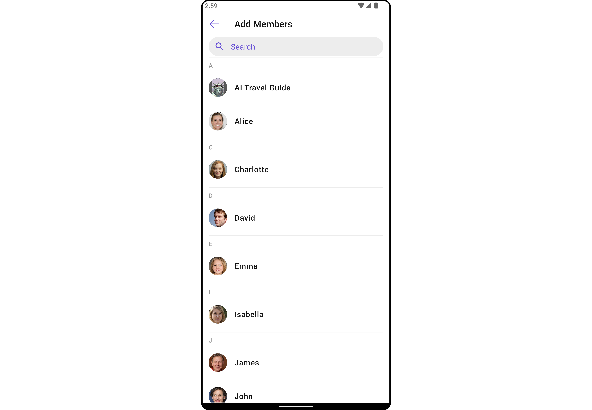

</TabItem>

<TabItem value="iOS" label="iOS">

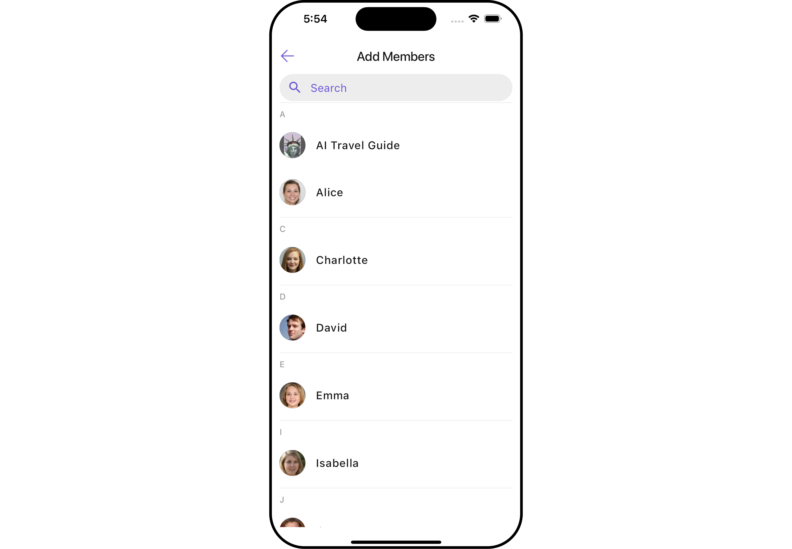

</TabItem>

</Tabs>

The `CometChatAddMembers` widget is composed of the following BaseWidgets:

| Widgets                                        | Description                                                                                                                                                                                                                                                                                                                                              |
| ---------------------------------------------- | -------------------------------------------------------------------------------------------------------------------------------------------------------------------------------------------------------------------------------------------------------------------------------------------------------------------------------------------------------- |
| [CometChatUsers](/ui-kit/flutter/users)        | `CometChatUsers` is a standalone widget that presents a user list and enables targeted user searches. As a container inheriting from `CometChatListBase` , it seamlessly incorporates the `CometChatUserList` widget. This setup streamlines user browsing and search capabilities, enhancing overall usability and facilitating efficient interactions. |
| [CometChatListItem](/ui-kit/flutter/list-item) | This widget renders information extracted from a `User` object onto a tile, featuring a title, subtitle, leading view, and trailing view. experience, facilitating seamless navigation and interaction within the widget.                                                                                                                                |

---

## Usage

### Integration

`CometChatAddMembers` , as a Composite Widget, offers flexible integration options, allowing it to be launched directly via button clicks or any user-triggered action. Additionally, it seamlessly integrates into tab view controllers. With add members, users gain access to a wide range of parameters and methods for effortless customization of its user interface.

You can launch `CometChatAddMembers` directly using `Navigator.push` , or you can define it as a widget within the `build` method of your `State` class.

##### 1. Using Navigator to Launch `CometChatAddMembers`

<Tabs>

<TabItem value="Dart" label="Dart">

```dart
Navigator.push(context, MaterialPageRoute(builder: (context) => CometChatAddMembers(group: Group(guid: "", name: "", type: "")))); // A group object is required to launch this widget.
```

</TabItem>

</Tabs>

##### 2. Embedding `CometChatAddMembers` as a Widget in the build Method

<Tabs>

<TabItem value="Dart" label="Dart">

```dart
import 'package:cometchat_chat_uikit/cometchat_chat_uikit.dart';
import 'package:flutter/material.dart';

class AddMembers extends StatefulWidget {
  const AddMembers({super.key});

  @override
  State<AddMembers> createState() => _AddMembersState();
}

class _AddMembersState extends State<AddMembers> {
  @override
  Widget build(BuildContext context) {
    return Scaffold(
        body: SafeArea(
            child: CometChatAddMembers(
              group: Group(guid: "", name: "", type: ""), // A group object is required to launch this widget.
            ) // A group object is required to launch this widget.
        )
    );
  }
}
```

</TabItem>

</Tabs>

---

### Actions

[Actions](/ui-kit/flutter/components-overview#actions) dictate how a widget functions. They are divided into two types: Predefined and User-defined. You can override either type, allowing you to tailor the behavior of the widget to fit your specific needs.

##### 1. onBack

Enhance your application's functionality by leveraging the `onBack` feature. This capability allows you to customize the behavior associated with navigating back within your app. Utilize the provided code snippet to override default behaviors and tailor the user experience according to your specific requirements.

<Tabs>

<TabItem value="Dart" label="Dart">

```dart
CometChatAddMembers(
  group: Group(guid: "", name: "", type: ""), // A group object is required to launch this widget.
  onBack: () {
    // TODO("Not yet implemented")
  },
)
```

</TabItem>

</Tabs>

---

##### 2. onError

You can customize this behavior by using the provided code snippet to override the `onError` and improve error handling.

<Tabs>

<TabItem value="Dart" label="Dart">

```dart
CometChatAddMembers(
  group: Group(guid: "", name: "", type: ""), // A group object is required to launch this widget.
  onError: (e) {
    // TODO("Not yet implemented")
  },
)
```

</TabItem>

</Tabs>

---

##### 3. onSelection

When the `onSelection` event is triggered, it furnishes the list of selected users. This event can be invoked by any button or action within the interface. You have the flexibility to implement custom actions or behaviors based on the selected users.

This action does not come with any predefined behavior. However, you have the flexibility to override this event and tailor it to suit your needs using the following code snippet.

<Tabs>

<TabItem value="Dart" label="Dart">

```dart
CometChatAddMembers(
  group: Group(guid: "", name: "", type: ""), // A group object is required to launch this widget.
  selectionMode: SelectionMode.multiple,
  onSelection: (groupMembersList, context) {
    // TODO("Not yet implemented")
  },
)
```

</TabItem>

</Tabs>

---

### Filters

**Filters** allow you to customize the data displayed in a list within a `Widget` . You can filter the list based on your specific criteria, allowing for a more customized. Filters can be applied using `RequestBuilders` of Chat SDK.

##### 1. UsersRequestBuilder

The [UsersRequestBuilder](/sdk/flutter/retrieve-users) enables you to filter and customize the group list based on available parameters in UsersRequestBuilder. This feature allows you to create more specific and targeted queries when fetching users. The following are the parameters available in [UsersRequestBuilder](/sdk/flutter/retrieve-users)

| Property               | Description                                     | Code                      |
| ---------------------- | ----------------------------------------------- | ------------------------- |
| **Friends Only**       | Indicates if the request is limited to friends. | `friendsOnly: bool?`      |
| **Hide Blocked Users** | Whether to hide blocked users in the request.   | `hideBlockedUsers: bool?` |
| **Limit**              | Maximum number of users to fetch.               | `limit: int?`             |
| **Role**               | Specific role of the users to fetch.            | `role: String?`           |
| **Roles**              | List of roles for the users.                    | `roles: List<String>?`    |
| **Search Keyword**     | Keyword for searching users.                    | `searchKeyword: String?`  |
| **Tags**               | List of tags associated with the users.         | `tags: List<String>?`     |
| **Uids**               | List of user IDs.                               | `uids: List<String>?`     |
| **User Status**        | Status of the user.                             | `userStatus: String?`     |
| **With Tags**          | Whether to include users with specific tags.    | `withTags: bool?`         |

**Example**

<Tabs>

<TabItem value="Dart" label="Dart">

```dart
CometChatAddMembers(
  group: Group(guid: "", name: "", type: ""), // A group object is required to launch this widget.
    usersRequestBuilder: UsersRequestBuilder()
      ..limit = 10
)
```

</TabItem>

</Tabs>

---

##### 2. UsersProtocol

The `UsersProtocol` uses [UsersRequestBuilder](/sdk/flutter/retrieve-users) enables you to filter and customize the search list based on available parameters in UsersRequestBuilder.
This feature allows you to keep uniformity between the displayed User List and searched User List.

**Example**

<Tabs>

<TabItem value="Dart" label="Dart">

```dart title="custom_protocol.dart"
import 'package:cometchat_chat_uikit/cometchat_chat_uikit.dart';

class CustomUsersProtocol extends UsersBuilderProtocol {
  const CustomUsersProtocol(super.builder);

  @override
  UsersRequest getRequest() {
    return requestBuilder.build();
  }

  @override
  UsersRequest getSearchRequest(String val) {
    requestBuilder.searchKeyword = val;
    return requestBuilder.build();
  }
}
```

</TabItem>

</Tabs>

<Tabs>

<TabItem value="Dart" label="Dart">

```dart title="main.dart"
CometChatAddMembers(
  group: Group(guid: "", name: "", type: ""), // A group object is required to launch this widget.
  usersProtocol: CustomUsersProtocol(UsersRequestBuilder()..searchKeyword = "searchKeyword"),
)
```

</TabItem>

</Tabs>

---

### Events

[Events](/ui-kit/flutter/components-overview#events) are emitted by a `Widget` . By using event you can extend existing functionality. Being global events, they can be applied in Multiple Locations and are capable of being Added or Removed.

Events emitted by the Join Group widget is as follows.

| Event                  | Description                                        |
| ---------------------- | -------------------------------------------------- |
| **ccGroupMemberAdded** | Triggers when a user added to a group successfully |

**Example**

<Tabs>

<TabItem value="Dart" label="Dart">

```dart title="your_screen.dart"
import 'package:cometchat_chat_uikit/cometchat_chat_uikit.dart';
import 'package:cometchat_sdk/models/action.dart' as cc;
import 'package:flutter/material.dart';

class YourScreen extends StatefulWidget {
  const YourScreen({super.key});

  @override
  State<YourScreen> createState() => _YourScreenState();
}

class _YourScreenState extends State<YourScreen> with CometChatGroupEventListener {

  @override
  void initState() {
    super.initState();
    CometChatGroupEvents.addGroupsListener("listenerId", this); // Add the listener
  }

  @override
  void dispose(){
    super.dispose();
    CometChatGroupEvents.removeGroupsListener("listenerId"); // Remove the listener
  }

  @override
  void ccGroupMemberAdded(List<cc.Action> messages, List<User> usersAdded, Group groupAddedIn, User addedBy) {
    // TODO("Not yet implemented")
  }

  @override
  Widget build(BuildContext context) {
    return const Placeholder();
  }

}
```

</TabItem>

</Tabs>

---

## Customization

To fit your app's design requirements, you can customize the appearance of the Groups widget. We provide exposed methods that allow you to modify the experience and behavior according to your specific needs.

### Style

Using **Style** you can **customize** the look and feel of the widget in your app, These parameters typically control elements such as the **color**, **size**, **shape**, and **fonts** used within the widget.

##### 1. AddMembers Style

To apply customized styles to the `CometChatAddMembers` widget in the Group Member Widget, you can use the following code snippet.

<Tabs>

<TabItem value="Dart" label="Dart">

```dart
CometChatAddMembers(
  group: Group(guid: "", name: "", type: ""), // A group object is required to launch this widget.
  addMembersStyle: AddMembersStyle(
      background: Color(0xFFE4EBF5),
      titleStyle: TextStyle(color: Colors.red),
      backIconTint: Colors.red
  ),
)
```

</TabItem>

</Tabs>

<Tabs>

<TabItem value="Android" label="Android">

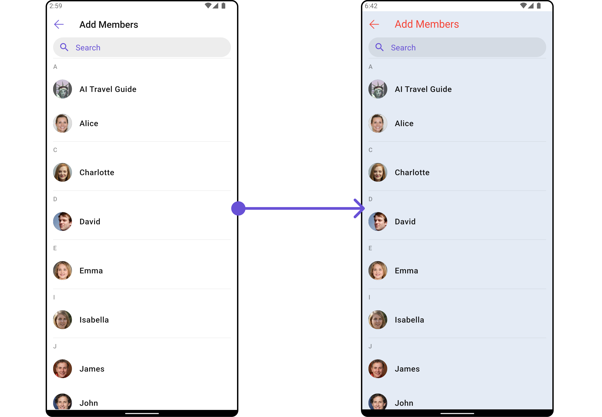

</TabItem>

<TabItem value="iOS" label="iOS">

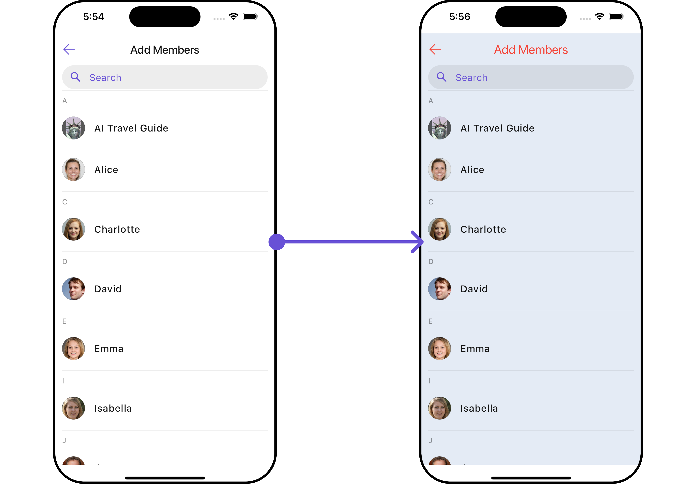

</TabItem>

</Tabs>

List of properties exposed by `AddMembersStyle`

| Property                   | Description                                    | Code                                |
| -------------------------- | ---------------------------------------------- | ----------------------------------- |
| **Back Icon Tint**         | Tint color for the back icon.                  | `backIconTint: Color?`              |
| **Background**             | Background color or decoration.                | `background: Decoration?`           |
| **Border**                 | Border of the widget.                          | `border: Border?`                   |
| **Border Radius**          | Radius of the widget's border.                 | `borderRadius: BorderRadius?`       |
| **Close Icon Tint**        | Tint color for the close icon.                 | `closeIconTint: Color?`             |
| **Empty State Text Style** | Style for the empty state text.                | `emptyStateTextStyle: TextStyle?`   |
| **Error State Text Style** | Style for the error state text.                | `errorStateTextStyle: TextStyle?`   |
| **Gradient**               | Gradient used for the widget's background.     | `gradient: Gradient?`               |
| **Height**                 | Height of the widget.                          | `height: double?`                   |
| **Placeholder Style**      | Style for the placeholder text.                | `placeholderStyle: TextStyle?`      |
| **Search Background**      | Background color or decoration for the search. | `searchBackground: Decoration?`     |
| **Search Border Color**    | Color of the search field's border.            | `searchBorderColor: Color?`         |
| **Search Border Radius**   | Radius of the search field's border.           | `searchBorderRadius: BorderRadius?` |
| **Search Border Width**    | Width of the search field's border.            | `searchBorderWidth: double?`        |
| **Search Icon Tint**       | Tint color for the search icon.                | `searchIconTint: Color?`            |
| **Search Style**           | Style for the search text.                     | `searchStyle: TextStyle?`           |
| **Selection Icon Tint**    | Tint color for the selection icon.             | `selectionIconTint: Color?`         |
| **Submit Icon Tint**       | Tint color for the submit icon.                | `submitIconTint: Color?`            |
| **Title Style**            | Style for the title text.                      | `titleStyle: TextStyle?`            |
| **Width**                  | Width of the widget.                           | `width: double?`                    |

---

##### 2. Avatar Style

To apply customized styles to the `Avatar` widget in the `CometChatAddMembers` Widget, you can use the following code snippet. For further insights on `Avatar` Styles [refer](/ui-kit/flutter/avatar)

<Tabs>

<TabItem value="Dart" label="Dart">

```dart
CometChatAddMembers(
  group: Group(guid: "", name: "", type: ""), // A group object is required to launch this widget.
  avatarStyle: AvatarStyle(
      border: Border.all(width: 5),
      borderRadius: 20,
      background: Colors.red
  ),
)
```

</TabItem>

</Tabs>

---

##### 3. StatusIndicator Style

To apply customized styles to the Status Indicator widget in the `CometChatAddMembers` Widget, You can use the following code snippet. For further insights on Status Indicator Styles [refer](/ui-kit/flutter/status-indicator)

<Tabs>

<TabItem value="Dart" label="Dart">

```dart
CometChatAddMembers(
  group: Group(guid: "", name: "", type: ""), // A group object is required to launch this widget.
  statusIndicatorStyle: StatusIndicatorStyle(
      borderRadius: 10,
      gradient: LinearGradient(colors: [Colors.red, Colors.orange], begin: Alignment.topLeft, end: Alignment.bottomRight)
  ),
)
```

</TabItem>

</Tabs>

---

##### 4. ListItem Style

To apply customized styles to the `ListItemStyle` in the `CometChatAddMembers` Widget, you can use the following code snippet. For further insights on `List Item` Styles [refer](/ui-kit/flutter/list-item)

<Tabs>

<TabItem value="Dart" label="Dart">

```dart
CometChatAddMembers(
  group: Group(guid: "", name: "", type: ""), // A group object is required to launch this widget.
  hideSeparator: true,
  listItemStyle: ListItemStyle(
      background: Color(0xFFE4EBF5),
      borderRadius: 20,
      border: Border.all(width: 2),
      margin: EdgeInsets.only(top: 10),
      padding: EdgeInsets.only(left: 10)
  ),
)
```

</TabItem>

</Tabs>

---

### Functionality

These are a set of small functional customizations that allow you to fine-tune the overall experience of the widget. With these, you can change text, set custom icons, and toggle the visibility of UI elements.

<Tabs>

<TabItem value="Dart" label="Dart">

```dart
CometChatAddMembers(
    group: Group(guid: "", name: "", type: ""), // A group object is required to launch this widget.
    title: "Your Title",
    hideSeparator: true,
    hideSearch: true,
    showBackButton: false
)
```

</TabItem>

</Tabs>

<Tabs>

<TabItem value="Android" label="Android">

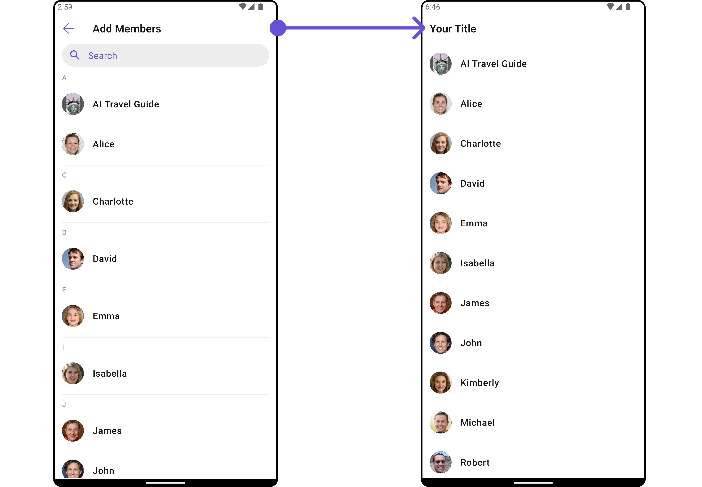

</TabItem>

<TabItem value="iOS" label="iOS">

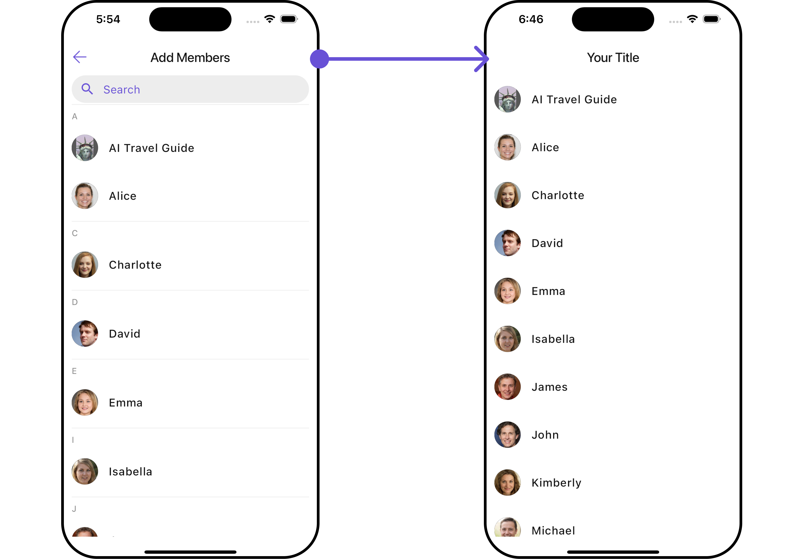

</TabItem>

</Tabs>

List of functionality exposed by `CometChatAddMembers`

| Property                   | Description                                   | Code                          |
| -------------------------- | --------------------------------------------- | ----------------------------- |
| **Back Button**            | Custom widget for the back button.            | `backButton: Widget?`         |
| **Disable Users Presence** | Option to disable displaying users' presence. | `disableUsersPresence: bool?` |
| **Empty State Text**       | Text to display when there are no members.    | `emptyStateText: String?`     |
| **Error State Text**       | Text to display when there is an error.       | `errorStateText: String?`     |
| **Hide Error**             | Option to hide error messages.                | `hideError: bool?`            |
| **Hide Search**            | Option to hide the search bar.                | `hideSearch: bool`            |
| **Hide Separator**         | Option to hide item separators in the list.   | `hideSeparator: bool?`        |
| **Search Icon**            | Custom widget for the search icon.            | `searchIcon: Widget?`         |
| **Search Placeholder**     | Placeholder text for the search bar.          | `searchPlaceholder: String?`  |
| **Selection Icon**         | Custom widget for the selection icon.         | `selectionIcon: Widget?`      |
| **Show Back Button**       | Option to show or hide the back button.       | `showBackButton: bool`        |
| **Submit Icon**            | Custom widget for the submit icon.            | `submitIcon: Widget?`         |
| **Title**                  | Title text for the widget.                    | `title: String?`              |

---

### Advanced

For advanced-level customization, you can set custom views to the widget. This lets you tailor each aspect of the widget to fit your exact needs and application aesthetics. You can create and define your own widget and then incorporate those into the widget.

The `CometChatAddMembers` widget does not provide additional functionalities beyond this level of customization.

#### ListItemView

With this function, you can assign a custom ListItem to the `CometChatAddMembers` Widget.

<Tabs>

<TabItem value="Dart" label="Dart">

```dart title="widget"
CometChatAddMembers(
  group: Group(guid: "", name: "", type: ""), // A group object is required to launch this widget.
  listItemView: (user) {
    return Placeholder(); // Replace this placeholder with your custom widget.
  },
)
```

</TabItem>

</Tabs>

Here is the complete example for reference:

**Example**

You can indeed create a custom widget named `custom_list_item.dart` for more complex or unique list items.

<Tabs>

<TabItem value="Dart" label="Dart">

```dart title="custom_list_item.dart"
import 'package:flutter/material.dart';
import 'package:intl/intl.dart';
import '../helper/utils/custom_colors.dart';

class CustomListItems extends StatelessWidget {
  final String name;
  final DateTime? lastMessageTime;
  final String? avatarUrl;

  const CustomListItems({
    super.key,
    required this.name,
    this.lastMessageTime,
    this.avatarUrl,
  });

  String formatDateTime(DateTime dateTime) {
    final now = DateTime.now();
    final difference = now.difference(dateTime);

    if (difference.inDays == 0) {
      return DateFormat('HH:mm').format(dateTime);
    } else if (difference.inDays == 1) {
      return 'Yesterday';
    } else {
      return DateFormat('yyyy-MM-dd').format(dateTime);
    }
  }

  @override
  Widget build(BuildContext context) {
    return Container(
      margin: const EdgeInsets.only(top: 5, bottom: 5),
      padding: const EdgeInsets.all(8.0),
      decoration: BoxDecoration(
        border: Border.all(color: Color(0xFF6851D6), width: 1), // Example border color
        borderRadius: BorderRadius.circular(8.0),
        color: Color(0xFFEEEEEE)
      ),
      child: Row(
        crossAxisAlignment: CrossAxisAlignment.center,
        children: [
          Expanded(
            child: Column(
              crossAxisAlignment: CrossAxisAlignment.start,
              mainAxisAlignment: MainAxisAlignment.center,
              children: [
                Text(
                  name,
                  style: const TextStyle(
                    fontWeight: FontWeight.bold,
                  ),
                ),
                lastMessageTime == null ? Container() : Text(formatDateTime(lastMessageTime!)),
              ],
            ),
          ),
          const SizedBox(width: 8.0),
          if (avatarUrl != null)
            ClipOval(
              child: Image.network(
                avatarUrl!,
                width: 40.0,
                height: 40.0,
                fit: BoxFit.cover,
                errorBuilder: (context, error, stackTrace) {
                  return const Icon(
                    Icons.person,
                    size: 40.0,
                  );
                },
              ),
            )
          else
            const Icon(
              Icons.person,
              size: 40.0,
            ),
        ],
      ),
    );
  }
}
```

</TabItem>

</Tabs>

<Tabs>

<TabItem value="Dart" label="Dart">

```dart title="main.dart"
CometChatAddMembers(
  group: Group(guid: "", name: "", type: ""), // A group object is required to launch this widget.
  listItemView: (user) {
    return CustomListItems(
      name: user.name,
      avatarUrl: user.avatar,
    ); // Replaced Placeholder with CustomListItems widget.
  },
)
```

</TabItem>

</Tabs>

<Tabs>

<TabItem value="Android" label="Android">

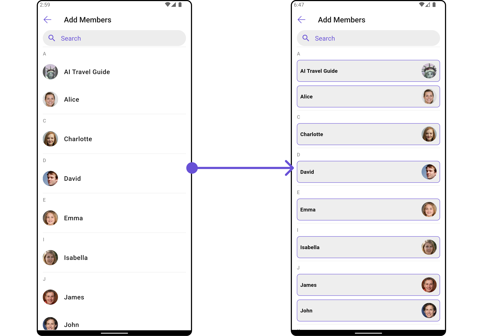

</TabItem>

<TabItem value="iOS" label="iOS">

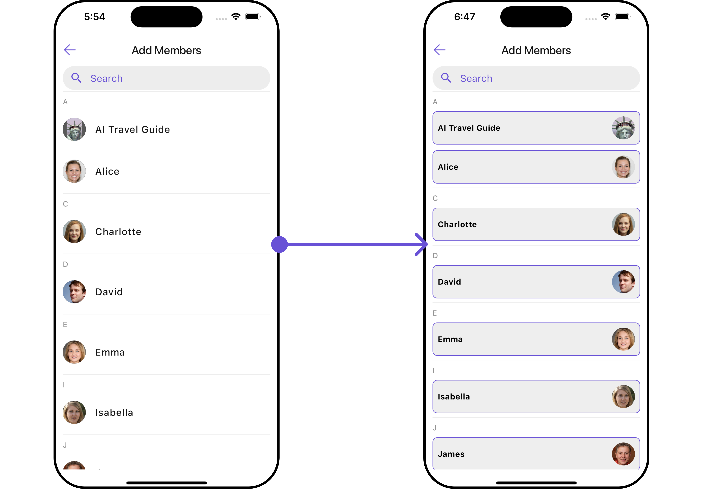

</TabItem>

</Tabs>

---

#### SubtitleView

You can customize the subtitle view for each item to meet your specific preferences and needs.

<Tabs>

<TabItem value="Dart" label="Dart">

```dart title="widget"
CometChatAddMembers(
  group: Group(guid: "", name: "", type: ""), // A group object is required to launch this widget.
  subtitleView: (context, user) {
    return Placeholder(); // Replace this placeholder with your custom widget.
  },
)
```

</TabItem>

</Tabs>

Here is the complete example for reference:

**Example**

<Tabs>

<TabItem value="Dart" label="Dart">

```dart title="main.dart"
CometChatAddMembers(
  group: Group(guid: "", name: "", type: ""), // A group object is required to launch this widget.
  subtitleView: (context, user) {
    return const Row(
      children: [
        Icon(Icons.call, color: Color(0xFF6851D6), size: 25,),
        SizedBox(width: 10),
        Icon(Icons.video_call, color: Color(0xFF6851D6), size: 25,),
      ],
    ); // Replaced the placeholder with a custom widget.
  },
)
```

</TabItem>

</Tabs>

<Tabs>

<TabItem value="Android" label="Android">

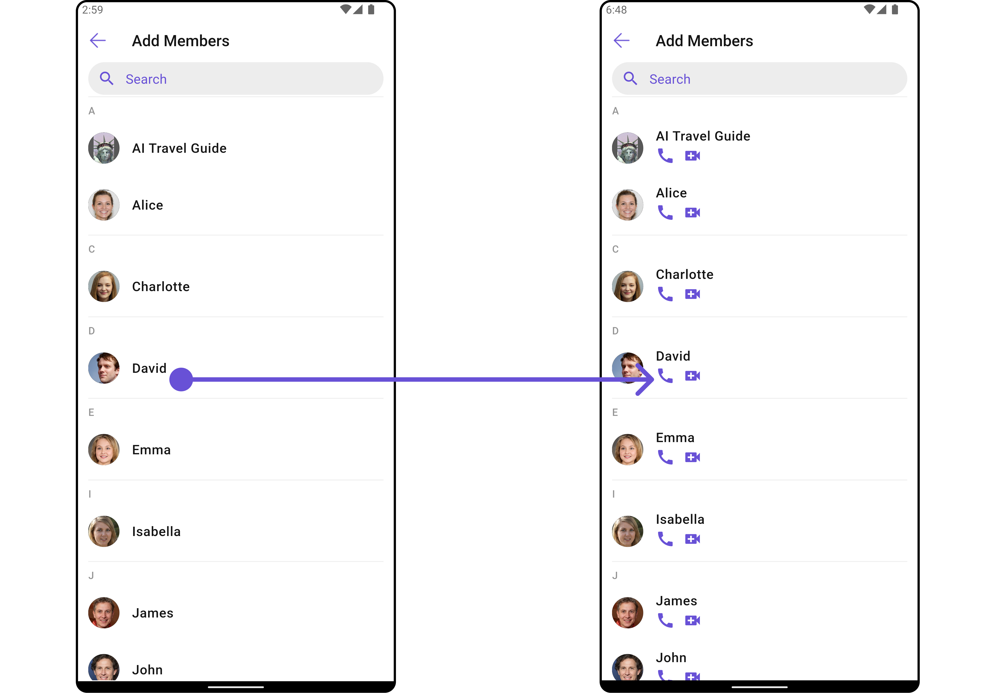

</TabItem>

<TabItem value="iOS" label="iOS">

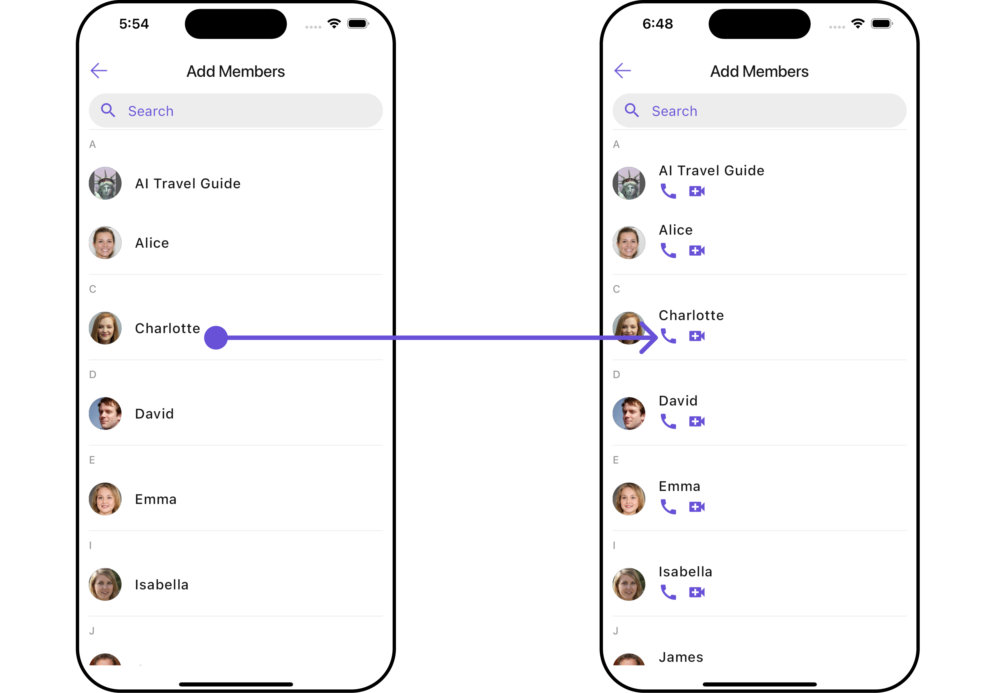

</TabItem>

</Tabs>

---

#### AppBarOptions

You can set the Custom `appBarOptions` to the `CometChatAddMembers` widget.

<Tabs>

<TabItem value="Dart" label="Dart">

```dart title="widget"
CometChatAddMembers(
  group: Group(guid: "", name: "", type: ""), // A group object is required to launch this widget.
  appBarOptions: (context) {
    return [
      Placeholder(),
      Placeholder(),
      Placeholder()
    ] // Replace this list of placeholder widgets with your list of custom widgets.
  },
)
```

</TabItem>

</Tabs>

Here is the complete example for reference:

**Example**

<Tabs>

<TabItem value="Dart" label="Dart">

```dart
CometChatAddMembers(
  group: Group(guid: "", name: "", type: ""), // A group object is required to launch this widget.
  appBarOptions: (context) {
    return [
      InkWell(
        onTap: () {
          // TODO("Not yet implemented")
        },
        child: const Icon(Icons.ac_unit, color: Color(0xFF6851D6)),
      ),
      const SizedBox(width: 10)
    ]; // Replaced the list of placeholder widgets with a list of custom widgets.
  },
)
```

</TabItem>

</Tabs>

<Tabs>

<TabItem value="Android" label="Android">

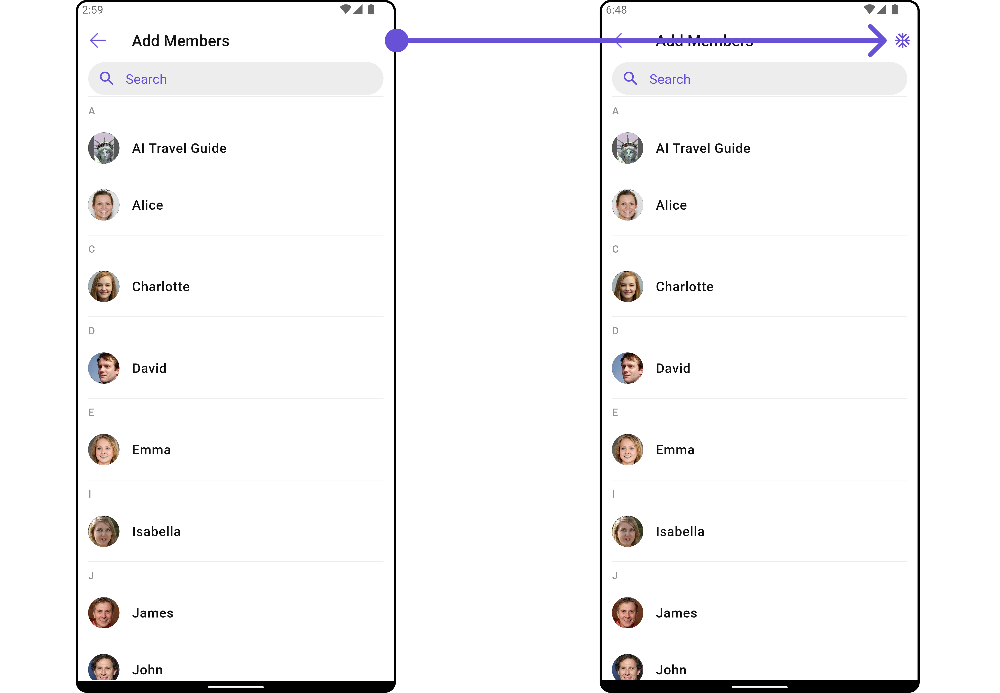

</TabItem>

<TabItem value="iOS" label="iOS">

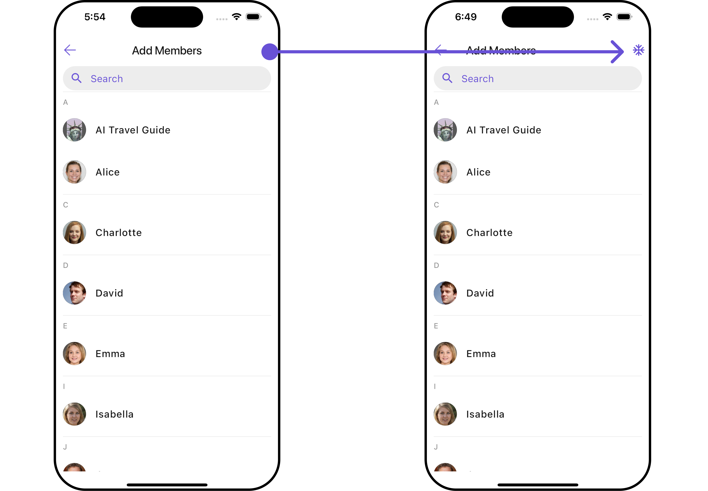

</TabItem>

</Tabs>

---

#### EmptyStateView

You can set a custom `EmptyStateView` using `emptyStateView` to match the error widget of your app.

<Tabs>

<TabItem value="Dart" label="Dart">

```dart title="widget"
CometChatAddMembers(
  group: Group(guid: "", name: "", type: ""), // A group object is required to launch this widget.
  emptyStateView: (context) {
    return Placeholder(); // Replace this placeholder with your custom widget.
  },
)
```

</TabItem>

</Tabs>

Here is the complete example for reference:

**Example**

<Tabs>

<TabItem value="Dart" label="Dart">

```dart title="main.dart"
CometChatAddMembers(
  group: Group(guid: "", name: "", type: ""), // A group object is required to launch this widget.
  emptyStateView: (context) {
    return Container(
      width: MediaQuery.of(context).size.width,
      child: Center(
          child: const Column(
            crossAxisAlignment: CrossAxisAlignment.center,
            mainAxisAlignment: MainAxisAlignment.center,
            children: [
              Spacer(),
              Icon(Icons.sms_failed_outlined, color: Colors.red, size: 100,),
              SizedBox(height: 20,),
              Text("Your Custom Message"),
              Spacer(),
            ],
          )
      ),
    ); // Replaced the placeholder with a custom widget.
  },
)
```

</TabItem>

</Tabs>

<Tabs>

<TabItem value="Android" label="Android">

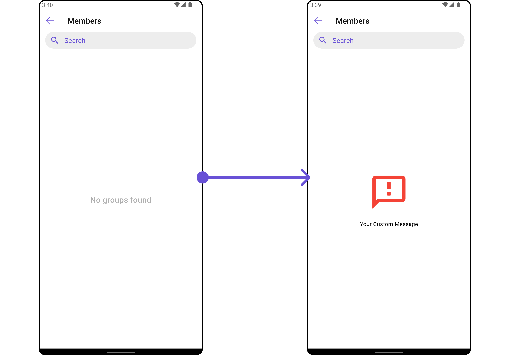

</TabItem>

<TabItem value="iOS" label="iOS">

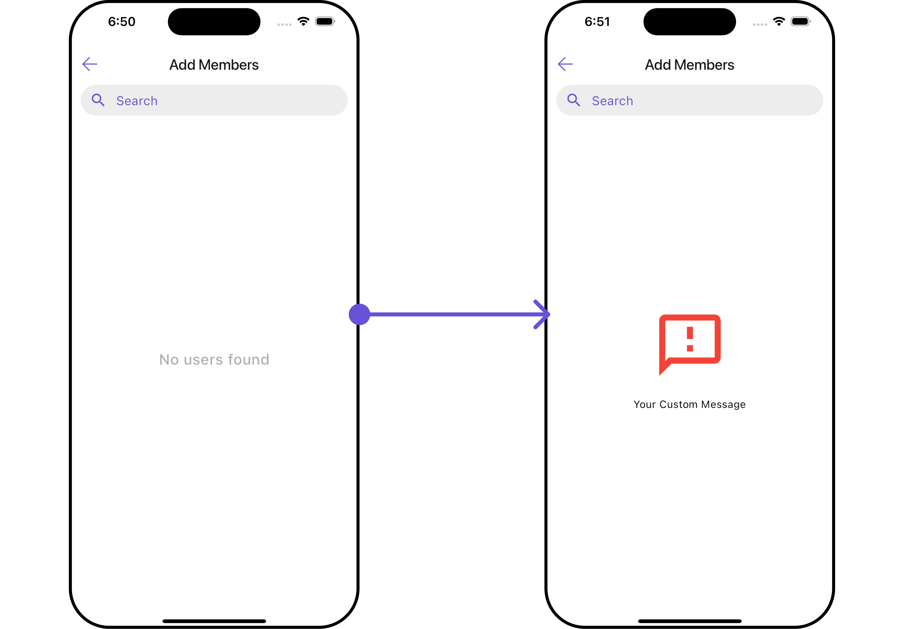

</TabItem>

</Tabs>

---

#### LoadingStateView

You can set a custom loader widget using `loadingStateView` to match the loading UI of your app.

<Tabs>

<TabItem value="Dart" label="Dart">

```dart title="widget"
CometChatAddMembers(
  group: Group(guid: "", name: "", type: ""), // A group object is required to launch this widget.
  loadingStateView: (context) {
    return Placeholder(); // Replace this placeholder with your custom widget.
  },
)
```

</TabItem>

</Tabs>

Here is the complete example for reference:

**Example**

<Tabs>

<TabItem value="Dart" label="Dart">

```dart title="main.dart"
CometChatAddMembers(
  group: Group(guid: "", name: "", type: ""), // A group object is required to launch this widget.
  loadingStateView: (context) {
    return Container(
      width: MediaQuery.of(context).size.width,
      child: Center(
          child: CircularProgressIndicator()
      ),
    ); // Replaced the placeholder with a custom widget.
  },
)
```

</TabItem>

</Tabs>

<Tabs>

<TabItem value="Android" label="Android">

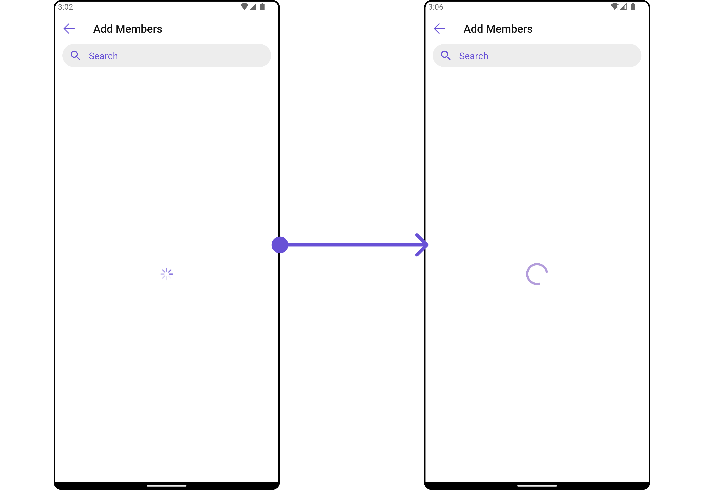

</TabItem>

<TabItem value="iOS" label="iOS">

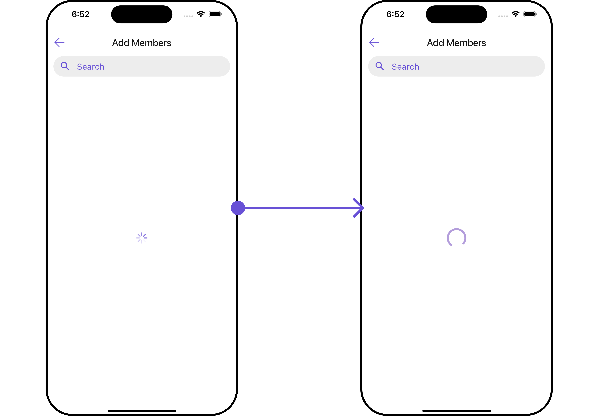

</TabItem>

</Tabs>

---

#### ErrorStateView

You can set a custom `ErrorStateView` using `errorStateView` to match the error UI of your app.

<Tabs>

<TabItem value="Dart" label="Dart">

```dart title="widget"
CometChatAddMembers(
  group: Group(guid: "", name: "", type: ""), // A group object is required to launch this widget.
  errorStateView: (context) {
    return Placeholder(); // Replace this placeholder with your custom widget.
  },
)
```

</TabItem>

</Tabs>

Here is the complete example for reference:

**Example**

<Tabs>

<TabItem value="Dart" label="Dart">

```dart title="main.dart"
CometChatAddMembers(
  group: Group(guid: "", name: "", type: ""), // A group object is required to launch this widget.
  errorStateView: (context) {
    return Container(
      width: MediaQuery.of(context).size.width,
      child: Center(
        child: const Column(
          crossAxisAlignment: CrossAxisAlignment.center,
          mainAxisAlignment: MainAxisAlignment.center,
          children: [
            Spacer(),
            Icon(Icons.error_outline, color: Colors.red, size: 100,),
            SizedBox(height: 20,),
            Text("Your Custom Error Message"),
            Spacer(),
          ],
        ),
      ),
    ); // Replaced the placeholder with a custom widget.
  },
)
```

</TabItem>

</Tabs>

<Tabs>

<TabItem value="Android" label="Android">

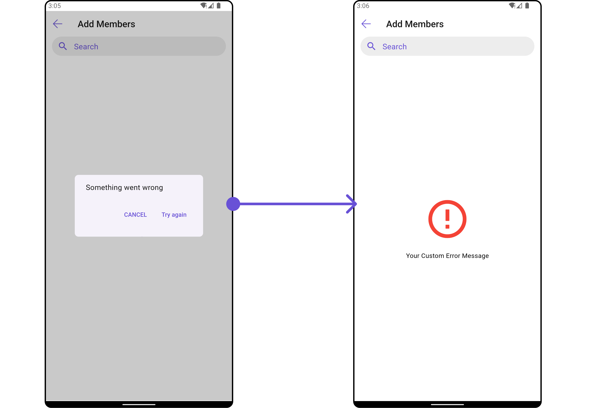

</TabItem>

<TabItem value="iOS" label="iOS">

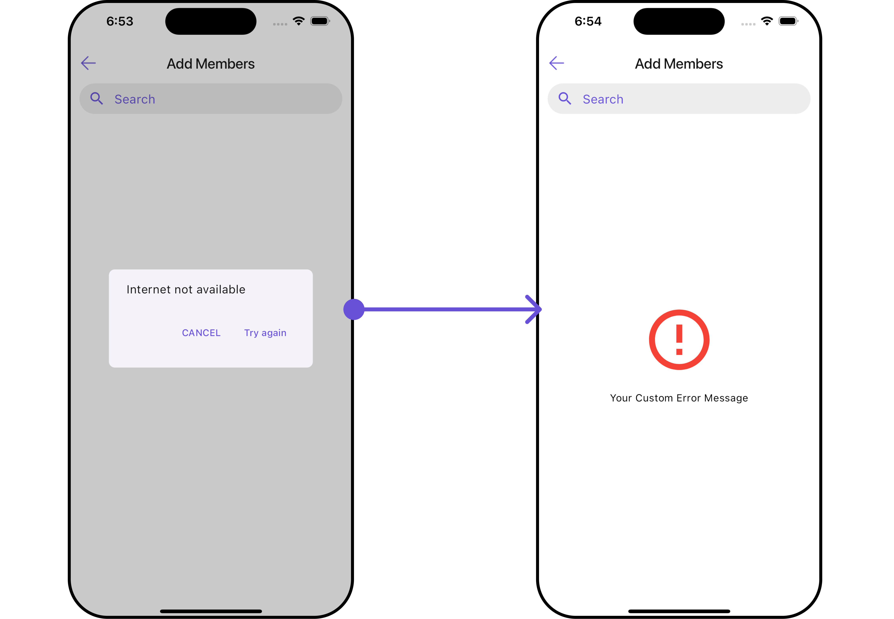

</TabItem>

</Tabs>

---
