import Tabs from '@theme/Tabs';
import TabItem from '@theme/TabItem';
import { Tooltip } from 'react-tooltip'
import 'react-tooltip/dist/react-tooltip.css'

<Tooltip id="my-tooltip-html-prop" html="Not available in Group Members Configuration object"/>

## Overview

`CometChatBannedMembers` is a crucial [Widget](/ui-kit/flutter/components-overview#components) that showcases users who have been restricted from participating in specific groups or conversations. Once banned, users lose access to content and discussions within the affected group. Administrators or owners wield the authority to ban members from groups they oversee, enabling them to monitor user activity and behavior closely. With CometChatBannedMembers, administrators can take swift and appropriate actions to maintain group integrity and uphold community standards.

<Tabs>

<TabItem value="Android" label="Android">

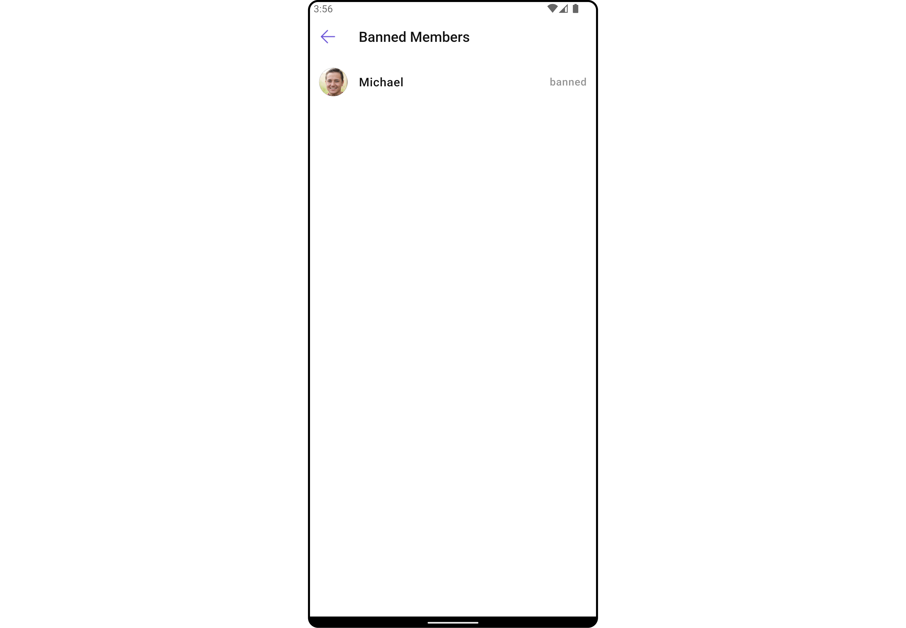

</TabItem>

<TabItem value="iOS" label="iOS">

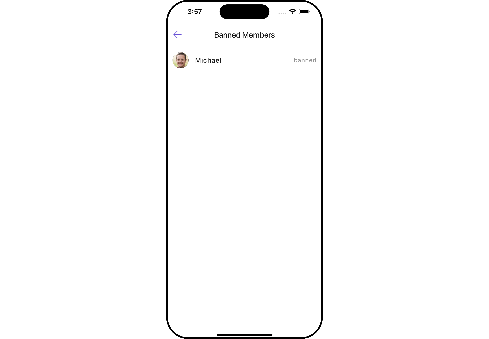

</TabItem>

</Tabs>

The `BannedMembers` Widget is composed of the following BaseWidgets:

| Widgets                                        | Description                                                                                                                                                                                |
| ---------------------------------------------- | ------------------------------------------------------------------------------------------------------------------------------------------------------------------------------------------ |
| [CometChatListBase](/ui-kit/flutter/list-base) | `CometChatListBase` serves as a container Widget equipped with a title (navigationBar), search functionality (search-bar), background settings, and a container for embedding a list view. |
| [CometChatListItem](/ui-kit/flutter/list-item) | This Widget renders information extracted from a `User` object onto a tile, featuring a title, subtitle, leading view, and trailing view.                                                  |

---

## Usage

### Integration

`CometChatBannedMembers` , as a Composite Widget, offers flexible integration options, allowing it to be launched directly via button clicks or any user-triggered action. Additionally, it seamlessly integrates into tab view controllers. With banned members, users gain access to a wide range of parameters and methods for effortless customization of its user interface.

You can launch `CometChatBannedMembers` directly using `Navigator.push` , or you can define it as a widget within the `build` method of your `State` class.

##### 1. Using Navigator to Launch `CometChatBannedMembers`

<Tabs>

<TabItem value="Dart" label="Dart">

```dart
Navigator.push(context, MaterialPageRoute(builder: (context) => CometChatBannedMembers(group: Group(guid: "", name: "", type: "")))); // A group object is required to launch this widget.
```

</TabItem>

</Tabs>

##### 2. Embedding `CometChatBannedMembers` as a Widget in the build Method

<Tabs>

<TabItem value="Dart" label="Dart">

```dart
import 'package:cometchat_chat_uikit/cometchat_chat_uikit.dart';
import 'package:flutter/material.dart';

class GroupBannedMembers extends StatefulWidget {
  const GroupBannedMembers({super.key});

  @override
  State<GroupBannedMembers> createState() => _GroupBannedMembersState();
}

class _GroupBannedMembersState extends State<GroupBannedMembers> {

  @override
  Widget build(BuildContext context) {
    return Scaffold(
        body: SafeArea(
            child: CometChatBannedMembers(
              group: Group(guid: "", name: "", type: ""), // A group object is required to launch this widget.
            ) // A group object is required to launch this widget.
        )
    );
  }
}
```

</TabItem>

</Tabs>

---

### Actions

[Actions](/ui-kit/flutter/components-overview#actions) dictate how a Widget functions. They are divided into two types: Predefined and User-defined. You can override either type, allowing you to tailor the behavior of the Widget to fit your specific needs.

##### 1. onItemTap

This method proves valuable when users seek to override onItemClick functionality within `CometChatBannedMembers` , empowering them with greater control and customization options.

The `onItemTap` action doesn't have a predefined behavior. You can override this action using the following code snippet.

<Tabs>

<TabItem value="Dart" label="Dart">

```dart
CometChatBannedMembers(
  group: Group(guid: "", name: "", type: ""), // A group object is required to launch this widget.
  onItemTap: (groupMember) {
    // TODO("Not yet implemented")
  },
)
```

</TabItem>

</Tabs>

---

##### 2. onItemLongPress

This method becomes invaluable when users seek to override long-click functionality within `CometChatBannedMembers` , offering them enhanced control and flexibility in their interactions.

The `onItemLongPress` action doesn't have a predefined behavior. You can override this action using the following code snippet.

<Tabs>

<TabItem value="Dart" label="Dart">

```dart
CometChatBannedMembers(
  group: Group(guid: "", name: "", type: ""), // A group object is required to launch this widget.
  onItemLongPress: (groupMember) {
    // TODO("Not yet implemented")
  },
)
```

</TabItem>

</Tabs>

---

##### 3. onBack

Enhance your application's functionality by leveraging the `onBack` feature. This capability allows you to customize the behavior associated with navigating back within your app. Utilize the provided code snippet to override default behaviors and tailor the user experience according to your specific requirements.

<Tabs>

<TabItem value="Dart" label="Dart">

```dart
CometChatBannedMembers(
  group: Group(guid: "", name: "", type: ""), // A group object is required to launch this widget.
  onBack: () {
    // TODO("Not yet implemented")
  },
)
```

</TabItem>

</Tabs>

---

##### 4. onError

You can customize this behavior by using the provided code snippet to override the `onError` and improve error handling.

<Tabs>

<TabItem value="Dart" label="Dart">

```dart
CometChatBannedMembers(
  group: Group(guid: "", name: "", type: ""), // A group object is required to launch this widget.
  onError: (e) {
    // TODO("Not yet implemented")
  },
)
```

</TabItem>

</Tabs>

---

##### 5. onSelection

When the `onSelection` event is triggered, it furnishes the list of selected members. This event can be invoked by any button or action within the interface. You have the flexibility to implement custom actions or behaviors based on the selected members.

This action does not come with any predefined behavior. However, you have the flexibility to override this event and tailor it to suit your needs using the following code snippet.

<Tabs>

<TabItem value="Dart" label="Dart">

```dart
CometChatBannedMembers(
  group: Group(guid: "", name: "", type: ""), // A group object is required to launch this widget.
  selectionMode: SelectionMode.multiple,
  onSelection: (groupMembersList) {
    // TODO("Not yet implemented")
  },
)
```

</TabItem>

</Tabs>

---

### Filters

**Filters** allow you to customize the data displayed in a list within a Widget. You can filter the list based on your specific criteria, allowing for a more customized. Filters can be applied using RequestBuilders of Chat SDK.

##### 1. BannedGroupMembersRequestBuilder

The `BannedGroupMembersRequestBuilder` enables you to filter and customize the Banned Members list based on available parameters in BannedGroupMembersRequestBuilder. This feature allows you to create more specific and targeted queries when fetching banned members. The following are the parameters available in `BannedGroupMembersRequestBuilder`

| **Property**       | Description                                                    | Code                     |
| ------------------ | -------------------------------------------------------------- | ------------------------ |
| **Guid**           | Group ID for the group whose banned members are to be fetched. | `guid: String`           |
| **Limit**          | Number of results to limit the query.                          | `limit: int?`            |
| **Search Keyword** | Keyword for searching.                                         | `searchKeyword: String?` |

**Example**

In the example below, we are applying a filter to the banned members by setting the limit to 10.

<Tabs>

<TabItem value="Dart" label="Dart">

```dart
CometChatBannedMembers(
    group: Group(guid: "", name: "", type: ""), // A group object is required to launch this widget.
    bannedMemberRequestBuilder: BannedGroupMembersRequestBuilder(guid: "")
      ..limit = 10
)
```

</TabItem>

</Tabs>

---

##### 2. CustomBannedMembersProtocol

The `CustomBannedMembersProtocol` uses `BannedGroupMembersRequestBuilder` enables you to filter and customize the search list based on available parameters in BannedMembersRequestBuilder.

This feature allows you to keep uniformity between the displayed Banned Members list and searched Banned Members.

**Example**

<Tabs>

<TabItem value="Dart" label="Dart">

```dart title="custom_protocol.dart"
import 'package:cometchat_chat_uikit/cometchat_chat_uikit.dart';

class CustomBannedMembersProtocol extends BannedMemberBuilderProtocol {
  const CustomBannedMembersProtocol(super.builder);

  @override
  BannedGroupMembersRequest getRequest() {
      return requestBuilder.build();
  }

  @override
  BannedGroupMembersRequest getSearchRequest(String val) {
      requestBuilder.searchKeyword = val;
      return requestBuilder.build();
  }
}
```

</TabItem>

</Tabs>

<Tabs>

<TabItem value="Dart" label="Dart">

```dart title="main.dart"
CometChatBannedMembers(
  group: Group(guid: "", name: "", type: ""), // A group object is required to launch this widget.
  bannedMemberProtocol: CustomBannedMembersProtocol(BannedGroupMembersRequestBuilder(guid: "")..searchKeyword = "searchKeyword"),
)
```

</TabItem>

</Tabs>

---

### Events

[Events](/ui-kit/flutter/components-overview#events) are emitted by a `Widget` . By using event you can extend existing functionality. Being global events, they can be applied in Multiple Locations and are capable of being Added or Removed.

Events emitted by the Join Group Widget is as follows.

| Event                     | Description                                                                                               |
| ------------------------- | --------------------------------------------------------------------------------------------------------- |
| **ccGroupMemberBanned**   | This method is triggered when the logged-in user successfully bans a user from the group.                 |
| **ccGroupMemberUnBanned** | This method triggers when the logged-in user successfully unbans a previously banned user from the group. |

<Tabs>

<TabItem value="Dart" label="Dart">

```dart title="your_screen.dart"
import 'package:cometchat_chat_uikit/cometchat_chat_uikit.dart';
import 'package:cometchat_sdk/models/action.dart' as cc;
import 'package:flutter/material.dart';

class YourScreen extends StatefulWidget {
  const YourScreen({super.key});

  @override
  State<YourScreen> createState() => _YourScreenState();
}

class _YourScreenState extends State<YourScreen> with CometChatGroupEventListener {

  @override
  void initState() {
    super.initState();
    CometChatGroupEvents.addGroupsListener("listenerId", this); // Add the listener
  }

  @override
  void dispose(){
    super.dispose();
    CometChatGroupEvents.removeGroupsListener("listenerId"); // Remove the listener
  }

  @override
  void ccGroupMemberBanned(cc.Action message, User bannedUser, User bannedBy, Group bannedFrom) {
    // TODO("Not yet implemented")
  }

  @override
  void ccGroupMemberUnbanned(cc.Action message, User unbannedUser, User unbannedBy, Group unbannedFrom) {
    // TODO("Not yet implemented")
  }

  @override
  Widget build(BuildContext context) {
    return const Placeholder();
  }
}
```

</TabItem>

</Tabs>

---

## Customization

To fit your app's design requirements, you can customize the appearance of the Groups Widget. We provide exposed methods that allow you to modify the experience and behavior according to your specific needs.

### Style

Using **Style** you can **customize** the look and feel of the Widget in your app, These parameters typically control elements such as the **color**, **size**, **shape**, and **fonts** used within the Widget.

##### 1. BannedMembers Style <a data-tooltip-id="my-tooltip-html-prop"> <span class="material-icons red">report</span> </a>

You can set the `BannedMembersStyle` to the `CometChatBannedMembers` Widget to customize the styling.

<Tabs>

<TabItem value="Dart" label="Dart">

```dart
CometChatBannedMembers(
  group: Group(guid: "", name: "", type: ""), // A group object is required to launch this widget.
  bannedMembersStyle: BannedMembersStyle(
      background: Color(0xFFE4EBF5),
      titleStyle: TextStyle(color: Colors.red),
      backIconTint: Colors.red
  ),
)
```

</TabItem>

</Tabs>

<Tabs>

<TabItem value="Android" label="Android">

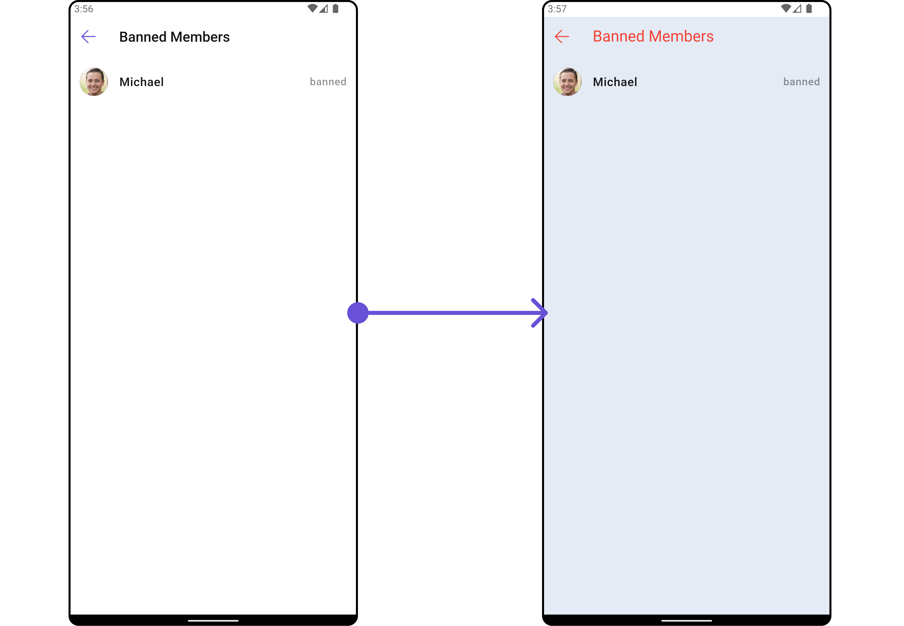

</TabItem>

<TabItem value="iOS" label="iOS">

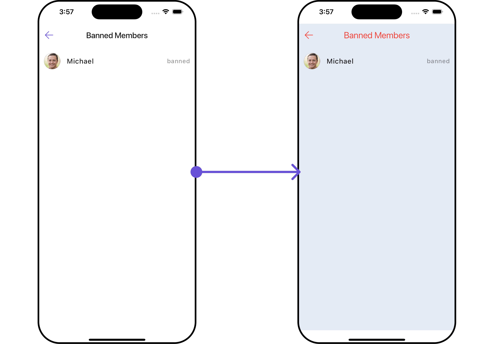

</TabItem>

</Tabs>

List of properties exposed by BannedMembersStyle

| **Property**                  | Description                                                    | Code                                 |
| ----------------------------- | -------------------------------------------------------------- | ------------------------------------ |
| **Back Icon Tint**            | Tint color for the back icon.                                  | `backIconTint: Color?`               |
| **Background**                | Background color or decoration.                                | `background: Decoration?`            |
| **Border**                    | Border of the Widget.                                          | `border: Border?`                    |
| **Border Radius**             | Radius of the Widget's border.                                 | `borderRadius: BorderRadius?`        |
| **Empty Text Style**          | Style for the text displayed when there are no banned members. | `emptyTextStyle: TextStyle?`         |
| **Error Text Style**          | Style for the text displayed when there is an error.           | `errorTextStyle: TextStyle?`         |
| **Gradient**                  | Gradient used for the Widget's background.                     | `gradient: Gradient?`                |
| **Height**                    | Height of the Widget.                                          | `height: double?`                    |
| **Loading Icon Tint**         | Tint color for the loading icon.                               | `loadingIconTint: Color?`            |
| **Online Status Color**       | Color indicating online status.                                | `onlineStatusColor: Color?`          |
| **Search Background**         | Background color or decoration for the search field.           | `searchBackground: Decoration?`      |
| **Search Border Color**       | Color of the search field's border.                            | `searchBorderColor: Color?`          |
| **Search Border Radius**      | Radius of the search field's border.                           | `searchBorderRadius: BorderRadius?`  |
| **Search Border Width**       | Width of the search field's border.                            | `searchBorderWidth: double?`         |
| **Search Icon Tint**          | Tint color for the search icon.                                | `searchIconTint: Color?`             |
| **Search Placeholder Style**  | Style for the placeholder text in the search field.            | `searchPlaceholderStyle: TextStyle?` |
| **Search Style**              | Style for the search text.                                     | `searchStyle: TextStyle?`            |
| **Section Header Text Style** | Style for the section header text.                             | `sectionHeaderTextStyle: TextStyle?` |
| **Tail Text Style**           | Style for the text displayed at the end of the list.           | `tailTextStyle: TextStyle?`          |
| **Title Style**               | Style for the title text.                                      | `titleStyle: TextStyle?`             |
| **Width**                     | Width of the Widget.                                           | `width: double?`                     |

---

##### 2. Avatar Style

To apply customized styles to the `Avatar` Widget in the Banned Members Widget, you can use the following code snippet. For further insights on `Avatar` Styles [refer](/ui-kit/flutter/avatar)

<Tabs>

<TabItem value="Dart" label="Dart">

```dart
CometChatBannedMembers(
  group: Group(guid: "", name: "", type: ""), // A group object is required to launch this widget.
  avatarStyle: AvatarStyle(
      border: Border.all(width: 5),
      borderRadius: 20,
      background: Colors.red
  ),
)
```

</TabItem>

</Tabs>

---

##### 3. StatusIndicator Style

To apply customized styles to the Status Indicator widget in the `CometChatBannedMembers` Widget, You can use the following code snippet. For further insights on Status Indicator Styles [refer](/ui-kit/flutter/status-indicator)

<Tabs>

<TabItem value="Dart" label="Dart">

```dart
CometChatBannedMembers(
  group: Group(guid: "", name: "", type: ""), // A group object is required to launch this widget.
  statusIndicatorStyle: StatusIndicatorStyle(
      borderRadius: 10,
      gradient: LinearGradient(colors: [Colors.red, Colors.orange], begin: Alignment.topLeft, end: Alignment.bottomRight)
  ),
)
```

</TabItem>

</Tabs>

---

##### 4. ListItem Style

To apply customized styles to the `ListItemStyle` in the `CometChatBannedMembers` Widget, you can use the following code snippet. For further insights on `List Item` Styles [refer](/ui-kit/flutter/list-item)

<Tabs>

<TabItem value="Dart" label="Dart">

```dart
CometChatBannedMembers(
  group: Group(guid: "", name: "", type: ""), // A group object is required to launch this widget.
  hideSeparator: true,
  listItemStyle: ListItemStyle(
      background: Color(0xFFE4EBF5),
      borderRadius: 20,
      border: Border.all(width: 2),
      margin: EdgeInsets.only(top: 10),
      padding: EdgeInsets.only(left: 10)
  ),
)
```

</TabItem>

</Tabs>

---

### Functionality

These are a set of small functional customizations that allow you to fine-tune the overall experience of the Widget. With these, you can change text, set custom icons, and toggle the visibility of UI elements.

<Tabs>

<TabItem value="Dart" label="Dart">

```dart
CometChatBannedMembers(
    group: Group(guid: "", name: "", type: ""), // A group object is required to launch this widget.
    title: "Your Title",
    hideSeparator: true,
    hideSearch: true,
    showBackButton: false
)
```

</TabItem>

</Tabs>

<Tabs>

<TabItem value="Android" label="Android">

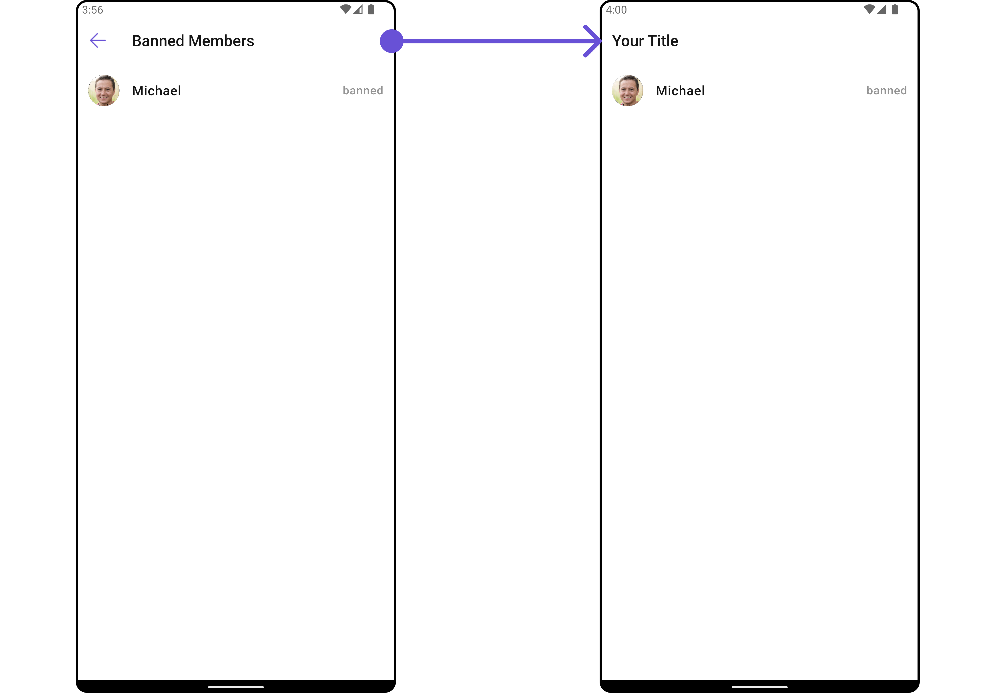

</TabItem>

<TabItem value="iOS" label="iOS">

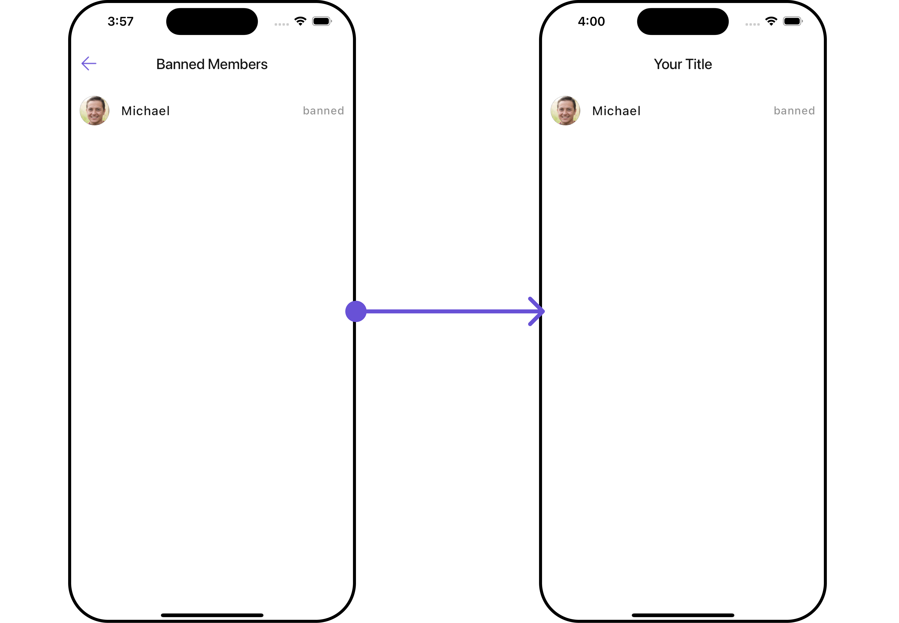

</TabItem>

</Tabs>

List of functionality exposed by `CometChatBannedMembers`

| Property                        | Description                                 | Code                               |
| ------------------------------- | ------------------------------------------- | ---------------------------------- |
| **Back Button**                 | Back button widget                          | `backButton: Widget?`              |
| **Disable Users Presence**      | Controls visibility of status indicator     | `disableUsersPresence: bool`       |
| **Empty State Text**            | Text to be displayed when the list is empty | `emptyStateText: String?`          |
| **Error State Text**            | Text to be displayed when error occur       | `errorStateText: String?`          |
| **Hide Error**                  | Toggle visibility of error dialog           | `hideError: bool?`                 |
| **Hide Search**                 | Switch on/off search input                  | `hideSearch: bool`                 |
| **Hide Separator**              | Toggle visibility of separator              | `hideSeparator: bool`              |
| **Search Box Icon**             | Search icon widget                          | `searchBoxIcon: Widget?`           |
| **Search Placeholder**          | Placeholder text of search input            | `searchPlaceholder: String?`       |
| **Show Back Button**            | Switch on/off back button                   | `showBackButton: bool`             |
| **Title**                       | Sets title for the list                     | `title: String?`                   |
| **Unban Icon Url**              | URL of the unban icon                       | `unbanIconUrl: String?`            |
| **Unban Icon Url Package Name** | Package name of the unban icon URL          | `unbanIconUrlPackageName: String?` |

---

### Advance

For advanced-level customization, you can set custom views to the Widget. This lets you tailor each aspect of the Widget to fit your exact needs and application aesthetics. You can create and define your own widget and then incorporate those into the Widget.

#### ListItemView

With this function, you can assign a custom ListItem to the `CometChatBannedMembers` Widget.

<Tabs>

<TabItem value="Dart" label="Dart">

```dart title="widget"
CometChatBannedMembers(
  group: Group(guid: "", name: "", type: ""), // A group object is required to launch this widget.
  listItemView: (groupMember) {
    return Placeholder(); // Replace this placeholder with your custom widget.
  },
)
```

</TabItem>

</Tabs>

Here is the complete example for reference:

**Example**

You can indeed create a custom widget named `custom_list_item.dart` for more complex or unique list items.

<Tabs>

<TabItem value="Dart" label="Dart">

```dart title="custom_list_item.dart"
import 'package:flutter/material.dart';
import 'package:intl/intl.dart';
import '../helper/utils/custom_colors.dart';

class CustomListItems extends StatelessWidget {
  final String name;
  final DateTime? lastMessageTime;
  final String? avatarUrl;

  const CustomListItems({
    super.key,
    required this.name,
    this.lastMessageTime,
    this.avatarUrl,
  });

  String formatDateTime(DateTime dateTime) {
    final now = DateTime.now();
    final difference = now.difference(dateTime);

    if (difference.inDays == 0) {
      return DateFormat('HH:mm').format(dateTime);
    } else if (difference.inDays == 1) {
      return 'Yesterday';
    } else {
      return DateFormat('yyyy-MM-dd').format(dateTime);
    }
  }

  @override
  Widget build(BuildContext context) {
    return Container(
      margin: const EdgeInsets.only(top: 5, bottom: 5),
      padding: const EdgeInsets.all(8.0),
      decoration: BoxDecoration(
        border: Border.all(color: Color(0xFF6851D6), width: 1), // Example border color
        borderRadius: BorderRadius.circular(8.0),
        color: Color(0xFFEEEEEE)
      ),
      child: Row(
        crossAxisAlignment: CrossAxisAlignment.center,
        children: [
          Expanded(
            child: Column(
              crossAxisAlignment: CrossAxisAlignment.start,
              mainAxisAlignment: MainAxisAlignment.center,
              children: [
                Text(
                  name,
                  style: const TextStyle(
                    fontWeight: FontWeight.bold,
                  ),
                ),
                lastMessageTime == null ? Container() : Text(formatDateTime(lastMessageTime!)),
              ],
            ),
          ),
          const SizedBox(width: 8.0),
          if (avatarUrl != null)
            ClipOval(
              child: Image.network(
                avatarUrl!,
                width: 40.0,
                height: 40.0,
                fit: BoxFit.cover,
                errorBuilder: (context, error, stackTrace) {
                  return const Icon(
                    Icons.person,
                    size: 40.0,
                  );
                },
              ),
            )
          else
            const Icon(
              Icons.person,
              size: 40.0,
            ),
        ],
      ),
    );
  }
}
```

</TabItem>

</Tabs>

<Tabs>

<TabItem value="Dart" label="Dart">

```dart title="main.dart"
CometChatBannedMembers(
  group: Group(guid: "", name: "", type: ""), // A group object is required to launch this widget.
  listItemView: (groupMember) {
    return CustomListItems(
      name: groupMember.name,
      avatarUrl: groupMember.avatar,
    ); // Replaced Placeholder with CustomListItems widget.
  },
)
```

</TabItem>

</Tabs>

<Tabs>

<TabItem value="Android" label="Android">


</TabItem>

<TabItem value="iOS" label="iOS">

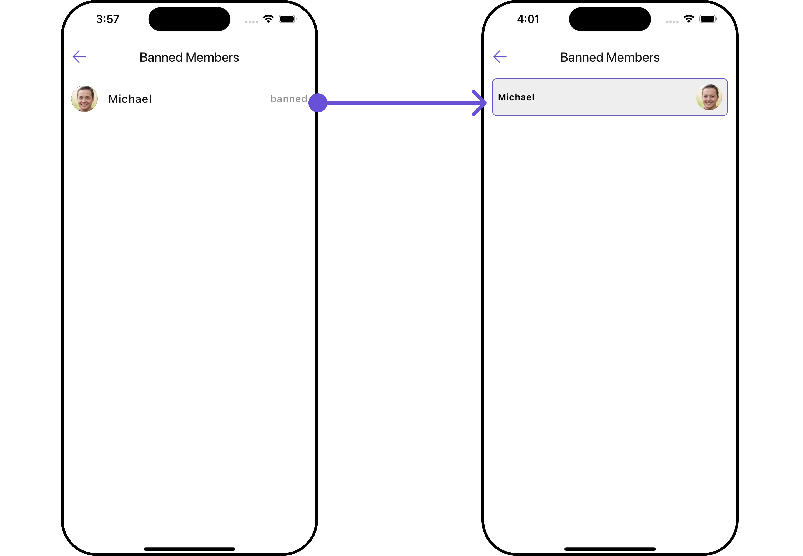

</TabItem>

</Tabs>

---

#### SubtitleView

You can customize the subtitle view for each item to meet your specific preferences and needs.

<Tabs>

<TabItem value="Dart" label="Dart">

```dart title="widget"
CometChatBannedMembers(
  group: Group(guid: "", name: "", type: ""), // A group object is required to launch this widget.
  subtitleView: (groupMember) {
    return Placeholder(); // Replace this placeholder with your custom widget.
  },
)
```

</TabItem>

</Tabs>

Here is the complete example for reference:

**Example**

<Tabs>

<TabItem value="Dart" label="Dart">

```dart title="main.dart"
CometChatBannedMembers(
  group: Group(guid: "", name: "", type: ""), // A group object is required to launch this widget.
  subtitleView: (groupMember) {
    return const Row(
      children: [
        Icon(Icons.call, color: Color(0xFF6851D6), size: 25,),
        SizedBox(width: 10),
        Icon(Icons.video_call, color: Color(0xFF6851D6), size: 25,),
      ],
    ); // Replaced the placeholder with a custom widget.
  },
)
```

</TabItem>

</Tabs>

<Tabs>

<TabItem value="Android" label="Android">

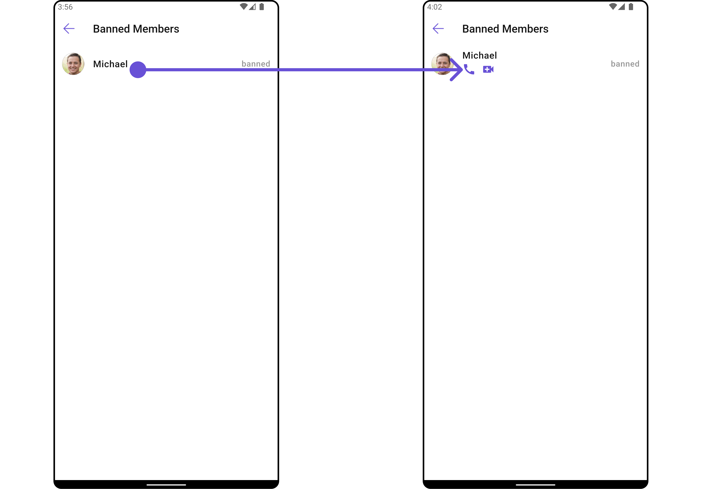

</TabItem>

<TabItem value="iOS" label="iOS">

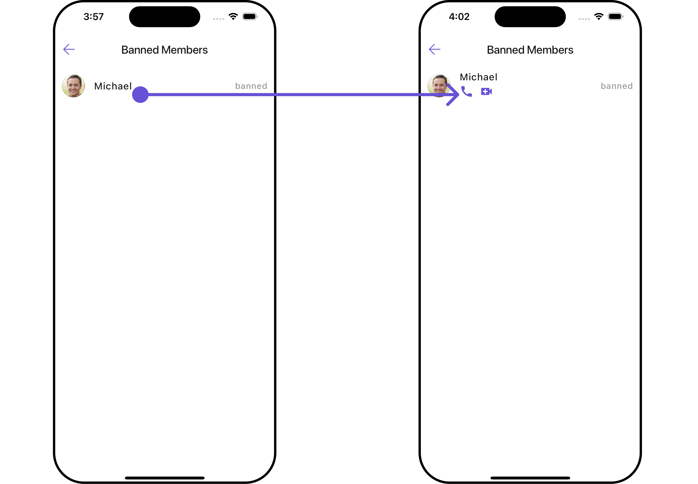

</TabItem>

</Tabs>

---

#### AppBarOptions

You can set the Custom `appBarOptions` to the `CometChatBannedMembers` widget.

<Tabs>

<TabItem value="Dart" label="Dart">

```dart title="widget"
CometChatBannedMembers(
    group: Group(guid: "", name: "", type: ""), // A group object is required to launch this widget.
    appBarOptions: [
        Placeholder(),
        Placeholder(),
        Placeholder()
    ] // Replace this list of placeholder widgets with your list of custom widgets.
)
```

</TabItem>

</Tabs>

Here is the complete example for reference:

**Example**

<Tabs>

<TabItem value="Dart" label="Dart">

```dart
CometChatBannedMembers(
  group: Group(guid: "", name: "", type: ""), // A group object is required to launch this widget.
  appBarOptions: [
    InkWell(
      onTap: () {
        // TODO("Not yet implemented")
      },
      child: const Icon(Icons.ac_unit, color: Color(0xFF6851D6)),
    ),
    const SizedBox(width: 10)
  ] // Replaced the list of placeholder widgets with a list of custom widgets.
)
```

</TabItem>

</Tabs>

<Tabs>

<TabItem value="Android" label="Android">

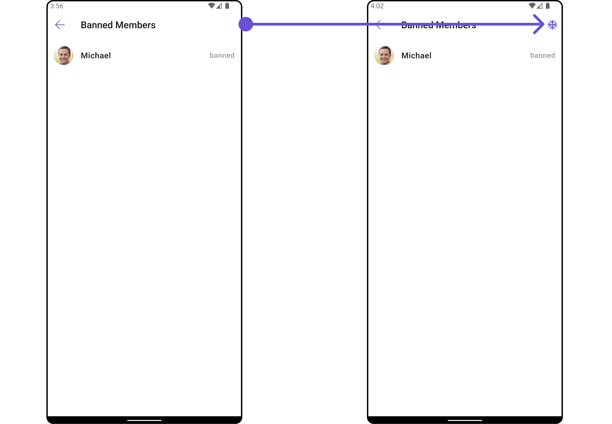

</TabItem>

<TabItem value="iOS" label="iOS">

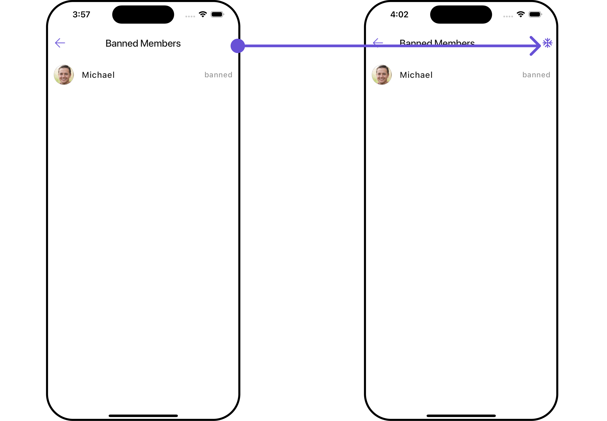

</TabItem>

</Tabs>

---

#### EmptyStateView

You can set a custom `EmptyStateView` using `emptyStateView` to match the error widget of your app.

<Tabs>

<TabItem value="Dart" label="Dart">

```dart title="widget"
CometChatBannedMembers(
  group: Group(guid: "", name: "", type: ""), // A group object is required to launch this widget.
  emptyStateView: (context) {
    return Placeholder(); // Replace this placeholder with your custom widget.
  },
)
```

</TabItem>

</Tabs>

Here is the complete example for reference:

**Example**

<Tabs>

<TabItem value="Dart" label="Dart">

```dart title="main.dart"
CometChatBannedMembers(
  group: Group(guid: "", name: "", type: ""), // A group object is required to launch this widget.
  emptyStateView: (context) {
    return Container(
      width: MediaQuery.of(context).size.width,
      child: Center(
          child: const Column(
            crossAxisAlignment: CrossAxisAlignment.center,
            mainAxisAlignment: MainAxisAlignment.center,
            children: [
              Spacer(),
              Icon(Icons.sms_failed_outlined, color: Colors.red, size: 100,),
              SizedBox(height: 20,),
              Text("Your Custom Message"),
              Spacer(),
            ],
          )
      ),
    ); // Replaced the placeholder with a custom widget.
  },
)
```

</TabItem>

</Tabs>

<Tabs>

<TabItem value="Android" label="Android">

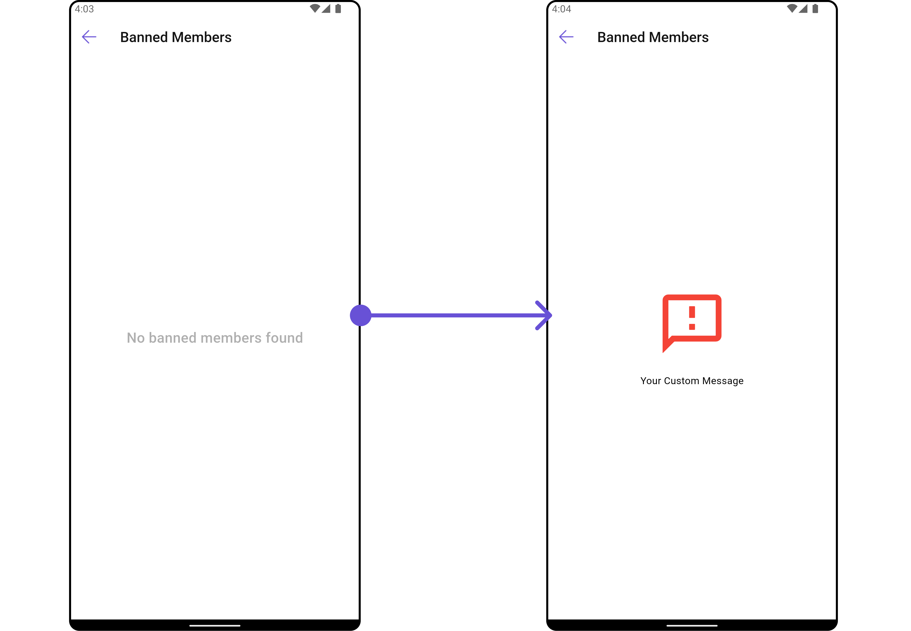

</TabItem>

<TabItem value="iOS" label="iOS">

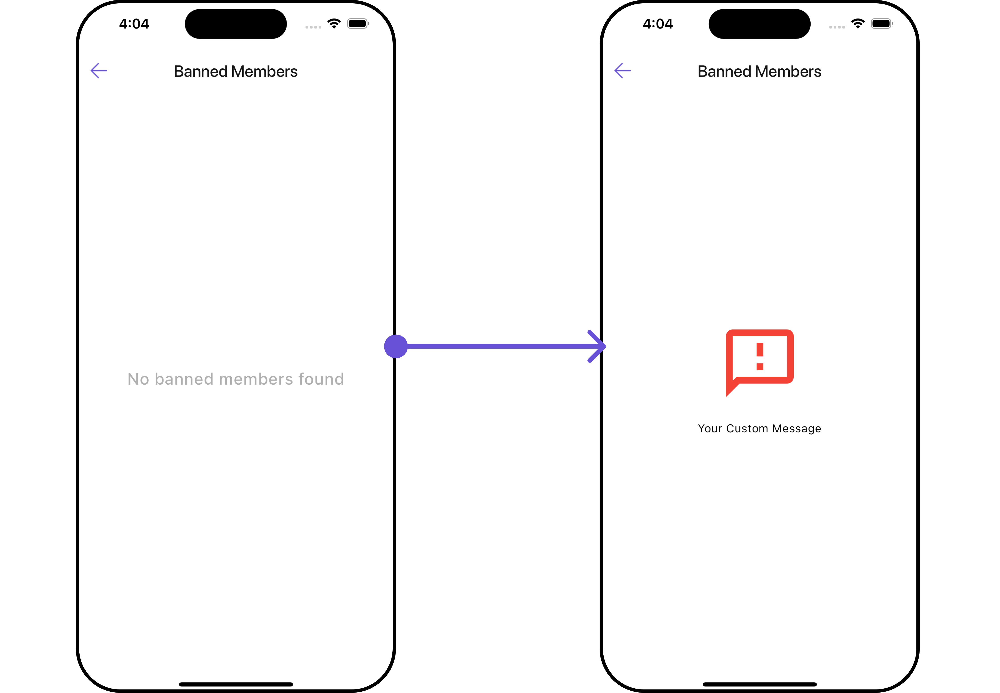

</TabItem>

</Tabs>

---

#### LoadingStateView

You can set a custom loader widget using `loadingStateView` to match the loading UI of your app.

<Tabs>

<TabItem value="Dart" label="Dart">

```dart title="widget"
CometChatBannedMembers(
  group: Group(guid: "", name: "", type: ""), // A group object is required to launch this widget.
  loadingStateView: (context) {
    return Placeholder(); // Replace this placeholder with your custom widget.
  },
)
```

</TabItem>

</Tabs>

Here is the complete example for reference:

**Example**

<Tabs>

<TabItem value="Dart" label="Dart">

```dart title="main.dart"
CometChatBannedMembers(
  group: Group(guid: "", name: "", type: ""), // A group object is required to launch this widget.
  loadingStateView: (context) {
    return Container(
      width: MediaQuery.of(context).size.width,
      child: Center(
          child: CircularProgressIndicator()
      ),
    ); // Replaced the placeholder with a custom widget.
  },
)
```

</TabItem>

</Tabs>

<Tabs>

<TabItem value="Android" label="Android">

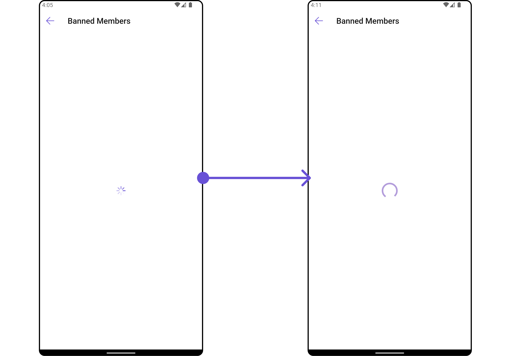

</TabItem>

<TabItem value="iOS" label="iOS">

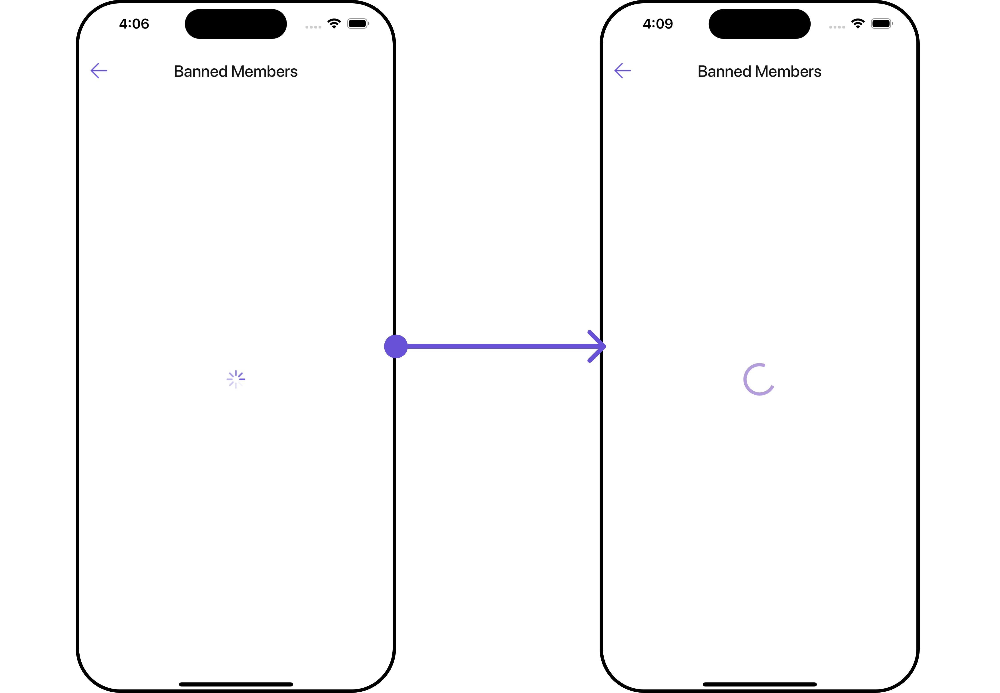

</TabItem>

</Tabs>

---

#### ErrorStateView

You can set a custom `ErrorStateView` using `errorStateView` to match the error UI of your app.

<Tabs>

<TabItem value="Dart" label="Dart">

```dart title="widget"
CometChatBannedMembers(
  group: Group(guid: "", name: "", type: ""), // A group object is required to launch this widget.
  errorStateView: (context) {
    return Placeholder(); // Replace this placeholder with your custom widget.
  },
)
```

</TabItem>

</Tabs>

Here is the complete example for reference:

**Example**

<Tabs>

<TabItem value="Dart" label="Dart">

```dart title="main.dart"
CometChatBannedMembers(
  group: Group(guid: "", name: "", type: ""), // A group object is required to launch this widget.
  errorStateView: (context) {
    return Container(
      width: MediaQuery.of(context).size.width,
      child: Center(
        child: const Column(
          crossAxisAlignment: CrossAxisAlignment.center,
          mainAxisAlignment: MainAxisAlignment.center,
          children: [
            Spacer(),
            Icon(Icons.error_outline, color: Colors.red, size: 100,),
            SizedBox(height: 20,),
            Text("Your Custom Error Message"),
            Spacer(),
          ],
        ),
      ),
    ); // Replaced the placeholder with a custom widget.
  },
)
```

</TabItem>

</Tabs>

<Tabs>

<TabItem value="Android" label="Android">

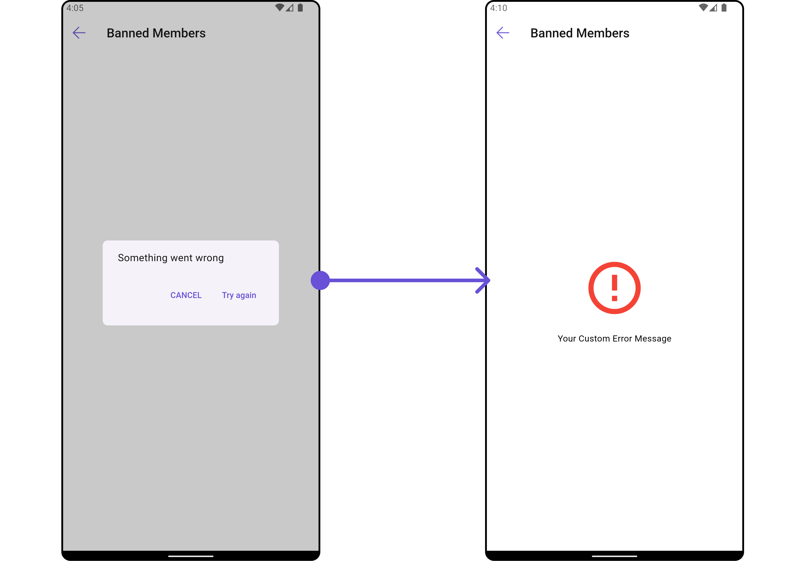

</TabItem>

<TabItem value="iOS" label="iOS">

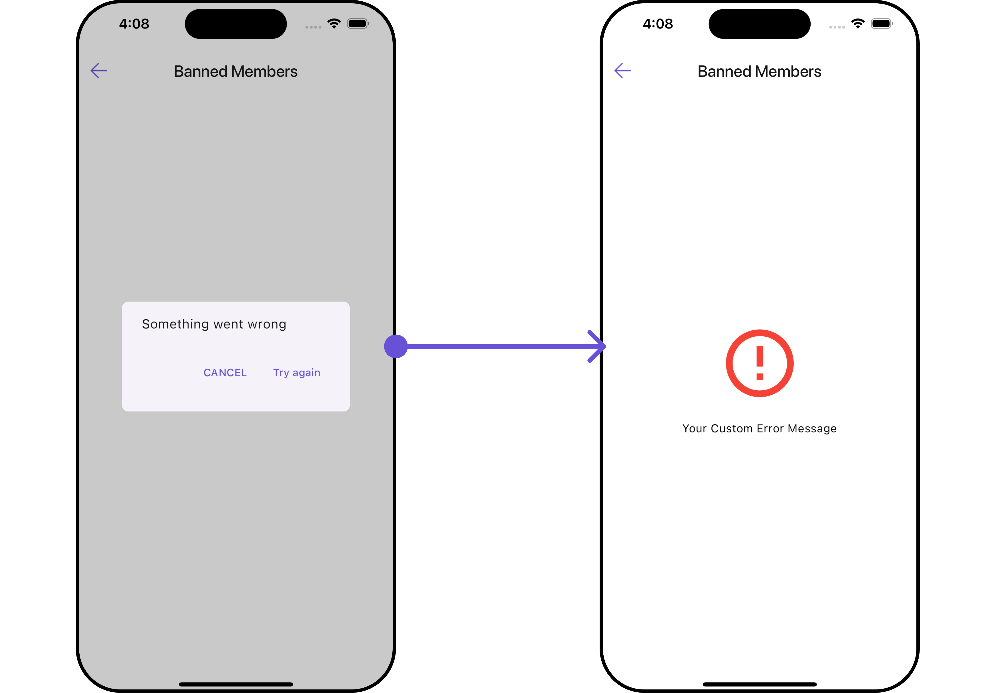

</TabItem>

</Tabs>

---
