import Tabs from '@theme/Tabs';
import TabItem from '@theme/TabItem';
import { Tooltip } from 'react-tooltip'
import 'react-tooltip/dist/react-tooltip.css'

<Tooltip id="my-tooltip-html-prop" html="Not available in Group Members Configuration object"/>

## Overview

`CometChatDetails` is a [Composite Widget](/ui-kit/flutter/components-overview#composite-components) that provides additional information and settings related to a specific group.

The details screen includes the following elements and functionalities:

1. Group Information: It displays details about the user. This includes his/her profile picture, name, status, and other relevant information.
2. Group Chat Features: It provides additional functionalities for managing the group. This includes options to add or remove participants, assign roles or permissions, and view group-related information.
3. Group Actions: This offers actions related to the group, such as leaving the group, or deleting the group.

<Tabs>

<TabItem value="Android" label="Android">

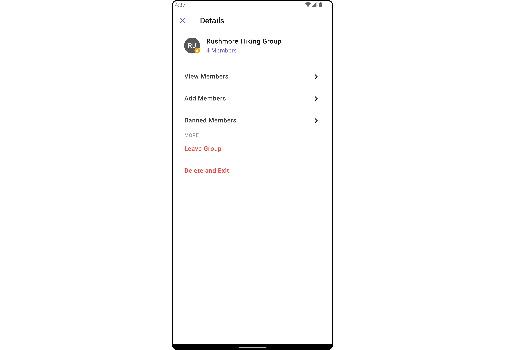

</TabItem>

<TabItem value="iOS" label="iOS">

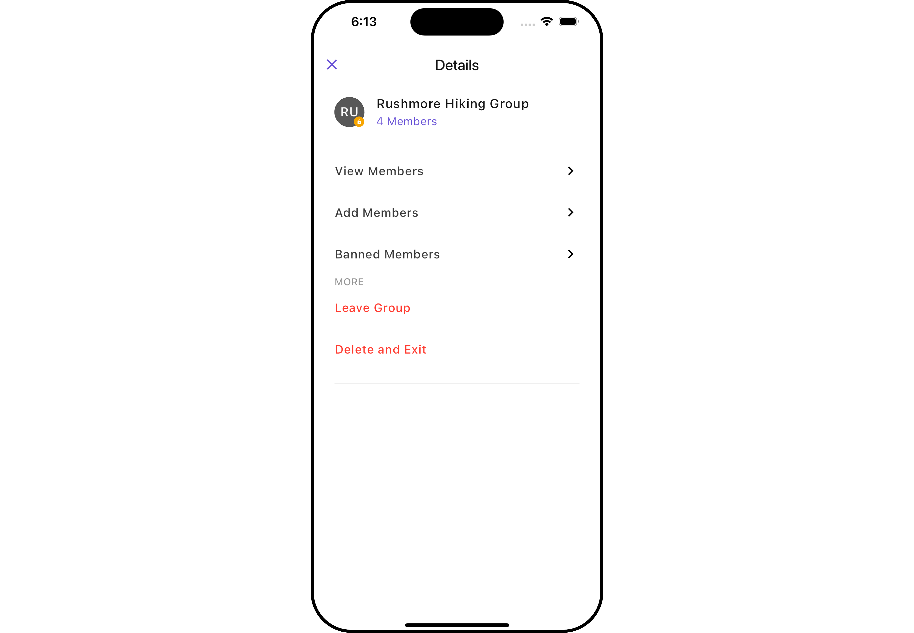

</TabItem>

</Tabs>

The `CometChatDetails` Widget is composed of the following BaseWidgets:

| Widgets                                        | Description                                                                                                                                                                                |
| ---------------------------------------------- | ------------------------------------------------------------------------------------------------------------------------------------------------------------------------------------------ |
| [CometChatListBase](/ui-kit/flutter/list-base) | `CometChatListBase` serves as a container widget equipped with a title (navigationBar), search functionality (search-bar), background settings, and a container for embedding a list view. |

---

## Usage

### Integration

`CometChatDetails`, as a widget, offers flexible integration options, allowing it to be launched directly via button clicks or any user-triggered action. Additionally, it seamlessly integrates into tab view controllers. With banned members, users gain access to a wide range of parameters and methods for effortless customization of its user interface.

You can launch `CometChatDetails` directly using `Navigator.push` , or you can define it as a widget within the `build` method of your `State` class.

##### 1. Using Navigator to Launch `CometChatDetails`

<Tabs>

<TabItem value="Dart" label="Dart">

```dart
Navigator.push(context, MaterialPageRoute(builder: (context) => CometChatDetails(group: Group(guid: "", name: "", membersCount: 0, type: "")))); // A group object is required to launch this widget.
```

</TabItem>

</Tabs>

##### 2. Embedding `CometChatDetails` as a Widget in the build Method

<Tabs>

<TabItem value="Dart" label="Dart">

```dart
import 'package:cometchat_chat_uikit/cometchat_chat_uikit.dart';
import 'package:flutter/material.dart';

class GroupDetails extends StatefulWidget {
  const GroupDetails({super.key});

  @override
  State<GroupDetails> createState() => _GroupDetailsState();
}

class _GroupDetailsState extends State<GroupDetails> {

  @override
  Widget build(BuildContext context) {
    return Scaffold(
        body: SafeArea(
            child: CometChatDetails(
              group: Group(guid: "", name: "", membersCount: 0, type: ""), // A group object is required to launch this widget.
            ) // A group object is required to launch this widget.
        )
    );
  }
}
```

</TabItem>

</Tabs>

---

### Actions

[Actions](/ui-kit/flutter/components-overview#actions) dictate how a widget functions. They are divided into two types: Predefined and User-defined. You can override either type, allowing you to tailor the behavior of the widget to fit your specific needs.

##### 1. onBack

Enhance your application's functionality by leveraging the `onBack` feature. This capability allows you to customize the behavior associated with navigating back within your app. Utilize the provided code snippet to override default behaviors and tailor the user experience according to your specific requirements.

<Tabs>

<TabItem value="Dart" label="Dart">

```dart
CometChatDetails(
  group: Group(guid: "", name: "", membersCount: 0, type: ""), // A group object is required to launch this widget.
  onBack: () {
    // TODO("Not yet implemented")
  },
)
```

</TabItem>

</Tabs>

---

##### 2. onError

You can customize this behavior by using the provided code snippet to override the `onError` and improve error handling.

<Tabs>

<TabItem value="Dart" label="Dart">

```dart
CometChatDetails(
  group: Group(guid: "", name: "", membersCount: 0, type: ""), // A group object is required to launch this widget.
  onError: (e) {
    // TODO("Not yet implemented")
  },
)
```

</TabItem>

</Tabs>

---

### Filters

**Filters** allow you to customize the data displayed in a list within a Widget. You can filter the list based on your specific criteria, allowing for a more customized. Filters can be applied using RequestBuilders of Chat SDK.

`CometChatDetails` widget does not have available filters.

---

### Events

[Events](/ui-kit/flutter/components-overview#events) are emitted by a `Widget`. By using event you can extend existing functionality. Being global events, they can be applied in Multiple Locations and are capable of being Added or Removed.

Events emitted by the Group Details widget is as follows.

| Events                        | Description                                                                                                |
| ----------------------------- | ---------------------------------------------------------------------------------------------------------- |
| `ccGroupDeleted()`            | This will get triggered when the logged in user deletes a group                                            |
| `ccGroupLeft()`               | This will get triggered when the logged in user leaves a group                                             |
| `ccGroupMemberScopeChanged()` | This will get triggered when the logged in user changes the scope of another group member                  |
| `ccGroupMemberBanned()`       | This will get triggered when the logged in user bans a group member from the group                         |
| `ccGroupMemberKicked()`       | This will get triggered when the logged in user kicks another group member from the group                  |
| `ccGroupMemberUnbanned()`     | This will get triggered when the logged in user unbans a user banned from the group                        |
| `ccGroupMemberJoined()`       | This will get triggered when the logged in user joins a group                                              |
| `ccGroupMemberAdded()`        | This will get triggered when the logged in user add new members to the group                               |
| `ccOwnershipChanged`          | This will get triggered when the logged in user transfer the ownership of their group to some other member |

**Example**

<Tabs>

<TabItem value="Dart" label="Dart">

```dart
import 'package:cometchat_chat_uikit/cometchat_chat_uikit.dart';
import 'package:cometchat_sdk/models/action.dart' as cc;
import 'package:flutter/material.dart';

class YourScreen extends StatefulWidget {
  const YourScreen({super.key});

  @override
  State<YourScreen> createState() => _YourScreenState();
}

class _YourScreenState extends State<YourScreen> with CometChatGroupEventListener {

  @override
  void initState() {
    super.initState();
    CometChatGroupEvents.addGroupsListener("listenerId", this); // Add the listener
  }

  @override
  void dispose(){
    super.dispose();
    CometChatGroupEvents.removeGroupsListener("listenerId"); // Remove the listener
  }

  @override
  void ccGroupDeleted(Group group) {
    // TODO("Not yet implemented")
  }

  @override
  void ccGroupLeft(cc.Action message, User leftUser, Group leftGroup) {
    // TODO("Not yet implemented")
  }

  @override
  void ccGroupMemberScopeChanged(cc.Action message, User updatedUser, String scopeChangedTo, String scopeChangedFrom, Group group) {
    // TODO("Not yet implemented")
  }

  @override
  void ccGroupMemberBanned(cc.Action message, User bannedUser, User bannedBy, Group bannedFrom) {
    // TODO("Not yet implemented")
  }

  @override
  void ccGroupMemberKicked(cc.Action message, User kickedUser, User kickedBy, Group kickedFrom) {
    // TODO("Not yet implemented")
  }

  @override
  void ccGroupMemberUnbanned(cc.Action message, User unbannedUser, User unbannedBy, Group unbannedFrom) {
    // TODO("Not yet implemented")
  }

  @override
  void ccGroupMemberJoined(User joinedUser, Group joinedGroup) {
    // TODO("Not yet implemented")
  }

  @override
  void ccGroupMemberAdded(List<cc.Action> messages, List<User> usersAdded, Group groupAddedIn, User addedBy) {
    // TODO("Not yet implemented")
  }

  @override
  void ccOwnershipChanged(Group group, GroupMember newOwner) {
    // TODO("Not yet implemented")
  }

  @override
  Widget build(BuildContext context) {
    return const Placeholder();
  }

}
```

</TabItem>

</Tabs>

---

## Customization

To fit your app's design requirements, you can customize the appearance of the Details widget. We provide exposed methods that allow you to modify the experience and behavior according to your specific needs.

### Style

Using **Style** you can **customize** the look and feel of the widget in your app, These parameters typically control elements such as the **color**, **size**, **shape**, and **fonts** used within the widget.

##### 1. Details Style

You can set the `DetailsStyle` to the CometChatDetails Widget to customize the styling.

<Tabs>

<TabItem value="Dart" label="Dart">

```dart
CometChatDetails(
  group: Group(guid: "", name: "", membersCount: 0, type: ""), // A group object is required to launch this widget.
  detailsStyle: DetailsStyle(
    background: Color(0xFFE4EBF5),
    titleStyle: TextStyle(color: Colors.red, fontFamily: "PlaywritePL"),
    closeIconTint: Colors.red,
    privateGroupIconBackground: Colors.red,
  ),
)
```

</TabItem>

</Tabs>

<Tabs>

<TabItem value="Android" label="Android">

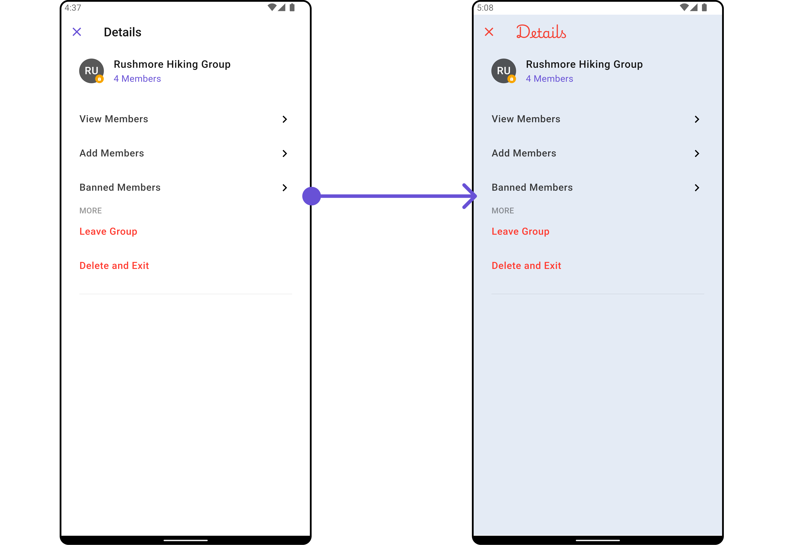

</TabItem>

<TabItem value="iOS" label="iOS">

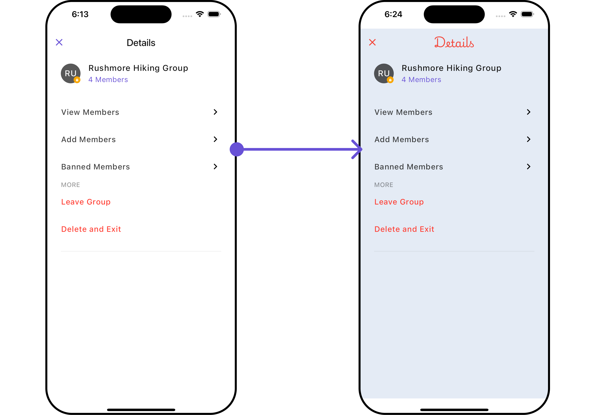

</TabItem>

</Tabs>

List of properties exposed by `DetailsStyle`

| Property                            | Description                                                          | Code                                   |
| ----------------------------------- | -------------------------------------------------------------------- | -------------------------------------- |
| **Title Style**                     | Provides styling for title text                                      | `titleStyle: TextStyle?`               |
| **Close Icon Tint**                 | Provide color to close button                                        | `closeIconTint: Color?`                |
| **Private Group Icon Background**   | Provides background color for status indicator if group is private   | `privateGroupIconBackground: Color?`   |
| **Protected Group Icon Background** | Provides background color for status indicator if group is protected | `protectedGroupIconBackground: Color?` |
| **Online Status Color**             | Set online status color                                              | `onlineStatusColor: Color?`            |
| **Width**                           | Width of the widget                                                  | `width: double?`                       |
| **Height**                          | Height of the widget                                                 | `height: double?`                      |
| **Background**                      | Background color of the widget                                       | `background: Color?`                   |
| **Gradient**                        | Gradient of the widget                                               | `gradient: Gradient?`                  |
| **Border**                          | Border of the widget                                                 | `border: Border?`                      |

---

##### 2. Avatar Style

To apply customized styles to the `Avatar` widget in the Group Members Widget, you can use the following code snippet. For further insights on `Avatar` Styles [refer](/ui-kit/flutter/avatar)

<Tabs>

<TabItem value="Dart" label="Dart">

```dart
CometChatDetails(
  group: Group(guid: "", name: "", membersCount: 0, type: ""), // A group object is required to launch this widget.
  avatarStyle: AvatarStyle(
      border: Border.all(width: 5),
      borderRadius: 20,
      background: Colors.red
  ),
)
```

</TabItem>

</Tabs>

---

##### 3. StatusIndicator Style

To apply customized styles to the Status Indicator widget in the Group Member Widget, You can use the following code snippet. For further insights on Status Indicator Styles [refer](/ui-kit/flutter/status-indicator)

<Tabs>

<TabItem value="Dart" label="Dart">

```dart
CometChatDetails(
  group: Group(guid: "", name: "", membersCount: 0, type: ""), // A group object is required to launch this widget.
  statusIndicatorStyle: StatusIndicatorStyle(
      borderRadius: 10,
      gradient: LinearGradient(colors: [Colors.red, Colors.orange], begin: Alignment.topLeft, end: Alignment.bottomRight)
  ),
)
```

</TabItem>

</Tabs>

---

##### 4. ListItem Style

To apply customized styles to the ListItem widget in the `CometChatDetails` widget, you can use the following code snippet. For further insights on `List Item` Styles [refer](/ui-kit/flutter/list-item)

<Tabs>

<TabItem value="Dart" label="Dart">

```dart
CometChatDetails(
  group: Group(guid: "", name: "", membersCount: 0, type: ""), // A group object is required to launch this widget.
  listItemStyle: ListItemStyle(
      background: Color(0xFFE4EBF5),
      borderRadius: 20,
      border: Border.all(width: 2),
      margin: EdgeInsets.only(top: 10),
      padding: EdgeInsets.only(left: 10)
  ),
)
```

</TabItem>

</Tabs>

---

##### 5. LeaveGroupDialog Style

To apply customized styles to the Leave Group Dialog in the `CometChatDetails` Widget, you can use the following code snippet.

<Tabs>

<TabItem value="Dart" label="Dart">

```dart
CometChatDetails(
  group: Group(guid: "group__1715256001347", name: "Rushmore Hiking Group", membersCount: 4, type: ""), // A group object is required to launch this widget.
  leaveGroupDialogStyle: ConfirmDialogStyle(
    backgroundColor: Color(0xFFE4EBF5),
    shadowColor: Color(0xFFE4EBF5),
    confirmButtonTextStyle: TextStyle(color: Color(0xFF6851D6), fontFamily: "PlaywritePL"),
  ),
)
```

</TabItem>

</Tabs>

---

### Functionality

These are a set of small functional customizations that allow you to fine-tune the overall experience of the widget. With these, you can change text, set custom icons, and toggle the visibility of UI elements.

<Tabs>

<TabItem value="Dart" label="Dart">

```dart
CometChatDetails(
    group: Group(guid: "", name: "", membersCount: 0, type: ""), // A group object is required to launch this widget.
    title: "Your Title",
    hideProfile: true,
    showCloseButton: false
)
```

</TabItem>

</Tabs>

<Tabs>

<TabItem value="Android" label="Android">

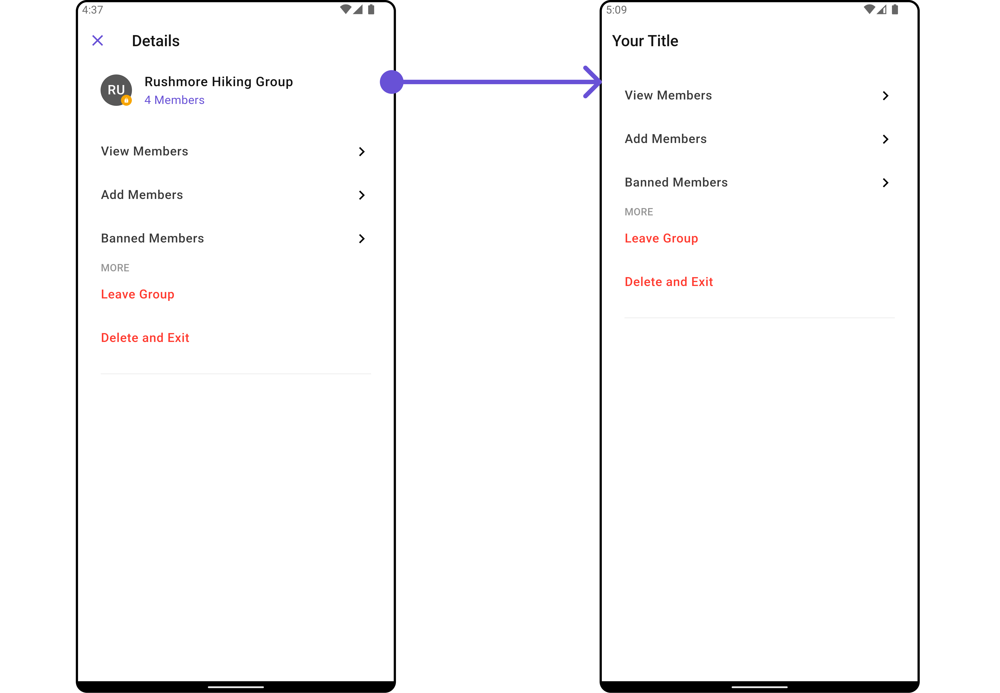

</TabItem>

<TabItem value="iOS" label="iOS">

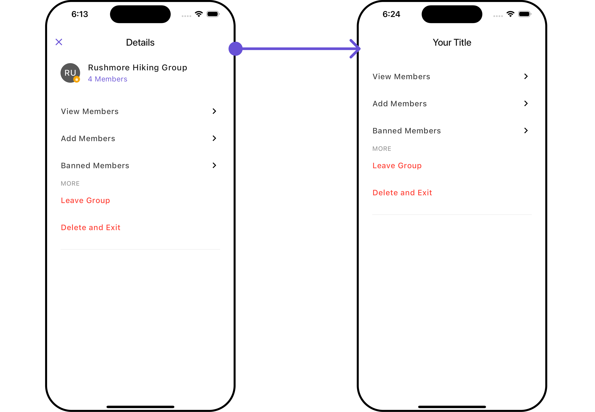

</TabItem>

</Tabs>

List of Properties exposed by `CometChatDetails`

| Property                   | Description                                        | Code                          |
| -------------------------- | -------------------------------------------------- | ----------------------------- |
| **Group**                  | Group object for which the details are to be shown | `group: Group?`               |
| **Title**                  | Title for the details screen                       | `title: String?`              |
| **Show Close Button**      | Toggles visibility for close button                | `showCloseButton: bool?`      |
| **Close Button Icon**      | Icon for the close button                          | `closeButtonIcon: Icon?`      |
| **Disable Users Presence** | Controls visibility of status indicator            | `disableUsersPresence: bool?` |
| **Hide Profile**           | Hides view profile for users                       | `hideProfile: bool?`          |
| **Protected Group Icon**   | Icon for protected group status indicator          | `protectedGroupIcon: Widget?` |
| **Private Group Icon**     | Icon for private group status indicator            | `privateGroupIcon: Widget?`   |
| **Theme**                  | Custom theme for the details screen                | `theme: CometChatTheme?`      |

---

### Advanced

For advanced-level customization, you can set custom views to the widget. This lets you tailor each aspect of the widget to fit your exact needs and application aesthetics. You can create and define your own widget and then incorporate those into the widget.

#### SubtitleView

You can customize your Subtitle View to meet your specific preferences and needs.

<Tabs>

<TabItem value="Dart" label="Dart">

```dart
CometChatDetails(
  group: Group(guid: "", name: "", membersCount: 0, type: ""), // A group object is required to launch this widget.
  subtitleView: ({BuildContext? context, User? user, Group? group}) {
    return Placeholder(); // Replace this placeholder with your custom widget.
  },
)
```

</TabItem>

</Tabs>

Here is the complete example for reference:

**Example**

<Tabs>

<TabItem value="Dart" label="Dart">

```dart
CometChatDetails(
  group: Group(guid: "", name: "", membersCount: 0, type: ""), // A group object is required to launch this widget.
  subtitleView: ({BuildContext? context, User? user, Group? group}) {
    return const Row(
      children: [
        Icon(Icons.call, color: Color(0xFF6851D6), size: 25,),
        SizedBox(width: 10),
        Icon(Icons.video_call, color: Color(0xFF6851D6), size: 25,),
      ],
    ); // Replaced the placeholder with a custom widget.
  },
)
```

</TabItem>

</Tabs>

<Tabs>

<TabItem value="Android" label="Android">

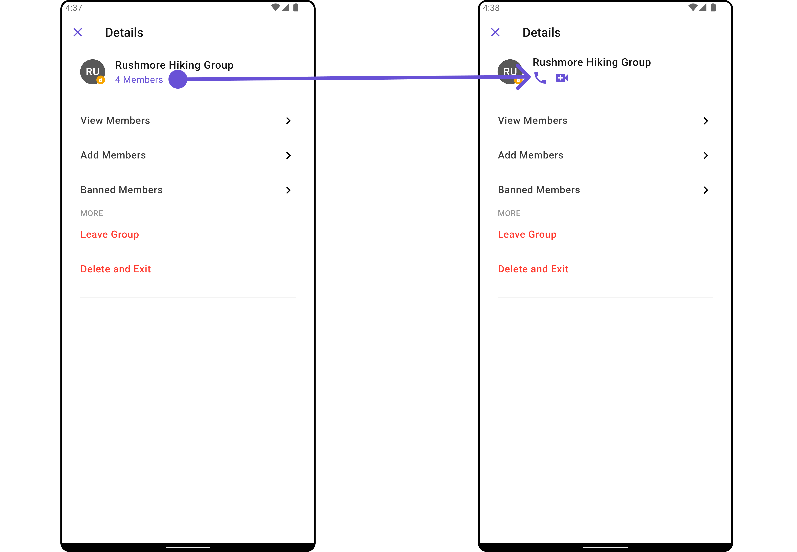

</TabItem>

<TabItem value="iOS" label="iOS">

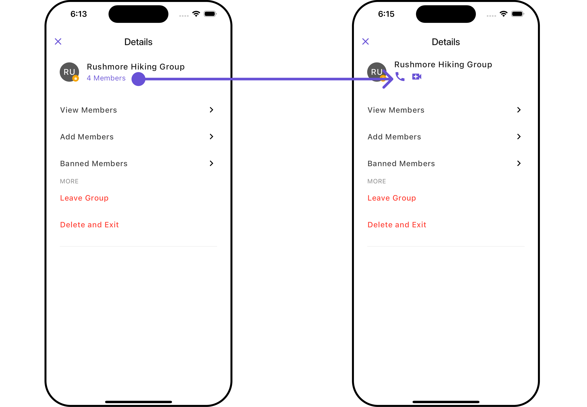

</TabItem>

</Tabs>

---

#### CustomProfileView <a data-tooltip-id="my-tooltip-005-html-prop"> <span class="material-icons red">report</span> </a> <Tooltip id="my-tooltip-005-html-prop" html="Not available"/>

You can customize your Profile View to meet your specific preferences and needs.

<Tabs>

<TabItem value="Dart" label="Dart">

```dart
CometChatDetails(
  group: Group(guid: "", name: "", membersCount: 0, type: ""), // A group object is required to launch this widget.
  customProfileView: Placeholder(); // Replace this placeholder with your custom widget.
)
```

</TabItem>

</Tabs>

Here is the complete example for reference:

**Example**

<Tabs>

<TabItem value="Dart" label="Dart">

```dart
CometChatDetails(
  group: Group(guid: "group__1715256001347", name: "Rushmore Hiking Group", membersCount: 4, type: ""), // A group object is required to launch this widget.
  customProfileView: Container(
      child: Center(
        child: Row(
          crossAxisAlignment: CrossAxisAlignment.center,
          mainAxisAlignment: MainAxisAlignment.center,
          children: [
            const SizedBox(height: 20,),
            Icon(Icons.ac_unit, color: Color(0xFF6851D6), size: 50,),
            const SizedBox(width: 20,),
            const Text("Your Group Name"),
            Spacer(),
          ],
        ),
      )
  ), // Replaced the placeholder with a custom widget.
)
```

</TabItem>

</Tabs>

<Tabs>

<TabItem value="Android" label="Android">

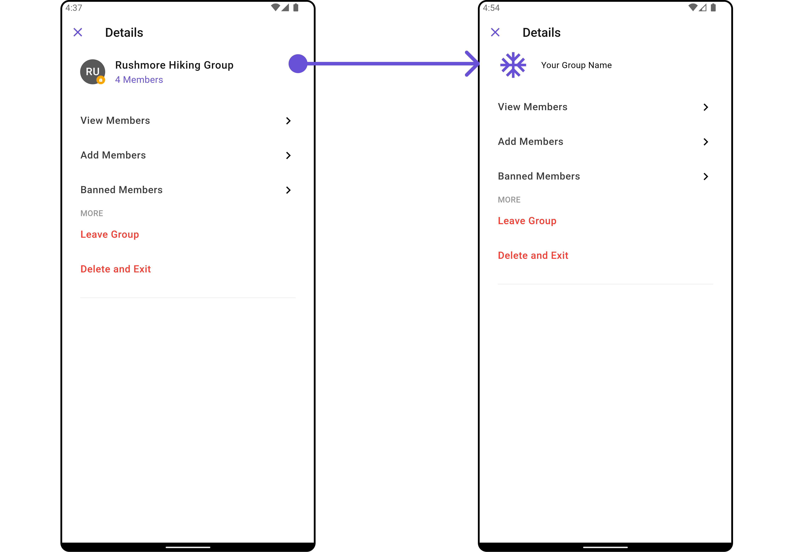

</TabItem>

<TabItem value="iOS" label="iOS">

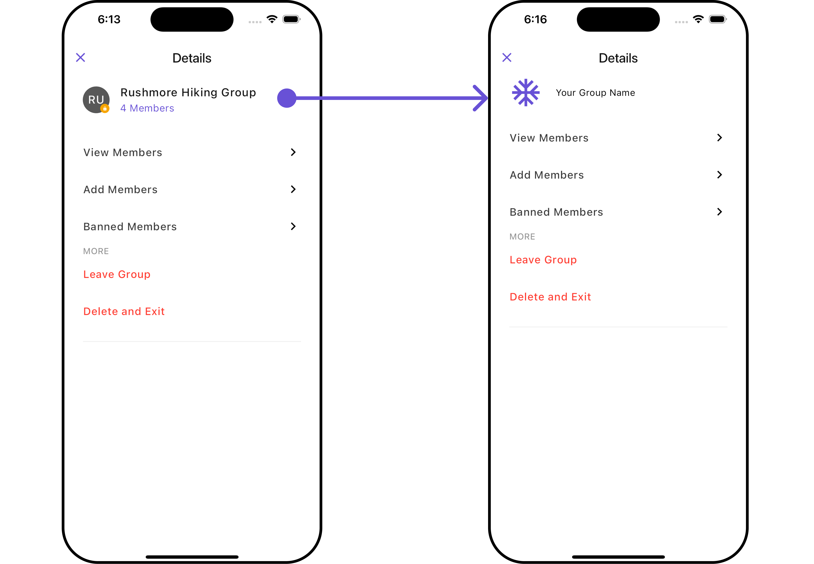

</TabItem>

</Tabs>

---

#### AppBarOptions

You can set the Custom `appBarOptions` to the `CometChatDetails` widget.

<Tabs>

<TabItem value="Dart" label="Dart">

```dart title="widget"
CometChatDetails(
    group: Group(guid: "", name: "", membersCount: 0, type: ""), // A group object is required to launch this widget.
    appBarOptions: [
        Placeholder(),
        Placeholder(),
        Placeholder()
    ] // Replace this list of placeholder widgets with your list of custom widgets.
)
```

</TabItem>

</Tabs>

Here is the complete example for reference:

**Example**

<Tabs>

<TabItem value="Dart" label="Dart">

```dart
CometChatDetails(
  group: Group(guid: "", name: "", membersCount: 0, type: ""), // A group object is required to launch this widget.
  appBarOptions: [
    InkWell(
      onTap: () {
        // TODO("Not yet implemented")
      },
      child: const Icon(Icons.login, color: Color(0xFF6851D6)),
    ),
    const SizedBox(width: 10)
  ] // Replaced the list of placeholder widgets with a list of custom widgets.
)
```

</TabItem>

</Tabs>

<Tabs>

<TabItem value="Android" label="Android">

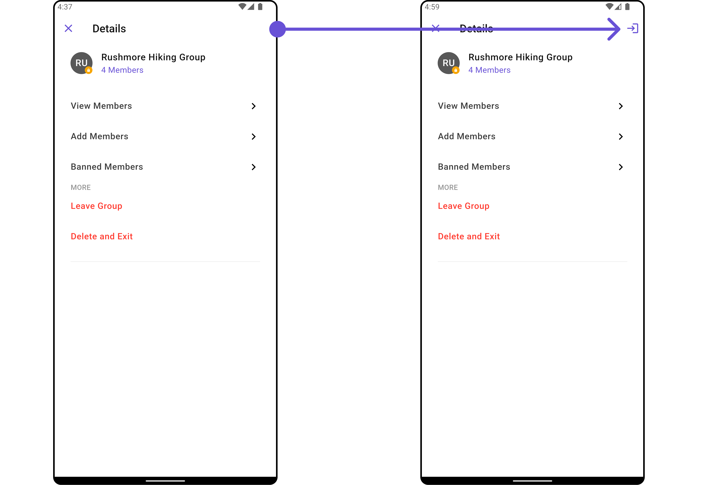

</TabItem>

<TabItem value="iOS" label="iOS">

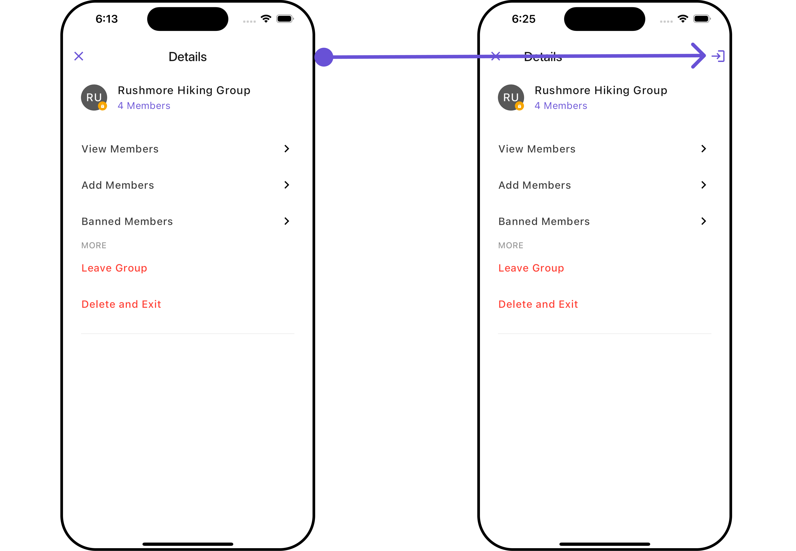

</TabItem>

</Tabs>

---

#### Template and Options

The `CometChatDetailsOption` is the class providing structure for options to be shown for group members

<Tabs>

<TabItem value="Dart" label="Dart">

```dart title="Option"
CometChatDetailsOption option = CometChatDetailsOption(
    id: "OPTION_ID",
    onClick: (user, group, section, state) {},
    title: "CUSTOM OPTION",
);
```

</TabItem>

</Tabs>

A list of `CometChatDetailsOption` defines the structure for sections of options available in the CometChatDetails

| Property         | Description                                                                      | Code                                                                                                     |
| ---------------- | -------------------------------------------------------------------------------- | -------------------------------------------------------------------------------------------------------- |
| **Custom View**  | Custom view to options                                                           | `customView: Widget?`                                                                                    |
| **Tail View**    | Tail widget for detail option                                                    | `tail: Widget?`                                                                                          |
| **Height**       | Height for options                                                               | `height: double?`                                                                                        |
| **On Click**     | Function triggered on click, takes user, group, section, and state as parameters | `onClick: Function(User? user, Group? group, String section, CometChatDetailsControllerProtocol state)?` |
| **Id**           | Identifier for the option                                                        | `id: String`                                                                                             |
| **Title**        | Title for the option                                                             | `title: String?`                                                                                         |
| **Icon**         | Icon for the option                                                              | `icon: String?`                                                                                          |
| **Package Name** | Package name for the option                                                      | `packageName: String?`                                                                                   |
| **Title Style**  | Style for the title                                                              | `titleStyle: TextStyle?`                                                                                 |

The `CometChatDetailsTemplate` offers a structure for organizing information in the `CometChatDetails` widget. It serves as a blueprint, defining how group-related details are presented. This structure allows for customization and organization within the CometChat interface.

<Tabs>

<TabItem value="Dart" label="Dart">

```dart title="Template"
CometChatDetailsTemplate template = CometChatDetailsTemplate(
  id: "TEMPLATE_ID",
  title: "CUSTOM TEMPLATE",
  options: (user, group, context, theme) => [aboveCreatedOption],
);
```

</TabItem>

</Tabs>

A list of `CometChatDetailsTemplate` defines the structure for sections of options available in the CometChatDetails

| Property                    | Description                                                                              | Code                                                                                                                      |
| --------------------------- | ---------------------------------------------------------------------------------------- | ------------------------------------------------------------------------------------------------------------------------- |
| **Id**                      | Unique identifier for every CometChatDetailsTemplate                                     | `id: String`                                                                                                              |
| **Options**                 | Function which returns list of CometChatDetailsOption for every CometChatDetailsTemplate | `options: List<CometChatDetailsOption> Function(User? user, Group? group, BuildContext? context, CometChatTheme? theme)?` |
| **Title**                   | Title of CometChatDetailsTemplate                                                        | `title: String?`                                                                                                          |
| **Title Style**             | Style of title of CometChatDetailsTemplate                                               | `titleStyle: TextStyle?`                                                                                                  |
| **Section Separator Color** | Color of section separator                                                               | `sectionSeparatorColor: Color?`                                                                                           |
| **Hide Section Separator**  | Boolean which decides whether to hide section separator or not                           | `hideSectionSeparator: bool?`                                                                                             |
| **Item Separator Color**    | Color of item separator                                                                  | `itemSeparatorColor: Color?`                                                                                              |
| **Hide Item Separator**     | Boolean which decides whether to hide item separator or not                              | `hideItemSeparator: bool?`                                                                                                |

Here is the complete example for reference:

**Example**

<Tabs>

<TabItem value="Dart" label="Dart">

```dart
CometChatDetails(
  group: Group(guid: "group__1715256001347", name: "Rushmore Hiking Group", membersCount: 4, type: ""), // A group object is required to launch this widget.
  data: (group, user) {
    // Create a custom option
    CometChatDetailsOption option1 = CometChatDetailsOption(
        id: "OPTION_ID",
        onClick: (user, group, section, state) {
          // TODO("Not yet implemented")
        },
        tail: const Icon(
          Icons.broadcast_on_personal_outlined,
          color: Colors.pink,
          size: 22,
        ),
        title: "Broadcast",
        titleStyle: TextStyle(
          fontWeight: FontWeight.bold,
          fontSize: 20,
          color: Color(0xFF6851D6)
        ),
        packageName: UIConstants.packageName
    );

    CometChatDetailsOption option2 = CometChatDetailsOption(
        id: "OPTION_ID",
        onClick: (user, group, section, state) {
          // TODO("Not yet implemented")
        },
        tail: const Icon(
          Icons.save_outlined,
          color: Colors.pink,
          size: 22,
        ),
        title: "Saved Messages",
        titleStyle: TextStyle(
            fontWeight: FontWeight.bold,
            fontSize: 20,
            color: Color(0xFF6851D6)
        ),
        packageName: UIConstants.packageName
    );

    CometChatDetailsOption option3 = CometChatDetailsOption(
        id: "OPTION_ID",
        onClick: (user, group, section, state) {
          // TODO("Not yet implemented")
        },
        tail: const Icon(
          Icons.document_scanner_outlined,
          color: Colors.pink,
          size: 22,
        ),
        title: "Docs",
        titleStyle: TextStyle(
            fontWeight: FontWeight.bold,
            fontSize: 20,
            color: Color(0xFF6851D6)
        ),
        packageName: UIConstants.packageName
    );

    // Create a custom template
    CometChatDetailsTemplate template = CometChatDetailsTemplate(
      id: "TEMPLATE_ID",
      title: "Templates Options",
      titleStyle: const TextStyle(
        fontWeight: FontWeight.bold,
      ),
      options: (user, group, context, theme) => [option1, option2, option3],
    ); // Created a custom option and template

    return [template]; //Return the created template as a list
  },
)
```

</TabItem>

</Tabs>

<Tabs>

<TabItem value="Android" label="Android">

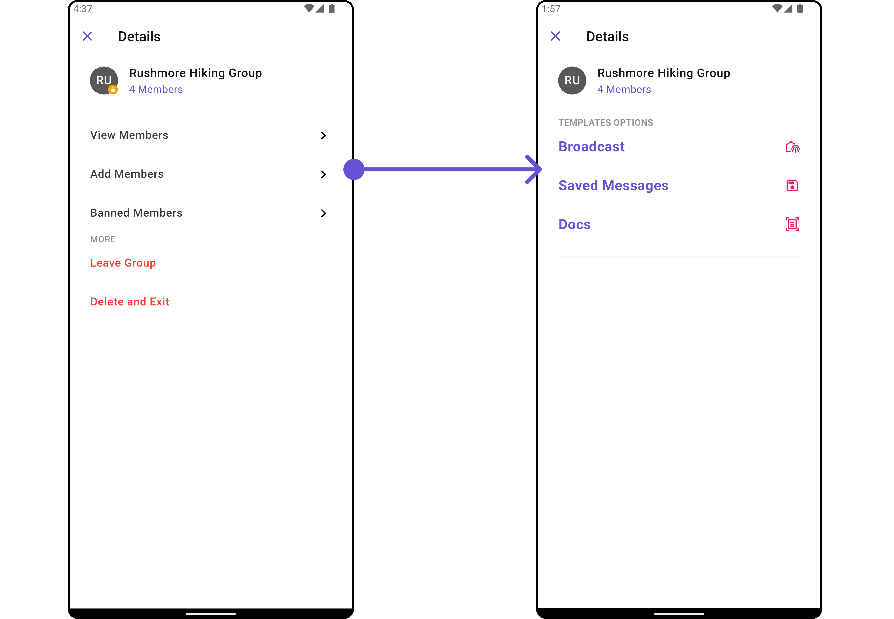

</TabItem>

<TabItem value="iOS" label="iOS">

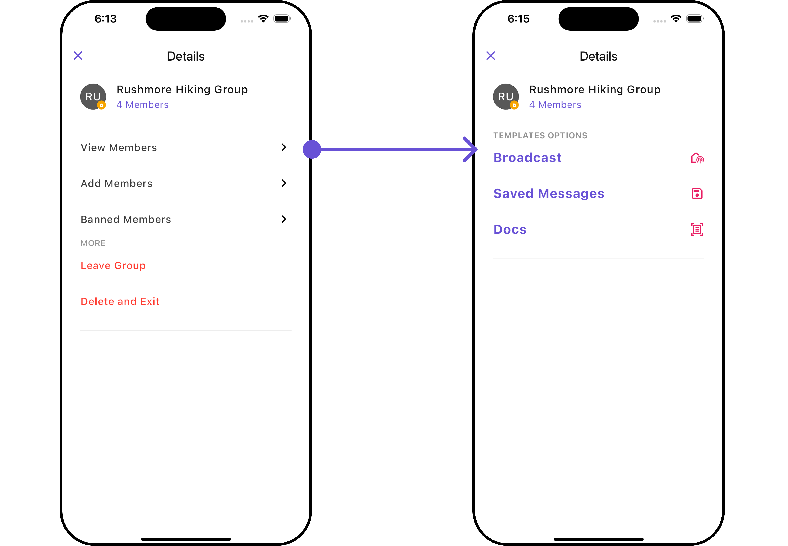

</TabItem>

</Tabs>

---

## Configurations

[Configurations](/ui-kit/flutter/components-overview#configurations) offer the ability to customize the properties of each widget within a Composite Widget.
CometChatDetails has `Add Members`, `Banned Members`, `Transfer Ownership` and `Group Members` widget. Hence, each of these widgets will have its individual `Configuration`.

#### Group Members

You can customize the properties of the Group Members widget by making use of the `GroupMembersConfiguration`. You can accomplish this by employing the `GroupMembersConfiguration` as demonstrated below:

<Tabs>

<TabItem value="Dart" label="Dart">

```dart
CometChatDetails(
  group: Group(guid: "", name: "", membersCount: 0, type: ""), // A group object is required to launch this widget.
  groupMembersConfiguration: GroupMembersConfiguration()
)
```

</TabItem>

</Tabs>

All exposed properties of `GroupMembersConfiguration` can be found under [Group Members](./group-members#configuration). Properties marked with the <a data-tooltip-id="my-tooltip-html-prop"><span class="material-icons red">report</span></a> symbol are not accessible within the Configuration Object.

**Example**

Let's say you want to change the style of the Group Member subwidget and, in addition, you only want to hide search bar and separator.

You can modify the style using the `groupMemberStyle` property, hide the separator using `hideSeparator` property and hide the search bar using `hideSearch` property.

<Tabs>

<TabItem value="Dart" label="Dart">

```dart
CometChatDetails(
  group: Group(guid: "", name: "", membersCount: 0, type: ""), // A group object is required to launch this widget.
  groupMembersConfiguration: GroupMembersConfiguration(
    groupMemberStyle: GroupMembersStyle(
      background: Color(0xFFE4EBF5),
      border: Border.all(width: 2),
      borderRadius: 20,
    ),
    hideSearch: false,
    hideSeparator: true
  ),
)
```

</TabItem>

</Tabs>

<!-- <Tabs>

<TabItem value="Android" label="Android">


</TabItem>

<TabItem value="iOS" label="iOS">


</TabItem>

</Tabs> -->

---

#### Add Members

You can customize the properties of the Add Members widget by making use of the `AddMembersConfiguration`. You can accomplish this by employing the `AddMembersConfiguration` as demonstrated below:

<Tabs>

<TabItem value="Dart" label="Dart">

```dart
CometChatDetails(
  group: Group(guid: "", name: "", membersCount: 0, type: ""), // A group object is required to launch this widget.
  addMemberConfiguration: AddMemberConfiguration(),
)
```

</TabItem>

</Tabs>

All exposed properties of `AddMembersConfiguration` can be found under [Add Members](/ui-kit/flutter/group-add-members). Properties marked with the <a data-tooltip-id="my-tooltip-html-prop"><span class="material-icons red">report</span></a> symbol are not accessible within the Configuration Object.

**Example**

Let's say you want to change the style of the Add Members subwidget and, in addition, you only want to show the back button.

You can modify the style using the `ListItemStyle` property and `AvatarStyle` property

<Tabs>

<TabItem value="Dart" label="Dart">

```dart
CometChatDetails(
  group: Group(guid: "", name: "", membersCount: 0, type: ""), // A group object is required to launch this widget.
  addMemberConfiguration: AddMemberConfiguration(
    addMembersStyle: AddMembersStyle(
        background: Color(0xFFE4EBF5),
        titleStyle: TextStyle(color: Colors.red),
        backIconTint: Colors.red
    ),
    avatarStyle: AvatarStyle(
        border: Border.all(width: 5),
        borderRadius: 20,
        background: Colors.red
    ),
  ),
)
```

</TabItem>

</Tabs>

<Tabs>

<TabItem value="Android" label="Android">

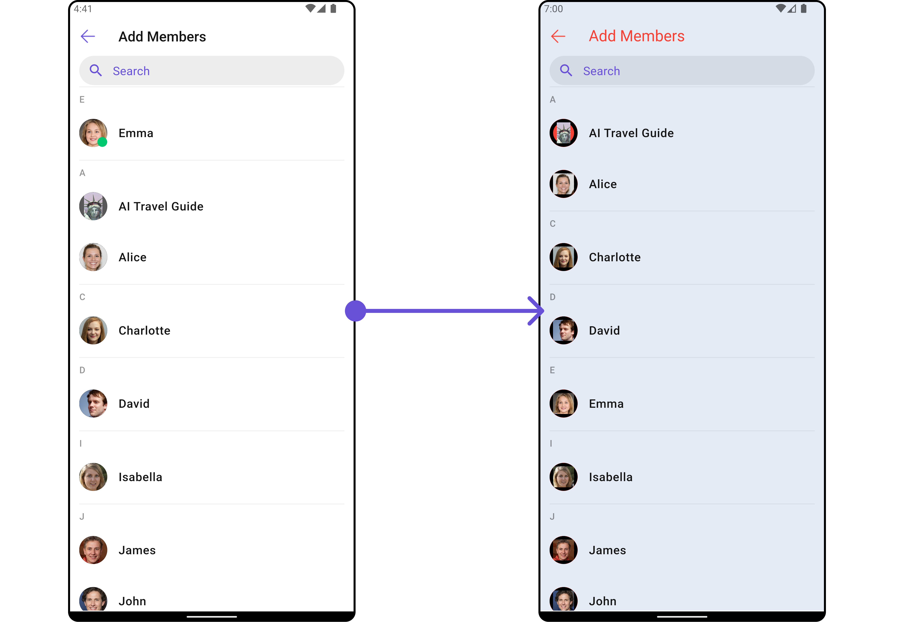

</TabItem>

<TabItem value="iOS" label="iOS">

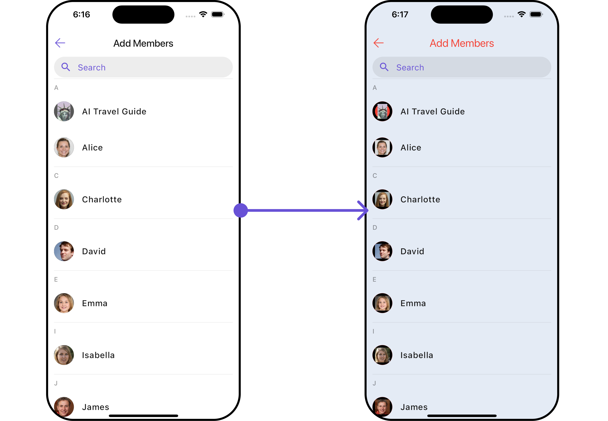

</TabItem>

</Tabs>

---

#### Banned Members

You can customize the properties of the Banned Members widget by making use of the `BannedMembersConfiguration`. You can accomplish this by employing the `BannedMembersConfiguration` as demonstrated below:

<Tabs>

<TabItem value="Dart" label="Dart">

```dart
CometChatDetails(
  group: Group(guid: "", name: "", membersCount: 0, type: ""), // A group object is required to launch this widget.
  bannedMemberConfiguration: BannedMemberConfiguration(),
)
```

</TabItem>

</Tabs>

All exposed properties of `BannedMembersConfiguration` can be found under [Banned Members](/ui-kit/flutter/group-banned-members). Properties marked with the <a data-tooltip-id="my-tooltip-html-prop"><span class="material-icons red">report</span></a> symbol are not accessible within the Configuration Object.

**Example**

Let's say you want to change the style of the Banned Members subwidget and, in addition, you only want to show the back button.

You can modify the style using the `ListItemStyle` property and `AvatarStyle` property

<Tabs>

<TabItem value="Dart" label="Dart">

```dart
CometChatDetails(
  group: Group(guid: "", name: "", membersCount: 0, type: ""), // A group object is required to launch this widget.
  bannedMemberConfiguration: BannedMemberConfiguration(
    bannedMembersStyle: BannedMembersStyle(
        background: Color(0xFFE4EBF5),
        titleStyle: TextStyle(color: Colors.red),
        backIconTint: Colors.red
    ),
    avatarStyle: AvatarStyle(
        border: Border.all(width: 5),
        borderRadius: 20,
        background: Colors.red
    ),
  ),
)
```

</TabItem>

</Tabs>

<!-- <Tabs>

<TabItem value="Android" label="Android">


</TabItem>

<TabItem value="iOS" label="iOS">


</TabItem>

</Tabs> -->

---

#### Transfer Ownership

You can customize the properties of the Transfer Ownership widget by making use of the `TransferOwnershipConfiguration`. You can accomplish this by employing the `TransferOwnershipConfiguration` as demonstrated below:

<Tabs>

<TabItem value="Dart" label="Dart">

```dart
CometChatDetails(
  group: Group(guid: "", name: "", membersCount: 0, type: ""), // A group object is required to launch this widget.
  transferOwnershipConfiguration: TransferOwnershipConfiguration(),
)
```

</TabItem>

</Tabs>

All exposed properties of `TransferOwnershipConfiguration` can be found under [Transfer Ownership](/ui-kit/flutter/group-transfer-ownership). Properties marked with the <a data-tooltip-id="my-tooltip-html-prop"><span class="material-icons red">report</span></a> symbol are not accessible within the Configuration Object.

**Example**
Let's say you want to change the style of the Transfer Ownership subwidget and, in addition, you only want to show the back button.

You can modify the style using the `ListItemStyle` property and `AvatarStyle` property

<Tabs>

<TabItem value="Dart" label="Dart">

```dart
CometChatDetails(
  group: myGroup, // A group object is required to launch this widget.
  transferOwnershipConfiguration: TransferOwnershipConfiguration(
    transferOwnershipStyle: TransferOwnershipStyle(
      background: Color(0xFFE4EBF5),
      submitIconTint: Colors.red,
      selectIconTint: Colors.red,
    ),
    avatarStyle: AvatarStyle(
        border: Border.all(width: 5),
        borderRadius: 20,
        background: Colors.red
    ),
  ),
)
```

</TabItem>

</Tabs>

<!-- <Tabs>

<TabItem value="Android" label="Android">


</TabItem>

<TabItem value="iOS" label="iOS">


</TabItem>

</Tabs> -->

---
