import Tabs from '@theme/Tabs';
import TabItem from '@theme/TabItem';
import { Tooltip } from 'react-tooltip'
import 'react-tooltip/dist/react-tooltip.css'

<Tooltip id="my-tooltip-html-prop" html="Not available in Group Members Configuration object"/>

## Overview

The Messages is a [Composite Widget](/ui-kit/flutter/components-overview#composite-components) that manages messages for users and groups.

<Tabs>

<TabItem value="Android" label="Android">

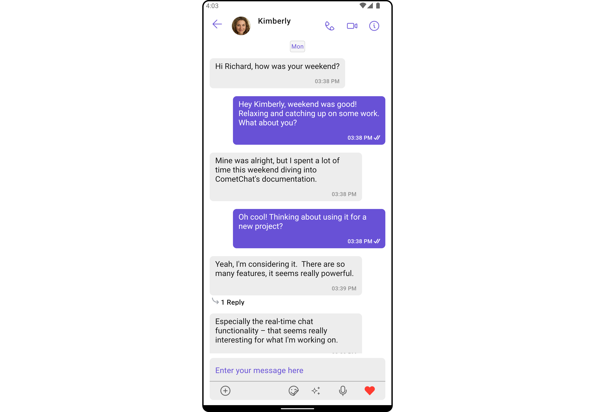

</TabItem>

<TabItem value="iOS" label="iOS">

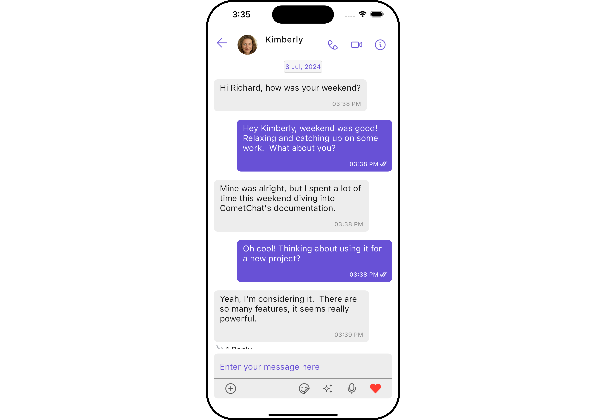

</TabItem>

</Tabs>

The Messages widget is composed of three individual widgets, [MessageHeader](./message-header), [MessageList](./message-list), and [MessageComposer](./message-composer). In addition, the Messages widget also navigates to the [Details](/ui-kit/flutter/group-details) and [ThreadedMessages](/ui-kit/flutter/threaded-messages) widgets.

| Widgets                                               | Description                                                                                                                                                                                              |
| ----------------------------------------------------- | -------------------------------------------------------------------------------------------------------------------------------------------------------------------------------------------------------- |
| [MessageHeader](./message-header)                     | `CometChatMessageHeader` displays the `User` or `Group` information using CometChat SDK's `User` or `Group object.` It also shows the typing indicator when the user starts typing in `MessageComposer`. |
| [MessageList](./message-list)                         | `CometChatMessageList` is one of the core UI widgets. It displays a list of messages and handles real-time operations.                                                                                   |
| [MessageComposer](./message-composer)                 | `CometChatMessageComposer` is an independent and critical widget that allows users to compose and send various types of messages includes text, image, video and custom messages.                        |
| [Details](/ui-kit/flutter/group-details)              | `CometChatDetails` is a widget that displays all the available options available for `Users` & `Groups`                                                                                                  |
| [ThreadedMessages](/ui-kit/flutter/threaded-messages) | `CometChatThreadedMessages` is a widget that displays all replies made to a particular message in a conversation.                                                                                        |

## Usage

### Integration

You can launch `CometChatMessages` directly using `Navigator.push`, or you can define it as a widget within the `build` method of your `State` class.

##### 1. Using Navigator to Launch `CometChatMessages`

<Tabs>

<TabItem value="Dart" label="Dart">

```dart
Navigator.push(context, MaterialPageRoute(builder: (context) => CometChatMessages())); // A user or group object is required to launch this widget.
```

</TabItem>

</Tabs>

##### 2. Embedding `CometChatMessages` as a Widget in the build Method

<Tabs>

<TabItem value="Dart" label="Dart">

```dart
import 'package:cometchat_chat_uikit/cometchat_chat_uikit.dart';
import 'package:flutter/material.dart';

class Messages extends StatefulWidget {
  const Messages({super.key});

  @override
  State<Messages> createState() => _MessagesState();
}

class _MessagesState extends State<Messages> {

  @override
  Widget build(BuildContext context) {
    return Scaffold(
        body: SafeArea(
            child: CometChatMessages() // A user or group object is required to launch this widget.
        )
    );
  }
}
```

</TabItem>

</Tabs>

---

### Actions

[Actions](/ui-kit/flutter/components-overview#actions) dictate how a widget functions. They are divided into two types: Predefined and User-defined. You can override either type, allowing you to tailor the behavior of the widget to fit your specific needs.

The Messages widget does not have its actions. However, since it's a [Composite Widget](/ui-kit/flutter/components-overview#composite-components), you can use the actions of its widgets by utilizing the [Configurations](#configuration) object of each component.

**Example**

In this example, we are employing the [ThreadRepliesClick](/ui-kit/flutter/message-list#1-onthreadrepliesclick) action from the MessageList Widget through the MessageListConfiguration object.

<Tabs>

<TabItem value="Dart" label="Dart">

```dart
CometChatMessages(
  user: user,
  messageListConfiguration: MessageListConfiguration(
      onThreadRepliesClick: (message, context, {bubbleView}) {
        // TODO("Not yet implemented")
      },
  ),
)
```

</TabItem>

</Tabs>

<Tabs>

<TabItem value="Android" label="Android">

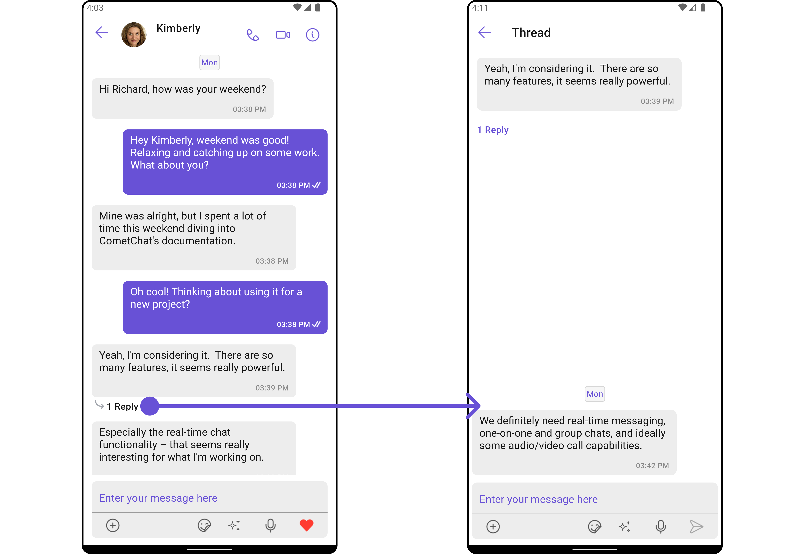

</TabItem>

<TabItem value="iOS" label="iOS">

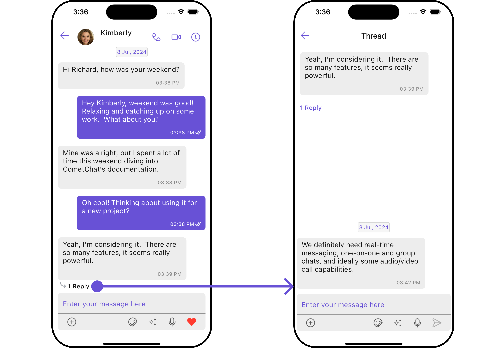

</TabItem>

</Tabs>

> The Messages Widget overrides the [ThreadRepliesClick](/ui-kit/flutter/message-list#1-onthreadrepliesclick) action to navigate to the [ThreadedMessages](/ui-kit/flutter/threaded-messages) component. If you override `ThreadRepliesClick`, it will also override the default behavior of the Messages Widget.

---

### Filters

**Filters** allow you to customize the data displayed in a list within a Widget. You can filter the list based on your specific criteria, allowing for a more customized. Filters can be applied using RequestBuilders of Chat SDK.

The Messages widget does not have its filters. But as it is a [Composite Widget](/ui-kit/flutter/components-overview#composite-components), you can use the filters of its widgets by using the [Configurations](#configuration) object of each component. For more details on the filters of its widgets, please refer to [MessageList Filters](/ui-kit/flutter/message-list#filters).

**Example**

In this example, we're applying the MessageList Widget filter to the Messages Widget using `MessageListConfiguration`.

<Tabs>

<TabItem value="Dart" label="Dart">

```dart
CometChatMessages(
  user: user,
  messageListConfiguration: MessageListConfiguration(
      messagesRequestBuilder: MessagesRequestBuilder()
        ..uid = user.uid
        ..searchKeyword = "searchKeyword"
  ),
)
```

</TabItem>

</Tabs>

---

### Events

[Events](/ui-kit/flutter/components-overview#events) are emitted by a `Widget`. By using event you can extend existing functionality. Being global events, they can be applied in Multiple Locations and are capable of being Added or Removed.

The list of events emitted by the Messages widget is as follows.

| Event                | Description                                                                                                                       |
| -------------------- | --------------------------------------------------------------------------------------------------------------------------------- |
| **ccMessageSent**    | Triggers whenever a loggedIn user sends any message, it will have two states such as: <br /><br />inProgress & sent               |
| **ccMessageEdited**  | Triggers whenever a loggedIn user edits any message from the list of messages .it will have two states such as: inProgress & sent |
| **ccMessageDeleted** | Triggers whenever a loggedIn user deletes any message from the list of messages                                                   |
| **ccMessageRead**    | Triggers whenever a loggedIn user reads any message.                                                                              |
| **ccLiveReaction**   | Triggers whenever a loggedIn clicks on live reaction                                                                              |

**Example**

<Tabs>

<TabItem value="Dart" label="Dart">

```dart
import 'package:cometchat_chat_uikit/cometchat_chat_uikit.dart';
import 'package:flutter/material.dart';

class YourScreen extends StatefulWidget {
  const YourScreen({super.key});

  @override
  State<YourScreen> createState() => _YourScreenState();
}

class _YourScreenState extends State<YourScreen> with CometChatMessageEventListener {

  @override
  void initState() {
    super.initState();
    CometChatMessageEvents.addMessagesListener("listenerId", this); // Add the listener
  }

  @override
  void dispose(){
    super.dispose();
    CometChatMessageEvents.removeMessagesListener("listenerId"); // Remove the listener
  }

  @override
  void ccMessageSent(BaseMessage message, MessageStatus messageStatus) {
    // TODO: implement ccMessageSent
    super.ccMessageSent(message, messageStatus);
  }

  @override
  void ccMessageEdited(BaseMessage message, MessageEditStatus status) {
    // TODO: implement ccMessageEdited
    super.ccMessageEdited(message, status);
  }

  @override
  void ccMessageDeleted(BaseMessage message, EventStatus messageStatus) {
    // TODO: implement ccMessageDeleted
    super.ccMessageDeleted(message, messageStatus);
  }

  @override
  void ccLiveReaction(String reaction) {
    // TODO: implement ccLiveReaction
    super.ccLiveReaction(reaction);
  }

  @override
  Widget build(BuildContext context) {
    return const Placeholder();
  }

}
```

</TabItem>

</Tabs>

---

## Customization

To fit your app's design requirements, you can customize the appearance of the conversation component. We provide exposed methods that allow you to modify the experience and behavior according to your specific needs.

### Style

Using Style you can customize the look and feel of the widget in your app, These parameters typically control elements such as the color, size, shape, and fonts used within the component.

##### 1. Messages Style

You can customize the appearance of the Messages Widget by applying the MessagesStyle to it using the following code snippet.

<Tabs>

<TabItem value="Dart" label="Dart">

```dart
CometChatMessages(
  user: user,
  messagesStyle: MessagesStyle(
    background: Color(0xFFE4EBF5),
  ),
)
```

</TabItem>

</Tabs>

<Tabs>

<TabItem value="Android" label="Android">

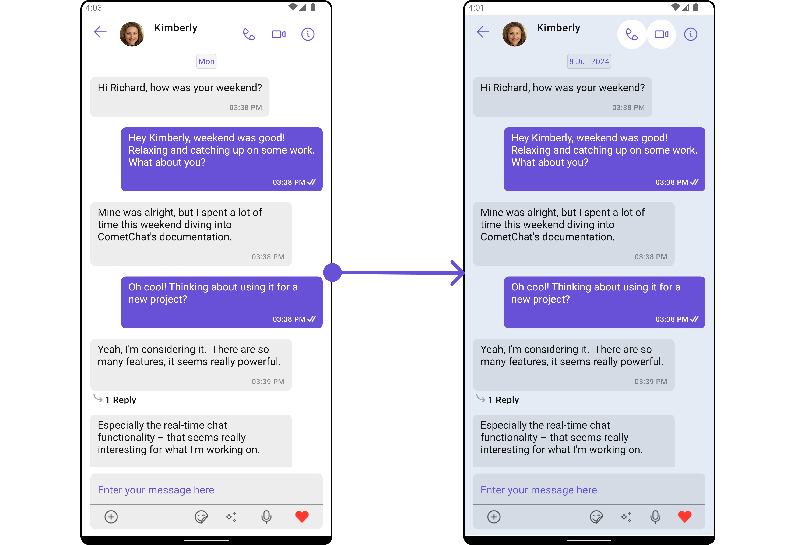

</TabItem>

<TabItem value="iOS" label="iOS">

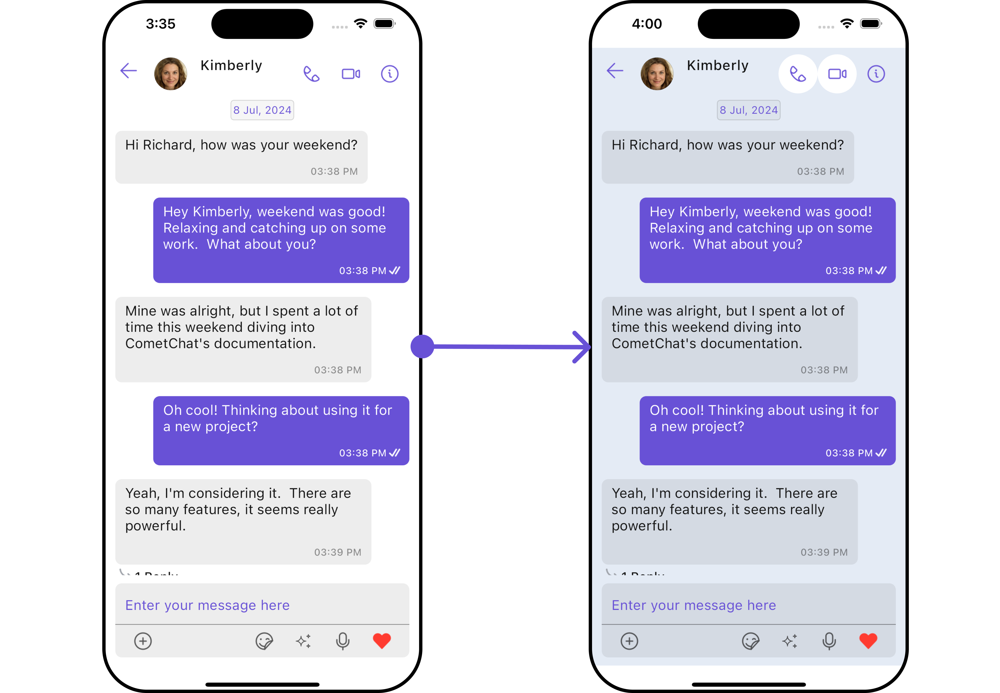

</TabItem>

</Tabs>

List of properties exposed by `MessagesStyle`

| Property          | Description                    | Code                          |
| ----------------- | ------------------------------ | ----------------------------- |
| **Background**    | Background color of the widget | `background: Color?`          |
| **Border**        | Border of the widget           | `border: Border?`             |
| **Border Radius** | Border radius of the widget    | `borderRadius: BorderRadius?` |
| **Gradient**      | Gradient of the widget         | `gradient: Gradient?`         |

---

##### 2. Widget's Styles

Being a [Composite component](/ui-kit/flutter/components-overview#composite-components), the Messages Widget allows you to customize the styles of its widgets using their respective Configuration objects.

For a list of all available properties, refer to each component's styling documentation: [MesssageHeader Styles](/ui-kit/flutter/message-header#style), [MessageList Styles](/ui-kit/flutter/message-list#style), [MessageComposer Styles](/ui-kit/flutter/message-composer#style), [Details Styles](/ui-kit/flutter/group-details), [ThreadMessages Styles](/ui-kit/flutter/threaded-messages).

**Example**

In this example, we are creating `MessageListStyle` and `MessageComposerStyle` and then applying them to the Messages Widget using `MessageListConfiguration` and `MessageComposerConfiguration`.

<Tabs>

<TabItem value="Dart" label="Dart">

```dart
CometChatMessages(
  user: user,
  messageListConfiguration: MessageListConfiguration(
    messageListStyle: MessageListStyle(
      background: Color(0xFFE4EBF5),
      border: Border.all(width: 3, color: Colors.red)
    ),
  ),
  messageComposerConfiguration: MessageComposerConfiguration(
      messageComposerStyle: MessageComposerStyle(
        background: Color(0xFFB39DDB),
          border: Border.all(width: 3, color: Colors.yellow)
      )
  ),
)
```

</TabItem>

</Tabs>

---

### Functionality

These are a set of small functional customizations that allow you to fine-tune the overall experience of the component. With these, you can change text, set custom icons, and toggle the visibility of UI elements.

<Tabs>

<TabItem value="Android" label="Android">

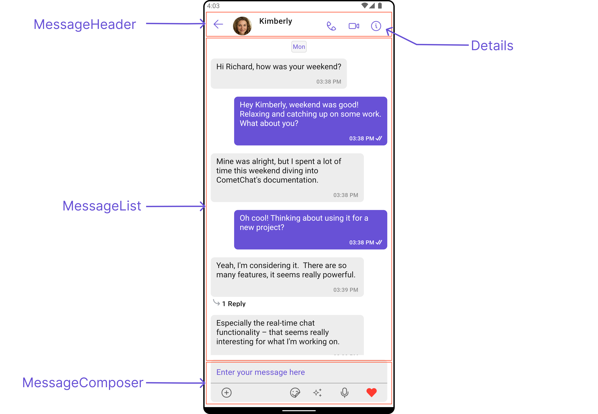

</TabItem>

<TabItem value="iOS" label="iOS">

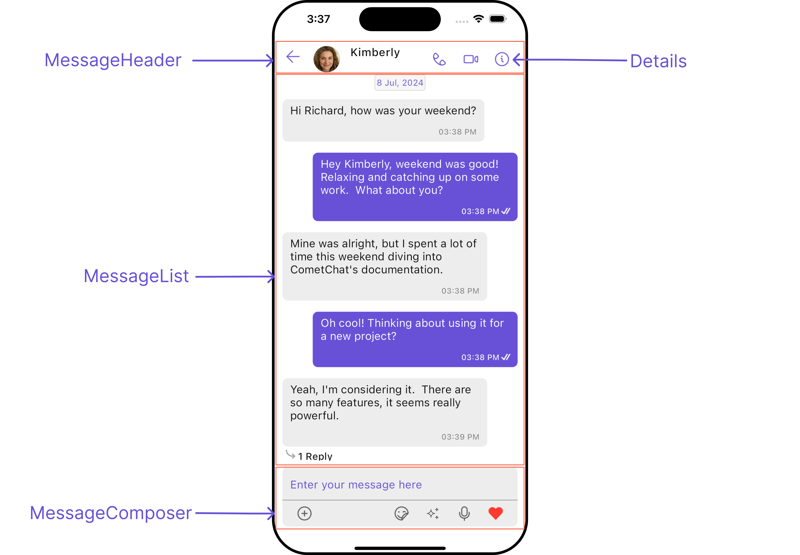

</TabItem>

</Tabs>

<Tabs>

<TabItem value="Dart" label="Dart">

```dart
CometChatMessages(
  user: user,
  hideMessageComposer: true,
  hideDetails: true
)
```

</TabItem>

</Tabs>

<Tabs>

<TabItem value="Android" label="Android">

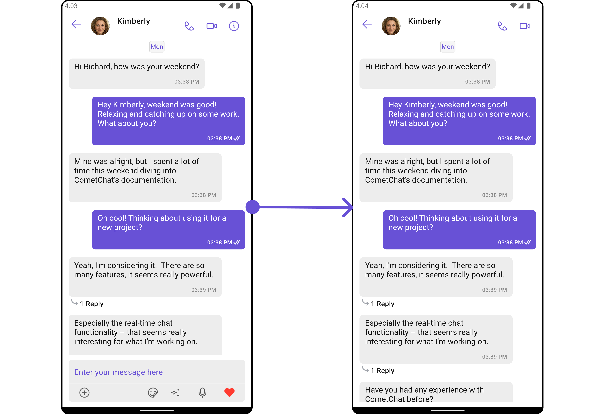

</TabItem>

<TabItem value="iOS" label="iOS">

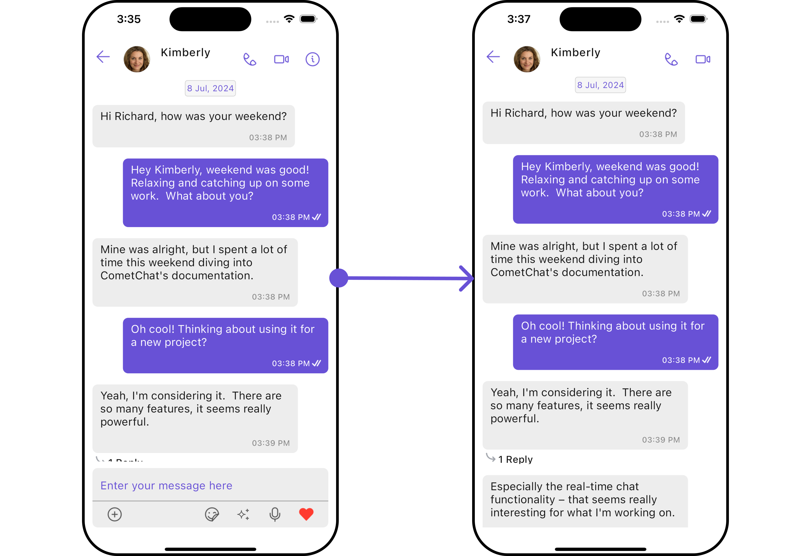

</TabItem>

</Tabs>

List of properties exposed by `CometChatMessages`

| Property                                      | Description                                            | Code                                            |
| --------------------------------------------- | ------------------------------------------------------ | ----------------------------------------------- |
| **User**                                      | User object for which the messages are to be shown     | `user: User?`                                   |
| **Group**                                     | Group object for which the messages are to be shown    | `group: Group?`                                 |
| **Hide Message Composer**                     | Toggles visibility for message composer                | `hideMessageComposer: bool?`                    |
| **Disable Typing**                            | If true, disables the typing indicator                 | `disableTyping: bool?`                          |
| **Custom Sound For Incoming Messages**        | Custom sound path for incoming messages                | `customSoundForIncomingMessages: String?`       |
| **Custom Sound For Incoming Message Package** | Package name for sound incoming from different package | `customSoundForIncomingMessagePackage: String?` |
| **Custom Sound For Outgoing Messages**        | Custom sound path for outgoing messages                | `customSoundForOutgoingMessages: String?`       |
| **Custom Sound For Outgoing Message Package** | Package name for sound outgoing from different package | `customSoundForOutgoingMessagePackage: String?` |
| **Hide Message Header**                       | Toggles visibility for message header                  | `hideMessageHeader: bool?`                      |
| **Disable Sound For Messages**                | Disables sound for incoming and outgoing message       | `disableSoundForMessages: bool?`                |
| **Theme**                                     | Custom theme for the messages screen                   | `theme: CometChatTheme?`                        |
| **Hide Details**                              | Toggles visibility for details icons                   | `hideDetails: bool?`                            |

---

### Advanced

For advanced-level customization, you can set custom widgets to the component. This lets you tailor each aspect of the widget to fit your exact needs and application aesthetics. You can create and define your widgets and then incorporate those into the component.

#### MessageHeaderView

You can set your custom message header widget using the `messageHeaderView` method. But keep in mind, by using this you will override the default message header functionality.

Here is the complete example for reference:

**Example**

<Tabs>

<TabItem value="Dart" label="Dart">

```dart
CometChatMessages(
  user: user,
  messageHeaderView: (user, group, context) {
    return AppBar(
      backgroundColor: Color(0xFFE4EBF5),
      title: Text(user?.name ?? 'Default Title'),
      leading: IconButton(
        icon: Icon(Icons.arrow_back),
        onPressed: () {
            // TODO("Not yet implemented")
        },
      ),
    ); // Custom AppBar
  },
)
```

</TabItem>

</Tabs>

<Tabs>

<TabItem value="Android" label="Android">

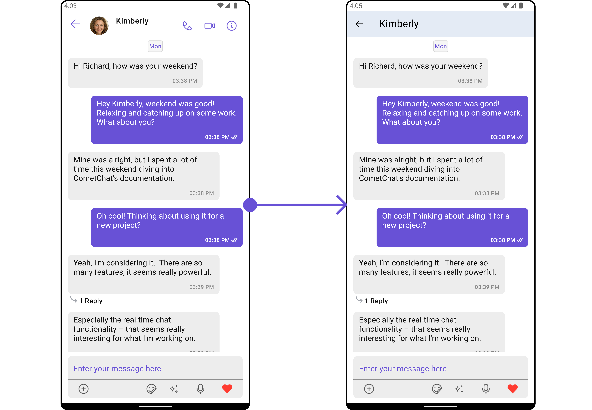

</TabItem>

<TabItem value="iOS" label="iOS">

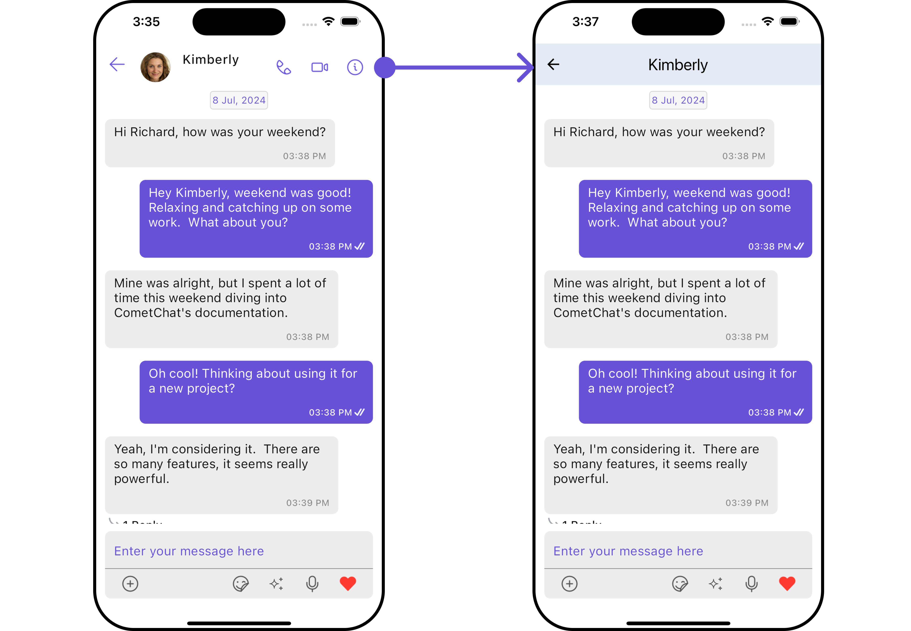

</TabItem>

</Tabs>

---

#### MessageListView

You can set your custom message list widget using the `messageListView` method. But keep in mind, by using this you will override the default message ListView functionality.

Here is the complete example for reference:

**Example**

<Tabs>

<TabItem value="Dart" label="Dart">

```dart
CometChatMessages(
  user: user,
  messageListView: (user, group, context) {
    return Container(
      margin: const EdgeInsets.all(10),
      decoration: BoxDecoration(
        color: Color(0xFFE4EBF5),
        borderRadius: BorderRadius.circular(10),
        border: Border.all(width: 5, color: Color(0xFF6851D6)),
      ),
      child: Center(
        child: CometChatMessageList(user: user,),
      ),
    );
  },
)
```

</TabItem>

</Tabs>

<Tabs>

<TabItem value="Android" label="Android">

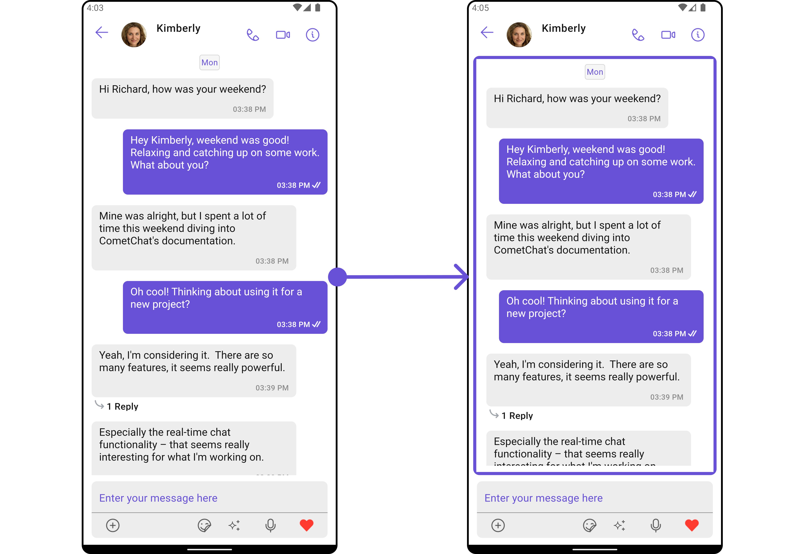

</TabItem>

<TabItem value="iOS" label="iOS">

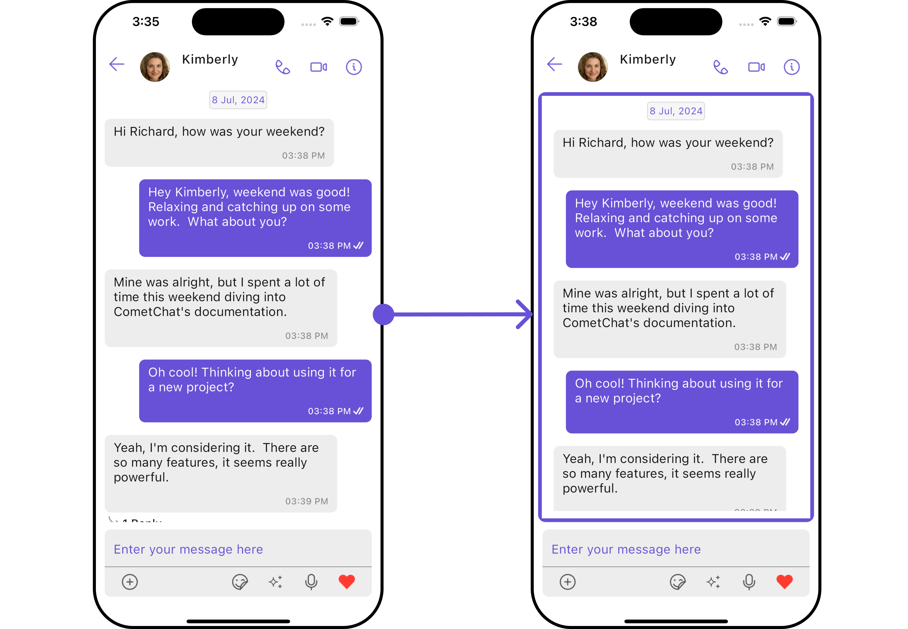

</TabItem>

</Tabs>

---

#### MessageComposerView

You can set your custom Message Composer widget using the `messageComposerView` method. But keep in mind, by using this you will override the default message composer functionality.

Here is the complete example for reference:

**Example**

<Tabs>

<TabItem value="Dart" label="Dart">

```dart
CometChatMessages(
  user: user,
  messageComposerView: (user, group, context) {
    return Container(
      margin: const EdgeInsets.all(10),
      decoration: BoxDecoration(
        color: Color(0xFFE4EBF5),
        borderRadius: BorderRadius.circular(10),
        border: Border.all(width: 5, color: Colors.red),
      ),
      child: CometChatMessageComposer(user: user),
    );
  },
)
```

</TabItem>

</Tabs>

<Tabs>

<TabItem value="Android" label="Android">

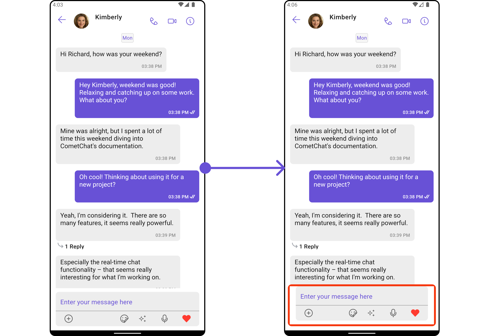

</TabItem>

<TabItem value="iOS" label="iOS">

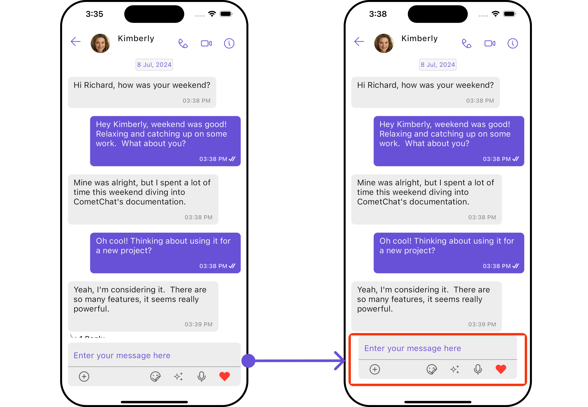

</TabItem>

</Tabs>

---

## Configuration

Configurations offer the ability to customize the properties of each individual widget within a Composite Widget.

The Messages Widget is a Composite Widget and it has a specific set of configuration for each of its widgets.

### MessageHeader

If you want to customize the properties of the [MessageHeader](./message-header) Widget inside Messages Widget, you need use the `MessageHeaderConfiguration` object.

<Tabs>

<TabItem value="Dart" label="Dart">

```dart
CometChatMessages(
  user: user,
  messageHeaderConfiguration: MessageHeaderConfiguration(),
)
```

</TabItem>

</Tabs>

The `MessageHeaderConfiguration` provides access to all the [Action](/ui-kit/flutter/message-header#style), [Filters](/ui-kit/flutter/message-header#filters), [Styles](/ui-kit/flutter/message-header#style), [Functionality](/ui-kit/flutter/message-header#functionality), and [Advanced](/ui-kit/flutter/message-header#advanced) properties of the [MessageHeader](/ui-kit/flutter/message-header) component.

> Please note that the properties marked with the <a><span class="material-icons red">report</span></a> symbol are not accessible within the Configuration Object.

**Example**

In this example, we will be adding a custom back button and styling a few properties of the Avatar widget of the [MessageHeader](/ui-kit/flutter/message-header) widget using `MessageHeaderConfiguration`.

<Tabs>

<TabItem value="Dart" label="Dart">

```dart
CometChatMessages(
  user: user,
  messageHeaderConfiguration: MessageHeaderConfiguration(
    avatarStyle: AvatarStyle(
        border: Border.all(width: 5),
        borderRadius: 20,
        background: Colors.red
    ),
  ),
)
```

</TabItem>

</Tabs>

<Tabs>

<TabItem value="Android" label="Android">

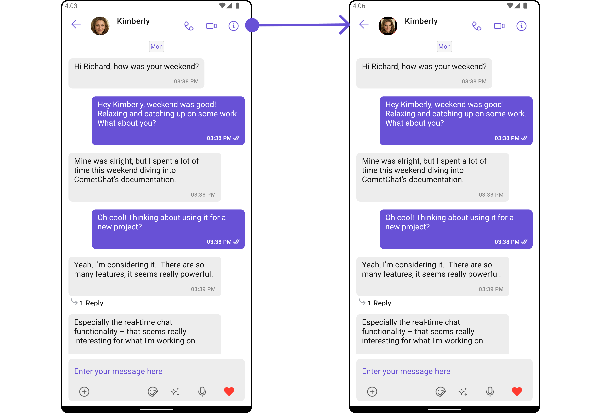

</TabItem>

<TabItem value="iOS" label="iOS">

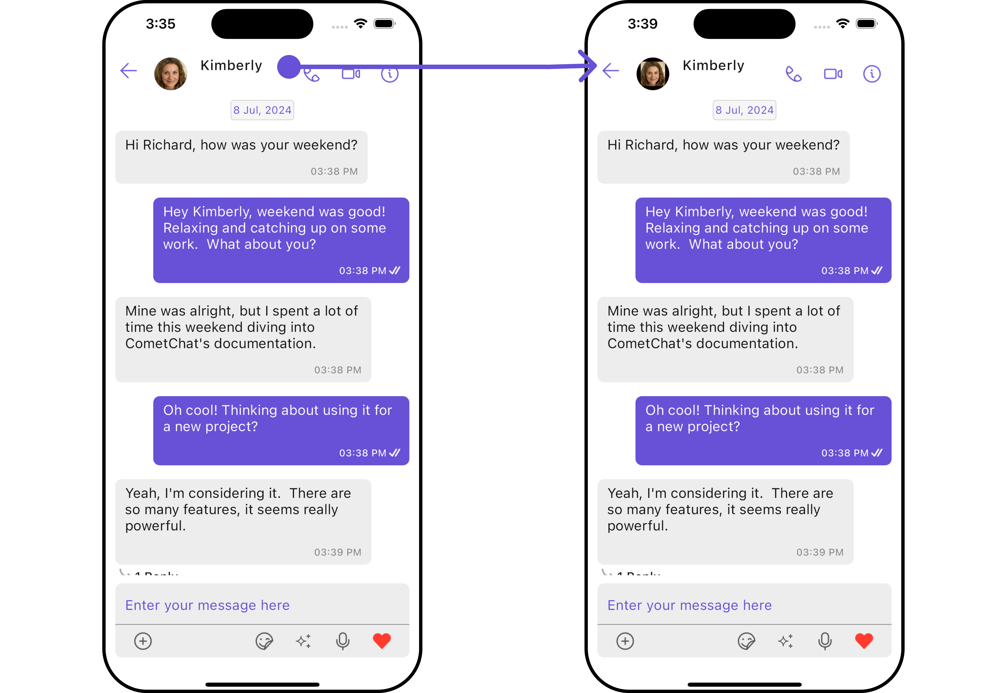

</TabItem>

</Tabs>

---

### MessageList

If you want to customize the properties of the [MessageList](./03-message-list.md) Widget inside Messages Widget, you need use the `MessageListConfiguration` object.

<Tabs>

<TabItem value="Dart" label="Dart">

```dart
CometChatMessages(
  user: user,
  messageListConfiguration: MessageListConfiguration(),
)
```

</TabItem>

</Tabs>

The `MessageListConfiguration` provides access to all the [Action](/ui-kit/flutter/message-list#style), [Filters](/ui-kit/flutter/message-list#filters), [Styles](/ui-kit/flutter/message-list#style), [Functionality](/ui-kit/flutter/message-list#functionality), and [Advanced](//android-chat-ui-kit/message-list#advanced) properties of the [MessageList](/ui-kit/flutter/message-list) component.

> Please note that the properties marked with the <a><span class="material-icons red">report</span></a> symbol are not accessible within the Configuration Object.

**Example**

In this example, we will be changing the list alignment and modifying the message bubble styles in the [MessageList](/ui-kit/flutter/message-list) widget using `MessageListConfiguration`.

<Tabs>

<TabItem value="Dart" label="Dart">

```dart
CometChatMessages(
  user: user,
  messageListConfiguration: MessageListConfiguration(
    alignment: ChatAlignment.leftAligned,
    messageListStyle: MessageListStyle(
        background: Color(0xFFE4EBF5),
        border: Border.all(width: 1, color: Colors.red),
        borderRadius: 10,
    ),
  ),
)
```

</TabItem>

</Tabs>

<Tabs>

<TabItem value="Android" label="Android">

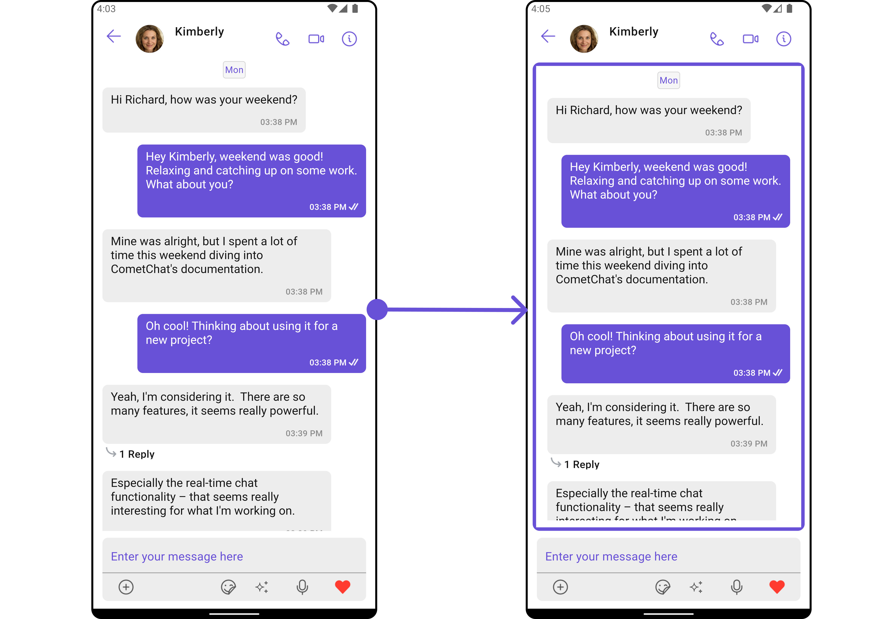

</TabItem>

<TabItem value="iOS" label="iOS">

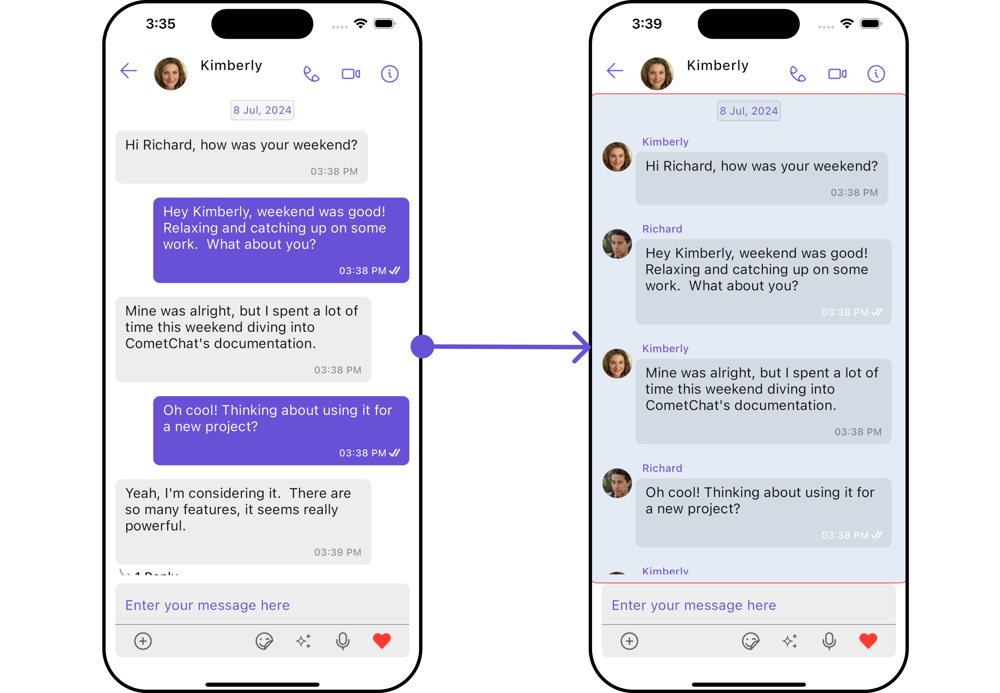

</TabItem>

</Tabs>

---

### MessageComposer

If you want to customize the properties of the [MessageComposer](/ui-kit/flutter/message-composer) Widget inside Messages Widget, you need use the `MessageComposerConfiguration` object.

<Tabs>

<TabItem value="Dart" label="Dart">

```dart
CometChatMessages(
  user: user,
  messageComposerConfiguration: MessageComposerConfiguration(),
)
```

</TabItem>

</Tabs>

The `MessageComposerConfiguration` provides access to all the [Action](/ui-kit/flutter/message-composer#style), [Filters](/ui-kit/flutter/message-composer#filters), [Styles](/ui-kit/flutter/message-composer#style), [Functionality](/ui-kit/flutter/message-composer#functionality), and [Advanced](/ui-kit/flutter/message-composer#advanced) properties of the [MessageComposer](/ui-kit/flutter/message-composer) component.

> Please note that the properties marked with the <a><span class="material-icons red">report</span></a> symbol are not accessible within the Configuration Object.

**Example**

In this example, we'll be adding a custom header widget and customizing some properties of the [MessageComposer](/ui-kit/flutter/message-composer) widget using `MessageComposerConfiguration`.

<Tabs>

<TabItem value="Dart" label="Dart">

```dart
CometChatMessages(
  user: user,
  messageComposerConfiguration: MessageComposerConfiguration(
    headerView: (context, user, group, id) {
      return Container(
        width: MediaQuery.of(context).size.width/1.2,
        margin: const EdgeInsets.all(10),
        decoration: BoxDecoration(
          color: Color(0xFF6851D6),
          borderRadius: BorderRadius.circular(10),
          border: Border.all(width: 5, color: Color(0xFF6851D6)),
        ),
        child: Center(child: Text("Your Custom Header View", style: TextStyle(color: Colors.white),)),
      );
    },
    messageComposerStyle: MessageComposerStyle(
      background: Color(0xFFE4EBF5),
      border: Border.all(width: 1, color: Colors.red),
      borderRadius: 10,
    ),
  ),
)
```

</TabItem>

</Tabs>

<Tabs>

<TabItem value="Android" label="Android">

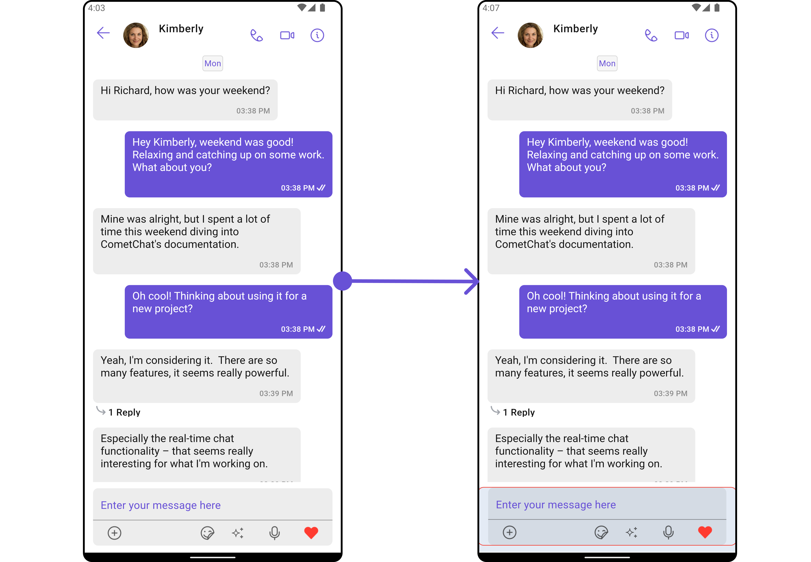

</TabItem>

<TabItem value="iOS" label="iOS">

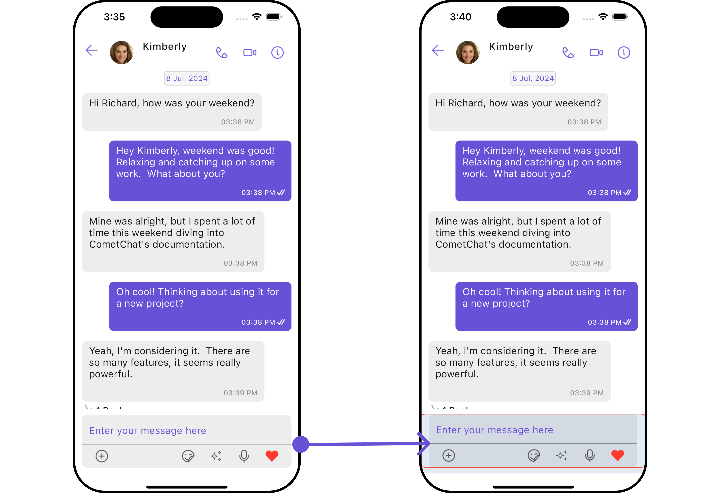

</TabItem>

</Tabs>

---

### ThreadedMessages

If you want to customize the properties of the [ThreadedMessages](/ui-kit/flutter/threaded-messages) Widget inside Messages Widget, you need use the `ThreadedMessagesConfiguration` object.

<Tabs>

<TabItem value="Dart" label="Dart">

```dart
CometChatMessages(
  user: user,
  threadedMessagesConfiguration: ThreadedMessagesConfiguration()
)
```

</TabItem>

</Tabs>

The `ThreadedMessagesConfiguration` provides access to all the [Action](/ui-kit/flutter/threaded-messages#style), [Filters](/ui-kit/flutter/threaded-messages#filters), [Styles](/ui-kit/flutter/threaded-messages#style), [Functionality](/ui-kit/flutter/threaded-messages#functionality), and [Advanced](/ui-kit/flutter/threaded-messages#advanced) properties of the [ThreadedMessages](/ui-kit/flutter/threaded-messages) component.

> Please note that the properties marked with the <a><span class="material-icons red">report</span></a> symbol are not accessible within the Configuration Object.

**Example**

In this example, we are adding a custom title to the Threaded Message widget and also adding custom properties to the [MessageList](#messagelist) using `MessageListConfiguration`. We then apply these changes to the [ThreadedMessages](/ui-kit/flutter/threaded-messages) widget using `ThreadedMessagesConfiguration`.

<Tabs>

<TabItem value="Dart" label="Dart">

```dart
CometChatMessages(
    user: user,
    threadedMessagesConfiguration: ThreadedMessagesConfiguration(
        title: "Your Custom Title",
        threadedMessagesStyle: ThreadedMessageStyle(
          background: Color(0xFFE4EBF5),
          border: Border.all(width: 1, color: Colors.red),
          borderRadius: 10,
        )
    )
)
```

</TabItem>

</Tabs>

<Tabs>

<TabItem value="Android" label="Android">

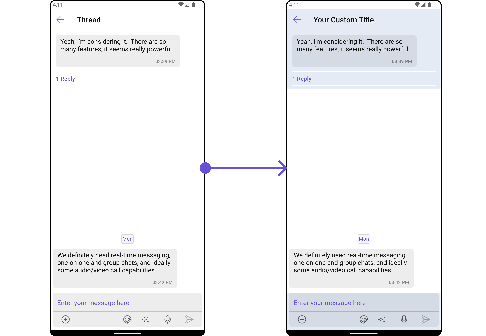

</TabItem>

<TabItem value="iOS" label="iOS">

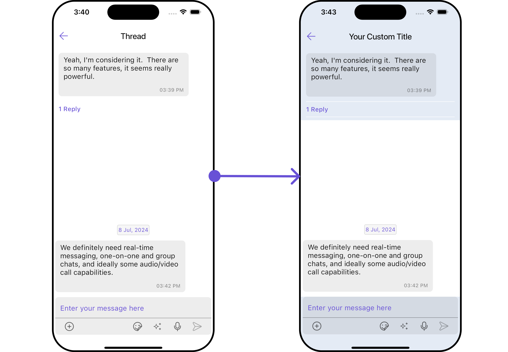

</TabItem>

</Tabs>

---

### Details

If you want to customize the properties of the Details Widget inside Messages Widget, you need use the `DetailsConfiguration` object.

<Tabs>

<TabItem value="Dart" label="Dart">

```dart
CometChatMessages(
    user: user,
    detailsConfiguration: DetailsConfiguration()
)
```

</TabItem>

</Tabs>

The `DetailsConfiguration` provides access to all the [Action](/ui-kit/flutter/message-composer#style), [Filters](/ui-kit/flutter/message-composer#filters), [Styles](/ui-kit/flutter/message-composer#style), [Functionality](/ui-kit/flutter/message-composer#functionality), and [Advanced](/ui-kit/flutter/message-composer#advanced) properties of the [MessageComposer](/ui-kit/flutter/message-composer) component.

> Please note that the properties marked with the <a><span class="material-icons red">report</span></a> symbol are not accessible within the Configuration Object.

**Example**

In this example, we'll be customizing some properties of the [MessageComposer](/ui-kit/flutter/message-composer) widget using `DetailsConfiguration`.

<Tabs>

<TabItem value="Dart" label="Dart">

```dart
CometChatMessages(
    user: user,
    detailsConfiguration: DetailsConfiguration(
        title: "Your Custom Title",
        avatarStyle: AvatarStyle(
            border: Border.all(width: 5),
            borderRadius: 20,
            background: Colors.red
        ),
        detailsStyle: DetailsStyle(
          background: Color(0xFFE4EBF5),
          border: Border.all(width: 1, color: Colors.red),
          titleStyle: TextStyle(color: Colors.red, fontFamily: "PlaywritePL"),
        )
    )
)
```

</TabItem>

</Tabs>

<Tabs>

<TabItem value="Android" label="Android">

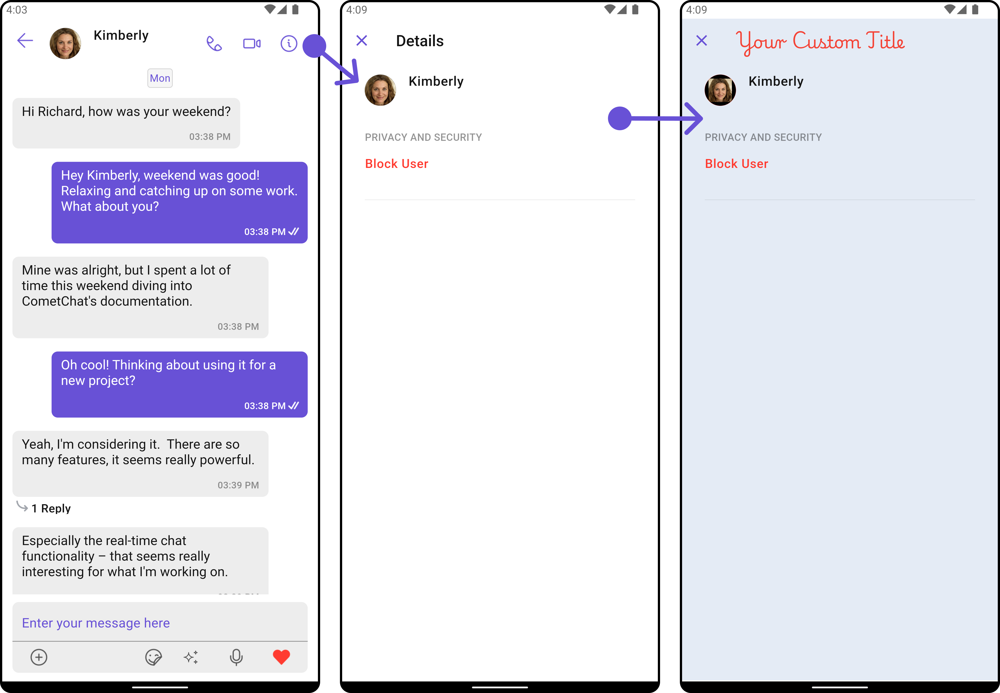

</TabItem>

<TabItem value="iOS" label="iOS">

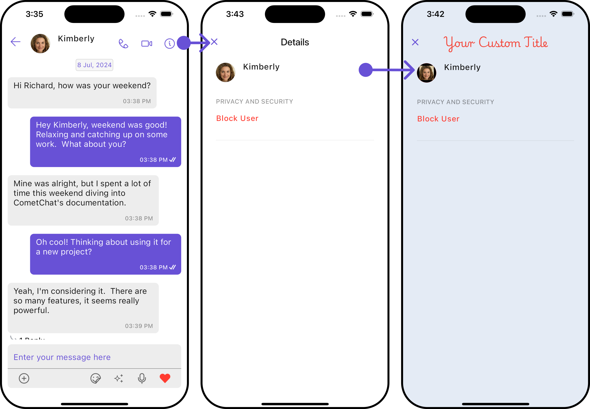

</TabItem>

</Tabs>

---
