import Tabs from '@theme/Tabs';
import TabItem from '@theme/TabItem';
import { Tooltip } from 'react-tooltip'
import 'react-tooltip/dist/react-tooltip.css'

<Tooltip id="my-tooltip-html-prop" html="Not available in Group Members Configuration object"/>

## Overview

`MessageList` is a [Composite Widget](/ui-kit/flutter/components-overview#composite-components) that displays a list of messages and effectively manages real-time operations. It includes various types of messages such as Text Messages, Media Messages, Stickers, and more.

`MessageList` is primarily a list of the base widget [MessageBubble](/ui-kit/flutter/message-bubble). The MessageBubble Widget is utilized to create different types of chat bubbles depending on the message type.

<Tabs>

<TabItem value="Android" label="Android">

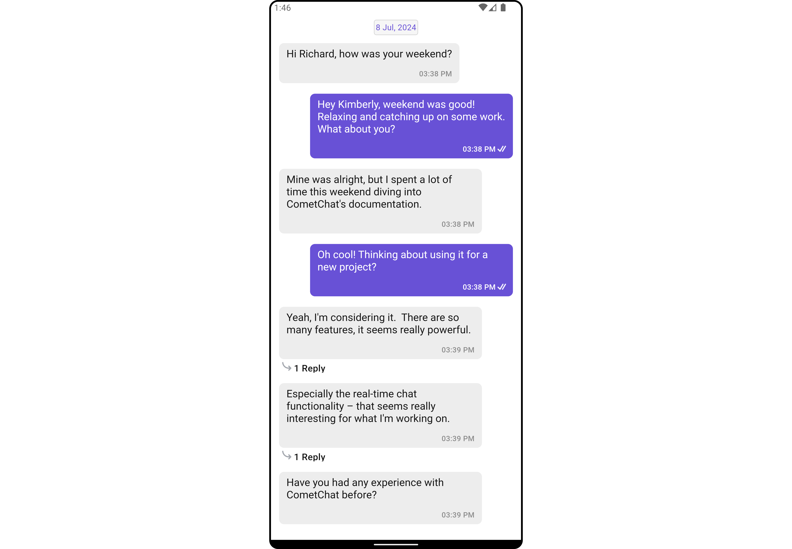

</TabItem>

<TabItem value="iOS" label="iOS">

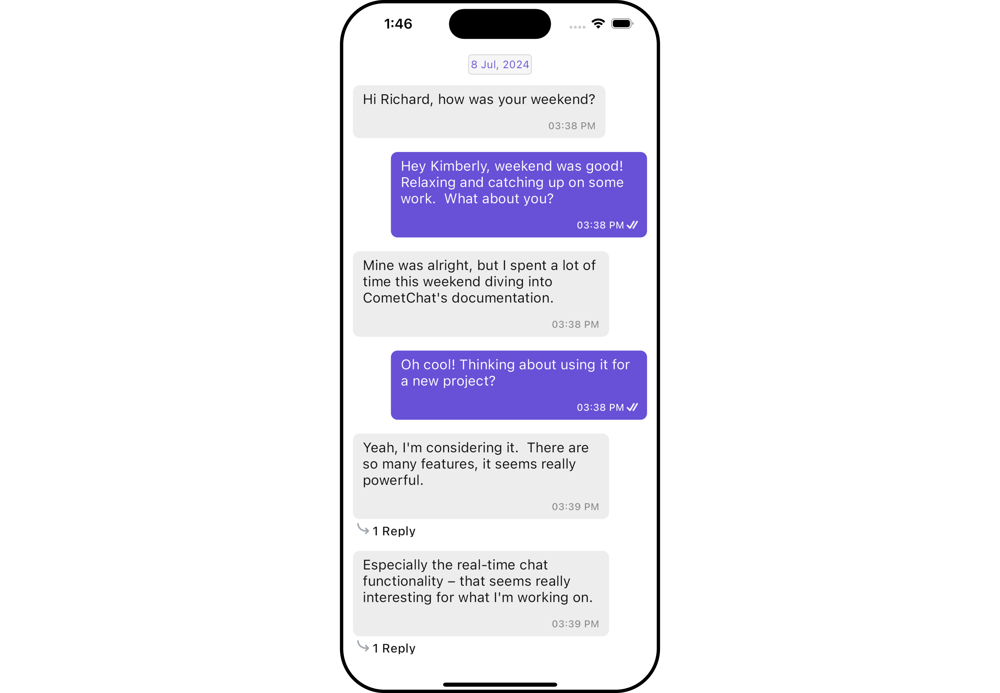

</TabItem>

</Tabs>

## Usage

### Integration

You can launch `CometChatMessageList` directly using `Navigator.push`, or you can define it as a widget within the `build` method of your `State` class.

##### 1. Using Navigator to Launch `CometChatMessageList`

<Tabs>

<TabItem value="Dart" label="Dart">

```dart
Navigator.push(context, MaterialPageRoute(builder: (context) => CometChatMessageList())); // A user or group object is required to launch this widget.
```

</TabItem>

</Tabs>

##### 2. Embedding `CometChatMessageList` as a Widget in the build Method

<Tabs>

<TabItem value="Dart" label="Dart">

```dart
import 'package:cometchat_chat_uikit/cometchat_chat_uikit.dart';
import 'package:flutter/material.dart';

class MessageList extends StatefulWidget {
  const MessageList({super.key});

  @override
  State<MessageList> createState() => _MessageListState();
}

class _MessageListState extends State<MessageList> {

  @override
  Widget build(BuildContext context) {
    return Scaffold(
        body: SafeArea(
            child: CometChatMessageList() // A user or group object is required to launch this widget.
        )
    );
  }
}
```

</TabItem>

</Tabs>

---

### Actions

[Actions](/ui-kit/flutter/components-overview#actions) dictate how a widget functions. They are divided into two types: Predefined and User-defined. You can override either type, allowing you to tailor the behavior of the widget to fit your specific needs.

##### 1. onThreadRepliesClick

`onThreadRepliesClick` is triggered when you click on the threaded message bubble.
The `onThreadRepliesClick` action doesn't have a predefined behavior. You can override this action using the following code snippet.

<Tabs>

<TabItem value="Dart" label="Dart">

```dart
CometChatMessageList(
  user: user, // A user or group object is required to launch this widget.
  onThreadRepliesClick: (message, context, {bubbleView}) {
    // TODO("Not yet implemented")
  },
)
```

</TabItem>

</Tabs>

---

##### 2. onError

You can customize this behavior by using the provided code snippet to override the `onError` and improve error handling.

<Tabs>

<TabItem value="Dart" label="Dart">

```dart
CometChatMessageList(
  user: user, // A user or group object is required to launch this widget.
  onError: (e) {
    // TODO("Not yet implemented")
  },
)
```

</TabItem>

</Tabs>

---

##### 3. onReactionTap

The listener to be set for reacting to a message.Pass a non-null instance of `onReactionTap` to enable it.

<Tabs>

<TabItem value="Dart" label="Dart">

```dart
CometChatMessageList(
  user: user, // A user or group object is required to launch this widget.
  reactionsConfiguration: ReactionsConfiguration(
    onReactionTap: (String? reaction) {
      // TODO("Not yet implemented")
    },
  ),
)
```

</TabItem>

</Tabs>

---

### Filters

You can adjust the `MessagesRequestBuilder` in the MessageList Widget to customize your message list. Numerous options are available to alter the builder to meet your specific needs. For additional details on `MessagesRequestBuilder`, please visit [MessagesRequestBuilder](/sdk/flutter/additional-message-filtering).

In the example below, we are applying a filter to the messages based on a search substring and for a specific user. This means that only messages that contain the search term and are associated with the specified user will be displayed

<Tabs>

<TabItem value="Dart" label="Dart">

```dart
CometChatMessageList(
  user: user, // A user or group object is required to launch this widget.
  messagesRequestBuilder: MessagesRequestBuilder()
    ..uid = user.uid
    ..searchKeyword = "searchKeyword"
)
```

</TabItem>

</Tabs>

:::info

The following parameters in messageRequestBuilder will always be altered inside the message list

1. UID
2. GUID
3. types
4. categories

:::

---

### Events

[Events](/ui-kit/flutter/components-overview#events) are emitted by a `Widget`. By using event you can extend existing functionality. Being global events, they can be applied in Multiple Locations and are capable of being Added or Removed.

The MessageList Widget does not emit any events of its own.

---

## Customization

To fit your app's design requirements, you can customize the appearance of the conversation widget. We provide exposed methods that allow you to modify the experience and behavior according to your specific needs.

### Style

Using Style you can customize the look and feel of the widget in your app, These parameters typically control elements such as the color, size, shape, and fonts used within the widget.

##### 1. MessageList Style

You can set the `messageListStyle` to the `CometChatMessageList` Widget to customize the styling.

<Tabs>

<TabItem value="Dart" label="Dart">

```dart
CometChatMessageList(
  user: user, // A user or group object is required to launch this widget.
  messageListStyle: MessageListStyle(
    background: Color(0xFFE4EBF5),
    border: Border.all(width: 3, color: Colors.red),
    borderRadius: 10,
  ),
)
```

</TabItem>

</Tabs>

<Tabs>

<TabItem value="Android" label="Android">

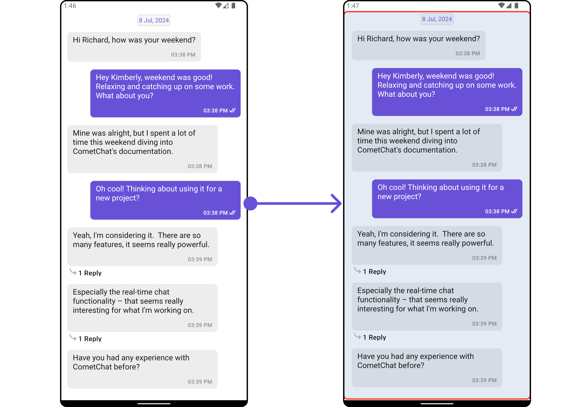

</TabItem>

<TabItem value="iOS" label="iOS">

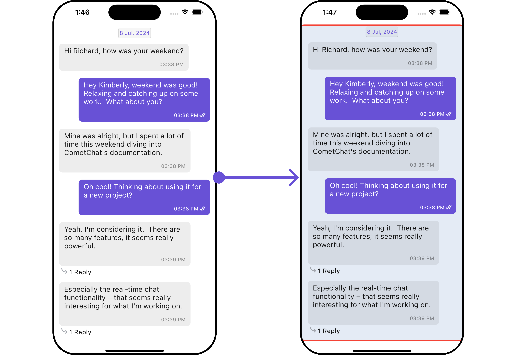

</TabItem>

</Tabs>

List of properties exposed by `CometChatMessageList`

| **Property**          | **Description**                         | **Code**                     |
| --------------------- | --------------------------------------- | ---------------------------- |
| **Background**        | Background inherited from BaseStyles    | `background`                 |
| **Border**            | Border inherited from BaseStyles        | `border`                     |
| **Border Radius**     | Border radius inherited from BaseStyles | `borderRadius`               |
| **Content Padding**   | Padding inside the content area         | `contentPadding`             |
| **Empty Text Style**  | Text style for the empty state message  | `emptyTextStyle: TextStyle?` |
| **Error Text Style**  | Text style for the error state message  | `errorTextStyle: TextStyle?` |
| **Gradient**          | Gradient inherited from BaseStyles      | `gradient`                   |
| **Height**            | Height inherited from BaseStyles        | `height`                     |
| **Loading Icon Tint** | Tint color for the loading icon         | `loadingIconTint: Color?`    |
| **Width**             | Width inherited from BaseStyles         | `width`                      |

---

##### 2. Avatar Style

To apply customized styles to the `Avatar` widget in the `CometChatGroups` widget, you can use the following code snippet. For further insights on `Avatar` Styles [refer](/ui-kit/flutter/avatar)

<Tabs>

<TabItem value="Dart" label="Dart">

```dart
CometChatMessageList(
  user: user, // A user or group object is required to launch this widget.
  avatarStyle: AvatarStyle(
      border: Border.all(width: 5),
      borderRadius: 20,
      background: Colors.red
  ),
)
```

</TabItem>

</Tabs>

---

### Functionality

These are a set of small functional customizations that allow you to fine-tune the overall experience of the widget. With these, you can change text, set custom icons, and toggle the visibility of UI elements.

<Tabs>

<TabItem value="Android" label="Android">

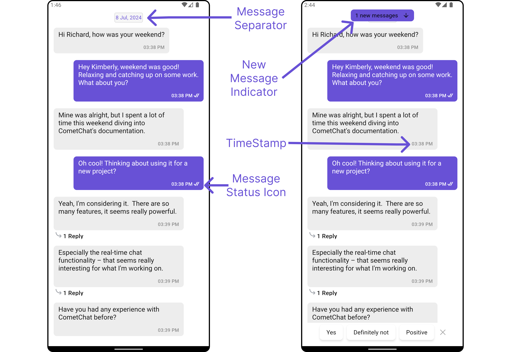

</TabItem>

<TabItem value="iOS" label="iOS">

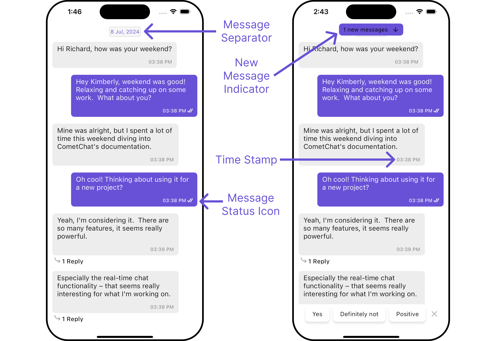

</TabItem>

</Tabs>

<Tabs>

<TabItem value="Dart" label="Dart">

```dart
CometChatMessageList(
  user: user, // A user or group object is required to launch this widget.
  readIcon: Icon(Icons.mark_chat_read, color: Colors.white),
)
```

</TabItem>

</Tabs>

<Tabs>

<TabItem value="Android" label="Android">

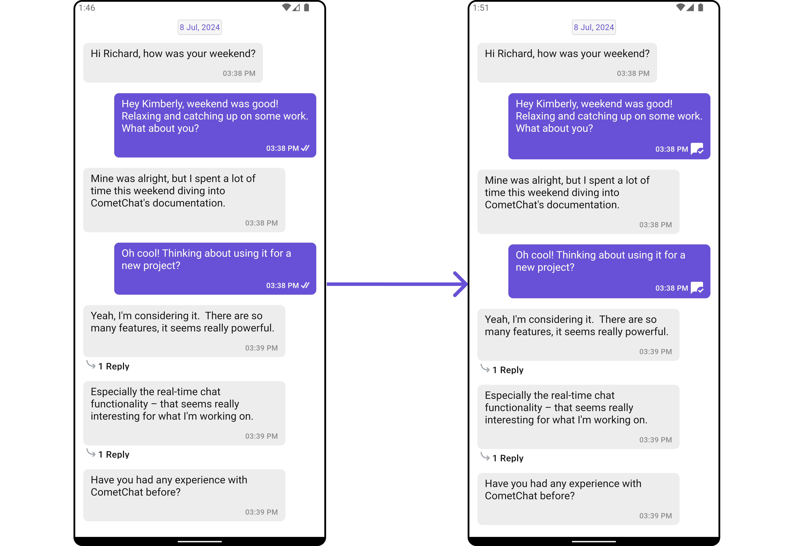

</TabItem>

<TabItem value="iOS" label="iOS">

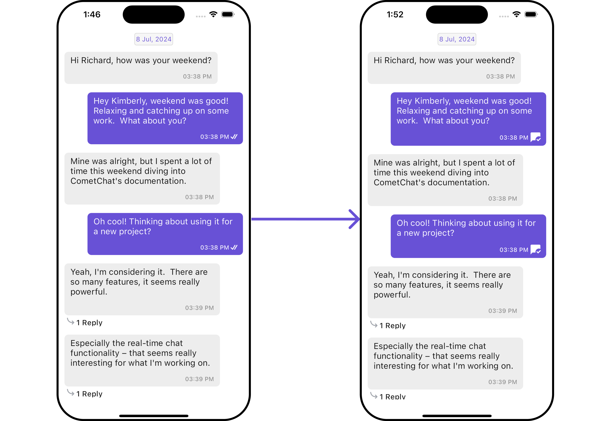

</TabItem>

</Tabs>

Below is a list of customizations along with corresponding code snippets

| **Property**                         | **Description**                                         | **Code**                            |
| ------------------------------------ | ------------------------------------------------------- | ----------------------------------- |
| **Add Reaction Icon**                | Icon for adding reactions                               | `addReactionIcon`                   |
| **Add Reaction Icon Tap**            | Callback for when the add reaction icon is tapped       | `addReactionIconTap`                |
| **Alignment**                        | Alignment for chat messages, default is standard        | `alignment: ChatAlignment`          |
| **Custom Sound For Message Package** | Custom sound package for messages                       | `customSoundForMessagePackage`      |
| **Custom Sound For Messages**        | Custom sound for messages                               | `customSoundForMessages`            |
| **Date Pattern**                     | Date pattern to be used                                 | `datePattern`                       |
| **Date Separator Pattern**           | Date separator pattern to be used                       | `dateSeparatorPattern`              |
| **Delivered Icon**                   | Icon indicating message delivery                        | `deliveredIcon`                     |
| **Disable Mentions**                 | Whether mentions are disabled                           | `disableMentions`                   |
| **Disable Reactions**                | Whether reactions are disabled                          | `disableReactions`                  |
| **Disable Sound For Messages**       | Whether sound for messages is disabled                  | `disableSoundForMessages`           |
| **Empty State Text**                 | Text to be displayed in empty state                     | `emptyStateText`                    |
| **Error State Text**                 | Text to be displayed in error state                     | `errorStateText`                    |
| **Favorite Reactions**               | List of favorite reactions                              | `favoriteReactions`                 |
| **Group**                            | Group object to be displayed                            | `group`                             |
| **Hide Error**                       | Whether error messages are hidden                       | `hideError`                         |
| **Hide Receipt**                     | Used to toggle visibility of message receipts           | `hideReceipt`                       |
| **Hide Timestamp**                   | Whether message timestamps are hidden                   | `hideTimestamp`                     |
| **New Message Indicator Text**       | Text for the new message indicator                      | `newMessageIndicatorText`           |
| **Read Icon**                        | Icon indicating message read                            | `readIcon`                          |
| **Scroll To Bottom On New Messages** | Whether to scroll to bottom on receiving new messages   | `scrollToBottomOnNewMessages`       |
| **Sent Icon**                        | Icon indicating message sent                            | `sentIcon`                          |
| **Show Avatar**                      | Whether to show avatar, default is true                 | `showAvatar: bool`                  |
| **Theme**                            | Theme to be applied                                     | `theme`                             |
| **Timestamp Alignment**              | Alignment for the message timestamps, default is bottom | `timestampAlignment: TimeAlignment` |
| **User**                             | User object to be displayed                             | `user`                              |
| **Wait Icon**                        | Icon indicating waiting state                           | `waitIcon`                          |

---

### Advance

For advanced-level customization, you can set custom views to the widget. This lets you tailor each aspect of the widget to fit your exact needs and application aesthetics. You can create and define your own widget and then incorporate those into the widget.

#### Template

[CometChatMessageTemplate](./04-message-template.md) is a pre-defined structure for creating message views that can be used as a starting point or blueprint for creating message views often known as message bubbles. For more information, you can refer to [CometChatMessageTemplate](./04-message-template.md).

You can set message Templates to MessageList by using the following code snippet

<Tabs>

<TabItem value="Dart" label="Dart">

```dart
CometChatMessageList(
  user: user, // A user or group object is required to launch this widget.
  templates: Placeholder(); // Replace this placeholder with your custom widget.
)
```

</TabItem>

</Tabs>

**Example**

Here is the complete example for reference:

<Tabs>

<TabItem value="Dart" label="Dart">

```dart title="getTemplate()"
List<CometChatMessageTemplate> getTemplate() {
  // Creating a text template
  CometChatMessageTemplate textTemplate = ChatConfigurator.getDataSource().getTextMessageTemplate(cometChatTheme);
  textTemplate.contentView = (BaseMessage baseMessage, BuildContext buildContext, BubbleAlignment alignment, {AdditionalConfigurations? additionalConfigurations}) {
    return Padding(
      padding: const EdgeInsets.all(8.0),
      child: Text(
        (baseMessage as TextMessage).text,
        style: TextStyle(
          color: alignment == BubbleAlignment.left ? Colors.deepPurple : Colors.yellow,
          fontSize: 14,
          fontWeight: FontWeight.bold,
          fontFamily: "PlaywritePL"
        ),
      ),
    );
  };

  // Creating an audio template
  CometChatMessageTemplate audioTemplate = ChatConfigurator.getDataSource().getAudioMessageTemplate(cometChatTheme);

  // Creating a custom message template
  CometChatMessageTemplate customMessageTemplate = CometChatMessageTemplate(
    type: 'custom_template',
    category: 'custom_category',
    bubbleView: (message, context, alignment) => const Text('this is a custom message template'),
  );

  // custom list of templates
  List<CometChatMessageTemplate> messageTypes = [
    textTemplate,
    audioTemplate,
    customMessageTemplate
  ];

  return messageTypes;
}
```

</TabItem>

</Tabs>

<Tabs>

<TabItem value="Dart" label="Dart">

```dart
CometChatMessageList(
  user: user, // A user or group object is required to launch this widget.
  templates: getTemplate(),
)
```

</TabItem>

</Tabs>

<Tabs>

<TabItem value="Android" label="Android">

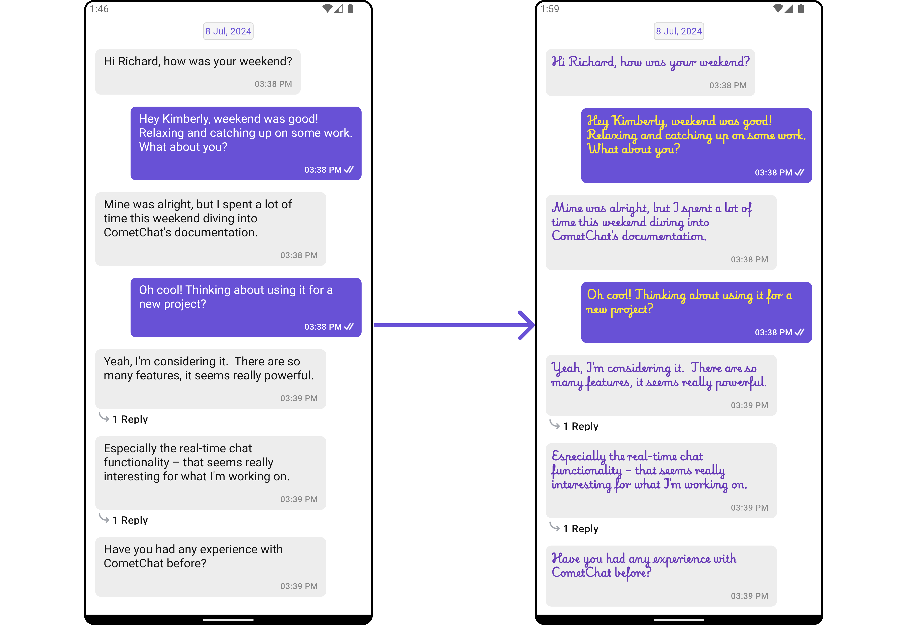

</TabItem>

<TabItem value="iOS" label="iOS">

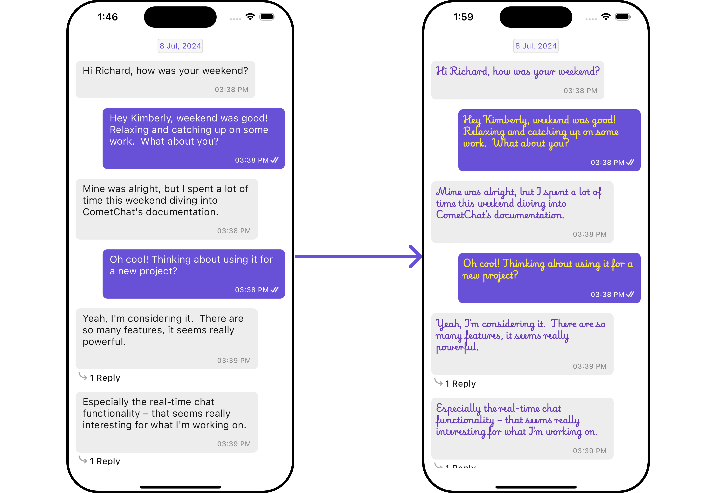

</TabItem>

</Tabs>

---

#### DateSeparatorPattern

You can modify the date pattern of the message list date separator to your requirement using `setDateSeparatorPattern()`. This method accepts a function with a return type String. Inside the function, you can create your own pattern and return it as a String.

<Tabs>

<TabItem value="Dart" label="Dart">

```dart
CometChatMessageList(
  user: user, // A user or group object is required to launch this widget.
  dateSeparatorPattern: (DateTime dateTime) {
    return ""; //Replace this empty string with your custom date time pattern.
  },
)
```

</TabItem>

</Tabs>

**Example**

Here is the complete example for reference:

<Tabs>

<TabItem value="Dart" label="Dart">

```dart
CometChatMessageList(
  user: user, // A user or group object is required to launch this widget.
  dateSeparatorPattern: (DateTime dateTime) {
    return DateFormat("dd/MM/yyyy").format(dateTime);
  },
)
```

</TabItem>

</Tabs>

<Tabs>

<TabItem value="Android" label="Android">

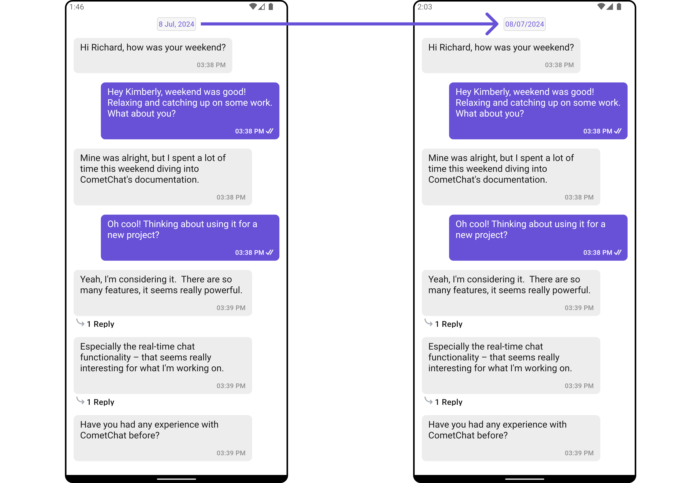

</TabItem>

<TabItem value="iOS" label="iOS">

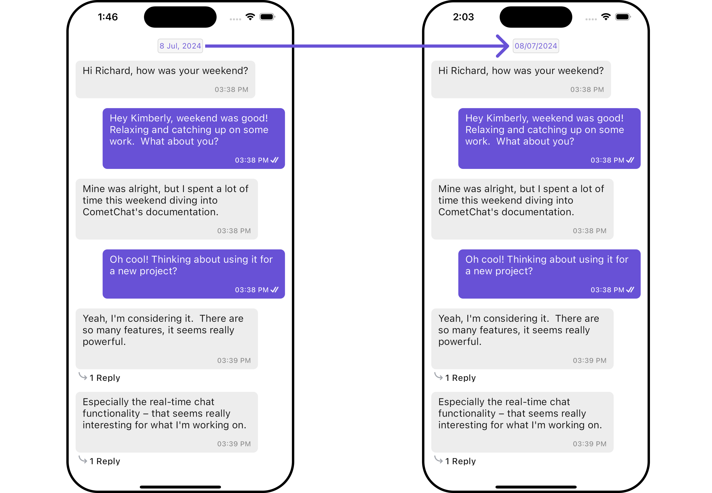

</TabItem>

</Tabs>

---

#### SetDatePattern

You can modify the date pattern to your requirement using .setDatePattern. This method accepts a function with a return type String. Inside the function, you can create your own pattern and return it as a String.

<Tabs>

<TabItem value="Dart" label="Dart">

```dart
CometChatMessageList(
  user: user, // A user or group object is required to launch this widget.
  datePattern: (message) {
    return DateFormat('YOUR_PATTERN').format(message.sentAt!);
  },
)
```

</TabItem>

</Tabs>

**Example**

Here is the complete example for reference:

<Tabs>

<TabItem value="Dart" label="Dart">

```dart
CometChatMessageList(
  user: user, // A user or group object is required to launch this widget.
  datePattern: (message) {
    return DateFormat('EEE, M/d/y').format(message.sentAt!);
  },
)
```

</TabItem>

</Tabs>

<Tabs>

<TabItem value="Android" label="Android">

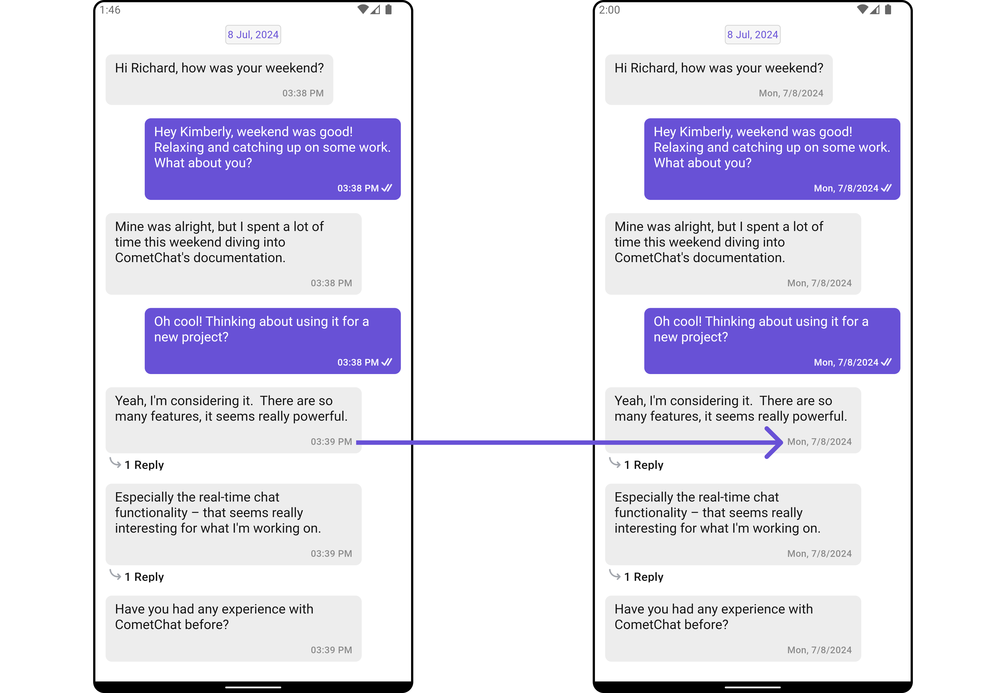

</TabItem>

<TabItem value="iOS" label="iOS">

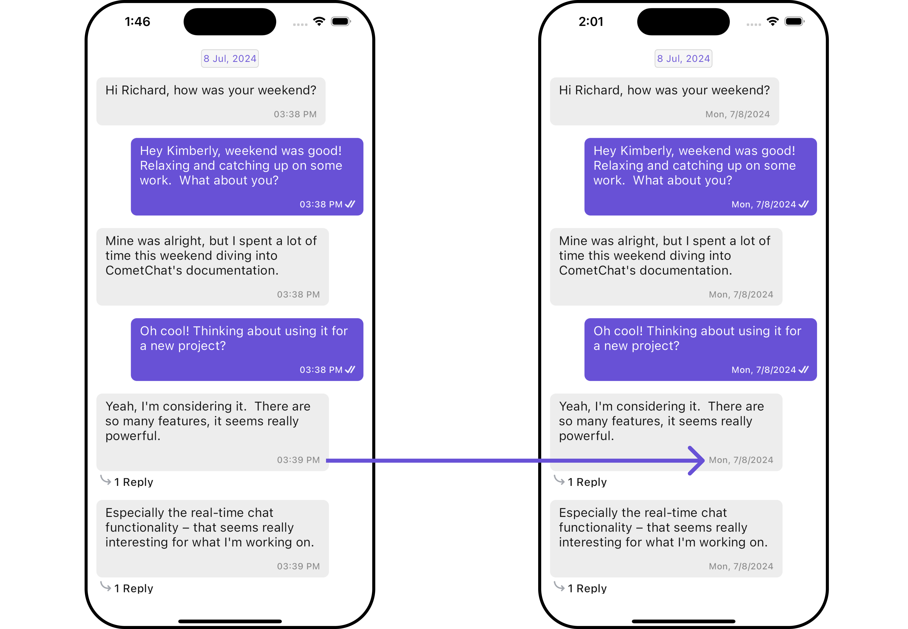

</TabItem>

</Tabs>

---

#### ErrorStateView

You can set a custom `ErrorStateView` using `errorStateView` to match the error UI of your app.

<Tabs>

<TabItem value="Dart" label="Dart">

```dart title="widget"
CometChatMessageList(
  user: user, // A user or group object is required to launch this widget.
  errorStateView: (context) {
    return Placeholder(); // Replace this placeholder with your custom widget.
  },
)
```

</TabItem>

</Tabs>

Here is the complete example for reference:

**Example**

<Tabs>

<TabItem value="Dart" label="Dart">

```dart
CometChatMessageList(
  user: user, // A user or group object is required to launch this widget.
  errorStateView: (context) {
    return Container(
      width: MediaQuery.of(context).size.width,
      child: Center(
        child: const Column(
          crossAxisAlignment: CrossAxisAlignment.center,
          mainAxisAlignment: MainAxisAlignment.center,
          children: [
            Spacer(),
            Icon(Icons.error_outline, color: Colors.red, size: 100,),
            SizedBox(height: 20,),
            Text("Your Custom Error Message"),
            Spacer(),
          ],
        ),
      ),
    );
  },
)
```

</TabItem>

</Tabs>

<Tabs>

<TabItem value="Android" label="Android">

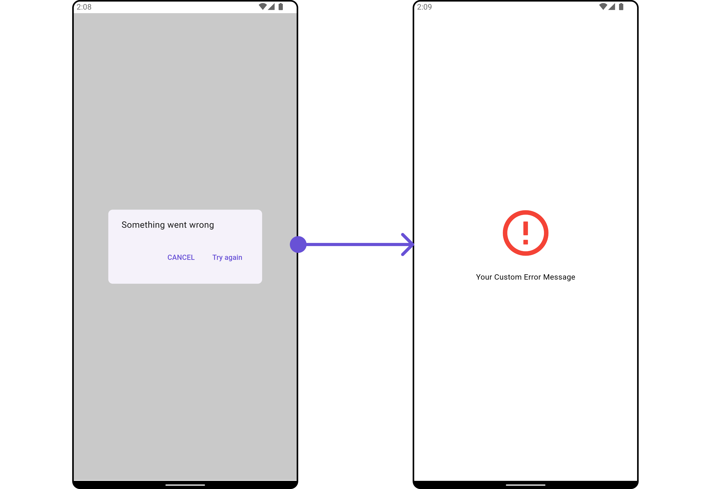

</TabItem>

<TabItem value="iOS" label="iOS">

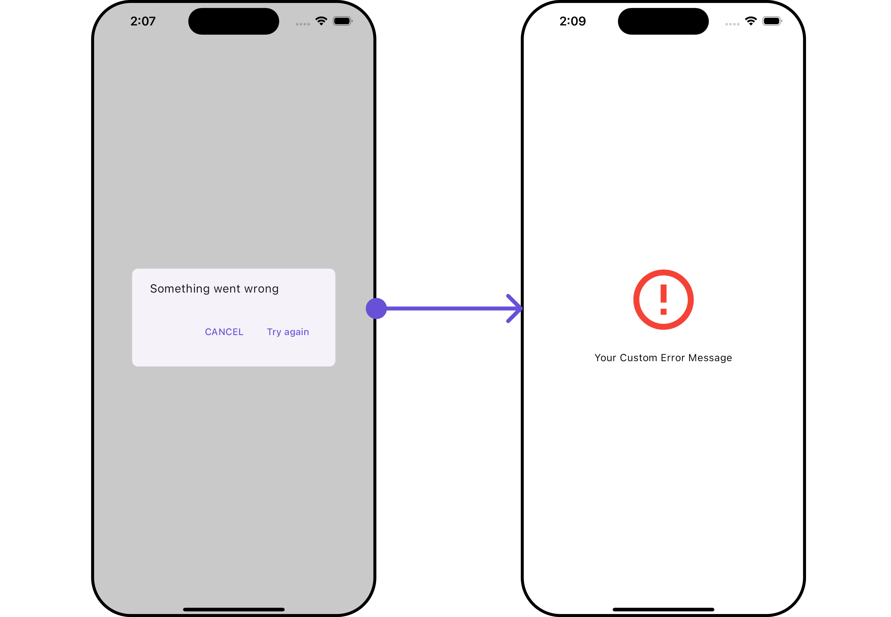

</TabItem>

</Tabs>

---

#### LoadingStateView

You can set a custom loader widget using `loadingStateView` to match the loading UI of your app.

<Tabs>

<TabItem value="Dart" label="Dart">

```dart title="widget"
CometChatMessageList(
  user: user, // A user or group object is required to launch this widget.
  loadingStateView: (context) {
    return Placeholder(); // Replace this placeholder with your custom widget.
  },
)
```

</TabItem>

</Tabs>

Here is the complete example for reference:

**Example**

<Tabs>

<TabItem value="Dart" label="Dart">

```dart title="main.dart"
CometChatMessageList(
  user: user, // A user or group object is required to launch this widget.
  loadingStateView: (context) {
    return Container(
      width: MediaQuery.of(context).size.width,
      child: Center(
          child: CircularProgressIndicator()
      ),
    ); // Replaced the placeholder with a custom widget.
  },
)
```

</TabItem>

</Tabs>

<Tabs>

<TabItem value="Android" label="Android">

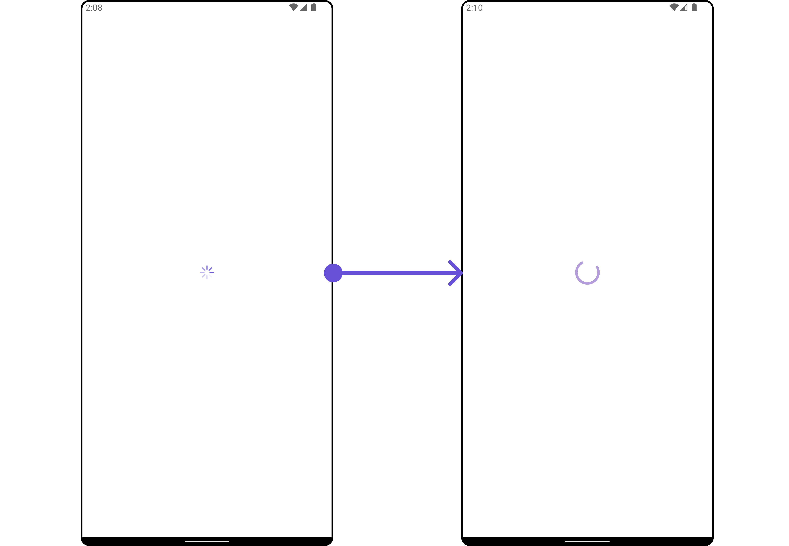

</TabItem>

<TabItem value="iOS" label="iOS">

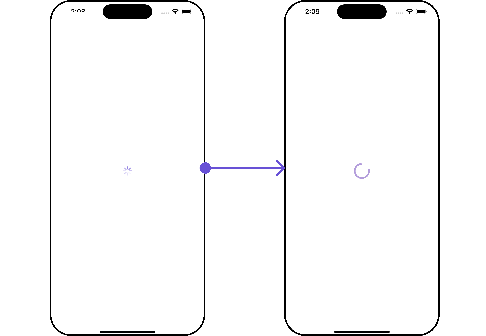

</TabItem>

</Tabs>

---

#### EmptyStateView

You can set a custom `EmptyStateView` using `emptyStateView` to match the error widget of your app.

<Tabs>

<TabItem value="Dart" label="Dart">

```dart title="widget"
CometChatMessageList(
  user: user, // A user or group object is required to launch this widget.
  emptyStateView: (context) {
    return Placeholder(); // Replace this placeholder with your custom widget.
  },
)
```

</TabItem>

</Tabs>

Here is the complete example for reference:

**Example**

<Tabs>

<TabItem value="Dart" label="Dart">

```dart title="main.dart"
CometChatMessageList(
  user: user, // A user or group object is required to launch this widget.
  emptyStateView: (context) {
    return Container(
      width: MediaQuery.of(context).size.width,
      child: Center(
          child: const Column(
            crossAxisAlignment: CrossAxisAlignment.center,
            mainAxisAlignment: MainAxisAlignment.center,
            children: [
              Spacer(),
              Icon(Icons.sms_failed_outlined, color: Colors.red, size: 100,),
              SizedBox(height: 20,),
              Text("Your Custom Message"),
              Spacer(),
            ],
          )
      ),
    ); // Replaced the placeholder with a custom widget.
  },
)
```

</TabItem>

</Tabs>

<!-- <Tabs>

<TabItem value="Android" label="Android">


</TabItem>

</Tabs> -->

---

#### TextFormatters

Assigns the list of text formatters. If the provided list is not null, it sets the list. Otherwise, it assigns the default text formatters retrieved from the data source. To configure the existing Mentions look and feel check out [MentionsFormatter Guide](/ui-kit/flutter/mentions-formatter-guide)

Here is the complete example for reference:

<Tabs>

<TabItem value="Dart" label="Dart">

```dart
CometChatMessageList(
  user: user, // A user or group object is required to launch this widget.
  textFormatters: [
    CometChatMentionsFormatter(
      messageBubbleTextStyle: (theme, alignment,{forConversation = false}) =>
          TextStyle(
              color: alignment==BubbleAlignment.left? Colors.orange : Colors.pink,
              fontSize: 14,
              fontWeight: FontWeight.bold
          ),
    )
  ],
)
```

</TabItem>

</Tabs>

<Tabs>

<TabItem value="Android" label="Android">

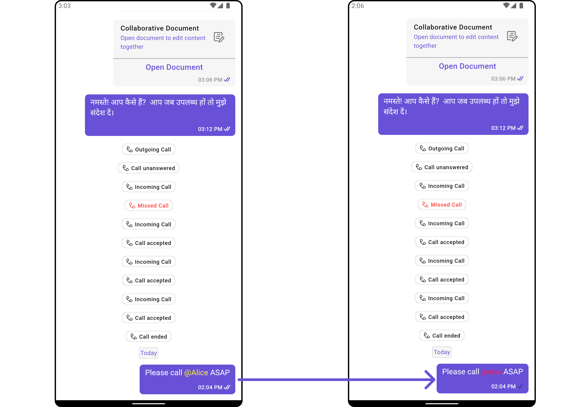

</TabItem>

<TabItem value="iOS" label="iOS">

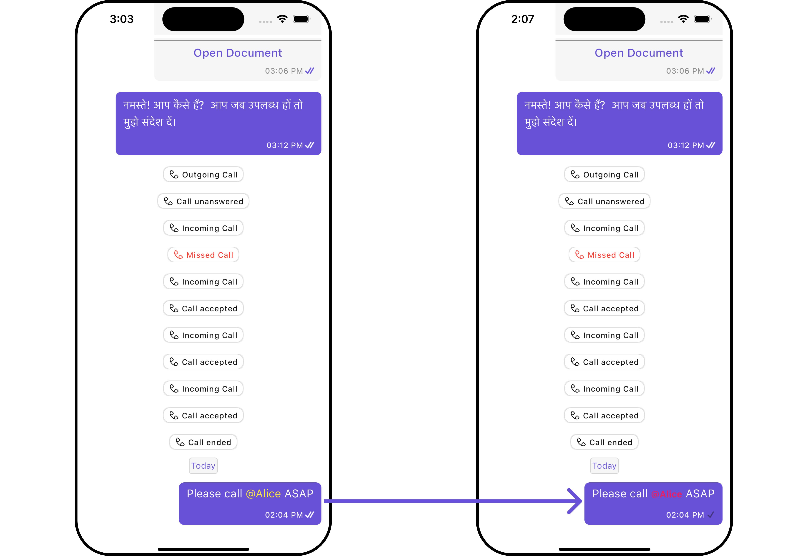

</TabItem>

</Tabs>

---

## Configuration

[Configurations](/ui-kit/flutter/components-overview#configurations) offer the ability to customize the properties of each widget within a Composite Widget.

### MessageInformation

From the MessageList, you can navigate to the [MesssageInformation](/ui-kit/flutter/message-information) widget as shown in the image.

If you wish to modify the properties of the [MesssageInformation](/ui-kit/flutter/message-information) Widget, you can use the `MessageInformationConfiguration` object.

<Tabs>

<TabItem value="Dart" label="Dart">

```dart
CometChatMessageList(
    user: user, // A user or group object is required to launch this widget.
    messageInformationConfiguration: MessageInformationConfiguration()
)
```

</TabItem>

</Tabs>

Example

<Tabs>

<TabItem value="Dart" label="Dart">

```dart
CometChatMessageList(
    user: user, // A user or group object is required to launch this widget.
    messageInformationConfiguration: MessageInformationConfiguration(
        title: "Your Custom Title",
        messageInformationStyle: MessageInformationStyle(
          background: Color(0xFFE4EBF5),
          border: Border.all(width: 1, color: Colors.red),
          titleStyle: TextStyle(color: Colors.red, fontFamily: "PlaywritePL"),
        )
    )
)
```

</TabItem>

</Tabs>

<Tabs>

<TabItem value="Android" label="Android">

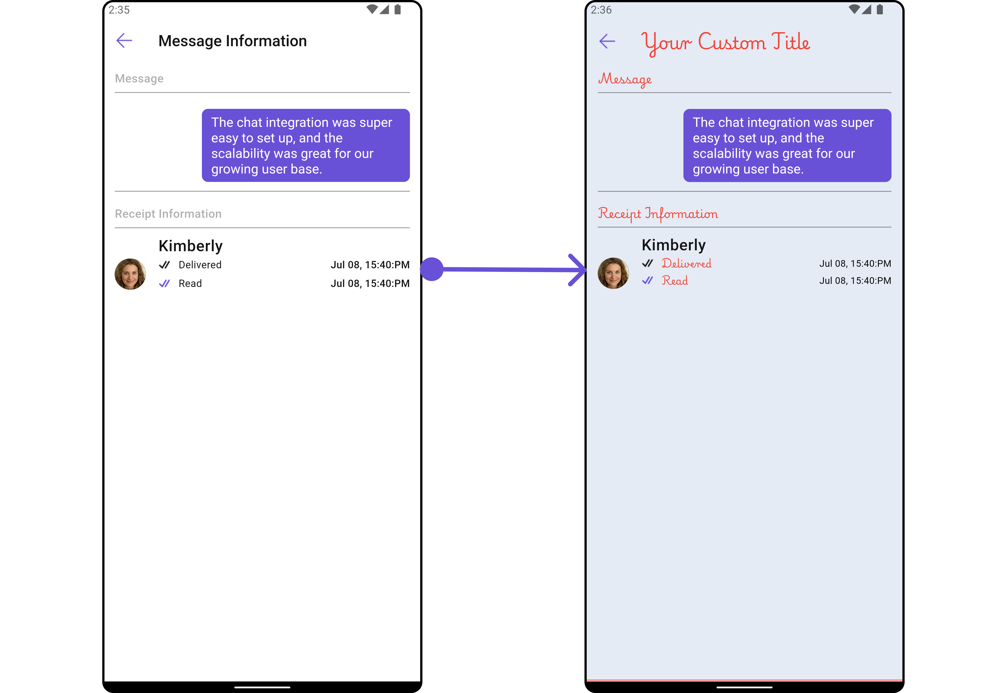

</TabItem>

<TabItem value="iOS" label="iOS">

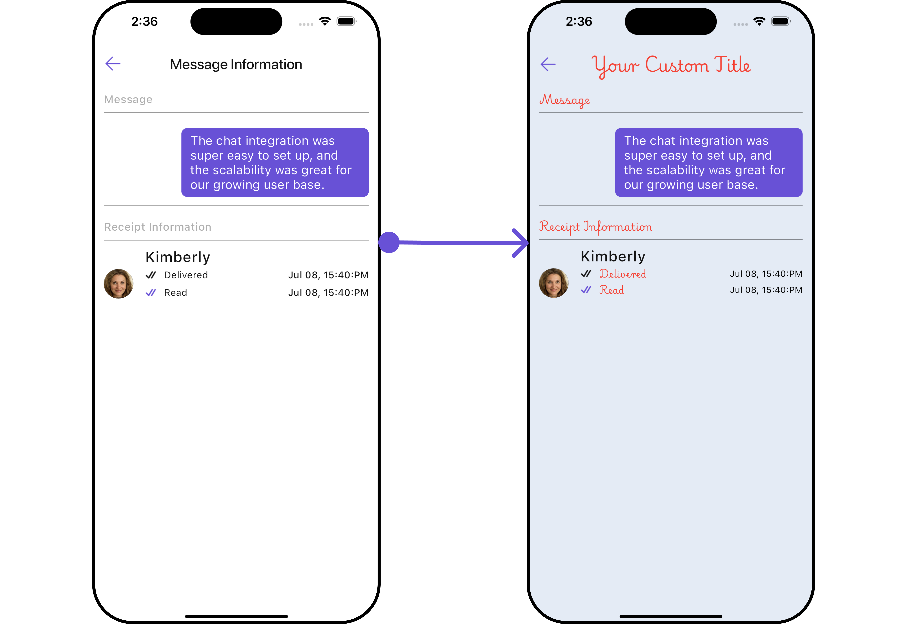

</TabItem>

</Tabs>

---
