import Tabs from '@theme/Tabs';
import TabItem from '@theme/TabItem';
import { Tooltip } from 'react-tooltip'
import 'react-tooltip/dist/react-tooltip.css'

<Tooltip id="my-tooltip-html-prop" html="Not available in Group Members Configuration object"/>

## Overview

A MessageTemplate provides you with the capability to define and customize both the structure and the behavior of the [MessageBubble](/ui-kit/flutter/message-bubble). It acts as a schema or design blueprint for the creation of a variety of [MessageBubble](/ui-kit/flutter/message-bubble) widgets, allowing you to manage the appearance and interactions of [MessageBubble](/ui-kit/flutter/message-bubble) within your application effectively and consistently.

### Structure


The MessageBubble structure can typically be broken down into the following widgets:

1. **Leading widget**: This is where the sender's avatar is displayed. It's typically on the left of the MessageBubble for messages from others and on the right for messages from the current user.

2. **Header widget**: This displays the sender's name and is especially useful in group chats where multiple users are sending messages.

3. **Content widget**: This is the core of the MessageBubble where the message content (text, images, videos, etc.) is displayed.

4. **Bottom widget**: This widget can be used to extend the MessageBubble with additional elements, such as link previews or a 'load more' button for long messages. It's typically placed beneath the Content widget.

5. **Footer widget**: This is where the timestamp of the message and its delivery or read status are displayed. It's located at the bottom of the MessageBubble.

### Properties

MessageTemplate provides you with methods that allow you to alter various properties of the MessageBubble. These properties include aspects such as the `type` and `category` of a message, the appearance and behavior of the header, content, and footer sections of the message bubble,

1. **Type**

    Using `type` you can set the type of CometChatMessage, This will map your MessageTemplate to the corresponding CometChatMessage. You can set the MessageTemplate Type using the following code snippet.

    <Tabs>

    <TabItem value="Dart" label="Dart">

    ```dart
    CometChatMessageTemplate cometChatMessageTemplate = CometChatMessageTemplate(type: MessageTypeConstants.text);
    ```

    </TabItem>

    </Tabs>

2. **Category**

    Using `category` you can set the category of a MessageTemplate. This will create a MessageTemplate with the specified category and link it with a CometChatMessage of the same category.

    Please refer to our guide on [Message Categories](/sdk/flutter/message-structure-and-hierarchy) for a deeper understanding of message categories.

    <Tabs>

    <TabItem value="Dart" label="Dart">

    ```dart
    CometChatMessageTemplate cometChatMessageTemplate = CometChatMessageTemplate(category: MessageCategoryConstants.custom);
    ```

    </TabItem>

    </Tabs>

3. **Header Widget**

    The. `headerView` method allows you to assign a custom header widget to the MessageBubble. By default, it is configured to display the sender's name.

    <Tabs>

    <TabItem value="Dart" label="Dart">

    ```dart
    cometChatMessageTemplate.headerView = (BaseMessage baseMessage, BuildContext buildContext, BubbleAlignment alignment) {
        return const Placeholder();
    };
    ```

    </TabItem>

    </Tabs>

4. **Content Widget**

    The `contentView` method allows you to assign a custom content widget to the MessageBubble. By default, it displays the [Text Bubble](/ui-kit/flutter/text-bubble), [Image Bubble](/ui-kit/flutter/image-bubble), [File Bubble](/ui-kit/flutter/file-bubble), [Audio Bubble](/ui-kit/flutter/audio-bubble), or [Video Bubble](/ui-kit/flutter/video-bubble), depending on the message type.

    <Tabs>

    <TabItem value="Dart" label="Dart">

    ```dart
    cometChatMessageTemplate.contentView = (BaseMessage baseMessage, BuildContext buildContext, BubbleAlignment alignment, {AdditionalConfigurations? additionalConfigurations}) {
        return const Placeholder();
    };
    ```

    </TabItem>

    </Tabs>
   
5. **Footer Widget**

    The `footerView` method allows you to assign a custom Footer widget to the MessageBubble. By default, it displays the receipt and timestamp.

    <Tabs>

    <TabItem value="Dart" label="Dart">

    ```dart
    cometChatMessageTemplate.footerView = (BaseMessage baseMessage, BuildContext buildContext, BubbleAlignment alignment) {
        return const Placeholder();
    };
    ```

    </TabItem>

    </Tabs>

6. **Bottom Widget**

    The `bottomView` method allows you to assign a custom Bottom widget to the MessageBubble.By defuault is has buttons such as link previews or a 'load more' button for long messages.

    <Tabs>

    <TabItem value="Dart" label="Dart">

    ```dart
    cometChatMessageTemplate.bottomView = (BaseMessage baseMessage, BuildContext buildContext, BubbleAlignment alignment) {
        return const Placeholder();
    };
    ```

    </TabItem>

    </Tabs>

7. **Bubble Widget**

    The `bubbleView` method allows you to assign a custom Bubble widget to the MessageBubble. By default, headerView, contentView, and footerView together form a message bubble.

    <Tabs>

    <TabItem value="Dart" label="Dart">

    ```dart
    cometChatMessageTemplate.bubbleView = (BaseMessage baseMessage, BuildContext buildContext, BubbleAlignment alignment) {
        return const Placeholder();
    };
    ```

    </TabItem>

    </Tabs>

8. **Options**

    The `options` lets you set the list of actions that a user can perform on a message. This includes actions like reacting to, editing, or deleting a message.

    <Tabs>

    <TabItem value="Dart" label="Dart">

    ```dart
    cometChatMessageTemplate.options = (User loggedInUser, BaseMessage messageObject, BuildContext context, Group? group) {
        return <CometChatMessageOption>[];
    };
    ```

    </TabItem>

    </Tabs>

## Customization

Let's dive into how you can use the [properties](#properties) of MessageTemplate to customize an existing template or add a new one to the [MessageList](/ui-kit/flutter/message-list) Widget.

#### Header widget

The `headerView` method of MessageTemplate allows you to add custom widgets to the header of your message bubbles.

Here is the complete example for reference:

<Tabs>

<TabItem value="Dart" label="Dart">

```dart
CometChatMessages(
  group: group, // Group object
  messageListConfiguration: MessageListConfiguration(
    templates: [
      CometChatMessageTemplate(
        type: MessageTypeConstants.text, // Define the template type 
        category: MessageCategoryConstants.message, // Define the template category
        headerView: (BaseMessage baseMessage, BuildContext buildContext, BubbleAlignment alignment) {
          return const Text("You_Header_Widget"); // Replace this placeholder Widget with your custom Widget
        },
      ),
    ],
  ),
)
```

</TabItem>

</Tabs>

<Tabs>

<TabItem value="Android" label="Android">

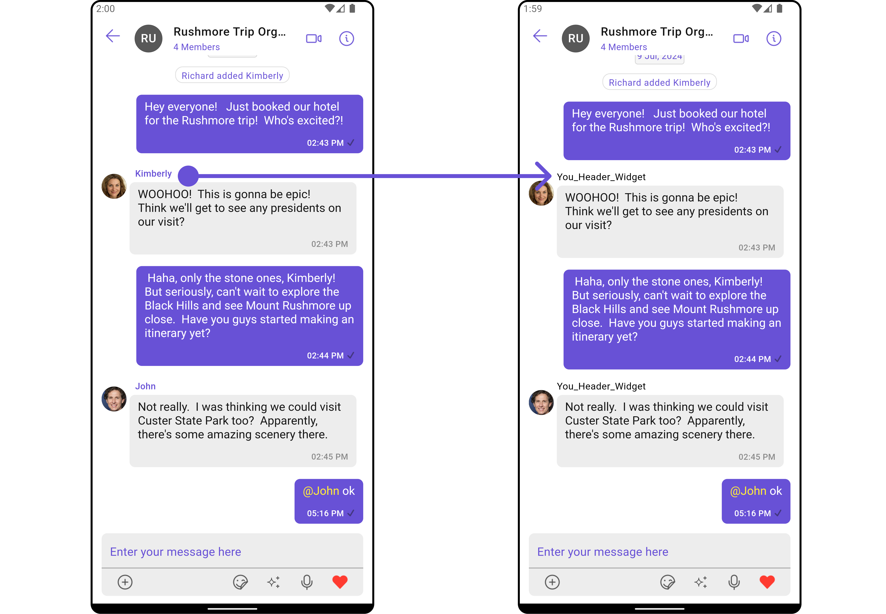

</TabItem>

<TabItem value="iOS" label="iOS">

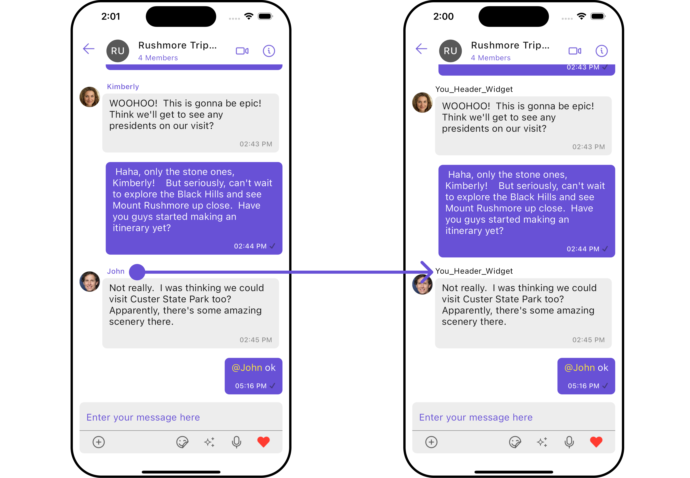

</TabItem>

</Tabs>

---

#### Content widget

The `contentView` method of MessageTemplate allows you to add a custom widget to the content of your message bubbles.

Here is the complete example for reference:

<Tabs>

<TabItem value="Dart" label="Dart">

```dart
CometChatMessages(
  group: group, // Group object
  messageListConfiguration: MessageListConfiguration(
    templates: [
      CometChatMessageTemplate(
        type: MessageTypeConstants.text, // Define the template type
        category: MessageCategoryConstants.message, // Define the template category
        contentView: (BaseMessage baseMessage, BuildContext buildContext, BubbleAlignment alignment, {AdditionalConfigurations? additionalConfigurations}) {
          return Container(
            margin: EdgeInsets.all(10),
            decoration: BoxDecoration(
              color: Color(0xFFE4EBF5),
              borderRadius: BorderRadius.circular(10),
            ),
            child: Text((baseMessage as TextMessage).text),
          ); // Replace this placeholder Widget with your custom Widget
        },
      ),
    ],
  ),
)
```

</TabItem>

</Tabs>

<Tabs>

<TabItem value="Android" label="Android">

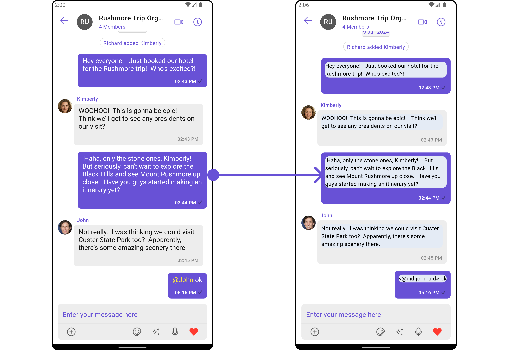

</TabItem>

<TabItem value="iOS" label="iOS">

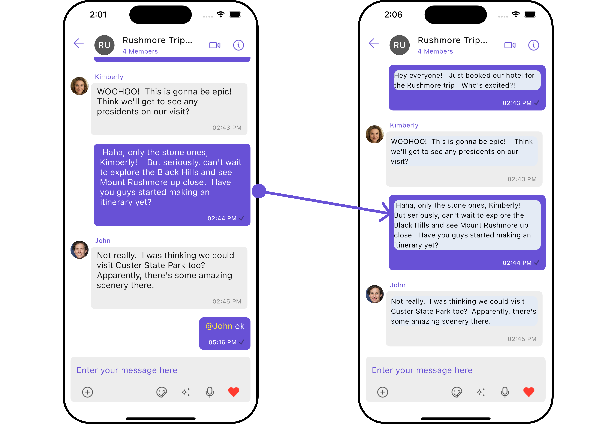

</TabItem>

</Tabs>

---

#### Bottom Widget

The `bottomView` method of MessageTemplate allows you to add a custom button widget to your message bubbles.

Here is the complete example for reference:

<Tabs>

<TabItem value="Dart" label="Dart">

```dart
CometChatMessages(
  group: group, // Group object
  messageListConfiguration: MessageListConfiguration(
    templates: [
      CometChatMessageTemplate(
        type: MessageTypeConstants.text, // Define the template type
        category: MessageCategoryConstants.message, // Define the template category
        bottomView: (BaseMessage baseMessage, BuildContext buildContext, BubbleAlignment alignment, {AdditionalConfigurations? additionalConfigurations}) {
          return Container(
            padding: const EdgeInsets.all(10),
            margin: const EdgeInsets.all(10),
            decoration: BoxDecoration(
              color: Colors.yellow,
              borderRadius: BorderRadius.circular(10),
            ),
            child: const Text("Your_Bottom_Widget"),
          ); // Replace this placeholder Widget with your custom Widget
        },
      ),
    ],
  ),
)
```

</TabItem>

</Tabs>

<Tabs>

<TabItem value="Android" label="Android">

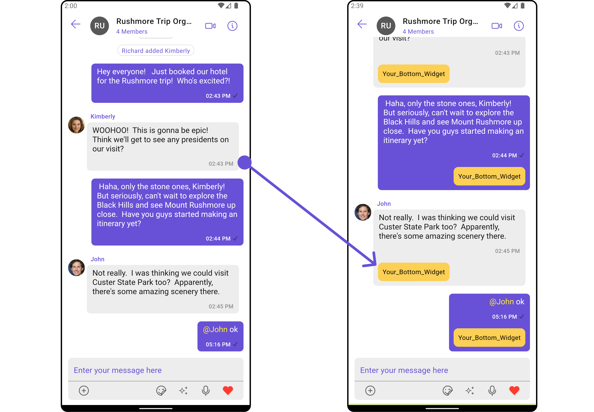

</TabItem>

<TabItem value="iOS" label="iOS">

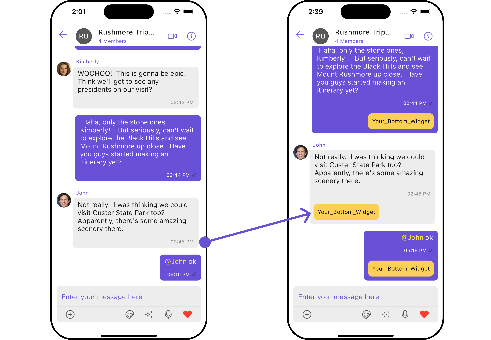

</TabItem>

</Tabs>

---

#### Footer Widget

The `footerView` method of MessageTemplate allows you to add a footer widget to your message bubbles. 

Here is the complete example for reference:

<Tabs>

<TabItem value="Dart" label="Dart">

```dart
CometChatMessages(
  group: group, // Group object
  messageListConfiguration: MessageListConfiguration(
    templates: [
      CometChatMessageTemplate(
        type: MessageTypeConstants.text, // Define the template type
        category: MessageCategoryConstants.message, // Define the template category
        footerView: (BaseMessage baseMessage, BuildContext buildContext, BubbleAlignment alignment, {AdditionalConfigurations? additionalConfigurations}) {
          return Container(
            padding: const EdgeInsets.all(10),
            margin: const EdgeInsets.all(10),
            decoration: BoxDecoration(
              color: Colors.yellow,
              borderRadius: BorderRadius.circular(10),
            ),
            child: const Text("Your_Bottom_Widget"),
          ); // Replace this placeholder Widget with your custom Widget
        },
      ),
    ],
  ),
)
```

</TabItem>

</Tabs>

<Tabs>

<TabItem value="Android" label="Android">

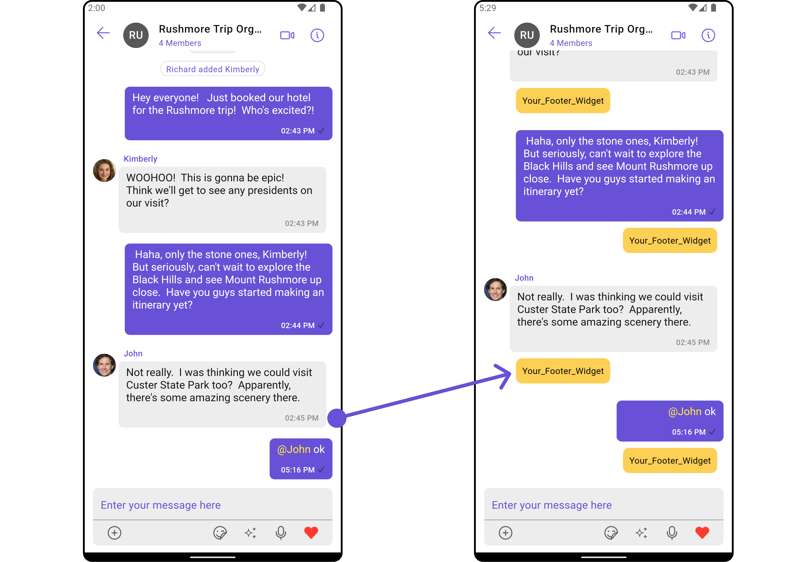

</TabItem>

<TabItem value="iOS" label="iOS">

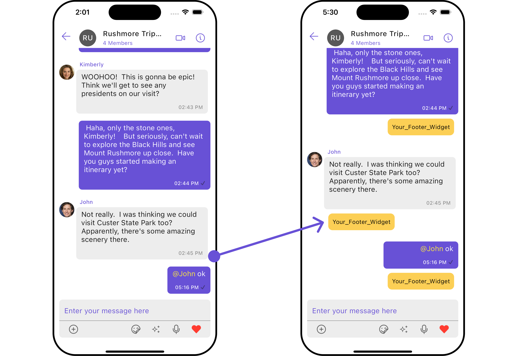

</TabItem>

</Tabs>

---

#### Bubble Widget

The `bubbleView` method of MessageTemplate allows you to add a bubble widget to your message bubbles.

Here is the complete example for reference:

<Tabs>

<TabItem value="Dart" label="Dart">

```dart
CometChatMessages(
  group: group, // Group object
  messageListConfiguration: MessageListConfiguration(
    templates: [
      CometChatMessageTemplate(
        type: MessageTypeConstants.text, // Define the template type
        category: MessageCategoryConstants.message, // Define the template category
        bubbleView: (BaseMessage baseMessage, BuildContext buildContext, BubbleAlignment alignment, {AdditionalConfigurations? additionalConfigurations}) {
          return Container(
            width: MediaQuery.of(context).size.width/1.2,
            padding: const EdgeInsets.all(10),
            margin: const EdgeInsets.only(top: 10, bottom: 10),
            decoration: BoxDecoration(
              color: Colors.yellow,
              borderRadius: BorderRadius.circular(10),
            ),
            child: Flexible(
                child: Text.rich(
                  TextSpan(
                    style: const TextStyle(
                      fontSize: 16,
                      color: Colors.black,
                    ),
                    children: <TextSpan>[
                      TextSpan(
                        text: (baseMessage as TextMessage).sender!.name,
                        style: const TextStyle(
                          fontWeight: FontWeight.bold,
                          color: Color(0xFF6851D6)
                        ),
                      ),
                      const TextSpan(text: ": "),
                      TextSpan(
                        text: (baseMessage).text,
                        style: const TextStyle(
                          fontSize: 16,
                          color: Colors.black,
                        ),
                      ),
                    ],
                  ),
                )
            )
          ); // Replace this placeholder Widget with your custom Widget
        },
      ),
    ],
  ),
)
```

</TabItem>

</Tabs>

<Tabs>

<TabItem value="Android" label="Android">

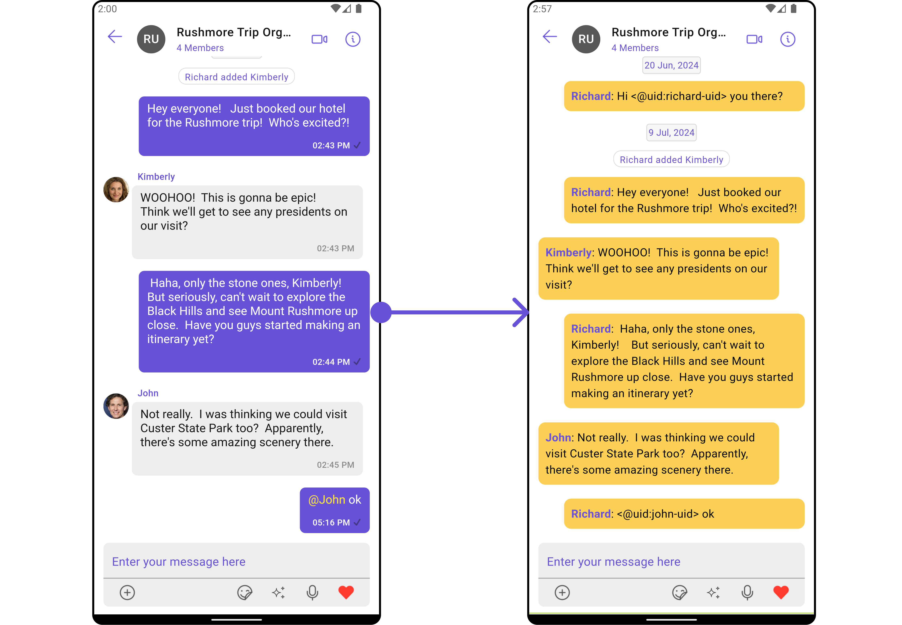

</TabItem>

<TabItem value="iOS" label="iOS">

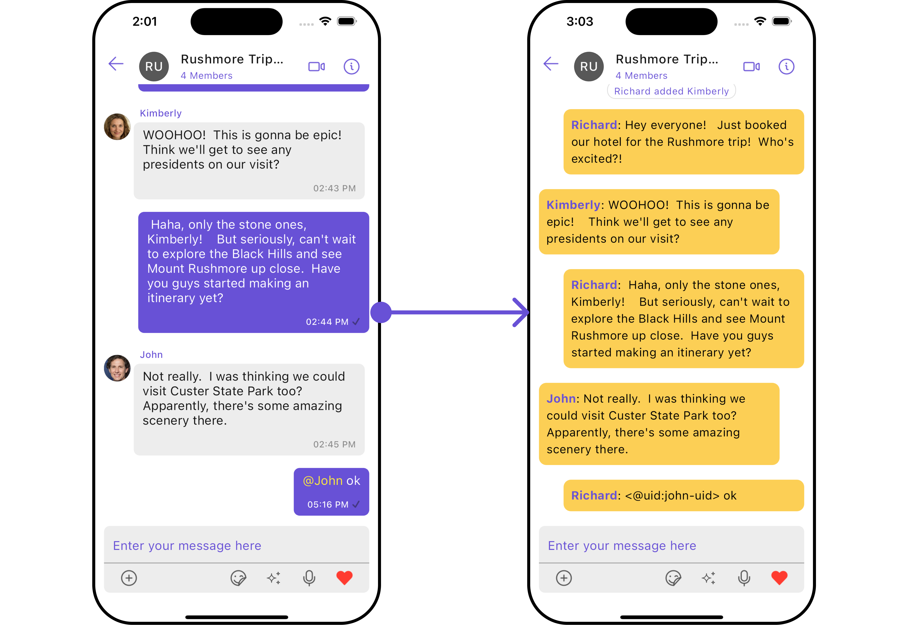

</TabItem>

</Tabs>

---

#### Options List

The `options` method in the MessageTemplate allows you to customize the options that appear in the action sheet when a message is long-pressed. By default, CometChat UI Kit provides a set of options like "Reply", "Forward", "Edit", and "Delete".

However, if you wish to override or modify these options, you can use the `options` method and pass a list of `CometChatMessageOption`. This list of options will replace the default set.

Here is the complete example for reference:

<Tabs>

<TabItem value="Dart" label="Dart">

```dart
CometChatMessages(
  group: group, // Group object
  messageListConfiguration: MessageListConfiguration(
    templates: [
      CometChatMessageTemplate(
        type: MessageTypeConstants.text, // Define the template type
        category: MessageCategoryConstants.message, // Define the template category
        options: (User loggedInUser, BaseMessage messageObject, BuildContext context, Group? group) {
          return <CometChatMessageOption>[
            CometChatMessageOption(
              id: 'opt1',
              title: "Option 1",
              icon: "assets/img/envelope.png",
              onClick: (BaseMessage message, CometChatMessageListControllerProtocol state) {
                // TODO("Not yet implemented")
              },
            ),
            CometChatMessageOption(
              id: 'opt1',
              title: "Option 2",
              icon: "assets/img/envelope.png",
              onClick: (BaseMessage message, CometChatMessageListControllerProtocol state) {
                // TODO("Not yet implemented")
              },
            ),
            CometChatMessageOption(
              id: 'opt1',
              title: "Option 3",
              icon: "assets/img/envelope.png",
              onClick: (BaseMessage message, CometChatMessageListControllerProtocol state) {
                // TODO("Not yet implemented")
              },
            ),
            CometChatMessageOption(
              id: 'opt1',
              title: "Option 4",
              icon: "assets/img/envelope.png",
              onClick: (BaseMessage message, CometChatMessageListControllerProtocol state) {
                // TODO("Not yet implemented")
              },
            ),
          ];
        },
      ),
    ],
  ),
)
```

</TabItem>

</Tabs>

<Tabs>

<TabItem value="Android" label="Android">

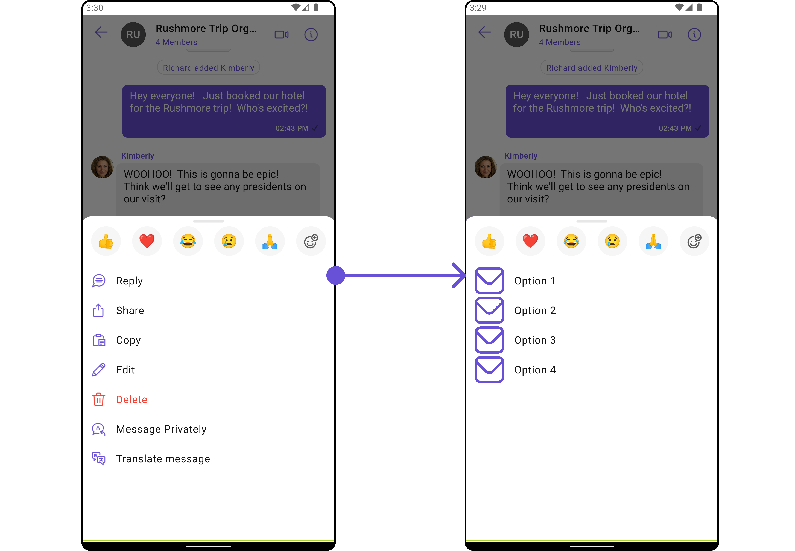

</TabItem>

<TabItem value="iOS" label="iOS">

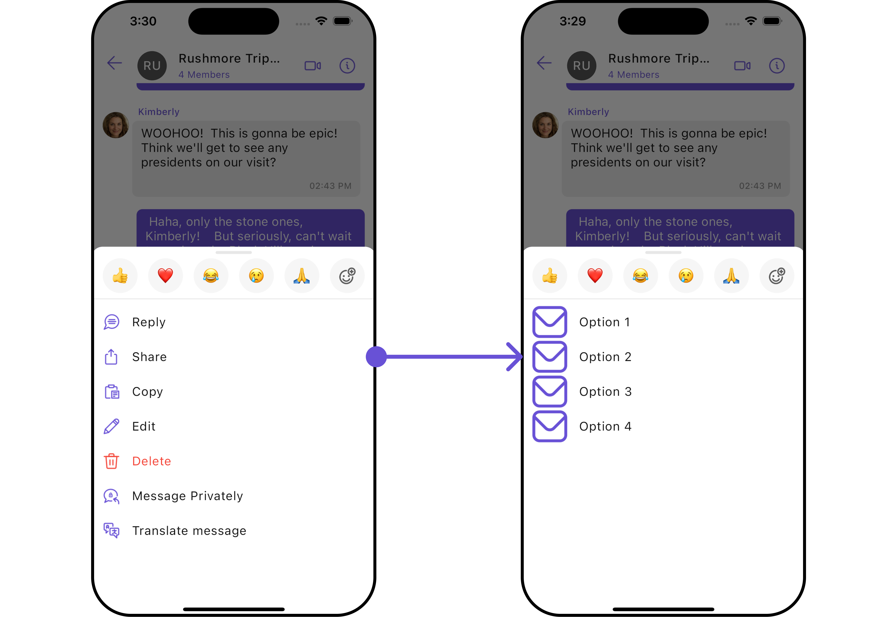

</TabItem>

</Tabs>

---

## New Templates

You can create an entirely new template for custom messages is one of the powerful features of CometChat's MessageTemplate.

Here is the complete example for reference:

<Tabs>

<TabItem value="Dart" label="Dart">

```dart
CometChatMessages(
  user: user, // User object
  group: group, // Group object
  messageListConfiguration: MessageListConfiguration(
    messagesRequestBuilder: MessagesRequestBuilder()
      ..limit = 30
      ..types = CometChatUIKit.getDataSource().getAllMessageTypes() + ["location"] // Add the custom type here
      ..categories = CometChatUIKit.getDataSource().getAllMessageCategories(),
    templates: [
      CometChatMessageTemplate(
        type: "location", // Define the template type
        category: MessageCategoryConstants.custom, // Define the template category
        bubbleView: (BaseMessage baseMessage, BuildContext buildContext, BubbleAlignment alignment, {AdditionalConfigurations? additionalConfigurations}) {
          return Container(
            width: MediaQuery.of(context).size.width/2.5,
            padding: const EdgeInsets.all(10),
            margin: const EdgeInsets.only(top: 10, bottom: 10),
            decoration: BoxDecoration(
              color: Colors.yellow,
              borderRadius: BorderRadius.circular(10),
            ),
            child: Flexible(
                child: Column(
                  children: [
                    Icon(
                      Icons.location_on_outlined,
                      color: Colors.black,
                      size: 100,
                    ),
                    SizedBox(height: 10,),
                    Text((baseMessage as CustomMessage).customData!['address'] as String, style: const TextStyle(
                      fontSize: 16,
                      color: Colors.black,
                    ))
                  ],
                )
            ),
          ); // Replace this placeholder Widget with your custom Widget
        },
      ),
    ],
  ),
)
```

</TabItem>

</Tabs>

<Tabs>

<TabItem value="Android" label="Android">

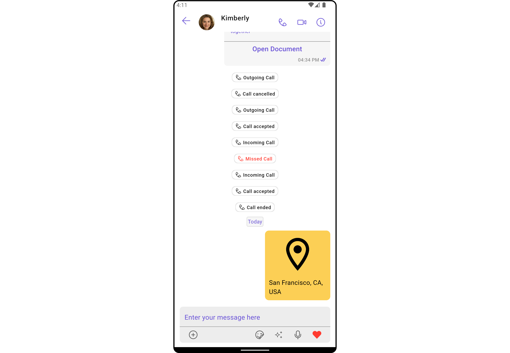

</TabItem>

<TabItem value="iOS" label="iOS">


</TabItem>

</Tabs>

