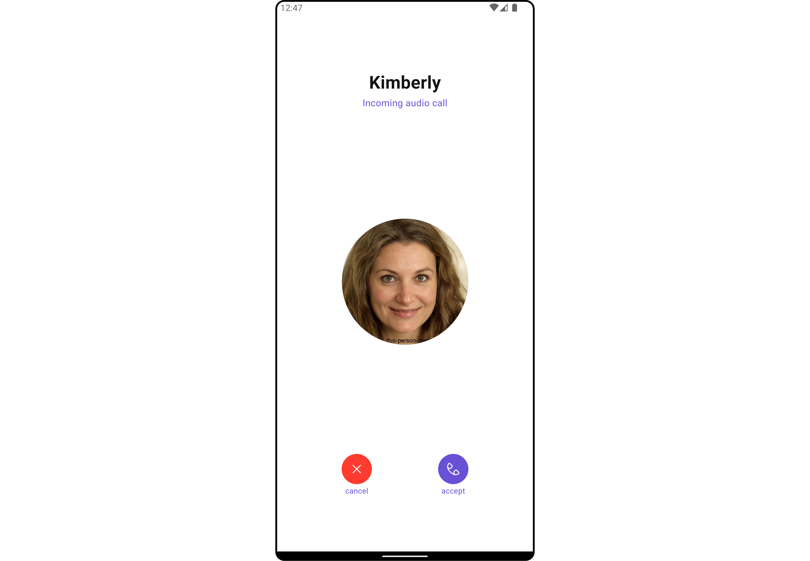
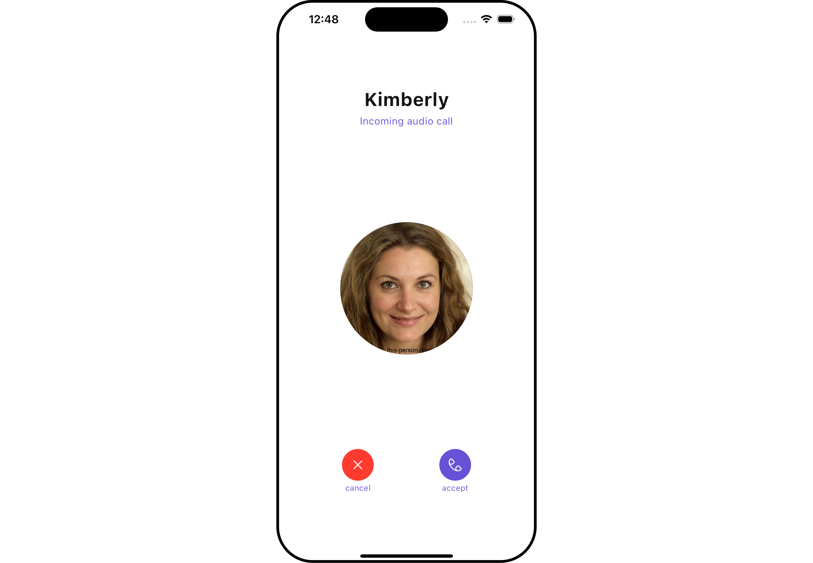
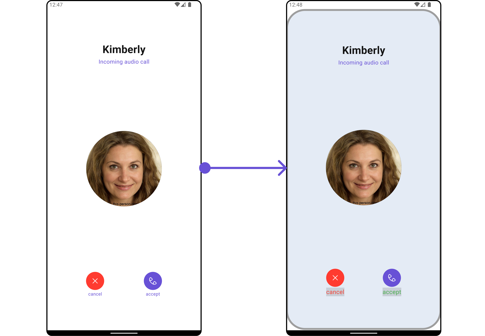
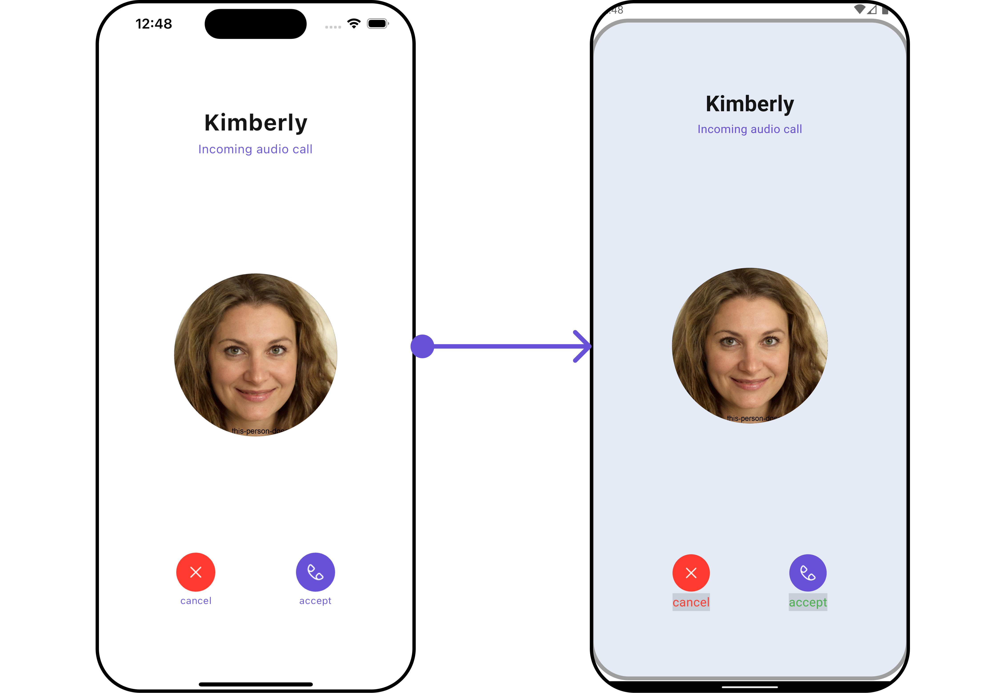
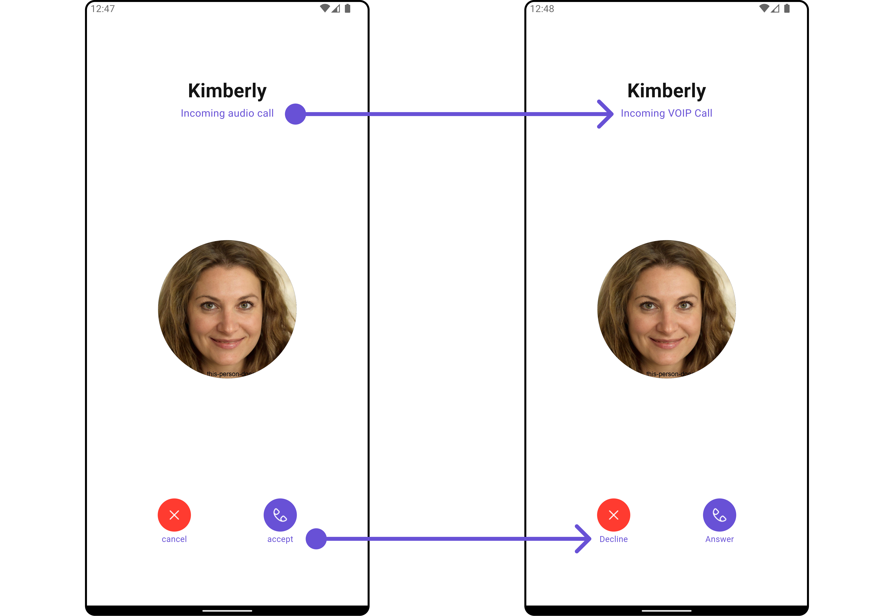
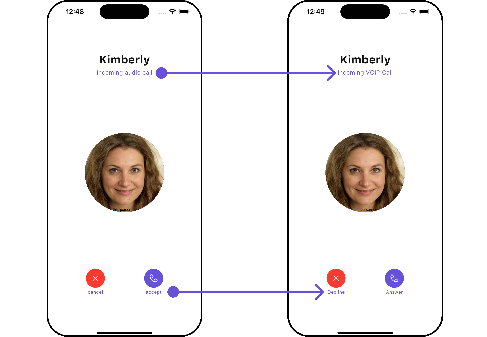

import Tabs from '@theme/Tabs';
import TabItem from '@theme/TabItem';
import { Tooltip } from 'react-tooltip'
import 'react-tooltip/dist/react-tooltip.css'

<Tooltip id="my-tooltip-html-prop" html="Not available in Group Members Configuration object"/>

## Overview

The `CometChatIncomingCall` is a [Widget](/ui-kit/flutter/components-overview#components) that serves as a visual representation when the user receives an incoming call, such as a voice call or video call, providing options to answer or decline the call.

<Tabs>

<TabItem value="Android" label="Android">



</TabItem>

<TabItem value="iOS" label="iOS">



</TabItem>

</Tabs>

---

## Usage

### Integration

`CometChatIncomingCall` being a custom widget, offers versatility in its integration. It can be seamlessly launched via button clicks or any user-triggered action, enhancing the overall user experience and facilitating smoother interactions within the application.

You can launch `CometChatIncomingCall` directly using `Navigator.push`, or you can define it as a widget within the `build` method of your `State` class.

##### 1. Using Navigator to Launch `CometChatIncomingCall`

<Tabs>

<TabItem value="Dart" label="Dart">

```dart
Navigator.push(context, MaterialPageRoute(builder: (context) => CometChatIncomingCall(user: user, call: callObject))); // User object and Call object is required to launch the incoming call widget.
```

</TabItem>

</Tabs>

##### 2. Embedding `CometChatIncomingCall` as a Widget in the build Method

<Tabs>

<TabItem value="Dart" label="Dart">

```dart
import 'package:cometchat_calls_uikit/cometchat_calls_uikit.dart';
import 'package:flutter/material.dart';

class IncomingCallExample extends StatefulWidget {
  const IncomingCallExample({super.key});

  @override
  State<IncomingCallExample> createState() => _IncomingCallExampleState();
}

class _IncomingCallExampleState extends State<IncomingCallExample> {

  @override
  Widget build(BuildContext context) {
    return Scaffold(
      body: SafeArea(
        child: CometChatIncomingCall(
          user: user, // User Object
          call: callObject
        ), // User object and Call object is required to launch the incoming call widget.
      ),
    );
  }
}
```

</TabItem>

</Tabs>

---

### Actions

[Actions](/ui-kit/flutter/components-overview#actions) dictate how a widget functions. They are divided into two types: Predefined and User-defined. You can override either type, allowing you to tailor the behavior of the widget to fit your specific needs.

##### 1. onAccept

The `onAccept` action is typically triggered when the user clicks on the accept button, initiating a predefined action. However, by implementing the following code snippet, you can easily customize or override this default behavior to suit your specific requirements.

<Tabs>

<TabItem value="Dart" label="Dart">

```dart
CometChatIncomingCall(
  user: user, // User Object
  call: callObject, // Call Object
  onAccept: (BuildContext context, Call call) {
    // TODO("Not yet implemented")
  },
)
```

</TabItem>

</Tabs>

---

##### 2. onDecline

The `onDecline` action is typically triggered when the user clicks on the reject button, initiating a predefined action. However, by implementing the following code snippet, you can easily customize or override this default behavior to suit your specific requirements.

<Tabs>

<TabItem value="Dart" label="Dart">

```dart
CometChatIncomingCall(
  user: user, // User Object
  call: callObject, // Call Object
  onDecline: (BuildContext context, Call call) {
    // TODO("Not yet implemented")
  },
)
```

</TabItem>

</Tabs>

---

##### 3. onError

You can customize this behavior by using the provided code snippet to override the `onError` and improve error handling.

<Tabs>

<TabItem value="Dart" label="Dart">

```dart
CometChatIncomingCall(
  user: user, // User Object
  call: callObject, // Call Object
  onError: (e) {
    // TODO("Not yet implemented")
  },
)
```

</TabItem>

</Tabs>

---

### Filters

**Filters** allow you to customize the data displayed in a list within a Widget. You can filter the list based on your specific criteria, allowing for a more customized. Filters can be applied using RequestBuilders of Chat SDK.

The `CometChatIncomingCall` widget does not have any exposed filters.

---

### Events

[Events](/ui-kit/flutter/components-overview#events) are emitted by a `Widget`. By using event you can extend existing functionality. Being global events, they can be applied in Multiple Locations and are capable of being Added or Removed.

The `CometChatIncomingCall` widget does not have any exposed events.

---

## Customization

To fit your app's design requirements, you can customize the appearance of the conversation widget. We provide exposed methods that allow you to modify the experience and behavior according to your specific needs.

### Style

Using Style you can customize the look and feel of the widget in your app, These parameters typically control elements such as the color, size, shape, and fonts used within the widget.

##### 1. IncomingCall Style

You can customize the appearance of the `CometChatIncomingCall` Widget by applying the `IncomingCallStyle` to it using the following code snippet.

Here is the complete example for reference:

<Tabs>

<TabItem value="Dart" label="Dart">

```dart
CometChatIncomingCall(
  user: user, // User Object
  call: callObject, // Call Object
  incomingCallStyle: IncomingCallStyle(
      declineButtonTextStyle: const TextStyle(
        color: Colors.red,
        fontSize: 16,
        backgroundColor: Color(0xFFE4EBF5),
      ),
      acceptButtonTextStyle: const TextStyle(
        color: Colors.green,
        fontSize: 16,
        backgroundColor: Color(0xFFE4EBF5),
      ),
      border: Border.all(color: Colors.grey, width: 1),
      borderRadius: 10,
  ),
)
```

</TabItem>

</Tabs>

<Tabs>

<TabItem value="Android" label="Android">



</TabItem>

<TabItem value="iOS" label="iOS">



</TabItem>

</Tabs>

List of properties exposed by IncomingCallStyle

| **Property**                  | Description                                            | Code                                 |
| ----------------------------- | ------------------------------------------------------ | ------------------------------------ |
| **Accept Button Text Style**  | Sets the text style for the accept button.             | `acceptButtonTextStyle: TextStyle?`  |
| **Background**                | Sets the background color of the incoming call style.  | `background: Color?`                 |
| **Border**                    | Sets the border properties of the incoming call style. | `border: BoxBorder?`                 |
| **Border Radius**             | Sets the border radius of the incoming call style.     | `borderRadius: double?`              |
| **Decline Button Text Style** | Sets the text style for the decline button.            | `declineButtonTextStyle: TextStyle?` |
| **Gradient**                  | Sets the gradient applied to the incoming call style.  | `gradient: Gradient?`                |
| **Height**                    | Sets the height of the incoming call style.            | `height: double?`                    |
| **Width**                     | Sets the width of the incoming call style.             | `width: double?`                     |

---

##### 2. Avatar Styles

To apply customized styles to the `Avatar` widget in the `CometChatIncomingCall` Widget, you can use the following code snippet. For further insights on `Avatar` Styles [refer](/ui-kit/flutter/avatar#avatarstyle)

**Example**

Here is the complete example for reference:

<Tabs>

<TabItem value="Dart" label="Dart">

```dart
CometChatIncomingCall(
  user: user, // User Object
  call: callObject, // Call Object
  avatarStyle: AvatarStyle(
      border: Border.all(width: 5),
      borderRadius: 20,
      background: Colors.red
  ),
)
```

</TabItem>

</Tabs>

---

##### 3. DeclineButton Style

You can customize the appearance of the Decline Button Widget by applying the `declineButtonStyle` to it using the following code snippet.

**Example**

Here is the complete example for reference:

<Tabs>

<TabItem value="Dart" label="Dart">

```dart
import 'package:cometchat_calls_uikit/cometchat_calls_uikit.dart' as uikit;

CometChatIncomingCall(
  user: user, // User Object
  call: callObject, // Call Object
  declineButtonStyle: uikit.ButtonStyle(
    background: Colors.brown,
    border: Border.all(color: Colors.black),
    borderRadius: 10,
    textStyle: const TextStyle(color: Colors.red),
    iconTint: Colors.white,
  ),
)
```

</TabItem>

</Tabs>

---

##### 4. AcceptButton Style

You can customize the appearance of the Accept Button Widget by applying the `acceptButtonStyle` to it using the following code snippet.

**Example**

Here is the complete example for reference:

<Tabs>

<TabItem value="Dart" label="Dart">

```dart
import 'package:cometchat_calls_uikit/cometchat_calls_uikit.dart' as uikit;

CometChatIncomingCall(
  user: user, // User Object
  call: callObject, // Call Object
  acceptButtonStyle: uikit.ButtonStyle(
    background: Colors.brown,
    border: Border.all(color: Colors.black),
    borderRadius: 10,
    textStyle: const TextStyle(color: Colors.green),
    iconTint: Colors.white,
  ),
)
```

</TabItem>

</Tabs>

---

### Functionality

These are a set of small functional customizations that allow you to fine-tune the overall experience of the widget. With these, you can change text, set custom icons, and toggle the visibility of UI elements.

**Example**

In this example, we're enhancing the interface by customizing the accept and decline button icons. By setting custom icons for both the accept and decline buttons, users can enjoy a more visually appealing and personalized experience.

This level of customization allows developers to tailor the user interface to match the overall theme and branding of their application.

Here is the complete example for reference:

<Tabs>

<TabItem value="Dart" label="Dart">

```dart
CometChatIncomingCall(
  user: user, // User Object
  call: callObject, // Call Object
  subtitle: "Incoming VOIP Call",
  disableSoundForCalls: true,
  declineButtonText: "Decline",
  acceptButtonText: "Answer"
)
```

</TabItem>

</Tabs>

<Tabs>

<TabItem value="Android" label="Android">



</TabItem>

<TabItem value="iOS" label="iOS">



</TabItem>

</Tabs>

Below is a list of customizations along with corresponding code snippets

| **Property**                        | Description                                       | Code                                   |
| ----------------------------------- | ------------------------------------------------- | -------------------------------------- |
| **Accept Button Icon Url**          | Sets the URL for the accept button icon.          | `acceptButtonIconUrl: String?`         |
| **Accept Button Text**              | Sets the text for the accept button.              | `acceptButtonText: String?`            |
| **Custom Sound For Calls**          | Sets the custom sound for incoming calls.         | `customSoundForCalls: String?`         |
| **Decline Button Icon Url**         | Sets the URL for the decline button icon.         | `declineButtonIconUrl: String?`        |
| **Decline Button Icon Url Package** | Sets the package for the decline button icon URL. | `declineButtonIconUrlPackage: String?` |
| **Decline Button Text**             | Sets the text for the decline button.             | `declineButtonText: String?`           |
| **Disable Sound For Calls**         | Disables sound for incoming calls.                | `disableSoundForCalls: bool?`          |
| **Subtitle**                        | Sets the subtitle for the incoming call screen.   | `subtitle: String?`                    |

---

### Advanced

For advanced-level customization, you can set custom widget to the widget. This lets you tailor each aspect of the widget to fit your exact needs and application aesthetics. You can create and define your widget, layouts, and UI elements and then incorporate those into the widget.

The `CometChatIncomingCall` widget does not provide additional functionalities beyond this level of customization.

---
