import Tabs from '@theme/Tabs';
import TabItem from '@theme/TabItem';
import { Tooltip } from 'react-tooltip'
import 'react-tooltip/dist/react-tooltip.css'

<Tooltip id="my-tooltip-html-prop" html="Not available in Group Members Configuration object"/>

## Overview

`CometChatCallLogs` is a [Widget](/ui-kit/flutter/components-overview#components) that shows the list of Call Logs available. By default, names are shown for all listed users, along with their avatars if available.

<Tabs>

<TabItem value="Android" label="Android">

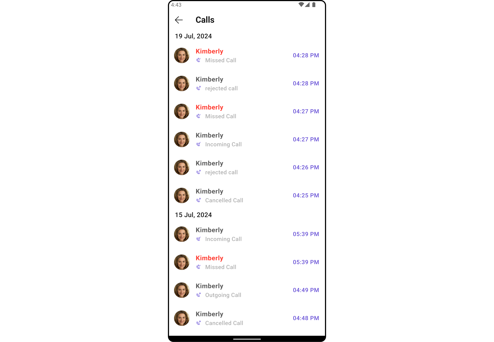

</TabItem>

<TabItem value="iOS" label="iOS">

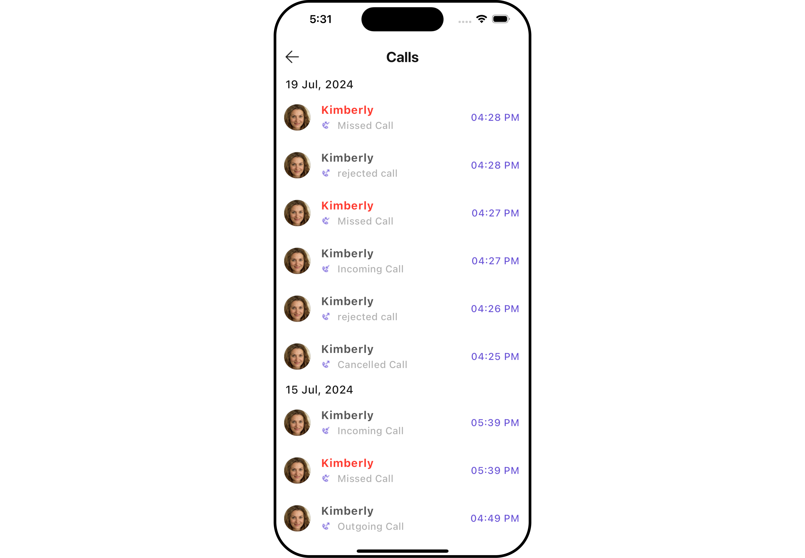

</TabItem>

</Tabs>

The `CometChatCallLogs` widget is composed of the following BaseWidgets:

| Widgets                                        | Description                                                                                                                                                                             |
| ---------------------------------------------- | --------------------------------------------------------------------------------------------------------------------------------------------------------------------------------------- |
| [CometChatListBase](/ui-kit/flutter/list-base) | `CometChatListBase` is a container widget featuring a title, customizable background options, and a dedicated list widget for seamless integration within your application's interface. |
| [CometChatListItem](/ui-kit/flutter/list-item) | This widget displays data retrieved from a CallLog object on a card, presenting a title and subtitle.                                                                                   |

## Usage

### Integration

`CometChatCallLogs` being a wrapper widget, offers versatility in its integration. It can be seamlessly launched via button clicks or any user-triggered action, enhancing the overall user experience and facilitating smoother interactions within the application.

You can launch `CometChatCallLogs` directly using `Navigator.push`, or you can define it as a widget within the `build` method of your `State` class.

##### 1. Using Navigator to Launch `CometChatCallLogs`

<Tabs>

<TabItem value="Dart" label="Dart">

```dart
Navigator.push(context, MaterialPageRoute(builder: (context) => CometChatCallLogs()));
```

</TabItem>

</Tabs>

##### 2. Embedding `CometChatCallLogs` as a Widget in the build Method

<Tabs>

<TabItem value="Dart" label="Dart">

```dart
import 'package:cometchat_calls_uikit/cometchat_calls_uikit.dart';
import 'package:flutter/material.dart';

class CallLogsExample extends StatefulWidget {
  const CallLogsExample({super.key});

  @override
  State<CallLogsExample> createState() => _CallLogsExampleState();
}

class _CallLogsExampleState extends State<CallLogsExample> {

  @override
  Widget build(BuildContext context) {
    return const Scaffold(
      body: SafeArea(
        child: CometChatCallLogs(),
      ),
    );
  }
}
```

</TabItem>

</Tabs>

---

### Actions

[Actions](/ui-kit/flutter/components-overview#actions) dictate how a widget functions. They are divided into two types: Predefined and User-defined. You can override either type, allowing you to tailor the behavior of the widget to fit your specific needs.

##### 1. onItemClick

This method proves valuable when users seek to override the `onItemClick` functionality within CometChatCallLogs, empowering them with greater control and customization options.

The `onItemClick` action doesn't have a predefined behavior. You can override this action using the following code snippet.

<Tabs>

<TabItem value="Dart" label="Dart">

```dart
CometChatCallLogs(
  onItemClick: (callLog) {
    // TODO("Not yet implemented")
  },
)
```

</TabItem>

</Tabs>

---

##### 2. OnError

You can customize this behavior by using the provided code snippet to override the `OnError` and improve error handling.

<Tabs>

<TabItem value="Dart" label="Dart">

```dart
CometChatCallLogs(
  onError: (e) {
    // TODO("Not yet implemented")
  },
)
```

</TabItem>

</Tabs>

---

##### 3. onBack

You can customize this behavior by using the provided code snippet to override the `onBack` and improve error handling.

<Tabs>

<TabItem value="Dart" label="Dart">

```dart
CometChatCallLogs(
  onBack: () {
    // TODO("Not yet implemented")
  },
)
```

</TabItem>

</Tabs>

---

##### 4. onInfoIconClick

You can customize this behavior by using the provided code snippet to override the `onInfoIconClick` and improve error handling.

<Tabs>

<TabItem value="Dart" label="Dart">

```dart
CometChatCallLogs(
  onInfoIconClick: (CallLog callLog) {
    // TODO("Not yet implemented")
  },
)
```

</TabItem>

</Tabs>

---

### Filters

**Filters** allow you to customize the data displayed in a list within a Widget. You can filter the list based on your specific criteria, allowing for a more customized. Filters can be applied using RequestBuilders of Chat SDK.

##### 1. CallLogRequestBuilder

The [CallLogRequestBuilder](/sdk/flutter/call-logs) enables you to filter and customize the call list based on available parameters in CallLogRequestBuilder. This feature allows you to create more specific and targeted queries during the call. The following are the parameters available in [CallLogRequestBuilder](/sdk/flutter/call-logs)

**Example**

In the example below, we are applying a filter based on the limit and have a call recording.

<Tabs>

<TabItem value="Dart" label="Dart">

```dart
CometChatCallLogs(
  callLogsRequestBuilder: CallLogRequestBuilder()
    ..limit = 10
    ..hasRecording = true,
)
```

</TabItem>

</Tabs>

List of properties exposed by `CallLogRequestBuilder`

| **Property**       | Description                                                 | Code                     |
| ------------------ | ----------------------------------------------------------- | ------------------------ |
| **Auth Token**     | Sets the authentication token.                              | `authToken: String?`     |
| **Call Category**  | Sets the category of the call.                              | `callCategory: String?`  |
| **Call Direction** | Sets the direction of the call.                             | `callDirection: String?` |
| **Call Status**    | Sets the status of the call.                                | `callStatus: String?`    |
| **Call Type**      | Sets the type of the call.                                  | `callType: String?`      |
| **Guid**           | Sets the unique ID of the group involved in the call.       | `guid: String?`          |
| **Has Recording**  | Indicates if the call has a recording.                      | `hasRecording: bool`     |
| **Limit**          | Sets the maximum number of call logs to return per request. | `limit: int`             |
| **Uid**            | Sets the unique ID of the user involved in the call.        | `uid: String?`           |

---

### Events

[Events](/ui-kit/flutter/components-overview#events) are emitted by a `Widget`. By using event you can extend existing functionality. Being global events, they can be applied in Multiple Locations and are capable of being Added or Removed.

The `CometChatCallLogs` widget does not have any exposed events.

---

## Customization

To fit your app's design requirements, you can customize the appearance of the conversation widget. We provide exposed methods that allow you to modify the experience and behavior according to your specific needs.

### Style

Using Style you can customize the look and feel of the widget in your app, These parameters typically control elements such as the color, size, shape, and fonts used within the widget.

##### 1. CallLogs Style

You can customize the appearance of the `CometChatCallLogs` Widget by applying the `CallLogsStyle` to it using the following code snippet.

<Tabs>

<TabItem value="Dart" label="Dart">

```dart
CometChatCallLogs(
  callLogsStyle: CallLogsStyle(
      background: Color(0xFFE4EBF5),
      titleStyle: TextStyle(color: Colors.red),
  ),
)
```

</TabItem>

</Tabs>

<Tabs>

<TabItem value="Android" label="Android">


</TabItem>

<TabItem value="iOS" label="iOS">


</TabItem>

</Tabs>

List of properties exposed by `CallLogStyle`

| **Property**              | Description                               | Code                         |
| ------------------------- | ----------------------------------------- | ---------------------------- |
| **Back Icon Tint**        | Sets the color for the back icon.         | `backIconTint: Color?`       |
| **Background**            | Sets the background color.                | `background: Color?`         |
| **Border**                | Sets the border style.                    | `border: BoxBorder?`         |
| **Border Radius**         | Sets the border radius.                   | `borderRadius: double?`      |
| **Call Status Icon Tint** | Sets the color for the call status icon.  | `callStatusIconTint: Color?` |
| **Empty Text Style**      | Sets the text style for empty state text. | `emptyTextStyle: TextStyle?` |
| **Error Text Style**      | Sets the text style for error messages.   | `errorTextStyle: TextStyle?` |
| **Gradient**              | Sets the gradient background.             | `gradient: Gradient?`        |
| **Height**                | Sets the height of the call logs style.   | `height: double?`            |
| **Info Icon Tint**        | Sets the color for the info icon.         | `infoIconTint: Color?`       |
| **Loading Icon Tint**     | Sets the color for the loading icon.      | `loadingIconTint: Color?`    |
| **Sub Title Style**       | Sets the text style for subtitles.        | `subTitleStyle: TextStyle?`  |
| **Tail Title Style**      | Sets the text style for tail titles.      | `tailTitleStyle: TextStyle?` |
| **Title Style**           | Sets the text style for titles.           | `titleStyle: TextStyle?`     |
| **Width**                 | Sets the width of the call logs style.    | `width: double?`             |

---

##### 2. Avatar Styles

To apply customized styles to the `Avatar` widget in the `CallLogs` Widget, you can use the following code snippet. For further insights on `Avatar` Styles [refer](/ui-kit/flutter/avatar#avatarstyle)

<Tabs>

<TabItem value="Dart" label="Dart">

```dart
CometChatCallLogs(
  avatarStyle: AvatarStyle(
      border: Border.all(width: 5),
      borderRadius: 20,
      background: Colors.red
  ),
)
```

</TabItem>

</Tabs>

---

##### 3. ListItem Styles

To apply customized styles to the `ListItemStyle` widget in the `CallLogs` Widget, you can use the following code snippet. For further insights on `ListItemStyle` Styles [refer](/ui-kit/flutter/list-item)

<Tabs>

<TabItem value="Dart" label="Dart">

```dart
CometChatCallLogs(
  listItemStyle: ListItemStyle(
      background: Color(0xFFE4EBF5),
      borderRadius: 20,
      border: Border.all(width: 2),
      margin: EdgeInsets.only(top: 10),
      padding: EdgeInsets.only(left: 10)
  ),
)
```

</TabItem>

</Tabs>

---

### Functionality

These are a set of small functional customizations that allow you to fine-tune the overall experience of the widget. With these, you can change text, set custom icons, and toggle the visibility of UI elements.

<Tabs>

<TabItem value="Dart" label="Dart">

```dart
CometChatCallLogs(
  title: "Your Title",
  backButton: Icon(Icons.add_alert, color: Color(0xFF6851D6)),
)
```

</TabItem>

</Tabs>

<Tabs>

<TabItem value="Android" label="Android">


</TabItem>

<TabItem value="iOS" label="iOS">


</TabItem>

</Tabs>

Below is a list of customizations along with corresponding code snippets

| **Property**                  | **Description**                                  | **Code**                                         |
| ----------------------------- | ------------------------------------------------ | ------------------------------------------------ |
| **Back Button**               | A widget for the back button.                    | `backButton: Widget?`                            |
| **Call Logs Request Builder** | Builder for creating call log requests.          | `callLogsRequestBuilder: CallLogRequestBuilder?` |
| **Date Pattern**              | Format pattern for date display.                 | `datePattern: String?`                           |
| **Date Separator Pattern**    | Format pattern for date separator.               | `dateSeparatorPattern: String?`                  |
| **Empty State Text**          | Text to display when there are no call logs.     | `emptyStateText: String?`                        |
| **Error State Text**          | Text to display when there is an error.          | `errorStateText: String?`                        |
| **Hide Separator**            | Whether to hide the separator between call logs. | `hideSeparator: bool`                            |
| **Incoming Audio Call Icon**  | Icon for incoming audio calls.                   | `incomingAudioCallIcon: Icon?`                   |
| **Incoming Video Call Icon**  | Icon for incoming video calls.                   | `incomingVideoCallIcon: Icon?`                   |
| **Info Icon Url**             | URL for the info icon.                           | `infoIconUrl: String?`                           |
| **Loading Icon Url**          | URL for the loading icon.                        | `loadingIconUrl: String?`                        |
| **Missed Audio Call Icon**    | Icon for missed audio calls.                     | `missedAudioCallIcon: Icon?`                     |
| **Missed Video Call Icon**    | Icon for missed video calls.                     | `missedVideoCallIcon: Icon?`                     |
| **Outgoing Audio Call Icon**  | Icon for outgoing audio calls.                   | `outgoingAudioCallIcon: Icon?`                   |
| **Outgoing Video Call Icon**  | Icon for outgoing video calls.                   | `outgoingVideoCallIcon: Icon?`                   |
| **Show Back Button**          | Whether to show the back button.                 | `showBackButton: bool?`                          |
| **Title**                     | Title for the call logs section.                 | `title: String?`                                 |

---

### Advanced

For advanced-level customization, you can set custom widgets to the widget. This lets you tailor each aspect of the widget to fit your exact needs and application aesthetics. You can create and define your widgets, layouts, and UI elements and then incorporate those into the widget.

#### ListItemView

With this property, you can assign a custom ListItem to the Call Logs Widget.

**Example**

Here is the complete example for reference:

<Tabs>

<TabItem value="Dart" label="Dart">

```dart
CometChatCallLogs(
  listItemView: (CallLog callLog, BuildContext context) {
    return Container(
      margin: const EdgeInsets.only(top: 10),
      width: MediaQuery.of(context).size.width/1.2,
      decoration: BoxDecoration(
        color: Color(0xFFE4EBF5),
        borderRadius: BorderRadius.circular(20),
        border: Border.all(width: 2)
      ),
      padding: const EdgeInsets.all(10),
      child: Row(
        crossAxisAlignment: CrossAxisAlignment.center,
        children: [
          CometChatAvatar(
            name: callLog.participants![0].name!,
          ),
          Column(
            children: [
              Text(callLog.participants![0].name!),
              Text("Duration: ${callLog.totalDurationInMinutes} minutes"),
            ],
          )
        ],
      ),
    );
  },
)
```

</TabItem>

</Tabs>

<Tabs>

<TabItem value="Android" label="Android">

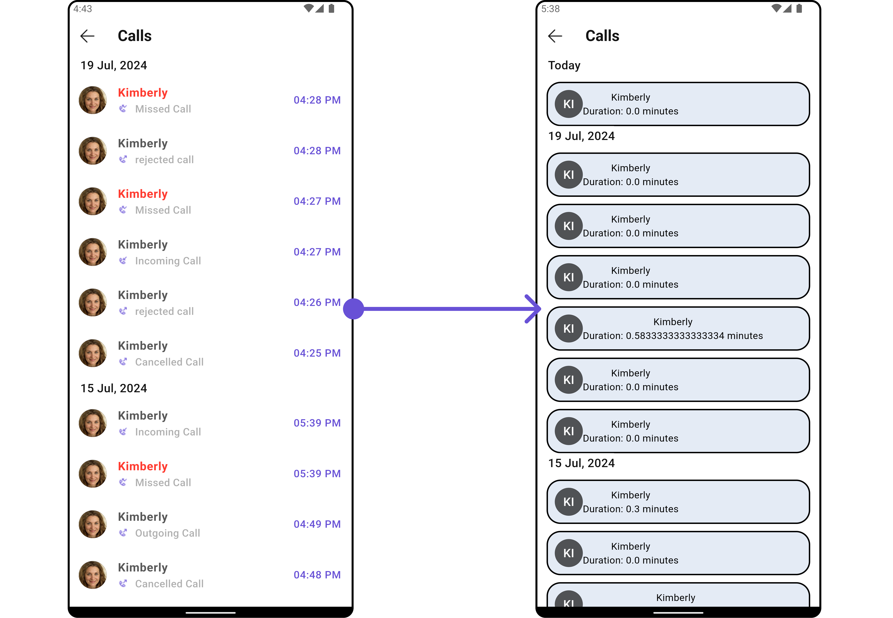

</TabItem>

<TabItem value="iOS" label="iOS">

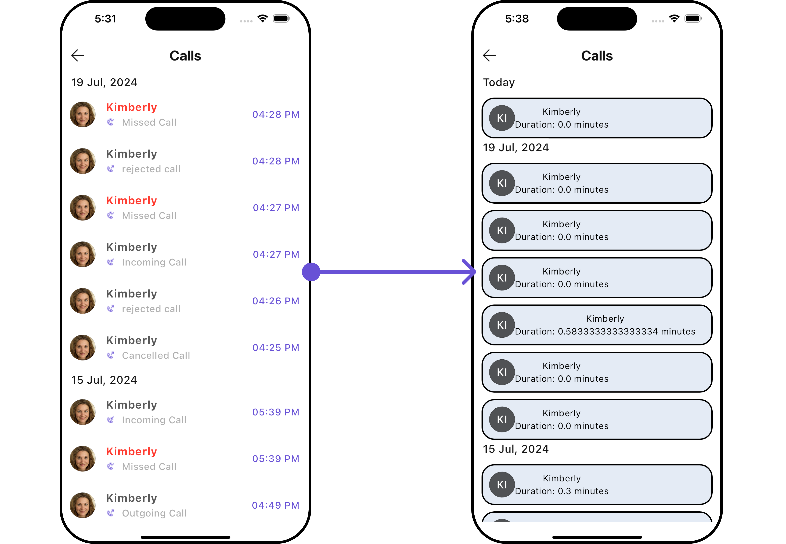

</TabItem>

</Tabs>

---

#### SubtitleView

You can customize the subtitle widget for each call logs item to meet your requirements

**Example**

Here is the complete example for reference:

<Tabs>

<TabItem value="Dart" label="Dart">

```dart
CometChatCallLogs(
  subTitleView: (context, conversation) {
    return const Row(
      children: [
        Icon(Icons.call, color: Color(0xFF6851D6), size: 25,),
        SizedBox(width: 10),
        Icon(Icons.video_call, color: Color(0xFF6851D6), size: 25,),
      ],
    );
  },
)
```

</TabItem>

</Tabs>

<Tabs>

<TabItem value="Android" label="Android">

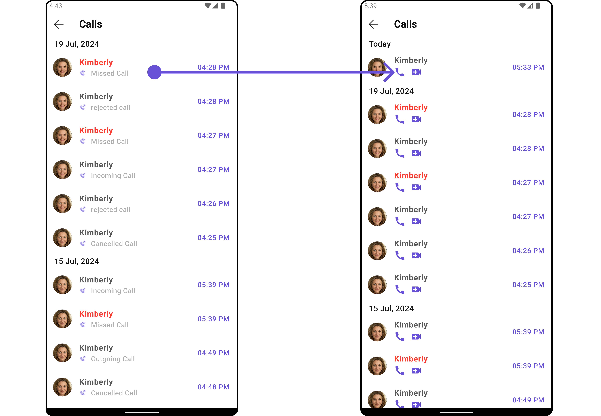

</TabItem>

<TabItem value="iOS" label="iOS">

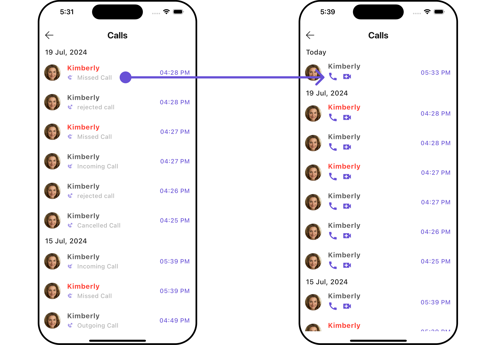

</TabItem>

</Tabs>

---

#### TailView

You can customize the tail widget for each call logs item to meet your requirements

**Example**

Here is the complete example for reference:

<Tabs>

<TabItem value="Dart" label="Dart">

```dart
CometChatCallLogs(
  tailView: (BuildContext context, CallLog callLog) {
    return SizedBox(
      width: 100,
      child: const Row(
        children: [
          Icon(Icons.call, color: Color(0xFF6851D6), size: 25,),
          SizedBox(width: 10),
          Icon(Icons.video_call, color: Color(0xFF6851D6), size: 25,),
        ],
      ),
    ); // Replaced the placeholder with a custom widget.
  },
)
```

</TabItem>

</Tabs>

<Tabs>

<TabItem value="Android" label="Android">

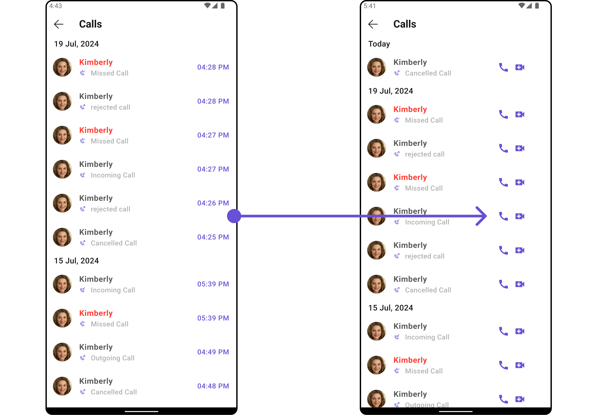

</TabItem>

<TabItem value="iOS" label="iOS">

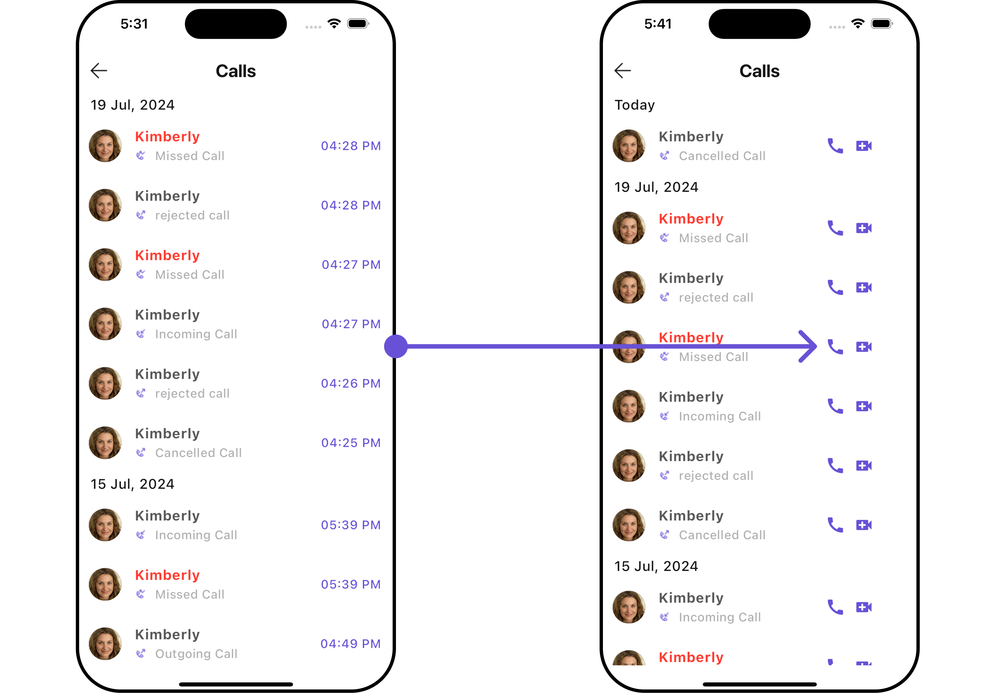

</TabItem>

</Tabs>

---

#### LoadingStateView

You can set a custom loader widget using `loadingStateView` to match the loading widget of your app.

**Example**

Here is the complete example for reference:

<Tabs>

<TabItem value="Dart" label="Dart">

```dart
CometChatCallLogs(
  loadingStateView: (context) {
    return SizedBox(
      width: MediaQuery.of(context).size.width,
      child: const Center(
          child: CircularProgressIndicator()
      ),
    );
  },
)
```

</TabItem>

</Tabs>

<Tabs>

<TabItem value="Android" label="Android">

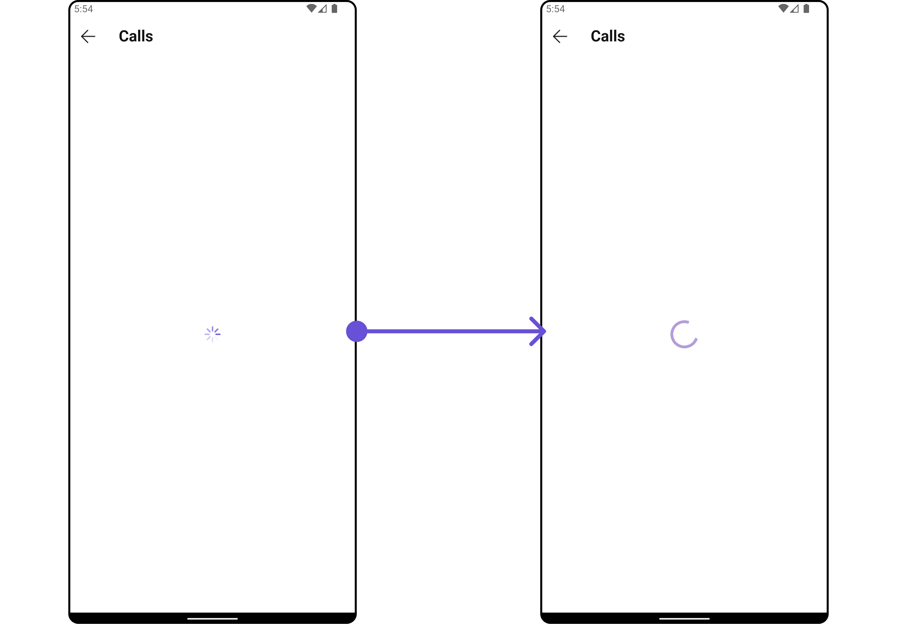

</TabItem>

<TabItem value="iOS" label="iOS">

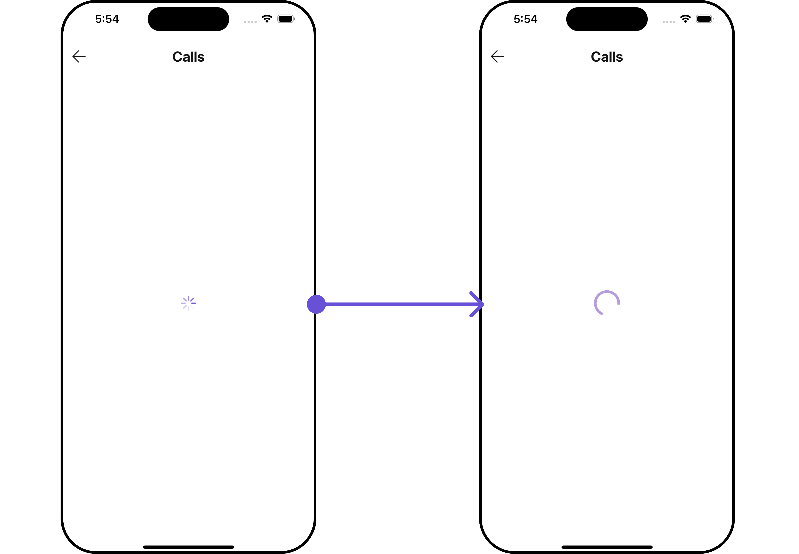

</TabItem>

</Tabs>

---

#### EmptyStateView

You can set a custom `EmptyStateView` using `emptyStateView` to match the empty widget of your app.

**Example**

Here is the complete example for reference:

<Tabs>

<TabItem value="Dart" label="Dart">

```dart
CometChatCallLogs(
  emptyStateView: (context) {
    return SizedBox(
      width: MediaQuery.of(context).size.width,
      child: const Center(
          child: Column(
            crossAxisAlignment: CrossAxisAlignment.center,
            mainAxisAlignment: MainAxisAlignment.center,
            children: [
              Spacer(),
              Icon(Icons.sms_failed_outlined, color: Colors.red, size: 100,),
              SizedBox(height: 20,),
              Text("Your Custom Message"),
              Spacer(),
            ],
          )
      ),
    );
  },
)
```

</TabItem>

</Tabs>

<Tabs>

<TabItem value="Android" label="Android">

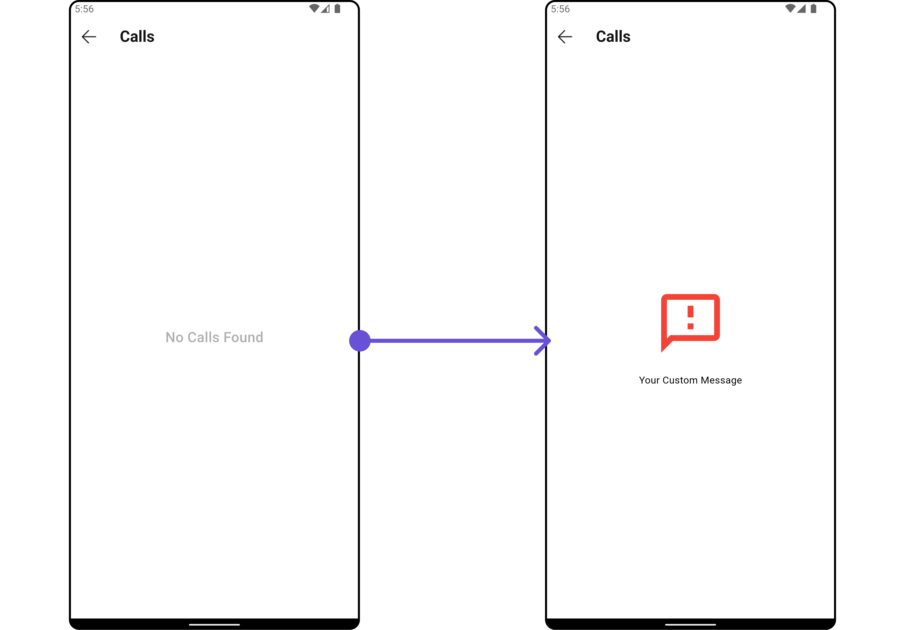

</TabItem>

<TabItem value="iOS" label="iOS">

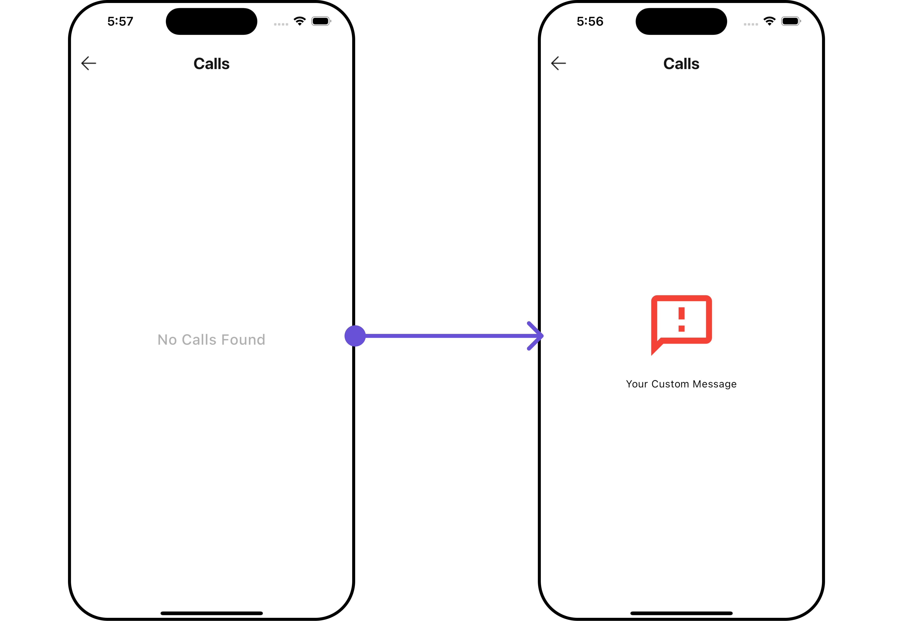

</TabItem>

</Tabs>

---

#### ErrorStateView

You can set a custom `ErrorStateView` using `errorStateView` to match the error widget of your app.

**Example**

Here is the complete example for reference:

<Tabs>

<TabItem value="Dart" label="Dart">

```dart
CometChatCallLogs(
  errorStateView: (context) {
    return SizedBox(
      width: MediaQuery.of(context).size.width,
      child: const Center(
        child: Column(
          crossAxisAlignment: CrossAxisAlignment.center,
          mainAxisAlignment: MainAxisAlignment.center,
          children: [
            Spacer(),
            Icon(Icons.error_outline, color: Colors.red, size: 100,),
            SizedBox(height: 20,),
            Text("Your Custom Error Message"),
            Spacer(),
          ],
        ),
      ),
    );
  },
)
```

</TabItem>

</Tabs>

<!-- <Tabs>

<TabItem value="Android" label="Android">


</TabItem>

</Tabs> -->

---

## Configurations

[Configurations](/ui-kit/flutter/components-overview#configurations) offer the ability to customize the properties of each widget within a Composite Widget.

`CometChatCallLogs` has `CometChatOutgoingCall` widget. Hence, each of these widgets will have its individual `Configuration``.

- `Configurations` expose properties that are available in its individual widgets.

#### Outgoing Call

You can customize the properties of the OutGoing Call widget by making use of the `OutgoingCallConfiguration`. You can accomplish this by employing the `outgoingCallConfiguration` props as demonstrated below:

**Example**

Here is the complete example for reference:

<Tabs>

<TabItem value="Dart" label="Dart">

```dart
CometChatCallLogs(
  outgoingCallConfiguration: OutgoingCallConfiguration(
    subtitle: "Outgoing Call",
    outgoingCallStyle: OutgoingCallStyle(
      background: Color(0xFFE4EBF5),
    )
  ),
)
```

</TabItem>

</Tabs>

<Tabs>

<TabItem value="Android" label="Android">


</TabItem>

<TabItem value="iOS" label="iOS">


</TabItem>

</Tabs>

All exposed properties of `OutgoingCallConfiguration` can be found under [OutGoing Call](./outgoing-call#functionality). Properties marked with the <a data-tooltip-id="my-tooltip-html-prop"><span class="material-icons red">report</span></a> symbol are not accessible within the Configuration Object.

---
