import Tabs from '@theme/Tabs';
import TabItem from '@theme/TabItem';
import { Tooltip } from 'react-tooltip'
import 'react-tooltip/dist/react-tooltip.css'

<Tooltip id="my-tooltip-html-prop" html="Not available in Group Members Configuration object"/>

## Overview

The `CometChatCallLogDetails` is a [Widget](/ui-kit/flutter/components-overview#components) that displays all the information related to a call. This widget displays information like user/group information, participants of the call, recordings of the call (if available) & history of all the previous calls. Also, it has buttons to start a new call.

<Tabs>

<TabItem value="Android" label="Android">

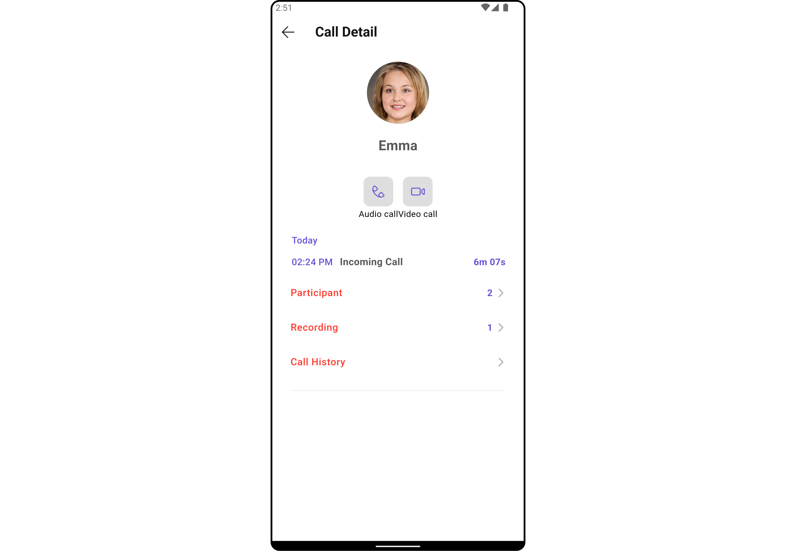

</TabItem>

<TabItem value="iOS" label="iOS">

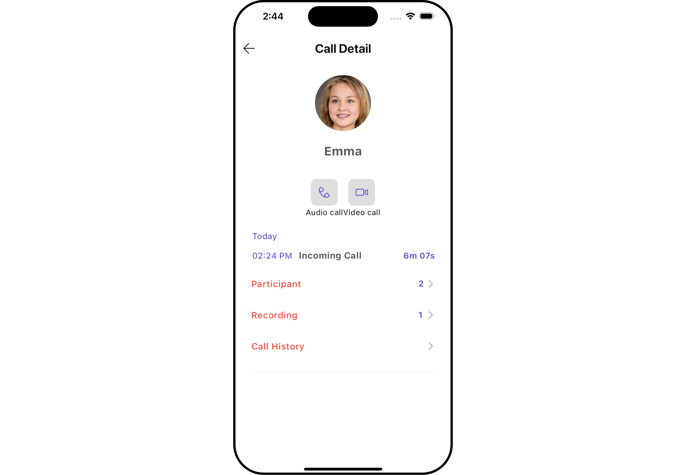

</TabItem>

</Tabs>

You can launch `CometChatCallLogDetails` directly using `Navigator.push`, or you can define it as a widget within the `build` method of your `State` class.

##### 1. Using Navigator to Launch `CometChatCallLogDetails`

<Tabs>

<TabItem value="Dart" label="Dart">

```dart
Navigator.push(context, MaterialPageRoute(builder: (context) => CometChatCallLogDetails(callLog: callLogObject))); // Call Log object is required to launch the CometChatCallLogDetails widget.
```

</TabItem>

</Tabs>

##### 2. Embedding `CometChatCallLogDetails` as a Widget in the build Method

<Tabs>

<TabItem value="Dart" label="Dart">

```dart
import 'package:cometchat_calls_uikit/cometchat_calls_uikit.dart';
import 'package:flutter/material.dart';

class CallLogDetailsExample extends StatefulWidget {
  const CallLogDetailsExample({super.key});

  @override
  State<CallLogDetailsExample> createState() => _CallLogDetailsExampleState();
}

class _CallLogDetailsExampleState extends State<CallLogDetailsExample> {

  @override
  Widget build(BuildContext context) {
    return Scaffold(
      body: SafeArea(
        child: Center(
          child: CometChatCallLogDetails(
            callLog: callLogObject
          ) // Call Log object is required to launch the CometChatCallLogDetails widget.
        )
      ),
    );
  }
}
```

</TabItem>

</Tabs>

---

### Actions

[Actions](/ui-kit/flutter/components-overview#actions) dictate how a widget functions. They are divided into two types: Predefined and User-defined. You can override either type, allowing you to tailor the behavior of the widget to fit your specific needs.

##### 1. OnError

You can customize this behavior by using the provided code snippet to override the `OnError` and improve error handling.

<Tabs>

<TabItem value="Dart" label="Dart">

```dart
CometChatCallLogDetails(
  callLog: callLogObject,
  onError: (e) {
    // TODO("Not yet implemented")
  },
)
```

</TabItem>

</Tabs>

---

##### 2. onBack

You can customize this behavior by using the provided code snippet to override the `onBack` and improve error handling.

<Tabs>

<TabItem value="Dart" label="Dart">

```dart
CometChatCallLogDetails(
  callLog: callLogObject,
  onBack: () {
    // TODO("Not yet implemented")
  },
)
```

</TabItem>

</Tabs>

---

### Filters

**Filters** allow you to customize the data displayed in a list within a Widget. You can filter the list based on your specific criteria, allowing for a more customized. Filters can be applied using RequestBuilders of Chat SDK.

The `CometChatCallLogDetails` widget does not have any exposed filters.

---

### Events

[Events](/ui-kit/flutter/components-overview#events) are emitted by a `Widget`. By using event you can extend existing functionality. Being global events, they can be applied in Multiple Locations and are capable of being Added or Removed.

The `CometChatCallLogDetails` widget does not have any exposed events.

---

## Customization

To fit your app's design requirements, you can customize the appearance of the conversation widget. We provide exposed methods that allow you to modify the experience and behavior according to your specific needs.

### Style

Using Style you can customize the look and feel of the widget in your app, These parameters typically control elements such as the color, size, shape, and fonts used within the widget.

##### 1. CallLogDetails Style

You can customize the appearance of the `CometChatCallLogDetails` Widget by applying the `CallLogDetailsStyle` to it using the following code snippet.

<Tabs>

<TabItem value="Dart" label="Dart">

```dart
CometChatCallLogDetails(
  callLog: callLogObject,
  detailStyle: const CallLogDetailsStyle(
    background: Color(0xFFE4EBF5),
    titleStyle: TextStyle(
      color: Colors.red,
      fontSize: 20,
      fontWeight: FontWeight.bold,
    ),
    separatorDateStyle: TextStyle(
      color: Colors.blue,
      fontSize: 14,
      fontWeight: FontWeight.bold,
    ),
    timeStyle: TextStyle(
      color: Colors.orange,
      fontSize: 12,
      fontWeight: FontWeight.bold,
    ),
    durationStyle: TextStyle(
      color: Colors.purple,
      fontSize: 10,
      fontWeight: FontWeight.bold,
    ),
    countStyle: TextStyle(
      color: Colors.yellow,
      fontSize: 8,
      fontWeight: FontWeight.bold,
    ),
    callStatusStyle: TextStyle(
      color: Colors.pink,
      fontSize: 10,
      fontWeight: FontWeight.bold,
    ),
    arrowIconTint: Colors.green,
  )
)
```

</TabItem>

</Tabs>

<Tabs>

<TabItem value="Android" label="Android">


</TabItem>

<TabItem value="iOS" label="iOS">


</TabItem>

</Tabs>

List of properties exposed by `CallLogDetailsStyle`

| **Property**             | **Description**                             | **Code**                         |
| ------------------------ | ------------------------------------------- | -------------------------------- |
| **Arrow Icon Tint**      | Sets the color for the arrow icon.          | `arrowIconTint: Color?`          |
| **Background**           | Sets the background color.                  | `background: Color?`             |
| **Back Icon Tint**       | Sets the color for the back icon.           | `backIconTint: Color?`           |
| **Border**               | Sets the border.                            | `border: BoxBorder?`             |
| **Call Status Style**    | Sets the style for the call status text.    | `callStatusStyle: TextStyle?`    |
| **Count Style**          | Sets the style for the count text.          | `countStyle: TextStyle?`         |
| **Duration Style**       | Sets the style for the duration text.       | `durationStyle: TextStyle?`      |
| **Gradient**             | Sets the background gradient.               | `gradient: Gradient?`            |
| **Height**               | Sets the height of the widget.              | `height: double?`                |
| **Name Style**           | Sets the style for the name text.           | `nameStyle: TextStyle?`          |
| **Separator Date Style** | Sets the style for the separator date text. | `separatorDateStyle: TextStyle?` |
| **Time Style**           | Sets the style for the time text.           | `timeStyle: TextStyle?`          |
| **Title Style**          | Sets the style for the title text.          | `titleStyle: TextStyle?`         |
| **Video Call Icon Tint** | Sets the color for the video call icon.     | `videoCallIconTint: Color?`      |
| **Voice Call Icon Tint** | Sets the color for the voice call icon.     | `voiceCallIconTint: Color?`      |
| **Width**                | Sets the width of the widget.               | `width: double?`                 |

---

##### 2. Avatar Styles

To apply customized styles to the `Avatar` widget in the `CometChatCallLogDetails` Widget, you can use the following code snippet. For further insights on `Avatar` Styles [refer](/ui-kit/flutter/avatar#avatarstyle)

<Tabs>

<TabItem value="Dart" label="Dart">

```dart
CometChatCallLogDetails(
  callLog: callLogObject,
  avatarStyle: AvatarStyle(
      border: Border.all(width: 5),
      borderRadius: 20,
      background: Colors.red
  ),
)
```

</TabItem>

</Tabs>

---

### Functionality

These are a set of small functional customizations that allow you to fine-tune the overall experience of the widget. With these, you can change text, set custom icons, and toggle the visibility of UI elements.

**Example**

Here is the example for reference:

<Tabs>

<TabItem value="Dart" label="Dart">

```dart
CometChatCallLogDetails(
  callLog: callLogObject,
  datePattern: DateFormat("dd/MM/yyyy").format(DateTime.fromMillisecondsSinceEpoch(callLogObject!.startedAt!*1000)),
  separatorDatePattern: DateFormat("dd/MM/yyyy").format(DateTime.fromMillisecondsSinceEpoch(callLogObject!.endedAt!*1000)),
)
```

</TabItem>

</Tabs>

<Tabs>

<TabItem value="Android" label="Android">


</TabItem>

<TabItem value="iOS" label="iOS">


</TabItem>

</Tabs>

Below is a list of customizations along with corresponding code snippets

| **Property**               | **Description**                             | **Code**                        |
| -------------------------- | ------------------------------------------- | ------------------------------- |
| **Arrow Icon**             | Sets the arrow icon.                        | `arrowIcon: Widget?`            |
| **Back Button**            | Sets the back button widget.                | `backButton: Widget?`           |
| **Date Pattern**           | Sets the date pattern.                      | `datePattern: String?`          |
| **Separator Date Pattern** | Sets the separator date pattern.            | `separatorDatePattern: String?` |
| **Show Back Button**       | Determines whether to show the back button. | `showBackButton: bool`          |
| **Theme**                  | Sets the theme.                             | `theme: ThemeData?`             |
| **Title**                  | Sets the title.                             | `title: String?`                |

---

### Advanced

For advanced-level customization, you can set custom widgets to the widget. This lets you tailor each aspect of the widget to fit your exact needs and application aesthetics. You can create and define your widgets, layouts, and UI elements and then incorporate those into the widget.

#### CustomProfile View

You can customize your Profile widget to meet your specific preferences and needs.

<Tabs>

<TabItem value="Dart" label="Dart">

```dart
CometChatCallLogDetails(
  callLog: callLogObject,
  customProfileView: const Row(
    crossAxisAlignment: CrossAxisAlignment.center,
    mainAxisAlignment: MainAxisAlignment.center,
    children: [
      Icon(Icons.person, color: Color(0xFF6851D6), size: 50,),
      SizedBox(width: 20,),
      Text("User Name"),
    ],
  ),
)
```

</TabItem>

</Tabs>

<Tabs>

<TabItem value="Android" label="Android">

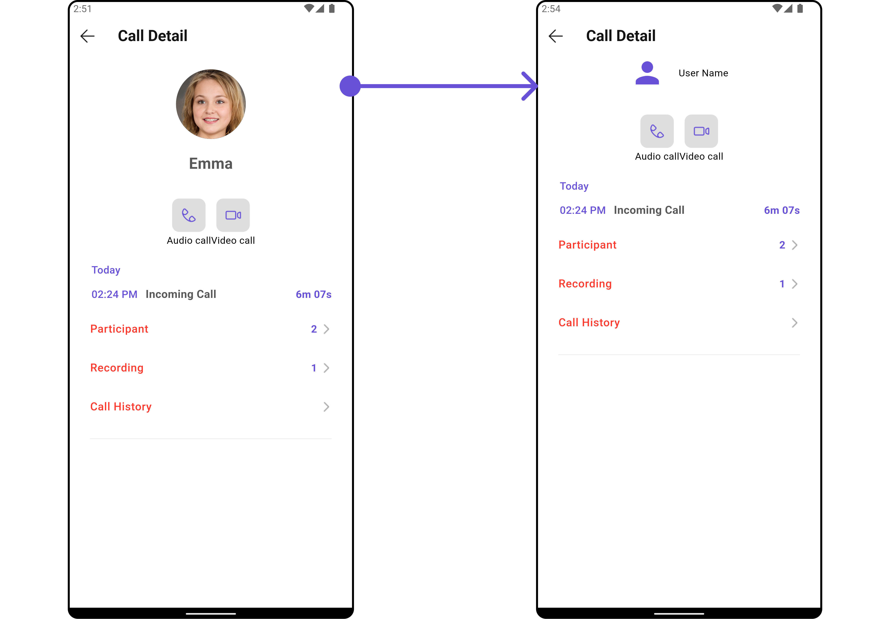

</TabItem>

<TabItem value="iOS" label="iOS">

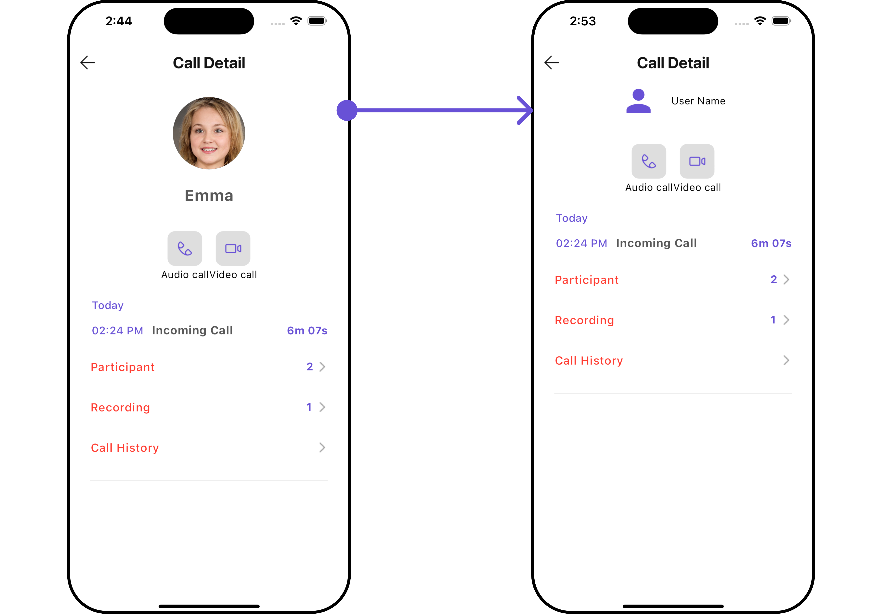

</TabItem>

</Tabs>

---

#### Template and Options

##### 1. Options

The `CometChatCallLogDetailsOption` is the class providing structure for options to be shown.

<Tabs>

<TabItem value="Dart" label="Dart">

```dart title="Option"
CometChatCallLogDetailsOption option1 = CometChatCallLogDetailsOption(
    id: "templateId1",
    onClick: (callLog, section, state) {},
    tail: const Icon(
    Icons.add_alert,
    color: Colors.pink,
    ),
    title: "Option 1",
    titleStyle: TextStyle(
        backgroundColor: Colors.lightBlue.shade200,
        fontWeight: FontWeight.bold
    ),
    icon: AssetConstants.heart,
    packageName: UIConstants.packageName
); // Created custom option
```

</TabItem>

</Tabs>

List of Functionality used to customize the appearance of the `CometChatCallLogDetailsOption` widget.

| **Property**     | **Description**                            | **Code**                    |
| ---------------- | ------------------------------------------ | --------------------------- |
| **Custom View**  | Sets a custom view widget.                 | `customView: Widget?`       |
| **On Click**     | Callback function to be executed on click. | `onClick: void Function()?` |
| **Tail**         | Sets the tail widget.                      | `tail: Widget?`             |
| **ID**           | Unique identifier for the option.          | `id: String`                |
| **Height**       | Sets the height of the option.             | `height: double?`           |
| **Title**        | Sets the title text.                       | `title: String?`            |
| **Icon**         | Sets the icon URL.                         | `icon: String?`             |
| **Package Name** | Sets the package name for the icon.        | `packageName: String?`      |
| **Title Style**  | Sets the text style for the title.         | `titleStyle: TextStyle?`    |

##### 2. Template

The `CometChatCallLogDetailsTemplate` defines the structure for sections of options available in the `CometChatCallLogDetails`

<Tabs>

<TabItem value="Dart" label="Dart">

```dart
CometChatCallLogDetailsTemplate template = CometChatCallLogDetailsTemplate(
    id: "templateId2",
    hideItemSeparator: false,
    hideSectionSeparator: false,
    itemSeparatorColor: Colors.deepOrange,
    sectionSeparatorColor: Colors.pink,
    title: "Custom Template",
    titleStyle: const TextStyle(
        backgroundColor: Colors.yellow,
        fontWeight: FontWeight.bold
    ),
    options: (callLog, context, theme) => [option1, option2] // Added the options here
); // Created Template
```

</TabItem>

</Tabs>

List of Functionality exposed by `CometChatCallLogDetailsTemplate`

| **Property**                | **Description**                            | **Code**                                        |
| --------------------------- | ------------------------------------------ | ----------------------------------------------- |
| **ID**                      | Unique identifier for the template.        | `id: String`                                    |
| **Options**                 | List of options available in the template. | `options: List<CometChatCallLogDetailsOption>?` |
| **Title**                   | Title text for the template.               | `title: String?`                                |
| **Title Style**             | Text style for the title.                  | `titleStyle: TextStyle?`                        |
| **Section Separator Color** | Color for the section separator.           | `sectionSeparatorColor: Color?`                 |
| **Hide Section Separator**  | Flag to hide the section separator.        | `hideSectionSeparator: bool?`                   |
| **Item Separator Color**    | Color for the item separator.              | `itemSeparatorColor: Color?`                    |
| **Hide Item Separator**     | Flag to hide the item separator.           | `hideItemSeparator: bool?`                      |

**Example**

Here is the complete example for reference:

<Tabs>

<TabItem value="Dart" label="Dart">

```dart
CometChatCallLogDetails(
  callLog: callLogObject,
  data: (callLog) {
    CometChatCallLogDetailsOption option1 = CometChatCallLogDetailsOption(
        id: "templateId1",
        onClick: (callLog, section, state) {},
        tail: const Icon(
          Icons.add_alert,
          color: Colors.pink,
        ),
        title: "Option 1",
        titleStyle: TextStyle(
            backgroundColor: Colors.lightBlue.shade200,
            fontWeight: FontWeight.bold
        ),
        icon: AssetConstants.heart,
        packageName: UIConstants.packageName
    ); // Created custom option 1

    CometChatCallLogDetailsOption option2 = CometChatCallLogDetailsOption(
        id: "OPTION_ID_2",
        onClick: (callLog, section, state) {},
        tail: const Icon(
          Icons.account_balance_wallet,
          color: Colors.pink,
        ),
        title: "Option 2",
        titleStyle: TextStyle(
            backgroundColor: Colors.lightBlue.shade200,
            fontWeight: FontWeight.bold
        ),
        icon: AssetConstants.heart,
        packageName: UIConstants.packageName
    ); // Created custom option 2

    CometChatCallLogDetailsTemplate template = CometChatCallLogDetailsTemplate(
        id: "templateId2",
        hideItemSeparator: false,
        hideSectionSeparator: false,
        itemSeparatorColor: Colors.deepOrange,
        sectionSeparatorColor: Colors.pink,
        title: "Custom Template",
        titleStyle: const TextStyle(
            backgroundColor: Colors.yellow,
            fontWeight: FontWeight.bold
        ),
        options: (callLog, context, theme) => [option1, option2] // Added the options here
    ); // Created Template

    return [template]; // Return the template as a list
  },
)
```

</TabItem>

</Tabs>

<Tabs>

<TabItem value="Android" label="Android">

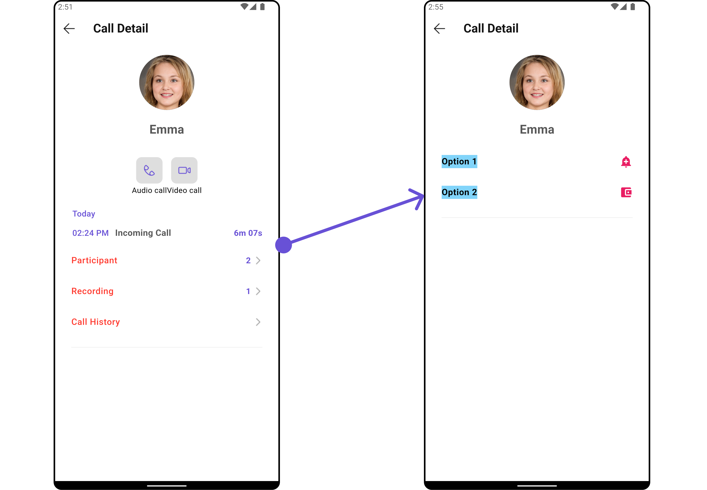

</TabItem>

<TabItem value="iOS" label="iOS">

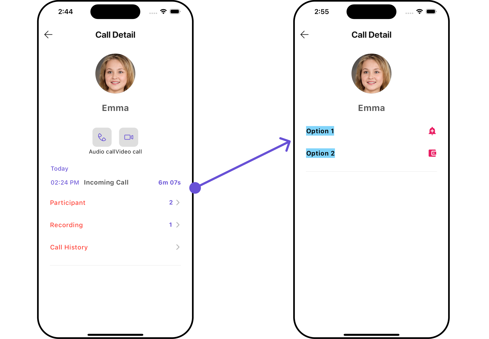

</TabItem>

</Tabs>

---

## Configurations

[Configurations](/ui-kit/flutter/components-overview#configurations) offer the ability to customize the properties of each widget within a Composite Widget.

`CometChatCallLogDetails` has `Call Log History`, `Call Log Recordings` and `Call Log Participants` widget. Hence, each of these widgets will have its individual `Configuration`.

- `Configurations` expose properties that are available in its individual widgets.

#### Call Log History

You can customize the properties of the Call Log History widget by making use of the `callLogHistoryConfiguration`. You can accomplish this by employing the `callLogHistoryConfiguration` props as demonstrated below:

<Tabs>

<TabItem value="Dart" label="Dart">

```dart
CometChatCallLogDetails(
    callLog: callLogObject,
    callLogHistoryConfiguration: CallLogHistoryConfiguration(
        title: "Your Title",
        callLogHistoryStyle: CallLogHistoryStyle(
          background: Color(0xFFE4EBF5),
        )
    )
)
```

</TabItem>

</Tabs>

<Tabs>

<TabItem value="Android" label="Android">

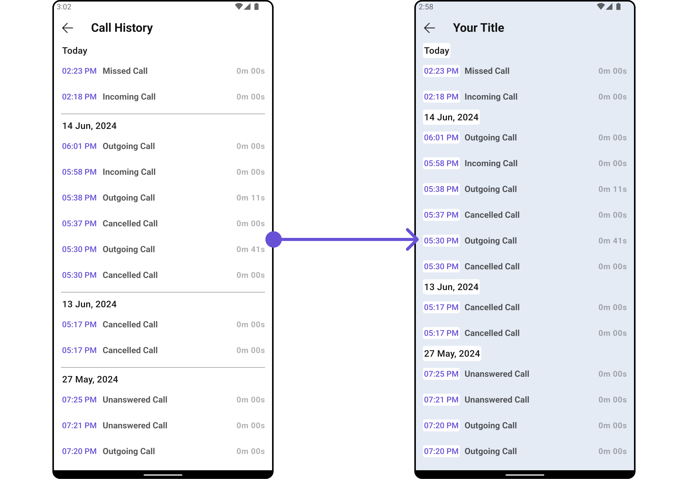

</TabItem>

<TabItem value="iOS" label="iOS">

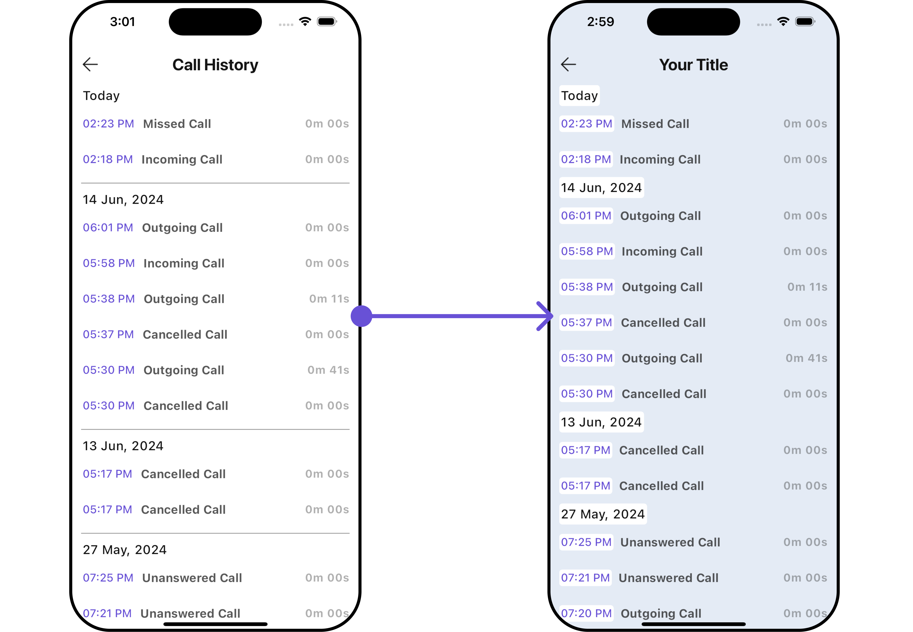

</TabItem>

</Tabs>

All exposed properties of `CallLogHistoryConfiguration` can be found under [Call Log History](./call-log-history#functionality). Properties marked with the <a data-tooltip-id="my-tooltip-html-prop"><span class="material-icons red">report</span></a> symbol are not accessible within the Configuration Object.

---

#### Call Log Recordings

You can customize the properties of the Call Log Recordings widget by making use of the `callLogRecordingsConfiguration`. You can accomplish this by employing the `callLogRecordingsConfiguration` props as demonstrated below:

<Tabs>

<TabItem value="Dart" label="Dart">

```dart
CometChatCallLogDetails(
    callLog: callLogObject,
    recordingsConfiguration: CallLogRecordingsConfiguration(
        title: "Your Title",
        recordingsStyle: CallLogRecordingsStyle(
          background: Color(0xFFE4EBF5),
        )
    )
)
```

</TabItem>

</Tabs>

<Tabs>

<TabItem value="Android" label="Android">

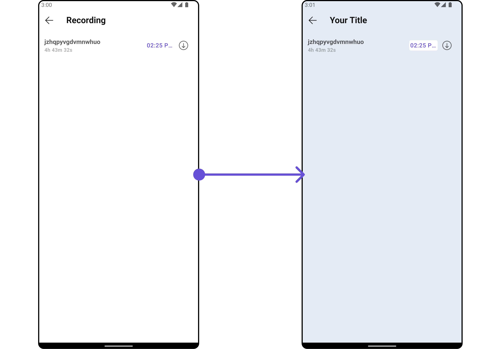

</TabItem>

<TabItem value="iOS" label="iOS">

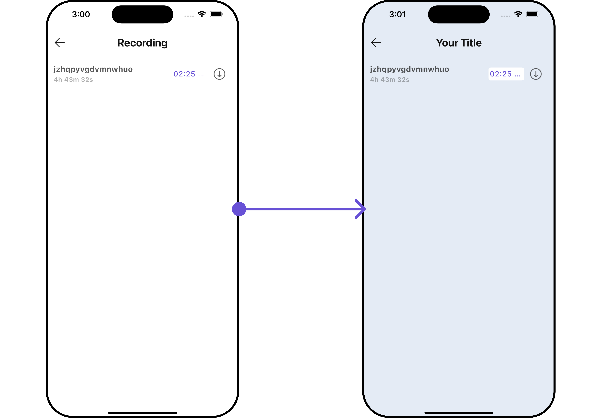

</TabItem>

</Tabs>

All exposed properties of `CallLogRecordingsConfiguration` can be found under [Call Log Recordings](/ui-kit/flutter/call-log-recording#functionality). Properties marked with the <a data-tooltip-id="my-tooltip-html-prop"><span class="material-icons red">report</span></a> symbol are not accessible within the Configuration Object.

---

#### Call Log Participants

You can customize the properties of the Call Log Participants widget by making use of the `callLogParticipantsConfiguration`. You can accomplish this by employing the `callLogParticipantsConfiguration` props as demonstrated below:

<Tabs>

<TabItem value="Dart" label="Dart">

```dart
CometChatCallLogDetails(
  callLog: callLogObject,
  participantsConfiguration: CallLogParticipantsConfiguration(
    title: "Your Title",
    listItemStyle: const ListItemStyle(
      background: Color(0xFFE4EBF5)
    )
  )
)
```

</TabItem>

</Tabs>

<Tabs>

<TabItem value="Android" label="Android">

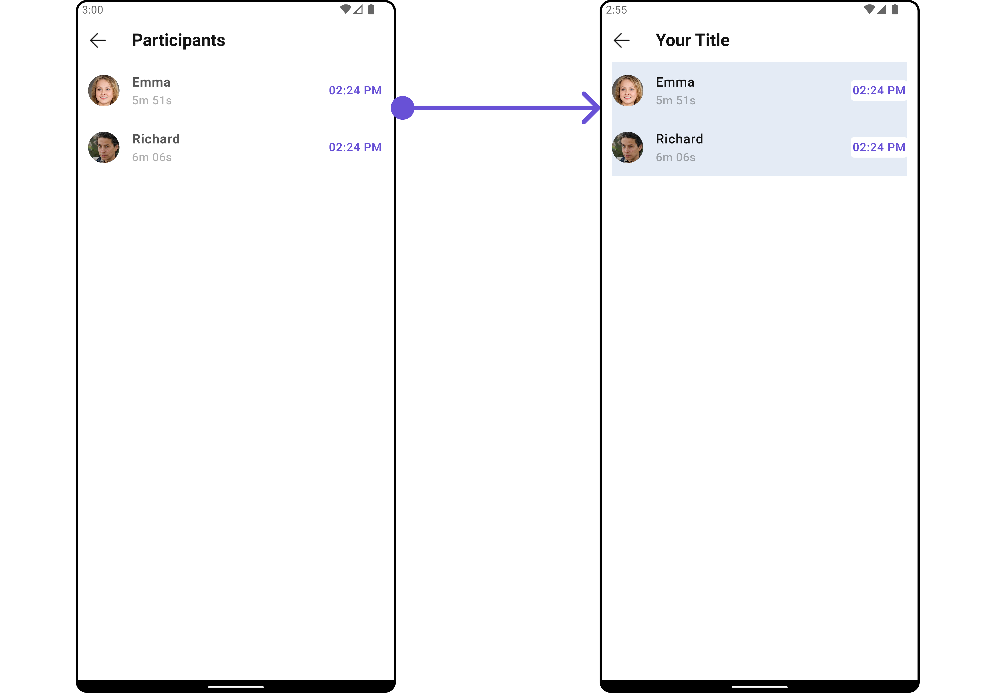

</TabItem>

<TabItem value="iOS" label="iOS">

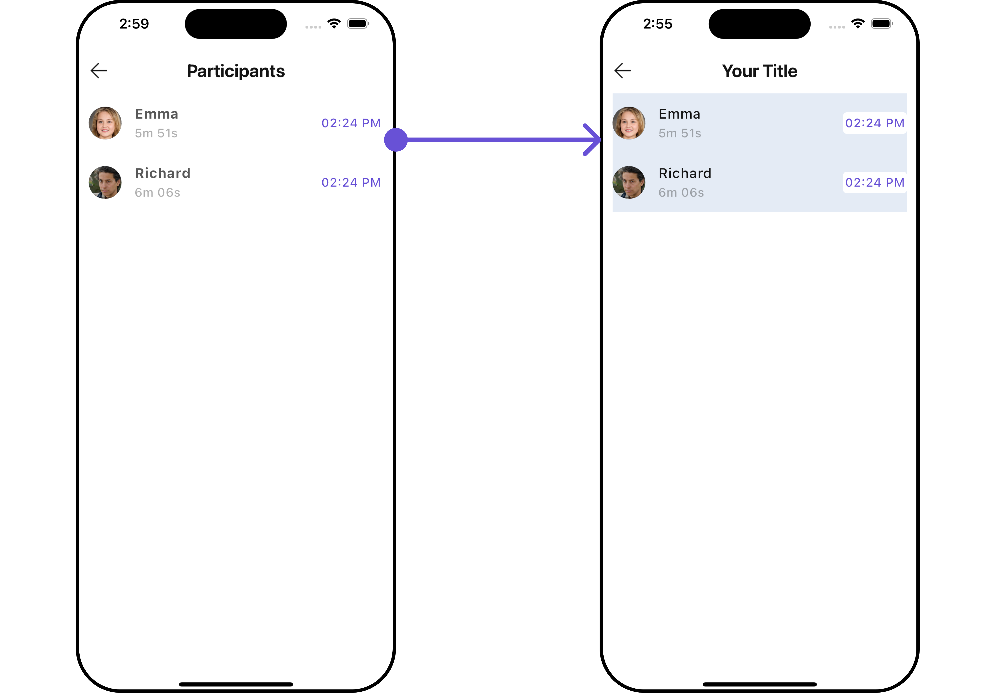

</TabItem>

</Tabs>

All exposed properties of `CallLogParticipantsConfiguration` can be found under [Call Log Participants](./call-log-participants#functionality). Properties marked with the <a data-tooltip-id="my-tooltip-html-prop"><span class="material-icons red">report</span></a> symbol are not accessible within the Configuration Object.

---
