import Tabs from '@theme/Tabs';
import TabItem from '@theme/TabItem';
import { Tooltip } from 'react-tooltip'
import 'react-tooltip/dist/react-tooltip.css'

<Tooltip id="my-tooltip-html-prop" html="Not available in Group Members Configuration object"/>

## Overview

`CometChatCallLogParticipants` is a [Widget](/ui-kit/flutter/components-overview#components) that shows a separate widget that displays comprehensive information about Call. This will enable users to easily access details such as the call participants, and call details for a more informed communication experience.

<Tabs>

<TabItem value="Android" label="Android">

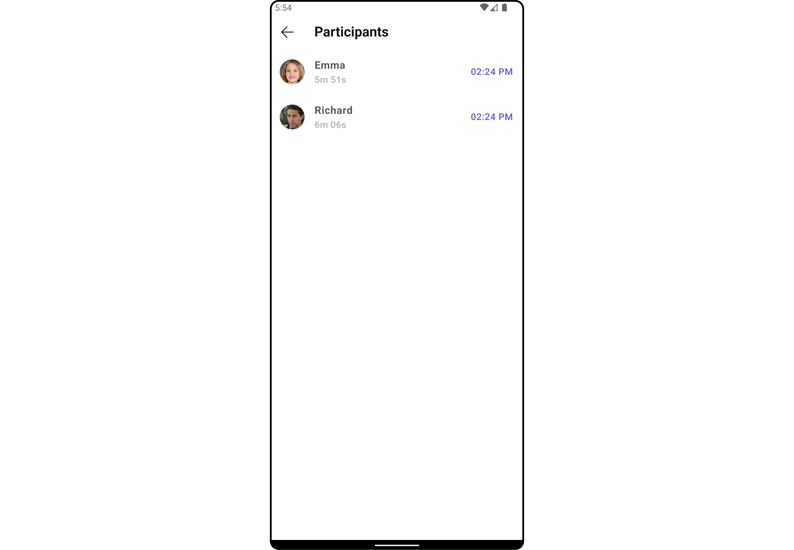

</TabItem>

<TabItem value="iOS" label="iOS">

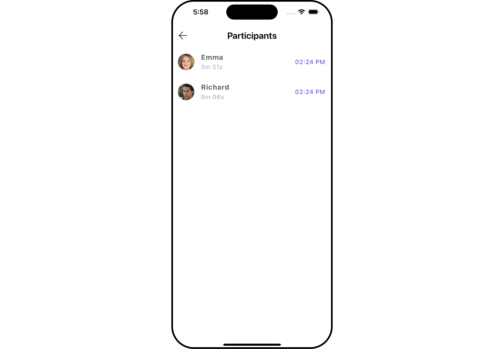

</TabItem>

</Tabs>

The `CometChatCallLogParticipants` widget is composed of the following BaseWidgets:

| Widgets                                        | Description                                                                                                                                                                             |
| ---------------------------------------------- | --------------------------------------------------------------------------------------------------------------------------------------------------------------------------------------- |
| [CometChatListBase](/ui-kit/flutter/list-base) | `CometChatListBase` is a container widget featuring a title, customizable background options, and a dedicated list widget for seamless integration within your application's interface. |
| [CometChatListItem](/ui-kit/flutter/list-item) | This widget displays data retrieved from a CallLog object on a card, presenting a title and subtitle.                                                                                   |

---

## Usage

### Integration

`CometChatCallLogParticipants` is a widget that seamlessly integrates into your application. To present the participants of a call, you can instantiate the `CometChatCallLogParticipants` instance and provide the list of participants using its setter function. This allows for easy customization and efficient display of call participant details within your application's interface.

You can launch `CometChatCallLogParticipants` directly using `Navigator.push`, or you can define it as a widget within the `build` method of your `State` class.

##### 1. Using Navigator to Launch `CometChatCallLogParticipants`

<Tabs>

<TabItem value="Dart" label="Dart">

```dart
Navigator.push(context, MaterialPageRoute(builder: (context) => CometChatCallLogParticipants(callLog: callLogObject))); // CallLog object is required to launch the CometChatCallLogParticipants widget.
```

</TabItem>

</Tabs>

##### 2. Embedding `CometChatCallLogParticipants` as a Widget in the build Method

<Tabs>

<TabItem value="Dart" label="Dart">

```dart
import 'package:cometchat_calls_uikit/cometchat_calls_uikit.dart';
import 'package:flutter/material.dart';

class CallLogParticipantExample extends StatefulWidget {
  const CallLogParticipantExample({super.key});

  @override
  State<CallLogParticipantExample> createState() => _CallLogParticipantExampleState();
}

class _CallLogParticipantExampleState extends State<CallLogParticipantExample> {
  @override
  Widget build(BuildContext context) {
    return Scaffold(
      body: SafeArea(
        child: CometChatCallLogParticipants(
          callLog: callLogObject,
        ) // CallLog object is required to launch the CometChatCallLogDetails widget.
      ),
    );
  }
}
```

</TabItem>

</Tabs>

---

### Actions

[Actions](/ui-kit/flutter/components-overview#actions) dictate how a widget functions. They are divided into two types: Predefined and User-defined. You can override either type, allowing you to tailor the behavior of the widget to fit your specific needs.

##### 1. onBack

You can customize this behavior by using the provided code snippet to override the `onBack` and improve error handling.

<Tabs>

<TabItem value="Dart" label="Dart">

```dart
CometChatCallLogParticipants(
  callLog: callLogObject,
  onBack: () {
    // TODO("Not yet implemented")
  },
)
```

</TabItem>

</Tabs>

---

##### 2. onError

You can customize this behavior by using the provided code snippet to override the `onError` and improve error handling.

<Tabs>

<TabItem value="Dart" label="Dart">

```dart
CometChatCallLogParticipants(
  callLog: callLogObject,
  onError: (e) {
    // TODO("Not yet implemented")
  },
)
```

</TabItem>

</Tabs>

---

### Filters

**Filters** allow you to customize the data displayed in a list within a Widget. You can filter the list based on your specific criteria, allowing for a more customized. Filters can be applied using RequestBuilders of Chat SDK.

The `CometChatCallLogParticipants` widget does not have any exposed filters.

---

### Events

[Events](/ui-kit/flutter/components-overview#events) are emitted by a `Widget`. By using event you can extend existing functionality. Being global events, they can be applied in Multiple Locations and are capable of being Added or Removed.

The `CometChatCallLogParticipants` widget does not have any exposed events.

---

## Customization

To fit your app's design requirements, you can customize the appearance of the conversation widget. We provide exposed methods that allow you to modify the experience and behavior according to your specific needs.

### Style

Using Style you can customize the look and feel of the widget in your app, These parameters typically control elements such as the color, size, shape, and fonts used within the widget.

##### 1. CallLogParticipants Style

You can customize the appearance of the `CallLogParticipantsStyle` Widget by applying the `CallLogParticipantsStyle` to it using the following code snippet.

<Tabs>

<TabItem value="Dart" label="Dart">

```dart
CometChatCallLogParticipants(
  callLog: callLogObject,
  participantsStyle: CallLogParticipantsStyle(
    background: Color(0xFFE4EBF5),
    titleStyle: const TextStyle(color: Colors.red, fontFamily: "PlaywritePL"),
    borderRadius: 10,
    border: Border.all(color: Colors.red, width: 2),
  ),
)
```

</TabItem>

</Tabs>

<Tabs>

<TabItem value="Android" label="Android">

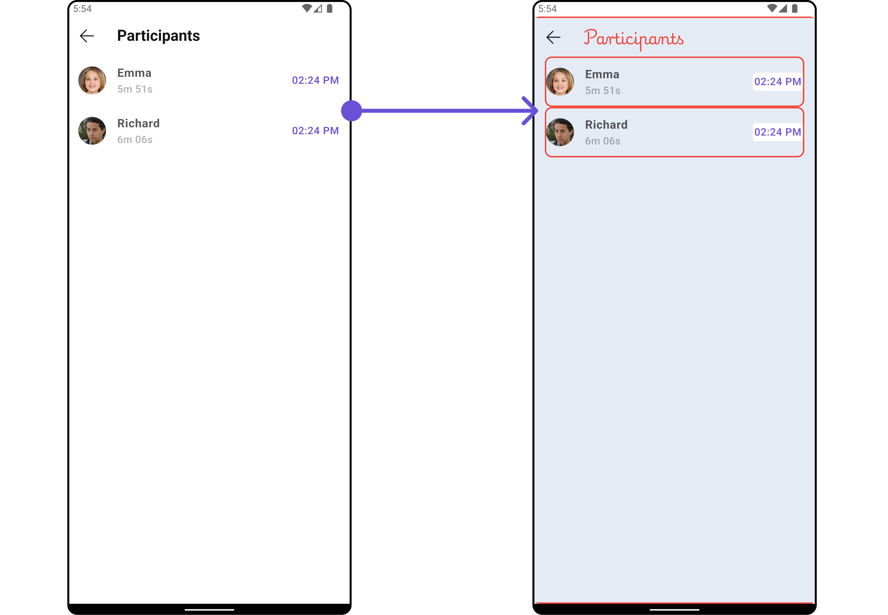

</TabItem>

<TabItem value="iOS" label="iOS">

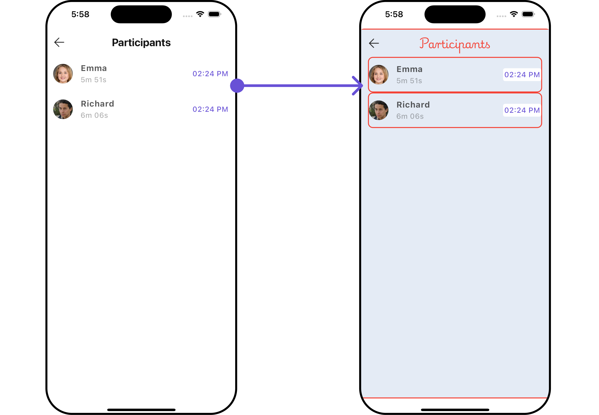

</TabItem>

</Tabs>

List of properties exposed by `CallLogParticipantsStyle`

| **Property**       | **Description**                                          | **Code**                    |
| ------------------ | -------------------------------------------------------- | --------------------------- |
| **width**          | The width of the call log participants style.            | `double? width`             |
| **height**         | The height of the call log participants style.           | `double? height`            |
| **background**     | The background color of the call log participants style. | `Color? background`         |
| **border**         | The border of the call log participants style.           | `BoxBorder? border`         |
| **borderRadius**   | The border radius of the call log participants style.    | `double? borderRadius`      |
| **gradient**       | The gradient of the call log participants style.         | `Gradient? gradient`        |
| **titleStyle**     | The text style for the title.                            | `TextStyle? titleStyle`     |
| **subTitleStyle**  | The text style for the subtitle.                         | `TextStyle? subTitleStyle`  |
| **emptyTextStyle** | The text style for the empty state.                      | `TextStyle? emptyTextStyle` |
| **backIconTint**   | The tint color for the back icon.                        | `Color? backIconTint`       |
| **tailTitleStyle** | The text style for the tail title.                       | `TextStyle? tailTitleStyle` |
| **nameTextStyle**  | The text style for the name.                             | `TextStyle? nameTextStyle`  |

---

##### 2. Avatar Style

To apply customized styles to the `Avatar` widget in the `CometChatCallLogParticipants` Widget, you can use the following code snippet. For more information, visit [Avatar Styles](./avatar).

<Tabs>

<TabItem value="Dart" label="Dart">

```dart
CometChatCallLogParticipants(
  callLog: callLogObject,
  avatarStyle: AvatarStyle(
    background: Color(0xFFE4EBF5),
    borderRadius: 10,
    border: Border.all(color: Colors.red, width: 2),
  ),
)
```

</TabItem>

</Tabs>

---

##### 3. ListItem Style

To apply customized styles to the List Item widget in the `CometChatCallLogParticipants` widget, You can use the following code snippet. For further insights on List Item Styles [refer](/ui-kit/flutter/list-item)

<Tabs>

<TabItem value="Dart" label="Dart">

```dart
CometChatCallLogParticipants(
  callLog: callLogObject,
  listItemStyle: ListItemStyle(
      background: Color(0xFFE4EBF5),
      borderRadius: 20,
      border: Border.all(width: 2),
      margin: const EdgeInsets.only(top: 10),
      padding: const EdgeInsets.only(left: 10)
  ),
)
```

</TabItem>

</Tabs>

---

### Functionality

These are a set of small functional customizations that allow you to fine-tune the overall experience of the widget. With these, you can change text, set custom icons, and toggle the visibility of UI elements.

<Tabs>

<TabItem value="Dart" label="Dart">

```dart
CometChatCallLogParticipants(
  callLog: callLogObject,
  title: "Your Title",
  backButton: Image.asset(
    "assets/img/back.png",
    width: 30,
    height: 30,
  ),
  hideSeparator: false
)
```

</TabItem>

</Tabs>

<Tabs>

<TabItem value="Android" label="Android">

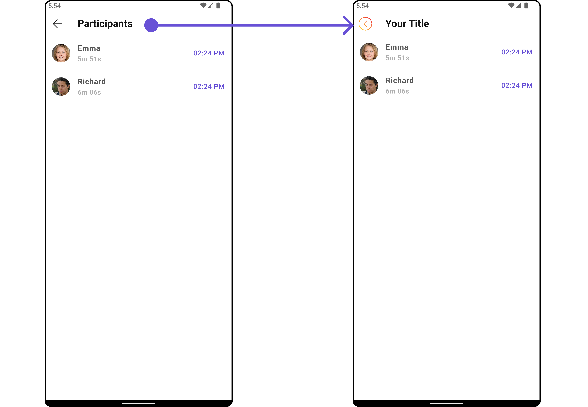

</TabItem>

<TabItem value="iOS" label="iOS">

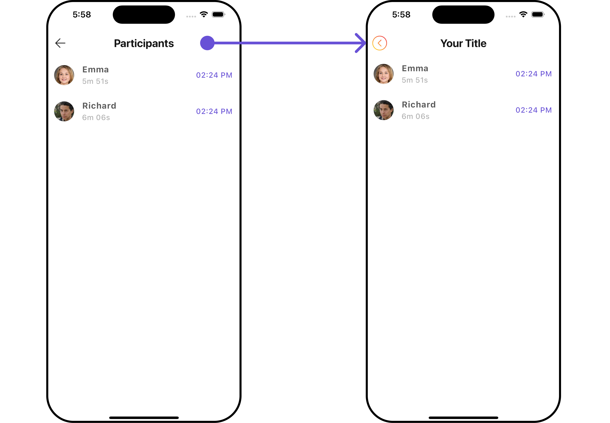

</TabItem>

</Tabs>

Below is a list of customizations along with corresponding code snippets

| **Property**       | **Description**                                  | **Code**                 |
| ------------------ | ------------------------------------------------ | ------------------------ |
| **title**          | The title of the call log participants.          | `String? title`          |
| **backButton**     | The custom back button widget.                   | `Widget? backButton`     |
| **showBackButton** | Whether to show the back button.                 | `bool? showBackButton`   |
| **emptyStateText** | The text to show when there are no participants. | `String? emptyStateText` |
| **theme**          | The theme of the call log participants.          | `Theme? theme`           |
| **datePattern**    | The pattern for formatting the date.             | `String? datePattern`    |
| **hideSeparator**  | Whether to hide the separator.                   | `bool hideSeparator`     |

---

### Advanced

For advanced-level customization, you can set custom widgets to the widget. This lets you tailor each aspect of the widget to fit your exact needs and application aesthetics. You can create and define your widgets, layouts, and UI elements and then incorporate those into the widget.

#### ListItemView

With this function, you can assign a custom ListItem widget to the `CometChatCallLogParticipants` Widget.

<Tabs>

<TabItem value="Dart" label="Dart">

```dart
CometChatCallLogParticipants(
  callLog: callLogObject,
  listItemView: (Participants participants, BuildContext context) {
    return Container(
      margin: const EdgeInsets.all(10),
      padding: const EdgeInsets.all(10),
      decoration: BoxDecoration(
        border: Border.all(color: Color(0xFF6851D6), width: 1), // Example border color
        borderRadius: BorderRadius.circular(8.0),
        color: Color(0xFFEEEEEE)
      ),
      child: Row(
        crossAxisAlignment: CrossAxisAlignment.center,
        children: [
          Text(participants.name!),
          const Spacer(),
          ClipOval(
            child: Image.network(
              participants.avatar!,
              width: 40.0,
              height: 40.0,
              fit: BoxFit.cover,
              errorBuilder: (context, error, stackTrace) {
                return const Icon(
                  Icons.person,
                  size: 40.0,
                );
              },
            ),
          ),
          const SizedBox(width: 20),
        ],
      ),
    );
  },
)
```

</TabItem>

</Tabs>

<Tabs>

<TabItem value="Android" label="Android">

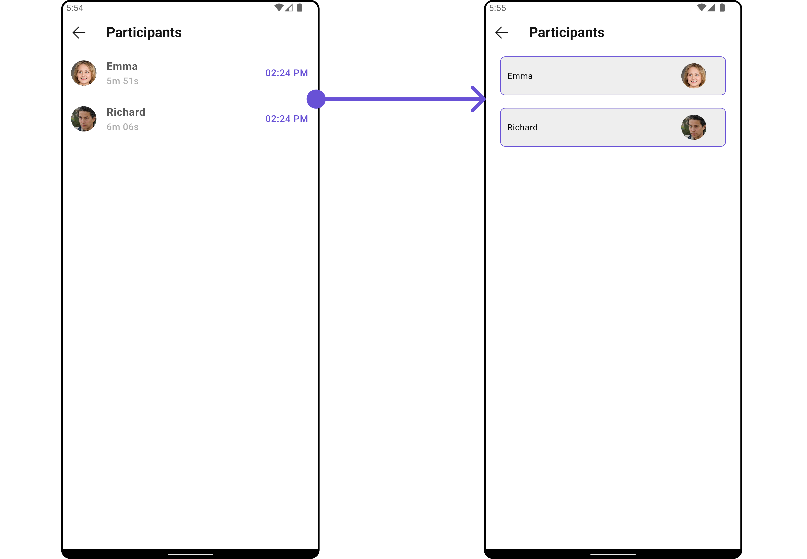

</TabItem>

<TabItem value="iOS" label="iOS">

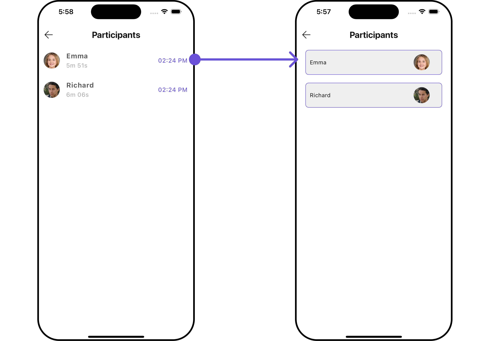

</TabItem>

</Tabs>

---

#### SubtitleView

You can customize the subtitle widget for each conversation item to meet your requirements

<Tabs>

<TabItem value="Dart" label="Dart">

```dart
CometChatCallLogParticipants(
  callLog: callLogObject,
  subTitleView: (BuildContext context, Participants participants) {
    return Row(
      children: [
        InkWell(
            onTap: () {
              // TODO("Not yet implemented")
            },
            child: const Icon(Icons.call, color: Color(0xFF6851D6), size: 25)
        ),
        const SizedBox(width: 10),
        InkWell(
            onTap: () {
              // TODO("Not yet implemented")
            },
            child: const Icon(Icons.video_call, color: Color(0xFF6851D6), size: 25)
        ),
      ],
    );
  },
)
```

</TabItem>

</Tabs>

<Tabs>

<TabItem value="Android" label="Android">

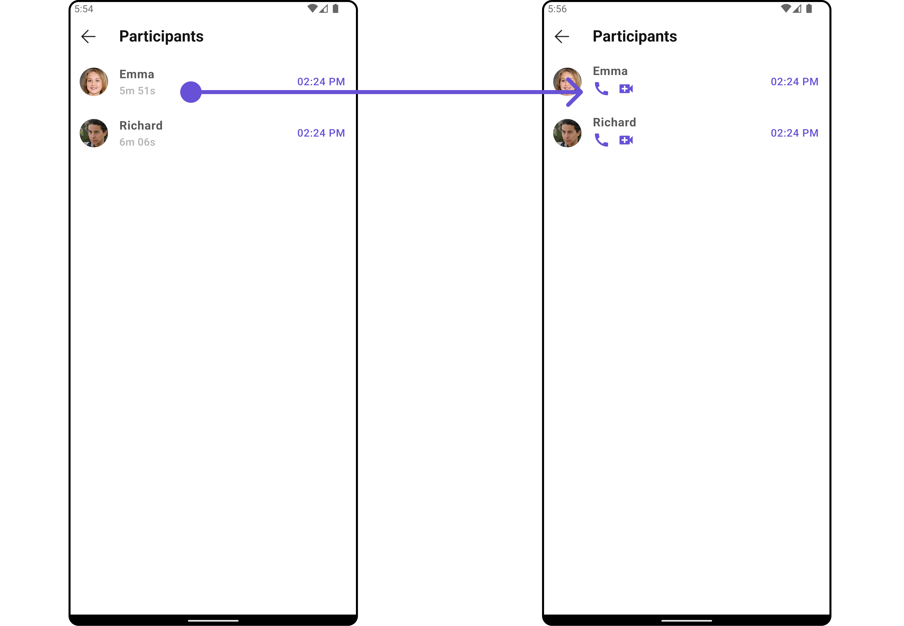

</TabItem>

<TabItem value="iOS" label="iOS">

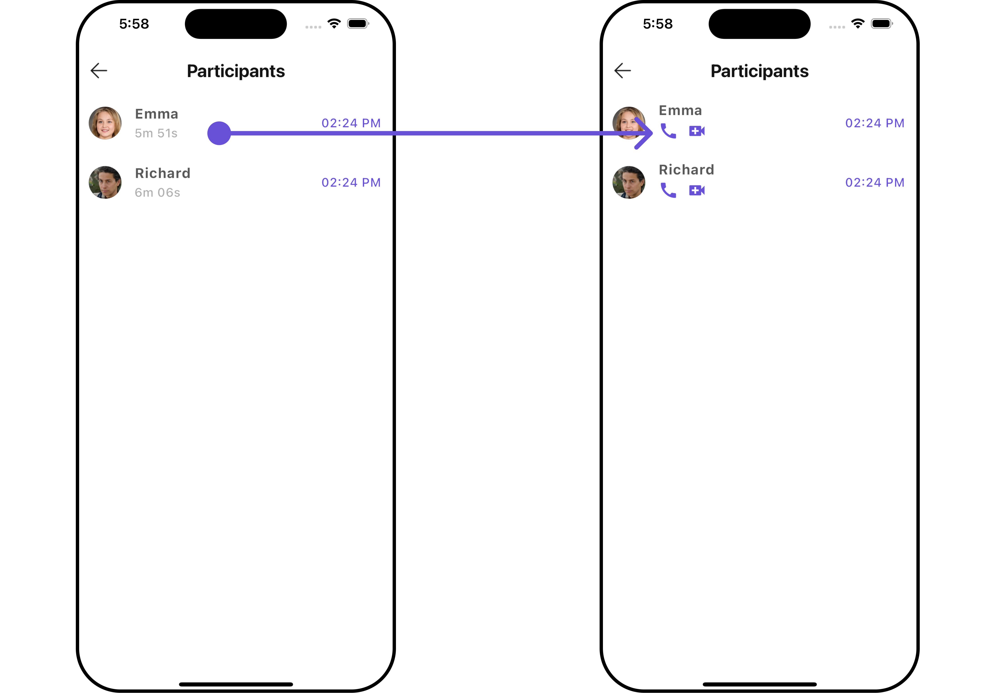

</TabItem>

</Tabs>

---

#### TailView

Used to generate a custom trailing widget for the `CometChatCallLogParticipants` widget. You can add a Tail widget using the following method.

<Tabs>

<TabItem value="Dart" label="Dart">

```dart
CometChatCallLogParticipants(
  callLog: callLogObject,
  tailView: (BuildContext context, Participants participants) {
    return SizedBox(
      width: 100,
      child: Row(
        children: [
          InkWell(
              onTap: () {
                // TODO("Not yet implemented")
              },
              child: const Icon(Icons.call, color: Color(0xFF6851D6), size: 25)
          ),
          const SizedBox(width: 10),
          InkWell(
              onTap: () {
                // TODO("Not yet implemented")
              },
              child: const Icon(Icons.video_call, color: Color(0xFF6851D6), size: 25)
          ),
        ],
      ),
    );
  },
)
```

</TabItem>

</Tabs>

<Tabs>

<TabItem value="Android" label="Android">

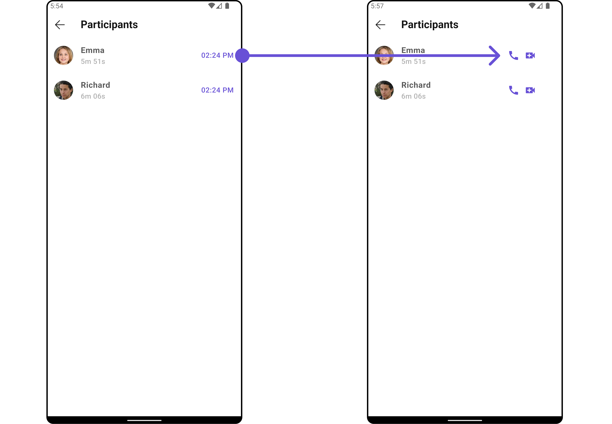

</TabItem>

<TabItem value="iOS" label="iOS">

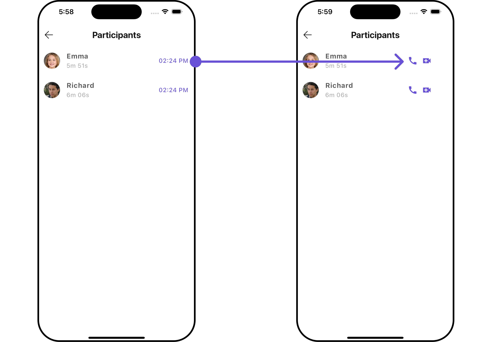

</TabItem>

</Tabs>

---

#### EmptyStateView

You can set a custom `EmptyStateView` using `emptyStateView` to match the empty UI of your app.

<Tabs>

<TabItem value="Dart" label="Dart">

```dart
CometChatCallLogParticipants(
  callLog: callLogObject,
  emptyStateView: (context) {
    return SizedBox(
      width: MediaQuery.of(context).size.width,
      child: const Center(
          child: Column(
            crossAxisAlignment: CrossAxisAlignment.center,
            mainAxisAlignment: MainAxisAlignment.center,
            children: [
              Spacer(),
              Icon(Icons.sms_failed_outlined, color: Colors.red, size: 100,),
              SizedBox(height: 20,),
              Text("Your Custom Message"),
              Spacer(),
            ],
          )
      ),
    );
  },
)
```

</TabItem>

</Tabs>

<Tabs>

<TabItem value="Android" label="Android">

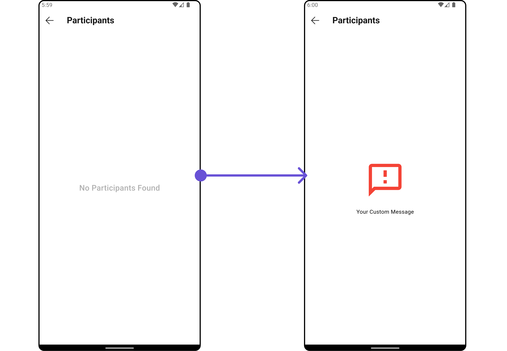

</TabItem>

<TabItem value="iOS" label="iOS">

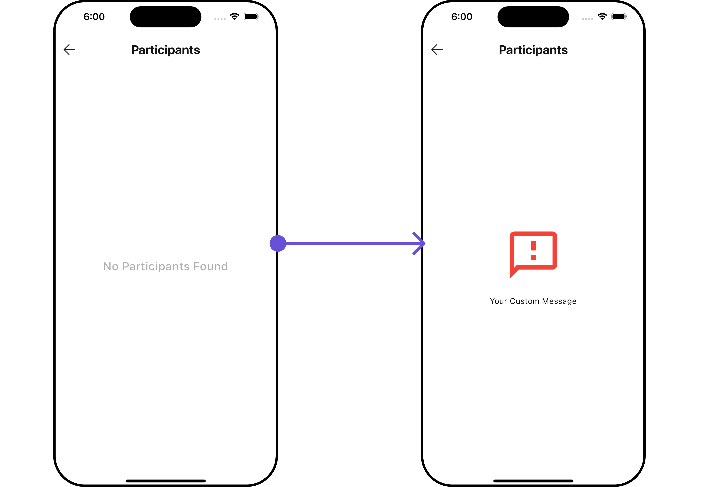

</TabItem>

</Tabs>

---
