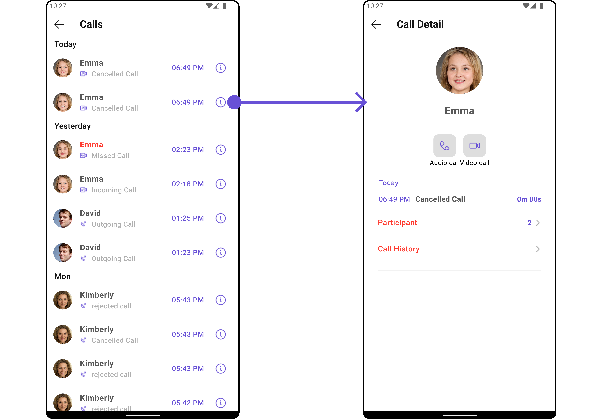
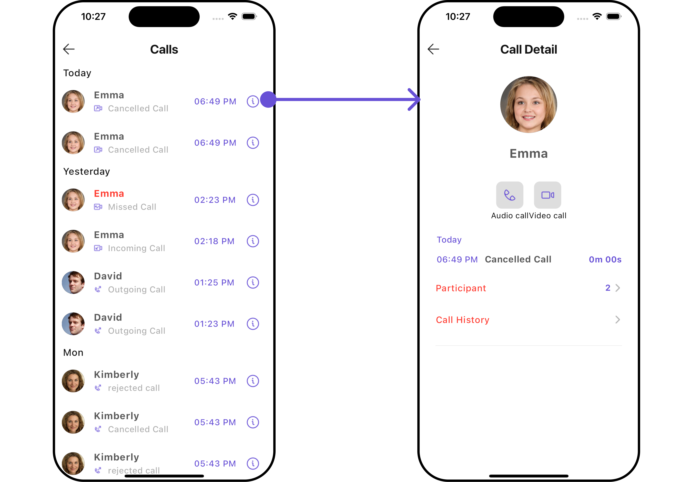
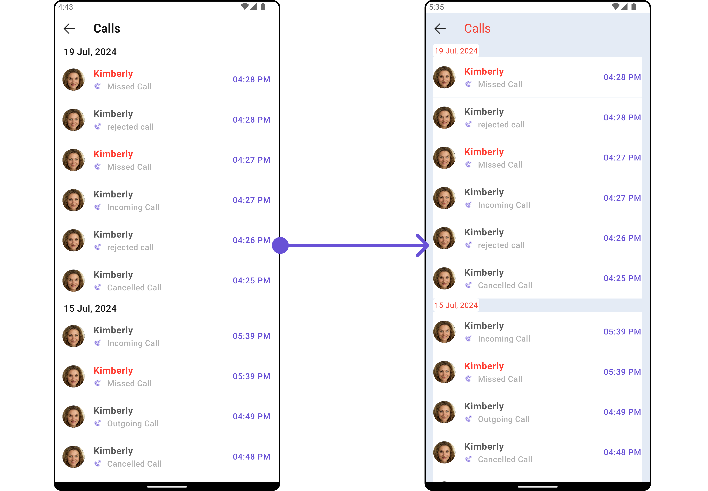
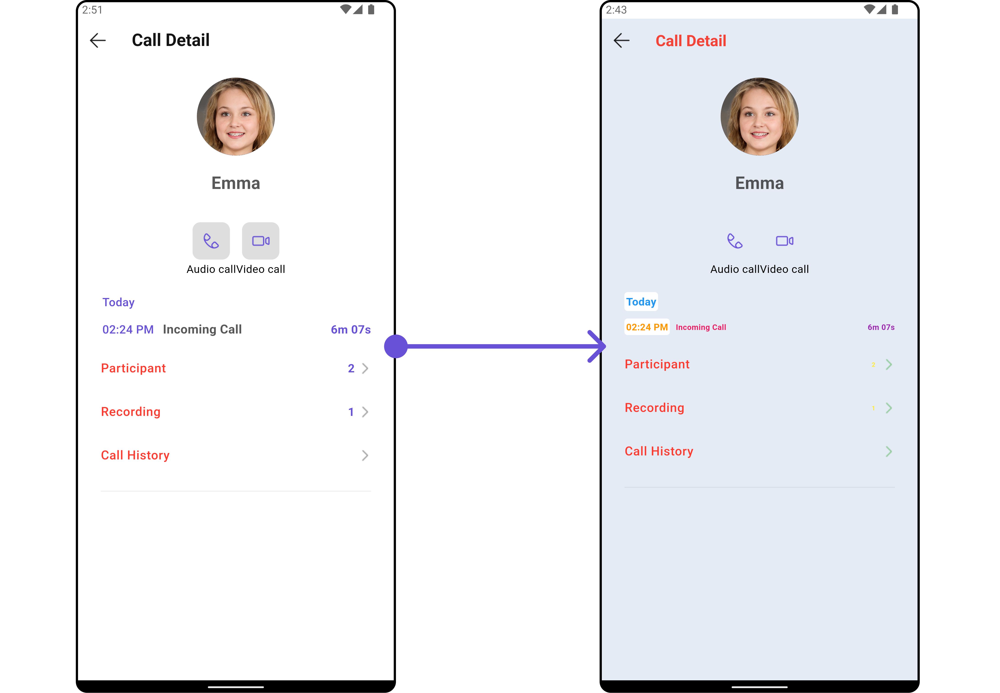
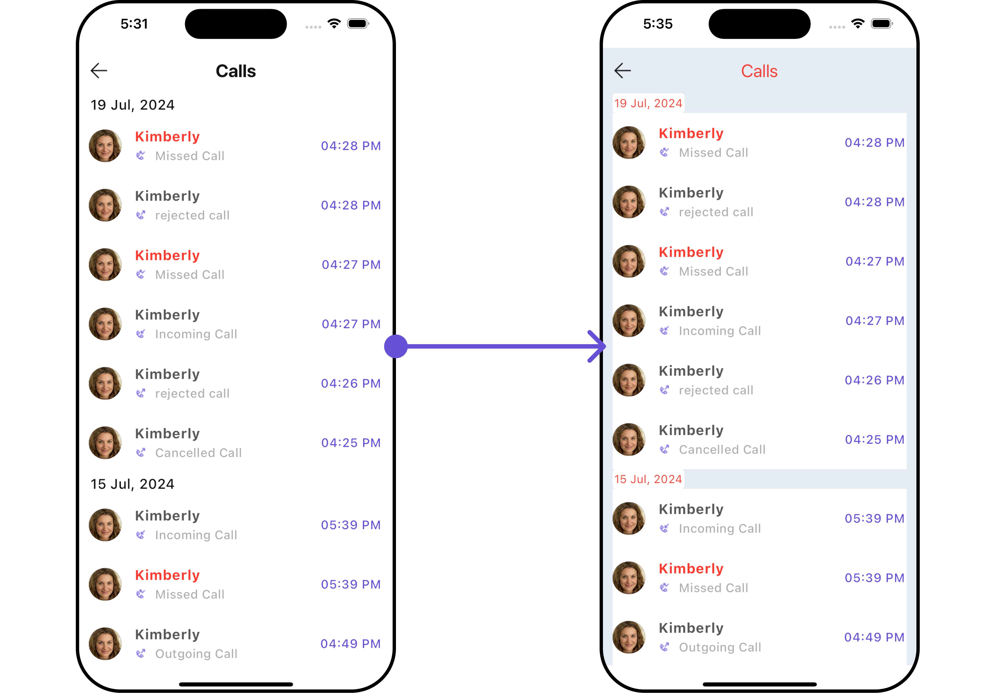
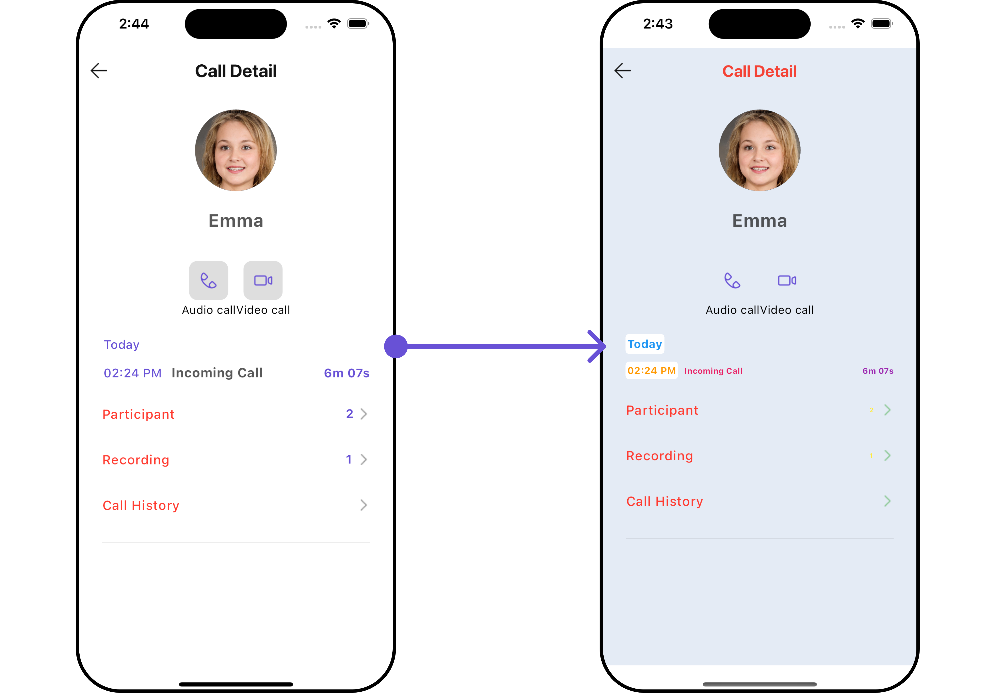
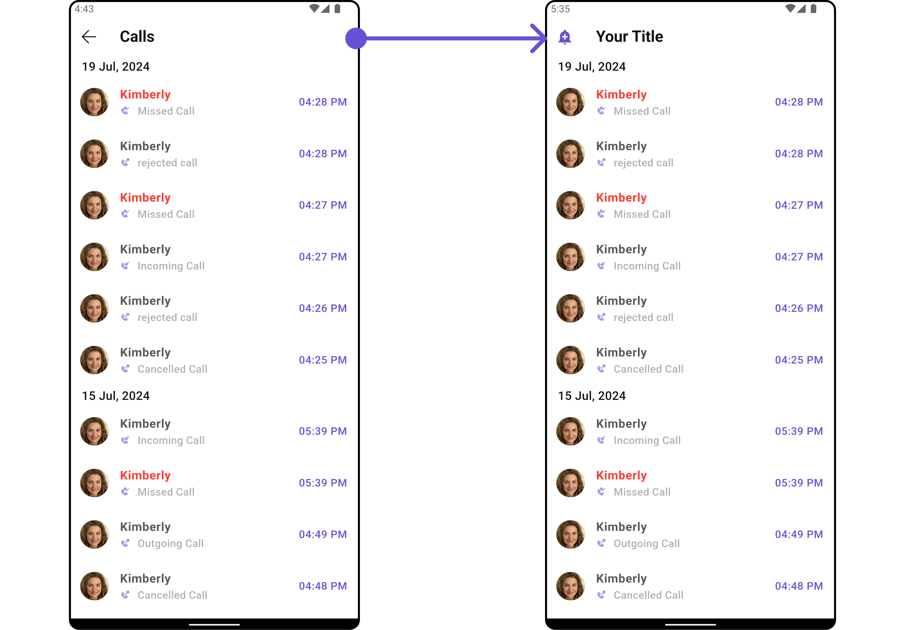
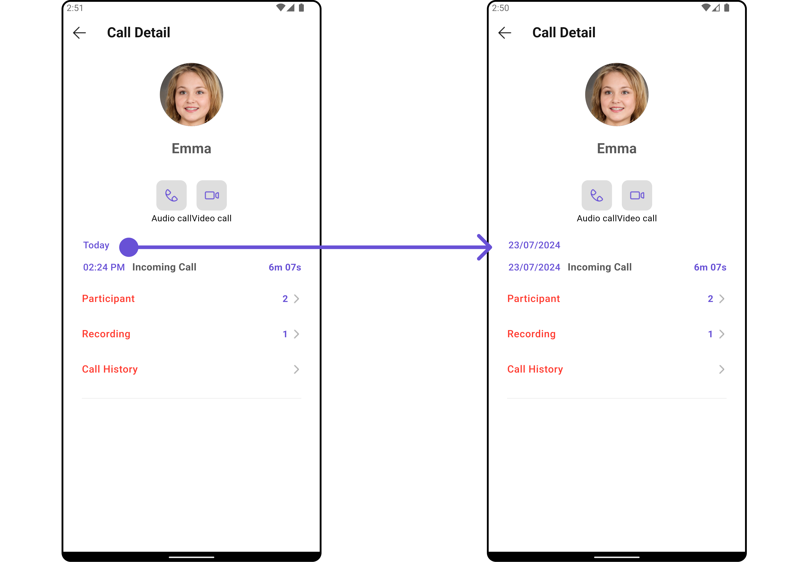
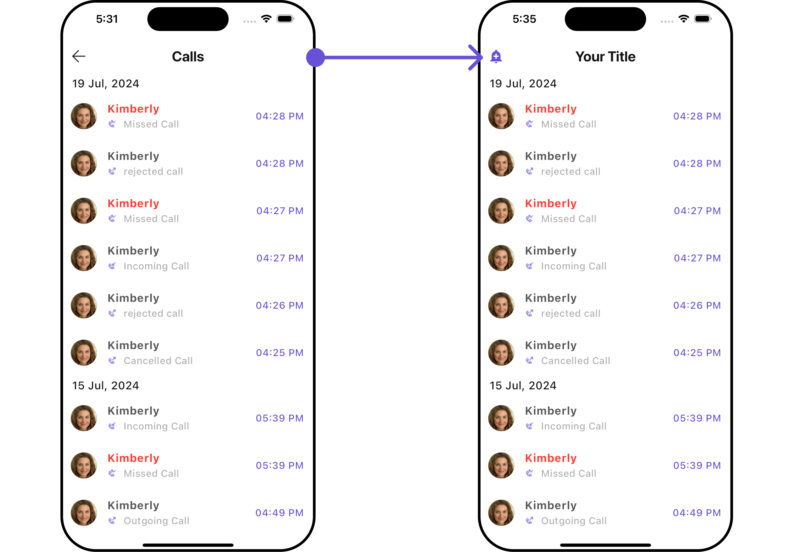
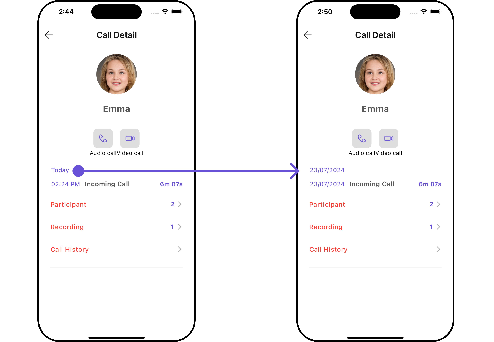

import Tabs from '@theme/Tabs';
import TabItem from '@theme/TabItem';
import { Tooltip } from 'react-tooltip'
import 'react-tooltip/dist/react-tooltip.css'

<Tooltip id="my-tooltip-html-prop" html="Not available in Group Members Configuration object"/>

## Overview

The `CometChatCallLogsWithDetails` is a [Composite Widget](/ui-kit/flutter/components-overview#composite-components) encompassing widgets such as [Call Logs](/ui-kit/flutter/call-logs) and [Call Log Details](/ui-kit/flutter/call-log-details). Both of these widget contributes to the functionality and structure of the overall `CallLogsWithDetails` widget.

<Tabs>

<TabItem value="Android" label="Android">



</TabItem>

<TabItem value="iOS" label="iOS">



</TabItem>

</Tabs>

| Widgets                                | Description                                                                                                                                                                                                                                                     |
| -------------------------------------- | --------------------------------------------------------------------------------------------------------------------------------------------------------------------------------------------------------------------------------------------------------------- |
| [Call Logs](./call-logs)               | The `Call Logs` widget is designed to show the list of Call Log available . By default, names are shown for all listed users, along with their avatar if available.                                                                                             |
| [Call Log Details](./call-log-details) | The `Call Log Details` widget is designed to displays all the information related to a call. This widget displays information like user/group information, participants of the call, recordings of the call (if available) & history of all the previous calls. |

---

## Usage

### Integration

`CometChatCallLogsWithDetails` is a composite widget that seamlessly integrates into your application. You can push it onto the navigation stack using a navigation controller. This allows for easy navigation and efficient display of call log details within your application's interface.

You can launch `CometChatCallLogsWithDetails` directly using `Navigator.push`, or you can define it as a widget within the `build` method of your `State` class.

##### 1. Using Navigator to Launch `CometChatCallLogsWithDetails`

<Tabs>

<TabItem value="Dart" label="Dart">

```dart
Navigator.push(context, MaterialPageRoute(builder: (context) => CometChatCallLogsWithDetails()));
```

</TabItem>

</Tabs>

##### 2. Embedding `CometChatCallLogsWithDetails` as a Widget in the build Method

<Tabs>

<TabItem value="Dart" label="Dart">

```dart
import 'package:cometchat_calls_uikit/cometchat_calls_uikit.dart';
import 'package:flutter/material.dart';

class CallLogWithDetailsExample extends StatefulWidget {
  const CallLogWithDetailsExample({super.key});

  @override
  State<CallLogWithDetailsExample> createState() => _CallLogWithDetailsExampleState();
}

class _CallLogWithDetailsExampleState extends State<CallLogWithDetailsExample> {

  @override
  Widget build(BuildContext context) {
    return Scaffold(
      body: SafeArea(
        child: CometChatCallLogsWithDetails(),
      ),
    );
  }
}
```

</TabItem>

</Tabs>

---

### Actions

[Actions](/ui-kit/android/components-overview#actions) dictate how a widget functions. They are divided into two types: Predefined and User-defined. You can override either type, allowing you to tailor the behavior of the widget to fit your specific needs.

##### 1. onItemClick

This method proves valuable when users seek to override `onItemClick` functionality within `CometChatCallLogsWithDetails`, empowering them with greater control and customization options.

The `onItemClick` action doesn't have a predefined behavior. You can override this action using the following code snippet.

<Tabs>

<TabItem value="Dart" label="Dart">

```dart
CometChatCallLogsWithDetails(
    callLogsConfiguration: CallLogsConfiguration(
      onItemClick: (callLog) {
        // TODO("Not yet implemented")
      },
    )
)
```

</TabItem>

</Tabs>

---

##### 2. onError

You can customize this behavior by using the provided code snippet to override the `onError` and improve error handling.

<Tabs>

<TabItem value="Dart" label="Dart">

```dart
CometChatCallLogsWithDetails(
    callLogsConfiguration: CallLogsConfiguration(
      onError: (e) {
        // TODO("Not yet implemented")
      },
    ),
    callLogDetailConfiguration: CallLogDetailsConfiguration(
      onError: (e) {
        // TODO("Not yet implemented")
      },
    ),
)
```

</TabItem>

</Tabs>

---

##### 2. onBack

You can customize this behavior by using the provided code snippet to override the `onBack` and improve error handling.

<Tabs>

<TabItem value="Dart" label="Dart">

```dart
CometChatCallLogsWithDetails(
    callLogsConfiguration: CallLogsConfiguration(
      onBack: () {
        // TODO("Not yet implemented")
      },
    ),
    callLogDetailConfiguration: CallLogDetailsConfiguration(
      onBack: () {
        // TODO("Not yet implemented")
      },
    ),
)
```

</TabItem>

</Tabs>

---

### Filters

**Filters** allow you to customize the data displayed in a list within a Widget. You can filter the list based on your specific criteria, allowing for a more customized. Filters can be applied using RequestBuilders of Chat SDK.

While the `CometChatCallLogsWithDetails` widget does not have filters, its widgets do, For more detail on individual filters of its widget refer to [Call Logs](/ui-kit/android/call-logs) and [CometChatCallLogsWithDetails](/ui-kit/android/call-log-details).

By utilizing the [Configurations](#configurations) object of its widgets, you can apply filters.

##### 1. CallLogRequestBuilder

The [CallLogRequestBuilder](/ui-kit/android/call-logs) enables you to filter and customize the call list based on available parameters in CallLogRequestBuilder. This feature allows you to create more specific and targeted queries during the call. The following are the parameters available in [CallLogRequestBuilder](/ui-kit/android/call-logs)

<Tabs>

<TabItem value="Dart" label="Dart">

```dart
CometChatCallLogsWithDetails(
  callLogsConfiguration: CallLogsConfiguration(
    callLogsRequestBuilder: CallLogRequestBuilder()
      ..limit = 10
      ..hasRecording = true,
  ),
)
```

</TabItem>

</Tabs>

List of properties exposed by `CallLogRequestBuilder`

| **Property**       | Description                                                 | Code                     |
| ------------------ | ----------------------------------------------------------- | ------------------------ |
| **Auth Token**     | Sets the authentication token.                              | `authToken: String?`     |
| **Call Category**  | Sets the category of the call.                              | `callCategory: String?`  |
| **Call Direction** | Sets the direction of the call.                             | `callDirection: String?` |
| **Call Status**    | Sets the status of the call.                                | `callStatus: String?`    |
| **Call Type**      | Sets the type of the call.                                  | `callType: String?`      |
| **Guid**           | Sets the unique ID of the group involved in the call.       | `guid: String?`          |
| **Has Recording**  | Indicates if the call has a recording.                      | `hasRecording: bool`     |
| **Limit**          | Sets the maximum number of call logs to return per request. | `limit: int`             |
| **Uid**            | Sets the unique ID of the user involved in the call.        | `uid: String?`           |

---

### Events

[Events](/ui-kit/android/components-overview#events) are emitted by a `Widget`. By using event you can extend existing functionality. Being global events, they can be applied in Multiple Locations and are capable of being Added or Removed.

The `CometChatCallLogsWithDetails` does not produce any events but its subwidget does.

---

## Customization

To fit your app's design requirements, you can customize the appearance of the conversation widget. We provide exposed methods that allow you to modify the experience and behavior according to your specific needs.

### Style

Using **Style** you can **customize** the look and feel of the widget in your app, These parameters typically control elements such as the **color**, **size**, **shape**, and **fonts** used within the widget.

It's important to note that while `CometChatCallLogsWithDetails` does not provide its own specific styling options, each individual widget contained within it offers its own set of styling attributes.

You can also customize its widget styles. For more details on individual widget styles, you can refer [Call Logs Styles](/ui-kit/flutter/call-logs#1-calllogs-style) and [Call Log Details Styles](/ui-kit/flutter/call-log-details#1-calllogdetails-style).

<Tabs>

<TabItem value="Dart" label="Dart">

```dart
CometChatCallLogsWithDetails(
    callLogsConfiguration: CallLogsConfiguration(
        callLogsStyle: CallLogsStyle(
            // Add here CallLog Style
        ),
    ),
    callLogDetailConfiguration: CallLogDetailsConfiguration(
        detailStyle: CallLogDetailsStyle(
            // Add here CallLogDetails Style
        ),
    ),
)
```

</TabItem>

</Tabs>

<Tabs>

<TabItem value="Android CallLogs" label="Android (Call Logs Style)">



</TabItem>

<TabItem value="Android CallLogDetails" label="Android (Call Log Details Style)">



</TabItem>

<TabItem value="iOS CallLogs" label="iOS (Call Logs Style)">



</TabItem>

<TabItem value="iOS CallLogDetails" label="iOS (Call Log Details Style)">



</TabItem>

</Tabs>

Styles can be applied to SubWidgets using their respective [configurations](#configurations).

---

### Functionality

These are a set of **small functional customizations** that allow you to **fine-tune** the overall experience of the widget. With these, you can **change text**, set **custom icons**, and toggle the **visibility** of UI elements.

You can also customize its widget functionality. For more details on individual widget functionality, you can refer [Call Logs Functionality](/ui-kit/flutter/call-logs#functionality) and [Call Log Details Functionality](/ui-kit/flutter/call-log-details#functionality).

<Tabs>

<TabItem value="Dart" label="Dart">

```dart
CometChatCallLogsWithDetails(
    callLogsConfiguration: CallLogsConfiguration(
        // CallLog functionality
    ),
    callLogDetailConfiguration: CallLogDetailsConfiguration(
        // CallLogDetails functionality
    ),
)
```

</TabItem>

</Tabs>

<Tabs>

<TabItem value="Android CallLogs" label="Android (Call Logs Functionality)">



</TabItem>

<TabItem value="Android" label="Android Functionality">



</TabItem>

<TabItem value="iOS CallLogs" label="iOS (Call Logs Functionality)">



</TabItem>

<TabItem value="iOS CallLogDetails" label="iOS (Call Log Details Functionality)">



</TabItem>

</Tabs>

Functionality can be applied to SubWidgets using their respective [configurations](#configurations).

---

### Advanced

For advanced-level customization, you can set custom views to the widget. This lets you tailor each aspect of the widget to fit your exact needs and application aesthetics. You can create and define your own views, layouts, and UI elements and then incorporate those into the widget.

For the details of individual widgets' advanced-level customization, you can refer to [Call Logs Advanced Section](/ui-kit/flutter/call-logs#advanced) and [Call Log Details Advanced Section](/ui-kit/flutter/call-log-details#advanced).

<Tabs>

<TabItem value="Dart" label="Dart">

```dart
CometChatCallLogsWithDetails(
    callLogsConfiguration: CallLogsConfiguration(
        // CallLog advanced-level customization
    ),
    callLogDetailConfiguration: CallLogDetailsConfiguration(
        // CallLogDetails advanced-level customization
    ),
)
```

</TabItem>

</Tabs>

By utilizing the [Configuration](#configurations) object of each widget, you can apply advanced-level customizations to the GroupsWithMessages.

---

## Configurations

[Configurations](/ui-kit/flutter/components-overview#configurations) offer the ability to customize the properties of each widget within a Composite Widget.

`CometChatCallLogsWithDetails` has [Call Logs](/ui-kit/flutter/call-logs) and [Call Log Details](/ui-kit/flutter/call-log-details) widget. Hence, each of these widgets will have its individual `Configuration`.

- `Configurations` expose properties that are available in its individual widgets.

#### Call Logs

You can customize the properties of the [Call Logs](/ui-kit/flutter/call-logs) by making use of the `CallLogsConfiguration`. You can accomplish this by employing the `callLogsConfiguration` props as demonstrated below:

<Tabs>

<TabItem value="Dart" label="Dart">

```dart
CometChatCallLogsWithDetails(
    callLogsConfiguration: CallLogsConfiguration(
        // Override the properties of CallLog
    )
)
```

</TabItem>

</Tabs>

All exposed properties of `CallLogsConfiguration` can be found under [Call Logs](/ui-kit/flutter/call-logs). Properties marked with the <a data-tooltip-id="my-tooltip-html-prop"><span class="material-icons red">report</span></a> symbol are not accessible within the Configuration Object.

---

#### Call Log Details

You can customize the properties of the [Call Log Details](/ui-kit/flutter/call-log-details) widget by making use of the `CallLogDetailsConfiguration`. You can accomplish this by employing the `callLogDetailConfiguration` props as demonstrated below:

<Tabs>

<TabItem value="Dart" label="Dart">

```dart
CometChatCallLogsWithDetails(
    callLogDetailConfiguration: CallLogDetailsConfiguration(
        // Override the properties of CallLogDetails
    )
)
```

</TabItem>

</Tabs>

All exposed properties of `CallLogDetailsConfiguration` can be found under [Call Log Details](./call-log-details#functionality). Properties marked with the <a data-tooltip-id="my-tooltip-html-prop"><span class="material-icons red">report</span></a> symbol are not accessible within the Configuration Object.

---
