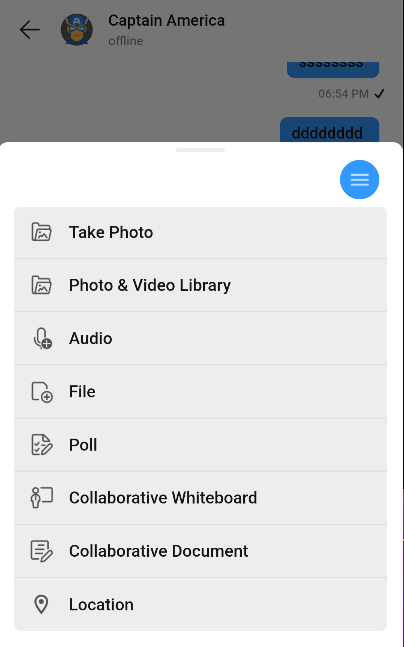

import Tabs from '@theme/Tabs';
import TabItem from '@theme/TabItem';

`CometChatActionSheet` is a `DraggableScrollableSheet` which shows each `ActionItem` and returns the `ActionItem` that is clicked on . You can customize the appearance of `CometChatActionSheet` too.



## How to integrate CometChatActionSheet ?

Since `CometChatActionSheet` is a `DraggableScrollableSheet` , it can be called directly by using `showCometChatActionSheet method`. `CometChatActionSheet` includes various parameters to customize its UI.

#### Usage

<Tabs>

<TabItem value="Dart" label="Dart">

```dart
ActionItem? item = await showCometChatActionSheet(
  context: context,
  actionItems: <actionList>,
  titleStyle: TextStyle(
    fontSize: 17,
    fontWeight: FontWeight.w500,
    color: cometChatTheme.palette.getAccent()
  ),
  backgroundColor: cometChatTheme.palette.getBackground(),
  iconBackground: cometChatTheme.palette.getAccent100(),
  layoutIconColor: cometChatTheme.palette.getPrimary()
);
```

</TabItem>

</Tabs>

### Properties

| Parameters | Type | Description | 
| ---- | ---- | ---- | 
| **context** | BuildContext | Used to set the location in the widget where the `AcionSheet needs to be shown` | 
| **backgroundColor** | Color | Used to set background color | 
| **actionItems** | List&lt;ActionItem&gt; | Used to set list of action items | 
| **iconBackground** | Color | Used to set icon background color | 
| **title** | String | Used to set title | 
| **titleStyle** | TextStyle | Used to set title style | 
| **isLayoutModeIconVisible** | bool | Used to toggle visibility of layout mode icon | 
| **layoutModeIcon** | IconData | used to set the icon to display | 
| **layoutIconColor** | Color | Used to set layout Mode Icon Color | 
| **isTitleVisible** | bool | Used to toggle title visibility | 
| **isGridLayout** | bool | Used to toggle between list view or grid view | 
| **alertShapeBorder** | ShapeBorder | Used to shape `ActionSheet` | 

---

## ActionItem

`ActionItem` is the model class used to pass data at different places such as `CometChatActionSheet.`A list of ActionItem is passed to the CometChatActionSheet which renders it according to the styling parameters passed 

### Properties

| Parameters | Type | Description | 
| ---- | ---- | ---- | 
| **id** | String | Used to uniquely identify each `ActionItem` | 
| **title** | String | Used to set the title visible against each `ActionItem` | 
| **iconUrl** | String | Used to set IconUrl | 
| **iconUrlPackageName** | String | Used to set IconUrl  package name , used only when | 
| **titleStyle** | TextStyle | Used to set title style | 
| **iconBackground** | Color | Used to set icon background | 
| **iconCornerRadius** | double | Used to set icon corner radius | 
| **background** | Color | Used to set background color | 
| **cornerRadius** | double | Used to set corner radius | 
| **onItemClick** | dynamic | an parameter to hold any extra data with each `ActionItem`  ,<br /><br />internally used to set functions which are invoked later | 

:::info

If dart compiler is not able to identify ActionItem from the chat ui kit package because its conflicting with other imports, alias can be created as `import 'package:flutter_chat_ui_kit/flutter_chat_ui_kit.dart' as uikit;` > > and used like `uikit.ActionItem` wherever needed

:::

<Tabs>

<TabItem value="Dart" label="Dart">

```dart
// new Alias created
import 'package:flutter_chat_ui_kit_flutter_chat_ui_kit.dart' as uikit;

uikit.ActionItem  item1  = uikit.ActionItem(
    id:<id1>,
    title: <title1>,
    background: <backgroundColor>,
    cornerRadius: <cornerRadius>,
    onItemClick: (){
      // any function you want to perform
    }
);

uikit.ActionItem  item2  = uikit.ActionItem(
    id:<id2>,
    title: <title2>,
    background: <backgroundColor>,
    cornerRadius: <cornerRadius>,
    onItemClick: (){
      // any function you want to perform
    }
);

List<uikit.ActionItem> actionList = [item1, item2];

uikit.ActionItem? item = await showCometChatActionSheet(
  context: context,
  actionItems: actionList,
  titleStyle: TextStyle(
    fontSize: 17,
    fontWeight: FontWeight.w500,
    color: cometChatTheme.palette.getAccent()
  ),
  backgroundColor: cometChatTheme.palette.getBackground(),
  iconBackground: cometChatTheme.palette.getAccent100(),
  layoutIconColor: cometChatTheme.palette.getPrimary()
);
```

</TabItem>

</Tabs>


