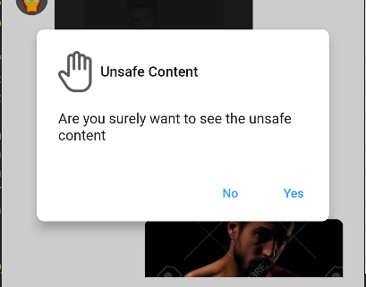

import Tabs from '@theme/Tabs';
import TabItem from '@theme/TabItem';

`CometChatConfirmDialog` is a customizable alert dialog .



## How to integrate CometChatConfirmDialog ?

Since `CometChatConfirmDialog` is a `AlertDialog`, it can be called by function `showCometChatConfirmDialog` . `CometChatConfirmDialog` includes various attributes  to customize its UI.

#### Usage

<Tabs>

<TabItem value="Dart" label="Dart">

```dart
showCometChatConfirmDialog(
    context: context,
    confirmButtonText: "yes",
    cancelButtonText: "no",
    messageText: "this is a message",
    onCancel: () {
        // Write on cancel function here
        Navigator.pop(context);
    },
    style: ConfirmDialogStyle(
        backgroundColor:Colors.lightBlue,
        shadowColor: Colors.teal,
        confirmButtonTextStyle:TextStyle(fontSize: 12, color: Colors.yellow),
        cancelButtonTextStyle: TextStyle(fontSize: 12, color: Colors.pink)
        onConfirm: () async {
            // write on Confirm function here
            Navigator.pop(context);
        }
    )
);
```

</TabItem>

</Tabs>

---

## Properties

| Parameters | Type | Description | 
| ---- | ---- | ---- | 
| **context** | BuildContext | required to determine the location in the widget tree where the confirm dialog needs to be shown | 
| **title** | Widget | used to set title on top of the confirm dialog | 
| **messageText** | Widget | used to set the text for the message to display on the dialog | 
| **confirmButtonText** | String | used to set the text on the confirm button | 
| **cancelButtonText** | String | used to set the text on the cancel button | 
| **onConfirm** | Function() | required to set function to be called when clicked on confirm Button | 
| **onCancel** | Function() | required to set function to be called when clicked on cancel Button | 
| **style** | ConfirmDialogStyle | used to customize the confirm dialog | 

---

## ConfirmDialogStyle

style class to alter Confirm dialog styling properties. 

---

### Properties

| Parameters | Type | Description | 
| ---- | ---- | ---- | 
| **backgroundColor** | Color | Used to set background color | 
| **shadowColor** | Color | Used to set shadow color | 
| **confirmButtonTextStyle** | TextStyle | Used to set confirm button text style | 
| **cancelButtonTextStyle** | TextStyle | Used to set the cancel button text style | 
