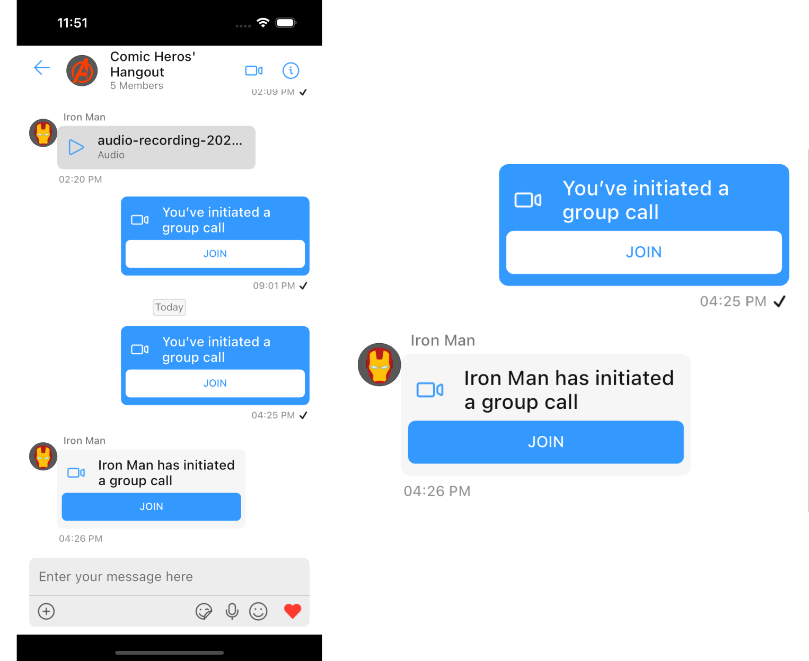

import Tabs from '@theme/Tabs';
import TabItem from '@theme/TabItem';

`CometChatCallBubble` is a widget that displays the call information and a button to join a direct call.

If [CometChatMessages](/ui-kit/flutter/messages) has been launched for a `Group` only the video call button will be present in the [CometChatMessageHeader](/ui-kit/flutter/message-header), pressing on which shall navigate the user to the [CometChatOngoingCall](/ui-kit/flutter/ongoing-call) Widget and a [CustomMessage](/sdk/flutter/send-message) will be sent in the background with details for other group members to join the call, this [CustomMessage](/sdk/flutter/send-message#custom-message) will be displayed on the [CometChatMessageList](/ui-kit/flutter/message-list) using this `CometChatCallBubble`.



## Usage

`CometChatCallBubble` can be used as a child Widget for a `Container` or SizedBox or along with other children Widgets in a `Row` or `Column`.

<Tabs>

<TabItem value="Dart" label="Dart">

```dart
CometChatCallBubble(
  icon: Icon(Icons.call),
  title: 'Call',
  buttonText: 'Call',
  onTap: (context) {
    // TODO("Not yet implemented")
  },
  callBubbleStyle: CallBubbleStyle(
    background: Colors.blue,
  ),
  theme: cometChatTheme,
  alignment: BubbleAlignment.left,
);
```

</TabItem>

</Tabs>

## Properties

| Property | Type | Description | 
| ---- | ---- | ---- | 
| **icon** | Widget | icon to show in the leading view of the bubble | 
| **title** | String | the title to be displayed | 
| **buttonText** | String | the text to be displayed on the button | 
| **onTap** | Function(BuildContext) | onTap can be used to execute some tasks by tapping the button | 
| **callBubbleStyle** | CallBubbleStyle | a CallBubbleStyle object will be used to customize the appearance of the widget | 
| **alignment** | BubbleAlignment | alignment will be used to align the widget to determine the appropriate background color and text color | 
| **theme** | [CometChatTheme](/ui-kit/flutter/theme) | used to set custom theme | 

---

### callBubbleStyle

A `CallBubbleStyle` object will be used to customize the appearance of the widget

| Property | Type | Description | 
| ---- | ---- | ---- | 
| **titleStyle** | TextStyle | sets the style for the text shown in the title of the `CometChatCallBubble` | 
| **subtitleStyle** | TextStyle | sets the style for the text shown in the subtitle of the `CometChatCallBubble` | 
| **buttonTextStyle** | TextStyle | sets the style for the text shown on the button of the `CometChatCallBubble` | 
| **buttonBackground** | Color | sets the color of the join call button of the call bubble | 
| **iconTint** | Color | sets the color for the icon shown in the leading view of the `CometChatCallBubble` | 
| **background** | Color | sets the background color of the `CometChatCallBubble` | 
| **width** | double | used to set width | 
| **height** | double | used to set height | 
| **gradient** | Gradient | used to set a gradient background | 
| **border** | BoxBorder | used to set border | 
| **borderRadius** | double | used to set corner radius | 

<Tabs>

<TabItem value="Dart" label="Dart">

```dart
// Create a CallBubbleStyle object 
CallBubbleStyle callBubbleStyle = CallBubbleStyle(
  background: Colors.blue,
  iconTint: Colors.grey,
  titleStyle: TextStyle(
    color: Colors.red,
    fontSize: 16,
    fontWeight: FontWeight.bold,
  ),
  subtitleStyle: TextStyle(
    color: Colors.red,
    fontSize: 14,
    fontWeight: FontWeight.bold,
  ),
  buttonTextStyle: TextStyle(
    color: Colors.white, fontSize: 14, fontWeight: FontWeight.bold
  ),
);

// Pass the CallBubbleStyle object to CometChatCallBubble
CometChatCallBubble(
  callBubbleStyle: callBubbleStyle,
);
```

</TabItem>

</Tabs>


