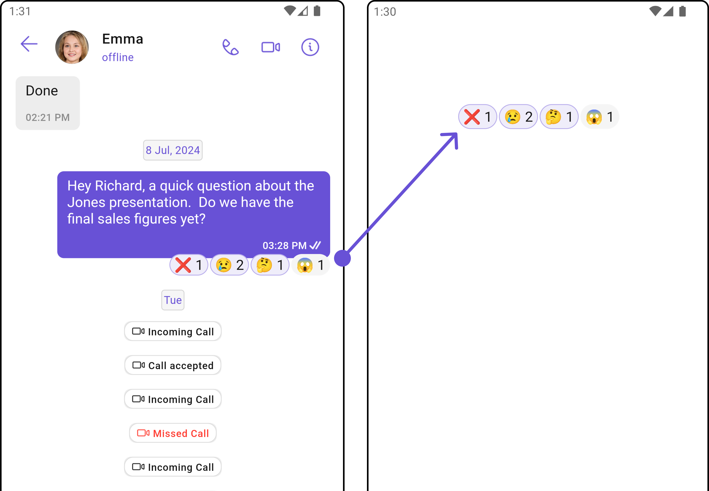
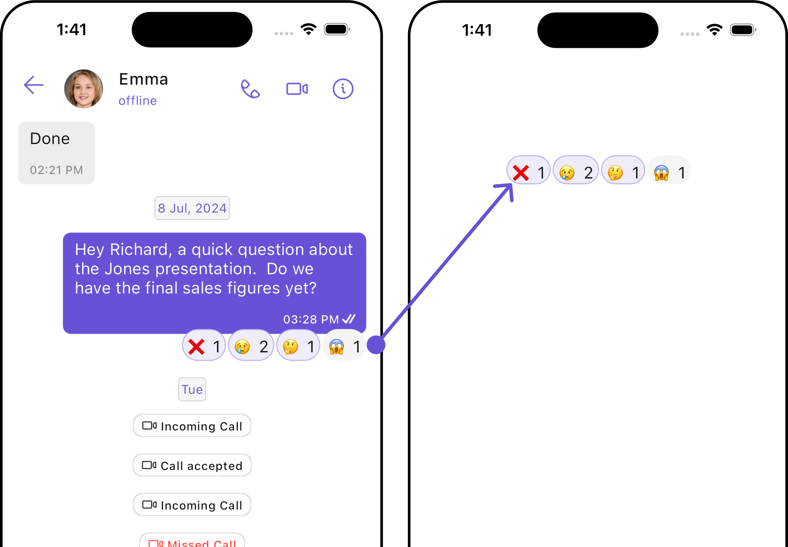
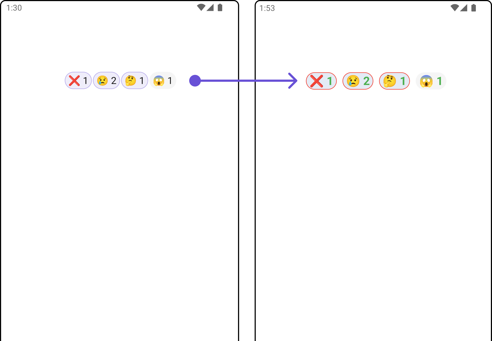
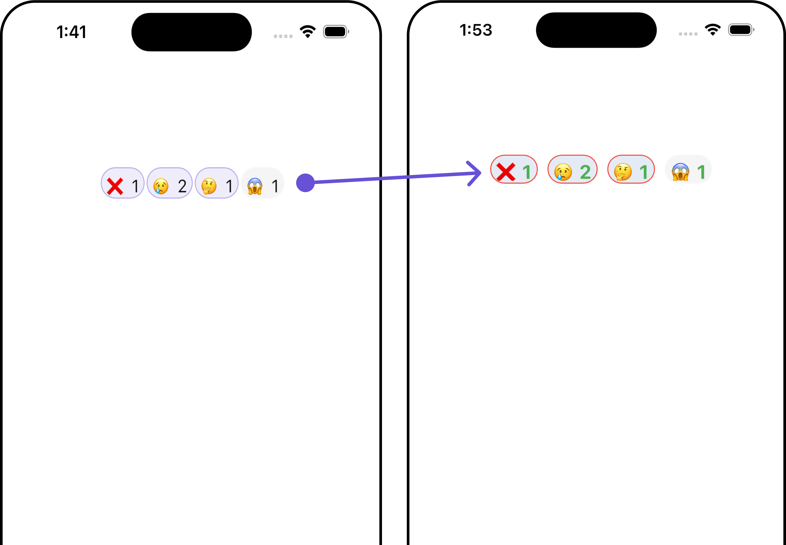
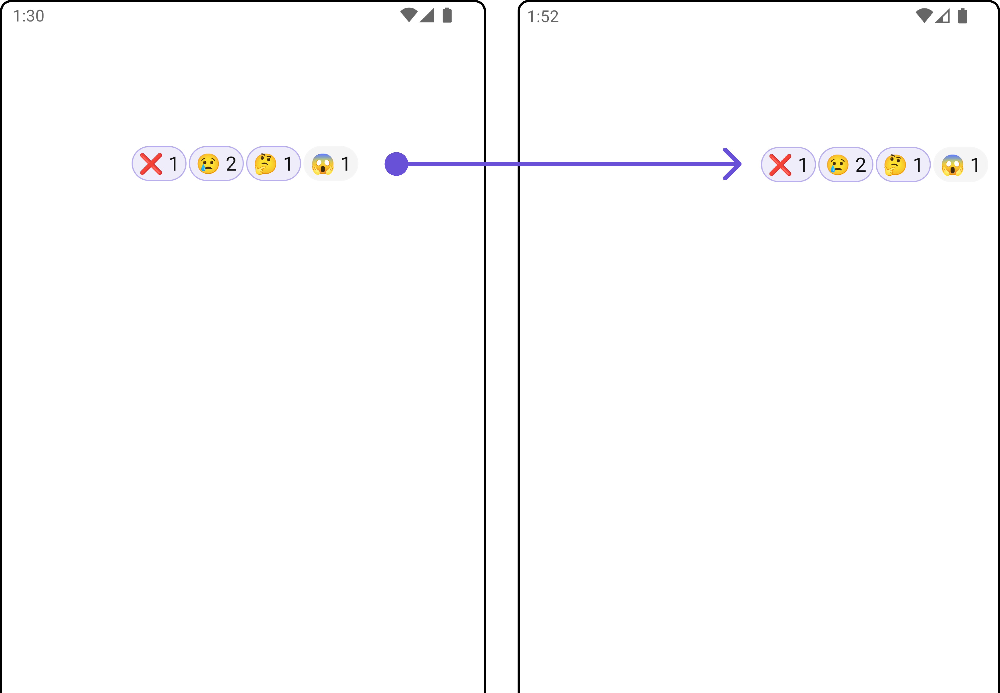
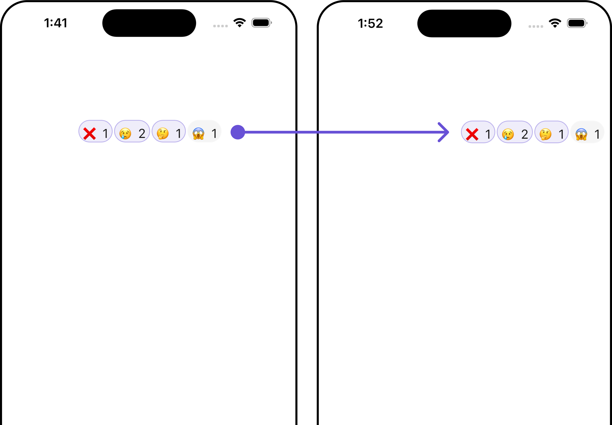

import Tabs from '@theme/Tabs';
import TabItem from '@theme/TabItem';

## Overview

The `CometChatReactions` widget provides a visual representation of emoji reactions associated with a specific message. It enables users to quickly identify which emojis were used to react to the message and by whom.

<Tabs>

<TabItem value="Android" label="Android">



</TabItem>

<TabItem value="iOS" label="iOS">



</TabItem>

</Tabs>

## Usage

### Integration

The following code snippet illustrates how you can directly incorporate the Reactions widget into your app.

You can launch `CometChatReactions` directly using `Navigator.push`, or you can define it as a widget within the `build` method of your `State` class.

##### 1. Using Navigator to Launch `CometChatReactions`

<Tabs>

<TabItem value="Dart" label="Dart">

```dart
Navigator.push(context, MaterialPageRoute(builder: (context) => CometChatReactions(reactionList: []))); // Reaction list is required to launch this Widget.
```

</TabItem>

</Tabs>

##### 2. Embedding `CometChatReactions` as a Widget in the build Method

<Tabs>

<TabItem value="Dart" label="Dart">

```dart
import 'package:cometchat_chat_uikit/cometchat_chat_uikit.dart';import 'package:flutter/material.dart';

class ReactionExample extends StatefulWidget {
  const ReactionExample({super.key});

  @override
  State<ReactionExample> createState() => _ReactionExampleState();
}

class _ReactionExampleState extends State<ReactionExample> {

  @override
  Widget build(BuildContext context) {
    return Scaffold(
      body: SafeArea(
        child: CometChatReactions(
            reactionList: []
        ) // Reaction list is required to launch this Widget.
      ),
    );
  }
}
```

</TabItem>

</Tabs>

---

### Actions

[Actions](/ui-kit/flutter/components-overview#actions) dictate how a widget functions. They are divided into two types: Predefined and User-defined. You can override either type, allowing you to tailor the behavior of the widget to fit your specific needs.

##### 1. onReactionTap

`onReactionTap` is triggered when you click on each Reaction in the footer view of message bubble. You can override this action using the following code snippet.

<Tabs>

<TabItem value="Dart" label="Dart">

```dart
CometChatReactions(
    reactionList: reactionList,
    onReactionTap: (reaction) {
      // TODO("Not yet implemented")
    },
)
```

</TabItem>

</Tabs>

---

##### 2. onReactionLongPress

`onReactionLongPress` is triggered when you long press on Reaction in the footer view of message bubble. You can override this action using the following code snippet.

<Tabs>

<TabItem value="Dart" label="Dart">

```dart
CometChatReactions(
    reactionList: reactionList,
    onReactionLongPress: (reaction) {
      // TODO("Not yet implemented")
    },
)
```

</TabItem>

</Tabs>

---

### Filters

**Filters** allow you to customize the data displayed in a list within a `Widget`. You can filter the list based on your specific criteria, allowing for a more customized. Filters can be applied using `RequestBuilders` of Chat SDK.

The `CometChatReactions` widget does not have any exposed filters.

---

### Events

[Events](/ui-kit/flutter/components-overview#events) are emitted by a `Widget`. By using event you can extend existing functionality. Being global events, they can be applied in Multiple Locations and are capable of being Added or Removed.

The `CometChatReactions` widget does not produce any events.

---

## Customization

To fit your app's design requirements, you can customize the appearance of the Reaction widget. We provide exposed methods that allow you to modify the experience and behavior according to your specific needs.

### Style

Using Style you can customize the look and feel of the widget in your app, These parameters typically control elements such as the color, size, shape, and fonts used within the widget.

##### reactionsStyle

To customize the appearance, you can assign a `reactionsStyle` object to the `CometChatReactions` widget.

<Tabs>

<TabItem value="Dart" label="Dart">

```dart
CometChatReactions(
  reactionList: reactionList,
  reactionsStyle: ReactionsStyle(
    reactionTextStyle: const TextStyle(
        color: Colors.red,
        fontSize: 20,
        fontWeight: FontWeight.bold,
    ),
    reactionCountTextStyle: const TextStyle(
        color: Colors.green,
        fontSize: 20,
        fontWeight: FontWeight.bold,
    ),
    margin: const EdgeInsets.only(left: 10),
    primaryBackgroundColor: Color(0xFFE4EBF5),
    primaryBorder: Border.all(
        color: Colors.red,
        width: 1,
    ),
    borderRadius: 20,
    height: 30
  ),
)
```

</TabItem>

</Tabs>

<Tabs>

<TabItem value="Android" label="Android">



</TabItem>

<TabItem value="iOS" label="iOS">



</TabItem>

</Tabs>

List of properties exposed by `ReactionsStyle`

| **Property**               | **Description**                                             | **Code**                            |
| -------------------------- | ----------------------------------------------------------- | ----------------------------------- |
| **reactionTextStyle**      | The text style for the reaction text.                       | `TextStyle? reactionTextStyle`      |
| **reactionCountTextStyle** | The text style for the reaction count.                      | `TextStyle? reactionCountTextStyle` |
| **primaryBackgroundColor** | The primary background color.                               | `Color? primaryBackgroundColor`     |
| **primaryBorder**          | The primary border style.                                   | `BoxBorder? primaryBorder`          |
| **margin**                 | The margin for the reactions.                               | `EdgeInsetsGeometry? margin`        |
| **padding**                | The padding for the reactions.                              | `EdgeInsetsGeometry? padding`       |
| **width**                  | The width of the reactions container.                       | `double? width`                     |
| **height**                 | The height of the reactions container.                      | `double? height`                    |
| **background**             | The background color of the reactions container.            | `Color? background`                 |
| **gradient**               | The gradient for the background of the reactions container. | `Gradient? gradient`                |
| **border**                 | The border of the reactions container.                      | `BoxBorder? border`                 |
| **borderRadius**           | The border radius of the reactions container.               | `double? borderRadius`              |

---

### Functionality

These are a set of small functional customizations that allow you to fine-tune the overall experience of the widget. With these, you can change text, set custom icons, and toggle the visibility of UI elements.

<Tabs>

<TabItem value="Dart" label="Dart">

```dart
CometChatReactions(
  reactionList: reactionList,
  alignment: BubbleAlignment.right,
)
```

</TabItem>

</Tabs>

<Tabs>

<TabItem value="Android" label="Android">



</TabItem>

<TabItem value="iOS" label="iOS">



</TabItem>

</Tabs>

Below is a customizations list along with corresponding code snippets

| **Property**     | **Description**                                      | **Code**                      |
| ---------------- | ---------------------------------------------------- | ----------------------------- |
| **reactionList** | The list of reactions to display.                    | `List<Reaction> reactionList` |
| **theme**        | The theme for styling the reactions.                 | `ThemeData? theme`            |
| **alignment**    | The alignment of the reactions within the container. | `Alignment? alignment`        |

---
