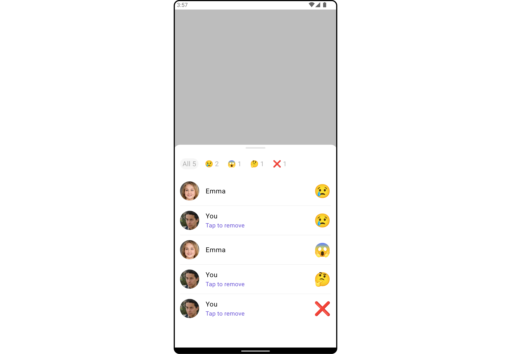
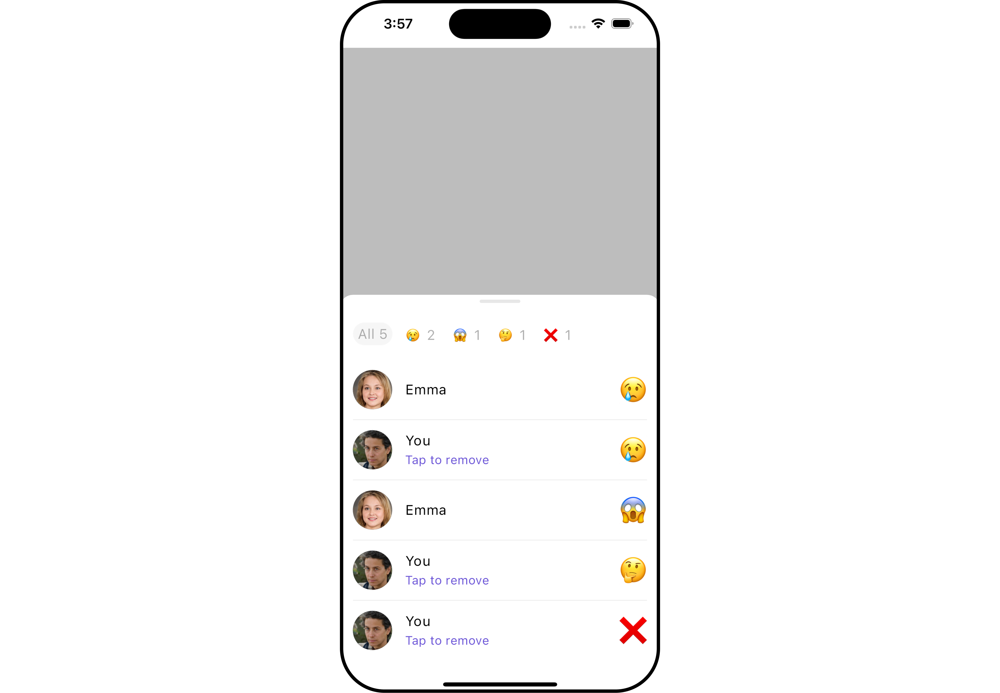
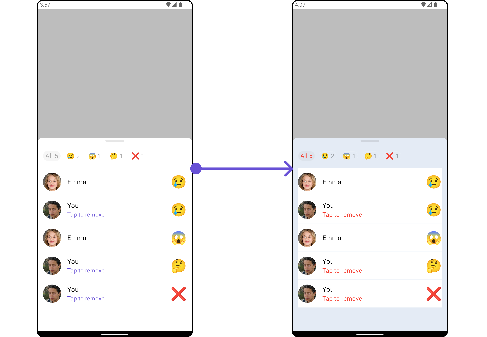
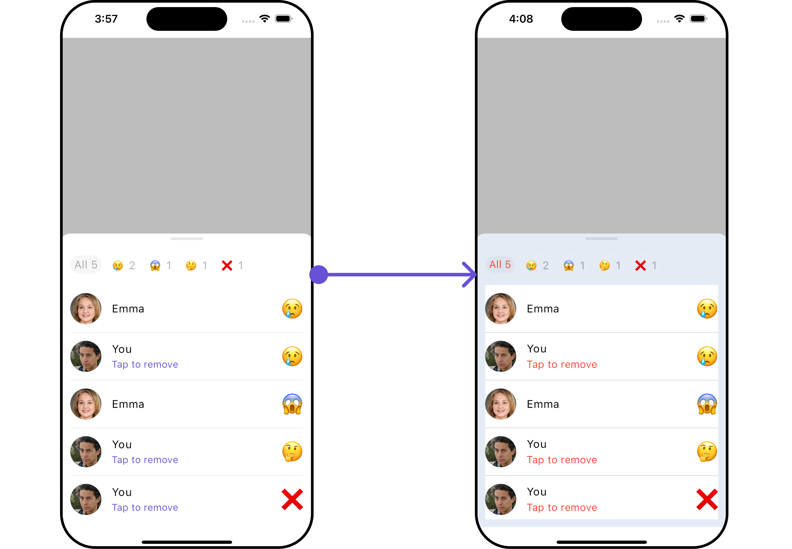
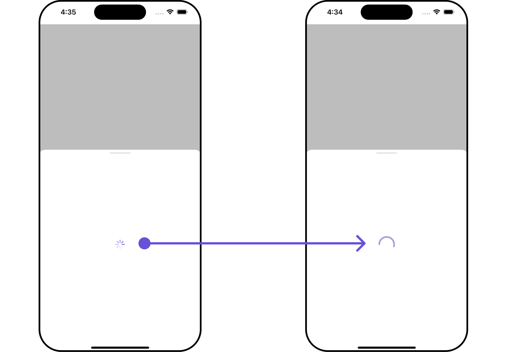
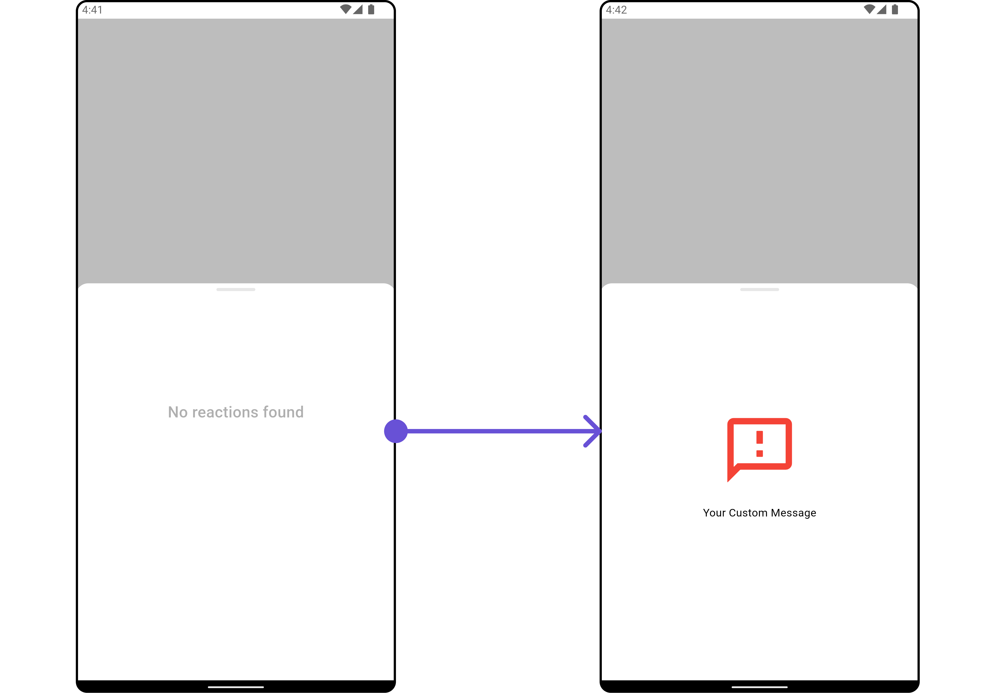
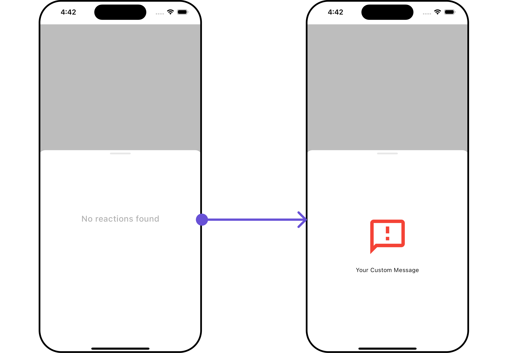
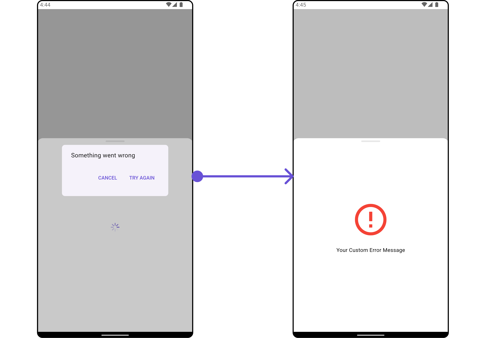
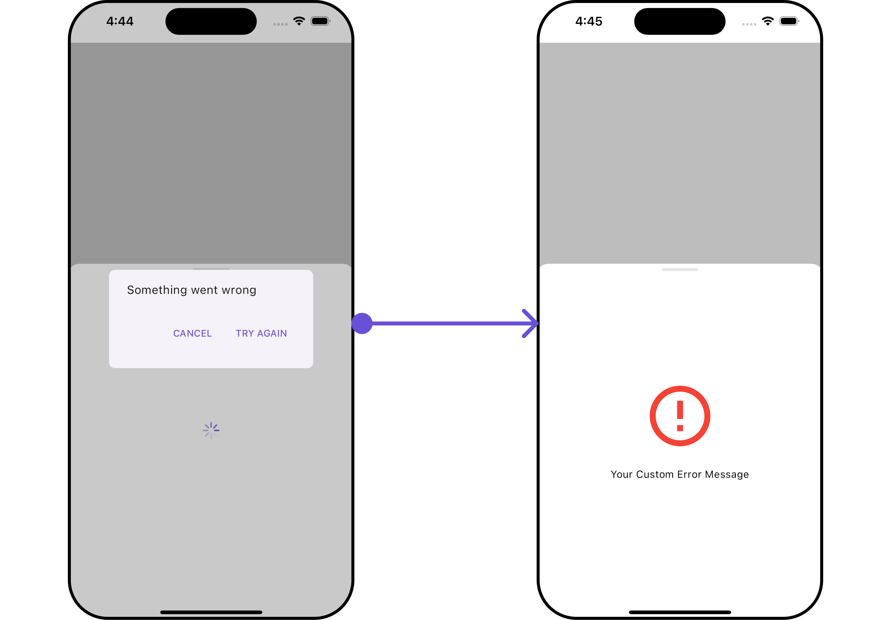

import Tabs from '@theme/Tabs';
import TabItem from '@theme/TabItem';

## Overview

The `CometChatReactionListList` widget is designed to manage and display reactions associated with messages. It offers a user-friendly interface for users to express their reactions to messages and provides options to remove reactions when necessary. The widget intelligently organizes reactions by emoji, giving a clear overview of the variety of reactions for a message along with details of who reacted with each emoji.

The widget consists of two distinct lists: one at the top with horizontal scrolling to display unique reactions and their counts, allowing users to select reactions for further details. The middle list shows selected reactions and the users who reacted to them.

Additionally, the interface seamlessly integrates functionality to remove reactions added by the logged-in user.

<Tabs>

<TabItem value="Android" label="Android">



</TabItem>

<TabItem value="iOS" label="iOS">



</TabItem>

</Tabs>

## Usage

### Integration

`CometChatReactionList` is a widget that contains a list of reactions. It is commonly used within the CometChatMessageList, but it can be integrated into any widget. The widget requires a list of reactions (provided via the baseMessage) to function properly.

You can launch `CometChatReactionList` directly using `Navigator.push`, or you can define it as a widget within the `build` method of your `State` class.

##### 1. Using Navigator to Launch `CometChatReactionList`

<Tabs>

<TabItem value="Dart" label="Dart">

```dart
Navigator.push(context, MaterialPageRoute(builder: (context) => CometChatReactionList(messageObject: baseMessageObject))); // BaseMessage object is required to launch this widget.
```

</TabItem>

</Tabs>

##### 2. Embedding `CometChatReactionList` as a Widget in the build Method

<Tabs>

<TabItem value="Dart" label="Dart">

```dart
import 'package:cometchat_chat_uikit/cometchat_chat_uikit.dart';
import 'package:flutter/material.dart';

class ReactionsListExample extends StatefulWidget {
  const ReactionsListExample({super.key});

  @override
  State<ReactionsListExample> createState() => _ReactionsListExampleState();
}

class _ReactionsListExampleState extends State<ReactionsListExample> {
  @override
  Widget build(BuildContext context) {
    return Scaffold(
      body: SafeArea(
        child: CometChatReactionList(
          messageObject: baseMessageObject,
        ) // BaseMessage object is required to launch this widget.
      )
    );
  }
}
```

</TabItem>

</Tabs>

---

### Actions

[Actions](/ui-kit/flutter/components-overview#actions) dictate how a widget functions. They are divided into two types: Predefined and User-defined. You can override either type, allowing you to tailor the behavior of the widget to fit your specific needs.

##### 1. onTap

The `onTap` event is triggered when a user interacts with a reaction by pressing it, typically to indicate a response or provide feedback.

<Tabs>

<TabItem value="Dart" label="Dart">

```dart
CometChatReactionList(
  onTap: (Reaction reaction, BaseMessage baseMessage) {
    // TODO("Not yet implemented")
  },
)
```

</TabItem>

</Tabs>

---

### Filters

**Filters** enable customization of the displayed data in a `widget`'s list by applying specific criteria. Using the `ReactionsRequestBuilder` in the Reaction List Widget, you can customize your reaction list based on various options to suit your requirements. For more information about ReactionsRequestBuilder, refer to the documentation on [ReactionsRequestBuilder](/sdk/flutter/reactions).

In the example below, we illustrate how to apply a filter to the reactions list, allowing you to specify a limit on the number of users who have reacted to a particular message.

<Tabs>

<TabItem value="Dart" label="Dart">

```dart
CometChatReactionList(
  messageObject: baseMessageObject,
  reactionRequestBuilder: ReactionsRequestBuilder()
    ..limit = 2,
)
```

</TabItem>

</Tabs>

---

### Events

**Events** are triggered by a widget, enabling you to enhance its functionality. These events are global in scope, making them applicable across multiple areas of your application, and they can be added or removed as required.

The `CometChatReactionList` widget does not provide any available events.

---

## Customization

For customization aligned with your app's design, you can adjust the appearance of the Reaction List widget using our accessible methods. These methods enable you to tailor the experience and behavior to suit your specific needs.

### Style

Through Style, you can customize the visual presentation of the widget in your app. This includes controlling elements such as color, size, shape, and fonts to achieve the desired look and feel.

##### 1. Reactions List Style

The ReactionsListStyle class encapsulates properties that facilitate customization of the `CometChatReactionList` widget's visual appearance.

<Tabs>

<TabItem value="Dart" label="Dart">

```dart
CometChatReactionList(
  messageObject: baseMessageObject,
  reactionListStyle: ReactionListStyle(
      allReactionsTextStyle: const TextStyle(
        color: Colors.red,
        fontSize: 16,
      ),
      background: Color(0xFFE4EBF5),
      emptyTextStyle: const TextStyle(
        color: Colors.red,
        fontSize: 16,
      ),
      errorTextStyle: const TextStyle(
        color: Colors.red,
        fontSize: 16,
      ),
      subtitleTextStyle: const TextStyle(
        color: Colors.red,
        fontSize: 16,
      ),
      loadingIconTint: Colors.red
  ),
)
```

</TabItem>

</Tabs>

<Tabs>

<TabItem value="Android" label="Android">



</TabItem>

<TabItem value="iOS" label="iOS">



</TabItem>

</Tabs>

The following properties are exposed by `ReactionListStyle`:

| **Property**                | **Description**                                                                 | **Code**                                             |
|-----------------------------|---------------------------------------------------------------------------------|------------------------------------------------------|
| **loadingIconTint**         | The color tint for the loading icon.                                            | `Color? loadingIconTint`                             |
| **emptyTextStyle**          | The text style for the empty state message.                                     | `TextStyle? emptyTextStyle`                          |
| **errorTextStyle**          | The text style for the error state message.                                     | `TextStyle? errorTextStyle`                          |
| **subtitleTextStyle**       | The text style for the subtitle.                                                | `TextStyle? subtitleTextStyle`                       |
| **allReactionsTextStyle**   | The text style for the "all reactions" message.                                 | `TextStyle? allReactionsTextStyle`                   |
| **width**                   | The width of the reaction list container.                                       | `double? width`                                      |
| **height**                  | The height of the reaction list container.                                      | `double? height`                                     |
| **background**              | The background color of the reaction list container.                           | `Color? background`                                  |
| **gradient**                | The gradient for the background of the reaction list container.                 | `Gradient? gradient`                                 |
| **border**                  | The border of the reaction list container.                                      | `BoxBorder? border`                                  |
| **borderRadius**            | The border radius of the reaction list container.                               | `double? borderRadius`                               |

##### 2. Avatar Style

If you want to apply customized styles to the `Avatar` widget within the `CometChatReactionList` Widget, you can use the following code snippet. For more information you can refer [Avatar Styles](/ui-kit/flutter/avatar#avatarstyle).

<Tabs>

<TabItem value="Dart" label="Dart">

```dart
CometChatReactionList(
  messageObject: baseMessageObject,
  avatarStyle: AvatarStyle(
      border: Border.all(width: 5),
      borderRadius: 20,
      background: Colors.red
  )
)
```

</TabItem>

</Tabs>

---

##### 3. ListItem Style

If you want to apply customized styles to the `ListItemStyle` widget within the `CometChatReactionList` Widget, you can use the following code snippet. For more information, you can refer [ListItem Styles](/ui-kit/flutter/list-item#listitemstyle).

<Tabs>

<TabItem value="Dart" label="Dart">

```dart
CometChatReactionList(
    messageObject: baseMessageObject,
    listItemStyle: ListItemStyle(
        background: Color(0xFFE4EBF5),
        borderRadius: 20,
        border: Border.all(width: 2),
        margin: const EdgeInsets.only(top: 10),
        padding: const EdgeInsets.only(left: 10)
  )
)
```

</TabItem>

</Tabs>

---

### Functionality

These functional customizations provide ways to enhance the widget's overall experience. They allow for text modification, custom icon setting, and UI element visibility toggling.

The `CometChatReactionList` widget does not offer any additional functionality.

---

### Advanced

For advanced-level customization, you can set custom widgets to the widget. This lets you tailor each aspect of the widget to fit your exact needs and application aesthetics. You can create and define your widgets, layouts, and UI elements and then incorporate those into the widget.

---

#### LoadingStateView

You can customize the loading state widget in your `CometChatReactionList` by using the `.loadingStateView` method.
This method allows you to set a custom loading widget that will be displayed while the reaction list is loading. It's important to note that using this method will **override** the default loading state functionality of the widget.

<Tabs>

<TabItem value="Dart" label="Dart">

```dart
CometChatReactionList(
  messageObject: baseMessageObject,
  loadingStateView: (context) {
    return SizedBox(
      width: MediaQuery.of(context).size.width,
      height: MediaQuery.of(context).size.height/2,
      child: const Center(
          child: CircularProgressIndicator()
      ),
    ); // Replaced the placeholder with a custom widget.
  },
)
```

</TabItem>

</Tabs>

<Tabs>

<TabItem value="Android" label="Android">


</TabItem>

<TabItem value="iOS" label="iOS">



</TabItem>

</Tabs>

---

#### EmptyStateView 

You can set a custom `EmptyStateView` using `emptyStateView` to match the empty UI of your app.

<Tabs>

<TabItem value="Dart" label="Dart">

```dart
CometChatReactionList(
  messageObject: baseMessageObject,
  emptyStateView: (context) {
    return SizedBox(
      width: MediaQuery.of(context).size.width,
      height: MediaQuery.of(context).size.height/2,
      child: const Center(
          child: Column(
            crossAxisAlignment: CrossAxisAlignment.center,
            mainAxisAlignment: MainAxisAlignment.center,
            children: [
              Spacer(),
              Icon(Icons.sms_failed_outlined, color: Colors.red, size: 100,),
              SizedBox(height: 20,),
              Text("Your Custom Message"),
              Spacer(),
            ],
          )
      ),
    );
  },
)
```

</TabItem>

</Tabs>

<Tabs>

<TabItem value="Android" label="Android">



</TabItem>

<TabItem value="iOS" label="iOS">



</TabItem>

</Tabs>

---

#### ErrorStateView

You can customize the error state widget in your `CometChatReactionList` by using the `` method. This method allows you to set a custom error widget that will be displayed when there's an error in loading the reaction list. It's important to note that using this method will **override** the default error state functionality of the widget.

<Tabs>

<TabItem value="Dart" label="Dart">

```dart
CometChatReactionList(
    messageObject: baseMessageObject,
    listItemStyle: ListItemStyle(
        background: Color(0xFFE4EBF5),
        borderRadius: 20,
        border: Border.all(width: 2),
        margin: const EdgeInsets.only(top: 10),
        padding: const EdgeInsets.only(left: 10)
  )
)
```

</TabItem>

</Tabs>

<Tabs>

<TabItem value="Android" label="Android">



</TabItem>

<TabItem value="iOS" label="iOS">



</TabItem>

</Tabs>

---

