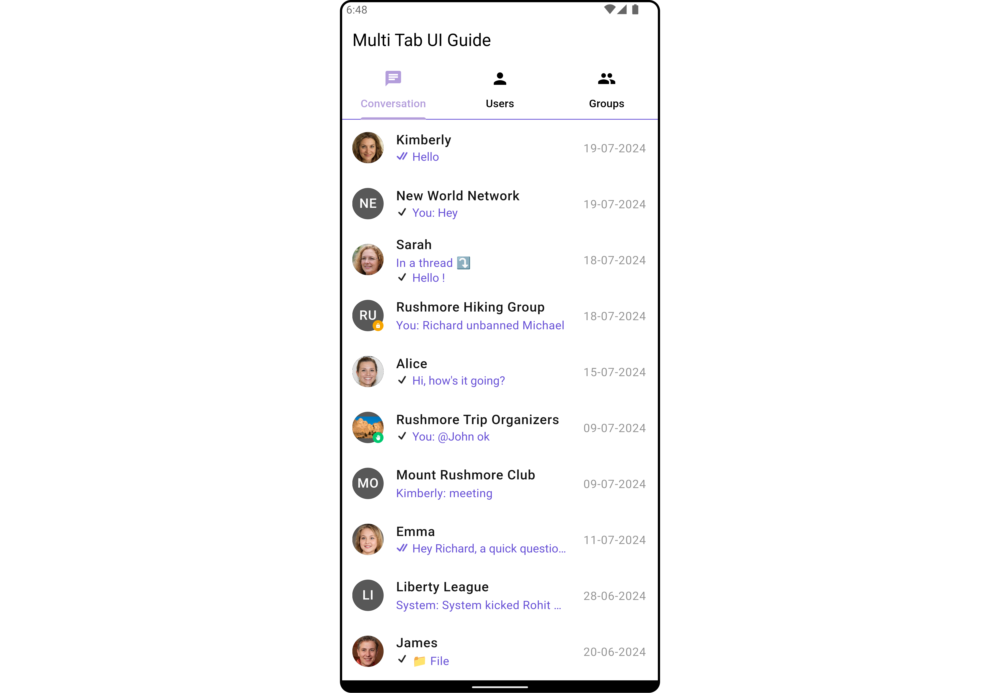
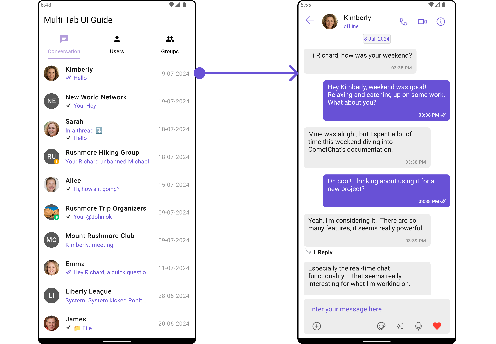
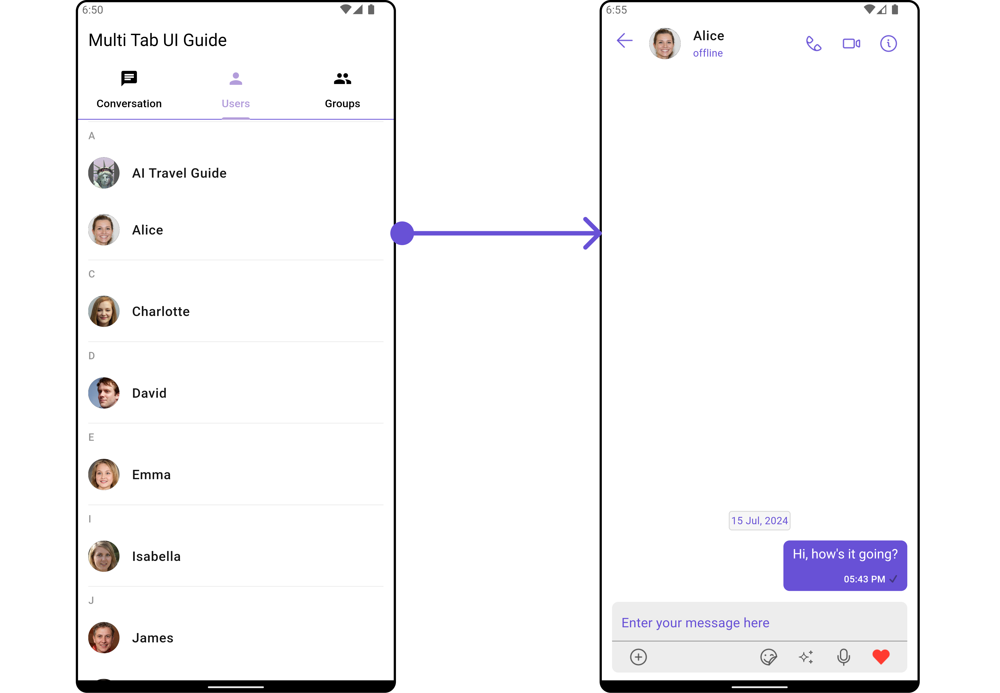
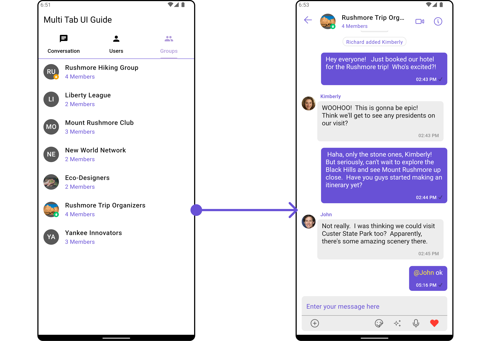
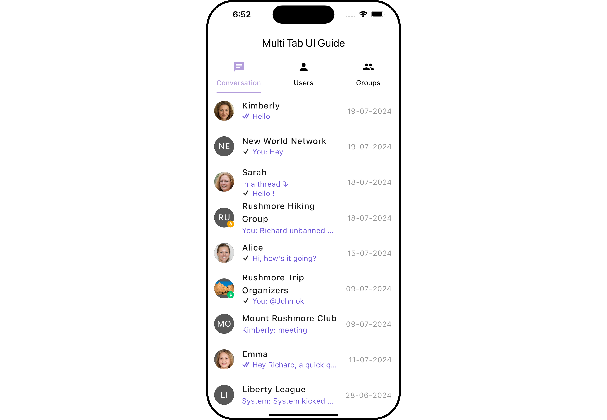
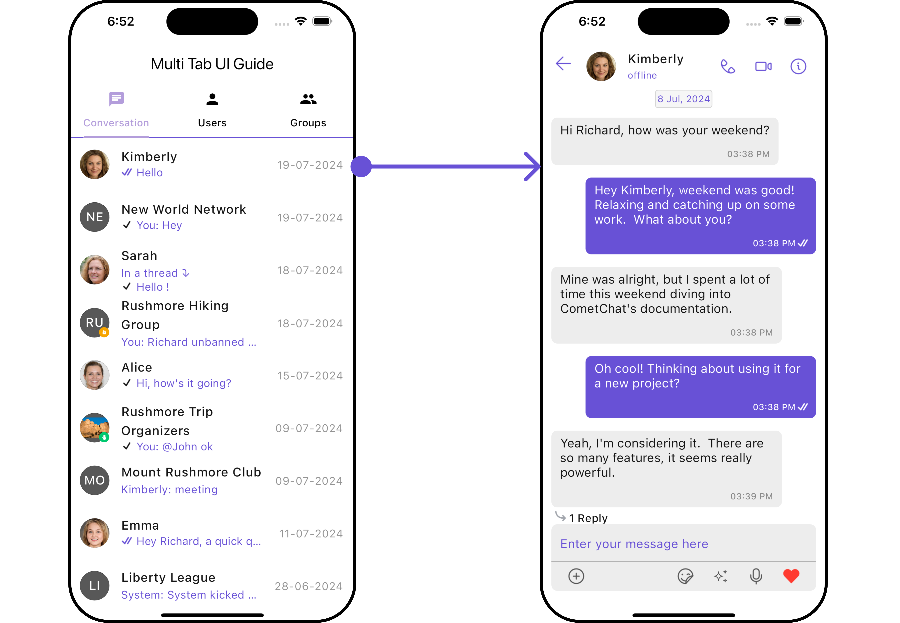
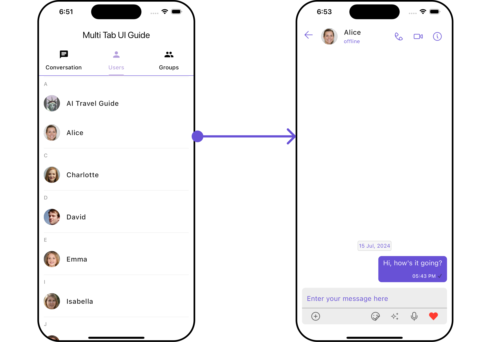
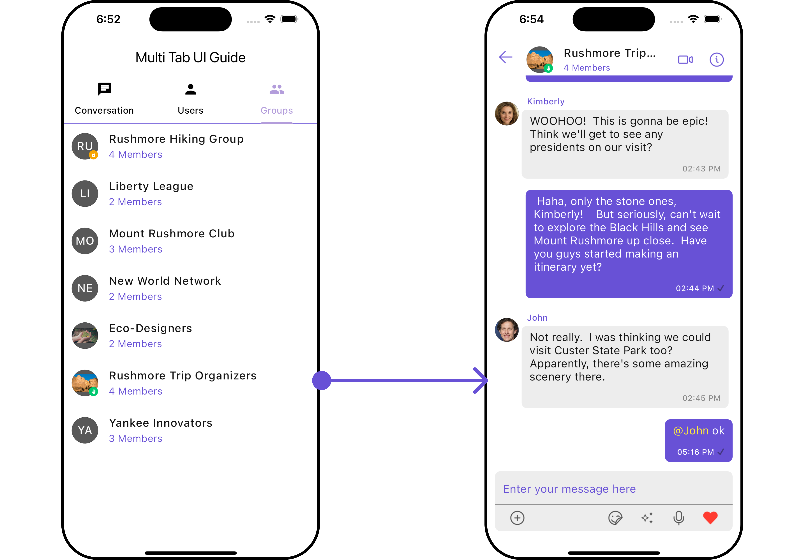

import Tabs from '@theme/Tabs';
import TabItem from '@theme/TabItem';

This guide will help you create a multi-tab chat user interface using the cometchat_chat_uikit package in Flutter. The final UI will consist of three tabs: Conversations, Users, and Groups.

<Tabs>

<TabItem value="Android Overview" label="Android (Overview)">



</TabItem>

<TabItem value="Android Conversations" label="Android (Conversations)">



</TabItem>

<TabItem value="Android Users" label="Android (Users)">



</TabItem>

<TabItem value="Android Groups" label="Android (Groups)">



</TabItem>

</Tabs>

<Tabs>

<TabItem value="iOS Overview" label="iOS (Overview)">



</TabItem>

<TabItem value="iOS Conversations" label="iOS (Conversations)">



</TabItem>

<TabItem value="iOS Users" label="iOS (Users)">



</TabItem>

<TabItem value="iOS Groups" label="iOS (Groups)">



</TabItem>

</Tabs>

##### Create the Multi-Tab Chat UI:

Update your `lib/multi_tab_chat_ui_guid.dart` file with the following code:

<Tabs>

<TabItem value="Dart" label="Dart">

```dart title = "multi_tab_chat_ui_guid.dart"
import 'package:cometchat_chat_uikit/cometchat_chat_uikit.dart';
import 'package:flutter/material.dart';

class MultiTabUIGuideExample extends StatefulWidget {
  const MultiTabUIGuideExample({super.key});

  @override
  State<MultiTabUIGuideExample> createState() => _MultiTabUIGuideExampleState();
}

class _MultiTabUIGuideExampleState extends State<MultiTabUIGuideExample> {

  @override
  Widget build(BuildContext context) {
    return DefaultTabController(
      length: 3,
      child: Scaffold(
        appBar: AppBar(
          title: const Text('Multi Tab UI Guide'),
          backgroundColor: Colors.white,
          leading: null,
          automaticallyImplyLeading: false,
          bottom: const TabBar(
            tabs: [
              Tab(icon: Icon(Icons.chat), text: 'Conversation'),
              Tab(icon: Icon(Icons.person), text: 'Users'),
              Tab(icon: Icon(Icons.group), text: 'Groups'),
            ],
          ),
        ),
        body: const TabBarView(
          children: [
            CometChatConversationsWithMessages(
                conversationsConfiguration: ConversationsConfiguration(
                    hideAppbar: true
                )
            ),
            CometChatUsersWithMessages(
                usersConfiguration: UsersConfiguration(
                    hideAppbar: true,
                    hideSearch: true
                )
            ),
            CometChatGroupsWithMessages(
                groupsConfiguration: GroupsConfiguration(
                    hideAppbar: true,
                    hideSearch: true
                )
            ),
          ],
        ),
      ),
    );
  }
}
```

</TabItem>

</Tabs>
