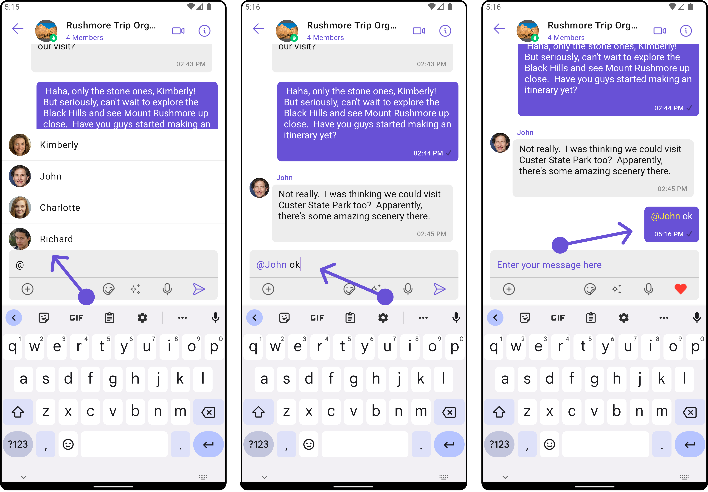
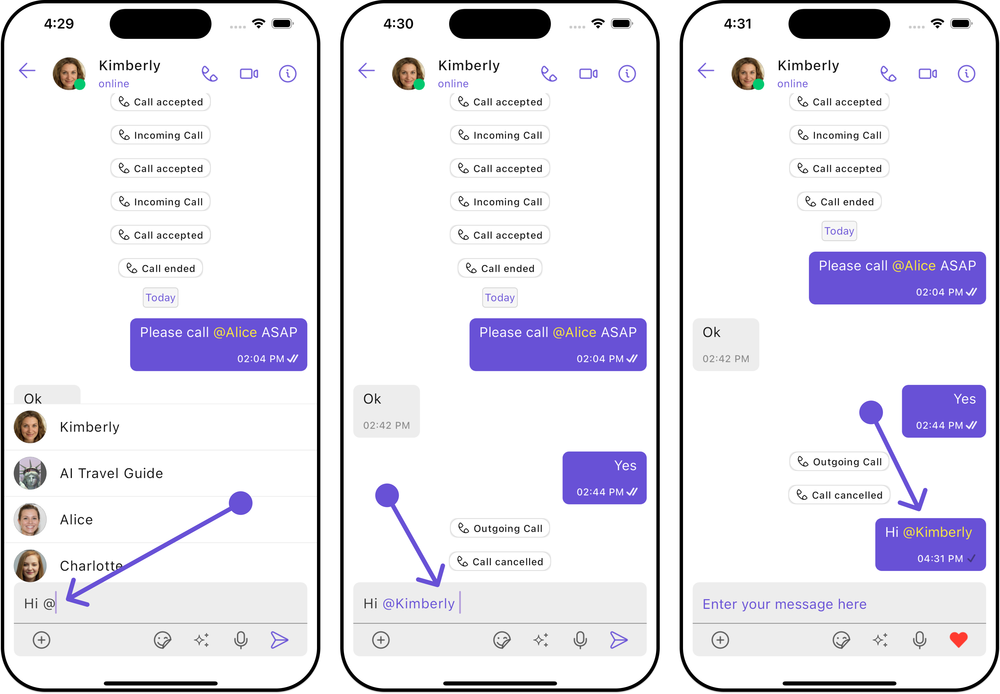
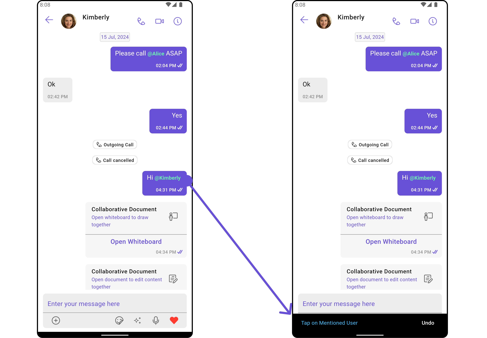
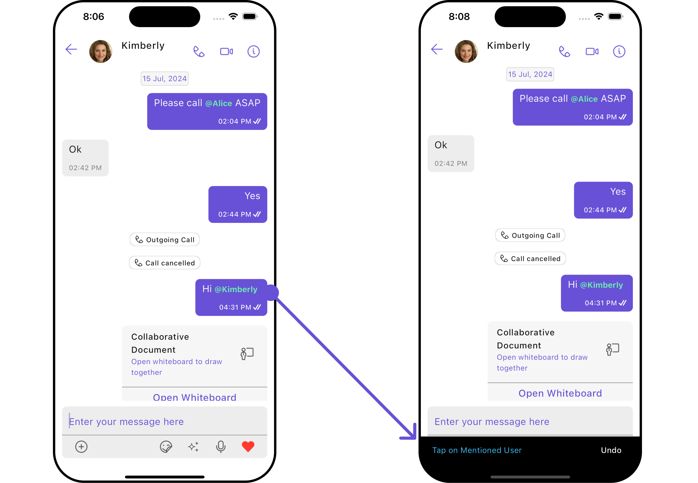
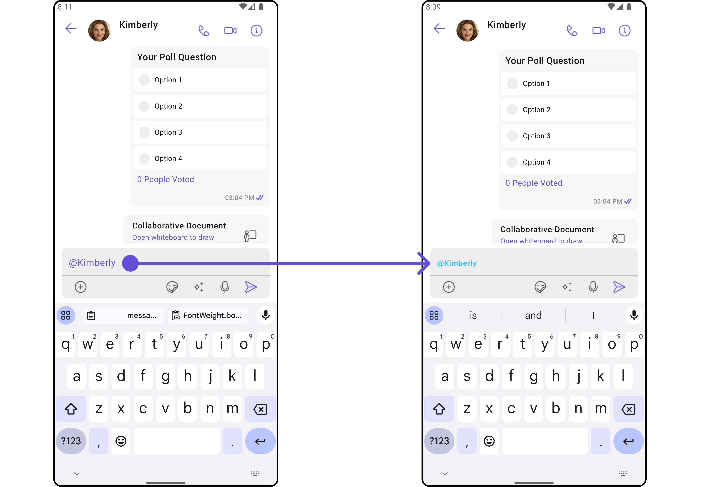
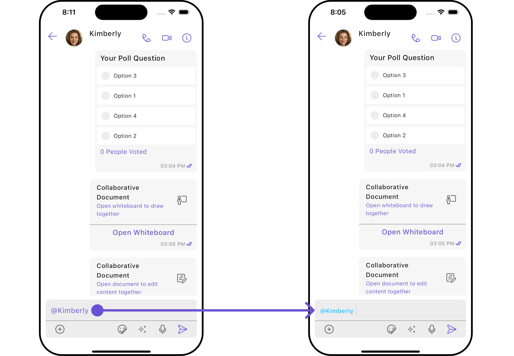
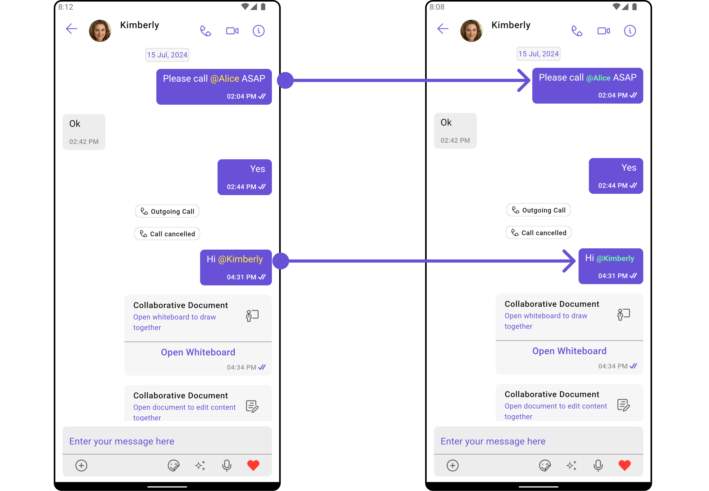
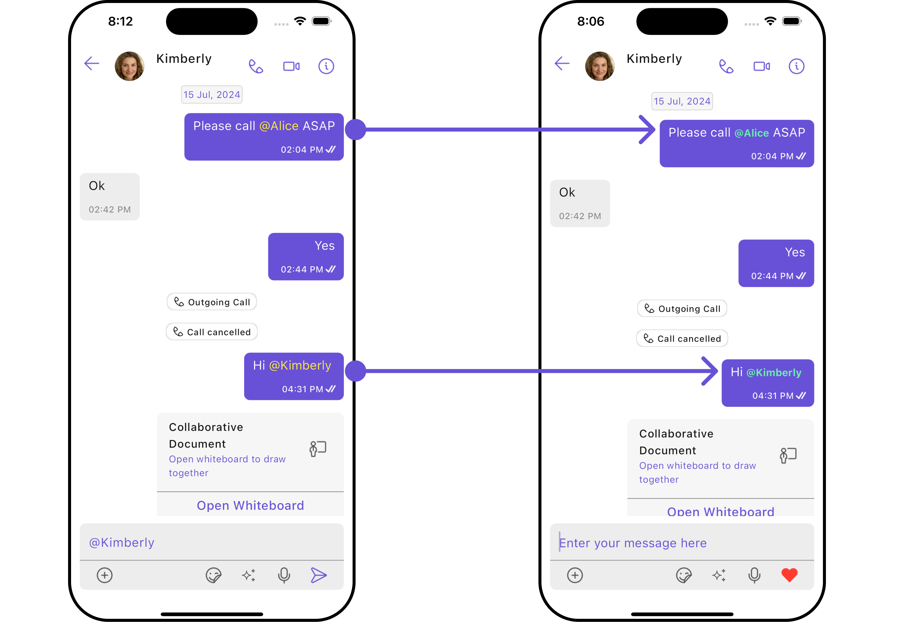
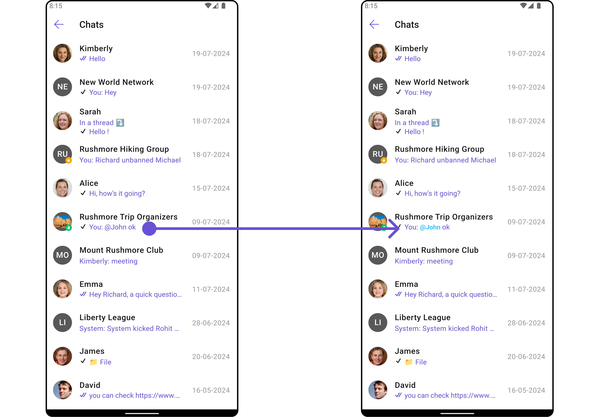
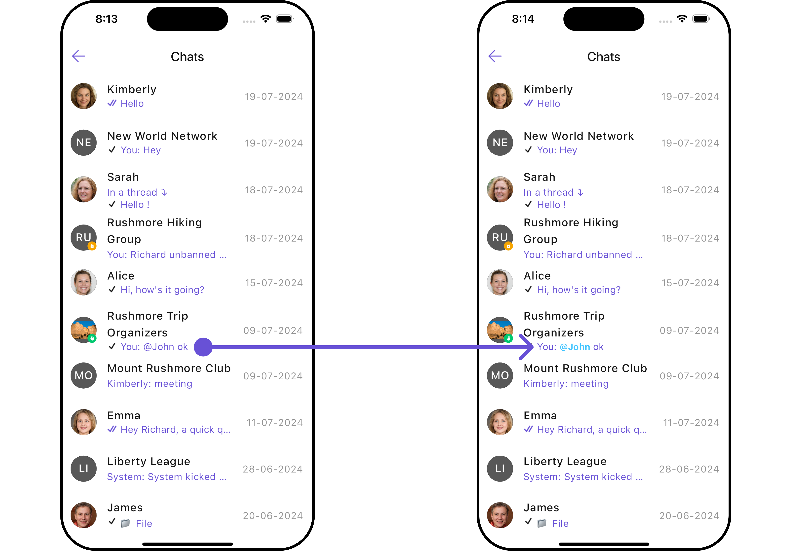

import Tabs from '@theme/Tabs';
import TabItem from '@theme/TabItem';

## Overview

The `CometChatMentionsFormatter` class is a part of the CometChat UI Kit, a ready-to-use chat UI widget library for integrating CometChat into your Android applications. This class provides functionality to format mentions within text messages displayed in the chat interface. Mentions allow users to reference other users within a conversation, providing a convenient way to direct messages or involve specific participants.

<Tabs>

<TabItem value="Android" label="Android">



</TabItem>

<TabItem value="iOS" label="iOS">



</TabItem>

</Tabs>

## Features

- **Mention Formatting**: Automatically formats mentions within text messages based on provided styles and settings.
- **Customizable Styles**: Allows customization of text styles for mentions, including colors, fonts, and background colors.
- **User and Group Member Mentions**: Supports mentions for both individual users and group members, providing flexibility in communication scenarios.
- **Mention List Generation**: Generates a list of suggested mentions based on user input, facilitating easy selection of recipients during message composition.
- **Mention Click Handling**: Provides a listener interface for handling click events on mentions, enabling custom actions to be performed when a mention is tapped by the user.

## Usage

To integrate the `CometChatMentionsFormatter` class into your application:

1. **Initialization**: Create an instance of the `CometChatMentionsFormatter` class and configure it with desired settings, such as mention text styles and limit settings.
2. **Set Mention Listeners**: Set listeners for handling mention click events (`setOnMentionClick`).

3. **Format Messages**: Use the `prepareLeftMessageBubbleSpan`, `prepareRightMessageBubbleSpan`, `prepareComposerSpan`, and `prepareConversationSpan` methods to format text messages with mentions appropriately for display in the chat interface.

4. **Customization**: Customize the appearance and behavior of mentions by adjusting the text styles, colors, and other formatting properties as needed.

Below is an example demonstrating how to use the `CometChatMentionsFormatter` class in widgets such as [CometChatConversations](/ui-kit/flutter/conversations), [CometChatMessageList](../05-Components/04-Messages/03-message-list.md), [CometChatMessageComposer](../05-Components/04-Messages/05-message-composer.md).

<Tabs>

<TabItem value="Dart" label="Dart">

```dart
textFormatters: [
    CometChatMentionsFormatter(
      messageBubbleTextStyle: (theme, alignment,{forConversation = false}) => 
        TextStyle(
            color: alignment==BubbleAlignment.left? Colors.orange : Colors.pink,
            fontSize: 14,
            fontWeight: FontWeight.bold
        ),
    )
]
```

</TabItem>

</Tabs>

---

## Actions

[Actions](/ui-kit/flutter/components-overview#actions) dictate how a widget functions. They are divided into two types: Predefined and User-defined. You can override either type, allowing you to tailor the behavior of the widget to fit your specific needs.

##### onMentionTap

Setting a listener for mention-click events in Message Bubbles enhances interactivity within the chat. This listener is activated when a mention is clicked, returning the corresponding user object. This feature transforms mentions into interactive links, enabling more in-depth and contextual engagement with the user associated with the clicked mention.

<Tabs>

<TabItem value="Dart" label="Dart">

```dart
CometChatMessages(
  user: user,
  messageListConfiguration: MessageListConfiguration(
      textFormatters: [
        CometChatMentionsFormatter(
          onMentionTap: (mention, mentionedUser, {message}) {
            final snackBar = SnackBar(
              content: const Text('Tap on Mentioned User', style: TextStyle(color: Colors.lightBlueAccent)),
              action: SnackBarAction(
                label: 'Undo',
                onPressed: () {
                  // TODO("Not yet implemented")
                },
              ),
            );
            ScaffoldMessenger.of(context).showSnackBar(snackBar);
          },
          messageBubbleTextStyle: (theme, alignment,{forConversation = false}) => TextStyle(
              color: alignment==BubbleAlignment.left? Colors.orange : Colors.greenAccent,
              fontSize: 14,
              fontWeight: FontWeight.bold
          ),
        )
      ]
  ),
)
```

</TabItem>

</Tabs>

<Tabs>

<TabItem value="Android" label="Android">



</TabItem>

<TabItem value="iOS" label="iOS">



</TabItem>

</Tabs>

---

## Customization

| **Property**                       | **Description**                                                                                       | **Code**                                             |
|------------------------------------|-------------------------------------------------------------------------------------------------------|------------------------------------------------------|
| **trackingCharacter**              | The character that triggers the mention search.                                                       | `String? trackingCharacter`                          |
| **pattern**                        | The regex pattern to identify mentions.                                                               | `RegExp? pattern`                                    |
| **showLoadingIndicator**           | Whether to show a loading indicator during mention search.                                            | `bool? showLoadingIndicator`                         |
| **onSearch**                       | Callback function to perform search when mention is triggered.                                        | `void Function(String)? onSearch`                    |
| **onError**                        | Callback function to handle errors during mention search.                                             | `void Function(String)? onError`                     |
| **theme**                          | The theme for styling the mentions formatter.                                                         | `ThemeData? theme`                                   |
| **message**                        | The message in which mentions are to be formatted.                                                    | `String? message`                                    |
| **messageBubbleTextStyle**         | The text style for the message bubble.                                                                | `TextStyle? messageBubbleTextStyle`                  |
| **messageInputTextStyle**          | The text style for the message input.                                                                 | `TextStyle? messageInputTextStyle`                   |
| **composerId**                     | The unique identifier for the composer.                                                               | `String? composerId`                                 |
| **suggestionListEventSink**        | The event sink for the suggestion list.                                                               | `EventSink<List<User>>? suggestionListEventSink`     |
| **previousTextEventSink**          | The event sink for the previous text before mention.                                                  | `EventSink<String>? previousTextEventSink`           |
| **user**                           | The user to be mentioned.                                                                             | `User? user`                                         |
| **group**                          | The group in which mentions are to be formatted.                                                      | `Group? group`                                       |
| **groupMembersRequestBuilder**     | The request builder for fetching group members to mention.                                            | `GroupMembersRequestBuilder? groupMembersRequestBuilder` |
| **usersRequestBuilder**            | The request builder for fetching users to mention.                                                    | `UsersRequestBuilder? usersRequestBuilder`           |
| **mentionsType**                   | The type of mentions (e.g., user, group).                                                             | `MentionsType? mentionsType`                         |
| **onMentionTap**                   | Callback function to handle mention tap actions.                                                      | `void Function(User)? onMentionTap`                  |
| **visibleIn**                      | Defines where the mentions are visible.                                                               | `Set<ComposerMentionVisibility>? visibleIn`          |

---

## Advance

For advanced-level customization, you can set the style of the Mentions formatters. This lets you tailor each aspect of the widget to fit your exact needs and application aesthetics. You can create and define your formatters style.

### Composer Mention Text Style

Assigns the list of text formatters. If the provided list is not null, it sets the list. Otherwise, it assigns the default text formatters retrieved from the data source. To configure the existing Mentions look and feel for [CometChatMessageComposer](/ui-kit/flutter/message-composer) refer to the below code snippet

<Tabs>

<TabItem value="Dart" label="Dart">

```dart
CometChatMessages(
    user: user,
    messageComposerConfiguration: MessageComposerConfiguration(
        textFormatters: [
            CometChatMentionsFormatter(
                messageInputTextStyle: (theme) {
                    return const TextStyle(
                    color: Colors.lightBlueAccent,
                    fontSize: 14,
                    fontWeight: FontWeight.bold
                );
            },
        )
        ]
    )
)
```

</TabItem>

</Tabs>

<Tabs>

<TabItem value="Android" label="Android">



</TabItem>

<TabItem value="iOS" label="iOS">



</TabItem>

</Tabs>

---

### Message Bubble Mention Text Style

Assigns the list of text formatters. If the provided list is not null, it sets the list. Otherwise, it assigns the default text formatters retrieved from the data source. To configure the existing Mentions look and feel for [CometChatMessageList](../../flutter/05-Components/04-Messages/03-message-list.md)

<Tabs>

<TabItem value="Dart" label="Dart">

```dart
CometChatMessages(
  user: user,
  messageListConfiguration: MessageListConfiguration(
      textFormatters: [
        CometChatMentionsFormatter(
          messageBubbleTextStyle: (theme, alignment,{forConversation = false}) => TextStyle(
              color: alignment==BubbleAlignment.left? Colors.orange : Colors.greenAccent,
              fontSize: 14,
              fontWeight: FontWeight.bold
          ),
        )
      ]
  ),
)
```

</TabItem>

</Tabs>

<Tabs>

<TabItem value="Android" label="Android">



</TabItem>

<TabItem value="iOS" label="iOS">



</TabItem>

</Tabs>

---

### Conversations Mention Text Style

Assigns the list of text formatters. If the provided list is not null, it sets the list. Otherwise, it assigns the default text formatters retrieved from the data source. To configure the existing Mentions look and feel for [CometChatConversations](/ui-kit/flutter/conversations)


<Tabs>

<TabItem value="Dart" label="Dart">

```dart
CometChatConversations(
  textFormatters: [
    CometChatMentionsFormatter(
      messageBubbleTextStyle: (theme, alignment,{forConversation = false}) =>
          const TextStyle(
              color: Colors.lightBlueAccent,
              fontSize: 14,
              fontWeight: FontWeight.bold
          ),
    )
  ],
)
```

</TabItem>

</Tabs>

<Tabs>

<TabItem value="Android" label="Android">



</TabItem>

<TabItem value="iOS" label="iOS">



</TabItem>

</Tabs>

---

