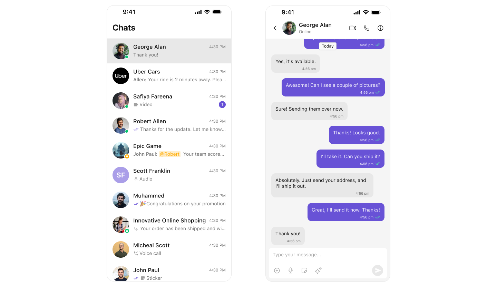
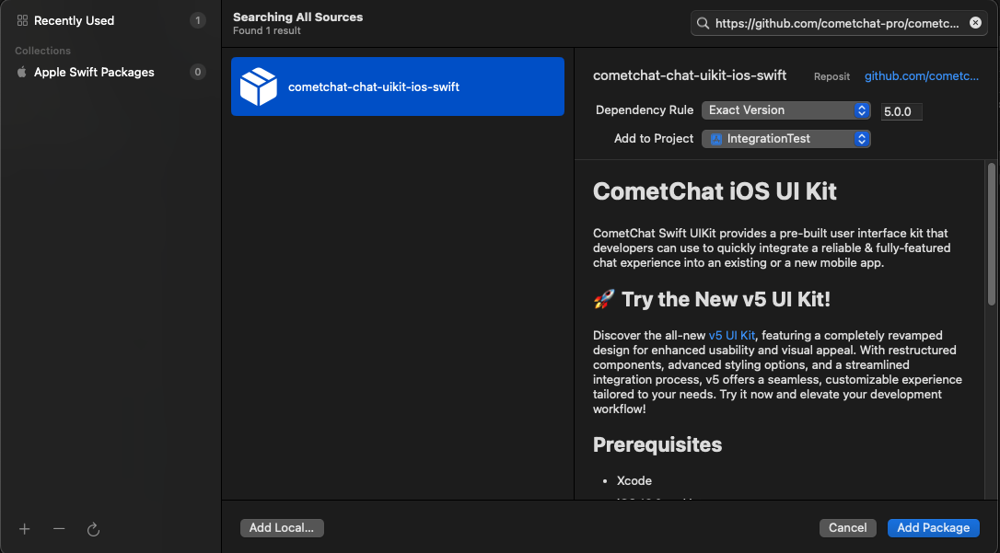
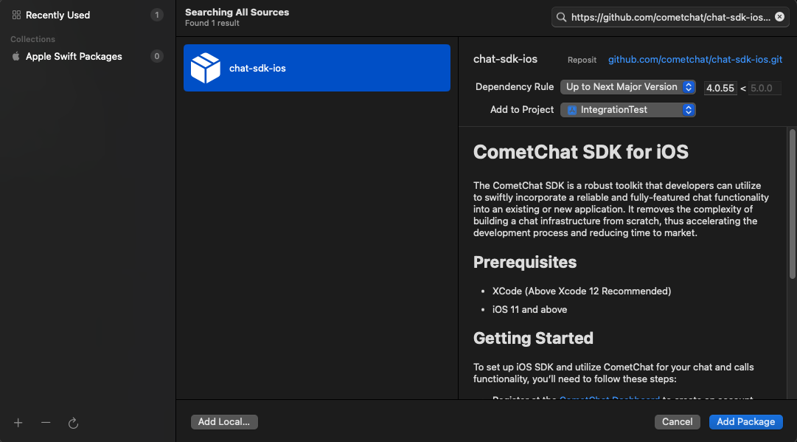
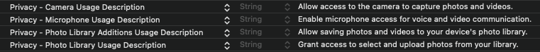
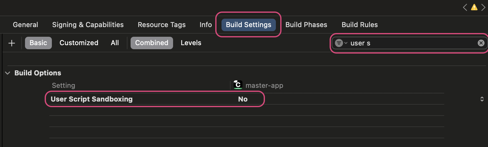
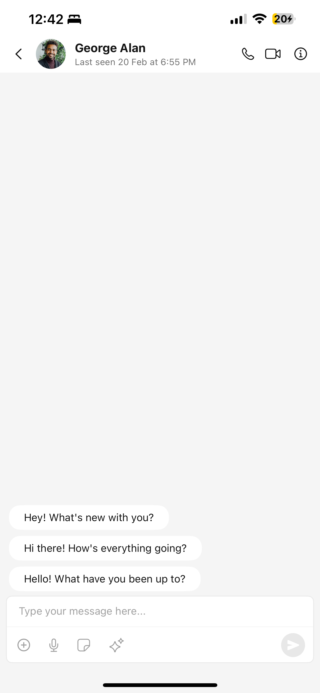

import Tabs from '@theme/Tabs';
import TabItem from '@theme/TabItem';

## Start your first conversation

CometChat UI Kit for iOS is a package of pre-assembled UI elements crafted to streamline the creation of an in-app chat equipped with essential messaging functionalities. Our UI Kit presents options for light and dark themes, diverse fonts, colors, and extra customization capabilities.

CometChat UI Kit supports both one-to-one and group conversations. Follow the guide below to initiate conversations from scratch using CometChat iOS UI Kit.



## Prerequisites

Before installing the **UI Kit**, you need to create a CometChat application on the CometChat Dashboard, which includes all the necessary data for a chat service, such as users, groups, calls, and messages. You will require the `App ID`, `AuthKey`, and `Region` of your CometChat application when initializing the SDK.

**i. Register on CometChat**

- You need to register on the **CometChat Dashboard** first. [Click here to sign up](https://app.cometchat.com/login).

**ii. Get Your Application Keys**

- Create a **new app**
- Head over to the **QuickStart** or **API & Auth Keys section** and note the **App ID**, **Auth Key**, and **Region**.

> Each CometChat application can be integrated with a single client app. Within the same application, users can communicate with each other across all platforms, whether they are on mobile devices or on the web.

**iii. IDE Setup**

- You have Xcode installed on your machine.
- You have an iOS device or simulator with iOS version 13.0 or above.
- Swift 5.0.
- macOS.

## Getting Started

<span style={{padding: '6px 15px', 'background-color': '#6851D6', color: 'white', 'border-radius': '15px', 'font-size': '0.9em', 'font-weight': 'bold'}}>Step 1</span>

### Create a project

    To get started, open Xcode and create a new project for UI Kit in the Project window as follows:

    1. Select **iOS App** in the **Choose a template for your new project** window and click Next.
    1. Enter your project name in the **Name** field in the **Choose options for your new project** window.
    1. Enter your identifier in the **Bundle Identifier** field in the **Choose options for your new project** window.
    1. Select **Storyboard** in the **Interface** field in the **Choose options for your new project** window.
    1. Select **Swift** in the **Language** field in the **Choose options for your new project** window.

---

<span style={{padding: '6px 15px', 'background-color': '#6851D6', color: 'white', 'border-radius': '15px', 'font-size': '0.9em', 'font-weight': 'bold'}}>Step 2</span>

### Add Dependency

This developer kit is an add-on feature to CometChat iOS SDK so installing it will also install the core Chat SDK. You can install add CometChatUIKit into you iOS project using CocoaPods and Swift Package Manager (SPM).

We recommend using CocoaPods, as they are the most advanced way of managing iOS project dependencies. Open a terminal window, move to your project directory, and then create a Podfile by running the following command.

<Tabs>

<TabItem value="CocoaPods" label="CocoaPods">

Create pod file by running following command into you project's base level

```groovy title="Swift"
$ pod init
```

Add the following lines to the Podfile.

```groovy title="Swift"
platform :ios, '13.0'
use_frameworks!

target 'YourApp' do
  pod 'CometChatUIKitSwift', '5.0.0'
end
```

And then install the CometChatUIKit framework through CocoaPods.

```groovy title="Swift"
$ pod install
```

If you're facing any issues while installing pods then use the below command.

```groovy title="Swift"
$ pod install --repo-update
```

Always get the latest version of CometChatUIKit by command.

```groovy title="Swift"
$ pod update CometChatUIKitSwift
```

:::tip

Always ensure to open the XCFramework file after adding the dependencies.

:::

</TabItem>

<TabItem value="spm" label="Swift Package Manager (SPM)">

**Swift Package Manager** (SPM) is Apple’s built-in tool for managing dependencies in Swift projects. It allows developers to integrate and manage third-party libraries seamlessly.

1. Go to **File** tab and select **Add Package Dependencies.**

2. Enter the repository URL of the Swift package.

```groovy
git@github.com:cometchat/cometchat-uikit-ios.git
```

3. To add the package, select Version Rules, enter Up to Exact Version and click Add package.

   Exact Version

   ```
   5.0.0
   ```

   

4. Add `CometChatSDK` repeating the above steps for following link and exact version:

   Link

   ```
   https://github.com/cometchat/chat-sdk-ios.git
   ```

   Exact Version

   ```
   4.0.55
   ```

   

---

<span style={{padding: '6px 15px', 'background-color': '#6851D6', color: 'white', 'border-radius': '15px', 'font-size': '0.9em', 'font-weight': 'bold'}}>Step 3</span>

</TabItem>

</Tabs>

### Configure Privacy Permissions

1. To enable media messaging in your app, you must allow **Camera**, **Microphone**, and **Photo Library** access in `Info.plist`. These permissions are required for sending and receiving media files.

   ```swift title="Info.plist"
   <key>NSCameraUsageDescription</key>
   <string>Allow access to the camera to capture photos and videos.</string>

   <key>NSMicrophoneUsageDescription</key>
   <string>Enable microphone access for voice and video communication.</string>

   <key>NSPhotoLibraryAddUsageDescription</key>
   <string>Allow saving photos and videos to your device's photo library.</string>

   <key>NSPhotoLibraryUsageDescription</key>
   <string>Grant access to select and upload photos from your library.</string>
   ```

   

2. Navigate to your Build Settings and disable the User Script Sandboxing option.

   Disabling User Script Sandboxing ensures that WebView can load and execute scripts necessary for collaborative tools.

   

---

<span style={{padding: '6px 15px', 'background-color': '#6851D6', color: 'white', 'border-radius': '15px', 'font-size': '0.9em', 'font-weight': 'bold'}}>Step 4</span>

### Initialize & Login

To start using the UI Kit, you first need to `initialize` and `log in`. Follow the steps below to get started:

1. **Initialization**  
   Call the `Init` method to set up the necessary configurations for CometChat in your app. This step should be done **before** invoking any other methods from CometChat UI Kit or SDK.

2. **User Login**  
   Once initialized, use the `login()` method to authenticate the user. This method will return a **User object** containing all relevant user details. For testing purposes, you can use the following pre-generated users:

   - `cometchat-uid-1`
   - `cometchat-uid-2`
   - `cometchat-uid-3`
   - `cometchat-uid-4`
   - `cometchat-uid-5`

For more details, refer to the documentation on [Init](methods#init) and [Login](methods#login-using-auth-key).

You can initialize CometChat and log in a user in your `SceneDelegate.swift` file. Upon successful login.

```swift title="SceneDelegate.swift"
import UIKit
import CometChatUIKitSwift

class SceneDelegate: UIResponder, UIWindowSceneDelegate {

    var window: UIWindow?

    func scene(_ scene: UIScene, willConnectTo session: UISceneSession, options connectionOptions: UIScene.ConnectionOptions) {

        guard let windowScene = (scene as? UIWindowScene) else { return }

        let uikitSettings = UIKitSettings()
            .set(appID: "<#Enter Your App ID Here#>")
            .set(authKey: "<#Enter Your AuthKey Here#>")
            .set(region: "<#Enter Your Region Code Here#>")
            .subscribePresenceForAllUsers()
            .build()

        CometChatUIKit.init(uiKitSettings: uikitSettings) { result in
            switch result {
            case .success:
                debugPrint("CometChatUIKit initialization succeeded")

                let uid = "cometchat-uid-1"

                CometChatUIKit.login(uid: uid) { loginResult in
                    switch loginResult {
                    case .success:
                        debugPrint("CometChatUIKit login succeeded")

                    case .onError(let error):
                        debugPrint("CometChatUIKit login failed with error: \(error.description)")
                    @unknown default:
                        break
                    }
                }

            case .failure(let error):
                debugPrint("CometChatUIKit initialization failed with error: \(error.localizedDescription)")
            }
        }
    }
}
```

:::info

Make sure to replace the **appId** with your CometChat appId and **region** with your app region in the above code.

:::

After running the app, you should see the following log message:

```shell title="Console"
"CometChatUIKit initialization succeeded"
"CometChatUIKit login succeeded"
```

<span style={{padding: '6px 15px', 'background-color': '#6851D6', color: 'white', 'border-radius': '15px', 'font-size': '0.9em', 'font-weight': 'bold'}}>Step 5</span>

### Render Conversations

[CometChatConversations](/ui-kit/ios/conversations) is a component that enables opening the MessagesVC(your custom view controller to show chat messages) by tapping on any conversation rendered in the list of conversations.

This code sets up `CometChatConversations` as the main screen inside a navigation controller, making it the entry point of the app. After initializing the conversations view, it wraps it in a UINavigationController, sets it as the root view controller, and ensures the window is visible.

```swift
let conversationsVC = CometChatConversations()
let navController = UINavigationController(rootViewController: conversationsVC)
self.window?.rootViewController = navController
self.window?.makeKeyAndVisible()
```

The final `SceneDelegate.swift` file includes both CometChat initialization and navigation to the Conversations screen and Conversation `onItemClick`:

```swift title="SceneDelegate.swift"
import UIKit
import CometChatSDK
import CometChatUIKitSwift

class SceneDelegate: UIResponder, UIWindowSceneDelegate {

    var window: UIWindow?

    func scene(_ scene: UIScene, willConnectTo session: UISceneSession, options connectionOptions: UIScene.ConnectionOptions) {

        guard let windowScene = (scene as? UIWindowScene) else { return }

        let uikitSettings = UIKitSettings()
            .set(appID: "<#Enter Your App ID Here#>")
            .set(authKey: "<#Enter Your AuthKey Here#>")
            .set(region: "<#Enter Your Region Code Here#>")
            .subscribePresenceForAllUsers()
            .build()

        CometChatUIKit.init(uiKitSettings: uikitSettings) { result in
            switch result {
            case .success:
                debugPrint("CometChatUIKit initialization succeeded")

                let uid = "cometchat-uid-1"

                CometChatUIKit.login(uid: uid) { loginResult in
                    switch loginResult {
                    case .success:
                        debugPrint("CometChatUIKit login succeeded")

                        // open CometChat Conversations
                        DispatchQueue.main.async {
                            let conversations = CometChatConversations()
                            let navController = UINavigationController(rootViewController: conversations)
                            //Conversations onItemClick click
                            conversations.set(onItemClick: { [weak self] conversation, indexPath in
                                // Your code to handle click
                            })

                            self.window?.rootViewController = navController
                            self.window?.makeKeyAndVisible()
                        }

                    case .onError(let error):
                        debugPrint("CometChatUIKit login failed with error: \(error.description)")
                    @unknown default:
                        break
                    }
                }

            case .failure(let error):
                debugPrint("CometChatUIKit initialization failed with error: \(error.localizedDescription)")
            }
        }
    }
}
```

---

<span style={{padding: '6px 15px', 'background-color': '#6851D6', color: 'white', 'border-radius': '15px', 'font-size': '0.9em', 'font-weight': 'bold'}}>Step 6</span>

### Rendering the Messages Component

To achieve full messaging functionality, you need to combine the following three components:

- [Message Header](./05-Components/06-message-header.md)
- [Message List](./05-Components/07-message-list.md)
- [Message Composer](./05-Components/08-message-composer.md)

Below are the steps to render Messages Screen:



1. Create a new `UIViewController` class named MessagesVC. Inside this class, define two optional variables to store the `User` or `Group` for the chat window.

   ```swift title="MessagesVC.swift"
    import UIKit
    import CometChatSDK
    import CometChatUIKitSwift

    class MessagesVC: UIViewController {

        var user: User?
        var group: Group?

        override func viewDidLoad() {
            super.viewDidLoad()
            // Do any additional setup after loading the view.
        }
    }
   ```

   These variables will be assigned when a user selects a conversation from CometChatConversations.

2. Define three lazy-loaded UI components for your chat screen `headerView` , `messageListView` amd `composerView` as follows

   ```swift title="MessagesVC.swift"
   //Setting up header
   lazy var headerView: CometChatMessageHeader = {
       let headerView = CometChatMessageHeader()
       headerView.translatesAutoresizingMaskIntoConstraints = false
       headerView.heightAnchor.constraint(equalToConstant: 50).isActive = true
       if let user = user { headerView.set(user: user) }
       if let group = group { headerView.set(group: group) }
       headerView.set(controller: self) //passing controller needs to be mandatory
       return headerView
   }()

   //Setting up composer
   lazy var composerView: CometChatMessageComposer = {
       let messageComposer = CometChatMessageComposer(frame: .null)
       if let user = user { messageComposer.set(user: user) }
       if let group = group { messageComposer.set(group: group) }
       messageComposer.set(controller: self)
       messageComposer.translatesAutoresizingMaskIntoConstraints = false
       return messageComposer
   }()

   //Setting up message list
   lazy var messageListView: CometChatMessageList = {
       let messageListView = CometChatMessageList(frame: .null)
       messageListView.translatesAutoresizingMaskIntoConstraints = false
       if let user = user { messageListView.set(user: user) }
       if let group = group { messageListView.set(group: group) }
       messageListView.set(controller: self)
       return messageListView
   }()

   ```

3. Add these components to the view and set up layout constraints in a separate function called `buildUI()` and call it inside `viewDidLoad()`.

   ```swift title="MessagesVC.swift"
   func buildUI() {

       view.addSubview(headerView)
       view.addSubview(messageListView)
       view.addSubview(composerView)

       NSLayoutConstraint.activate([
           headerView.topAnchor.constraint(equalTo: view.safeAreaLayoutGuide.topAnchor),
           headerView.leadingAnchor.constraint(equalTo: view.leadingAnchor),
           headerView.trailingAnchor.constraint(equalTo: view.trailingAnchor),

           messageListView.topAnchor.constraint(equalTo: headerView.bottomAnchor),
           messageListView.leadingAnchor.constraint(equalTo: view.leadingAnchor),
           messageListView.trailingAnchor.constraint(equalTo: view.trailingAnchor),

           composerView.topAnchor.constraint(equalTo: messageListView.bottomAnchor),
           composerView.leadingAnchor.constraint(equalTo: view.leadingAnchor),
           composerView.trailingAnchor.constraint(equalTo: view.trailingAnchor),
           composerView.bottomAnchor.constraint(equalTo: view.bottomAnchor),
       ])
   }
   ```

   Now, call buildUI() inside viewDidLoad()

   ```swift title="MessagesVC"
   override func viewDidLoad() {
       super.viewDidLoad()
       buildUI()
   }
   ```

   The final `MessagesVC.swift` as follows

   ```swift title="MessagesVC.swift"
    import UIKit
    import CometChatSDK
    import CometChatUIKitSwift

    class MessagesVC: UIViewController {

        var user: User?
        var group: Group?


        //Setting up header
        lazy var headerView: CometChatMessageHeader = {
            let headerView = CometChatMessageHeader()
            headerView.translatesAutoresizingMaskIntoConstraints = false
            headerView.heightAnchor.constraint(equalToConstant: 50).isActive = true
            if let user = user { headerView.set(user: user) }
            if let group = group { headerView.set(group: group) }
            headerView.set(controller: self) //passing controller needs to be mandatory
            return headerView
        }()

        //Setting up composer
        lazy var composerView: CometChatMessageComposer = {
            let messageComposer = CometChatMessageComposer(frame: .null)
            if let user = user { messageComposer.set(user: user) }
            if let group = group { messageComposer.set(group: group) }
            messageComposer.set(controller: self)
            messageComposer.translatesAutoresizingMaskIntoConstraints = false
            return messageComposer
        }()

        //Setting up message list
        lazy var messageListView: CometChatMessageList = {
            let messageListView = CometChatMessageList(frame: .null)
            messageListView.translatesAutoresizingMaskIntoConstraints = false
            if let user = user { messageListView.set(user: user) }
            if let group = group { messageListView.set(group: group) }
            messageListView.set(controller: self)
            return messageListView
        }()


        func buildUI() {

            view.addSubview(headerView)
            view.addSubview(messageListView)
            view.addSubview(composerView)

            NSLayoutConstraint.activate([
                headerView.topAnchor.constraint(equalTo: view.safeAreaLayoutGuide.topAnchor),
                headerView.leadingAnchor.constraint(equalTo: view.leadingAnchor),
                headerView.trailingAnchor.constraint(equalTo: view.trailingAnchor),

                messageListView.topAnchor.constraint(equalTo: headerView.bottomAnchor),
                messageListView.leadingAnchor.constraint(equalTo: view.leadingAnchor),
                messageListView.trailingAnchor.constraint(equalTo: view.trailingAnchor),

                composerView.topAnchor.constraint(equalTo: messageListView.bottomAnchor),
                composerView.leadingAnchor.constraint(equalTo: view.leadingAnchor),
                composerView.trailingAnchor.constraint(equalTo: view.trailingAnchor),
                composerView.bottomAnchor.constraint(equalTo: view.bottomAnchor),
            ])
        }

        override func viewDidLoad() {
            super.viewDidLoad()

            self.navigationController?.setNavigationBarHidden(true, animated: false)
            self.view.backgroundColor = .systemBackground
            buildUI()
        }

        override func viewWillDisappear(_ animated: Bool) {
            super.viewWillDisappear(animated)
            self.navigationController?.setNavigationBarHidden(false, animated: false)
        }
    }
   ```

4. Modify `CometChatConversations` in `SceneDelegate.swift` to open `MessagesVC.swift` when a user taps on a conversation.

   ```swift title="SceneDelegate.swift"
   conversations.set(onItemClick: { [weak self] conversation, indexPath in
       let messages = MessagesVC()
       messages.group = (conversation.conversationWith as? Group)
       messages.user = (conversation.conversationWith as? CometChatSDK.User)
       navController.pushViewController(messages, animated: true)
   })
   ```
