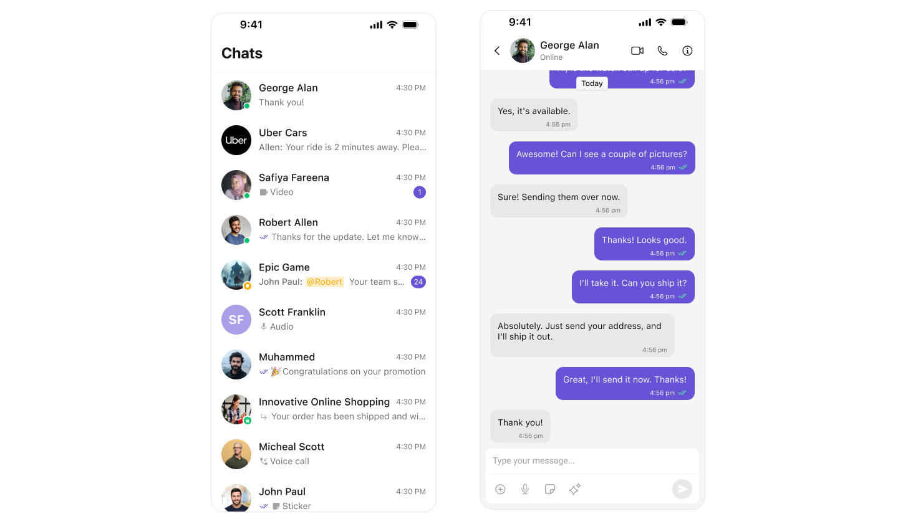
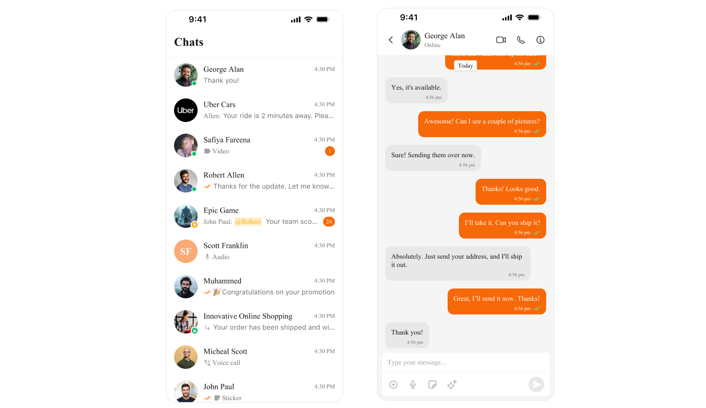

import Tabs from '@theme/Tabs';
import TabItem from '@theme/TabItem';

## Overview

Theming in CometChat for iOS allows you to create visually consistent and customizable user interfaces that align with your application's branding. The CometChatTheme system enables global theming, customization of colors, typography, spacing, and component-specific styles to enhance the user experience across all CometChat components.

With global styles and an easy-to-override architecture, you can seamlessly apply themes at both a global and component level.

## Using Theming in Your Project

Global Theming

Set up the global theme for your application during the app launch. This ensures all CometChat components use the specified theme.

Example in AppDelegate.swift

<Tabs>
<TabItem value="js" label="swift">

```swift
import UIKit
import CometChatSDK

@main
class AppDelegate: UIResponder, UIApplicationDelegate {
    var window: UIWindow?

    func application(_ application: UIApplication, didFinishLaunchingWithOptions launchOptions: [UIApplication.LaunchOptionsKey: Any]?) -> Bool {
        
        // Apply the global theme
        CometChatTheme.primaryColor = UIColor.systemBackground
        
        // Apply custom typography
        CometChatTypography.Body.regular = UIFont.systemFont(ofSize: 18, weight: .bold)
        
        return true
    }
}
```

</TabItem>
</Tabs>



## Customization

Customizing Colors

Override specific color attributes globally in CometChatTheme. This is equivalent to overriding attributes in Android's themes.xml.

Example: Setting Primary Color

<Tabs>
<TabItem value="js" label="swift">

```swift
CometChatTheme.primaryColor = UIColor(hex: "#F76808") // Custom primary color
```

</TabItem>
</Tabs>

