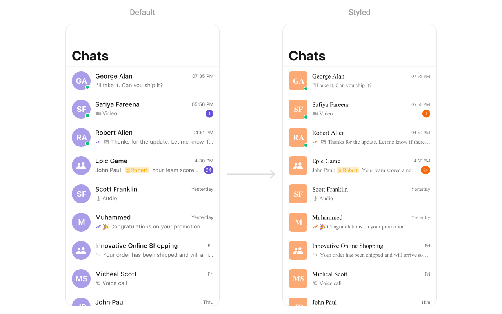
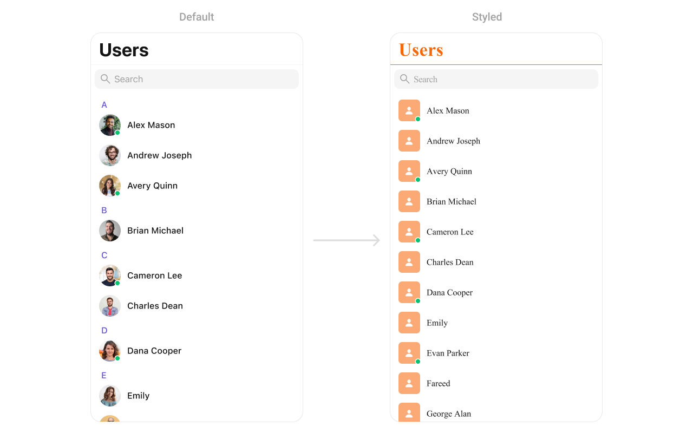
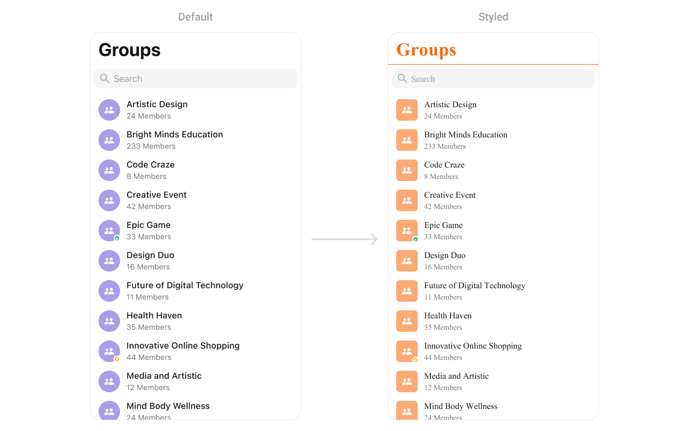
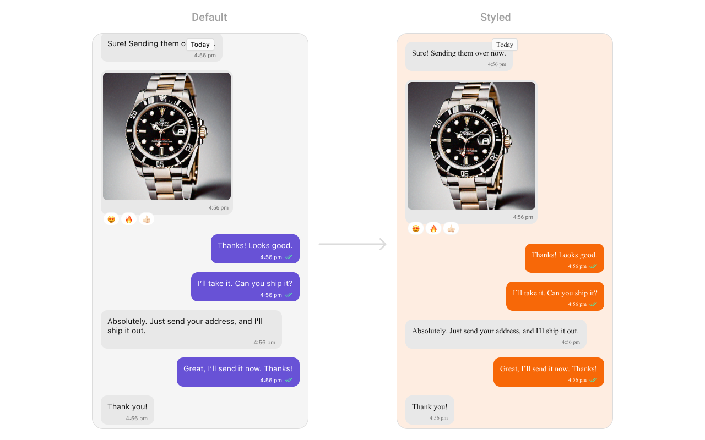

import Tabs from '@theme/Tabs';
import TabItem from '@theme/TabItem';

## Overview

CometChat UIKit for iOS enables developers to integrate customizable components into their applications effortlessly. Each component is designed to ensure a consistent user experience, offering flexibility to align with your app’s design system. You can modify attributes such as colors, fonts, sizes, and more using CometChatTheme or directly applying styles to components.

Below is a detailed guide for styling individual components within the UIKit.

## Components

### Conversations
The `CometChatConversations` component provides a list of recent chats, displaying participants, message previews, and timestamps. It supports default themes while offering extensive customization for text appearance, icons, and layout. This component allows you to create an intuitive and visually appealing chat list that matches your app's branding.

You can check out the list of styling properties offered by [CometChatConversations](https://github.com/cometchat/cometchat-uikit-ios/blob/v5/CometChatUIKitSwift/Components/Conversations/ConversationsStyle.swift)

<Tabs>
<TabItem value="js" label="swift">

```swift
let customAvatarStyle = AvatarStyle() 
customAvatarStyle.backgroundColor = UIColor(hex: "#FBAA75")
customAvatarStyle.cornerRadius = 8

let customReceiptStyle = ReceiptStyle() 
customReceiptStyle.backgroundColor = UIColor(hex: "#F76808")

let customBadgeStyle = BadgeStyle()
customBadgeStyle.backgroundColor = UIColor(hex: "#F76808")

let customConversation = CometChatConversation()
customConversation.avatarStyle = customAvatarStyle 
customConversation.receiptStyle = customReceiptStyle
customConversation.badgeStyle = customBadgeStyle
```

</TabItem>
</Tabs>



### Users
The CometChatUsers component displays a scrollable list of users, ideal for showcasing available contacts for messaging, calls, or group creation. Customization includes user avatars, status indicators, and list backgrounds, enabling alignment with your app's design system.

You can check out the list of styling properties offered by [CometChatUsers](https://github.com/cometchat/cometchat-uikit-ios/blob/v5/CometChatUIKitSwift/Components/Users/UsersStyle.swift)

<Tabs>
<TabItem value="js" label="swift">

```swift
let customAvatarStyle = AvatarStyle() 
customAvatarStyle.backgroundColor = UIColor(hex: "#FBAA75")
customAvatarStyle.cornerRadius = 8

let customReceiptStyle = ReceiptStyle() 
customReceiptStyle.backgroundColor = UIColor(hex: "#F76808")

let customBadgeStyle = BadgeStyle()
customBadgeStyle.backgroundColor = UIColor(hex: "#F76808")

CometChatUsers.style.titleColor = UIColor(hexString: "#F76808")
CometChatUsers.style.titleFont = UIFont(name: "Times-New-Roman", size: 34)
CometChatUsers.avatarStyle = customAvatarStyle 
CometChatUsers.receiptStyle = customReceiptStyle
CometChatUsers.badgeStyle = customBadgeStyle
```

</TabItem>
</Tabs>



### Groups
The CometChatGroups component enables displaying and interacting with chat groups. Each group item highlights key details like group name, participant count, and last active time. Developers can customize avatar styles, fonts, borders, and background colors.

You can check out the list of styling properties offered by [CometChatGroups](https://github.com/cometchat/cometchat-uikit-ios/blob/v5/CometChatUIKitSwift/Components/Groups/GroupsStyle.swift)

<Tabs>
<TabItem value="js" label="swift">

```swift
let customAvatarStyle = AvatarStyle() 
customAvatarStyle.backgroundColor = UIColor(hex: "#FBAA75")
customAvatarStyle.cornerRadius = 8

let customReceiptStyle = ReceiptStyle() 
customReceiptStyle.backgroundColor = UIColor(hex: "#F76808")

let customBadgeStyle = BadgeStyle()
customBadgeStyle.backgroundColor = UIColor(hex: "#F76808")

CometChatGroups.style.titleColor = UIColor(hexString: "#F76808")
CometChatGroups.style.titleFont = UIFont(name: "Times-New-Roman", size: 34)
CometChatGroups.avatarStyle = customAvatarStyle 
CometChatGroups.receiptStyle = customReceiptStyle
CometChatGroups.badgeStyle = customBadgeStyle
```

</TabItem>
</Tabs>



### Message Header
The CometChatMessageHeader component displays essential information about the active chat, such as the recipient's name, avatar, and status (online/offline). It also includes navigation, search, or menu buttons. Customization options include header background, text appearance, and icon styles.

You can check out the list of styling properties offered by [CometChatMessageHeader](https://github.com/cometchat/cometchat-uikit-ios/blob/v5/CometChatUIKitSwift/Components/Message%20Header/MessageHeaderStyle.swift)

<Tabs>
<TabItem value="js" label="swift">

```swift
let customAvatarStyle = AvatarStyle() 
customAvatarStyle.backgroundColor = UIColor(hex: "#FBAA75")

CometChatMessageHeader.style.titleTextColor = UIColor(hexString: "#F76808")
CometChatMessageHeader.style.titleTextFont = UIFont(name: "Times-New-Roman", size: 16)
CometChatMessageHeader.style.avatarStyle = customAvatarStyle
```

</TabItem>
</Tabs>


### Message List
The CometChatMessageList component displays a conversation's sequence of messages, supporting text, media, reactions, and more. Developers can customize bubble colors, text appearance, timestamps, and alignment to enhance the chat experience.

You can check out the list of styling properties offered by [CometChatMessageList](https://github.com/cometchat/cometchat-uikit-ios/blob/v5/CometChatUIKitSwift/Components/Message%20List/MessageListStyle.swift)

<Tabs>
<TabItem value="js" label="swift">

```swift
CometChatMessageList.style.backgroundColor = UIColor(hexString: "#FBAA75")
CometChatMessageList.messageBubbleStyle.outgoing.backgroundColor = UIColor(hexString: "#F76808")
```

</TabItem>
</Tabs>



### Message Composer
The CometChatMessageComposer component provides users with an interface to compose and send messages, including text, attachments, and stickers. Developers can style input boxes, buttons, and icons to match their app’s design.

You can check out the list of styling properties offered by [CometChatMessageList](https://github.com/cometchat/cometchat-uikit-ios/blob/v5/CometChatUIKitSwift/Components/Message%20Composer/MessageComposerStyle.swift)

<Tabs>
<TabItem value="js" label="swift">

```swift
CometChatMessageComposer.style.activeSendButtonImageBackgroundColor = UIColor(hexString: "#F76808")
CometChatMessageComposer.style.attachmentImageTint = UIColor(hexString: "#F76808")
CometChatMessageComposer.style.voiceRecordingImageTint = UIColor(hexString: "#F76808")
CometChatMessageComposer.style.stickerTint = UIColor(hexString: "#F76808")
CometChatMessageComposer.style.aiImageTint = UIColor(hexString: "#F76808")
```

</TabItem>
</Tabs>


### Call Logs
The CometChatCallLogs Component provides a comprehensive list of recent voice and video calls. Each call log displays details such as the caller’s name, avatar, call type (audio/video), call status (missed, incoming, outgoing), and timestamps. This component ensures smooth integration and allows developers to customize styles, icons, and colors to align with the app’s branding.

You can check out the list of styling properties offered by [CometChatCallLogs](https://github.com/cometchat/cometchat-uikit-ios/blob/v5/CometChatUIKitSwift/Components/Calls/Call%20Log/Call%20Logs/CallLogStyle.swift)

<Tabs>
<TabItem value="js" label="swift">

```swift
let customAvatarStyle = AvatarStyle() 
customAvatarStyle.backgroundColor = UIColor(hex: "#FBAA75")
customAvatarStyle.cornerRadius = 8

CometChatCallLogs.style.titleColor = UIColor(hexString: "#F76808")
CometChatCallLogs.style.titleFont = UIFont(name: "Roboto", size: 24)
CometChatCallLogs.avatarStyle = customAvatarStyle
```

</TabItem>
</Tabs>


## Base Component

### Avatar
The `CometChatAvatar` Component is used across the UIKit to represent users, groups, or placeholders visually. This highly reusable component supports various shapes (circle or square), sizes, borders, and fallback icons, allowing complete design consistency for profile or group images.

You can check out the list of styling properties offered by [CometChatAvatar](https://github.com/cometchat/cometchat-uikit-ios/blob/v5/CometChatUIKitSwift/Components/Shared/Views/Avatar/AvatarStyle.swift)

### Status indicator
The `CometChatStatusIndicator` visually represents user presence (online, offline, or custom states). It can be styled for different shapes, sizes, and colors to reflect your app’s visual preferences while maintaining clarity in conveying status information.

You can check out the list of styling properties offered by [CometChatStatusIndicator](https://github.com/cometchat/cometchat-uikit-ios/blob/v5/CometChatUIKitSwift/Components/Shared/Views/Status%20Indicator/StatusIndicatorStyle.swift)

### Badge
The `CometChatBadge` Component displays notifications or counts, such as unread messages. It can be styled for background colors, border radius, text size, and colors, allowing you to create visually distinct indicators for different notifications.

You can check out the list of styling properties offered by [CometChatBadge](https://github.com/cometchat/cometchat-uikit-ios/blob/v5/CometChatUIKitSwift/Components/Shared/Views/Badge/BadgeCountStyle.swift)

### Date
The `CometChatDate` Component formats and displays timestamps in conversation lists and message threads. It ensures time-related information is clear and consistent. Developers can customize its text appearance, alignment, and colors to fit various contexts.

You can check out the list of styling properties offered by [CometChatDate](https://github.com/cometchat/cometchat-uikit-ios/blob/v5/CometChatUIKitSwift/Components/Shared/Views/Date/DateStyle.swift)

### Receipts
The `CometChatReceipts` Component indicates message delivery and read statuses using intuitive icons. These can be styled for icon size, tint, and alignment, ensuring they remain clear and consistent with your app’s UI.

You can check out the list of styling properties offered by [CometChatReceipts](https://github.com/cometchat/cometchat-uikit-ios/blob/v5/CometChatUIKitSwift/Components/Shared/Views/Receipt/ReceiptStyle.swift)

### Media Recorder
The `CometChatMediaRecorder` Component facilitates the recording of audio and video messages. It supports full customization of its recording controls, including button sizes, shapes, and colors, making it an integral part of your media-rich chat experience.

You can check out the list of styling properties offered by [CometChatMediaRecorder](https://github.com/cometchat/cometchat-uikit-ios/blob/v5/CometChatUIKitSwift/Components/Shared/Views/MediaRecorder/MediaRecorderStyle.swift)

### Sticker Keyboard
The `CometChatStickerKeyboard` simplifies the integration of sticker-based messaging. Customize the background, grid layout, and sticker display styles to align with your chat experience. This component provides a visually rich and interactive way to enhance conversations.

You can check out the list of styling properties offered by [CometChatStickerKeyboard](https://github.com/cometchat/cometchat-uikit-ios/blob/v5/CometChatUIKitSwift/Components/Extensions/Sticker/StickerKeyboardStyle.swift)

### Reaction list
The `CometChatReactionList` Component provides a visual representation of emoji reactions on messages. It supports customization for reaction sizes, spacing, and colors, enabling you to build an engaging and personalized messaging environment.

You can check out the list of styling properties offered by [CometChatReactionList](https://github.com/cometchat/cometchat-uikit-ios/blob/v5/CometChatUIKitSwift/Components/Message%20List/ReactionsHelper/ReactionList/ReactionListStyle.swift)

### Conversation Starter
The `CometChatConversationStarter` Component offers AI-based suggestions or reply options to initiate a chat. Developers can customize the background, text styles, and button appearances to ensure seamless integration with the app’s visual language.

You can check out the list of styling properties offered by [CometChatConversationStarter](https://github.com/cometchat/cometchat-uikit-ios/blob/v5/CometChatUIKitSwift/Components/AI/AI%20Conversation%20Starter/AIConversationStarterStyle.swift)

### Conversation Summary
The `CometChatConversationSummary` Component highlights the essence of a conversation, including participant details, last message, and timestamp. Customize text sizes, colors, and spacing to create visually distinct summaries that improve readability and engagement.

You can check out the list of styling properties offered by [CometChatConversationSummary](https://github.com/cometchat/cometchat-uikit-ios/blob/v5/CometChatUIKitSwift/Components/AI/AI%20Summarizer/AIConversationSummaryStyle.swift)

### Smart Replies
The `CometChatSmartReplies` Component provides AI-driven suggestions for quick message replies. Fully customizable for button styles, padding, and colors, this component enables a streamlined and modern chat experience for users.

You can check out the list of styling properties offered by [CometChatSmartReplies](https://github.com/cometchat/cometchat-uikit-ios/blob/v5/CometChatUIKitSwift/Components/AI/AI%20Smart%20Replies/AISmartRepliesStyle.swift)

### Message Information
The `CometChatMessageInformation` Component displays metadata for messages, such as delivery timestamps, sender details, and read receipts. Customization options include text styles, colors, and alignment, making it adaptable to various app layouts.

You can check out the list of styling properties offered by [CometChatMessageInformation](https://github.com/cometchat/cometchat-uikit-ios/blob/v5/CometChatUIKitSwift/Components/Message%20Information/MessageInformationStyle.swift)

### Message option sheet
The `CometChatMessageOptionSheet` Component is a context menu for performing actions on messages, such as replying, forwarding, or deleting. Developers can style its background, icons, and text to match the app’s menu system.

You can check out the list of styling properties offered by [CometChatMessageOptionSheet](https://github.com/cometchat/cometchat-uikit-ios/blob/v5/CometChatUIKitSwift/Components/Shared/Models/CometChatMessageOption.swift)

### Attachment option sheet
The `CometChatAttachmentOptionSheet` Component provides a sleek interface for users to attach media, documents, or other files. It supports icon and text customizations to create a cohesive attachment experience.

You can check out the list of styling properties offered by [CometChatAttachmentOptionSheet](https://github.com/cometchat/cometchat-uikit-ios/blob/v5/CometChatUIKitSwift/Components/Shared/Views/Message%20Action%20Sheet/ActionSheetStyle.swift)

### AIOption Sheet
The `CometChatAIOptionSheet` Component offers AI-powered action options, like generating replies or initiating voice-to-text commands. It allows developers to style icons, colors, and interaction elements for a polished and user-friendly interface.

You can check out the list of styling properties offered by [CometChatAIOptionSheet](https://github.com/cometchat/cometchat-uikit-ios/blob/v5/CometChatUIKitSwift/Components/AI/AI%20Shared%20Views/AIOptionsStyle.swift)

### Mentions
The `CometChatMentions` Component highlights referenced users or groups within messages. With customizable styles for text color and background, you can ensure mentions stand out clearly in chats while maintaining a cohesive visual theme.

You can check out the list of styling properties offered by [CometChatMentions](https://github.com/cometchat/cometchat-uikit-ios/blob/v5/CometChatUIKitSwift/Components/Message%20Composer/TextFormatter/MentionTextStyle.swift)