import Tabs from '@theme/Tabs';
import TabItem from '@theme/TabItem';

## Overview

The MessageBubble styling API allows developers to customize the appearance of incoming and outgoing message bubbles globally or at the component level. This includes various message types such as text, image, video, audio, file, and document bubbles.

There are two primary classes for styling message bubbles:

- **CometChat Incoming Message Bubble Style**
- **CometChat Outgoing Message Bubble Style**

Both classes provide properties for customizing background color, border, corner radius, and specific styles for individual message types.

### Properties

**Global Styling (Static Variables)** 

- **backgroundColor:** The background color for message bubbles.
- **backgroundDrawable:** A background image for message bubbles.
- **borderWidth:** The width of the border for message bubbles.
- **borderColor:** The color of the border for message bubbles.
- **cornerRadius:** The corner radius for message bubbles.

**Specific Message Type Styles:**

- **textBubbleStyle:** Style for text message bubbles.
- **imageBubbleStyle:** Style for image message bubbles.
- **videoBubbleStyle:** Style for video message bubbles.
- **audioBubbleStyle:** Style for audio message bubbles.
- **fileBubbleStyle:** Style for file message bubbles.
- **documentBubbleStyle:** Style for document message bubbles.

## Customization Examples

### Customizing Incoming Message Bubble
The following code snippet shows how customize the incoming message bubble style:

<Tabs>
<TabItem value="js" label="swift">

```swift
CometChatMessageBubble.style.incoming.backgroundColor = UIColor(hexString: "#F76808")
CometChatMessageBubble.style.incoming.borderWidth = 2
CometChatMessageBubble.style.incoming.borderColor = UIColor.black
```

</TabItem>
</Tabs>


### Customizing Outgoing Message Bubble
The following code snippet shows how customize the outgoing message bubble style:

<Tabs>
<TabItem value="js" label="swift">

```swift
CometChatMessageBubble.style.outgoing.backgroundColor = UIColor(hexString: "#F76808")
CometChatMessageBubble.style.outgoing.borderWidth = 2
CometChatMessageBubble.style.outgoing.borderColor = UIColor.black
```

</TabItem>
</Tabs>

## Text Bubble
Text bubbles display plain text messages, which are the most common message type.

The following code snippet shows how customize the text message bubble:
<Tabs>
<TabItem value="js" label="swift">

```swift
CometChatMessageBubble.style.incoming.textBubbleStyle.backgroundColor = UIColor(hexString: "#FEEDE1")

CometChatMessageBubble.style.outgoing.textBubbleStyle.backgroundColor = UIColor(hexString: "#F76808")
```

</TabItem>
</Tabs>

**Default**
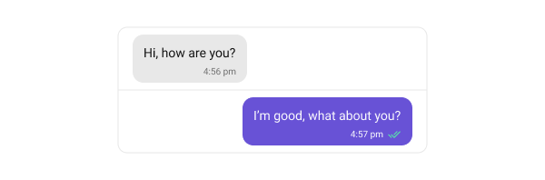

**Customization**
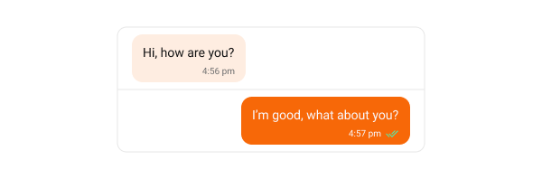

## Image Bubble
Image bubbles display messages with images.

The following code snippet shows how customize the Image message bubble:
<Tabs>
<TabItem value="js" label="swift">

```swift
CometChatMessageBubble.style.incoming.imageBubbleStyle.backgroundColor = UIColor(hexString: "#FEEDE1")

CometChatMessageBubble.style.outgoing.imageBubbleStyle.backgroundColor = UIColor(hexString: "#F76808")
```

</TabItem>
</Tabs>

**Default**
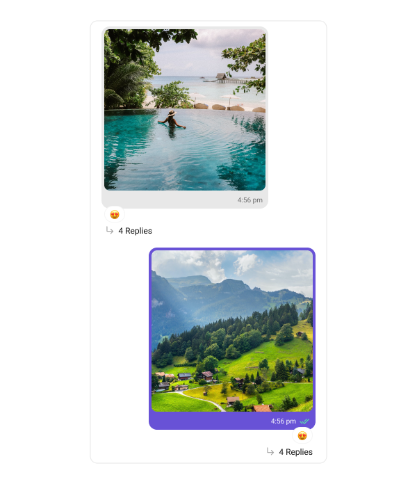

**Customization**
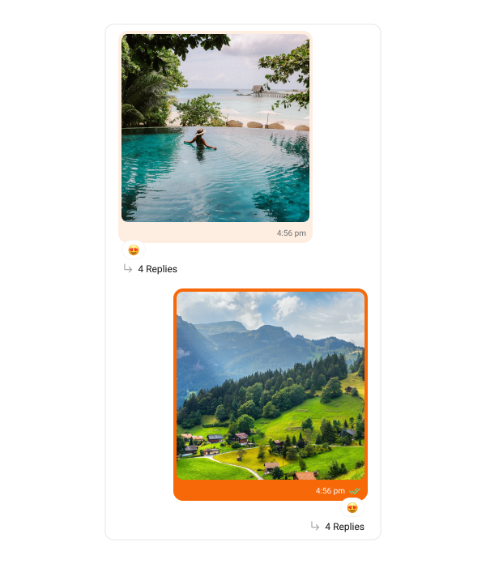

## Video Bubble
Video bubbles display messages with video clips.

The following code snippet shows how customize the Video message bubble:
<Tabs>
<TabItem value="js" label="swift">

```swift
CometChatMessageBubble.style.incoming.videoBubbleStyle.backgroundColor = UIColor(hexString: "#FEEDE1")
CometChatMessageBubble.style.incoming.videoBubbleStyle.playButtonTint = UIColor(hexString: "#F76808")
        
CometChatMessageBubble.style.outgoing.deleteBubbleStyle.backgroundColor = UIColor(hexString: "#F76808")
CometChatMessageBubble.style.outgoing.videoBubbleStyle.playButtonTint = UIColor(hexString: "#F76808")
```

</TabItem>
</Tabs>

**Default**
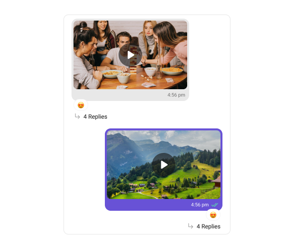

**Customization**
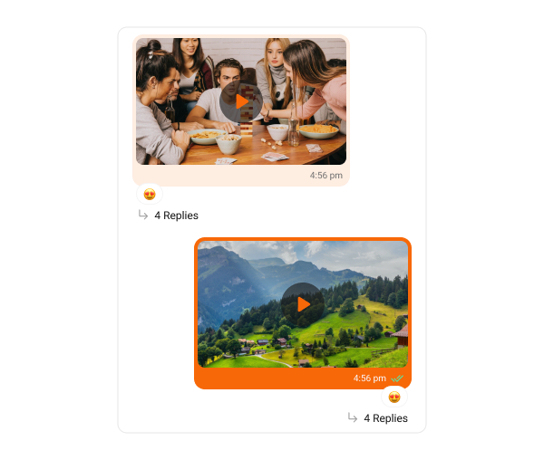

## Audio Bubble
Audio bubbles display Audio messages.

The following code snippet shows how customize the Audio message bubble:
<Tabs>
<TabItem value="js" label="swift">

```swift
CometChatMessageBubble.style.incoming.audioBubbleStyle.audioWaveFormTintColor = UIColor(hexString: "#F76808")
CometChatMessageBubble.style.incoming.audioBubbleStyle.playImageTintColor = UIColor(hexString: "#F76808")
CometChatMessageBubble.style.incoming.audioBubbleStyle.backgroundColor = UIColor(hexString: "#FEEDE1")

CometChatMessageBubble.style.outgoing.audioBubbleStyle.playImageTintColor = UIColor(hexString: "#F76808")
CometChatMessageBubble.style.outgoing.audioBubbleStyle.backgroundColor = UIColor(hexString: "#F76808")
```

</TabItem>
</Tabs>

**Default**
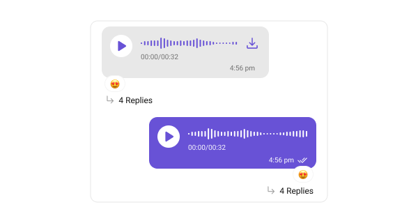

**Customization**
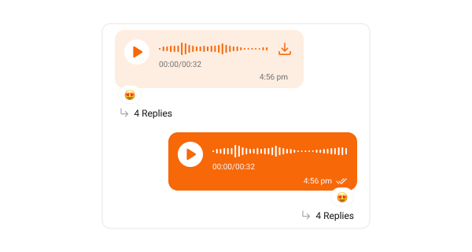

## Poll Bubble
Poll bubbles display messages with polling.

The following code snippet shows how customize the Poll message bubble:
<Tabs>
<TabItem value="js" label="swift">

```swift
CometChatMessageBubble.style.incoming.pollBubbleStyle.optionProgressTintColor = UIColor(hexString: "#F76808")
CometChatMessageBubble.style.incoming.pollBubbleStyle.selectedPollImageTint = UIColor(hexString: "#F76808")
CometChatMessageBubble.style.incoming.pollBubbleStyle.backgroundColor = UIColor(hexString: "#FEEDE1")
        
CometChatMessageBubble.style.outgoing.pollBubbleStyle.backgroundColor = UIColor(hexString: "#F76808")
```

</TabItem>
</Tabs>

**Default**
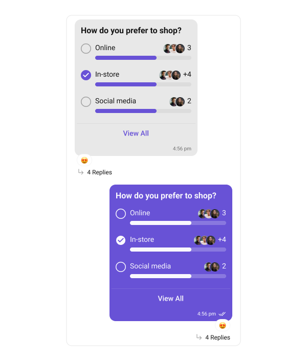

**Customization**
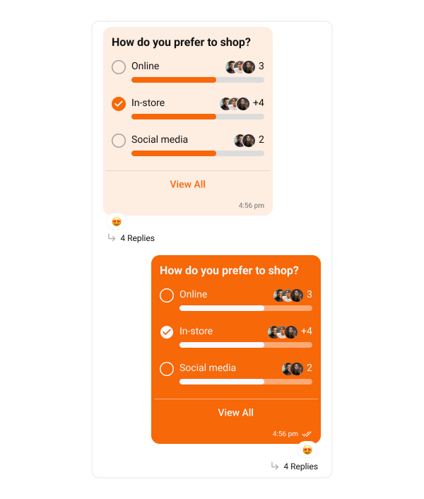

## Link Preview Bubble
The Link Preview Bubble is designed to display a preview of links shared in messages. It enriches the messaging experience by showing details such as the page title, description, and an image from the linked content, making links more engaging and informative.

The following code snippet shows how customize the Link preview message bubble:
<Tabs>
<TabItem value="js" label="swift">

```swift
CometChatMessageBubble.style.incoming.linkPreviewBubbleStyle.backgroundColor = UIColor(hexString: "#FEEDE1")
        
CometChatMessageBubble.style.outgoing.linkPreviewBubbleStyle.backgroundColor = UIColor(hexString: "#F76808")
```

</TabItem>
</Tabs>

**Default**
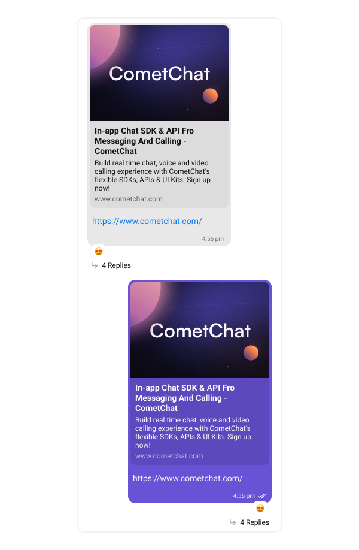

**Customization**
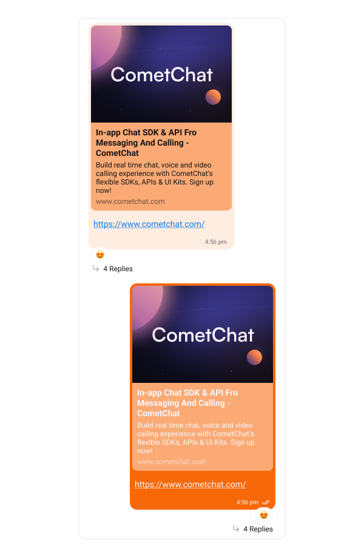

## Action Bubble
Action bubbles provide a customizable interface for displaying a variety of actions, such as group actions, within a chat.

The following code snippet shows how customize the action message bubble:
<Tabs>
<TabItem value="js" label="swift">

```swift
CometChatMessageBubble.actionBubbleStyle.backgroundColor = UIColor(hexString: "#FEEDE1")
CometChatMessageBubble.actionBubbleStyle.bubbleTextColor = UIColor(hexString: "#F76808")
CometChatMessageBubble.actionBubbleStyle.borderColor = UIColor(hexString: "#F76808")
```

</TabItem>
</Tabs>

**Default**
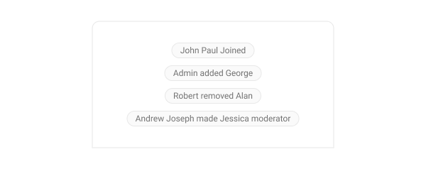

**Customization**
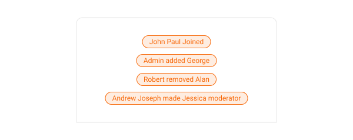

## Delete Bubble
Delete bubbles displays messages that have been deleted by the sender. These indicate the message removal within the chat interface.

The following code snippet shows how customize the delete message bubble:
<Tabs>
<TabItem value="js" label="swift">

```swift
CometChatMessageBubble.style.incoming.deleteBubbleStyle.backgroundColor = UIColor(hexString: "#FEEDE1")

CometChatMessageBubble.style.outgoing.deleteBubbleStyle.backgroundColor = UIColor(hexString: "#F76808")
```

</TabItem>
</Tabs>

**Default**
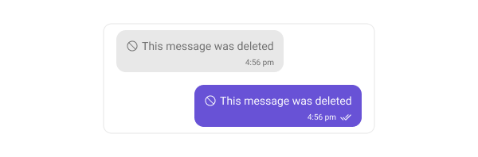

**Customization**
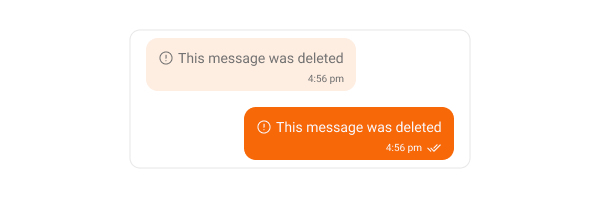