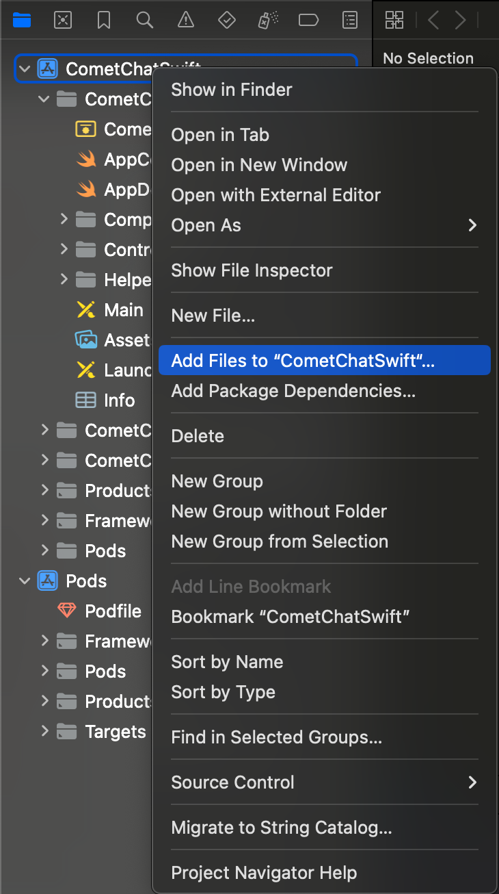
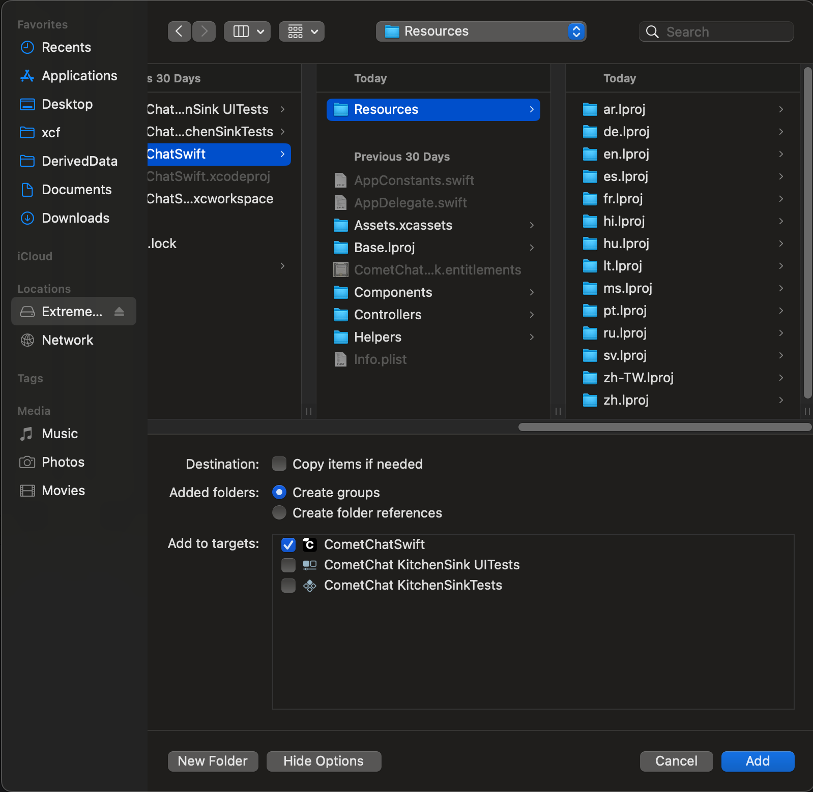
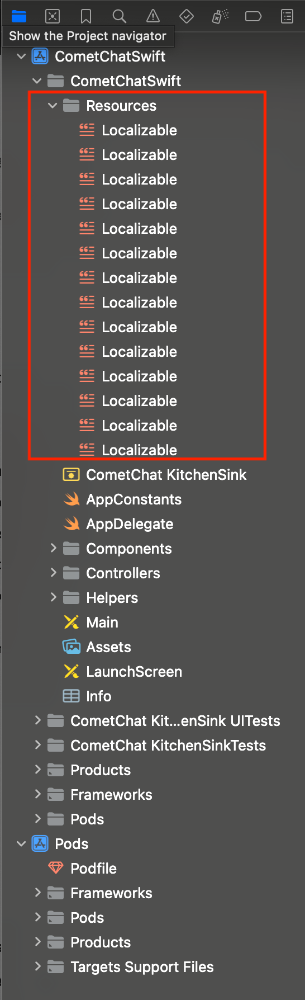
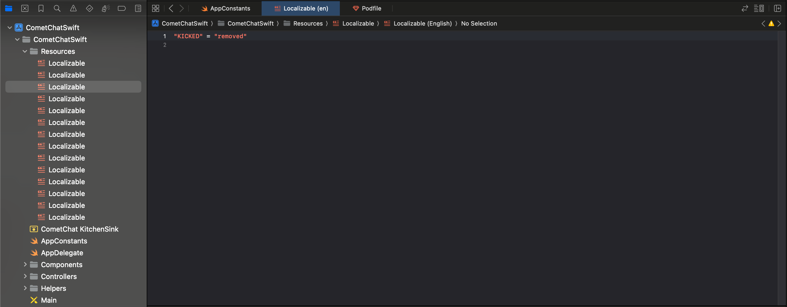

import Tabs from '@theme/Tabs';
import TabItem from '@theme/TabItem';

## Overview

CometChat UI Kit provides language localization to adapt to the language of a specific country or region. The CometChatLocalize class allows you to detect the language of your users based on their browser or device settings, and set the language accordingly.

CometChatLocalize is a class that includes methods related to locale. Developers can use these methods to change the language of the UI Kit library.

Presently, the UI Kit supports 12 languages for localization, which are:

- English (en, en-US, en-GB)
- Chinese (zh, zh-TW)
- Spanish (es)
- Hindi (hi)
- Russian (ru)
- Portuguese (pt)
- Malay (ms)
- French (fr)
- German (de)
- Swedish (sv)
- Lithuanian (lt)
- Hungarian (hu)

## Methods

Here are the methods included in the CometChatLocalize class:

- `set(locale: Language)`: This method is used to set the language in the UI Kit. It takes the enum value from Language enum and sets the value accordingly.

- `getLocale( )`: This method is used to get the current language. By default, it will return the current language from the device/browser.

## Usage

Here is how you can put these methods into use:

<Tabs>

<TabItem value="swift" label="Swift">

```swift
// Set Language
CometChatLocalize().set(locale: .french)

// Get Language
CometChatLocalize().getLocale()
```

</TabItem>

</Tabs>

By using the CometChatLocalize class, you can provide a user-friendly, localized experience to your users, enhancing the overall user experience within your application.

<!--
## Override Keys

To replace or change the **particular text**, **word**, or **phrase** in **UI Kit**.
1. Download the [zip file](https://library.cometchat.io/ios/v4.0/Resources.zip) and unzip them, after which it can be copied in project folder.
2. Add the unzipped file called Resources to your project (Follow below images for steps).



3. As you can see in the above image of every language supported by us is available. These are empty because in these file you need add key/value pairs for the word that needs to be overridden. ( Sample image below)


### Keys of our localizable files that can be overridden

| Keys |
| ------ |
| CHATS |
| USERS |
| CALLS |
| GROUPS |
| MORE |
| SENDING |
| THIS_MESSAGE_DELETED |
| YOU_DELETED_THIS_MESSAGE |
| VIEW_ON_YOUTUBE |
| MESSAGE_IMAGE |
| MESSAGE_VIDEO |
| MESSAGE_AUDIO |
| MESSAGE_FILE |
| CUSTOM_MESSAGE |
| MISSED_VOICE_CALL |
| MISSED_VIDEO_CALL |
| HAS_SENT_A_CALL |
| CUSTOM_MESSAGE_LOCATION |
| CUSTOM_MESSAGE_POLL |
| CUSTOM_MESSAGE_STICKER |
| CUSTOM_MESSAGE_WHITEBOARD |
| CUSTOM_MESSAGE_DOCUMENT |
| CUSTOM_MESSAGE_GROUP_CALL |
| ONLINE |
| OFFLINE |
| YOU |
| ADMIN |
| MODERATOR |
| PARTICIPANT |
| PUBLIC |
| PRIVATE |
| PASSWORD_PROTECTED |
| PRIVACY_AND_SECURITY |
| PRIVACY |
| BLOCKED_USERS |
| EVERYBODY |
| CALLS |
| PREFERENCES |
| PRIVACY_&_SECURITY |
| YOU'VE_BLOCKED |
| MEMBERS |
| MEMBER |
| BACK |
| CANCEL |
| SELECT_A_MESSGE |
| TEXT_COPIED |
| TODAY |
| YESTERDAY |
| PHOTO_VIDEO_LIBRARY |
| TAKE_A_PHOTO |
| SHARE_LOCATION |
| EDIT_MESSAGE |
| DELETE_MESSAGE |
| REPLY_MESSAGE |
| FORWARD_MESSAGE |
| START_THREAD |
| SHARE_MESSAGE |
| MESSAGE_INFORMATION |
| COPY_MESSAGE |
| CREATE_A_POLL |
| SEND_STICKER |
| COLLABORATIVE_WHITEBOARD |
| COLLABORATIVE_WRITEBOARD |
| TYPE_A_MESSAGE |
| DOCUMENT |
| TYPING |
| IS_TYPING |
| CLOSE |
| KINDLY_ENTER_GROUP_NAME |
| REFRESHING |
| UNBLOCK |
| UNBLOCKED_SUCCESSFULLY |
| MAKE_GROUP_ADMIN |
| MAKE_GROUP_MODERATOR |
| ADMINISTRATORS |
| ADD_ADMIN |
| ADD_MODERATOR |
| OWNER |
| ASSIGN_AS_ADMIN |
| REMOVE_AS_ADMIN |
| ASSIGN_AS_MODERATOR |
| REMOVE_AS_MODERATOR |
| REMOVE_FROM_ADMIN_PRIVILEGE |
| REMOVE_FROM_MODERATOR_PRIVILEGE |
| IS_NOW_ADMIN |
| IS_NOW_MODERATOR |
| REMOVE |
| AS_ADMIN_FROM |
| AS_MODERATOR_FROM |
| GROUP? |
| ADD |
| TRANSFER |
| AS_ADMIN_IN |
| AS_MODERATOR_IN |
| OK |
| AS_A_MODERATOR |
| AS_A_ADMIN |
| ADD_MEMBERS |
| ACTIONS |
| PRIVACY_&_SUPPORT |
| SEND_MESSAGE |
| ADD_IN |
| UNBLOCK_USER |
| BLOCK_USER |
| ADDED_SUCCESSFULLY |
| UNBLOCKED_SUCCESSFULLY |
| BLOCKED_SUCCESSFULLY |
| MEMBERS_ |
| DELETE_&_EXIT |
| LEAVE_GROUP |
| FROM |
| REMOVED_SUCCESSFULLY |
| BANNED_SUCCESSFULLY |
| UNBANNED_SUCCESSFULLY |
| DELETED_SUCCESSFULLY |
| YOU_LEFT_FROM |
| REMOVE_MEMBER |
| BAN_MEMBER |
| UNBAN_MEMBER |
| CREATE_GROUP |
| YOU_JOINED |
| FORWARD_MESSAGE |
| FORWARD |
| SHARED_MEDIA |
| UNABLE_TO_FORWARD |
| FORWARD_TO_5_AT_A_TIME |
| NO_PHOTOS |
| NO_VIDEOS |
| NO_DOCUMENTS |
| HISTORY |
| VIDEO_CALL |
| AUDIO_CALL |
| VIDEO |
| CALL |
| WHITEBOARD |
| LOADING |
| ONE_REPLY |
| REPLIES |
| LAUNCH |
| JOIN |
| HAS_SHARED_WHITEBOARD |
| HAS_SHARED_COLLABORATIVE_DOCUMENT |
| YOU_CREATED_WHITEBOARD |
| YOU_INITIATED_GROUP_AUDIO_CALL |
| YOU_INITIATED_GROUP_VIDEO_CALL |
| HAS_INITIATED_GROUP_AUDIO_CALL |
| HAS_INITIATED_GROUP_VIDEO_CALL |
| YOU_CREATED_DOCUMENT |
| SENDING_LOCATION |
| LOCATION_SENT_SUCCESSFULLY |
| EDIT |
| DONE |
| NEW_CALL |
| NO_HISTORY_FOUND |
| ALL |
| MISSED |
| NO_CHATS_FOUND |
| NO_MESSAGES_FOUND |
| WARNING |
| CHOOSE_GROUP_TYPE |
| SELECT_GROUP_TYPE |
| GROUP_PASSWORD_CANNOT_EMPTY |
| ENTER_GROUP_NAME |
| GROUP |
| PHOTOS |
| VIDEOS |
| DOCS |
| BANNED_MEMBERS |
| MODERATORS |
| UPDATE_INFORMATION |
| ARE_YOU_SURE_WANT_TO_UPDATE_USER_INFO |
| UPDATE |
| USER_NAME_CANNOT_EMPTY |
| ENTER_YOUR_NAME |
| SEARCH |
| NO_USERS_FOUND |
| ERROR |
| NO_GROUPS_FOUND |
| NO_CHATS_FOUND |
| MEDIA_MESSAGE |
| INCOMING_CALL |
| DECLINE |
| ACCEPT |
| CALL_INITIATED |
| OUTGOING_CALL |
| CALL_REJECTED |
| REJECTED_CALL |
| CALL_ACCEPTED |
| JOINED |
| LEFT_THE_CALL |
| UNANSWERED_AUDIO_CALL |
| UNANSWERED_VIDEO_CALL |
| CALL_ENDED |
| CALL_CANCELLED |
| CALL_BUSY |
| CALLING |
| NO_BANNED_MEMBERS_FOUND |
| BANNED_MEMBERS |
| NAME |
| SCOPE |
| UNBAN |
| SELECT_GROUP_TYPE |
| ENTER_GROUP_PASSWORD |
| CREATE |
| CREATE_POLL |
| QUESTION |
| ENTER_YOUR_QUESTION |
| OPTIONS |
| ENTER_YOUR_OPTION |
| ADD_NEW_OPTION |
| VIEW_MEMBERS |
| DETAILS |
| CALL_DETAILS |
| NOTIFICATIONS |
| OTHER |
| HELP |
| REPORT_PROBLEM |
| GROUP_MEMBERS |
| BAN |
| KICK |
| PICK_YOUR_EMOJI |
| PRIVATE_GROUP |
| PROTECTED_GROUP |
| VIEW_ON_YOUTUBE |
| VISIT |
| ATTACH |
| ATTACH_FILE |
| ATTACH_VIDEO |
| ATTACH_AUDIO |
| ATTACH_IMAGE |
| COLLABORATE_USING_DOCUMENT |
| COLLABORATE_USING_WHITEBOARD |
| EMOJI |
| ENTER_YOUR_MESSAGE_HERE |
| NO_MESSAGES_FOUND |
| THREAD |
| COLLABORATIVE_DOCUMENT |
| COLLABORATIVE_WHITEBOARD |
| ADD_REACTION |
| NO_STICKERS_FOUND |
| REPLY_TO_THREAD |
| REPLY_IN_THREAD |
| DELETE_MESSAGE |
| EDIT_MESSAGE |
| SUNDAY |
| MONDAY |
| TUESDAY |
| WEDNESDAY |
| THURSDAY |
| FRIDAY |
| SATURDAY |
| GROUP_NAME_BLANK |
| GROUP_TYPE_BLANK |
| GROUP_PASSWORD_BLANK |
| POLL_QUESTION_BLANK |
| POLL_OPTION_BLANK |
| OWNER |
| MESSAGE |
| BLOCK_USER_LIST_ERROR |
| YOU_WONT_BE_ABLE_SEND_OR_RECEIVE_MESSAGES |
| UNBLOCK_USER_ERROR |
| UNBLOCK_USER_QUESTION |
| BLOCK_USER_ERROR |
| KINDLY_ENTER_GROUP_DETAILS_TO_PROCEED |
| UNABLE_TO_JOIN_MESSAGE |
| MAKE_ADMIN_QUESTION |
| REMOVE_FROM_GROUP |
| ADD_USER_TO_GROUP |
| USER_ADDED_TO_GROUP |
| USER_REMOVED_FROM_GROUP |
| KICKED_ERROR |
| LEAVE_GROUP_MESSAGE |
| DELETE_GROUP |
| DELETE_GROUP_MESSAGE |
| GROUP_DELETE_ERROR |
| CANNOT_REMOVE_MEMBER |
| LEAVE_GROUP_ERROR |
| LOAD_MORE |
| LOAD_MORE_MEMBERS |
| GROUP_LIST_ERROR |
| PASSWORD |
| JOINING |
| INCORRECT |
| BANNED_MEMBERS |
| BAN_MEMBER_OF_GROUP |
| UNBAN_ERROR |
| ENTER_GROUP_DESC |
| ENTER_GROUP_PWD |
| ENTER_GROUP_CNF_PWD |
| PASSWORD_NOT_MATCHED |
| ENTER_PASSWORD_TO_JOIN |
| NO_BAN_MEMBERS |
| MODERATORS |
| MODERATOR_LIST_RETRIEVE_ERROR |
| MAKE_MODERATOR_QUESTION |
| ONLY_ADMIN_REMOVES_MODERATOR |
| UPDATE_GROUP |
| ENTER_GROUP_ICON_URL |
| GROUP_UPDATED |
| GROUP_UPDATE_FAILED |
| ENTER_OLD_GROUP_PWD |
| ENTER_NEW_PASSWORD |
| GROUP_ALERT |
| TRANSFER_OWNERSHIP_MESSAGE |
| MAKE_OWNER |
| MAKE_OWNER_QUESTION |
| USER_IS_OWNER |
| NOT_A_MEMBER |
| OWNER_ALERT |
| OWNER_ALERT_MESSAGE |
| PUBLIC_GROUP |
| PRIVATE_GROUP |
| PASSWORD_PROTECTED_GROUP |
| YOU_CANNOT_PERFORM_ACTION |
| ONLY_GROUP_OWNER_REMOVES_ADMIN |
| REMOVED_FROM_ADMIN |
| UPDATE_GROUP_MEMBER_ERROR |
| ADMIN_LIST_RETRIEVE_ERROR |
| CREATE_GROUP_ERROR |
| UPDATE_SCOPE_ERROR |
| GROUP_MEMBER_LIST_ERROR |
| BAN_LIST_FETCH_ERROR |
| GRANT_CAMERA_PERMISSION |
| GRANT_STORAGE_PERMISSION |
| FILE_NOT_EXIST |
| CALL_LIST_ERROR |
| NO_CALL_MESSAGE |
| CALLING |
| CALL_INITIATE_ERROR |
| OUTGOING |
| INCOMING |
| ALL |
| MISSED |
| NEW_CALL |
| MISSED_CALL |
| ONGOING_CALL |
| ONGOING_CALL_MESSAGE |
| TAP_TO_JOIN_CALL |
| NO_MEDIA |
| IMAGES |
| VIDEOS |
| FILES |
| NO_CONVERSATIONS |
| NO_USER_AVAILABLE |
| NO_GROUP_AVAILABLE |
| NO_BLOCK_USERS |
| NO_MISSEDCALL_MESSAGE |
| YES |
| FILL_THIS_FIELD |
| SEND |
| DETAILS |
| PRIVACY_SUPPORT |
| USER_TITLE |
| SEARCH |
| CUSTOM_MESSAGE |
| ENTER_AVATAR_URL |
| ENTER_USER_NAME |
| UPDATE_USER |
| SHARED_A_IMAGE |
| SHARED_A_AUDIO |
| SHARED_A_VIDEO |
| SHARED_A_FILE |
| SHARED_A_STICKER |
| SHARED_A_POLLS |
| SHARE |
| SENSITIVE_CONTENT |
| SENTIMENT_CONTENT |
| VIEW |
| SENTIMENT_ALERT |
| SENTIMENT_ALERT_MESSAGE |
| THREAD_IN_NAME |
| SENTATTXT |
| CONNECTING_TO_CALL |
| READ_AT |
| READ |
| DELIVERED_AT |
| DELIVERED |
| NAVIGATE |
| GRANT_LOCATION_PERMISSION |
| SEND_AUDIO_FILES |
| SEND_FILES |
| SHARED_LOCATION |
| NO |
| TURN_ON_GPS |
| ON |
| GPS_ENABLED |
| GPS_DISABLED |
| OPTION |
| SENDING_MEDIA_MESSAGE |
| ENTER_YOUR_OPTION |
| ENTER_YOUR_QUESTION |
| QUESTION |
| ADD_A_NEW_OPTION |
| UNABLE_TO_GET_LOCATION |
| ENDED |
| ONGOING |
| SHARE_WHITEBOARD |
| SHARED_A_WHITEBOARD |
| SHARE_WRITEBOARD |
| SHARED_A_WRITEBOARD |
| YOU_SENT |
| YOU_RECEIVED |
| HAS_SENT_A_CALL |
| INITIATE_A_CALL |
| EDIT |
| DONE |
| NEW_CALL |
| NO_HISTORY_FOUND |
| ALL |
| MISSED |
| CHOOSE_GROUP_TYPE |
| WARNING |
| CHOOSE_GROUP_TYPE |
| SELECT_GROUP_TYPE |
| GROUP_PASSWORD_CANNOT_EMPTY |
| ENTER_GROUP_NAME |
| GROUP |
| PHOTOS |
| VIDEOS |
| DOCS |
| BANNED_MEMBERS |
| MODERATORS |
| UPDATE_INFORMATION |
| ARE_YOU_SURE_WANT_TO_UPDATE_USER_INFO |
| UPDATE |
| USER_NAME_CANNOT_EMPTY |
| ENTER_YOUR_NAME |
| CALL_OUTGOING |
| CALL_INITIATED |
| CALL_UNANSWERED |
| ACTION_MESSAGE |
| SELECT_LANGUAGE |
| CHANGE_LANGUAGE |
| CURRENTLY_RECORDING |
| CURENTLY_PLAYING |
| CURENTLY_NOT_PLAYING |
| INVALID_PATH_FOR_AUDIO |
| UNABLE_TO_RECORD_ERROR |
| UNABLE_TO_PLAY_ERROR |
| UNABLE_TO_RECORD_PERMISSION settings.; |
| ERROR_OCCOURD_DURING_RECORD |
| JUST_NOW |
| SECS |
| YOU_CANT_MESSAGE_THEM |
| TRANSLATE_MESSAGE |
| NO_TRANSLATION_AVAILABLE |
| LEFT |
| KICKED |
| BANNED |
| UNBANNED |
| MADE |
| ADDED |
| START_A_CALL |
| START_AN_AUDIO_CALL |
| START_A_VIDEO_CALL |
| PLEASE_ENTER_A_NAME_FOR_A_GROUP_CALL |
| START |
| GROUP_CALL_NAME_CANNOT_EMPTY |
| ENTER_TITLE_HERE |
| MAY_CONTAIN_NEGATIVE_SENTIMENT |
| YOU_INITIATED_GROUP_AUDIO_CALL |
| YOU_INITIATED_GROUP_VIDEO_CALL |
| HAS_INITIATED_GROUP_AUDIO_CALL |
| HAS_INITIATED_GROUP_VIDEO_CALL |
| UNBLOCK_USER_MESSAGE |
| USER_LEAVE_GROUP_WARNING |
| USER_DELETE_GROUP_WARNING |
| USER_READ_MESSAGE_WARNING |
| TRANSFER_OWNERSHIP |
| TRANSFER_OWNERSHIP_MESSAGE |
| ASSIGN_AS_OWNER |
| IS_NOW_OWNER |
| AS_A_OWNER |
| UNABLE_TO_SEND_LOCATON_MESSAGE |
| S_LOCATION |
| SHARE_LOCATION_CONFIRMATION_MESSAGE |
| HAS_SHARED_LOCATION |
| OPEN_IN_APPLE_MAPS |
| OPEN_IN_GOOGLE_MAPS |
| INVALID_URL |
| MAIL_APP_NOT_FOUND_MESSAGE |
| ADDING_REACTION |
| UPDATING_REACTION |
| REACTIONS |
| VOTING |
| DELETE |
| CANNOT_ADD_MORE_THAN_FIVE_MESSAGE |
| URL_NOT_FOUND |
| LAST_ACTIVE_AT |
| SOMETHING_WENT_WRONG_ERROR |
| MESSAGE_IN_PRIVATE |
| REPLY_IN_PRIVATE |
| VIEW_PROFILE |
| UNKNOWN_LOCATION |
| SHARED_LOCATION |
| ERROR_INTERNET_UNAVAILABLE |
| SELECT_USER |
| SELECT_GROUP |
| SEARCH_USERS |
| SEARCH_GROUPS |
| NO_REPLIES |
| LEAVE |
| DELETE |
| VIEW |
| TRANSFER |
| NEW_GROUP |
| PROTECTED |
| CONTINUE |
| ENTER_PASSWORD_TO_ACCESS |
| GROUP_WITH_DOT |
| INCORRECT_PASSWORD |
| INCORRECT_PASSWORD_MESSAGE |
| DETAILS |
| SHARED_FILE |
| PROCESSING |
| TRY_AGAIN |
| PEOPLE_VOTED |
| OPEN_WHITEBOARD |
| OPEN_DOCUMENT_TO_EDIT_CONTENT_TOGETHER |
| OPEN_DOCUMENT |
| OPEN_WHITEBOARD_TO_DRAW_TOGETHER |
| MESSAGE_IS_DELETED |
| NO_CHATS |
| CREATE_POLLS |
| SEND |
| ADD_ANOTHER_ANSWER |
| SET_THE_ANSWERS |
| ANSWER |
| PEOPLE_VOTED |
| TRANSLATED_MESSAGE |
| DELETE_CONVERSATION_MESSAGE |
| THIS_MAY_CONTAIN_UNSAFE_CONTENT_MESSAGE |
| TAP_TO_START_CONVERSATION |
| IN_A_THREAD |
| NEW_MESSAGE |
| NEW_MESSAGES |
| NO_MEMBERS_FOUND |
| WRONG_PASSWORD |
| NO_CALLS_HISTORY |
| ACCEPTED |
| NEW_CHAT |
| INCOMING_AUDIO_CALL |
| INCOMING_VIDEO_CALL |
| SUGGEST_A_REPLY |
| GENERATIONG_ICEBREAKER |
| GENERATING_REPLIES |
| FORM |
| CARD |
| CONVERSATION_SUMMARY |
| GENERATING_SUMMARY |
| AI_BOT_FIRST_MESSAGE |
| ASK_BOT |
| ASK |
| ASK_AI_BOT |
| AI_BOT |
| OUTGOING_AUDIO_CALL |
| OUTGOING_VIDEO_CALL |
| MISSED_VIDEO_CALL |
| MISSED_AUDIO_CALL |
| CANCELLED_AUDIO_CALL |
| CANCELLED_VIDEO_CALL |
| REJECTED_AUDIO_CALL |
| REJECTED_VIDEO_CALL |
| OUTGOING_CALL |
| INCOMING_CALL |
| MISSED_CALL |
| CANCELLED_CALL |
| UNANSWERED_CALL |
| RECORDING |
| PARTICIPANTS |
| HISTORY |
| NO_CALLS_FOUND |
| SELECT_A_DATE |
| TIME_ZONE |
| MEETING_SCHEDULED |
| MEETING_SLOT_BOOK |
| MEETING_BOOK_NEW_SLOT |
| MEETING_NO_SLOTS_AVAILABLE |
| MEETING_TRY_DIFFERENT_DATE |
| CARD_MESSAGE |
| FORM_MESSAGE |
| NO_TIME_SLOTS_AVAILABLE |
| SCHEDULE |
| MEETING_WITH |
| SCHEDULER_MESSAGE |
| SELECT_A_DAY |
| SELECT_A_TIME |
| NO_TIME_SLOTS_AVAILABLE_FOR_THIS_DAY |
| REPLIES_R |
| MENTION_LIMIT_TEXT |

## Add New Language
1. To add a new language, add a new file Localizable.strings file with the language extension.
2. Copy-paste the English localization file and add localization for the keywords particular language. -->
