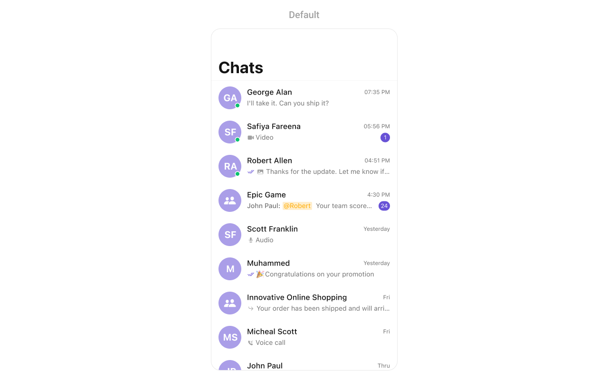
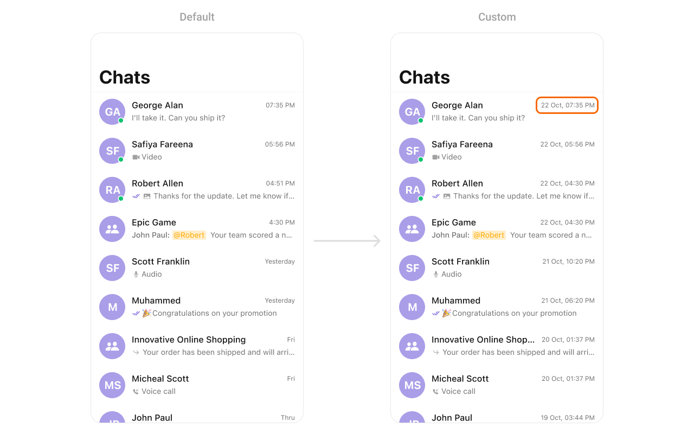
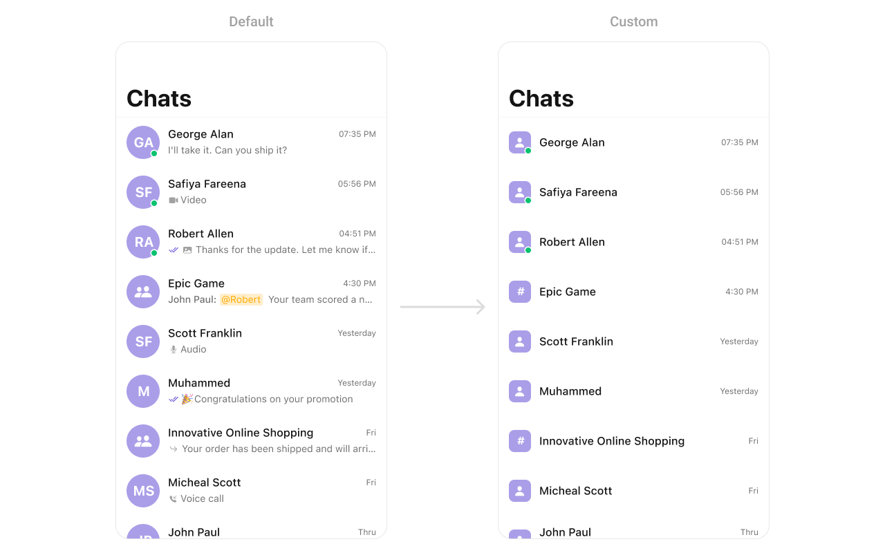
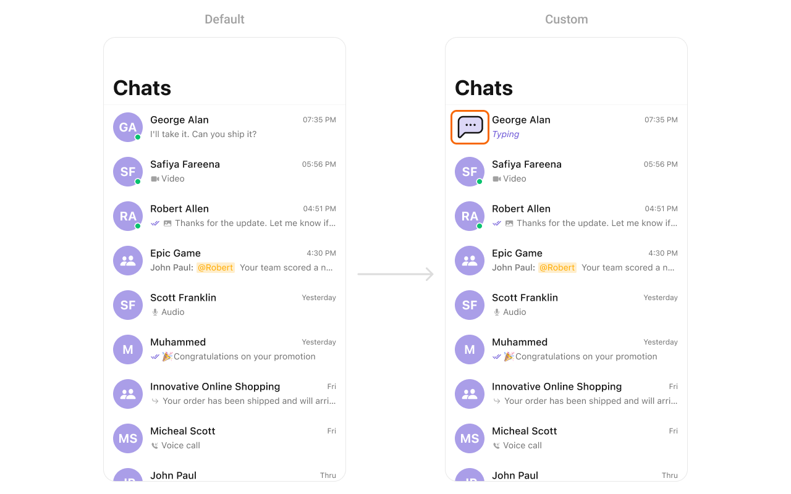
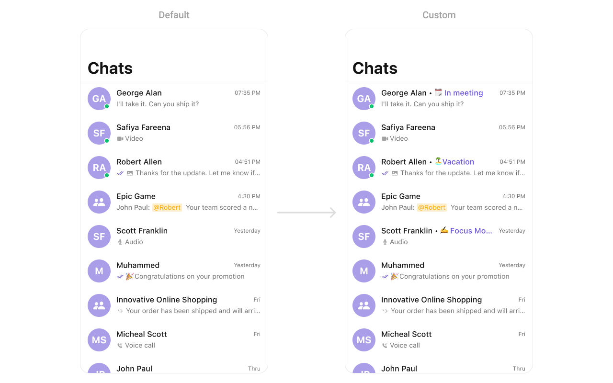
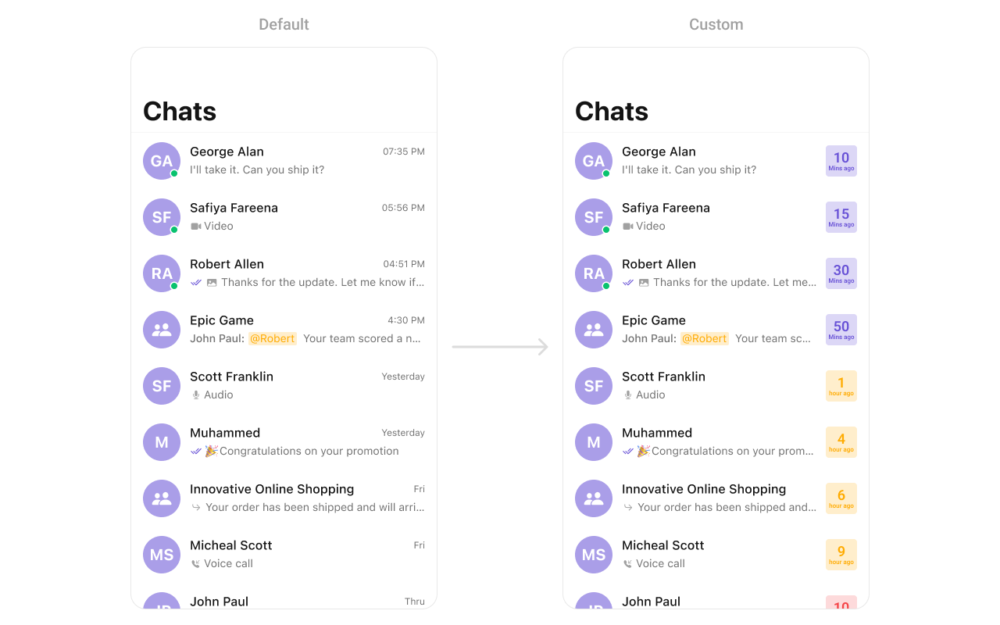
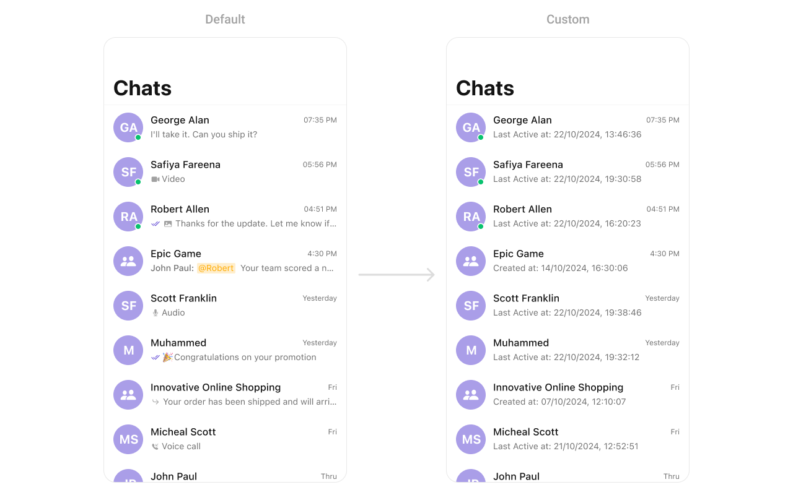

import Tabs from '@theme/Tabs';
import TabItem from '@theme/TabItem';

## Overview

The Conversations is a [Component](/ui-kit/ios/components-overview#components), That shows all conversations related to the currently logged-in user,




## Usage

### Integration

As CometChatConversations is a custom view controller, it can be initiated either by tapping a button or through the trigger of any event. It offers multiple parameters and methods for tailoring its user interface.

```swift title="swift"
let cometChatConversations = CometChatConversations()
self.navigationController.pushViewController(cometChatConversations, animated: true)
```

- Integration (With Custom Request Builder)

During the initialization of **CometChatConversations,** users can provide this custom request builder.

```swift title="swift"
// You can create ConversationRequestBuilder as per your requirement
let conversationRequestBuilder = ConversationRequest.ConversationRequestBuilder(limit: 20).set(conversationType: .both)

let cometChatConversations = CometChatConversations(conversationRequestBuilder: conversationRequestBuilder)
self.navigationController.pushViewController(cometChatConversations, animated: true)
```

:::tip
If a navigation controller is already in use, opt for the `pushViewController` method instead of presenting the view controller.
:::

### Actions

[Actions](/ui-kit/ios/components-overview#actions) dictate how a component functions. They are divided into two types: Predefined and User-defined. You can override either type, allowing you to tailor the behavior of the component to fit your specific needs.

1. ##### set(onItemClick:)  

`set(OnItemClick:)` is triggered when you click on a ListItem of the Conversations component.
This `set(OnItemClick:)` method proves beneficial when a user intends to customize the on-click behavior in CometChatConversations.

<Tabs>
<TabItem value="swift" label="Swift">
```swift title=""
// syntax for set(onItemClick: @escaping ((_ conversation: Conversation, _ indexPath: IndexPath) -> Void))
cometChatConversations.set(onItemClick: { conversation, indexPath in
    // Override on item click
})

````
</TabItem>
</Tabs>

---

2. ##### set(OnItemLongClick:)

`set(OnItemLongClick:)` is triggered when you long press on a ListItem of the Conversations component.
This `set(OnItemLongClick:)` method proves beneficial when a user intends to additional functionality on long press on list item in CometChatConversations.

<Tabs>
<TabItem value="swift" label="Swift">
```swift title=""
// syntax for set(onItemLongClick: @escaping ((_ conversation: Conversation, _ indexPath: IndexPath) -> Void))
cometChatConversations.set(onItemLongClick: { conversation, indexPath in
    // Override on item click
})

````
</TabItem>
</Tabs>

---

##### 3. set(onBack:)

This `set(onBack:)` method becomes valuable when a user needs to override the action triggered upon pressing the back button in CometChatConversations.

<Tabs>

<TabItem value="swift" label="Swift">
```swift title=""
// syntax for set(onBack: @escaping () -> Void)
cometChatConversations.set(onBack: {
    // Override on back
})
````

</TabItem>

</Tabs>

---

##### 4. set(onSelection:)

The `set(onSelection:)` only gets trigger when selection mode is set to multiple of single. And this gets trigger on every selection, and returns the list of selected conversations.

<Tabs>

<TabItem value="swift" label="Swift">
```swift title=""

conversations.set(onSelection: { conversations in
     //Handle action
})

````

</TabItem>

</Tabs>

---

##### 5. set(onError:)

This method proves helpful when a user needs to customize the action taken upon encountering an error in CometChatConversations.

<Tabs>

<TabItem value="swift" label="Swift">
```swift title=""
// syntax for set(onError: @escaping ((_ error: CometChatException) -> Void))
cometChatConversations.set(onError: { error in
    // Override on error
})

````

</TabItem>
</Tabs>

---

##### 6. set(onEmpty:)

This `set(onEmpty:)` method is triggered when the conversations list is empty in CometChatConversations.

<Tabs> 
<TabItem value="swift" label="Swift">
```swift title=""
// syntax for set(onEmpty: @escaping () -> Void)
cometChatConversations.set(onEmpty: {
    // Handle empty state
})

````
</TabItem> 
</Tabs>

---

##### 7. setOnLoad

This set(onLoad:) gets triggered when a conversation list is fully fetched and going to displayed on the screen, this return the list of conversations to get displayed on the screen.


<Tabs> 
<TabItem value="swift" label="Swift">

```swift title=""
// syntax for set(onLoad: @escaping ((_ conversations: [Conversation]) -> Void))
cometChatConversations.set(onLoad: { conversations in
    // Handle loaded conversations
})

````

</TabItem>
</Tabs>

---

### Filters

You can set `ConversationsRequestBuilder` in the Conversations Component to filter the conversation list. You can modify the builder as per your specific requirements with multiple options available to know more refer to [ConversationRequestBuilder](/sdk/ios/retrieve-conversations).

You can set filters using the following parameters.

1. **Conversation Type:** Filters on type of Conversation, `User` or `Groups`
1. **Limit:** Number of conversations fetched in a single request.
1. **WithTags:** Filter on fetching conversations containing tags
1. **Tags:** Filters on specific `Tag`
1. **UserTags:** Filters on specific User `Tag`
1. **GroupTags:** Filters on specific Group `Tag`

<Tabs>

<TabItem value="swift" label="Swift">
```swift title=""
// You can create ConversationRequestBuilder as per your requirement
let conversationRequestBuilder = ConversationRequest.ConversationRequestBuilder(limit: 20).set(conversationType: .both)

let cometChatConversations = CometChatConversations(conversationRequestBuilder: conversationRequestBuilder)
self.navigationController.pushViewController(cometChatConversations, animated: true)
````

</TabItem>
</Tabs>

:::tip
If a navigation controller is already in use, opt for the `pushViewController` method instead of presenting the view controller.
:::

---

### Events

[Events](/ui-kit/ios/components-overview#events) are emitted by a `Component`. By using event you can extend existing functionality. Being global events, they can be applied in Multiple Locations and are capable of being Added or Removed.

##### 1. ConversationDeleted

This event will be emitted when the user deletes a conversation
<Tabs>
<TabItem value="swift" label="Swift">

```swift title="Add Listener"
// View controller from your project where you want to listen events.
public class ViewController: UIViewController {

   public override func viewDidLoad() {
        super.viewDidLoad()

       // Subscribing for the listener to listen events from conversation module
         CometChatConversationEvents.addListener("UNIQUE_ID", self as CometChatConversationEventListener)
    }

}

 // Listener events from conversation module
extension  ViewController: CometChatConversationEventListener {

    func ccConversationDelete(conversation: Conversation) {
        // Do Stuff
    }

}
```

```swift title="Remove Listener"
public override func viewWillDisappear(_ animated: Bool) {
    // Uncubscribing for the listener to listen events from conversation module
    CometChatConversationEvents.removeListener("LISTENER_ID_USED_FOR_ADDING_THIS_LISTENER")
}
```

</TabItem>


</Tabs>

## Customization

To align with your app's design specifications, you have the flexibility to customize the appearance of the conversation component. We offer accessible methods that empower you to tailor the experience and functionality to meet your unique requirements.

### Style

Using Style you can customize the look and feel of the component in your app, These parameters typically control elements such as the color, size, shape, and fonts used within the component.

##### 1. Conversation Style

The CometChatConversation component allows developers to customize its appearance through the ConversationStyle class. This enables global-level or instance-specific styling.

**Global level styling**
<Tabs>
<TabItem value="swift" label="Swift">

```swift
let customAvatarStyle = AvatarStyle()
customAvatarStyle.backgroundColor = UIColor(hex: "#FBAA75")
customAvatarStyle.cornerRadius = 8

let customReceiptStyle = ReceiptStyle()
customReceiptStyle.backgroundColor = UIColor(hex: "#F76808")

var customBadgeStyle = BadgeStyle()
customBadgeStyle.backgroundColor = UIColor(hex: "#F76808")

CometChatConversation.style.backgroundColor = CometChatTheme.backgroundColor01
CometChatConversation.style.avatarStyle = customAvatarStyle
CometChatConversation.style.receiptStyle = customReceiptStyle
CometChatConversation.style.badgeStyle = customBadgeStyle
```

</TabItem>
</Tabs>

**Instance level styling**
<Tabs>
<TabItem value="swift" label="Swift">

```swift
let conversationStyle = ConversationsStyle()
conversationStyle.backgroundColor = CometChatTheme.backgroundColor01
        
let customAvatarStyle = AvatarStyle()
customAvatarStyle.backgroundColor = UIColor(hex: "#FBAA75")
customAvatarStyle.cornerRadius = 8

let customReceiptStyle = ReceiptStyle()
customReceiptStyle.backgroundColor = UIColor(hex: "#F76808")

let customBadgeStyle = BadgeStyle()
customBadgeStyle.backgroundColor = UIColor(hex: "#F76808")

let customConversation = CometChatConversation()
customConversation.avatarStyle = customAvatarStyle
customConversation.receiptStyle = customReceiptStyle
customConversation.badgeStyle = customBadgeStyle
customConversation.style = conversationStyle
```

</TabItem>
</Tabs>


List of properties exposed by ConversationStyle

| **Property**                      | **Description**                                                              | **Code**                                           |
| ---------------------------------- | ----------------------------------------------------------------------------- | ------------------------------------------------- |
| **Background Color**              | Used to set the background color of the conversation screen.                 | `CometChatConversation.style.backgroundColor = UIColor.white` |
| **Background Drawable**           | Used to set a background image for the conversation screen.                  | `CometChatConversation.style.backgroundDrawable = UIImage(named: "background")` |
| **Border Width**                  | Used to set the border width of the conversation UI.                         | `CometChatConversation.style.borderWidth = 2.0`  |
| **Border Color**                  | Used to set the border color of the conversation UI.                         | `CometChatConversation.style.borderColor = UIColor.gray` |
| **Corner Radius**                 | Used to set the corner radius of the conversation UI.                        | `CometChatConversation.style.cornerRadius = 10.0` |
| **Back Icon Tint**                | Used to set the tint color of the back icon in the conversation UI.          | `CometChatConversation.style.backIconTint = UIColor.blue` |
| **Back Icon**                     | Used to set a custom back icon for the conversation UI.                      | `CometChatConversation.style.backIcon = UIImage(named: "customBackIcon")` |
| **Separator Color**               | Used to set the color of separators in the conversation list.                | `CometChatConversation.style.separatorColor = UIColor.lightGray` |
| **Separator Width**               | Used to set the width of separators in the conversation list.                | `CometChatConversation.style.separatorWidth = 1.0` |
| **Error Text Color**              | Used to set the color of error messages in the conversation UI.              | `CometChatConversation.style.errorTextColor = UIColor.red` |
| **Last Message Text Color**       | Used to set the color of the last message text in the conversation list.     | `CometChatConversation.style.lastMessageTextColor = UIColor.darkGray` |
| **Typing Indicator Color**        | Used to set the color of the typing indicator in the conversation UI.        | `CometChatConversation.style.typingIndicatorColor = UIColor.green` |
| **Title Appearance**              | Used to customize the appearance of the conversation screen's title.         | `CometChatConversation.style.titleAppearance = UIFont.boldSystemFont(ofSize: 18.0)` |
| **Last Message Appearance**       | Used to customize the appearance of the last message text in the list.       | `CometChatConversation.style.lastMessageAppearance = UIFont.italicSystemFont(ofSize: 14.0)` |
| **Thread Indicator Appearance**   | Used to customize the appearance of thread indicators in the list.           | `CometChatConversation.style.threadIndicatorTextAppearance = UIFont.systemFont(ofSize: 12.0)` |
| **Avatar Style**                  | Used to customize the appearance of avatars in the conversation list.        | `CometChatConversation.style.avatarStyle = customAvatarStyle` |
| **Status Indicator Style**        | Used to customize the style of status indicators for online/offline members. | `CometChatConversation.style.statusIndicatorStyle = customStatusIndicatorStyle` |
| **Date Style**                    | Used to customize the appearance of date labels in the conversation list.    | `CometChatConversation.style.dateStyle = customDateStyle` |
| **Badge Style**                   | Used to customize the appearance of badges in the conversation list.         | `CometChatConversation.style.badgeStyle = customBadgeStyle` |
| **List Item Style**               | Used to customize the appearance of the list items in the conversation list. | `CometChatConversation.style.listItemStyle = customListItemStyle` |


##### 2. Avatar Style

To apply customized styles to the `Avatar` component in the `Conversations` Component, you can use the following code snippet. For more information, visit [Avatar Styles](./avatar).

**Global level styling**
<Tabs>
<TabItem value="swift" label="Swift">

```swift
CometChatAvatar.style.cornerRadius = CometChatCornerStyle(cornerRadius: 8)
CometChatAvatar.style.backgroundColor = UIColor(hex: "#F76808")
```
</TabItem>
</Tabs>

**Instance level styling**
<Tabs>
<TabItem value="swift" label="Swift">

```swift
var customAvatarStyle = AvatarStyle()
customAvatarStyle.cornerRadius = CometChatCornerStyle(cornerRadius: 8)
customAvatarStyle.backgroundColor = UIColor(hex: "#F76808")

let customAvatar = CometChatAvatar()
customAvatar.style = customAvatarStyle
```
</TabItem>
</Tabs>


##### 3. StatusIndicator Style

To apply customized styles to the Status Indicator component in the `Conversations` Component, you can use the following code snippet. For more information, visit [Indicator Styles](./status-indicator).

**Global level styling**
<Tabs>
<TabItem value="swift" label="Swift">

```swift
CometChatStatusIndicator.style.cornerRadius = CometChatCornerStyle(cornerRadius: 8)
CometChatStatusIndicator.style.backgroundColor = UIColor(hex: "#F76808")
```
</TabItem>
</Tabs>

**Instance level styling**
<Tabs>
<TabItem value="swift" label="Swift">

```swift
var customStatusIndicatorStyle = StatusIndicatorStyle()
customStatusIndicatorStyle.cornerRadius = CometChatCornerStyle(cornerRadius: 8)
customStatusIndicatorStyle.backgroundColor = UIColor(hex: "#F76808")

CometChatStatusIndicator.style = customStatusIndicatorStyle
```
</TabItem>
</Tabs>


##### 4. Badge Style

To apply customized styles to the `Badge` component in the `Conversations` Component, you can use the following code snippet. For more information, visit [Badge Styles](./badge)

**Global level styling**
<Tabs>
<TabItem value="swift" label="Swift">

```swift
CometChatBadge.style.backgroundColor = UIColor(hex: "#F44649")
CometChatBadge.style.cornerRadius = CometChatCornerStyle(cornerRadius: 4)
```
</TabItem>
</Tabs>

**Instance level styling**
<Tabs>
<TabItem value="swift" label="Swift">

```swift
let customBadgeStyle = BadgeStyle()
customBadgeStyle.backgroundColor = UIColor(hex: "#F44649")
customBadgeStyle.cornerRadius = CometChatCornerStyle(cornerRadius: 4)
        
CometChatBadge.style = customBadgeStyle
```
</TabItem>
</Tabs>


### Functionality

These are a set of small functional customizations that allow you to fine-tune the overall experience of the component. With these, you can change text, set custom icons, and toggle the visibility of UI elements.

Below is a list of customizations along with corresponding code snippets

| Property                              | Description                                                    | Code                                      |
|---------------------------------------|----------------------------------------------------------------|-------------------------------------------|
| hideErrorView                         | Hides the error state view.                                    | `hideErrorView = true`                    |
| hideNavigationBar                     | Hides or shows the navigation bar.                            | `hideNavigationBar = true`                |
| hideSearch                            | Hides the search bar.                                         | `hideSearch = true`                       |
| hideBackButton                        | Hides the back button.                                        | `hideBackButton = true`                   |
| hideLoadingState                      | Hides the loading state indicator.                            | `hideLoadingState = true`                 |
| hideReceipts                          | Hides message read/delivery receipts.                         | `hideReceipts = true`                     |
| hideDeleteConversationOption          | Hides the option to delete a conversation.                    | `hideDeleteConversationOption = true`     |
| hideUserStatus                        | Hides the online/offline status of users.                     | `hideUserStatus = true`                   |
| hideGroupType                         | Hides the group type (private/public).                        | `hideGroupType = true`                    |

### Advanced

For advanced-level customization, you can set custom views to the component. This lets you tailor each aspect of the component to fit your exact needs and application aesthetics. You can create and define your views, layouts, and UI elements and then incorporate those into the component.

---

#### SetTextFormatters

You can modify the text formatters by using .set(textFormatters:). This method accepts an array of CometChatTextFormatter, allowing you to apply multiple text formatters to the conversation text.

<Tabs> <TabItem value="swift" label="Swift">
cometChatConversations.set(textFormatters: [CometChatTextFormatter])  
</TabItem> </Tabs>

---

#### SetDatePattern

You can modify the date pattern to your requirement using .set(datePattern:). This method accepts a function with a return type String. Inside the function, you can create your own pattern and return it as a String.

<Tabs> <TabItem value="swift" label="Swift">
```
cometChatConversations.set(datePattern: { conversation in  
    if let time = conversation.lastMessage?.sentAt {   
    let date = Date(timeIntervalSince1970: TimeInterval(time))  
    let dateFormatter = DateFormatter()  
    dateFormatter.dateFormat = "dd MMM, hh:mm a"  
    dateFormatter.amSymbol = "AM"  
    dateFormatter.pmSymbol = "PM"  
    return dateFormatter.string(from: date) 
    } 
    return ""
})  
```
</TabItem> </Tabs>

Demonstration



---

#### SetOptions

You can define custom options for each conversation using .set(options:). This method allows you to return an array of CometChatConversationOption based on the conversation object.

<Tabs> <TabItem value="swift" label="Swift">
```
cometChatConversations.set(options: { conversation in  
    return [MuteOption(), DeleteOption()]  
})  
```
</TabItem> </Tabs>

---

#### AddOptions

You can dynamically add options to conversations using .add(options:). This method lets you return additional CometChatConversationOption elements.

<Tabs> <TabItem value="swift" label="Swift">
```
cometChatConversations.add(options: { conversation in  
    return [ArchiveOption()]  
})  
```
</TabItem> </Tabs>

---

#### SetCustomSoundForMessages

You can customize the notification sound for incoming messages using .set(customSoundForMessages:). This method accepts a URL pointing to the audio file.

<Tabs> <TabItem value="swift" label="Swift">
```
let soundURL = Bundle.main.url(forResource: "notification_sound", withExtension: "mp3")  
cometChatConversations.set(customSoundForMessages: soundURL!)  
```
</TabItem> </Tabs>

---

#### SetListItemView

With this function, you can assign a custom ListItem view to the Conversations Component.

<Tabs>

<TabItem value="swift" label="Swift">

```swift
cometChatConversations.set(listItemView: { conversation in
    let customListItem = CustomListItem()
    customListItem.set(conversation: conversation)
    return customListItem
})

```

</TabItem>
</Tabs>

Demonstration



You can create a `CustomListItemView` as a custom `UIView`. Which we will inflate in `setListItemView()`

```swift title="swift"

import UIKit
import CometChatUIKitSwift

class CustomListItem: UIView {
    // Initialize UI components
    private var profileImageView: CometChatAvatar = {
        let imageView = CometChatAvatar(image: UIImage())
        imageView.translatesAutoresizingMaskIntoConstraints = false // Important for manual layout
        return imageView
    }()

    private var nameLabel: UILabel = {
        let label = UILabel()
        label.translatesAutoresizingMaskIntoConstraints = false // Important for manual layout
        return label
    }()

    override init(frame: CGRect) {
        super.init(frame: frame)
        setupUI()
    }

    required init?(coder aDecoder: NSCoder) {
        fatalError("init(coder:) has not been implemented")
    }

    private func setupUI() {
        addSubview(profileImageView)
        addSubview(nameLabel)

        NSLayoutConstraint.activate([
            // Profile image constraints
            profileImageView.leadingAnchor.constraint(equalTo: leadingAnchor, constant: 8),
            profileImageView.centerYAnchor.constraint(equalTo: centerYAnchor),
            profileImageView.widthAnchor.constraint(equalToConstant: 40),
            profileImageView.heightAnchor.constraint(equalToConstant: 40),

            nameLabel.leadingAnchor.constraint(equalTo: profileImageView.trailingAnchor, constant: 8),
            nameLabel.trailingAnchor.constraint(equalTo: trailingAnchor, constant: -8),
            nameLabel.centerYAnchor.constraint(equalTo: centerYAnchor)
        ])
    }

    func set(conversation: Conversation) {
        var avatarURL: String?
        if let group = conversation.conversationWith as? Group {
            nameLabel.text = group.name
            avatarURL = group.icon
        }

        if let user = conversation.conversationWith as? User {
            nameLabel.text = user.name
            avatarURL = user.avatar
        }


    self.profileImageView.setAvatar(avatarUrl: avatarURL, with: nameLabel.text)
    }
}
```

---

#### SetLeadingView

You can modify the leading view of a conversation cell using .set(leadingView:).

<Tabs> <TabItem value="swift" label="Swift">
```
cometChatConversations.set(leadingView: { conversation in  
    let view = CustomLeadingView()
    return view  
})  
```
</TabItem> </Tabs>

Demonstration


You can create a `CustomLeadingView` as a custom `UIView`. Which we will inflate in `setLeadingView()`

<Tabs> <TabItem value="swift" label="Swift">
```
import UIKit

class CustomLeadingView: UIView {
    
    private let chatIcon: UIImageView = {
        let imageView = UIImageView()
        let config = UIImage.SymbolConfiguration(pointSize: 20, weight: .bold)
        imageView.image = UIImage(systemName: "bubble.left.and.bubble.right.fill", withConfiguration: config)
        imageView.tintColor = .black
        imageView.translatesAutoresizingMaskIntoConstraints = false
        return imageView
    }()
    
    init() {
        super.init(frame: .zero)
        setupUI()
    }
    
    required init?(coder: NSCoder) {
        fatalError("init(coder:) has not been implemented")
    }
    
    private func setupUI() {
        backgroundColor = UIColor.purple.withAlphaComponent(0.2)
        layer.cornerRadius = 8
        layer.borderWidth = 2
        layer.borderColor = UIColor.orange.cgColor
        translatesAutoresizingMaskIntoConstraints = false
        
        addSubview(chatIcon)
        
        NSLayoutConstraint.activate([
            chatIcon.centerXAnchor.constraint(equalTo: centerXAnchor),
            chatIcon.centerYAnchor.constraint(equalTo: centerYAnchor)
        ])
    }
}

```
</TabItem> </Tabs>

---

 #### SetTitleView

You can customize the title view of a conversation cell using .set(titleView:).

<Tabs> <TabItem value="swift" label="Swift">
```
cometChatConversations.set(titleView: { conversation in  
    let view = CustomTitleView()
    return view
})  
```
</TabItem> </Tabs>

Demonstration


You can create a `CustomTitleView` as a custom `UIView`. Which we will inflate in `setTitleView()`

<Tabs> <TabItem value="swift" label="Swift">
```
import UIKit

class CustomTitleView: UIView {
    
    private let avatarImageView: UIView = {
        let view = UIView()
        view.backgroundColor = UIColor.purple.withAlphaComponent(0.3)
        view.layer.cornerRadius = 20
        view.translatesAutoresizingMaskIntoConstraints = false
        
        let initialsLabel = UILabel()
        initialsLabel.text = "GA"
        initialsLabel.font = UIFont.boldSystemFont(ofSize: 16)
        initialsLabel.textColor = .white
        initialsLabel.translatesAutoresizingMaskIntoConstraints = false
        
        view.addSubview(initialsLabel)
        NSLayoutConstraint.activate([
            initialsLabel.centerXAnchor.constraint(equalTo: view.centerXAnchor),
            initialsLabel.centerYAnchor.constraint(equalTo: view.centerYAnchor)
        ])
        
        return view
    }()
    
    private let onlineIndicator: UIView = {
        let view = UIView()
        view.backgroundColor = .green
        view.layer.cornerRadius = 5
        view.translatesAutoresizingMaskIntoConstraints = false
        return view
    }()
    
    private let nameLabel: UILabel = {
        let label = UILabel()
        label.text = "George Alan"
        label.font = UIFont.boldSystemFont(ofSize: 14)
        label.translatesAutoresizingMaskIntoConstraints = false
        return label
    }()
    
    private let statusLabel: UILabel = {
        let label = UILabel()
        label.text = "📅 In meeting"
        label.textColor = .systemBlue
        label.font = UIFont.systemFont(ofSize: 14)
        label.translatesAutoresizingMaskIntoConstraints = false
        return label
    }()
    
    private let timestampLabel: UILabel = {
        let label = UILabel()
        label.text = "07:35 PM"
        label.textColor = .gray
        label.font = UIFont.systemFont(ofSize: 12)
        label.translatesAutoresizingMaskIntoConstraints = false
        return label
    }()
    
    private let messageLabel: UILabel = {
        let label = UILabel()
        label.text = "I'll take it. Can you ship it?"
        label.textColor = .darkGray
        label.font = UIFont.systemFont(ofSize: 14)
        label.translatesAutoresizingMaskIntoConstraints = false
        return label
    }()
    
    init() {
        super.init(frame: .zero)
        setupUI()
    }
    
    required init?(coder: NSCoder) {
        fatalError("init(coder:) has not been implemented")
    }
    
    private func setupUI() {
        addSubview(avatarImageView)
        addSubview(onlineIndicator)
        addSubview(nameLabel)
        addSubview(statusLabel)
        addSubview(timestampLabel)
        addSubview(messageLabel)
        
        NSLayoutConstraint.activate([
            avatarImageView.leadingAnchor.constraint(equalTo: leadingAnchor),
            avatarImageView.topAnchor.constraint(equalTo: topAnchor),
            avatarImageView.widthAnchor.constraint(equalToConstant: 40),
            avatarImageView.heightAnchor.constraint(equalToConstant: 40),
            
            onlineIndicator.bottomAnchor.constraint(equalTo: avatarImageView.bottomAnchor, constant: -2),
            onlineIndicator.trailingAnchor.constraint(equalTo: avatarImageView.trailingAnchor, constant: -2),
            onlineIndicator.widthAnchor.constraint(equalToConstant: 10),
            onlineIndicator.heightAnchor.constraint(equalToConstant: 10),
            
            nameLabel.leadingAnchor.constraint(equalTo: avatarImageView.trailingAnchor, constant: 8),
            nameLabel.topAnchor.constraint(equalTo: topAnchor),
            
            statusLabel.leadingAnchor.constraint(equalTo: nameLabel.trailingAnchor, constant: 4),
            statusLabel.centerYAnchor.constraint(equalTo: nameLabel.centerYAnchor),
            
            timestampLabel.trailingAnchor.constraint(equalTo: trailingAnchor),
            timestampLabel.topAnchor.constraint(equalTo: topAnchor),
            
            messageLabel.leadingAnchor.constraint(equalTo: nameLabel.leadingAnchor),
            messageLabel.topAnchor.constraint(equalTo: nameLabel.bottomAnchor, constant: 2),
            messageLabel.trailingAnchor.constraint(equalTo: trailingAnchor),
            messageLabel.bottomAnchor.constraint(equalTo: bottomAnchor)
        ])
    }
}
 
```
</TabItem> </Tabs>

---

#### SetTrailView

You can modify the trailing view of a conversation cell using .set(trailView:).

<Tabs> <TabItem value="swift" label="Swift">
```
cometChatConversations.set(trailView: { conversation in  
    let view = CustomTrailView() 
    return view  
})  
```
</TabItem> </Tabs>

Demonstration


You can create a `CustomTrailView` as a custom `UIView`. Which we will inflate in `setTrailView()`

<Tabs> <TabItem value="swift" label="Swift">
```
import UIKit

class CustomTrailView: UIView {
    
    private let timeLabel: UILabel = {
        let label = UILabel()
        label.text = "10"
        label.font = UIFont.boldSystemFont(ofSize: 20)
        label.textColor = .purple
        label.translatesAutoresizingMaskIntoConstraints = false
        return label
    }()
    
    private let subtextLabel: UILabel = {
        let label = UILabel()
        label.text = "Mins ago"
        label.font = UIFont.systemFont(ofSize: 14)
        label.textColor = .purple
        label.translatesAutoresizingMaskIntoConstraints = false
        return label
    }()
    
    init() {
        super.init(frame: .zero)
        setupUI()
    }
    
    required init?(coder: NSCoder) {
        fatalError("init(coder:) has not been implemented")
    }
    
    private func setupUI() {
        backgroundColor = UIColor.purple.withAlphaComponent(0.2)
        layer.cornerRadius = 8
        translatesAutoresizingMaskIntoConstraints = false
        
        addSubview(timeLabel)
        addSubview(subtextLabel)
        
        NSLayoutConstraint.activate([
            timeLabel.centerXAnchor.constraint(equalTo: centerXAnchor),
            timeLabel.topAnchor.constraint(equalTo: topAnchor, constant: 8),
            
            subtextLabel.centerXAnchor.constraint(equalTo: centerXAnchor),
            subtextLabel.topAnchor.constraint(equalTo: timeLabel.bottomAnchor, constant: 4),
            subtextLabel.bottomAnchor.constraint(equalTo: bottomAnchor, constant: -8)
        ])
    }
}
 
```
</TabItem> </Tabs>

---

#### SetSubtitleView

You can customize the subtitle view for each conversation item to meet your requirements

<Tabs>
<TabItem value="swift" label="Swift">
```swift
cometChatConversations.set(subtitleView: { conversation in
    let customSubtitleView = CustomSubtitleView()
    customSubtitleView.set(conversation: conversation)
    return customSubtitleView
})
```
</TabItem>
</Tabs>

Demonstration


You need to create a `SubtitleView` a custom `UIView` `cocoa touch file` and inflate it in the setSubtitleView apply function. Then, you can define individual actions depending on your requirements.

- `SubtitleView` file should should appear as follows:

```swift title="swift"
import UIKit
import CometChatUIKitSwift
import CometChatSDK

class CustomSubtitleView: UIView {
    
    // MARK: - Properties
    private let subtitleLabel: UILabel = {
        let label = UILabel()
        label.translatesAutoresizingMaskIntoConstraints = false
        label.font = UIFont.systemFont(ofSize: 14, weight: .regular) // Customize font
        label.textColor = .darkGray // Customize text color
        label.numberOfLines = 1 // Single line
        label.textAlignment = .left // Align to the left
        return label
    }()
    
    // MARK: - Initializers
    override init(frame: CGRect) {
        super.init(frame: frame)
        setupView()
    }
    
    required init?(coder: NSCoder) {
        super.init(coder: coder)
        setupView()
    }
    
    // MARK: - Setup
    private func setupView() {
        addSubview(subtitleLabel)
        
        // Constraints
        NSLayoutConstraint.activate([
            subtitleLabel.leadingAnchor.constraint(equalTo: leadingAnchor, constant: 8),
            subtitleLabel.trailingAnchor.constraint(equalTo: trailingAnchor, constant: -8),
            subtitleLabel.topAnchor.constraint(equalTo: topAnchor, constant: 4),
            subtitleLabel.bottomAnchor.constraint(equalTo: bottomAnchor, constant: -4)
        ])
    }
    
    // MARK: - Configuration
    func set(conversation: Conversation) {
        subtitleLabel.text = conversation.lastMessage
    }
}
```

---

#### SetLoadingView

You can set a custom loading view using .set(loadingView:). This method accepts a UIView to display while data is being fetched.

<Tabs> <TabItem value="swift" label="Swift">
```
let loadingIndicator = UIActivityIndicatorView(style: .medium)  
loadingIndicator.startAnimating()  
cometChatConversations.set(loadingView: loadingIndicator)  
```
</TabItem> </Tabs>

---

#### SetErrorView

You can customize the error view using .set(errorView:). This method accepts a UIView that appears when an error occurs.

<Tabs> <TabItem value="swift" label="Swift">
```
let errorLabel = UILabel()  
errorLabel.text = "Something went wrong!"  
errorLabel.textColor = .red  
cometChatConversations.set(errorView: errorLabel)  
```
</TabItem> </Tabs>

---

#### SetEmptyView

You can customize the empty state view using .set(emptyView:). This method accepts a UIView that appears when no conversations are available.

<Tabs> <TabItem value="swift" label="Swift">
```
let emptyLabel = UILabel()  
emptyLabel.text = "No conversations found"  
emptyLabel.textColor = .gray  
emptyLabel.textAlignment = .center  
cometChatConversations.set(emptyView: emptyLabel)  
```
</TabItem> </Tabs>


---

<!-- ## Configuration

Conversations is a Components, Hence it doesn't have [Configuration](/ui-kit/android/-overview#configurations). Configurations are only available for [Composite Components](/ui-kit/android/components#composite-components)

Conversations can be used by Composite Component, In this case, all the [Action](#style), [Filters](#filters), [Styles](#style), [Functionality](#functionality), and [Advanced](#advanced) properties of the Conversation component will be exposed via `ConversationConfigurations`.
```

-->
