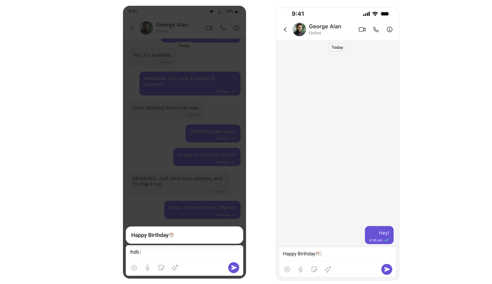

import Tabs from '@theme/Tabs';
import TabItem from '@theme/TabItem';

## Introduction

The ShortCutFormatter class extends the CometChatTextFormatter class to provide a mechanism for handling shortcuts within messages. This guide will walk you through the process of using ShortCutFormatter to implement shortcut extensions in your CometChat application.

## Setup

1. **Create the ShortCutFormatter Class**: Define the `ShortCutFormatter` class by extending the `CometChatTextFormatter` class.

<Tabs>
<TabItem value="swift" label="Swift">

```swift
class ShortcutFormatter: CometChatTextFormatter {

    private var messageShortcuts: [String: String] = [String: String]( )
    private var shortcuts: [CometChatUIKitSwift.SuggestionItem] = []

}
```

</TabItem>

</Tabs>

2. **initializer**: Sets the `trackingCharacter` to **'!'** in the initializer of the `ShortcutFormatter` class

<Tabs>

<TabItem value="swift" label="Swift">

```swift
   override init(trackingCharacter: Character) {
        super.init(trackingCharacter: "!")
    }
```

</TabItem>

</Tabs>

<!-- 3. **Define SuggestionItem Structure**: Create a `SuggestionItem` struct to encapsulate the properties of a suggestion in the `ShortcutFormatter` class.
<Tabs>
<TabItem value="swift" label="Swift">
   ```swift
  struct SuggestionItem {
    var id: String
    var title: String
    var subtitle: String?
    var data: Data?
    var imageURL: String?
}
    ```
</TabItem>

</Tabs> -->

3. **Prepare Regex**: Set the regular expression for shortcut detection in the `getRegex()` method of `ShortcutFormatter` class.

<Tabs>
<TabItem value="swift" label="Swift">

```swift
override func getRegex() -> String {
     return "(^|\\s)!\\w+"
}
```

</TabItem>

</Tabs>

4. **Prepare TrackingCharacter**: Define the `getTrackingCharacter()` method to return **'!'** as the shortcut tracking character in `ShortcutFormatter` class.

<Tabs>
<TabItem value="swift" label="Swift">

```swift
override func getTrackingCharacter() -> Character {
     return "!"
}
```

</TabItem>
</Tabs>

5. **Override Search Method**: Override the `search()` method to search for shortcuts based on the entered query.

<Tabs>
<TabItem value="swift" label="Swift">
  
```swift
override func search(string: String, suggestedItems: (([CometChatUIKitSwift.SuggestionItem]) -> ())? = nil) {
        
        if messageShortcuts.isEmpty == true {
            CometChat.callExtension(slug: "message-shortcuts", type: .get, endPoint: "v1/fetch", body: nil) { [weak self] extensionResponseData in
                guard let this = self else { return }
                if let shotCutData = extensionResponseData?["shortcuts"] as? [String: String] {
                    this.messageShortcuts = shotCutData
                    var suggestedItemsList = [CometChatUIKitSwift.SuggestionItem]()
                    this.messageShortcuts.forEach({ (key, value) in
                        if key.hasPrefix(string) {
                            suggestedItemsList.append(CometChatUIKitSwift.SuggestionItem(id: key, name: value, visibleText: value))
                        }
                    })
                    suggestedItems?(suggestedItemsList)
                }             
            } onError: { error in
                print("Error occured while fetcing shot cuts: \(error?.errorDescription)")
            }

        } else {
            var suggestedItemsList = [CometChatUIKitSwift.SuggestionItem]()
            messageShortcuts.forEach({ (key, value) in
                if key.hasPrefix(string) {
                    suggestedItemsList.append(CometChatUIKitSwift.SuggestionItem(id: key, name: value, visibleText: value))
                }
            })
      suggestedItems?(suggestedItemsList)
    }

}

````

</TabItem>

</Tabs>

6. **Handle prepareMessageString**: Implement the `prepareMessageString()` method to convert the base chat message into an attributed string for display in the `ShortcutFormatter` class.

<Tabs>
<TabItem value="swift" label="Swift">

```swift
override func prepareMessageString(baseMessage: BaseMessage, regexString: String, alignment: MessageBubbleAlignment = .left, formattingType: FormattingType) -> NSAttributedString {
let message = (baseMessage as? TextMessage)?.text ?? ""
return NSAttributedString(string: message)
}
````

</TabItem>

</Tabs>

7.  **Handle onTextTapped**: Override the `onTextTapped()` method if needed.

<Tabs>
<TabItem value="swift" label="Swift">
   ```swift
 override func onTextTapped(baseMessage: BaseMessage, tappedText: String, controller: UIViewController?) {
        // Your code here
}
    ```
</TabItem>

</Tabs>

- Below is an example of how a `ShortcutFormatter` Swift file might look:

```swift title='ShortcutFormatter.swift'
import Foundation
import CometChatSDK
import CometChatUIKitSwift

class ShortcutFormatter: CometChatTextFormatter {

    private var messageShortcuts: [String: String] = [String: String]()
    private var shortcuts: [CometChatUIKitSwift.SuggestionItem] = []

    override init(trackingCharacter: Character) {
        super.init(trackingCharacter: "!")
    }

    override func getRegex() -> String {
        return "(^|\\s)!\\w+"
    }

    override func getTrackingCharacter() -> Character {
        return "!"
    }

    override func search(string: String, suggestedItems: (([CometChatUIKitSwift.SuggestionItem]) -> ())? = nil) {

        if messageShortcuts.isEmpty == true {
            CometChat.callExtension(slug: "message-shortcuts", type: .get, endPoint: "v1/fetch", body: nil) { [weak self] extensionResponseData in
                guard let this = self else { return }
                if let shotCutData = extensionResponseData?["shortcuts"] as? [String: String] {
                    this.messageShortcuts = shotCutData
                    var suggestedItemsList = [CometChatUIKitSwift.SuggestionItem]()
                    this.messageShortcuts.forEach({ (key, value) in
                        if key.hasPrefix(string) {
                            suggestedItemsList.append(CometChatUIKitSwift.SuggestionItem(id: key, name: value, visibleText: value))
                        }
                    })
                    suggestedItems?(suggestedItemsList)
                }

            } onError: { error in
                print("Error occured while fetcing shot cuts: \(error?.errorDescription)")
            }

        } else {

            var suggestedItemsList = [CometChatUIKitSwift.SuggestionItem]()
            messageShortcuts.forEach({ (key, value) in
                if key.hasPrefix(string) {
                    suggestedItemsList.append(CometChatUIKitSwift.SuggestionItem(id: key, name: value, visibleText: value))
                }
            })
            suggestedItems?(suggestedItemsList)

        }

    }

    override func prepareMessageString(baseMessage: BaseMessage, regexString: String, alignment: MessageBubbleAlignment = .left, formattingType: FormattingType) -> NSAttributedString {
        let message = (baseMessage as? TextMessage)?.text ?? ""
        return NSAttributedString(string: message)
    }

    override func onTextTapped(baseMessage: BaseMessage, tappedText: String, controller: UIViewController?) {
        // Your code here
    }
}
```

## Usage

1. **Initialization**: Initialize an instance of `ShortCutFormatter` in your application.

<Tabs>
<TabItem value="swift" label="Swift">

```swift
let shortcutFormatter = ShortcutFormatter(trackingCharacter: "!")
```

</TabItem>

</Tabs>

2. **Integration**: Integrating the `ShortCutFormatter` into your CometChat application involves incorporating it within your project to handle message shortcuts. If you're utilizing the [CometChatMessageComposer](../05-Components/08-message-composer.md) component, you can seamlessly integrate the ShortCutFormatter to manage shortcut functionalities within your application.

- Your final integration code should look like this:

<Tabs>
<TabItem value="swift" label="Swift">

```swift
let shortcutFormatter = ShortcutFormatter(trackingCharacter: "!")
        
let cometChatMessageComposer = CometChatMessageComposer()
cometChatMessageComposer.set(textFormatter: [shortcutFormatter])
```

</TabItem>

</Tabs>

:::tip
Ensure to pass and present `cometChatConversationsWithMessages`. If a navigation controller is already in use, utilize the pushViewController function instead of directly presenting the view controller.
:::

## Example



