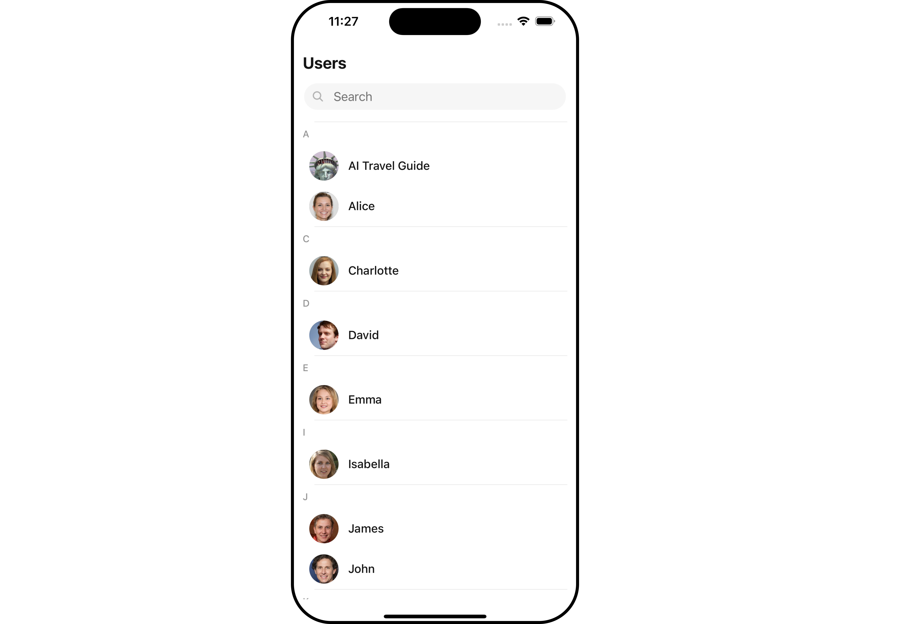

import Tabs from '@theme/Tabs';
import TabItem from '@theme/TabItem';

With CometChat's UI Kit for React Native, you can effortlessly build a chat app equipped with all the essential messaging features, along with customizable options tailored to your application requirements. This UI Kit comprises prebuilt UI components organized into smaller modules and components, each configurable to meet your specific needs.

<Tabs>
<TabItem value="ios" label="iOS">

</TabItem>
<TabItem value="android" label="Android">

</TabItem>
</Tabs>

  

    
<a class="button btn" style={{backgroundColor: '#7c55c9', color: 'white', textDecoration: 'underline'}} href="https://github.com/cometchat/cometchat-sample-app-react-native/tree/v4">React Native Sample App</a>

  

## Before Getting Started

Before you begin, it's essential to grasp the fundamental concepts and features offered by CometChat's APIs, SDK, and UI Kit. You can find detailed information in [Key Concepts](/fundamentals/key-concepts) documentation.

The UI Kit library comprises pre-built React Native Components for effortless integration and is built on top of the [React Native Chat SDK](/sdk/react-native/overview). Installing it will also include the core Chat SDK.

To begin, please follow the [Getting Started](./getting-started) guide.
