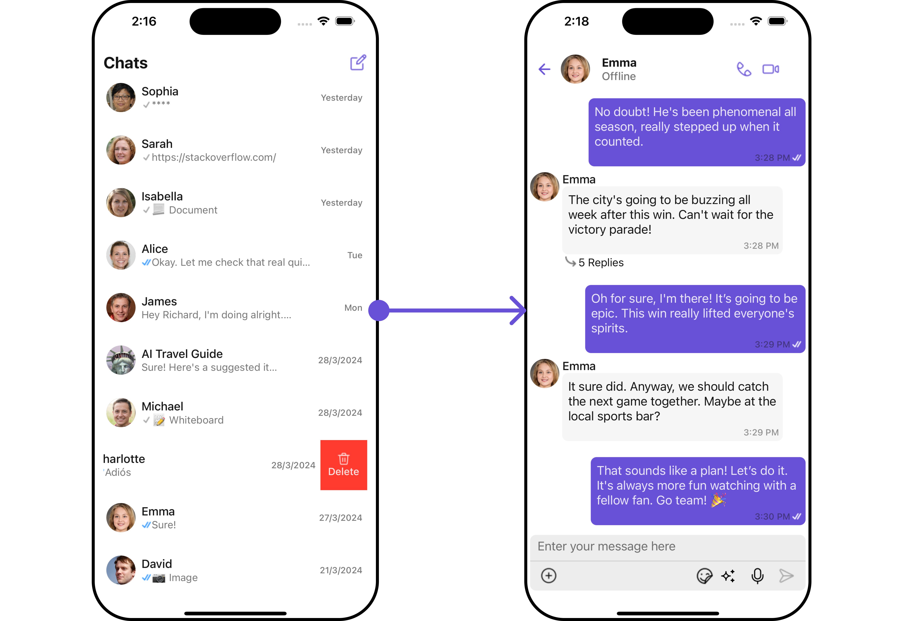
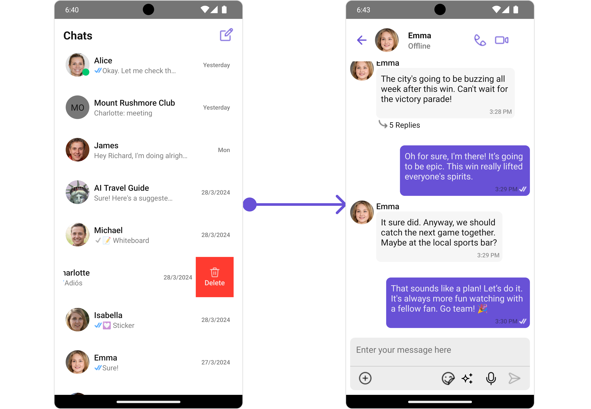

import Tabs from '@theme/Tabs';
import TabItem from '@theme/TabItem';

## Start your first conversation

CometChat UI Kit for React Native is a collection of prebuilt UI components designed to simplify the development of an in-app chat with all the essential messaging features. Our UI Kit offers light and dark themes, various fonts, colors, and additional customization options.

CometChat UI Kit supports both one-to-one and group conversations. Follow the guide below to initiate conversations from scratch using CometChat React Native UI Kit.

<Tabs>
<TabItem value="iOS" label="iOS">



</TabItem>
<TabItem value="android" label="Android">



</TabItem>
</Tabs>

## Prerequisites

Before installing **UI Kit for React Native**, you need to create a CometChat application on the CometChat Dashboard, which comprises everything required in a chat service including users, groups, calls & messages. You will need the `App ID` , `AuthKey`, `Region` of your CometChat application when initialising the SDK.

**i. Register on CometChat**

- To install **UI Kit for React Native**, you need to first register on **CometChat Dashboard**. [Click here to sign up](https://app.cometchat.com/login).

**ii. Get Your Application Keys**

- Create a **new app**
- Head over to the **QuickStart** or **API & Auth Keys section** and note the **App ID**, **Auth Key**, and **Region**.

:::tip Note

Each CometChat application can be integrated with a single client app. Within the same application, users can communicate with each other across all platforms, whether they are on mobile devices or on the web.

:::

**iii. IDE Setup**

The minimum requirements for **UI Kit for React Native** are:

- `Node 14 or later`
- JDK 11
- `Android Studio`
- `Xcode`
- `iOS 12.0 and later`

:::info

1. Go to finder -&gt; Applications -&gt; Xcode -&gt; Get Info
2. Click on `Open using Rosetta`

:::

---

## Getting Started

You can start building a modern messaging experience in your app by installing the new UI Kit. This developer kit is an add-on feature to CometChat React Native SDK.

---

<span style={{padding: '6px 15px', 'background-color': '#6851D6', color: 'white', 'border-radius': '15px', 'font-size': '0.9em', 'font-weight': 'bold'}}>Step 1</span>

### Create a project

To get started, open `terminal` and create a new project using below command.

<Tabs>
<TabItem value="bash" label="Bash">

```bash
npx react-native init ChatingApp
```

</TabItem>

</Tabs>

---

<span style={{padding: '6px 15px', 'background-color': '#6851D6', color: 'white', 'border-radius': '15px', 'font-size': '0.9em', 'font-weight': 'bold'}}>Step 2</span>

### Add Dependency

You can install **UI Kit for React Native** through using below command.

<Tabs>
<TabItem value="bash" label="Bash">

```bash
npm i @cometchat/chat-uikit-react-native
```

</TabItem>

</Tabs>

---

#### Other Dependencies

<Tabs>
<TabItem value="bash" label="Bash">

```bash
npm i @cometchat/chat-sdk-react-native
npm i @react-native-async-storage/async-storage@1.17.10
npm i @react-native-clipboard/clipboard@1.13.2
npm i @react-native-community/datetimepicker@7.6.4
```

</TabItem>
</Tabs>

:::info
If you are using React Native version **0.76** & above, you will need to install an additional package as below,

```bash
npm i dayjs
```

Also, you need to disable the new architecture in React Native.
- 1. iOS: This can be achieved by adding/updating the `RCT_NEW_ARCH_ENABLED` flag to `0` in the `ios/Podfile` file as below,

```
ENV['RCT_NEW_ARCH_ENABLED']='0'
```

- 2. Android: This can be achieved by adding/updating the `newArchEnabled` flag to `false` in the `android/gradle.properties` file as below,

```
newArchEnabled=false
```

:::

---

#### Add Permissions for android

Open `AndroidManifest.xml` file from `android/app/src/main` location and add below permissions

<Tabs>
<TabItem value="xml" label="XML">

```xml
<uses-permission android:name="android.permission.WRITE_EXTERNAL_STORAGE" />
<uses-permission android:name="android.permission.READ_EXTERNAL_STORAGE" />
<uses-permission android:name="android.permission.VIBRATE" />
<uses-permission android:name="android.permission.INTERNET" />
```

</TabItem>

</Tabs>

:::info
Please make sure Android SDK path is set in the `ANDROID_HOME` environment variable or in `local.properties` via the field `sdk.dir`.
:::

#### Install @cometchat/calls-sdk-react-native Package (Optional)

If you want calling functionality inside your application then you need to install calling SDK additionally inside your project.

:::warning Warning

React Native UI Kit supports Calls SDK V3 or higher.

:::

1. You can install `@cometchat/calls-sdk-react-native` Calling SDK for React Native using below command.

   <Tabs>
   <TabItem value="bash" label="Bash">

   ```bash
    npm i @cometchat/calls-sdk-react-native
   ```

   </TabItem>

   </Tabs>

2. Install dependancies required for call SDK to work

   <Tabs>
   <TabItem value="json" label="JSON">

   ```json
   // Dependencies required for calls sdk.
   {
     "@cometchat/chat-sdk-react-native": "^4.0.5",
     "@react-native-async-storage/async-storage": "^1.17.5",
     "@react-native-community/netinfo": "7.1.7", // for react-native 0.63 & above.
     "@react-native-community/netinfo": "6.1.0", // for react-native below 0.63
     "react-native-background-timer": "2.4.1",
     "react-native-callstats": "3.73.7",
     "react-native-webrtc": "1.106.1"
   }
   ```

   </TabItem>
   </Tabs>

3. Add permissions

   **Android:**

   <Tabs>
   <TabItem value="xml" label="XML">

   ```xml
   <uses-permission android:name="android.permission.INTERNET" />
   <uses-permission android:name="android.permission.CAMERA" />
   <uses-permission android:name="android.permission.MODIFY_AUDIO_SETTINGS" />
   <uses-permission android:name="android.permission.RECORD_AUDIO" />
   <uses-permission android:name="android.permission.ACCESS_NETWORK_STATE" />
   ```

   </TabItem>
   </Tabs>

   **IOS:**

   <Tabs>
   <TabItem value="xml" label="XML">

   ```xml
   <key>NSCameraUsageDescription</key>
   <string>This is for Camera permission</string>
   <key>NSMicrophoneUsageDescription</key>
   <string>This is for Mic permission</string>
   ```

   </TabItem>
   </Tabs>

---

<span style={{padding: '6px 15px', 'background-color': '#6851D6', color: 'white', 'border-radius': '15px', 'font-size': '0.9em', 'font-weight': 'bold'}}>Step 3</span>

## Initialise CometChatUIKit

To integrate and run CometChat UI Kit in your app, you need to initialize it beforehand.

The Init method initializes the settings required for CometChat. Please ensure to call this method before invoking any other methods from CometChat UI Kit or CometChat SDK.

:::info

The Auth Key is an optional property of the `UIKitSettings` Class. It is intended for use primarily during proof-of-concept (POC) development or in the early stages of application development. You can use the [Auth Token](/ui-kit/react-native/methods#how-to-login-a-user-with-auth-token) method to log in securely.

:::

<Tabs>
<TabItem value="ts" label="Typescript">

```typescript
import React, {useEffect} from 'react'
import { Platform, PermissionsAndroid } from 'react-native'
import { CometChatUIKit, UIKitSettings } from '@cometchat/chat-uikit-react-native'
import { CometChat } from '@cometchat/chat-sdk-react-native'

// add below code in App.js or App.tsx
const getPermissions = () => {
    if (Platform.OS == "android") {
      PermissionsAndroid.requestMultiple([
        PermissionsAndroid.PERMISSIONS.WRITE_EXTERNAL_STORAGE,
        PermissionsAndroid.PERMISSIONS.READ_EXTERNAL_STORAGE,
        PermissionsAndroid.PERMISSIONS.CAMERA,
        PermissionsAndroid.PERMISSIONS.RECORD_AUDIO,
      ]);
    }
}

  useEffect(() => {
    getPermissions();
    let uikitSettings : UIKitSettings= {
      appId: <!--Your appId goes here -->,
      authKey: <!-- your app authKey goes here -->,
      region: <!-- App region goes here -->,
      subscriptionType: CometChat.AppSettings.SUBSCRIPTION_TYPE_ALL_USERS,
    };

    CometChatUIKit.init(uikitSettings)
    .then(() => {
        console.log("CometChatUiKit successfully initialized")
    })
    .catch((error) => {
        console.log("Initialization failed with exception:", error)
    })
  },[]);
```

</TabItem>
</Tabs>

<span style={{padding: '6px 15px', 'background-color': '#6851D6', color: 'white', 'border-radius': '15px', 'font-size': '0.9em', 'font-weight': 'bold'}}>Step 4</span>

## Login User

For login, you require a UID. You can create your own users on the CometChat Dashboard or via API. We have pre-generated test users: cometchat-uid-1, cometchat-uid-2, cometchat-uid-3, cometchat-uid-4, cometchat-uid-5.

The Login method returns the User object containing all the information of the logged-in user.

:::info

This straightforward authentication method is ideal for proof-of-concept (POC) development or during the early stages of application development. For production environments, however, we strongly recommend using an [Auth Token](/ui-kit/react-native/methods#how-to-login-a-user-with-auth-token) instead of an Auth Key to ensure enhanced security.

:::

<Tabs>
<TabItem value="ts" label="Typescript">

```typescript
let uid = <# Enter User's UID Here #>

    CometChatUIKit.login({uid: uid})
			.then(user => {
                console.log("User logged in successfully  \(user.getName())")
      })
			.catch((error) => {
                console.log("Login failed with exception:", error)
       })
```

</TabItem>
</Tabs>

:::info Note

- We have set up 5 users for testing having UIDs: cometchat-uid-1, cometchat-uid-2, cometchat-uid-3, cometchat-uid-4, and cometchat-uid-5.

:::

---

<span style={{padding: '6px 15px', 'background-color': '#6851D6', color: 'white', 'border-radius': '15px', 'font-size': '0.9em', 'font-weight': 'bold'}}>Step 5</span>

## Render Conversation With Message

ConversationsWithMessages is a wrapper component that offers functionality to render both the Conversations and Messages components. It also enables opening the Messages by tapping on any conversation rendered in the list of conversations.

<Tabs>
<TabItem value="iOS" label="iOS">


</TabItem>
<TabItem value="android" label="Android">


</TabItem>
</Tabs>

<Tabs>
<TabItem value="jsx" label="JSX">

```jsx
<CometChatConversationsWithMessages />
```

</TabItem>
</Tabs>

:::info

It will automatically fetch the conversation data upon loading the list. If the conversation list is empty, you can start a new conversation.

:::

:::warning Warning

Make sure you add a [Privacy Manifest File](/ui-kit/react-native/apple-privacy-manifest-guide) to your app before going live

:::
