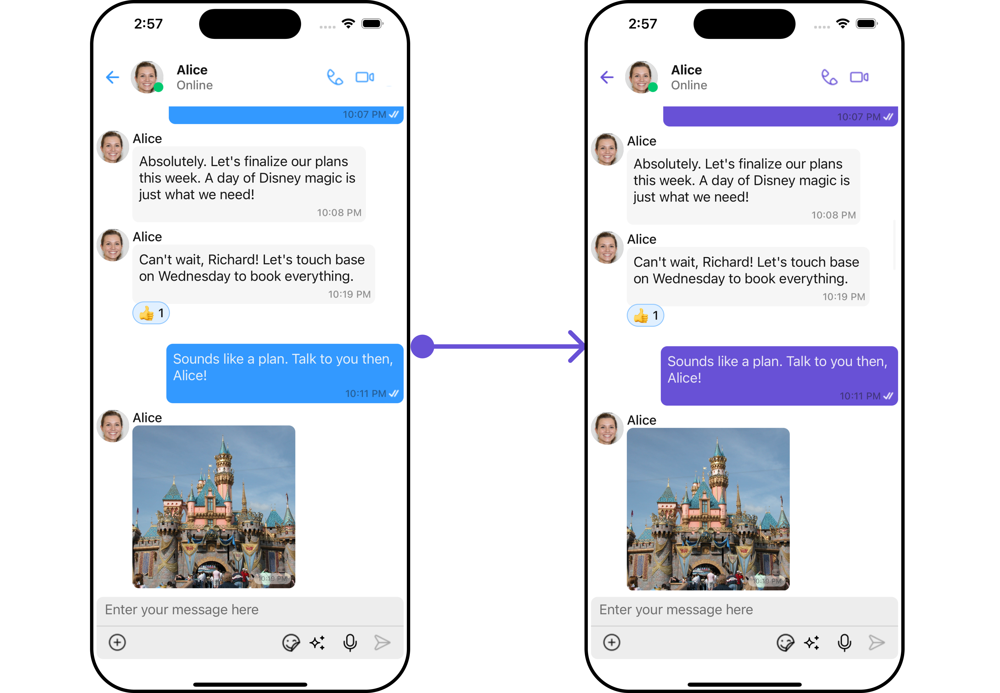
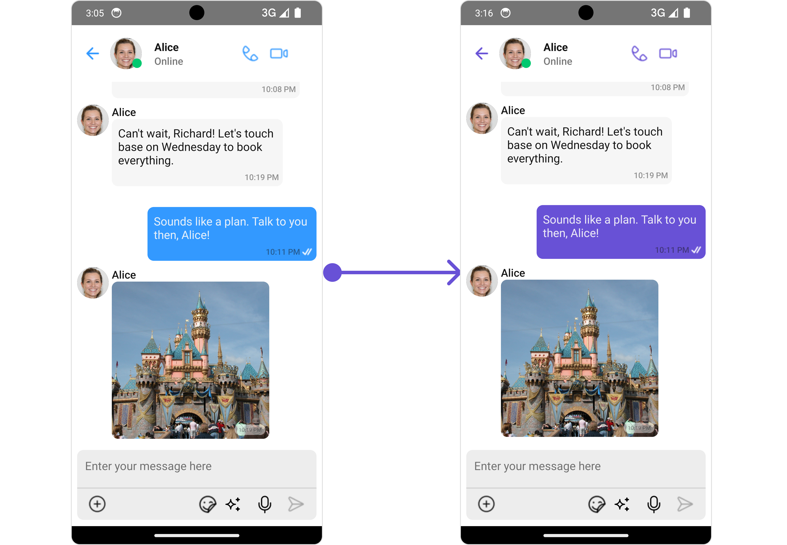
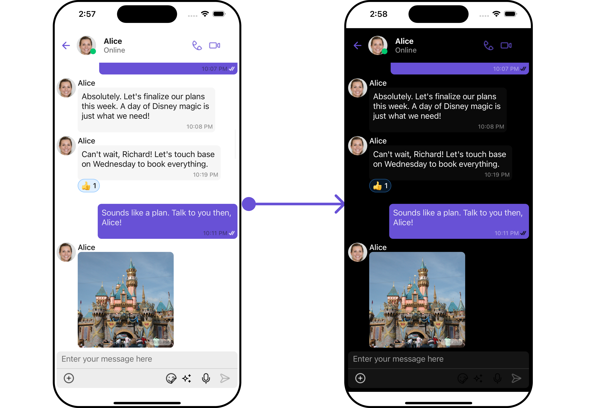
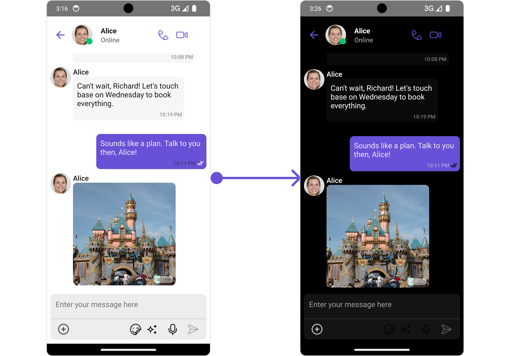

import Tabs from '@theme/Tabs';
import TabItem from '@theme/TabItem';

## Overview

The Theme is a style applied to every component of CometChat. When a style is applied as a theme, every view in the activity or every component in the UiKit will apply each property of the theme that it supports.

CometChat theme comprises two key components: Palette and Typography.

**Palette**: The Palette can be used to customize the color scheme of the CometChat theme, including background color, primary and secondary colors, error color, and various levels of accent colors.

**Typography**: Typography, which is also a singleton class, encompasses all the default Text Style's values. It allows you to customize the text appearances throughout the CometChat theme, such as heading, name, titles, subtitles, text, and captions.

## Usage

### **Palette**

The CometChat UI kit provides an easy way to customize the visual appearance of your chat application via the Palette class. This class contains several methods that allow you to modify the default color scheme of your app, imparting a unique look and feel that aligns with your branding or design guidelines.

Here's an overview of the different methods available in the Palette class:

| Props                                                 | Description                          |
| ----------------------------------------------------- | ------------------------------------ |
| **setBackground(\{"light": string, "dark": string})** | Change the default background colour |
| **setPrimary(\{"light": string, "dark": string})**    | Change the default primary colour    |
| **secondary(\{"light": string, "dark": string})**     | Change the default secondary colour  |
| **setError(\{"light": string, "dark": string})**      | Change the default error colour      |
| **setAccent(\{"light": string, "dark": string})**     | Change the default accent colour     |
| **setAccent50(\{"light": string, "dark": string})**   | Change the default accent50 colour   |
| **setAccent100(\{"light": string, "dark": string})**  | Change the default accent100 colour  |
| **setAccent200(\{"light": string, "dark": string})**  | Change the default accent200 colour  |
| **setAccent300(\{"light": string, "dark": string})**  | Change the default accent300 colour  |
| **setAccent400(\{"light": string, "dark": string})**  | Change the default accent400 colour  |
| **setAccent500(\{"light": string, "dark": string})**  | Change the default accent500 colour  |
| **setAccent600(\{"light": string, "dark": string})**  | Change the default accent600 colour  |
| **setAccent700(\{"light": string, "dark": string})**  | Change the default accent700 colour  |
| **setAccent800(\{"light": string, "dark": string})**  | Change the default accent800 colour  |
| **setAccent900(\{"light": string, "dark": string})**  | Change the default accent900 colour  |

**Example**

To match the theme of your app you will need to set primary , secondary and accent color using Pallate.

<Tabs>
<TabItem value="iOS" label="iOS">



</TabItem>
<TabItem value="android" label="Android">



</TabItem>
</Tabs>

<Tabs>
<TabItem value="ts2" label="Configure Theme">

```typescript
// initialize Palette class
let myTheme: CometChatTheme = new CometChatTheme({});
myTheme.palette.setPrimary({
  light: "#YourPrimaryColorForLighMode",
  dark: "#YourPrimaryColorForDarkMode",
});
myTheme.palette.setSecondary({
  light: "#YourSecondaryColorForLighMode",
  dark: "#YourSecondaryColorForDarkMode",
});
myTheme.palette.setAccent({
  light: "#YourAccentColorForLighMode",
  dark: "#YourAccentColorForDarkMode",
});
```

</TabItem>

<TabItem value="jsx" label="JSX">

```jsx
// initialize Palette class
return (
  <>
    <CometChatContextProvider theme={theme}>
      <CometChatConversationsWithMessages />
    </CometChatContextProvider>
  </>
);
```

</TabItem>

</Tabs>

Switching between Light and Dark modes in CometChat is quite simple by manipulating the mode property of the Palette class.

<Tabs>
<TabItem value="iOS" label="iOS">



</TabItem>
<TabItem value="android" label="Android">



</TabItem>

</Tabs>

<Tabs>

<TabItem value="ts" label="Typescript">

```typescript
let myTheme: CometChatTheme = new CometChatTheme({});
myTheme.palette.setMode("dark");
```

</TabItem>
</Tabs>

### **Typography**

The Typography class provides methods that allow you to change the default text styles in the CometChat theme as per your requirements.

Here are some of the methods provided by the Typography class:

| Props                   | Description                                |
| ----------------------- | ------------------------------------------ |
| setHeading(FontStyle)   | Use to set **Heading** text font style.    |
| setName(FontStyle)      | Use to set **Name** text font style.       |
| setTitle1(FontStyle)    | Use to set **Title 1** text font style.    |
| setTitle2(FontStyle)    | Use to set **Title 2** text font style.    |
| setSubtitle1(FontStyle) | Use to set **Subtitle 1** text font style. |
| setSubtitle2(FontStyle) | Use to set **Subtitle 2** text font style. |
| setText1(FontStyle)     | Use to set **Text 1** text font style.     |
| setText2(FontStyle)     | Use to set **Text 2** text font style.     |
| setCaption1(FontStyle)  | Use to set **Caption 1** text font style.  |
| setCaption2(FontStyle)  | Use to set **Caption 2** text font style.  |

To change Name TextStyle of the UiKit Theme Please refer to the code below :

<Tabs>
<TabItem value="ts2" label="Typescript">

```typescript
let myTheme: CometChatTheme = new CometChatTheme({});
myTheme.typography.setName({ fontSize: 22, fontWeight: "800" });
```

</TabItem>

</Tabs>

:::info

Similarly, to change other Text Styles for the Theme, you can refer to the above mentioned methods.

:::
